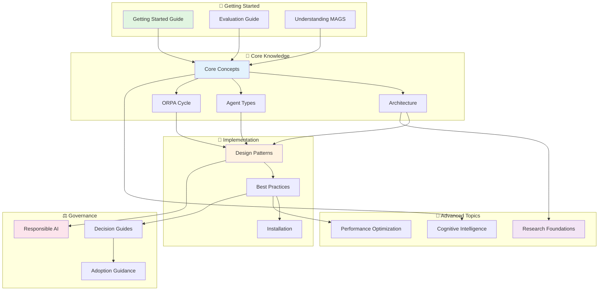

# XMPro Multi-Agent Generative Systems (MAGS)

> **An agentic business process runtime** where **independent AI agents work collaboratively in teams** to execute operational decisions and **optimize objectives** through **mathematical utility and objective functions** 24/7 **within bounded autonomy**.

---

## 🚀 What is MAGS?

XMPro MAGS deploys teams of AI agents that function as virtual workers, collaborating on operational tasks in industrial settings. Unlike LLM wrappers, MAGS is **~90% business process intelligence** (decision-making, planning, memory, optimization) and only **~10% LLM utility** (communication and explanation).

### 💡 What Makes MAGS Different?

> **Mathematical Optimization**: Agents optimize objectives through configurable utility and objective functions across business, technical, operational, quality, and safety domains
>
> **Bounded Autonomy**: 24/7 operation within policy constraints, governance frameworks, and escalation protocols
>
> **Hybrid Intelligence**: ~90% business process intelligence (decision-making, planning, memory) + ~10% LLM utility (communication)
>
> **Production Runtime**: Self-healing, 99.9% uptime, comprehensive observability, and tamper-resistant architecture
>
> → [Learn more about the architecture](docs/architecture/two-layer-framework.md)

**Research Foundation**: MAGS Cognitive Agents build on Stanford's "Generative Agents: Interactive Simulacra of Human Behavior" (Park et al., 2023), extending the observe-reflect-plan-act architecture for industrial applications. [[2304.03442] Generative Agents](https://arxiv.org/abs/2304.03442)

---

## 👥 Choose Your Path

### 🎯 I am a Business Executive
**Focus**: Business value, ROI, strategic fit

→ [Business Value & Use Cases](docs/use-cases/README.md) | [Case Studies](case-studies/README.md) | [When to Use MAGS](docs/decision-guides/README.md) | [ROI & Adoption](docs/adoption-guidance/README.md)

### 🏗️ I am a Solution Architect
**Focus**: Architecture, integration, design decisions

→ [Architecture Overview](docs/architecture/README.md) | [Integration Patterns](docs/integration/README.md) | [Decision Guides](docs/decision-guides/README.md) | [Framework Positioning](docs/strategic-positioning/README.md)

### 💻 I am a Developer
**Focus**: Implementation, APIs, code examples

→ [Getting Started](docs/getting-started/README.md) | [Design Patterns](docs/design-patterns/README.md) | [Technical Details](docs/technical-details/README.md) | [Agent Profiles](src/agent_profiles/README.md)

### 🔧 I am an Operations Engineer
**Focus**: Deployment, monitoring, troubleshooting

→ [Installation Guide](docs/installation.md) | [Performance Monitoring](docs/performance-optimization/README.md) | [Troubleshooting FAQ](docs/faq.md) | [Observability](docs/integration-execution/telemetry-observability.md)

---

## 📋 Quick Reference

| I want to... | Go here | Time |
|-------------|---------|------|
| Understand what MAGS is | [Understanding MAGS](docs/getting-started/understanding-mags.md) | 15 min |
| Evaluate if MAGS fits my needs | [Evaluation Guide](docs/getting-started/evaluation-guide.md) | 30 min |
| Learn about agent types | [Agent Types](docs/concepts/agent_types.md) | 20 min |
| See real-world examples | [Use Cases](docs/use-cases/README.md) | 45 min |
| Understand the architecture | [Architecture](docs/architecture/README.md) | 2 hours |
| Install and deploy | [Installation Guide](docs/installation.md) | 1-2 hours |
| Find implementation patterns | [Design Patterns](docs/design-patterns/README.md) | 3 hours |
| Optimize performance | [Performance Optimization](docs/performance-optimization/README.md) | 2 hours |
| Ensure compliance | [Responsible AI](docs/responsible-ai/README.md) | 1 hour |
| Look up terminology | [Glossary](docs/Glossary.md) | As needed |

---

## 🗺️ Content Navigator

---

## 🎓 Learning Paths

### 🌱 Beginner Path (2-4 hours)
**Goal**: Understand MAGS fundamentals and evaluate fit

1. [What is MAGS?](docs/getting-started/understanding-mags.md) → 15 min
2. [Agent Types](docs/concepts/agent_types.md) → 20 min
3. [ORPA Cycle](docs/concepts/orpa-cycle.md) → 30 min
4. [Use Cases](docs/use-cases/README.md) → 45 min
5. [Evaluation Guide](docs/getting-started/evaluation-guide.md) → 30 min
6. [First Steps](docs/getting-started/first-steps.md) → 30 min

### 🌿 Intermediate Path (1-2 days)
**Goal**: Design and implement MAGS solutions

1. [Architecture Overview](docs/architecture/README.md) → 2 hours
2. [Business Process Intelligence](docs/architecture/business-process-intelligence.md) → 1 hour
3. [Design Patterns](docs/design-patterns/README.md) → 3 hours
4. [Memory Systems](docs/concepts/memory-systems.md) → 1 hour
5. [Consensus Mechanisms](docs/concepts/consensus-mechanisms.md) → 1 hour
6. [Best Practices](docs/best-practices/README.md) → 2 hours
7. [Installation](docs/installation.md) → 2 hours

### 🌳 Advanced Path (1 week+)
**Goal**: Master MAGS architecture and optimization

1. [Research Foundations](docs/research-foundations/README.md) → 1 day
2. [Cognitive Intelligence](docs/cognitive-intelligence/README.md) → 2 days
3. [Decision Orchestration](docs/decision-orchestration/README.md) → 1 day
4. [Performance Optimization](docs/performance-optimization/README.md) → 1 day
5. [Integration Patterns](docs/integration/README.md) → 2 days
6. [Responsible AI](docs/responsible-ai/README.md) → 1 day

---

## 📚 Documentation Hub

### 🎯 Start Here (Foundation)
Essential reading for all users

- **[Getting Started](docs/getting-started)** - Onboarding paths for all roles (30 min - 2 hours)
  - [Evaluation Prompt](docs/getting-started/evaluation-prompt.md) - Interactive LLM assessment
  - [Understanding MAGS](docs/getting-started/understanding-mags.md) - Core concepts in plain language
  - [First Steps](docs/getting-started/first-steps.md) - Role-based learning paths

- **[Core Concepts](docs/concepts)** - Key MAGS concepts explained (1-3 hours)
  - [Agent Types](docs/concepts/agent_types.md) - Content, Cognitive, and Hybrid Cognitive agents
  - [ORPA Cycle](docs/concepts/orpa-cycle.md) - How agents think and act
  - [Memory Systems](docs/concepts/memory-systems.md) - How agents learn and remember
  - [Decision Making](docs/concepts/decision-making.md) - How agents make choices
  - [Consensus Mechanisms](docs/concepts/consensus-mechanisms.md) - How agents coordinate

- **[Architecture](docs/architecture)** - System design and framework (2-4 hours)
  - [Two-Layer Framework](docs/architecture/two-layer-framework.md) - Intelligence platform architecture
  - [Business Process Intelligence](docs/architecture/business-process-intelligence.md) - 15 core capabilities
  - [System Components](docs/architecture/system-components.md) - Technical architecture
  - [Agent Architecture](docs/architecture/agent_architecture.md) - Agent design patterns

### 🔨 Build & Deploy (Implementation)
Practical guidance for building MAGS solutions

- **[Design Patterns](docs/design-patterns)** - Proven implementation patterns
  - [Agent Team Patterns](docs/design-patterns/agent-team-patterns.md)
  - [Communication Patterns](docs/design-patterns/communication-patterns.md)
  - [Decision Patterns](docs/design-patterns/decision-patterns.md)
  - [Memory Patterns](docs/design-patterns/memory-patterns.md)

- **[Best Practices](docs/best-practices)** - Production-ready guidance
  - [Agent Design Principles](docs/best-practices/agent-design-principles.md)
  - [Team Composition](docs/best-practices/team-composition.md)
  - [Objective Function Design](docs/best-practices/objective-function-design.md)
  - [Testing Strategies](docs/best-practices/testing-strategies.md)

- **[Installation](docs/installation.md)** - Setup and deployment guide
  - [Docker Deployment](docs/installation/docker/README.md)
  - [Database Configuration](docs/installation.md)
  - [System Requirements](docs/installation.md)

- **[Agent Profiles](src/agent_profiles)** - Pre-built agent templates
  - Example profiles for various industrial scenarios
  - JSON configuration files

### 🧠 Advanced Topics (Deep Dive)
For architects and researchers

- **[Cognitive Intelligence](docs/cognitive-intelligence)** - Memory and learning systems
  - [Memory Management](docs/cognitive-intelligence/memory-management.md)
  - [Confidence Scoring](docs/cognitive-intelligence/confidence-scoring.md)
  - [Plan Adaptation](docs/cognitive-intelligence/plan-adaptation.md)
  - [Synthetic Memory](docs/cognitive-intelligence/synthetic-memory.md)

- **[Research Foundations](docs/research-foundations)** - Academic foundations (10 domains)
  - [Multi-Agent Systems](docs/research-foundations/multi-agent-systems.md)
  - [Decision Theory](docs/research-foundations/decision-theory.md)
  - [Cognitive Science](docs/research-foundations/cognitive-science.md)
  - [Automated Planning](docs/research-foundations/automated-planning.md)
  - [Distributed Systems](docs/research-foundations/distributed-systems.md)

- **[Performance Optimization](docs/performance-optimization)** - Tuning and optimization
  - [Goal Optimization](docs/performance-optimization/goal-optimization.md)
  - [Plan Optimization](docs/performance-optimization/plan-optimization.md)
  - [Performance Monitoring](docs/performance-optimization/performance-monitoring.md)

- **[Decision Orchestration](docs/decision-orchestration)** - Coordination and consensus
  - [Communication Framework](docs/decision-orchestration/communication-framework.md)
  - [Consensus Management](docs/decision-orchestration/consensus-management.md)
  - [Agent Lifecycle Governance](docs/decision-orchestration/agent-lifecycle-governance.md)

### 💼 Business & Strategy (Decision Support)
For executives and decision-makers

- **[Use Cases](docs/use-cases)** - Real-world applications with business outcomes
  - [Predictive Maintenance](docs/use-cases/predictive-maintenance.md)
  - [Process Optimization](docs/use-cases/process-optimization.md)
  - [Quality Management](docs/use-cases/quality-management.md)
  - [Root Cause Analysis](docs/use-cases/root-cause-analysis.md)
  - [Safety-Critical Operations](docs/use-cases/safety-critical-operations.md)

- **[Case Studies](case-studies)** - Detailed implementation examples
  - [Manufacturing Optimization](case-studies/manufacturing-optimization.md)

- **[Decision Guides](docs/decision-guides)** - When and how to use MAGS
  - [When NOT to Use MAGS](docs/decision-guides/when-not-to-use-mags.md)
  - [Migration Playbook](docs/decision-guides/migration-playbook.md)

- **[Adoption Guidance](docs/adoption-guidance)** - Implementation strategies
  - [Incremental Adoption](docs/adoption-guidance/incremental-adoption.md)
  - [Risk Mitigation Strategies](docs/adoption-guidance/risk-mitigation-strategies.md)

### ⚖️ Governance & Compliance (Responsible AI)
For compliance and governance teams

- **[Responsible AI](docs/responsible-ai)** - Policies, explainability, and oversight
  - [Policies](docs/responsible-ai/policies.md) - Deontic principles and rules of engagement
  - [Explainability](docs/responsible-ai/explainability.md) - Decision transparency
  - [Human-in-the-Loop](docs/responsible-ai/human-in-the-loop.md) - Human oversight patterns
  - [Compliance Mapping](docs/responsible-ai/compliance-mapping.md) - Regulatory alignment
  - [Regulatory Compliance Audit Trail](docs/responsible-ai/regulatory-compliance-audit-trail.md)

### 🔧 Technical Reference (Integration & Execution)
For developers and integrators

- **[Integration & Execution](docs/integration-execution)** - External interfaces
  - [DataStream Integration](docs/integration-execution/datastream-integration.md)
  - [Tool Orchestration](docs/integration-execution/tool-orchestration.md)
  - [Telemetry & Observability](docs/integration-execution/telemetry-observability.md)

- **[Integration Patterns](docs/integration)** - Integration approaches

- **[Technical Details](docs/technical-details)** - Technical explanations
  - [Memory Cycle](docs/technical-details/memory_cycle.md)
  - [Vector Database](docs/technical-details/vector_database.md)
  - [Agent Status Monitoring](docs/technical-details/agent_status_monitoring.md)
  - [OpenTelemetry Tracing](docs/technical-details/open_telemetry_tracing_guide.md)
  - [Prompt Injection Protection](docs/technical-details/prompt-injection-protection.md)

### 📖 Supporting Resources
Reference materials and standards

- **[Glossary](docs/Glossary.md)** - Comprehensive terminology reference (200+ terms)
- **[FAQ](docs/faq.md)** - Frequently Asked Questions
- **[Accessibility](docs/accessibility.md)** - Web accessibility guidelines
- **[Naming Conventions](docs/naming-conventions)** - Project naming standards

---

## 🌟 Key Features

- **APEX AgentOps**: [AgentOps](docs/concepts/agentopsapex.md) for scaling Multi-Agent Generative Systems in complex industrial environments
- **Decision Intelligence**: MAGS agents create [decision traces](docs/concepts/decision-traces.md) during ORPA cycles, feeding the DecisionGraph in XMPro AO Platform for precedent search, pattern discovery, and decision simulation
- **Adaptive Decision Making**: Agents create and modify plans to achieve goals, adapting to changing circumstances
- **Built-in Prompt Injection Protection**: Comprehensive safeguards through controlled UIs and architectural security. [Learn more](docs/concepts/prompt-injection.md)
- **Generative AI Agents**: Autonomous entities capable of recognizing patterns, generating predictions, and performing complex tasks
- **Real-time Integration**: Seamless connection with sensors, business applications, and data sources through XMPro Data Streams
- **Multi-Agent Collaboration**: AI agents functioning as virtual workers performing various operational roles
- **Scalable Architecture**: Deploy multiple agent teams based on operational needs and complexities

---

## 🏗️ Agent Types

MAGS supports three types of agents, each optimized for different tasks:

1. **[Content Agents](docs/concepts/agent_types.md)** - LLM-based information generation (~80-90% LLM)
   - Document creation, report generation, knowledge curation
   - Supervised operation with human review

2. **[Cognitive Agents](docs/concepts/agent_types.md)** - ORPA-based autonomous reasoning (~90% business intelligence, ~10% LLM)
   - Complex decision-making, planning, optimization
   - Continuous learning through memory systems
   - Production-grade autonomous operation

3. **[Hybrid Cognitive Agents](docs/concepts/agent_types.md)** - Combined capabilities
   - End-to-end workflows from analysis to documentation
   - Full ORPA cycle with enhanced content generation

See [Agent Types](docs/concepts/agent_types.md) for detailed comparison and use cases.

---

## 🔗 Related Frameworks

**Azure Cloud Adoption Framework**:
MAGS aligns with Microsoft's Azure CAF for AI Agents:
- See [Azure CAF Overview](docs/strategic-positioning/azure-caf-overview.md) for alignment details
- Enterprise-grade governance, security, and compliance
- For Azure-specific implementation, see separate Azure Integration Guide

**Framework Relationships**:
- See [Framework Relationships](docs/FRAMEWORK-RELATIONSHIPS.md) for positioning relative to other AI frameworks

---

## 📦 Repository Structure

- **[`/docs`](docs)** - Comprehensive documentation (see Documentation Hub above)
- **[`/src`](src)** - Source code and agent profile templates
- **[`/case-studies`](case-studies)** - Real-world implementation examples
- **[`/research`](research)** - Research papers and academic foundations

---

## 📧 Stay Updated

**The Digital Engineer Newsletter**

Pieter van Schalkwyk writes regularly about Multi-Agent Systems, Industrial AI, and Digital Transformation.

📧 Subscribe: [The Digital Engineer on LinkedIn](https://www.linkedin.com/build-relation/newsletter-follow?entityUrn=7107692183964585984)

---

## 📞 Contact & Support

For support, questions, or inquiries about the XMPro AI Agents project:

**Email**: support@xmpro.com

We value your feedback and are here to assist you with any issues or questions regarding our AI Agents and Multi-Agent systems.

---

## 📄 License

This project is licensed under the MIT License - see the [LICENSE](LICENSE) file for details.

> The MIT License is a permissive license that allows you to do anything you want with the code as long as you provide attribution back to XMPro and don't hold us liable.

**Important Legal Notice**: This repository contains open-source components licensed under the MIT License. However, the core XMPro AI agent technology, including its proprietary algorithms and implementations, remains the exclusive intellectual property of XMPro. The open-source materials provided herein serve as a framework and reference implementation, and do not grant any rights to XMPro's commercially protected, proprietary agent technology. Any use, reproduction, or distribution of XMPro's proprietary components is strictly prohibited without express written permission from XMPro.

---

## 📚 References

### Academic Research
- [[2304.03442] Generative Agents - Interactive Simulacra of Human Behavior (arxiv.org)](https://arxiv.org/abs/2304.03442)

### XMPro Blog Series
- [Part 1: From Railroads to AI - The Evolution of Game-Changing Utilities](https://xmpro.com/part-1-from-railroads-to-ai-the-evolution-of-game-changing-utilities/)
- [Part 2: The Future of Work - Harnessing Generative Agents in Manufacturing](https://xmpro.com/part2-the-future-of-work-harnessing-generative-agents-in-manufacturing/)
- [Part 3: AI at the Core - LLMs and Data Pipelines for Industrial Multi-Agent Generative Systems](https://xmpro.com/part-3-ai-at-the-core-llms-and-data-pipelines-for-industrial-multi-agent-generative-systems/)
- [Part 4: Pioneering Progress - Real-World Applications of Multi-Agent Generative Systems](https://xmpro.com/part-4-pioneering-progress-real-world-applications-of-multi-agent-generative-systems/)
- [Part 5: Rules of Engagement - Establishing Governance for Multi-Agent Generative Systems](https://xmpro.com/part-5-rules-of-engagement-establishing-governance-for-multi-agent-generative-systems/)

---

**We're excited to have you explore and contribute to the XMPro AI Agents project. Together, we're shaping the future of industrial AI!**
