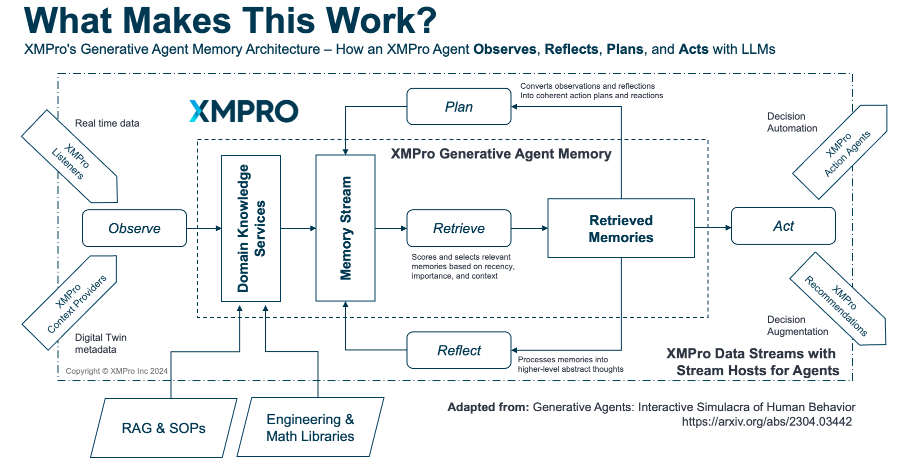

# XMPro Multi-Agent Generative Systems (MAGS)

Teams of specialised AI agents for continuous operational decision-making — within boundaries you define, with every decision explained and audited.

[](https://opensource.org/licenses/MIT)

---

## What is MAGS?

XMPro MAGS deploys structured teams of AI agents to handle operational decision-making in industrial environments. Unlike a single AI assistant, each agent on the team has a specific role, specific rules, and a single objective — a process monitor, an economist, a safety validator — working together continuously, 24/7.

**What makes it different:**

- **Separation of duties** — The agent that proposes an action is never the one that approves it. Safety validation is structurally independent from economic optimisation, by design.
- **Explainability** — Every decision includes documented reasoning. Operators can agree or challenge the logic; they are not accepting a black-box output.
- **Bounded autonomy** — Agents act only within limits your engineers approve. Anything outside those limits is escalated to a human immediately.
- **No rip-and-replace** — MAGS sits above your existing historians, SCADA, digital twins, and ERP systems, adding the decision-making layer those systems lack.

Unlike ML-based systems, MAGS agents reason from domain knowledge — engineering logic, economic rules, safety constraints — rather than patterns in historical data. There is no model to train or retrain when the process changes.

MAGS is **~90% business process intelligence** (decision-making, planning, memory, optimisation) and only **~10% LLM utility** (communication and explanation).

**Research foundation**: MAGS Cognitive Agents build on Stanford's [Generative Agents](https://arxiv.org/abs/2304.03442) (Park et al., 2023), extending the observe-reflect-plan-act (ORPA) architecture for industrial applications.



→ [Why MAGS](docs/concepts/whymags.md) · [Architecture](docs/architecture/two-layer-framework.md) · [When NOT to use MAGS](docs/decision-guides/when-not-to-use-mags.md)

---

## Choose Your Path

### 🎯 Business Executive
**Focus**: Business value, ROI, strategic fit

→ [Use Cases](docs/use-cases/README.md) | [Case Studies](case-studies/README.md) | [When to Use MAGS](docs/decision-guides/README.md) | [Adoption & ROI](docs/adoption-guidance/README.md) | [Business FAQ](docs/faq/business.md)

### 🏗️ Solution Architect
**Focus**: Architecture, integration, design decisions

→ [Architecture Overview](docs/architecture/README.md) | [Integration Patterns](docs/integration/README.md) | [Decision Guides](docs/decision-guides/README.md) | [Framework Positioning](docs/strategic-positioning/README.md) | [Architecture FAQ](docs/faq/architecture.md)

### 💻 Developer
**Focus**: Implementation, configuration, code examples

→ [Getting Started](docs/getting-started/README.md) | [Design Patterns](docs/design-patterns/README.md) | [Implementation Guides](docs/implementation-guides/README.md) | [Agent Profiles](src/agent_profiles/README.md)

### 🔧 Operations Engineer
**Focus**: Deployment, monitoring, troubleshooting

→ [Installation Guide](docs/installation.md) | [Performance Monitoring](docs/performance-optimization/README.md) | [Troubleshooting FAQ](docs/faq/technical.md) | [Observability](docs/integration-execution/telemetry-observability.md)

---

## Quick Reference

| I want to... | Go here |
|---|---|
| Understand what MAGS is | [Understanding MAGS](docs/getting-started/understanding-mags.md) |
| Evaluate if MAGS fits my needs | [Evaluation Guide](docs/getting-started/evaluation-guide.md) · [When NOT to Use MAGS](docs/decision-guides/when-not-to-use-mags.md) |
| Get quick answers to common questions | [FAQ Index](docs/faq/README.md) |
| Learn core concepts | [Core Concepts](docs/concepts/README.md) |
| See real-world examples | [Use Cases](docs/use-cases/README.md) · [Case Studies](case-studies/README.md) |
| Understand the architecture | [Architecture](docs/architecture/README.md) |
| Design a MAGS solution | [Best Practices](docs/best-practices/README.md) · [Design Patterns](docs/design-patterns/README.md) |
| Size and compose a team | [Team Size & Role Separation](docs/implementation-guides/team-size-role-separation.md) |
| Configure agents and teams | [Implementation Guides](docs/implementation-guides/README.md) |
| Write effective system prompts | [System Prompts](docs/implementation-guides/system-prompts.md) · [Providing Context to Agents](docs/implementation-guides/agent-context.md) |
| Avoid agent data interpretation errors | [Providing Context to Agents](docs/implementation-guides/agent-context.md) |
| Install and deploy | [Installation Guide](docs/installation.md) |
| Optimise performance | [Performance Optimization](docs/performance-optimization/README.md) |
| Ensure compliance | [Responsible AI](docs/responsible-ai/README.md) |
| Look up a term | [Glossary](docs/Glossary.md) |

---

## Documentation

### Foundation
*Start here if you're new to MAGS.*

- **[Getting Started](docs/getting-started)** — onboarding for all roles
  - [Understanding MAGS](docs/getting-started/understanding-mags.md) — core concepts in plain language
  - [Evaluation Guide](docs/getting-started/evaluation-guide.md) — is MAGS the right fit?
  - [First Steps](docs/getting-started/first-steps.md) — role-based next actions

- **[Core Concepts](docs/concepts)** — the ideas that underpin MAGS
  - [Agent Types](docs/concepts/agent_types.md) — Content, Cognitive, and Hybrid Cognitive
  - [ORPA Cycle](docs/concepts/orpa-cycle.md) — how agents observe, reflect, plan, and act
  - [Memory Systems](docs/concepts/memory-systems.md) — how agents learn and remember
  - [Decision Making](docs/concepts/decision-making.md) — how agents choose actions
  - [Consensus Mechanisms](docs/concepts/consensus-mechanisms.md) — how agents coordinate
  - [Profiles vs Instances](docs/concepts/profiles-vs-instances.md) — a critical architectural distinction
  - [Decision Traces](docs/concepts/decision-traces.md) — how decisions are recorded and reused
  - [AgentOps & APEX](docs/concepts/agentopsapex.md) — agent lifecycle management
  - [Prompt Injection](docs/concepts/prompt-injection.md) — risks and architectural safeguards

- **[Architecture](docs/architecture)** — system design
  - [Two-Layer Framework](docs/architecture/two-layer-framework.md) — business intelligence + LLM utility
  - [Business Process Intelligence](docs/architecture/business-process-intelligence.md) — 15 core capabilities
  - [System Components](docs/architecture/system-components.md) — technical architecture
  - [Agent Architecture](docs/architecture/agent_architecture.md) — agent design patterns

### Design & Build

- **[Design Patterns](docs/design-patterns)** — proven solutions for common problems
  - [Agent Team Patterns](docs/design-patterns/agent-team-patterns.md)
  - [Communication Patterns](docs/design-patterns/communication-patterns.md)
  - [Decision Patterns](docs/design-patterns/decision-patterns.md)
  - [Memory Patterns](docs/design-patterns/memory-patterns.md)

- **[Best Practices](docs/best-practices)** — strategic guidance for agent design
  - [Agent Design Principles](docs/best-practices/agent-design-principles.md)
  - [Team Composition](docs/best-practices/team-composition.md)
  - [Objective Function Design](docs/best-practices/objective-function-design.md)
  - [Testing Strategies](docs/best-practices/testing-strategies.md)

- **[Implementation Guides](docs/implementation-guides)** — tactical configuration
  - [System Prompts](docs/implementation-guides/system-prompts.md) — writing effective agent identity prompts
  - [Providing Context to Agents](docs/implementation-guides/agent-context.md) ⭐ — system prompt vs RAG, tag naming conventions, lessons from production
  - [Data Inventory](docs/implementation-guides/data-inventory.md) — inventory data before designing agents
  - [Behavioural Rules](docs/implementation-guides/behavioural-rules.md)
  - [Model Selection](docs/implementation-guides/model-selection.md)
  - [Team Size & Role Separation](docs/implementation-guides/team-size-role-separation.md)
  - [Constraint Configuration](docs/implementation-guides/constraint-configuration.md)
  - [Full index](docs/implementation-guides/README.md)

- **[Installation](docs/installation.md)** — setup and deployment
  - [Docker Deployment](docs/installation/docker/README.md)

- **[Agent Profiles](src/agent_profiles)** — pre-built templates for industrial scenarios

### Business & Strategy

- **[Use Cases](docs/use-cases)** — real-world applications with business outcomes
  - [Predictive Maintenance](docs/use-cases/predictive-maintenance.md)
  - [Process Optimisation](docs/use-cases/process-optimization.md)
  - [Quality Management](docs/use-cases/quality-management.md)
  - [Safety-Critical Operations](docs/use-cases/safety-critical-operations.md)
  - [Root Cause Analysis](docs/use-cases/root-cause-analysis.md)
  - [Compliance Management](docs/use-cases/compliance-management.md)

- **[Case Studies](case-studies)** — detailed implementation examples
  - [Manufacturing Optimisation](case-studies/manufacturing-optimization.md)

- **[Decision Guides](docs/decision-guides)** — when and how to use MAGS
  - [When NOT to Use MAGS](docs/decision-guides/when-not-to-use-mags.md)
  - [Migration Playbook](docs/decision-guides/migration-playbook.md)

- **[Adoption Guidance](docs/adoption-guidance)** — implementation strategies
  - [Incremental Adoption](docs/adoption-guidance/incremental-adoption.md)
  - [Risk Mitigation](docs/adoption-guidance/risk-mitigation-strategies.md)

### Governance & Compliance

- **[Responsible AI](docs/responsible-ai)** — policies, explainability, and oversight
  - [Policies](docs/responsible-ai/policies.md) — deontic principles and rules of engagement
  - [Explainability](docs/responsible-ai/explainability.md) — decision transparency
  - [Human-in-the-Loop](docs/responsible-ai/human-in-the-loop.md) — human oversight patterns
  - [Compliance Mapping](docs/responsible-ai/compliance-mapping.md) — regulatory alignment
  - [Audit Trail](docs/responsible-ai/regulatory-compliance-audit-trail.md)
  - [Prompt Injection Protection](docs/technical-details/prompt-injection-protection.md)

### Technical Reference

- **[Technical Details](docs/technical-details)** — in-depth specifications
  - [Memory Cycle](docs/technical-details/memory_cycle.md)
  - [Vector Database](docs/technical-details/vector_database.md)
  - [Agent Status Monitoring](docs/technical-details/agent_status_monitoring.md)
  - [OpenTelemetry Tracing](docs/technical-details/open_telemetry_tracing_guide.md)

- **[Integration & Execution](docs/integration-execution)** — external interfaces
  - [DataStream Integration](docs/integration-execution/datastream-integration.md)
  - [Tool Orchestration](docs/integration-execution/tool-orchestration.md)
  - [Telemetry & Observability](docs/integration-execution/telemetry-observability.md)

- **[Performance Optimisation](docs/performance-optimization)** — tuning and monitoring
- **[Cognitive Intelligence](docs/cognitive-intelligence)** — advanced memory and learning systems
- **[Decision Orchestration](docs/decision-orchestration)** — coordination and consensus
- **[Research Foundations](docs/research-foundations)** — academic basis across 10 domains

### Reference

- **[FAQ](docs/faq/)** — frequently asked questions
  - [Business FAQ](docs/faq/business.md) — what MAGS is, comparisons, trust & safety, value timelines
  - [Architecture FAQ](docs/faq/architecture.md) — team design, agent roles, capabilities & limits
  - [Technical FAQ](docs/faq/technical.md) — setup, databases, monitoring, troubleshooting
- **[Glossary](docs/Glossary.md)** — 200+ terms defined
- **[Framework Relationships](docs/FRAMEWORK-RELATIONSHIPS.md)** — positioning relative to other AI frameworks
- **[Azure CAF Alignment](docs/strategic-positioning/azure-caf-overview.md)** — enterprise governance alignment
- **[Naming Conventions](docs/naming-conventions)**
- **[Accessibility](docs/accessibility.md)**

---

## Repository Structure

```
/docs          — all documentation (28 topic areas)
/src           — agent profile templates and configuration examples
/case-studies  — real-world implementation case studies
/research      — [XMPro research papers](research/README.md) (cognitive architecture, utility functions, IP protection, executive guide)
```

---

## Stay Updated

Pieter van Schalkwyk writes regularly about Multi-Agent Systems, Industrial AI, and Digital Transformation.

📧 [The Digital Engineer — subscribe on LinkedIn](https://www.linkedin.com/build-relation/newsletter-follow?entityUrn=7107692183964585984)

For support or questions: [support@xmpro.com](mailto:support@xmpro.com)

---

## References

### XMPro Research Papers
- [Neuroscience-Inspired Cognitive Architecture for Multi-Agent Systems](research/2025.9.9_Neuroscience-Inspired%20Cognitive%20Architecture%20for%20Multi-Agent%20Systems.pdf) — September 2025
- [Utility Functions for Industrial Multi-Agent Systems](research/Utility_Function_Paper_Nov25.pdf) — November 2025
- [Senior Manager's Guide to MAGS](research/2025.10.22_Senior%20Managers%20Guide%20to%20MAGS.pdf) — October 2025
- [IP Protection for Industrial Agentic Systems](research/2026.02.02_IP_Protection_for_Industrial_Agentic_Systems.pdf) — February 2026

→ [Full research index with descriptions](research/README.md)

### Academic Research
- [Generative Agents: Interactive Simulacra of Human Behavior](https://arxiv.org/abs/2304.03442) — Park et al., 2023 (Stanford)

---

## Licence

Documentation and reference materials in this repository are licensed under the [MIT Licence](LICENSE).

The XMPro MAGS platform itself is commercial software. This repository provides documentation, frameworks, and reference implementation examples — not the proprietary runtime. Contact [support@xmpro.com](mailto:support@xmpro.com) for platform licensing.
