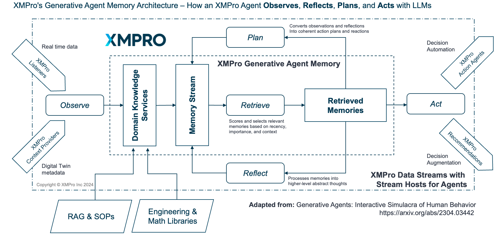

# XMPro AI Agents & Multi-Agent Repository

> Welcome to the official GitHub repository for XMPro's Multi-Agent Generative Systems (MAGS). This innovative technology represents a groundbreaking approach to industrial process optimization and advanced predictive maintenance, leveraging the power of AI to enhance operational efficiency and decision-making.

## Multi-Agent Generative Systems (MAGS)

XMPro MAGS deploys teams of AI agents that function as virtual workers, collaborating on operational tasks in industrial settings. Unlike LLM wrappers, MAGS is **~90% business process intelligence** (decision-making, planning, memory, optimization) and only **~10% LLM utility** (communication and explanation).

**What Makes MAGS Different**:
- Agents observe operations, learn from experience, and make autonomous decisions
- Teams coordinate through formal consensus mechanisms
- Sophisticated memory systems enable continuous improvement
- Research-grounded decision frameworks ensure optimal, explainable choices

**Three Agent Types**: [Content](docs/concepts/agent_types.md) (information management), [Decision](docs/concepts/agent_types.md) (autonomous reasoning), and [Hybrid](docs/concepts/agent_types.md) (combined capabilities). See [Agent Types](docs/concepts/agent_types.md) for details.

**Research Foundation**: MAGS Decision Agents build on Stanford's "Generative Agents: Interactive Simulacra of Human Behavior" (Park et al., 2023), extending the observe-reflect-plan-act architecture for industrial applications. [[2304.03442] Generative Agents](https://arxiv.org/abs/2304.03442)

## Key Features

- **APEX AgentOps**: [AgentOps](docs/concepts/agentopsapex.md) for Scaling Multi Agent Generative Systems in complex industrial environments
- **Adaptive Decision Making**: Agents can create and modify plans to achieve goals, adapting to changing circumstances in their environment.
- **Built-in Prompt Injection Protection**: Comprehensive safeguards against prompt injection through controlled UIs and architectural security. [Learn more](docs/concepts/prompt-injection.md)
- **Generative AI Agents**: Autonomous AI entities capable of recognizing patterns, generating predictions, and performing complex tasks.
- **Integration**: Seamless connection with real-time sensors, business applications, and other data sources through XMPro Data Streams, for continuous improvement in equipment failure prevention and process optimization.
- **Multi-Agent Collaboration**: AI agents functioning as virtual workers to perform various operational roles and tasks.
- **Real-time**: Execution of specialized functions such as reliability engineering and root cause analysis by agent teams.
- **Scalable architecture**: Capable of deploying multiple agent teams based on specific operational needs and complexities.

## Getting Started

**New to MAGS?** Start with the [Getting Started Guide](docs/getting-started/README.md)

**Quick Links**:
- [Evaluation Prompt](docs/getting-started/evaluation-prompt.md) - Interactive LLM assessment (recommended)
- [Evaluation Guide](docs/getting-started/evaluation-guide.md) - Detailed written assessment
- [Understanding MAGS](docs/getting-started/understanding-mags.md) - Core concepts in plain language
- [First Steps](docs/getting-started/first-steps.md) - Role-based learning paths

**Essential Reading**:
1. [Why MAGS is Different](docs/architecture/two-layer-framework.md) - The intelligence platform framework
2. [Agent Types](docs/concepts/agent_types.md) - Content, Decision, and Hybrid agents
3. [ORPA Cycle](docs/concepts/orpa-cycle.md) - How agents think and act
4. [Use Cases](docs/use-cases/README.md) - Real-world applications

**Technical Deep Dive**:
1. [15 Business Process Capabilities](docs/architecture/business-process-intelligence.md)
2. [Research Foundations](docs/research-foundations/README.md)
3. [Design Patterns](docs/design-patterns/README.md)
4. [Best Practices](docs/best-practices/README.md)

## Repository Structure
- [`/docs`](docs): Comprehensive documentation (see Documentation section for details)
- [`/src`](src): Source code for XMPro MAGS components

## Documentation

Our comprehensive documentation is organized in the `/docs` folder:

**Core Documentation**:
- [`/getting-started`](docs/getting-started): New user onboarding and evaluation
- [`/architecture`](docs/architecture): System architecture and framework positioning
- [`/concepts`](docs/concepts): Key concepts, ideas, and methodologies
- [`/research-foundations`](docs/research-foundations): Academic foundations across 10 research domains
- [`/use-cases`](docs/use-cases): Real-world application scenarios
- [`/design-patterns`](docs/design-patterns): Proven implementation patterns
- [`/best-practices`](docs/best-practices): Implementation guidance

**Capability Categories**:
- [`/cognitive-intelligence`](docs/cognitive-intelligence): Memory, learning, and adaptation
- [`/decision-orchestration`](docs/decision-orchestration): Coordination and consensus
- [`/performance-optimization`](docs/performance-optimization): Goals and optimization
- [`/integration-execution`](docs/integration-execution): External interfaces and execution

**Supporting Resources**:
- [`Glossary.md`](docs/Glossary.md): Comprehensive terminology reference
- [`/faq`](docs/faq.md): Frequently Asked Questions
- [`/installation`](docs/installation.md): Setup and deployment guide
- [`/accessibility`](docs/accessibility.md): Web accessibility guidelines
- [`/naming-conventions`](docs/naming-conventions): Project naming standards
- [`/technical-details`](docs/technical-details): Technical explanations

## Installation

To set up the XMPro AI Agents system, follow these main steps:

1. Ensure you have the pre-requisites installed and available
2. Configure the Neo4j graph database
    - Install system options
    - Load the prompt library
    - Load the tool library

For detailed installation instructions, please refer to the [Installation Guide](docs/installation.md).

## Agent Structure
For detailed information about our agent structure, including concepts, ideas, and methodologies, please refer to the [`/docs/concepts`](docs/concepts) directory. This section contains in-depth explanations of:
- Agent profiles and instances
- Multi-agent interaction paradigms
- Decision-making processes
- Memory and knowledge management
- Integration with XMPro Data Streams

## License

This project is licensed under the MIT License - see the [LICENSE](LICENSE) file for details.

> The MIT License is a permissive license that allows you to do anything you want with the code as long as you provide attribution back to XMPro and don't hold us liable.

**Important Legal Notice**: This repository contains open-source components licensed under the MIT License. However, it is essential to understand that the core XMPro AI agent technology, including its proprietary algorithms and implementations, remains the exclusive intellectual property of XMPro. The open-source materials provided herein serve as a framework and reference implementation, and do not grant any rights to XMPro's commercially protected, proprietary agent technology. Any use, reproduction, or distribution of XMPro's proprietary components is strictly prohibited without express written permission from XMPro.

## Stay Updated

**The Digital Engineer Newsletter**
Pieter van Schalkwyk writes regularly about Multi-Agent Systems, Industrial AI, and Digital Transformation.

📧 Subscribe: [The Digital Engineer on LinkedIn](https://www.linkedin.com/build-relation/newsletter-follow?entityUrn=7107692183964585984)

## Contact

For support, questions, or inquiries about the XMPro AI Agents project, please contact XMPro at:

Email: support@xmpro.com

We value your feedback and are here to assist you with any issues or questions you may have regarding our AI Agents and Multi-Agent systems.

## References

- [[2304.03442] Generative Agents - Interactive Simulacra of Human Behavior (arxiv.org)](https://arxiv.org/abs/2304.03442 "https://arxiv.org/abs/2304.03442")

- [Part 1: From Railroads to AI - The Evolution of Game-Changing Utilities](https://xmpro.com/part-1-from-railroads-to-ai-the-evolution-of-game-changing-utilities/)

- [Part 2: The Future of Work - Harnessing Generative Agents in Manufacturing](https://xmpro.com/part2-the-future-of-work-harnessing-generative-agents-in-manufacturing/)

- [Part 3: AI at the Core - LLMs and Data Pipelines for Industrial Multi-Agent Generative Systems](https://xmpro.com/part-3-ai-at-the-core-llms-and-data-pipelines-for-industrial-multi-agent-generative-systems/)

- [Part 4: Pioneering Progress - Real-World Applications of Multi-Agent Generative Systems](https://xmpro.com/part-4-pioneering-progress-real-world-applications-of-multi-agent-generative-systems/)

- [Part 5: Rules of Engagement - Establishing Governance for Multi-Agent Generative Systems](https://xmpro.com/part-5-rules-of-engagement-establishing-governance-for-multi-agent-generative-systems/)

---

We're excited to have you explore and contribute to the XMPro AI Agents project. Together, we're shaping the future of industrial AI!
