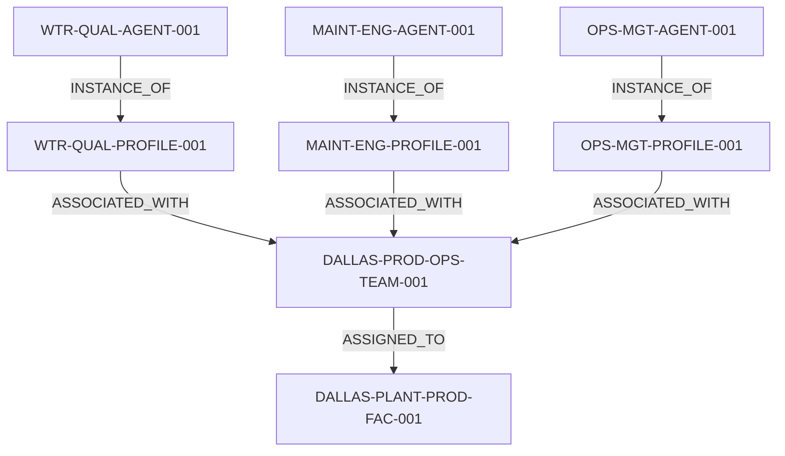

# XMPro AI Agents Architecture Documentation

Welcome to the architecture documentation for the XMPro AI Agents project. This folder contains various diagrams and explanations that illustrate the structure, components, and interactions within our system.

## Table of Contents

1. [Overview](#overview)
2. [Diagram Types](#diagram-types)
3. [Naming Convention Hierarchy](#naming-convention-hierarchy)
4. [Key Components](#key-components)
5. [Agent Architecture](#agent-architecture)
6. [Interaction Flows](#interaction-flows)
7. [Deployment Architecture](#deployment-architecture)

## Overview

The XMPro AI Agents system is designed to manage and coordinate multiple AI agents in industrial settings. The architecture is built to support scalability, flexibility, and efficient communication between various components.

## Diagram Types

This folder contains several types of diagrams, each serving a specific purpose in explaining our system architecture:

1. **Component Diagrams**: Show the high-level structure of the system and how different components interact.
2. **Sequence Diagrams**: Illustrate the flow of operations and interactions between system components over time.
3. **Class Diagrams**: Depict the structure of key classes in our object-oriented design.
4. **Deployment Diagrams**: Visualize how the system is deployed across hardware and software environments.

## Naming Convention Hierarchy

The following diagram illustrates the hierarchy of our naming convention, from Agent Instances up to Sites:

This diagram shows how Agent Instances (e.g., WTR-QUAL-AGENT-001) are instances of Agent Profiles (e.g., WTR-QUAL-PROFILE-001), which are associated with a Team (DALLAS-PROD-OPS-TEAM-001), which is in turn assigned to a Site (DALLAS-PLANT-PROD-FAC-001).

## Key Components

[Brief description of key components in the system, to be expanded]

## Agent Architecture

For a detailed explanation of our agent architecture, including the structure of AgentProfile and AgentInstance, please refer to the [Agent Architecture Documentation](agent_architecture.md).

## Interaction Flows

[Overview of main interaction flows within the system, to be expanded]

## Deployment Architecture

[Description of how the system is deployed, to be expanded]

For more detailed information on specific aspects of the architecture, please refer to the individual diagram files in this folder.