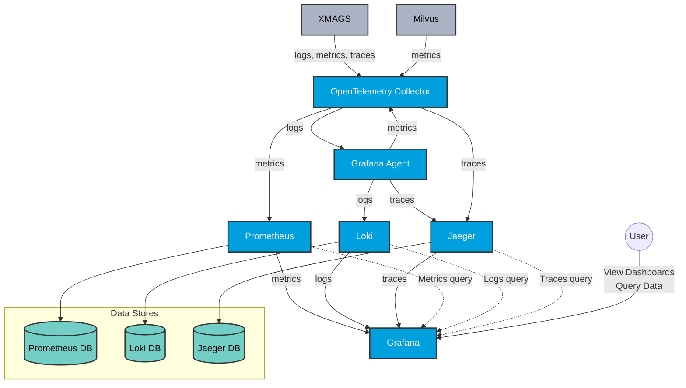
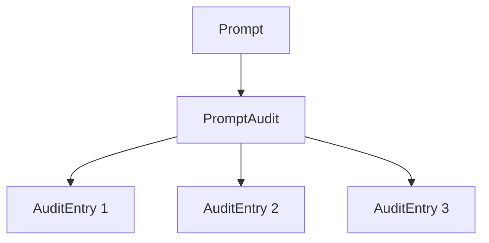

# XMPro AI Agents Architecture Documentation

Welcome to the architecture documentation for the XMPro AI Agents project. This folder contains various diagrams and explanations that illustrate the structure, components, and interactions within our system.

## Table of Contents

1. [Overview](#overview)
2. [Diagram Types](#diagram-types)
3. [Naming Convention Hierarchy](#naming-convention-hierarchy)
4. [Key Components](#key-components)
5. [Agent Architecture](#agent-architecture)
6. [Memory Cycle Instantiation](#memory-cycle-instantiation)
7. [Interaction Flows](#interaction-flows)
8. [Deployment Architecture](#deployment-architecture)
9. [Observability Architecture](#observability-architecture)
10. [Prompt Manager and Library](#prompt-manager-and-library)

## Overview

The XMPro AI Agents system is designed to manage and coordinate multiple AI agents in industrial settings. The architecture is built to support scalability, flexibility, and efficient communication between various components.

## Diagram Types

This folder contains several types of diagrams, each serving a specific purpose in explaining our system architecture:

1. **Component Diagrams**: Show the high-level structure of the system and how different components interact.
2. **Sequence Diagrams**: Illustrate the flow of operations and interactions between system components over time.
3. **Class Diagrams**: Depict the structure of key classes in our object-oriented design.
4. **Deployment Diagrams**: Visualize how the system is deployed across hardware and software environments.

## Naming Convention Hierarchy

The following diagram illustrates the hierarchy of our naming convention, from Agent Instances up to Sites:


## Key Components

- Agent Profiles
- Agent Instances
- Memory Cycle
- MQTT Manager
- Database Manager (Neo4j and Vector Database)
- Language Model
- Prompt Manager
- Planning Strategies

## Agent Architecture

For a detailed explanation of our agent architecture, including the structure of AgentProfile and AgentInstance, please refer to the [Agent Architecture Documentation](agent_architecture.md).

## Memory Cycle Instantiation

The Memory Cycle Instantiation process is a crucial part of our system. Here are the key diagrams illustrating this process:

### Overall Process Flow


### Core Components Interaction


### MQTT Startup Process


For more detailed information on the Memory Cycle Instantiation process, please refer to the [Memory Cycle Instantiation Documentation](../technical-details/memory_cycle_instantiation.md).

## Interaction Flows

[Overview of main interaction flows within the system, to be expanded]

## Deployment Architecture

[Description of how the system is deployed, to be expanded]

For more detailed information on specific aspects of the architecture, please refer to the individual diagram files in this folder.

## Observability Architecture
The following diagram illustrates our observability stack, showing how we collect, process, and visualize logs, metrics, and traces from our system:



This diagram shows how our system components (XMAGS and Milvus) interact with our observability stack:

- The OpenTelemetry Collector receives logs, metrics, and traces from our XMAGS system and metrics from Milvus.
- Grafana Agent collects additional logs and metrics.
- Data is processed and stored in Prometheus (for metrics), Loki (for logs), and Jaeger (for traces).
- Grafana provides a unified interface for visualizing and querying all this data.

For more detailed information on our observability practices, including our use of OpenTelemetry for tracing, please refer to the [Observability Documentation](../technical-details/open_telemetry_tracing_guide.md).

### Prompt Manager and Library

The Prompt Manager and Library is a crucial component of our system, providing a centralized repository for creating, storing, managing, and accessing all prompts used by our AI agents. It uses a root node structure for efficient organization and querying of prompts.

```mermaid
graph TD
    A[Library (Prompt)] --> B[Prompt 1]
    A --> C[Prompt 2]
    A --> D[Prompt 3]
    B --> E[Version 1]
    B --> F[Version 2]
    C --> G[Version 1]
    D --> H[Version 1]
    D --> I[Version 2]
    D --> J[Version 3]
```

### Audit Log System

The XMPro AI Agents system incorporates a robust audit log system to track changes and actions within the Prompt Library. This system is crucial for maintaining transparency, accountability, and traceability in prompt management operations.  Audit log entries are added when an entire prompt (all versions) is disabled/enabled.  All other changes cause a new version of a prompt to get created with logged creation date/time as well as the user.

#### Audit Log Structure

The audit log is implemented using a graph structure in Neo4j, with the following key elements:

1. **PromptAudit Node**: A central node that acts as a collection point for all audit entries related to a specific prompt.

2. **AuditEntry Node**: Individual entries that record specific changes or actions.

3. **Relationships**: The AuditEntry nodes are linked to both the PromptAudit node and the relevant Prompt node.



#### Audit Entry Properties

Each AuditEntry node contains the following information:

- `change`: Description of the action or change made (e.g., "Deactivated prompt")
- `user`: The user who performed the action
- `timestamp`: The date and time when the action occurred

For more detailed information on our prompt library implementation please refer to the [Prompt Manager and Library](../technical-details/prompt_manager.md).
