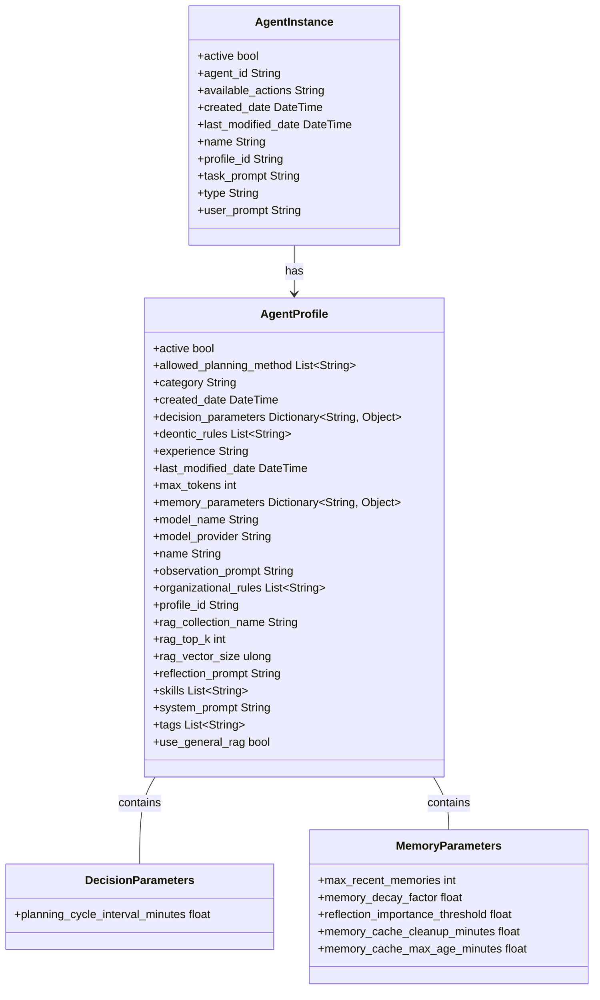

# Agent Architecture

## Table of Contents
1. [Introduction](#introduction)
2. [Agent Structure](#agent-structure)
3. [Component Descriptions](#component-descriptions)
4. [Relationships](#relationships)
5. [Memory Parameters in Detail](#memory-parameters-in-detail)

## Introduction

This document provides a detailed explanation of the agent architecture in the XMPro AI Agents system, focusing on the structure of Agent Profile and Agent Instance.

## Agent Structure

The following diagram illustrates the structure of Agent Profile and Agent Instance, along with their associated components:

## Component Descriptions

### Agent Profile

The Agent Profile class represents the template or blueprint for creating Agent Instances. It contains all the configuration parameters that define an agent's behavior, capabilities, and characteristics. The components of AgentProfile are organized into the following categories:

| Category | Components |
|----------|------------|
| Basic Information | name, profile_id, active status |
| Operational Parameters | max_tokens, model_provider, model_name |
| Cognitive Abilities | skills, experience, deontic_rules, organizational_rules |
| Interaction Settings | observation_prompt, reflection_prompt, system_prompt |
| RAG (Retrieval-Augmented Generation) Settings | rag_collection_name, rag_top_k, rag_vector_size, use_general_rag |
| Specialized Parameters | decision_parameters, memory_parameters |

Each of these components plays a crucial role in defining the agent's capabilities and behavior:

1. **Basic Information**: Provides fundamental identifiers and status of the agent profile.
2. **Operational Parameters**: Defines the technical constraints and model specifications for the agent.
3. **Cognitive Abilities**: Outlines the agent's skills, experience, and rule sets that govern its decision-making process.
4. **Interaction Settings**: Specifies how the agent interprets input and formulates responses.
5. **RAG Settings**: Configures the agent's ability to retrieve and utilize additional knowledge.
6. **Specialized Parameters**: Detailed configurations for decision-making and memory management.

### Agent Instance

The Agent Instance class represents a specific instantiation of an Agent Profile. It contains the current state and context of an individual agent. The components of AgentInstance are organized into the following categories:

| Category | Components |
|----------|------------|
| Identification | agent_id, profile_id |
| Temporal Information | created_at |
| Operational State | task_prompt, user_prompt |

Each of these components serves a specific purpose in defining the agent's current state:

1. **Identification**: 
   - `agent_id`: A unique identifier for this specific agent instance.
   - `profile_id`: Links the instance to its corresponding AgentProfile, inheriting all the profile's characteristics.

2. **Temporal Information**:
   - `created_at`: Timestamp indicating when this agent instance was created, useful for tracking the agent's lifespan and history.

3. **Operational State**:
   - `task_prompt`: Represents the task the agent is working on.
   - `user_prompt`: Stores the most recent input or query from the user, providing immediate context for the agent's actions.

An Agent Instance is linked to its corresponding Agent Profile, inheriting all the profile's characteristics while maintaining its own unique state and context. This allows for multiple instances of the same agent type (profile) to operate independently, each with its own current state and task focus.

### Specialized Parameter Classes

These classes provide detailed configurations for specific aspects of agent behavior:

1. **Decision Parameters**: Influences how the agent makes decisions.
   - `planning_cycle_interval_minutes`: Determines the agent's planning frequency when not influenced by other factors

2. **Memory Parameters**: Configures the agent's memory management capabilities.
   - `max_recent_memories`: Maximum number of recent memories to consider (default: 25).
   - `memory_cache_cleanup_minutes`: Interval between conversation cache cleanup operations (default: 5)
   - `memory_cache_max_age_minutes`: Maximum age of cached conversation memories (default: 30)
   - `memory_decay_factor`: Factor for memory importance decay over time (default: 0.998).
   - `reflection_importance_threshold`: Threshold for triggering reflections (default: 9).

## Memory Parameters in Detail

The Memory Parameters, part of the Agent Profile, play a crucial role in controlling the agent's memory and cognitive processes. These parameters can be adjusted when creating or modifying an agent profile to fine-tune the agent's behavior.

### Overview Table

| Parameter | Default Value | Description | Usage | Impact |
|-----------|---------------|-------------|-------|--------|
| memory_cache_cleanup_minutes | 5 | Interval between conversation cache cleanup operations | Controls how often the conversation cache is checked for expired entries | Higher values reduce system overhead but may keep stale conversation data longer |
| memory_cache_max_age_minutes | 30 | Maximum age of cached conversation memories | Determines when conversation memories become eligible for cleanup | Higher values keep conversation context longer but increase memory usage |
| max_recent_memories | 25 | Maximum number of recent memories to consider | Used in `CheckReflectionNeeded` and `ReflectAsync` methods | Balances between comprehensive memory analysis and computational efficiency |
| memory_decay_factor | 0.998 | Factor for memory importance decay over time | Used in `CheckReflectionNeeded` and `CalculateMemoryScore` methods | Affects how quickly the importance of memories diminishes, influencing long-term memory retention |
| reflection_importance_threshold | 9 | Threshold for triggering reflections | Used in `CheckReflectionNeeded` method | Influences how often the agent performs reflections based on accumulated memory importance |

### Conversation Memory Cache System

The conversation memory cache provides an efficient way to store and retrieve agent memories specifically during conversation interactions. This cache helps reduce database load when checking if new observations should be created from conversations, preventing redundant database queries within the same conversation context.

#### Purpose and Scope
- **Conversation-Specific**: Only used during conversation processing to determine if new observations should be created
- **Primary Use**: Within the `ShouldCreateObservation` method during conversation handling
- **Lifespan**: Temporary cache that maintains memory context during active conversations

### Main Memory Detailed Explanation

#### max_recent_memories (Default: 25)
This parameter is used in two methods within the `MemoryCycle` class:
1. In `CheckReflectionNeeded`, it limits the number of recent memories considered when determining if a reflection is needed.
2. In `ReflectAsync`, it's used to retrieve a set number of recent memories for the reflection process. The method actually retrieves twice this number (500) to allow for custom ranking before processing.

#### memory_decay_factor (Default: 0.998)
This decay factor is applied in two key areas:
1. In the `CheckReflectionNeeded` method, it's used to calculate the decayed importance of memories over time.
2. In the `CalculateMemoryScore` method, it's used to adjust the importance of memories based on how old they are.
This factor helps in prioritizing more recent memories while still retaining some influence from older, important memories.

#### reflection_importance_threshold (Default: 9)
This parameter is utilized in the `CheckReflectionNeeded` method of the `MemoryCycle` class. It determines when the accumulated importance of recent memories is significant enough to trigger a reflection process. When the sum of decayed importance scores for recent memories exceeds this threshold, a reflection is initiated.

### Adjusting Parameters in Agent Profiles

When creating or modifying an agent profile, these parameters can be set in the `MemoryParameters` dictionary. 

By adjusting these parameters, you can create agents with different memory characteristics. For instance:
- An agent with a higher `reflection_importance_threshold` will reflect less frequently but potentially more profoundly when it does.
- Adjusting the `memory_decay_factor` can make an agent more focused on recent events (lower value) or more influenced by long-term trends (higher value).
- Changing `max_recent_memories` affects the breadth of recent experience the agent considers, balancing between comprehensive analysis and efficiency.

### Conclusion

These memory parameters, as part of the agent profile, play a crucial role in defining an agent's cognitive behavior. They control how the agent manages its observations, when it reflects on its experiences, how quickly it forgets less important information, and how much of its recent history it considers in its decision-making processes. 

By allowing these parameters to be adjusted when creating or modifying agent profiles, the MAGS system provides a powerful mechanism for creating diverse agents with varying cognitive characteristics. This flexibility enables the creation of agents tailored to specific tasks, environments, or experimental scenarios, enhancing the versatility and effectiveness of the multi-agent system.
