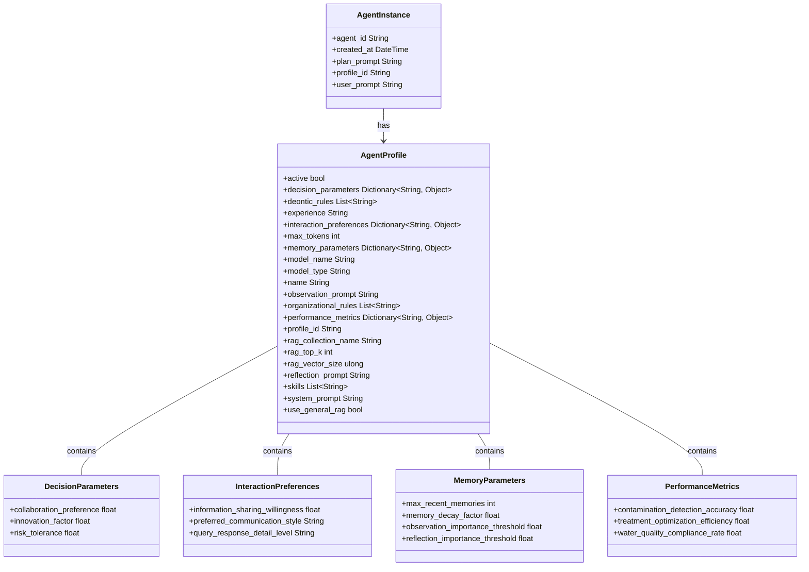

# Agent Architecture

This document provides a detailed explanation of the agent architecture in the XMPro AI Agents system, focusing on the structure of Agent Profile and Agent Instance.

## Agent Structure

The following diagram illustrates the structure of Agent Profile and Agent Instance, along with their associated components:

## Component Descriptions

### AgentProfile

The Agent Profile class represents the template or blueprint for creating Agent Instances. 

It contains all the configuration parameters that define an agent's behavior, capabilities, and characteristics. The components of Agent Profile are organized into the following categories:

| Category | Components |
|----------|------------|
| Basic Information | name, profile_id, active status |
| Operational Parameters | max_tokens, model_type, model_name |
| Cognitive Abilities | skills, experience, deontic_rules, organizational_rules |
| Interaction Settings | observation_prompt, reflection_prompt, system_prompt |
| RAG (Retrieval-Augmented Generation) Settings | rag_collection_name, rag_top_k, rag_vector_size, use_general_rag |
| Specialized Parameters | decision_parameters, interaction_preferences, memory_parameters, performance_metrics |

Each of these components plays a crucial role in defining the agent's capabilities and behavior:

1. **Basic Information**: Provides fundamental identifiers and status of the agent profile.
2. **Operational Parameters**: Defines the technical constraints and model specifications for the agent.
3. **Cognitive Abilities**: Outlines the agent's skills, experience, and rule sets that govern its decision-making process.
4. **Interaction Settings**: Specifies how the agent interprets input and formulates responses.
5. **RAG Settings**: Configures the agent's ability to retrieve and utilize additional knowledge.
6. **Specialized Parameters**: Detailed configurations for decision-making, interactions, memory management, and performance evaluation.

### AgentInstance

The Agent Instance class represents a specific instantiation of an Agent Profile. 

It contains the current state and context of an individual agent. The components of Agent Instance are organized into the following categories:

| Category | Components |
|----------|------------|
| Identification | agent_id, profile_id |
| Temporal Information | created_at |
| Operational State | plan_prompt, user_prompt |

Each of these components serves a specific purpose in defining the agent's current state:

1. **Identification**: 
   - `agent_id`: A unique identifier for this specific agent instance.
   - `profile_id`: Links the instance to its corresponding AgentProfile, inheriting all the profile's characteristics.

2. **Temporal Information**:
   - `created_at`: Timestamp indicating when this agent instance was created, useful for tracking the agent's lifespan and history.

3. **Operational State**:
   - `plan_prompt`: Represents the current plan or task the agent is working on.
   - `user_prompt`: Stores the most recent input or query from the user, providing immediate context for the agent's actions.

An AgentInstance is linked to its corresponding AgentProfile, inheriting all the profile's characteristics while maintaining its own unique state and context. This allows for multiple instances of the same agent type (profile) to operate independently, each with its own current state and task focus.

### Specialized Parameter Classes

These classes provide detailed configurations for specific aspects of agent behavior:

1. **DecisionParameters**: Influences how the agent makes decisions.
2. **InteractionPreferences**: Defines how the agent interacts with other agents or systems.
3. **MemoryParameters**: Configures the agent's memory management capabilities.
4. **PerformanceMetrics**: Tracks and evaluates the agent's performance in its designated tasks.

## Relationships

- Each Agent Instance is associated with one Agent Profile.
- Agent Profile contains (has a composition relationship with) DecisionParameters, InteractionPreferences, MemoryParameters, and PerformanceMetrics.

This structure allows for flexible and detailed configuration of agents, enabling the creation of specialized agents for various tasks while maintaining a consistent underlying architecture.