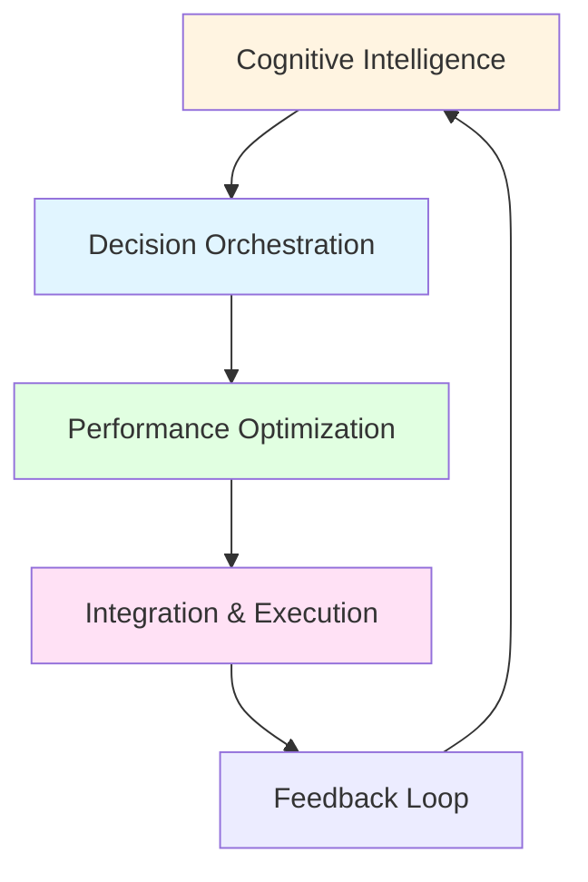
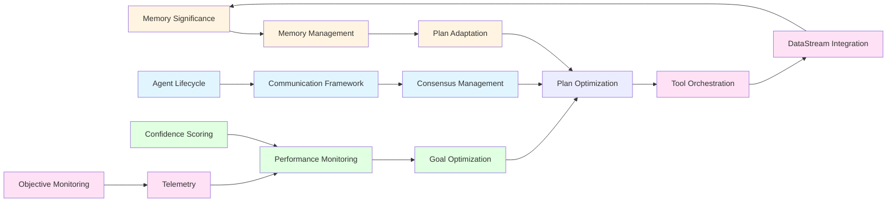

# Business Process Intelligence: The 15 Capabilities

## Overview

Business process intelligence is what distinguishes XMPro MAGS from LLM wrappers. While traditional agent frameworks rely on Large Language Models for decision-making, MAGS employs **15 specialized capabilities** grounded in 300+ years of research from economics, cognitive science, decision theory, and distributed systems.

These capabilities constitute the **~90% intelligence layer** that makes MAGS a true intelligence platform rather than a text generation system with business logic wrapped around it.

### What Constitutes Business Process Intelligence

Business process intelligence is the ability to:
- **Perceive**: Identify what information is important and why
- **Remember**: Store and retrieve relevant context efficiently
- **Reason**: Analyze complex relationships and causal chains
- **Decide**: Optimize outcomes based on multiple objectives
- **Coordinate**: Align decisions across multiple agents
- **Learn**: Improve strategies based on real-world outcomes
- **Execute**: Interact reliably with real-world systems
- **Adapt**: Respond to changing conditions dynamically

### Why These Capabilities Matter

Industrial operations require:
- **Reliability**: Consistent, deterministic decisions
- **Explainability**: Transparent reasoning for regulatory compliance
- **Domain Expertise**: Specialized knowledge beyond general training data
- **Continuous Improvement**: Learning from outcomes, not just training
- **Coordination**: Multi-agent collaboration with accountability
- **Real-Time Response**: Integration with operational systems

LLMs alone cannot provide these capabilities. They require sophisticated business process intelligence built on established theoretical foundations.

---

## The Four Capability Categories

The 15 capabilities are organized into four categories that mirror the complete lifecycle of intelligent industrial operations:

1. **Cognitive Intelligence**: Foundation of intelligent behavior
2. **Decision Orchestration**: Coordination and governance
3. **Performance Optimization**: Goal achievement and improvement
4. **Integration & Execution**: Real-world interaction and monitoring

---

## Category 1: Cognitive Intelligence (4 Capabilities)

The foundation of intelligent behavior—how agents perceive, remember, and learn.

### Capability 1: Memory Significance & Synthetic Memory

**What It Does**: Determines what information is important and creates higher-level insights from experiences.

**Theoretical Foundation**:
- **Shannon's Information Theory (1948)**: Rare events carry more information
- **Attention Economics (Herbert Simon, 1971)**: Attention is the scarce resource
- **Prospect Theory (Kahneman & Tversky, 1979)**: Context-dependent evaluation
- **Ebbinghaus Forgetting Curve (1885)**: Exponential memory decay
- **Metacognition (Flavell, 1979)**: Thinking about thinking

**Why It Matters**:
Industrial systems generate massive amounts of data. Without intelligent significance scoring, agents would be overwhelmed by information noise. This capability enables agents to:
- Focus on critical events and patterns
- Ignore routine, expected behavior
- Identify anomalies in context
- Build domain knowledge from experiences
- Create abstract principles from specific cases

**Key Concepts**:
- **Semantic Novelty**: How different is this from past experiences?
- **Activity Context**: When did this occur (busy vs. quiet periods)?
- **Frequency Patterns**: How often does this happen?
- **Temporal Recency**: How recent is this information?
- **Historical Importance**: What was its past significance?

**Design Patterns**:
- **High Significance Thresholds**: For stable, well-understood processes
- **Lower Significance Thresholds**: For dynamic, learning environments
- **Context-Specific Adjustments**: Different thresholds for different domains

**Use Cases**:
- Anomaly detection in manufacturing
- Quality control monitoring
- Predictive maintenance triggers
- Process optimization opportunities

[Learn more →](../cognitive-intelligence/memory-significance.md)

---

### Capability 2: Content-Specific Processing

**What It Does**: Interprets data in domain context with specialized understanding.

**Theoretical Foundation**:
- **Domain-Specialized Language Models**: Gartner-identified trend for industrial AI
- **Transfer Learning**: Leveraging general knowledge for specific domains
- **Semantic Understanding**: Context-aware interpretation

**Why It Matters**:
Generic AI models lack the specialized knowledge required for industrial operations. This capability enables:
- Accurate interpretation of technical terminology
- Understanding of domain-specific rules and constraints
- Recognition of industry-standard patterns
- Compliance with regulatory requirements
- Context-appropriate responses

**Key Concepts**:
- **Domain Adaptation**: Specializing general models for specific industries
- **Context Management**: Maintaining domain context across interactions
- **Multi-Domain Support**: Handling multiple specializations simultaneously

**Domain Specialization Areas**:
- **Manufacturing**: Equipment terminology, process understanding, quality metrics
- **Pharmaceuticals**: Regulatory compliance, quality assurance, validation
- **Energy & Utilities**: Asset management, reliability engineering, safety protocols
- **Process Industries**: Batch processing, continuous operations, optimization

**Design Patterns**:
- **Domain Knowledge Integration**: Incorporating industry-specific rules
- **Context Switching**: Managing transitions between domains
- **Hybrid Approaches**: Balancing general and specialized knowledge

**Use Cases**:
- Regulatory compliance monitoring
- Technical documentation generation
- Process optimization recommendations
- Quality control analysis

[Learn more →](../cognitive-intelligence/content-processing.md)

---

### Capability 3: Memory Management & Retrieval

**What It Does**: Manages the lifecycle of memories and retrieves relevant context efficiently.

**Theoretical Foundation**:
- **Atkinson-Shiffrin Memory Model (1968)**: Multi-store memory system
- **Tulving's Memory Types (1972)**: Episodic vs. semantic memory
- **Murdock's Recency Effect (1962)**: Temporal proximity affects retrieval
- **Vector Space Models (Salton & McGill, 1983)**: Semantic similarity search

**Why It Matters**:
Effective decision-making requires balancing recent context with historical knowledge. This capability enables:
- Fast access to relevant information
- Efficient storage of large knowledge bases
- Context-aware retrieval
- Appropriate memory consolidation
- Intelligent cleanup and archiving

**Key Concepts**:
- **Short-Term Memory**: Recent observations, active context, working memory
- **Long-Term Memory**: Consolidated knowledge, historical patterns, domain expertise
- **Episodic Memory**: Time-stamped events, temporal sequences, causal chains
- **Semantic Memory**: General knowledge, patterns, principles

**Memory Lifecycle**:
1. **Observation**: Initial memory creation with significance scoring
2. **Consolidation**: Reflection and synthesis into long-term storage
3. **Retrieval**: Context-aware access with relevance ranking
4. **Decay**: Importance-based cleanup and archiving

**Retrieval Strategies**:
- **Similarity-Based**: Vector similarity search for semantic matching
- **Temporal**: Time-based queries for sequence reconstruction
- **Relationship-Based**: Graph traversal for causal chain following

**Design Patterns**:
- **Memory Consolidation**: When to move from short to long-term
- **Retrieval Optimization**: Balancing speed vs. comprehensiveness
- **Capacity Management**: Cleanup strategies and archive policies

**Use Cases**:
- Historical trend analysis
- Root cause investigation
- Pattern recognition
- Predictive analytics

[Learn more →](../cognitive-intelligence/memory-management.md)

---

### Capability 4: Plan Adaptation & Change Detection

**What It Does**: Detects when plans need adjustment and triggers appropriate adaptations.

**Theoretical Foundation**:
- **Adaptive Control Systems**: Model Reference Adaptive Control (MRAC)
- **PID Control Concepts**: Error correction through feedback
- **Control Theory**: Feedback loops for continuous improvement

**Why It Matters**:
Industrial environments are dynamic. Plans that worked yesterday may not work today. This capability enables:
- Detection of plan deviations
- Identification of change causes
- Appropriate adaptation strategies
- Resilience to disruptions
- Continuous plan improvement

**Key Concepts**:
- **Change Detection**: Environmental shifts, performance deviations, new information
- **Adaptation Strategies**: Minor adjustments, plan modifications, complete replanning
- **Adaptation Triggers**: Threshold-based, event-based, time-based

**Change Types**:
- **Environmental Changes**: External condition shifts, resource availability
- **Performance Deviations**: Objective function changes, unexpected outcomes
- **New Information**: Updated knowledge, changed priorities, new constraints

**Adaptation Approaches**:
- **Minor Adjustments**: Parameter tuning, timing modifications
- **Plan Modification**: Task reordering, alternative approaches
- **Complete Replanning**: Fundamental changes, new objectives

**Design Patterns**:
- **Adaptation Frequency**: Continuous monitoring vs. periodic review
- **Adaptation Scope**: Local adjustments vs. global replanning
- **Trigger Design**: Single-factor vs. multi-factor triggers

**Use Cases**:
- Process optimization under changing conditions
- Predictive maintenance schedule adjustments
- Quality control response to deviations
- Emergency response coordination

[Learn more →](../cognitive-intelligence/plan-adaptation.md)

---

## Category 2: Decision Orchestration (3 Capabilities)

Coordinating decisions across multiple agents and ensuring governance.

### Capability 5: Consensus Management

**What It Does**: Coordinates decisions across multiple agents to reach agreement.

**Theoretical Foundation**:
- **Byzantine Fault Tolerance (Lamport et al., 1982)**: Consensus despite failures
- **Nash Equilibrium (1950)**: Fair compromise in multi-agent scenarios
- **Paxos (Lamport, 1998)**: Consensus in asynchronous systems
- **Raft (Ongaro & Ousterhout, 2014)**: Understandable consensus

**Why It Matters**:
Industrial operations often require multiple agents to agree on decisions. This capability enables:
- Distributed decision-making with accountability
- Fault-tolerant coordination
- Fair compromise between competing objectives
- Conflict resolution mechanisms
- Scalable multi-agent systems

**Key Concepts**:
- **Consensus Protocols**: Majority, weighted, unanimous voting
- **Round-Based Consensus**: Multiple rounds with conflict detection
- **Participation Tracking**: Monitoring agent involvement
- **Conflict Resolution**: Handling disagreements systematically

**Consensus Types**:
- **Majority Voting**: Simple majority decides
- **Weighted Consensus**: Votes weighted by expertise or authority
- **Unanimous Agreement**: All agents must agree
- **Hybrid Approaches**: Combining multiple methods

**Design Patterns**:
- **Protocol Selection**: Choosing appropriate consensus mechanism
- **Timeout Handling**: Managing non-responsive agents
- **Conflict Resolution**: Strategies for breaking deadlocks

**Use Cases**:
- Multi-agent quality control decisions
- Coordinated maintenance scheduling
- Distributed process optimization
- Emergency response coordination

[Learn more →](../decision-orchestration/consensus-management.md)

---

### Capability 6: Communication Framework

**What It Does**: Enables sophisticated inter-agent communication and coordination.

**Theoretical Foundation**:
- **Multi-Agent Systems Theory**: Agent communication languages
- **Message Passing**: Asynchronous communication patterns
- **Protocol Design**: Structured interaction patterns

**Why It Matters**:
Complex problems require agent collaboration. This capability enables:
- Sophisticated information sharing
- Coordinated action execution
- Request-response patterns
- Broadcast and multicast communication
- Interoperability with external agents

**Key Concepts**:
- **Message Types**: Observations, requests, responses, notifications
- **Communication Patterns**: Point-to-point, broadcast, publish-subscribe
- **Protocol Standards**: MQTT, DDS for industrial environments
- **Interoperability**: Integration with external agent frameworks

**Communication Patterns**:
- **Request-Response**: Direct agent-to-agent queries
- **Publish-Subscribe**: Event-driven information sharing
- **Broadcast**: System-wide announcements
- **Multicast**: Group-specific communication

**Design Patterns**:
- **Message Routing**: Efficient delivery to relevant agents
- **Protocol Selection**: Choosing appropriate communication method
- **Error Handling**: Managing communication failures
- **Interoperability**: Integrating "contractor" agents from other frameworks

**Use Cases**:
- Coordinated process control
- Distributed monitoring and alerting
- Multi-agent problem solving
- Cross-system integration

[Learn more →](../decision-orchestration/communication-framework.md)

---

### Capability 7: Agent Lifecycle & Governance

**What It Does**: Manages agent states and ensures compliance with rules and policies.

**Theoretical Foundation**:
- **Deontic Logic**: Logic of obligation, permission, and prohibition
- **Organizational Theory**: Hierarchies and authority structures
- **Compliance Management**: Rule enforcement and auditing

**Why It Matters**:
Industrial operations require accountability and compliance. This capability enables:
- Rule-based behavior constraints
- Policy enforcement
- Audit trails for decisions
- State management and monitoring
- Regulatory compliance

**Key Concepts**:
- **Deontic Rules**: Obligations, permissions, prohibitions
- **Organizational Policies**: Company-specific constraints
- **State Management**: Agent lifecycle tracking
- **Compliance Monitoring**: Rule adherence verification

**Governance Mechanisms**:
- **Rule Enforcement**: Preventing prohibited actions
- **Policy Compliance**: Ensuring alignment with organizational rules
- **Audit Trails**: Recording decisions and actions
- **State Transitions**: Managing agent lifecycle

**Design Patterns**:
- **Rule Hierarchies**: Organizing rules by priority
- **Conflict Resolution**: Handling rule conflicts
- **Exception Handling**: Managing rule violations
- **Audit Design**: Capturing appropriate decision context

**Use Cases**:
- Regulatory compliance enforcement
- Safety protocol adherence
- Quality assurance governance
- Operational policy compliance

[Learn more →](../decision-orchestration/agent-lifecycle-governance.md)

---

## Category 3: Performance Optimization (3 Capabilities)

Optimizing outcomes based on business objectives.

### Capability 8: Goal Optimization & Utility Functions

**What It Does**: Optimizes decisions based on multiple competing objectives.

**Theoretical Foundation**:
- **Utility Theory (Bernoulli 1738, Von Neumann-Morgenstern 1944)**: Quantifying preferences
- **Multi-Objective Optimization (Pareto 1896)**: Trade-offs between objectives
- **Nash Bargaining Solution (1950)**: Fair compromise
- **Prospect Theory (Kahneman & Tversky 1979)**: Loss aversion and risk

**Why It Matters**:
Industrial decisions involve trade-offs between competing objectives (cost, quality, speed, safety). This capability enables:
- Quantitative decision optimization
- Balanced trade-off management
- Risk-adjusted decision-making
- Multi-stakeholder alignment
- Transparent objective prioritization

**Key Concepts**:
- **Utility Functions**: Quantifying value of outcomes
- **Multi-Objective Optimization**: Balancing competing goals
- **Pareto Optimality**: Efficient trade-offs
- **Risk Adjustment**: Accounting for uncertainty

**Utility Function Types**:
- **Linear**: Proportional value
- **Logarithmic**: Diminishing returns
- **Exponential**: Risk aversion
- **Prospect Theory**: Loss aversion and reference points

**Aggregation Strategies**:
- **Weighted Sum**: Linear combination of objectives
- **Weighted Product**: Multiplicative combination
- **Nash Product**: Fair compromise
- **Lexicographic**: Strict priority ordering
- **Tchebycheff**: Minimize distance from ideal

**Design Patterns**:
- **Objective Definition**: Identifying and quantifying goals
- **Weight Assignment**: Prioritizing objectives
- **Trade-off Analysis**: Understanding compromises
- **Sensitivity Analysis**: Testing robustness

**Use Cases**:
- Production scheduling optimization
- Resource allocation decisions
- Quality vs. cost trade-offs
- Risk-adjusted maintenance planning

[Learn more →](../performance-optimization/goal-optimization.md)

---

### Capability 9: Plan Optimization

**What It Does**: Creates and optimizes action sequences to achieve goals efficiently.

**Theoretical Foundation**:
- **STRIPS (Fikes & Nilsson 1971)**: State-space planning
- **PDDL (McDermott et al. 1998)**: Standardized planning language
- **HTN Planning (Erol, Hendler, Nau 1994)**: Hierarchical task decomposition
- **Partial-Order Planning (Sacerdoti 1975)**: Flexible task ordering

**Why It Matters**:
Achieving complex goals requires coordinated sequences of actions. This capability enables:
- Automated plan generation
- Efficient action sequencing
- Resource-aware planning
- Constraint satisfaction
- Parallel execution optimization

**Key Concepts**:
- **State-Space Planning**: Searching for goal-achieving sequences
- **Task Decomposition**: Breaking complex goals into subtasks
- **Constraint Satisfaction**: Respecting resource and temporal constraints
- **Plan Optimization**: Minimizing cost, time, or resource usage

**Planning Approaches**:
- **Forward Planning**: From current state to goal
- **Backward Planning**: From goal to current state
- **Hierarchical Planning**: Top-down task decomposition
- **Partial-Order Planning**: Flexible task sequencing

**Design Patterns**:
- **Planning Strategy Selection**: Choosing appropriate approach
- **Constraint Handling**: Managing resource limitations
- **Optimization Criteria**: Defining plan quality metrics
- **Replanning Triggers**: When to regenerate plans

**Use Cases**:
- Maintenance procedure planning
- Production workflow optimization
- Emergency response planning
- Resource allocation scheduling

[Learn more →](../performance-optimization/plan-optimization.md)

---

### Capability 10: Performance Monitoring & Confidence

**What It Does**: Tracks performance and assesses decision quality with confidence scoring.

**Theoretical Foundation**:
- **Bayesian Statistics (Bayes 1763)**: Evidence accumulation
- **Metacognition (Flavell 1979)**: Self-monitoring and regulation
- **Fuzzy Logic (Zadeh 1965)**: Partial truth values
- **Pearson Correlation (1895)**: Historical calibration

**Why It Matters**:
Knowing when to trust decisions is critical for autonomous operations. This capability enables:
- Self-assessment of decision quality
- Identification of uncertainty
- Escalation triggers for human review
- Continuous calibration improvement
- Risk-aware decision-making

**Key Concepts**:
- **Confidence Factors**: Reasoning quality, evidence strength, historical performance
- **Calibration**: Adjusting confidence based on outcomes
- **Uncertainty Quantification**: Measuring decision uncertainty
- **Quality Control**: Preventing low-confidence decisions

**Confidence Components**:
- **Reasoning Quality**: Logical consistency and completeness
- **Evidence Strength**: Data quality and quantity
- **Historical Performance**: Past accuracy in similar situations
- **Consistency**: Agreement with past decisions and principles

**Confidence Levels**:
- **Very High (90-100%)**: Strong evidence, clear reasoning, validated
- **High (75-90%)**: Good evidence, sound reasoning, some validation
- **Medium (50-75%)**: Moderate evidence, reasonable reasoning
- **Low (25-50%)**: Weak evidence, uncertain reasoning
- **Very Low (0-25%)**: Minimal evidence, speculative reasoning

**Design Patterns**:
- **Threshold Setting**: When to act vs. escalate
- **Calibration Strategies**: Learning from outcomes
- **Multi-Factor Confidence**: Balancing different factors

**Use Cases**:
- Critical decision validation
- Risk management
- Quality assurance
- Escalation triggers

[Learn more →](../performance-optimization/performance-monitoring.md)

---

## Category 4: Integration & Execution (5 Capabilities)

Connecting intelligence to real-world systems and actions.

### Capability 11: Tool Orchestration

**What It Does**: Coordinates execution of external tools and systems.

**Theoretical Foundation**:
- **Automated Planning**: Goal-directed tool selection
- **Workflow Management**: Task sequencing and coordination
- **Error Handling**: Fault tolerance and recovery

**Why It Matters**:
Intelligence without execution is theoretical. This capability enables:
- Interaction with real systems
- Automated task execution
- Tool selection and sequencing
- Error handling and recovery
- Integration with existing infrastructure

**Key Concepts**:
- **Tool Selection**: Choosing appropriate tools for tasks
- **Execution Sequencing**: Ordering tool invocations
- **Parameter Management**: Configuring tool inputs
- **Result Processing**: Interpreting tool outputs

**Tool Categories**:
- **Data Access**: Database queries, API calls
- **Analysis**: Statistical analysis, ML models
- **Control**: Equipment control, process adjustments
- **Communication**: Notifications, reports, alerts

**Design Patterns**:
- **Tool Registry**: Maintaining available tools
- **Selection Criteria**: Choosing appropriate tools
- **Error Recovery**: Handling tool failures
- **Result Validation**: Verifying tool outputs

**Use Cases**:
- Automated data collection
- Process control execution
- Report generation
- System integration

[Learn more →](../integration-execution/tool-orchestration.md)

---

### Capability 12: DataStream Integration

**What It Does**: Processes real-time data streams from operational systems.

**Theoretical Foundation**:
- **Time Series Analysis (Box & Jenkins 1970)**: Temporal data processing
- **Stream Processing**: Real-time data handling
- **Event Detection**: Identifying significant events

**Why It Matters**:
Industrial operations generate continuous data streams. This capability enables:
- Real-time monitoring
- Event detection and response
- Trend analysis
- Anomaly identification
- Predictive analytics

**Key Concepts**:
- **Stream Processing**: Handling continuous data flows
- **Event Detection**: Identifying significant occurrences
- **Temporal Analysis**: Understanding time-based patterns
- **Data Quality**: Ensuring stream reliability

**Stream Types**:
- **Sensor Data**: Equipment measurements, environmental conditions
- **Process Data**: Production metrics, quality measurements
- **Event Streams**: Alarms, notifications, state changes
- **Business Data**: Orders, inventory, schedules

**Design Patterns**:
- **Stream Filtering**: Selecting relevant data
- **Aggregation**: Summarizing stream data
- **Window Processing**: Time-based analysis
- **Event Correlation**: Connecting related events

**Use Cases**:
- Real-time process monitoring
- Predictive maintenance
- Quality control
- Production optimization

[Learn more →](../integration-execution/datastream-integration.md)

---

### Capability 13: Telemetry & Observability

**What It Does**: Provides visibility into system behavior and performance.

**Theoretical Foundation**:
- **Control Theory**: System monitoring and feedback
- **Distributed Tracing**: Understanding system interactions
- **Metrics Collection**: Performance measurement

**Why It Matters**:
Operational systems require comprehensive monitoring. This capability enables:
- System health monitoring
- Performance tracking
- Issue identification
- Root cause analysis
- Continuous improvement

**Key Concepts**:
- **Metrics**: Quantitative performance measurements
- **Traces**: Execution path tracking
- **Logs**: Event and error recording
- **Dashboards**: Visualization and alerting

**Observability Dimensions**:
- **Metrics**: Performance indicators, resource usage
- **Traces**: Request flows, execution paths
- **Logs**: Events, errors, decisions
- **Profiles**: Resource consumption patterns

**Design Patterns**:
- **Instrumentation**: What to measure
- **Aggregation**: Summarizing metrics
- **Alerting**: Defining thresholds
- **Visualization**: Presenting insights

**Use Cases**:
- System health monitoring
- Performance optimization
- Troubleshooting
- Capacity planning

[Learn more →](../integration-execution/telemetry-observability.md)

---

### Capability 14: Objective Function Monitoring

**What It Does**: Tracks progress toward business objectives and triggers alerts.

**Theoretical Foundation**:
- **Multi-Objective Optimization**: Goal tracking
- **Control Theory**: Feedback and adjustment
- **Statistical Process Control**: Threshold management

**Why It Matters**:
Business objectives must be continuously monitored. This capability enables:
- Goal progress tracking
- Deviation detection
- Alert generation
- Escalation management
- Performance reporting

**Key Concepts**:
- **Objective Tracking**: Monitoring goal achievement
- **Threshold Management**: Defining alert conditions
- **Escalation Rules**: Determining response levels
- **Performance Reporting**: Communicating progress

**Monitoring Approaches**:
- **Continuous Monitoring**: Real-time tracking
- **Periodic Assessment**: Scheduled reviews
- **Event-Driven**: Triggered by specific conditions
- **Threshold-Based**: Alert on limit violations

**Design Patterns**:
- **Threshold Definition**: Setting appropriate limits
- **Alert Prioritization**: Determining urgency
- **Escalation Paths**: Defining response chains
- **Reporting Cadence**: Frequency and format

**Use Cases**:
- Production target monitoring
- Quality metric tracking
- Cost control
- Safety compliance

[Learn more →](../integration-execution/objective-function-monitoring.md)

---

### Capability 15: Confidence Scoring & Quality Control

**What It Does**: Assesses decision quality and prevents low-confidence actions.

**Theoretical Foundation**:
- **Fuzzy Logic (Zadeh 1965)**: Partial truth values
- **Bayesian Inference**: Probabilistic reasoning
- **Quality Control**: Statistical process control

**Why It Matters**:
Autonomous systems must know when to act and when to escalate. This capability enables:
- Decision quality assessment
- Risk identification
- Escalation triggers
- Quality assurance
- Continuous calibration

**Key Concepts**:
- **Quality Metrics**: Measuring decision quality
- **Confidence Thresholds**: Defining acceptable levels
- **Escalation Triggers**: When to seek human input
- **Calibration**: Improving accuracy over time

**Quality Dimensions**:
- **Completeness**: All required information available
- **Consistency**: Agreement with past decisions
- **Validity**: Logical soundness
- **Reliability**: Historical accuracy

**Design Patterns**:
- **Quality Gates**: Preventing low-quality decisions
- **Escalation Rules**: Defining human involvement
- **Calibration Strategies**: Learning from outcomes
- **Audit Trails**: Recording quality assessments

**Use Cases**:
- Critical decision validation
- Quality assurance
- Risk management
- Compliance verification

[Learn more →](../cognitive-intelligence/confidence-scoring.md)

---

## Capability Integration

### How Capabilities Work Together

The 15 capabilities are not isolated—they work together to create emergent intelligent behavior:

### Emergent Behaviors

When capabilities combine, they create sophisticated behaviors:

**Adaptive Learning**:
- Memory Significance identifies important patterns
- Synthetic Memory creates abstract principles
- Plan Adaptation adjusts strategies
- Performance Monitoring validates improvements

**Coordinated Decision-Making**:
- Communication Framework shares information
- Consensus Management aligns decisions
- Goal Optimization balances objectives
- Agent Lifecycle ensures compliance

**Continuous Optimization**:
- DataStream Integration provides real-time data
- Objective Monitoring tracks performance
- Plan Optimization adjusts strategies
- Tool Orchestration executes improvements

**Quality Assurance**:
- Confidence Scoring assesses decisions
- Performance Monitoring validates outcomes
- Telemetry provides visibility
- Agent Lifecycle maintains compliance

---

## System-Level Patterns

### Pattern 1: The ORPA Cycle

The Observe-Reflect-Plan-Act cycle integrates multiple capabilities:

1. **Observe**: DataStream Integration + Memory Significance
2. **Reflect**: Synthetic Memory + Content Processing
3. **Plan**: Plan Optimization + Goal Optimization
4. **Act**: Tool Orchestration + Confidence Scoring

[Learn more about ORPA →](../concepts/orpa-cycle.md)

### Pattern 2: Multi-Agent Coordination

Coordinated decision-making requires:

1. **Communication**: Communication Framework
2. **Consensus**: Consensus Management
3. **Governance**: Agent Lifecycle & Governance
4. **Optimization**: Goal Optimization

[Learn more about Coordination →](../design-patterns/agent-team-patterns.md)

### Pattern 3: Continuous Improvement

Learning from outcomes involves:

1. **Monitoring**: Performance Monitoring + Telemetry
2. **Analysis**: Memory Significance + Synthetic Memory
3. **Adaptation**: Plan Adaptation
4. **Validation**: Confidence Scoring

[Learn more about Learning →](../best-practices/agent-design-principles.md)

---

## Comparison to LLM Capabilities

### What LLMs Provide

LLMs are excellent at:
- Text generation and summarization
- Natural language understanding
- Pattern recognition in text
- General knowledge retrieval
- Creative content generation

### What LLMs Cannot Provide

LLMs struggle with:
- ❌ Determining information importance (requires Memory Significance)
- ❌ Multi-objective optimization (requires Utility Functions)
- ❌ Distributed consensus (requires Consensus Management)
- ❌ Temporal reasoning (requires Time Series Analysis)
- ❌ Causal analysis (requires Graph Relationships)
- ❌ Confidence calibration (requires Bayesian Statistics)
- ❌ Plan optimization (requires PDDL/HTN Planning)
- ❌ Real-time integration (requires DataStream Processing)

### Why Capabilities Matter More Than LLMs

**Reliability**: Capabilities based on established theories are more reliable than LLM outputs.

**Explainability**: Capability-based decisions can be explained and audited. LLM reasoning is often opaque.

**Domain Expertise**: Specialized capabilities outperform general-purpose LLMs for industrial tasks.

**Consistency**: Capabilities produce consistent results for same inputs. LLMs may vary.

**Continuous Improvement**: Capabilities learn from outcomes. LLMs require retraining.

---

## Implementation Guidance

### Selecting Capabilities for Your Use Case

Not every use case requires all 15 capabilities. Consider:

**Minimum Viable Intelligence**:
- Memory Significance (identify important information)
- Goal Optimization (define objectives)
- Tool Orchestration (execute actions)
- Confidence Scoring (quality control)

**Enhanced Intelligence**:
- Add Memory Management (better context)
- Add Plan Optimization (better strategies)
- Add Performance Monitoring (continuous improvement)

**Full Intelligence**:
- All 15 capabilities for complex, mission-critical operations

### Capability Maturity Model

**Level 1: Basic**
- Memory Significance
- Goal Optimization
- Tool Orchestration

**Level 2: Intermediate**
- Add Memory Management
- Add Plan Optimization
- Add Confidence Scoring

**Level 3: Advanced**
- Add Consensus Management
- Add Communication Framework
- Add Performance Monitoring

**Level 4: Expert**
- Add all remaining capabilities
- Full multi-agent coordination
- Continuous learning and adaptation

---

## Research Foundations

Each capability is grounded in decades of research:

### Economic & Decision Theory (250+ years)
- Utility Theory (Bernoulli 1738)
- Multi-Objective Optimization (Pareto 1896, Nash 1950)
- Prospect Theory (Kahneman & Tversky 1979)

### Cognitive Science (100+ years)
- Memory Models (Atkinson-Shiffrin 1968, Tulving 1972)
- Information Theory (Shannon 1948)
- Metacognition (Flavell 1979)

### Distributed Systems (40+ years)
- Byzantine Fault Tolerance (Lamport et al. 1982)
- Consensus Algorithms (Paxos 1998, Raft 2014)
- CAP Theorem (Brewer 2000)

### Automated Planning (50+ years)
- STRIPS (Fikes & Nilsson 1971)
- PDDL (McDermott et al. 1998)
- HTN Planning (Erol, Hendler, Nau 1994)

[Explore Complete Research Foundations →](../research-foundations/README.md)

---

## Conclusion

The 15 business process intelligence capabilities represent the core of what makes MAGS an intelligence platform rather than an LLM wrapper. Each capability is:

- **Research-