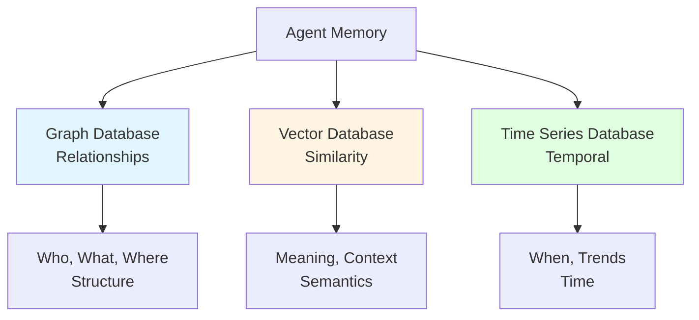
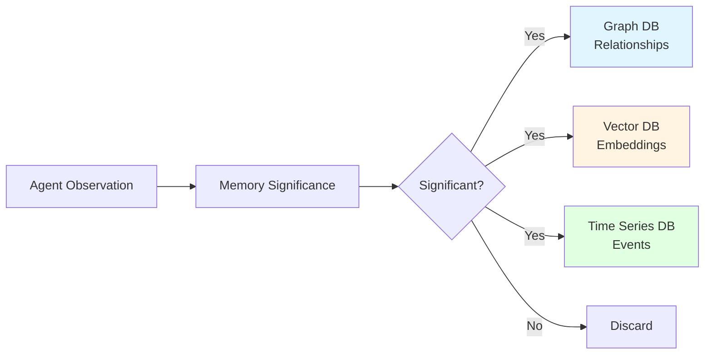
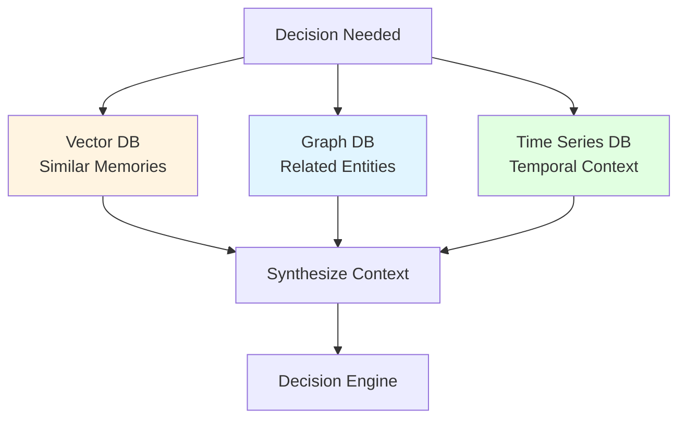

# Data Architecture: Polyglot Persistence

## Overview

XMPro MAGS employs a **polyglot persistence** architecture—using multiple specialized databases optimized for different data access patterns. This approach, pioneered by Martin Fowler (2011), recognizes that no single database technology excels at all types of data storage and retrieval.

Rather than forcing all data into a single database model, MAGS uses:
- **Graph Database**: For relationships and structure
- **Vector Database**: For semantic similarity
- **Time Series Database**: For temporal analysis

This architectural choice enables MAGS to provide sophisticated business process intelligence that would be impossible with a single database approach.

### Why Polyglot Persistence Matters

**The Problem**: Different types of queries require different data structures.
- Relationship queries need graph traversal
- Similarity searches need vector operations
- Temporal analysis needs time-series optimization

**The Solution**: Use specialized databases for specialized needs.
- Each database optimized for its access pattern
- Better performance than general-purpose databases
- Enables capabilities impossible with single database

**The Result**: Sophisticated intelligence capabilities with excellent performance.

---

## The Three Database Types

### Overview of Database Roles



Each database serves a distinct purpose in the agent's cognitive architecture:

- **Graph**: Structural memory (who, what, where)
- **Vector**: Semantic memory (meaning, context)
- **Time Series**: Episodic memory (when, trends)

---

## Graph Database: Relationships and Structure

### Purpose

Store and query complex relationships between entities.

### Theoretical Foundation

**Graph Theory**:
- Nodes represent entities
- Edges represent relationships
- Properties store attributes
- Paths represent connections

**Applications**:
- Social network analysis
- Dependency tracking
- Causal chain analysis
- Knowledge graphs

### What It Stores in MAGS

#### Agent Relationships
- **Team Structure**: Which agents work together
- **Communication Patterns**: Who talks to whom
- **Authority Hierarchies**: Reporting relationships
- **Collaboration Networks**: Joint task execution

#### Memory Lineage
- **Memory Origins**: Where information came from
- **Derivation Chains**: How memories were created
- **Influence Tracking**: What affected what
- **Causal Relationships**: Cause and effect links

#### Dependencies
- **Task Dependencies**: What must happen before what
- **Resource Dependencies**: What requires what resources
- **Data Dependencies**: What data depends on what
- **System Dependencies**: Component relationships

### Why Graph Database

**Relationship Queries Are Natural**:
```
Traditional SQL: Multiple joins, complex queries
Graph Query: MATCH (a)-[r]->(b) WHERE ...
```

**Performance for Connected Data**:
- Constant-time relationship traversal
- No expensive joins
- Efficient path finding
- Scalable to billions of relationships

**Flexibility**:
- Schema-less (add relationships dynamically)
- Evolving structure (adapt as needed)
- Multiple relationship types
- Rich property models

### Use Cases in MAGS

#### Root Cause Analysis
**Challenge**: Trace causal chains from symptom to root cause.

**Graph Approach**:
1. Start at symptom node
2. Traverse causal relationships backward
3. Identify root causes
4. Rank by path strength

**Example**:
```
Quality Issue → Temperature Deviation → Controller Drift → 
Calibration Overdue → Maintenance Schedule Conflict
```

#### Agent Coordination
**Challenge**: Determine which agents should collaborate.

**Graph Approach**:
1. Query agent capability graph
2. Find agents with required skills
3. Check availability and workload
4. Identify communication patterns

**Example**:
```
Task: Predictive Maintenance
→ Find agents with: maintenance_planning, equipment_expertise, scheduling
→ Check: current_workload, availability, past_collaboration
→ Form: optimal team based on graph analysis
```

#### Knowledge Discovery
**Challenge**: Find hidden connections in data.

**Graph Approach**:
1. Traverse knowledge graph
2. Identify unexpected connections
3. Discover patterns
4. Generate insights

**Example**:
```
Equipment A failures → Operator B shifts → Weather pattern C
(Discovered through graph traversal, not obvious from individual data)
```

### Design Patterns

#### Pattern 1: Relationship-First Modeling
**Principle**: Model relationships as first-class entities, not afterthoughts.

**Approach**:
- Relationships have properties (strength, confidence, timestamp)
- Multiple relationship types between same nodes
- Bidirectional relationships when appropriate

**Benefit**: Rich relationship semantics enable sophisticated queries.

#### Pattern 2: Temporal Relationships
**Principle**: Relationships change over time; track history.

**Approach**:
- Timestamp all relationships
- Maintain relationship history
- Query relationships at specific times
- Analyze relationship evolution

**Benefit**: Understand how relationships change and why.

#### Pattern 3: Weighted Relationships
**Principle**: Not all relationships are equal; quantify strength.

**Approach**:
- Assign weights to relationships
- Update weights based on evidence
- Use weights in path finding
- Decay weights over time if appropriate

**Benefit**: More accurate analysis based on relationship strength.

---

## Vector Database: Semantic Similarity

### Purpose

Store and query high-dimensional vector representations for semantic similarity searches.

### Theoretical Foundation

**Vector Space Models (Salton & McGill, 1983)**:
- Documents as vectors in high-dimensional space
- Cosine similarity for semantic closeness
- Efficient nearest-neighbor search
- Dimensionality reduction techniques

**Applications**:
- Semantic search
- Recommendation systems
- Anomaly detection
- Pattern recognition

### What It Stores in MAGS

#### Semantic Embeddings
- **Memory Embeddings**: Vector representations of observations, reflections, plans
- **Content Embeddings**: Semantic meaning of text, data, events
- **Context Embeddings**: Situational and environmental context
- **Pattern Embeddings**: Learned patterns and behaviors

#### Similarity Indices
- **Memory Similarity**: Find similar past experiences
- **Content Similarity**: Find related information
- **Pattern Similarity**: Identify recurring patterns
- **Anomaly Detection**: Find unusual patterns

### Why Vector Database

**Semantic Search**:
```
Traditional Search: Keyword matching (exact or fuzzy)
Vector Search: Semantic similarity (meaning-based)
```

**Example**:
```
Query: "equipment vibration issue"
Traditional: Matches "vibration" keyword
Vector: Also finds "bearing noise", "mechanical oscillation", "resonance problem"
(Semantically similar, different words)
```

**Performance**:
- Approximate nearest neighbor (ANN) algorithms
- Sub-linear search time
- Scalable to billions of vectors
- Real-time similarity search

**Flexibility**:
- Any data type (text, images, sensor data)
- Multiple embedding models
- Dynamic dimensionality
- Continuous updates

### Use Cases in MAGS

#### Memory Retrieval
**Challenge**: Find relevant past experiences for current situation.

**Vector Approach**:
1. Embed current situation as vector
2. Search for similar vectors in memory
3. Retrieve top-K most similar memories
4. Use for context-aware decision-making

**Example**:
```
Current: "Pump showing unusual vibration pattern"
Retrieved: 
- "Pump bearing failure preceded by vibration" (similarity: 0.92)
- "Motor imbalance caused vibration increase" (similarity: 0.87)
- "Coupling misalignment vibration signature" (similarity: 0.85)
```

#### Anomaly Detection
**Challenge**: Identify unusual patterns in operational data.

**Vector Approach**:
1. Embed normal operational patterns
2. Embed current operational state
3. Calculate distance from normal patterns
4. Flag anomalies beyond threshold

**Example**:
```
Normal operation vectors: Cluster in region A
Current state vector: Far from cluster (distance > 3σ)
→ Anomaly detected
```

#### Pattern Recognition
**Challenge**: Identify recurring patterns across different contexts.

**Vector Approach**:
1. Embed observed patterns
2. Cluster similar patterns
3. Identify pattern categories
4. Match new observations to patterns

**Example**:
```
Pattern clusters discovered:
- Cluster 1: Pre-failure signatures (15 instances)
- Cluster 2: Normal degradation (200 instances)
- Cluster 3: Maintenance-induced changes (45 instances)
```

### Design Patterns

#### Pattern 1: Multi-Modal Embeddings
**Principle**: Different data types need different embedding strategies.

**Approach**:
- Text: Language model embeddings
- Sensor data: Autoencoder embeddings
- Time series: Sequence embeddings
- Combine: Fusion techniques

**Benefit**: Unified semantic space for heterogeneous data.

#### Pattern 2: Hierarchical Embeddings
**Principle**: Different granularities need different embeddings.

**Approach**:
- Fine-grained: Individual observations
- Medium-grained: Aggregated patterns
- Coarse-grained: High-level concepts
- Link: Hierarchical relationships

**Benefit**: Multi-scale similarity search and analysis.

#### Pattern 3: Dynamic Embeddings
**Principle**: Embeddings should evolve with learning.

**Approach**:
- Initial: Pre-trained embeddings
- Adaptation: Fine-tune on domain data
- Continuous: Update with new patterns
- Versioning: Track embedding evolution

**Benefit**: Improving accuracy over time without reprocessing.

---

## Time Series Database: Temporal Analysis

### Purpose

Store and query time-stamped data for temporal analysis and trend detection.

### Theoretical Foundation

**Time Series Analysis (Box & Jenkins, 1970)**:
- ARIMA models for forecasting
- Trend detection and decomposition
- Seasonal pattern identification
- Anomaly detection in temporal data

**Applications**:
- Predictive analytics
- Trend analysis
- Forecasting
- Performance monitoring

### What It Stores in MAGS

#### Episodic Memory
- **Event Sequences**: What happened when
- **State Changes**: How system evolved
- **Decision History**: When decisions were made
- **Outcome Tracking**: Results over time

#### Temporal Patterns
- **Trends**: Long-term changes
- **Cycles**: Recurring patterns
- **Seasonality**: Periodic variations
- **Anomalies**: Unusual temporal events

#### Performance Metrics
- **Agent Performance**: Accuracy over time
- **System Performance**: Response times, throughput
- **Business Metrics**: KPIs and objectives
- **Resource Utilization**: Capacity trends

### Why Time Series Database

**Temporal Queries Are Optimized**:
```
Traditional Database: Slow range queries, no time-aware indexing
Time Series Database: Fast range queries, time-based partitioning
```

**Performance**:
- Columnar storage for compression
- Time-based partitioning
- Efficient aggregation
- Downsampling and retention policies

**Functionality**:
- Built-in time functions
- Window operations
- Interpolation
- Gap filling

### Use Cases in MAGS

#### Trend Analysis
**Challenge**: Identify long-term trends in operational data.

**Time Series Approach**:
1. Query historical data
2. Apply trend detection algorithms
3. Identify significant changes
4. Forecast future trends

**Example**:
```
Equipment efficiency over 6 months:
- Trend: Declining 0.5% per month
- Forecast: Below threshold in 3 months
- Action: Schedule preventive maintenance
```

#### Predictive Maintenance
**Challenge**: Predict equipment failures before they occur.

**Time Series Approach**:
1. Analyze historical failure patterns
2. Identify leading indicators
3. Monitor current trends
4. Predict failure probability

**Example**:
```
Bearing temperature trend:
- Historical: Failures preceded by 2-week temperature rise
- Current: Temperature rising for 10 days
- Prediction: 70% failure probability within 1 week
```

#### Performance Monitoring
**Challenge**: Track agent and system performance over time.

**Time Series Approach**:
1. Store performance metrics
2. Calculate moving averages
3. Detect performance degradation
4. Trigger optimization

**Example**:
```
Agent decision accuracy:
- 30-day average: 87%
- 7-day average: 82%
- Trend: Declining
- Action: Trigger retraining or investigation
```

### Design Patterns

#### Pattern 1: Multi-Resolution Storage
**Principle**: Store data at multiple time resolutions.

**Approach**:
- Raw data: High resolution, short retention
- Aggregated data: Medium resolution, medium retention
- Summary data: Low resolution, long retention

**Benefit**: Balance detail with storage costs.

#### Pattern 2: Continuous Aggregation
**Principle**: Pre-compute common aggregations.

**Approach**:
- Define common queries (hourly avg, daily max, etc.)
- Compute aggregations continuously
- Store results for fast retrieval
- Update as new data arrives

**Benefit**: Fast query response for common patterns.

#### Pattern 3: Retention Policies
**Principle**: Different data has different retention needs.

**Approach**:
- Critical data: Long retention
- Operational data: Medium retention
- Debug data: Short retention
- Automatic cleanup based on policies

**Benefit**: Manage storage costs while preserving important data.

---

## Data Flow Patterns

### Pattern 1: Write Path



**Flow Description**:
1. Agent makes observation
2. Memory significance calculator evaluates importance
3. If significant, write to all three databases:
   - Graph: Relationships and structure
   - Vector: Semantic embedding
   - Time Series: Temporal record
4. If not significant, discard

**Design Principle**: Triple-write for important information ensures comprehensive context.

---

### Pattern 2: Read Path - Contextual Retrieval



**Flow Description**:
1. Decision engine needs context
2. Query all three databases in parallel:
   - Vector: Find semantically similar past experiences
   - Graph: Find related entities and relationships
   - Time Series: Find temporal patterns and trends
3. Synthesize information from all sources
4. Provide comprehensive context to decision engine

**Design Principle**: Multi-database retrieval provides richer context than any single database.

---

### Pattern 3: Consistency Management

**Challenge**: Keeping three databases synchronized.

**Approach**: Eventual consistency with checksums.

**Process**:
1. Write to all databases with transaction ID
2. Verify writes with checksums
3. Retry failed writes
4. Periodic consistency checks
5. Reconciliation when needed

**Trade-offs**:
- **Consistency**: Eventual (not immediate)
- **Availability**: High (writes don't block)
- **Partition Tolerance**: Yes (can operate with partial failures)

**Theoretical Foundation**: CAP Theorem (Brewer, 2000)

---

## Integration Patterns

### Pattern 1: Unified Query Interface

**Challenge**: Querying multiple databases is complex.

**Solution**: Abstraction layer that routes queries appropriately.

**Approach**:
```
Query Type → Database Selection
- Relationship query → Graph DB
- Similarity search → Vector DB
- Temporal query → Time Series DB
- Complex query → Multiple DBs + synthesis
```

**Benefit**: Simplified application code, optimized queries.

---

### Pattern 2: Cross-Database Joins

**Challenge**: Combining data from multiple databases.

**Solution**: Application-level joins with caching.

**Approach**:
1. Query primary database
2. Extract keys for related data
3. Query secondary databases
4. Join results in application
5. Cache frequently joined data

**Benefit**: Flexibility without database-level coupling.

---

### Pattern 3: Polyglot Persistence Facade

**Challenge**: Different databases have different APIs.

**Solution**: Unified facade pattern.

**Approach**:
- Abstract interface for all databases
- Database-specific implementations
- Consistent error handling
- Unified monitoring

**Benefit**: Easier to add/replace databases, consistent behavior.

---

## Design Considerations

### When to Use Which Database

#### Use Graph Database When:
- Relationships are first-class entities
- Need to traverse connections
- Structure is important
- Queries involve paths or patterns

**Examples**: Root cause analysis, agent coordination, dependency tracking

#### Use Vector Database When:
- Semantic similarity matters
- Need fuzzy matching
- Working with embeddings
- Pattern recognition required

**Examples**: Memory retrieval, anomaly detection, recommendation

#### Use Time Series Database When:
- Time is primary dimension
- Need temporal analysis
- Trend detection required
- Working with metrics

**Examples**: Performance monitoring, predictive maintenance, forecasting

---

### Trade-offs and Considerations

#### Complexity vs. Capability
**Trade-off**: Multiple databases increase complexity but enable capabilities.

**Mitigation**:
- Abstraction layers
- Unified interfaces
- Automated management
- Clear documentation

#### Consistency vs. Performance
**Trade-off**: Strong consistency reduces performance; eventual consistency increases it.

**Choice**: Eventual consistency with verification (appropriate for MAGS use cases).

#### Storage Costs vs. Query Performance
**Trade-off**: Redundant storage costs more but enables faster queries.

**Choice**: Triple-write for important data (benefits outweigh costs).

---

## Scalability Patterns

### Horizontal Scaling

**Graph Database**:
- Sharding by entity type
- Replication for read scaling
- Distributed queries

**Vector Database**:
- Partitioning by vector space regions
- Distributed ANN search
- Replication for availability

**Time Series Database**:
- Time-based partitioning
- Retention policies
- Downsampling for old data

---

### Vertical Scaling

**When to Scale Vertically**:
- Single-node performance limits
- Complex query requirements
- Large working sets

**Approach**:
- Increase memory (faster queries)
- Increase CPU (parallel processing)
- Increase storage (more data)
- SSD for faster I/O

---

## Performance Optimization

### Caching Strategies

**What to Cache**:
- Frequently accessed memories
- Recent query results
- Common aggregations
- Hot data

**Cache Levels**:
- Application cache (in-memory)
- Database cache (query results)
- Distributed cache (shared)

---

### Query Optimization

**Graph Queries**:
- Index frequently traversed relationships
- Limit traversal depth
- Use query hints
- Materialize common paths

**Vector Queries**:
- Optimize ANN parameters
- Use appropriate distance metrics
- Pre-filter when possible
- Batch similar queries

**Time Series Queries**:
- Use continuous aggregations
- Leverage time-based partitioning
- Downsample for long ranges
- Cache common time windows

---

## Backup and Recovery

### Backup Strategies

**Graph Database**:
- Full backups (weekly)
- Incremental backups (daily)
- Transaction log backups (hourly)

**Vector Database**:
- Snapshot backups (daily)
- Index rebuilds (as needed)
- Embedding versioning

**Time Series Database**:
- Time-based backups
- Retention-aware backups
- Compressed archives

---

### Recovery Procedures

**Failure Scenarios**:
1. Single database failure → Restore from backup
2. Partial data loss → Reconcile from other databases
3. Complete failure → Restore all databases, verify consistency

**Recovery Time Objectives**:
- Critical data: < 1 hour
- Operational data: < 4 hours
- Historical data: < 24 hours

---

## Monitoring and Observability

### Key Metrics

**Graph Database**:
- Query latency
- Traversal depth
- Node/edge counts
- Cache hit rates

**Vector Database**:
- Search latency
- Index size
- Recall accuracy
- Throughput

**Time Series Database**:
- Write throughput
- Query latency
- Storage usage
- Retention compliance

---

### Health Checks

**Automated Checks**:
- Database connectivity
- Replication lag
- Disk space
- Query performance

**Alerting**:
- Performance degradation
- Consistency issues
- Capacity warnings
- Failure detection

---

## Future Considerations

### Emerging Database Technologies

**Graph Databases**:
- Distributed graph processing
- Real-time graph analytics
- Graph neural networks

**Vector Databases**:
- Multimodal embeddings
- Dynamic dimensionality
- Federated search

**Time Series Databases**:
- Real-time analytics
- Predictive compression
- Automated anomaly detection

---

### Evolution Strategy

**Approach**:
- Monitor database technology trends
- Evaluate new capabilities
- Pilot promising technologies
- Migrate incrementally

**Principle**: Polyglot persistence architecture makes database replacement easier.

---

## Conclusion

The polyglot persistence architecture in MAGS provides:

**Specialized Performance**: Each database optimized for its access pattern
**Rich Capabilities**: Enables sophisticated intelligence impossible with single database
**Scalability**: Each database scales independently
**Flexibility**: Easy to add/replace databases as needs evolve
**Resilience**: Redundancy across databases provides fault tolerance

This architecture is fundamental to MAGS' ability to provide sophisticated business process intelligence for industrial operations.

---

## Related Documentation

- [Two-Layer Framework](two-layer-framework.md)
- [System Components](system-components.md)
- [Memory Systems](../concepts/memory-systems.md)
- [Cognitive Intelligence](../cognitive-intelligence/README.md)
- [Performance Optimization](../performance-optimization/README.md)

---

## References

### Polyglot Persistence
- Fowler, M. (2011). "Polyglot Persistence"
- Sadalage, P. J., & Fowler, M. (2012). "NoSQL Distilled"

### Graph Databases
- Robinson, I., Webber, J., & Eifrem, E. (2015). "Graph Databases"
- Angles, R., & Gutierrez, C. (2008). "Survey of graph database models"

### Vector Databases
- Salton, G., & McGill, M. J. (1983). "Introduction to Modern Information Retrieval"
- Johnson, J., Douze, M., & Jégou, H. (2019). "Billion-scale similarity search with GPUs"

### Time Series Databases
- Box, G. E., & Jenkins, G. M. (1970). "Time Series Analysis: Forecasting and Control"
- Dunning, T., & Friedman, E. (2014). "Time Series Databases: New Ways to Store and Access Data"

### Distributed Systems
- Brewer, E. (2000). "Towards robust distributed systems" (CAP Theorem)
- Kleppmann, M. (2017). "Designing Data-Intensive Applications"

---

**Document Version**: 1.0  
**Last Updated**: December 5, 2024  
**Status**: ✅ Complete  
**Next**: [Agent Architecture Enhancement](agent-architecture.md)