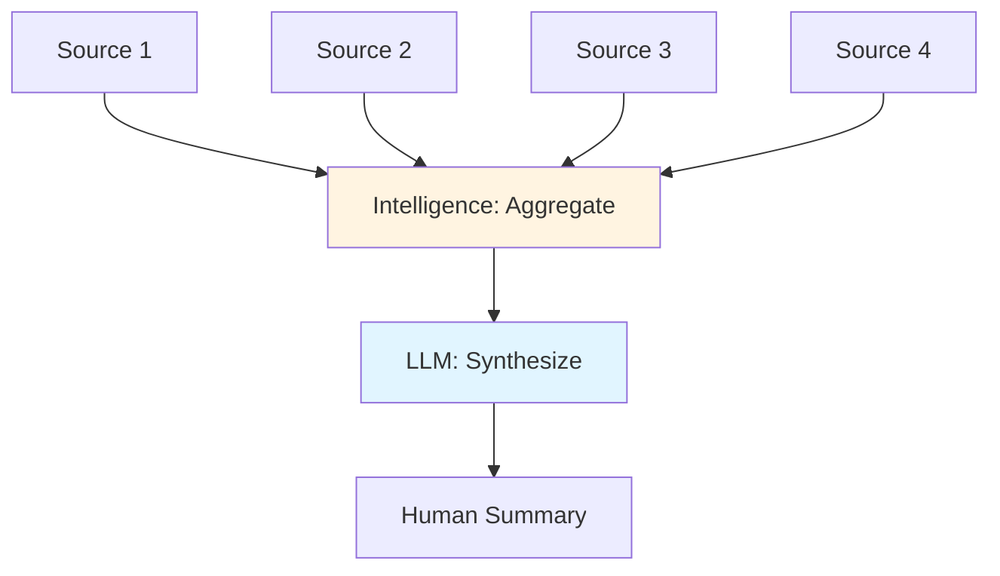

# The LLM Utility Layer: Text Processing Role

## Overview

In XMPro MAGS, Large Language Models (LLMs) serve a specific, limited role: they are **communication tools**, not decision-makers. This represents a fundamental architectural choice that distinguishes MAGS from traditional agent frameworks.

While LLMs are powerful for natural language processing, they constitute only **~10% of MAGS capabilities**—the utility layer that facilitates communication between humans and agents, and between agents themselves. The remaining **~90%** is business process intelligence grounded in established research across multiple disciplines.

### The Core Principle

**LLMs are interfaces, not intelligence.**

This principle has profound implications:
- **Decisions** are made by the intelligence layer using established theories
- **Communication** is handled by LLMs using natural language
- **Reliability** comes from deterministic algorithms, not probabilistic text generation
- **Explainability** is based on theoretical foundations, not LLM reasoning

---

## What LLMs Do in MAGS

LLMs excel at text processing and natural language tasks. In MAGS, they serve four primary functions:

### 1. Natural Language Understanding

**Purpose**: Parse and interpret human instructions into structured intent.

**Capabilities**:
- **Intent Classification**: Determining what the user wants to accomplish
- **Entity Extraction**: Identifying key information from text
- **Semantic Parsing**: Converting natural language to structured queries
- **Context Interpretation**: Understanding implicit meaning and references

**Example Flow**:
```
Human Input: "Check if pump P-101 needs maintenance"
↓
LLM Processing: Parse intent and entities
↓
Structured Output: {
  intent: "maintenance_check",
  equipment: "P-101",
  equipment_type: "pump"
}
↓
Intelligence Layer: Process using maintenance prediction capabilities
```

**Why This Matters**: Humans communicate in natural language, but systems operate on structured data. LLMs bridge this gap without making business decisions.

---

### 2. Natural Language Generation

**Purpose**: Generate human-readable explanations of decisions and system state.

**Capabilities**:
- **Decision Explanation**: Converting technical decisions to readable text
- **Report Generation**: Creating summaries and documentation
- **Alert Formatting**: Presenting notifications in clear language
- **Status Updates**: Communicating system state to stakeholders

**Example Flow**:
```
Intelligence Layer Decision: {
  action: "schedule_maintenance",
  equipment: "P-101",
  reason: "vibration_anomaly",
  confidence: 0.87,
  urgency: "medium"
}
↓
LLM Processing: Generate explanation
↓
Human Output: "Pump P-101 should be scheduled for maintenance within 
the next week due to detected vibration anomalies. Confidence: High (87%). 
This recommendation is based on historical failure patterns and current 
sensor readings."
```

**Why This Matters**: Technical decisions need human-readable explanations for stakeholder communication and regulatory compliance.

---

### 3. Information Synthesis

**Purpose**: Aggregate and summarize information from multiple sources.

**Capabilities**:
- **Multi-Source Synthesis**: Combining information from different systems
- **Summarization**: Condensing large amounts of information
- **Context Integration**: Weaving together related information
- **Narrative Generation**: Creating coherent stories from data

**Example Flow**:
```
Multiple Data Sources:
- Sensor readings (vibration, temperature, pressure)
- Maintenance history (last service, repairs)
- Production schedule (current load, planned downtime)
- Spare parts inventory (availability, lead time)
↓
LLM Processing: Synthesize into coherent summary
↓
Output: "Pump P-101 is showing early signs of bearing wear based on 
vibration analysis. The pump was last serviced 8 months ago and is 
currently operating at 85% capacity. Maintenance can be scheduled during 
next week's planned downtime without impacting production. Required spare 
parts are in stock."
```

**Why This Matters**: Stakeholders need comprehensive understanding without reviewing raw data from multiple systems.

---

### 4. Inter-Agent Communication

**Purpose**: Facilitate sophisticated communication between agents using natural language.

**Capabilities**:
- **Message Formatting**: Converting structured data to readable messages
- **Request Interpretation**: Understanding agent-to-agent requests
- **Response Generation**: Creating appropriate responses
- **Protocol Translation**: Converting between communication formats

**Example Flow**:
```
Agent A (Maintenance Planner):
Structured Request: {
  to: "inventory_agent",
  query: "spare_parts_availability",
  equipment: "P-101",
  parts: ["bearing", "seal"]
}
↓
LLM Processing: Format as natural language
↓
Natural Language Message: "Do we have bearings and seals in stock for 
pump P-101? I'm planning maintenance for next week."
↓
Agent B (Inventory Manager): Receives and processes
↓
LLM Processing: Parse response
↓
Structured Response: {
  bearing: {available: true, quantity: 2, location: "warehouse_A"},
  seal: {available: true, quantity: 5, location: "warehouse_A"}
}
```

**Why This Matters**: Natural language enables more flexible and sophisticated agent collaboration than rigid protocols alone.

---

## What LLMs Don't Do in MAGS

Understanding what LLMs **don't** do is as important as understanding what they do:

### ❌ Business Decision-Making

**Not LLM's Role**: Deciding what action to take based on business objectives.

**Intelligence Layer's Role**: Multi-objective optimization using utility functions, Pareto optimality, and Nash equilibrium.

**Why**: Business decisions require quantitative optimization with explainable trade-offs, not text generation.

**Example**:
- ❌ LLM: "I think we should schedule maintenance next week"
- ✅ Intelligence: Utility function optimizes: cost ($5K) + downtime (4hrs) + risk (0.15 failure probability) = optimal schedule

---

### ❌ Determining Information Importance

**Not LLM's Role**: Deciding what information is significant or worth remembering.

**Intelligence Layer's Role**: Memory significance calculation using Shannon's Information Theory, attention economics, and prospect theory.

**Why**: Importance depends on context, rarity, and domain-specific factors that LLMs cannot reliably assess.

**Example**:
- ❌ LLM: "This seems important"
- ✅ Intelligence: Significance score = f(semantic_novelty × activity_rarity × temporal_recency × historical_importance)

---

### ❌ Multi-Objective Optimization

**Not LLM's Role**: Balancing competing objectives like cost, quality, speed, and safety.

**Intelligence Layer's Role**: Multi-objective optimization using Pareto optimality, weighted aggregation, and Nash bargaining.

**Why**: Optimization requires mathematical frameworks, not text-based reasoning.

**Example**:
- ❌ LLM: "Try to balance cost and quality"
- ✅ Intelligence: Pareto frontier analysis with weighted sum: 0.4×cost + 0.3×quality + 0.2×speed + 0.1×safety

---

### ❌ Distributed Consensus

**Not LLM's Role**: Coordinating decisions across multiple agents to reach agreement.

**Intelligence Layer's Role**: Consensus mechanisms using Byzantine Fault Tolerance, Paxos, and Raft algorithms.

**Why**: Consensus requires fault-tolerant protocols with mathematical guarantees, not conversation.

**Example**:
- ❌ LLM: "Let's all agree on this"
- ✅ Intelligence: Byzantine consensus with 2f+1 agreement threshold, round-based voting, conflict resolution

---

### ❌ Temporal and Causal Reasoning

**Not LLM's Role**: Understanding time-based patterns and causal relationships.

**Intelligence Layer's Role**: Time series analysis, graph-based causal inference, and temporal logic.

**Why**: Temporal patterns require statistical analysis; causal chains require graph traversal.

**Example**:
- ❌ LLM: "A might have caused B"
- ✅ Intelligence: Graph traversal finds causal chain: A → C → D → B with temporal correlation r=0.87, p<0.01

---

### ❌ Confidence Calibration

**Not LLM's Role**: Assessing decision quality and adjusting confidence based on outcomes.

**Intelligence Layer's Role**: Bayesian calibration, metacognition, and historical performance tracking.

**Why**: Confidence requires statistical calibration against actual outcomes, not self-assessment.

**Example**:
- ❌ LLM: "I'm pretty confident about this"
- ✅ Intelligence: Confidence = 0.87 (calibrated from 0.92 based on historical accuracy: actual=0.85, expected=0.92)

---

### ❌ Plan Optimization

**Not LLM's Role**: Creating optimal action sequences to achieve goals.

**Intelligence Layer's Role**: PDDL planning, HTN decomposition, and constraint satisfaction.

**Why**: Planning requires state-space search with constraint satisfaction, not text generation.

**Example**:
- ❌ LLM: "First do A, then B, then C"
- ✅ Intelligence: PDDL planner generates optimal sequence satisfying resource constraints, temporal dependencies, and goal conditions

---

### ❌ Real-Time System Integration

**Not LLM's Role**: Processing continuous data streams and controlling equipment.

**Intelligence Layer's Role**: Stream processing, event detection, and control system integration.

**Why**: Real-time operations require deterministic, low-latency processing, not LLM API calls.

**Example**:
- ❌ LLM: "The sensor reading looks high"
- ✅ Intelligence: Stream processor detects anomaly in 50ms, triggers control action, updates state

---

### ❌ Governance and Compliance

**Not LLM's Role**: Enforcing rules, policies, and regulatory requirements.

**Intelligence Layer's Role**: Deontic logic, rule engines, and compliance frameworks.

**Why**: Compliance requires deterministic rule enforcement with audit trails, not probabilistic text.

**Example**:
- ❌ LLM: "That might violate a rule"
- ✅ Intelligence: Deontic rule engine: PROHIBITED(action) ∧ OBLIGATED(alternative) → REJECT(action)

---

## Why This Separation Matters

### 1. Reliability

**Challenge**: Industrial operations require consistent, predictable behavior.

**LLM Limitation**: Probabilistic outputs may vary between runs, even with same inputs.

**MAGS Solution**: Intelligence layer provides deterministic decisions; LLMs only vary in phrasing.

**Result**: Reliable operations with flexible communication.

---

### 2. Explainability

**Challenge**: Regulatory compliance requires transparent, auditable decision-making.

**LLM Limitation**: LLM reasoning is often opaque; explanations may not reflect actual process.

**MAGS Solution**: Decisions based on established theories with clear audit trails; LLMs explain, not decide.

**Result**: Full transparency and regulatory compliance.

---

### 3. Domain Expertise

**Challenge**: Industrial domains require specialized knowledge beyond general training data.

**LLM Limitation**: General-purpose models lack deep domain expertise and may hallucinate.

**MAGS Solution**: Specialized capabilities with domain-specific algorithms; LLMs translate, not analyze.

**Result**: Expert-level performance in specialized domains.

---

### 4. Consistency

**Challenge**: Same inputs should produce same outputs for operational reliability.

**LLM Limitation**: Temperature settings and sampling introduce variability.

**MAGS Solution**: Intelligence layer is deterministic; only communication varies.

**Result**: Predictable behavior with natural language flexibility.

---

### 5. Continuous Improvement

**Challenge**: Systems must learn from outcomes and improve over time.

**LLM Limitation**: Requires retraining on new data; cannot learn from individual outcomes.

**MAGS Solution**: Intelligence layer learns from each outcome; LLMs remain static.

**Result**: Continuous adaptation without retraining.

---

### 6. Cost Efficiency

**Challenge**: LLM API calls are expensive at scale.

**LLM Limitation**: Every decision requiring LLM reasoning incurs API costs.

**MAGS Solution**: Intelligence layer operates locally; LLMs only for communication.

**Result**: Scalable operations with controlled costs.

---

### 7. Latency

**Challenge**: Real-time operations require sub-second response times.

**LLM Limitation**: API calls introduce latency (100ms-1000ms+).

**MAGS Solution**: Intelligence layer operates in milliseconds; LLMs only for non-critical communication.

**Result**: Real-time performance where needed.

---

### 8. Vendor Independence

**Challenge**: Dependence on specific LLM providers creates risk.

**LLM Limitation**: Switching providers may require significant rework.

**MAGS Solution**: Intelligence layer is provider-agnostic; any LLM can serve utility role.

**Result**: Flexibility to choose best LLM for each use case.

---

## Integration Patterns

### Pattern 1: Input Processing

**Flow**: Human → LLM → Intelligence → Action


**LLM Role**: Convert natural language to structured data
**Intelligence Role**: Process structured data and make decisions

---

### Pattern 2: Output Generation

**Flow**: Decision → LLM → Human


**Intelligence Role**: Make decision with technical details
**LLM Role**: Convert technical details to readable explanation

---

### Pattern 3: Agent Communication

**Flow**: Agent A → LLM → Agent B → LLM → Agent A


**LLM Role**: Format messages for readability
**Intelligence Role**: Process requests and generate responses

---

### Pattern 4: Information Synthesis

**Flow**: Multiple Sources → Intelligence → LLM → Summary



**Intelligence Role**: Aggregate and analyze data
**LLM Role**: Create coherent narrative

---

## Design Principles

### Principle 1: Intelligence First, Communication Second

**Guideline**: Design business logic first, add LLM interface last.

**Approach**:
1. Define business objectives and constraints
2. Implement intelligence capabilities
3. Add LLM interface for communication

**Benefit**: Ensures sound business logic independent of LLM capabilities.

---

### Principle 2: Deterministic Core, Probabilistic Interface

**Guideline**: Core decisions are deterministic; only communication is probabilistic.

**Approach**:
- Intelligence layer uses established algorithms
- LLM layer handles natural language variability
- Decisions remain consistent regardless of phrasing

**Benefit**: Reliability where it matters, flexibility where it helps.

---

### Principle 3: Minimal LLM Dependency

**Guideline**: Use LLMs only where natural language is essential.

**Approach**:
- Structured communication between agents (no LLM needed)
- LLM only for human interaction and complex synthesis
- Fallback to templates when LLM unavailable

**Benefit**: Reduced costs, improved latency, increased reliability.

---

### Principle 4: Provider Agnostic

**Guideline**: Design for any LLM provider, not specific models.

**Approach**:
- Abstract LLM interface
- Standardized input/output formats
- Model-agnostic prompting strategies

**Benefit**: Flexibility to switch providers or use multiple LLMs.

---

### Principle 5: Explainable Decisions, Flexible Explanations

**Guideline**: Decisions must be explainable; explanations can vary.

**Approach**:
- Intelligence layer maintains decision audit trail
- LLM generates explanations from audit trail
- Multiple explanation styles for different audiences

**Benefit**: Regulatory compliance with stakeholder-appropriate communication.

---

## Comparison to LLM-Centric Frameworks

### Traditional Frameworks: LLM as Decision-Maker

**Architecture**:
```
User Input → LLM (decides) → Action
```

**Characteristics**:
- LLM generates decisions based on prompts
- Business logic wrapped around LLM calls
- Prompts as primary control mechanism
- Tools as LLM extensions

**Limitations**:
- Decisions depend on LLM quality
- Limited explainability
- Inconsistent outputs
- High API costs
- Vendor lock-in

---

### MAGS: LLM as Communication Tool

**Architecture**:
```
User Input → LLM (parse) → Intelligence (decide) → LLM (explain) → User Output
```

**Characteristics**:
- Intelligence layer makes decisions
- LLMs facilitate communication
- Theoretical foundations as control mechanisms
- Capabilities as core components

**Advantages**:
- Decisions based on established theories
- Full explainability
- Consistent outputs
- Controlled costs
- Vendor independence

---

## Real-World Examples

### Example 1: Predictive Maintenance

**Scenario**: Determine if equipment needs maintenance.

**LLM-Centric Approach**:
```
Prompt: "Based on these sensor readings, does pump P-101 need maintenance?"
LLM: "Yes, the vibration levels are concerning. I recommend maintenance."
Problem: No quantitative analysis, no confidence score, no optimization
```

**MAGS Approach**:
```
1. Intelligence: Analyze vibration patterns using time series analysis
2. Intelligence: Calculate failure probability using Bayesian inference
3. Intelligence: Optimize maintenance schedule using utility functions
4. Intelligence: Generate decision with confidence score
5. LLM: Explain decision in natural language
Result: "Pump P-101 should be scheduled for maintenance next week. 
Vibration analysis indicates 15% failure probability within 30 days. 
Scheduling during planned downtime minimizes cost impact. Confidence: 87%"
```

---

### Example 2: Quality Control

**Scenario**: Respond to quality deviation.

**LLM-Centric Approach**:
```
Prompt: "Product quality is below spec. What should we do?"
LLM: "You should investigate the cause and adjust the process."
Problem: Generic advice, no specific actions, no coordination
```

**MAGS Approach**:
```
1. Intelligence: Detect deviation using statistical process control
2. Intelligence: Identify root cause using causal graph analysis
3. Intelligence: Generate corrective actions using PDDL planning
4. Intelligence: Coordinate response using consensus mechanisms
5. Intelligence: Optimize actions using multi-objective optimization
6. LLM: Communicate plan to stakeholders
Result: "Quality deviation detected in batch #1234. Root cause: 
temperature controller drift. Corrective actions: (1) Recalibrate 
controller, (2) Reprocess affected batch, (3) Increase monitoring 
frequency. Estimated impact: 4 hours downtime, $2K cost. All quality 
agents in consensus. Confidence: 92%"
```

---

### Example 3: Multi-Agent Coordination

**Scenario**: Coordinate maintenance across multiple systems.

**LLM-Centric Approach**:
```
Agent A (LLM): "I think we should do maintenance on system X"
Agent B (LLM): "But that will impact system Y"
Agent C (LLM): "Maybe we should wait"
Problem: No structured coordination, no consensus mechanism, no optimization
```

**MAGS Approach**:
```
1. Agent A Intelligence: Proposes maintenance schedule
2. Agent B Intelligence: Analyzes impact on dependent systems
3. Agent C Intelligence: Checks resource availability
4. Consensus Mechanism: Byzantine consensus protocol
5. Intelligence: Optimizes schedule using multi-objective optimization
6. LLMs: Communicate plan in natural language
Result: Coordinated maintenance schedule that minimizes total impact, 
with all agents in consensus, explained clearly to stakeholders
```

---

## Implementation Guidance

### When to Use LLMs

**Appropriate Use Cases**:
- Parsing human natural language input
- Generating human-readable explanations
- Synthesizing information from multiple sources
- Facilitating agent-to-agent communication
- Creating reports and documentation

**Inappropriate Use Cases**:
- Making business decisions
- Determining information importance
- Optimizing objectives
- Coordinating agents
- Real-time control
- Compliance enforcement

---

### LLM Selection Criteria

**Consider**:
- **Cost**: API pricing for expected volume
- **Latency**: Response time requirements
- **Quality**: Accuracy for your domain
- **Availability**: Uptime and reliability
- **Privacy**: Data handling policies
- **Flexibility**: Ability to switch providers

**Recommendation**: Use multiple LLMs for different purposes:
- Fast, cheap LLM for routine communication
- High-quality LLM for complex synthesis
- Local LLM for sensitive data

---

### Prompt Engineering Guidelines

**Principle**: Prompts should request communication, not decisions.

**Good Prompts**:
- "Explain this decision to a non-technical stakeholder"
- "Summarize these findings in 3 sentences"
- "Parse this request and extract the key entities"

**Bad Prompts**:
- "Decide if we should do maintenance"
- "Determine what's important in this data"
- "Optimize this schedule"

**Why**: Good prompts leverage LLM strengths (communication); bad prompts ask LLMs to replace intelligence layer.

---

### Fallback Strategies

**Challenge**: LLMs may be unavailable or produce poor outputs.

**Strategies**:
1. **Template Fallback**: Use pre-defined templates when LLM fails
2. **Structured Output**: Ensure intelligence layer produces structured data
3. **Graceful Degradation**: System operates without LLMs, just less readable
4. **Multiple Providers**: Failover to backup LLM provider

**Result**: System reliability independent of LLM availability.

---

## Future Considerations

### Evolving LLM Capabilities

**Trend**: LLMs are improving rapidly in reasoning and analysis.

**MAGS Position**: Even as LLMs improve, separation remains valuable:
- **Reliability**: Established theories more reliable than LLM reasoning
- **Explainability**: Theoretical foundations provide transparency
- **Consistency**: Deterministic intelligence ensures predictability
- **Cost**: Local intelligence cheaper than LLM API calls
- **Latency**: Local processing faster than API calls

**Strategy**: Leverage LLM improvements for better communication, not decision-making.

---

### Specialized LLMs

**Trend**: Domain-specialized LLMs emerging.

**MAGS Position**: Specialized LLMs can enhance utility layer:
- Better domain terminology understanding
- More accurate entity extraction
- Improved technical explanations

**Integration**: Use specialized LLMs for communication while maintaining intelligence layer separation.

---

### Multimodal LLMs

**Trend**: LLMs handling images, audio, video.

**MAGS Position**: Multimodal capabilities enhance communication:
- Visual explanations of decisions
- Audio interfaces for hands-free operation
- Video analysis for context

**Integration**: Multimodal LLMs expand communication channels, not decision-making.

---

## Conclusion

The LLM utility layer in MAGS serves a specific, limited role: facilitating communication between humans and agents, and between agents themselves. This architectural choice provides:

**Reliability**: Deterministic intelligence layer ensures consistent decisions
**Explainability**: Theoretical foundations provide transparent reasoning
**Domain Expertise**: Specialized capabilities outperform general-purpose LLMs
**Consistency**: Same inputs produce same decisions, only explanations vary
**Cost Efficiency**: Intelligence operates locally, LLMs only for communication
**Vendor Independence**: Any LLM can serve utility role

By positioning LLMs as communication tools rather than decision-makers, MAGS achieves the reliability, explainability, and domain expertise required for industrial operations while leveraging LLM strengths for natural language interaction.

---

## Related Documentation

- [Two-Layer Framework: Intelligence vs. Utility](two-layer-framework.md)
- [Business Process Intelligence: The 15 Capabilities](business-process-intelligence.md)
- [System Components Overview](system-components.md)
- [Cognitive Intelligence Category](../cognitive-intelligence/README.md)
- [Best Practices: Agent Design Principles](../best-practices/agent-design-principles.md)

---

## References

### LLM Research
- Brown, T., et al. (2020). "Language Models are Few-Shot Learners" (GPT-3)
- Ouyang, L., et al. (2022). "Training language models to follow instructions" (InstructGPT)
- Anthropic (2023). "Constitutional AI: Harmlessness from AI Feedback" (Claude)

### Multi-Agent Systems
- Wooldridge, M. (2009). "An Introduction to MultiAgent Systems"
- Ferber, J. (1999). "Multi-Agent Systems: An Introduction to Distributed Artificial Intelligence"

### Industrial AI
- Gartner (2024). "Agentic AI: Very High Mass, 6-8 years to mainstream adoption"
- Gartner (2024). "Domain-Specialized Language Models for Industrial Applications"

### XMPro Research
- XMPro (2024). "Theoretical Foundations and Research-Based Approaches in XMPro MAGS"
- XMPro (2024). "The Two-Layer Framework: Intelligence vs. Utility"

---

**Document Version**: 1.0  
**Last Updated**: December 5, 2024  
**Status**: ✅ Complete  
**Next**: [System Components Overview](system-components.md)