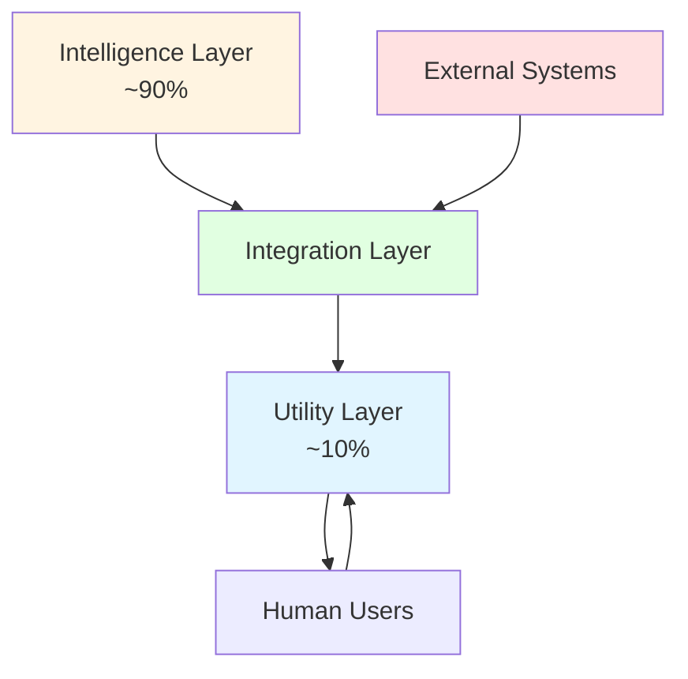
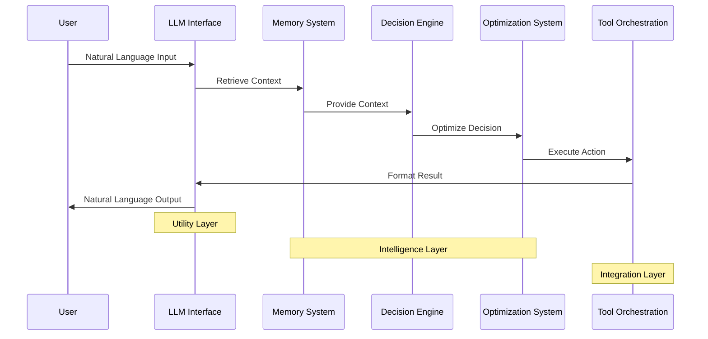
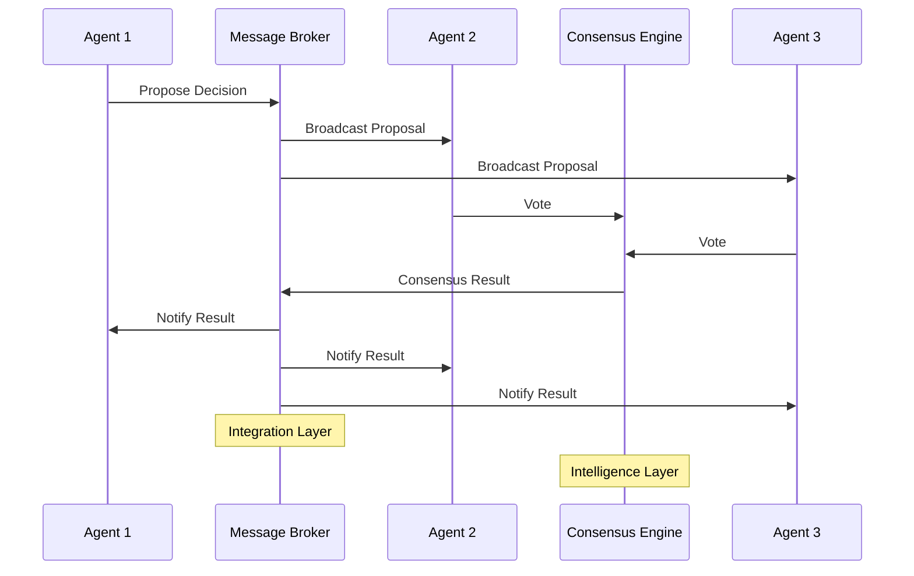
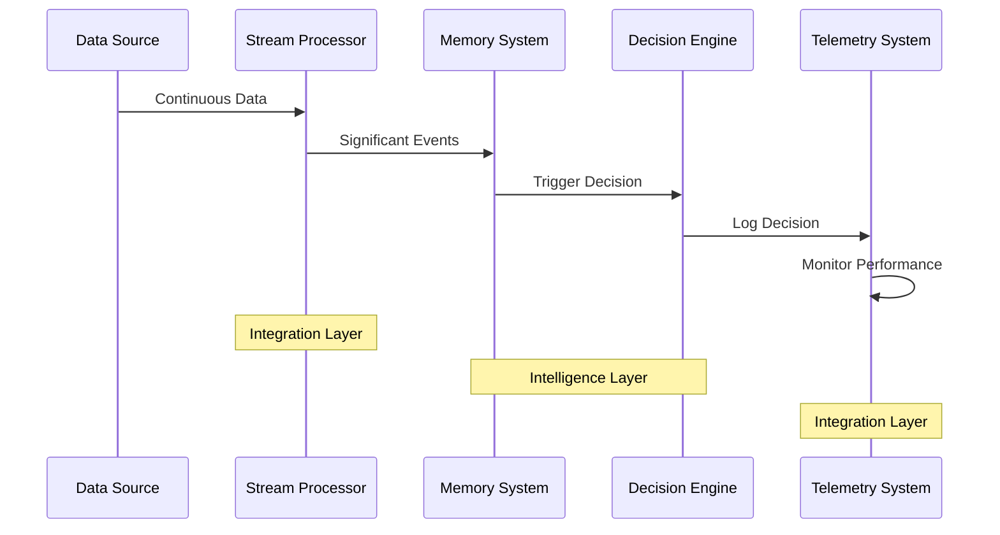

# System Components Overview

## Overview

XMPro MAGS is built on a layered architecture that separates business process intelligence from communication utilities. This document provides a high-level overview of the system components, their relationships, and design principles—without exposing implementation details.

Understanding the component architecture helps in:
- **System Design**: Planning MAGS deployments
- **Integration**: Connecting MAGS with existing systems
- **Scalability**: Understanding how components scale
- **Troubleshooting**: Identifying component responsibilities

---

## Architectural Layers

MAGS employs a three-layer architecture that ensures separation of concerns and scalability:

### Layer 1: Intelligence Layer (~90%)

The core business process intelligence that makes decisions.

**Components**:
- Memory Systems (short-term, long-term)
- Decision Engines (planning, consensus)
- Optimization Systems (objectives, utilities)
- Governance Frameworks (rules, policies)

**Characteristics**:
- Deterministic decision-making
- Research-based algorithms
- Domain-specific expertise
- Continuous learning

[Learn more about Intelligence Layer →](business-process-intelligence.md)

---

### Layer 2: Integration Layer

Connects intelligence to real-world systems and data sources.

**Components**:
- Message Brokers (MQTT, DDS)
- Data Stream Processors
- Tool Orchestration
- Telemetry Systems

**Characteristics**:
- Real-time data processing
- Industrial protocol support
- Fault-tolerant communication
- Scalable architecture

---

### Layer 3: Utility Layer (~10%)

Provides natural language interfaces for communication.

**Components**:
- LLM Interfaces
- Text Processing Pipelines
- Communication Facilitators

**Characteristics**:
- Natural language understanding
- Explanation generation
- Multi-modal communication
- Provider-agnostic design

[Learn more about Utility Layer →](llm-utility-layer.md)

---

## Intelligence Layer Components

### Memory Systems

**Purpose**: Store and retrieve contextual information efficiently.

**Component Types**:

#### Short-Term Memory
- **Function**: Active context and recent observations
- **Characteristics**: Fast access, limited capacity, volatile
- **Use Cases**: Current task context, recent events, working memory
- **Design Pattern**: Cache-based with automatic cleanup

#### Long-Term Memory
- **Function**: Consolidated knowledge and historical patterns
- **Characteristics**: Slower access, unlimited capacity, persistent
- **Use Cases**: Domain knowledge, historical trends, learned patterns
- **Design Pattern**: Multi-database with specialized storage

**Theoretical Foundation**:
- Atkinson-Shiffrin Memory Model (1968)
- Tulving's Memory Types (1972)

[Learn more about Memory Systems →](../concepts/memory-systems.md)

---

### Decision Engines

**Purpose**: Make intelligent decisions based on multiple factors.

**Component Types**:

#### Planning Engine
- **Function**: Generate action sequences to achieve goals
- **Characteristics**: PDDL-based, constraint-aware, optimizable
- **Use Cases**: Maintenance scheduling, process optimization, resource allocation
- **Design Pattern**: State-space search with heuristics

#### Consensus Engine
- **Function**: Coordinate decisions across multiple agents
- **Characteristics**: Fault-tolerant, Byzantine-resistant, scalable
- **Use Cases**: Multi-agent coordination, distributed decisions, conflict resolution
- **Design Pattern**: Round-based voting with conflict detection

**Theoretical Foundation**:
- STRIPS Planning (Fikes & Nilsson 1971)
- Byzantine Fault Tolerance (Lamport et al. 1982)

[Learn more about Decision Engines →](../concepts/decision-making.md)

---

### Optimization Systems

**Purpose**: Optimize outcomes based on business objectives.

**Component Types**:

#### Objective Functions
- **Function**: Quantify and balance multiple goals
- **Characteristics**: Multi-objective, weighted, Pareto-optimal
- **Use Cases**: Cost-quality trade-offs, risk-reward balancing, resource optimization
- **Design Pattern**: Utility function aggregation

#### Utility Functions
- **Function**: Quantify value of outcomes
- **Characteristics**: Risk-adjusted, domain-specific, calibrated
- **Use Cases**: Decision valuation, preference modeling, risk assessment
- **Design Pattern**: Multiple utility types (linear, logarithmic, exponential)

**Theoretical Foundation**:
- Utility Theory (Bernoulli 1738, Von Neumann-Morgenstern 1944)
- Multi-Objective Optimization (Pareto 1896)

[Learn more about Optimization →](../performance-optimization/goal-optimization.md)

---

### Governance Frameworks

**Purpose**: Ensure compliance with rules and policies.

**Component Types**:

#### Rule Engine
- **Function**: Enforce deontic rules and organizational policies
- **Characteristics**: Deterministic, auditable, hierarchical
- **Use Cases**: Regulatory compliance, safety protocols, operational policies
- **Design Pattern**: Rule-based system with priority ordering

#### Lifecycle Manager
- **Function**: Manage agent states and transitions
- **Characteristics**: State-aware, event-driven, monitored
- **Use Cases**: Agent deployment, state tracking, resource management
- **Design Pattern**: State machine with transition guards

**Theoretical Foundation**:
- Deontic Logic
- Organizational Theory

[Learn more about Governance →](../decision-orchestration/agent-lifecycle-governance.md)

---

## Integration Layer Components

### Message Brokers

**Purpose**: Enable reliable communication between components.

**Protocol Support**:

#### MQTT (Message Queuing Telemetry Transport)
- **Characteristics**: Lightweight, publish-subscribe, QoS levels
- **Use Cases**: IoT device communication, sensor data, event notifications
- **Design Pattern**: Topic-based routing with retained messages

#### DDS (Data Distribution Service)
- **Characteristics**: Real-time, data-centric, deterministic
- **Use Cases**: Mission-critical operations, time-sensitive data, complex distribution
- **Design Pattern**: Content-based filtering with QoS policies

**Why These Protocols**:
- **Industrial-Grade**: Proven in operational technology environments
- **Scalable**: Handle thousands of devices and agents
- **Reliable**: Quality of service guarantees
- **Real-Time**: Low-latency, deterministic delivery

**Theoretical Foundation**:
- Distributed Systems Theory
- Publish-Subscribe Pattern

[Learn more about Communication →](../decision-orchestration/communication-framework.md)

---

### Data Stream Processors

**Purpose**: Process continuous data flows from operational systems.

**Component Types**:

#### Stream Ingestion
- **Function**: Receive and buffer incoming data streams
- **Characteristics**: High-throughput, fault-tolerant, backpressure-aware
- **Use Cases**: Sensor data collection, event streams, log aggregation
- **Design Pattern**: Buffered ingestion with flow control

#### Stream Processing
- **Function**: Transform, filter, and analyze streaming data
- **Characteristics**: Real-time, stateful, windowed
- **Use Cases**: Anomaly detection, trend analysis, event correlation
- **Design Pattern**: Windowed aggregation with state management

#### Stream Distribution
- **Function**: Route processed data to consumers
- **Characteristics**: Topic-based, filtered, prioritized
- **Use Cases**: Alert generation, dashboard updates, agent notifications
- **Design Pattern**: Content-based routing with filtering

**Theoretical Foundation**:
- Time Series Analysis (Box & Jenkins 1970)
- Stream Processing Theory

[Learn more about DataStreams →](../integration-execution/datastream-integration.md)

---

### Tool Orchestration

**Purpose**: Coordinate execution of external tools and systems.

**Component Types**:

#### Tool Registry
- **Function**: Maintain catalog of available tools
- **Characteristics**: Discoverable, versioned, documented
- **Use Cases**: Tool discovery, capability matching, version management
- **Design Pattern**: Service registry with metadata

#### Execution Engine
- **Function**: Execute tools with appropriate parameters
- **Characteristics**: Asynchronous, fault-tolerant, monitored
- **Use Cases**: Database queries, API calls, equipment control
- **Design Pattern**: Command pattern with error handling

#### Result Processor
- **Function**: Interpret and validate tool outputs
- **Characteristics**: Type-aware, validated, transformed
- **Use Cases**: Result parsing, validation, transformation
- **Design Pattern**: Pipeline with validation stages

**Theoretical Foundation**:
- Workflow Management
- Service-Oriented Architecture

[Learn more about Tool Orchestration →](../integration-execution/tool-orchestration.md)

---

### Telemetry Systems

**Purpose**: Provide visibility into system behavior and performance.

**Component Types**:

#### Metrics Collection
- **Function**: Gather quantitative performance measurements
- **Characteristics**: Time-series, aggregated, labeled
- **Use Cases**: Performance monitoring, capacity planning, trend analysis
- **Design Pattern**: Push-based with aggregation

#### Distributed Tracing
- **Function**: Track execution paths across components
- **Characteristics**: Correlated, sampled, visualized
- **Use Cases**: Performance debugging, bottleneck identification, dependency analysis
- **Design Pattern**: Span-based with context propagation

#### Logging
- **Function**: Record events, errors, and decisions
- **Characteristics**: Structured, searchable, retained
- **Use Cases**: Debugging, auditing, compliance
- **Design Pattern**: Structured logging with correlation IDs

**Theoretical Foundation**:
- Observability Theory
- Distributed Systems Monitoring

[Learn more about Telemetry →](../integration-execution/telemetry-observability.md)

---

## Utility Layer Components

### LLM Interfaces

**Purpose**: Provide natural language capabilities for communication.

**Component Types**:

#### Input Parser
- **Function**: Convert natural language to structured data
- **Characteristics**: Intent-aware, entity-extracting, context-preserving
- **Use Cases**: User command parsing, query interpretation, request processing
- **Design Pattern**: Pipeline with intent classification

#### Output Generator
- **Function**: Convert structured data to natural language
- **Characteristics**: Context-aware, audience-appropriate, multi-format
- **Use Cases**: Decision explanations, report generation, alert formatting
- **Design Pattern**: Template-based with LLM enhancement

#### Synthesis Engine
- **Function**: Aggregate and summarize information
- **Characteristics**: Multi-source, coherent, concise
- **Use Cases**: Report generation, information synthesis, summary creation
- **Design Pattern**: Aggregation with narrative generation

**Design Principles**:
- Provider-agnostic (works with any LLM)
- Fallback-capable (templates when LLM unavailable)
- Cost-optimized (minimal LLM calls)

[Learn more about LLM Utility →](llm-utility-layer.md)

---

## Component Interactions

### Interaction Pattern 1: Decision-Making Flow

**Flow Description**:
1. User provides natural language input
2. LLM parses intent and extracts entities
3. Memory system retrieves relevant context
4. Decision engine processes with context
5. Optimization system balances objectives
6. Tool orchestration executes actions
7. LLM generates explanation
8. User receives natural language output

---

### Interaction Pattern 2: Multi-Agent Coordination

**Flow Description**:
1. Agent proposes decision
2. Message broker broadcasts to team
3. Agents vote on proposal
4. Consensus engine determines outcome
5. Result broadcast to all agents

---

### Interaction Pattern 3: Real-Time Monitoring

**Flow Description**:
1. Data sources stream continuous data
2. Stream processor identifies significant events
3. Memory system stores important information
4. Decision engine triggered when needed
5. Telemetry system monitors all activity

---

## Design Principles

### Principle 1: Separation of Concerns

**Guideline**: Each component has a single, well-defined responsibility.

**Benefits**:
- Easier to understand and maintain
- Independent scaling of components
- Simplified testing and debugging
- Flexible deployment options

**Example**: Memory systems handle storage; decision engines handle logic; LLMs handle communication.

---

### Principle 2: Loose Coupling

**Guideline**: Components interact through well-defined interfaces, not direct dependencies.

**Benefits**:
- Components can be replaced independently
- Easier to add new capabilities
- Reduced impact of changes
- Better fault isolation

**Example**: Decision engines don't depend on specific LLM providers; they use abstract interfaces.

---

### Principle 3: High Cohesion

**Guideline**: Related functionality is grouped together within components.

**Benefits**:
- Easier to locate functionality
- Reduced duplication
- Better code organization
- Clearer component boundaries

**Example**: All memory-related functionality (storage, retrieval, significance) in memory systems.

---

### Principle 4: Scalability by Design

**Guideline**: Components designed to scale horizontally and vertically.

**Benefits**:
- Handle growing workloads
- Support thousands of agents
- Efficient resource utilization
- Predictable performance

**Example**: Message brokers support clustering; memory systems support sharding; decision engines support distribution.

---

### Principle 5: Fault Tolerance

**Guideline**: Components handle failures gracefully without cascading.

**Benefits**:
- System remains operational during failures
- Automatic recovery when possible
- Clear error boundaries
- Predictable degradation

**Example**: Consensus engines handle non-responsive agents; LLM interfaces fall back to templates; stream processors buffer during outages.

---

## Deployment Patterns

### Pattern 1: Monolithic Deployment

**Description**: All components in single process.

**Characteristics**:
- Simple deployment
- Low latency
- Limited scalability
- Single point of failure

**Use Cases**:
- Development and testing
- Small-scale deployments
- Proof of concept
- Edge deployments

---

### Pattern 2: Distributed Deployment

**Description**: Components distributed across multiple processes/machines.

**Characteristics**:
- Complex deployment
- Higher latency
- Excellent scalability
- Fault-tolerant

**Use Cases**:
- Production environments
- Large-scale operations
- High availability requirements
- Multi-site deployments

---

### Pattern 3: Hybrid Deployment

**Description**: Critical components co-located, others distributed.

**Characteristics**:
- Balanced complexity
- Optimized latency
- Good scalability
- Selective fault tolerance

**Use Cases**:
- Most production deployments
- Performance-critical operations
- Cost-optimized scaling
- Gradual migration

---

## Integration Patterns

### Pattern 1: OT/IT Integration

**Challenge**: Bridge operational technology and information technology systems.

**MAGS Approach**:
- Data stream processors connect to OT systems (sensors, PLCs, SCADA)
- Intelligence layer processes operational data
- Tool orchestration interfaces with IT systems (ERP, MES, databases)
- Message brokers provide reliable communication

**Benefits**:
- Unified view of operations
- Real-time decision-making
- Seamless data flow
- Reduced integration complexity

[Learn more about OT/IT Integration →](../use-cases/process-optimization.md)

---

### Pattern 2: External Agent Integration

**Challenge**: Integrate agents from other frameworks (LangGraph, AutoGen, CrewAI).

**MAGS Approach**:
- "Contractor" agent concept
- DataStream connectors for communication
- Message broker integration
- Upgrade path to full MAGS agents

**Benefits**:
- Protect existing investments
- Gradual migration
- Hybrid deployments
- Best-of-breed approach

[Learn more about Interoperability →](../decision-orchestration/communication-framework.md)

---

### Pattern 3: Cloud-Edge Hybrid

**Challenge**: Balance cloud capabilities with edge requirements.

**MAGS Approach**:
- Intelligence layer can run on edge or cloud
- Stream processors on edge for real-time processing
- Message brokers synchronize edge and cloud
- LLM interfaces use cloud or local models

**Benefits**:
- Low-latency edge processing
- Cloud scalability when needed
- Resilient to connectivity issues
- Cost-optimized deployment

---

## Scalability Considerations

### Horizontal Scaling

**Components That Scale Horizontally**:
- Message brokers (clustering)
- Stream processors (partitioning)
- Decision engines (distribution)
- LLM interfaces (load balancing)

**Approach**:
- Add more instances
- Distribute workload
- Maintain state consistency
- Coordinate through message brokers

---

### Vertical Scaling

**Components That Scale Vertically**:
- Memory systems (larger storage)
- Optimization systems (more complex calculations)
- Telemetry systems (more metrics)

**Approach**:
- Increase resources (CPU, memory, storage)
- Optimize algorithms
- Cache frequently accessed data
- Batch processing where appropriate

---

### Scaling Limits

**Practical Limits**:
- Message broker throughput
- Memory system capacity
- LLM API rate limits
- Network bandwidth

**Mitigation Strategies**:
- Clustering and sharding
- Caching and buffering
- Rate limiting and throttling
- Asynchronous processing

---

## Reliability Patterns

### Pattern 1: Redundancy

**Approach**: Deploy critical components with redundancy.

**Components**:
- Message brokers (active-active clustering)
- Memory systems (replication)
- Decision engines (standby instances)

**Benefits**: No single point of failure, automatic failover, continuous operation.

---

### Pattern 2: Circuit Breakers

**Approach**: Prevent cascading failures through circuit breakers.

**Components**:
- LLM interfaces (fallback to templates)
- Tool orchestration (skip failed tools)
- Stream processors (buffer during outages)

**Benefits**: Graceful degradation, automatic recovery, predictable behavior.

---

### Pattern 3: Health Monitoring

**Approach**: Continuous health checks and automatic remediation.

**Components**:
- Telemetry systems (monitor all components)
- Lifecycle managers (restart failed components)
- Message brokers (detect disconnections)

**Benefits**: Early problem detection, automatic recovery, reduced downtime.

---

## Security Considerations

### Component-Level Security

**Authentication**:
- Agent identity verification
- User authentication
- System-to-system authentication

**Authorization**:
- Role-based access control
- Capability-based permissions
- Resource-level authorization

**Encryption**:
- Data in transit (TLS/SSL)
- Data at rest (encrypted storage)
- Message encryption (end-to-end)

[Learn more about Security →](../security/README.md)

---

### Network Security

**Segmentation**:
- Separate OT and IT networks
- DMZ for external interfaces
- Internal network isolation

**Firewalls**:
- Component-level firewalls
- Network-level firewalls
- Application-level firewalls

**Monitoring**:
- Intrusion detection
- Anomaly detection
- Audit logging

---

## Performance Optimization

### Caching Strategies

**What to Cache**:
- Frequently accessed memories
- Recent decisions
- Common queries
- Static configuration

**Cache Levels**:
- Component-level (local cache)
- System-level (shared cache)
- Distributed cache (Redis, Memcached)

---

### Asynchronous Processing

**When to Use**:
- Non-critical operations
- Long-running tasks
- Batch processing
- Background jobs

**Benefits**:
- Improved responsiveness
- Better resource utilization
- Scalable processing
- Fault tolerance

---

### Resource Management

**Strategies**:
- Connection pooling
- Thread pooling
- Memory management
- Disk I/O optimization

**Monitoring**:
- Resource utilization metrics
- Performance bottlenecks
- Capacity planning
- Cost optimization

---

## Conclusion

The MAGS component architecture provides:

**Separation of Concerns**: Clear boundaries between intelligence, integration, and utility
**Scalability**: Horizontal and vertical scaling capabilities
**Reliability**: Fault-tolerant design with redundancy
**Flexibility**: Modular components with well-defined interfaces
**Performance**: Optimized for industrial real-time requirements
**Security**: Defense-in-depth approach

This architecture enables MAGS to deliver sophisticated business process intelligence while maintaining the reliability, scalability, and security required for industrial operations.

---

## Related Documentation

- [Two-Layer Framework](two-layer-framework.md)
- [Business Process Intelligence](business-process-intelligence.md)
- [LLM Utility Layer](llm-utility-layer.md)
- [Data Architecture](data-architecture.md)
- [Agent Architecture](agent-architecture.md)
- [Design Patterns](../design-patterns/README.md)

---

## References

### Distributed Systems
- Tanenbaum, A. S., & Van Steen, M. (2017). "Distributed Systems: Principles and Paradigms"
- Kleppmann, M. (2017). "Designing Data-Intensive Applications"

### Software Architecture
- Bass, L., Clements, P., & Kazman, R. (2012). "Software Architecture in Practice"
- Richards, M., & Ford, N. (2020). "Fundamentals of Software Architecture"

### Industrial Systems
- Gartner (2024). "Industrial IoT Platforms: Market Guide"
- ISA-95 Standard: "Enterprise-Control System Integration"

---

**Document Version**: 1.0  
**Last Updated**: December 5, 2024  
**Status**: ✅ Complete  
**Next**: [Data Architecture](data-architecture.md)