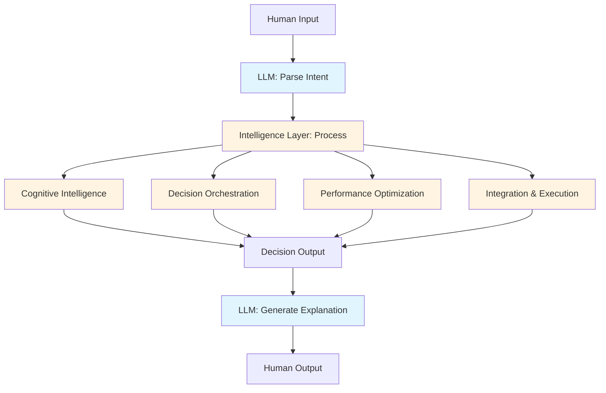

# The Two-Layer Framework: Intelligence vs. Utility

## Overview

XMPro's Multi-Agent Generative Systems (MAGS) represents a fundamental shift in how artificial intelligence is applied to industrial operations. Unlike traditional agent frameworks that position Large Language Models (LLMs) as the primary intelligence, MAGS employs a **two-layer architecture** that clearly separates business process intelligence from text processing utilities.

This architectural distinction is not merely technical—it defines MAGS as an **intelligence platform** (~90%) that uses LLMs as **communication tools** (~10%), rather than an LLM wrapper that attempts to add intelligence through prompting.

### The Core Distinction

**Traditional Agent Frameworks**: LLM-centric systems where the language model drives decision-making, with business logic wrapped around it.

**XMPro MAGS**: Intelligence-centric system where sophisticated business process capabilities drive decisions, with LLMs serving as natural language interfaces.

This distinction matters because:
- **Industrial Reliability**: Business intelligence is deterministic and auditable, not probabilistic
- **Domain Expertise**: Specialized capabilities outperform general-purpose language models
- **Regulatory Compliance**: Explainable decision-making based on established theories
- **Continuous Improvement**: Learning from outcomes, not just training data

---

## The Intelligence Layer (~90%)

The intelligence layer comprises **15 business process capabilities** organized into four categories. These capabilities represent 300+ years of integrated research from economics, cognitive science, decision theory, and distributed systems.

### The Four Capability Categories

#### 1. Cognitive Intelligence (4 capabilities)
The foundation of intelligent behavior—how agents perceive, remember, and learn.

**Capabilities**:
- Memory Significance & Synthetic Memory
- Content-Specific Processing
- Memory Management & Retrieval
- Plan Adaptation & Change Detection

**Theoretical Foundation**:
- Shannon's Information Theory (1948)
- Atkinson-Shiffrin Memory Model (1968)
- Ebbinghaus Forgetting Curve (1885)
- Metacognition (Flavell, 1979)

**Why It Matters**: Agents must determine what information is important, how to store it, and when to adapt—capabilities that require sophisticated cognitive processing beyond text generation.

[Learn more about Cognitive Intelligence →](../cognitive-intelligence/README.md)

#### 2. Decision Orchestration (3 capabilities)
Coordinating decisions across multiple agents and ensuring governance.

**Capabilities**:
- Consensus Management
- Communication Framework
- Agent Lifecycle & Governance

**Theoretical Foundation**:
- Byzantine Fault Tolerance (Lamport et al., 1982)
- Nash Equilibrium (1950)
- Distributed Consensus Algorithms (Paxos, Raft)
- Deontic Logic

**Why It Matters**: Industrial operations require coordinated decision-making with accountability, not isolated agent actions.

[Learn more about Decision Orchestration →](../decision-orchestration/README.md)

#### 3. Performance Optimization (3 capabilities)
Optimizing outcomes based on business objectives.

**Capabilities**:
- Goal Optimization & Utility Functions
- Plan Optimization
- Performance Monitoring & Confidence

**Theoretical Foundation**:
- Utility Theory (Bernoulli 1738, Von Neumann-Morgenstern 1944)
- Multi-Objective Optimization (Pareto 1896)
- Bayesian Statistics (Bayes 1763)
- Prospect Theory (Kahneman & Tversky 1979)

**Why It Matters**: Business decisions require balancing multiple objectives with measurable outcomes, not just generating plausible text.

[Learn more about Performance Optimization →](../performance-optimization/README.md)

#### 4. Integration & Execution (5 capabilities)
Connecting intelligence to real-world systems and actions.

**Capabilities**:
- Tool Orchestration
- DataStream Integration
- Telemetry & Observability
- Objective Function Monitoring
- Confidence Scoring & Quality Control

**Theoretical Foundation**:
- Time Series Analysis (Box & Jenkins 1970)
- Control Theory
- Distributed Systems Theory
- Fuzzy Logic (Zadeh 1965)

**Why It Matters**: Intelligence without execution is theoretical; industrial AI must interact with real systems reliably.

[Learn more about Integration & Execution →](../integration-execution/README.md)

---

## The Utility Layer (~10%)

The utility layer provides natural language capabilities that facilitate human-agent and agent-agent communication. LLMs excel at text processing but are not the source of business intelligence.

### LLM Role Definition

**What LLMs Do in MAGS**:
- Generate natural language explanations of decisions
- Parse and interpret human instructions
- Synthesize information from multiple sources into readable summaries
- Facilitate communication between agents using natural language
- Translate between technical and business terminology

**What LLMs Don't Do in MAGS**:
- ❌ Make business decisions (intelligence layer handles this)
- ❌ Determine what's important (memory significance handles this)
- ❌ Optimize objectives (objective functions handle this)
- ❌ Coordinate agents (consensus mechanisms handle this)
- ❌ Control system behavior (governance frameworks handle this)

### Why This Separation Matters

**Reliability**: Business decisions based on established theories are more reliable than LLM outputs, which can hallucinate or produce inconsistent results.

**Explainability**: Decisions grounded in utility theory, Bayesian statistics, and multi-objective optimization can be explained and audited. LLM reasoning is often opaque.

**Domain Expertise**: Specialized algorithms outperform general-purpose language models for domain-specific tasks like anomaly detection, optimization, and planning.

**Regulatory Compliance**: Industries with strict regulations require explainable, deterministic decision-making, not probabilistic text generation.

**Continuous Improvement**: The intelligence layer learns from outcomes and adapts strategies. LLMs require retraining on new data.

[Learn more about the LLM Utility Layer →](llm-utility-layer.md)

---

## Architectural Implications

### How the Layers Interact

**Flow**:
1. **Input**: LLM parses human natural language into structured intent
2. **Processing**: Intelligence layer applies 15 capabilities to make decisions
3. **Output**: LLM generates natural language explanation of the decision

**Key Principle**: The intelligence layer operates independently of LLMs. LLMs are interfaces, not decision-makers.

### Design Patterns for Layer Separation

#### Pattern 1: Intelligence-First Design
**Principle**: Design business logic first, add LLM interface last.

**Approach**:
1. Define business objectives and constraints
2. Implement intelligence capabilities (memory, optimization, consensus)
3. Add LLM interface for human communication

**Benefit**: Ensures business logic is sound before adding natural language layer.

#### Pattern 2: Deterministic Core, Probabilistic Interface
**Principle**: Core decisions are deterministic; only communication is probabilistic.

**Approach**:
- Intelligence layer uses established algorithms and theories
- LLM layer handles natural language variability
- Decisions remain consistent regardless of phrasing

**Benefit**: Reliability where it matters, flexibility where it helps.

#### Pattern 3: Capability-Driven Architecture
**Principle**: Organize around business capabilities, not LLM features.

**Approach**:
- Structure system around 15 business process capabilities
- Each capability has theoretical foundation
- LLMs support capabilities, don't define them

**Benefit**: Architecture remains stable as LLM technology evolves.

---

## Comparison to Traditional Agent Frameworks

### Traditional Frameworks: LLM-Centric Approach

**Architecture**:
- LLM as primary decision-maker
- Business logic wrapped around LLM calls
- Prompts as primary control mechanism
- Tools as LLM extensions

**Characteristics**:
- **Agent Structure**: Code blocks with predefined methods calling LLMs
- **Decision Logic**: Hardcoded rules or LLM-generated decisions
- **Information Processing**: Linear, step-by-step with LLM calls at specific points
- **Context Awareness**: Limited to current state or immediate input
- **Workflows**: Predetermined paths or decision trees
- **Communication**: Structured protocols with LLM message generation

**Limitations**:
- Decisions depend on LLM quality and consistency
- Limited domain expertise beyond training data
- Difficult to explain or audit decisions
- Adaptability requires prompt engineering or retraining
- Scalability limited by LLM API costs and latency

### XMPro MAGS: Intelligence-Centric Approach

**Architecture**:
- Intelligence layer as primary decision-maker
- LLMs as communication facilitators
- Theoretical foundations as control mechanisms
- Capabilities as core components

**Characteristics**:
- **Agent Structure**: Cognitive architecture with memory, planning, and learning
- **Decision Logic**: Multi-objective optimization, utility functions, consensus mechanisms
- **Information Processing**: Multi-modal synthesis with semantic and relational understanding
- **Context Awareness**: Deep integration of historical, relational, and temporal context
- **Workflows**: Adaptive planning based on PDDL and HTN planning
- **Communication**: Sophisticated inter-agent protocols with natural language interface

**Advantages**:
- Decisions based on established theories, not LLM outputs
- Deep domain expertise through specialized capabilities
- Explainable decisions with theoretical foundations
- Adaptability through learning from outcomes
- Scalability through distributed intelligence, not LLM calls

---

## Key Differences and Advantages

### 1. Cognitive Depth

**Traditional Frameworks**: Rely on LLM reasoning capabilities, which are general-purpose and may lack domain expertise.

**MAGS**: Implements cognitive architecture based on 50+ years of cognitive science research, including memory models, metacognition, and learning theories.

**Advantage**: More sophisticated reasoning that mimics human cognitive processes, not just text generation.

### 2. Adaptability

**Traditional Frameworks**: Adaptability limited to prompt engineering or model retraining. Changes require code updates.

**MAGS**: Continuous learning from outcomes through feedback loops. Adapts decision strategies based on real-world results.

**Advantage**: System improves over time without manual intervention or retraining.

### 3. Context Integration

**Traditional Frameworks**: Context limited to what's explicitly provided in prompts or current state.

**MAGS**: Deep integration of multi-modal context through vector similarity, graph relationships, and temporal analysis.

**Advantage**: Decisions consider comprehensive context, not just immediate inputs.

### 4. LLM Integration

**Traditional Frameworks**: LLMs are central to decision-making, involved in every step.

**MAGS**: LLMs are peripheral tools for communication, not decision-making.

**Advantage**: Decisions remain consistent and explainable, independent of LLM variability.

### 5. Scalability in Complexity

**Traditional Frameworks**: Better suited for well-defined tasks with clear inputs and outputs.

**MAGS**: Designed for highly complex, nuanced scenarios with multiple interdependencies.

**Advantage**: Handles industrial complexity that overwhelms prompt-based systems.

### 6. Explainability

**Traditional Frameworks**: Explanations limited to LLM-generated text, which may not reflect actual decision process.

**MAGS**: Detailed, context-aware explanations based on theoretical foundations and decision traces.

**Advantage**: Regulatory compliance and stakeholder trust through transparent decision-making.

### 7. Transfer Learning

**Traditional Frameworks**: Transfer learning requires explicit programming or model retraining.

**MAGS**: Abstracts general principles from specific experiences, facilitating cross-domain application.

**Advantage**: Learnings from one industrial domain apply to others without retraining.

### 8. Industrial Reliability

**Traditional Frameworks**: Probabilistic outputs may vary between runs, making reliability difficult.

**MAGS**: Deterministic intelligence layer ensures consistent decisions for same inputs.

**Advantage**: Predictable, auditable behavior required for industrial operations.

---

## Real-World Implications

### For Industrial Operations

**Challenge**: Manufacturing processes require consistent, explainable decisions that comply with regulations.

**Traditional Approach**: LLM generates recommendations, humans verify and approve.

**MAGS Approach**: Intelligence layer makes decisions based on utility theory and multi-objective optimization, LLM explains to humans.

**Result**: Faster, more reliable decisions with full auditability.

### For Predictive Maintenance

**Challenge**: Equipment failures require root cause analysis and preventive action planning.

**Traditional Approach**: LLM analyzes logs and suggests potential causes.

**MAGS Approach**: Memory significance identifies anomalies, graph database traces causal chains, planning system generates preventive actions, LLM communicates findings.

**Result**: More accurate root cause identification and effective prevention strategies.

### For Quality Control

**Challenge**: Quality issues require rapid detection, analysis, and corrective action.

**Traditional Approach**: LLM reviews quality data and suggests corrections.

**MAGS Approach**: Confidence scoring detects quality deviations, consensus mechanisms coordinate response across agents, objective functions optimize corrective actions, LLM reports to stakeholders.

**Result**: Faster response with coordinated, optimized corrective actions.

---

## Strategic Positioning

### Why the ~90% / ~10% Split Matters

This ratio is not arbitrary—it reflects the actual distribution of capabilities in MAGS:

**~90% Intelligence**: 15 business process capabilities across 4 categories, each grounded in decades of research.

**~10% Utility**: Natural language processing for communication and explanation.

### Market Differentiation

**LLM Wrappers** (Competitors):
- Position LLMs as the intelligence
- Add business logic as wrappers
- Limited to LLM capabilities
- Dependent on LLM providers

**MAGS** (XMPro):
- Position business intelligence as core
- Use LLMs as communication tools
- Comprehensive industrial capabilities
- Independent of any single LLM provider

### Competitive Advantages

1. **Regulatory Compliance**: Explainable decisions based on established theories
2. **Domain Expertise**: Specialized capabilities outperform general-purpose LLMs
3. **Reliability**: Deterministic intelligence layer ensures consistency
4. **Scalability**: Distributed intelligence, not LLM API calls
5. **Adaptability**: Continuous learning from outcomes
6. **Cost Efficiency**: Intelligence layer doesn't require expensive LLM calls
7. **Vendor Independence**: Works with any LLM provider

---

## Implementation Guidance

### When to Use MAGS

**Ideal Scenarios**:
- Complex industrial operations with multiple interdependencies
- Regulatory environments requiring explainable decisions
- Scenarios requiring continuous learning and adaptation
- Multi-agent coordination with consensus requirements
- Operations where reliability and consistency are critical

**Less Ideal Scenarios**:
- Simple content generation tasks
- One-off text processing
- Scenarios where LLM capabilities alone are sufficient
- Prototyping or proof-of-concept without production requirements

### Getting Started

1. **Identify Business Objectives**: Define what you're optimizing for
2. **Map to Capabilities**: Determine which of the 15 capabilities you need
3. **Design Intelligence Layer**: Implement business logic using theoretical foundations
4. **Add LLM Interface**: Connect natural language communication
5. **Deploy and Learn**: Let the system adapt based on outcomes

[See Best Practices for Agent Design →](../best-practices/agent-design-principles.md)

---

## Research Foundations

The two-layer framework is grounded in 300+ years of research across multiple disciplines:

### Economic & Decision Theory (250+ years)
- Utility Theory (Bernoulli 1738)
- Multi-Objective Optimization (Pareto 1896, Nash 1950)
- Prospect Theory (Kahneman & Tversky 1979)

### Cognitive Science (100+ years)
- Memory Models (Atkinson-Shiffrin 1968, Tulving 1972)
- Information Theory (Shannon 1948)
- Metacognition (Flavell 1979)

### Distributed Systems (40+ years)
- Byzantine Fault Tolerance (Lamport et al. 1982)
- Consensus Algorithms (Paxos 1998, Raft 2014)
- CAP Theorem (Brewer 2000)

### Automated Planning (50+ years)
- STRIPS (Fikes & Nilsson 1971)
- PDDL (McDermott et al. 1998)
- HTN Planning (Erol, Hendler, Nau 1994)

[Explore Complete Research Foundations →](../research-foundations/README.md)

---

## Conclusion

The two-layer framework represents a fundamental rethinking of how AI should be applied to industrial operations. By positioning business process intelligence as the core (~90%) and LLMs as communication tools (~10%), MAGS delivers:

- **Reliability**: Deterministic decisions based on established theories
- **Explainability**: Transparent decision-making for regulatory compliance
- **Adaptability**: Continuous learning from real-world outcomes
- **Scalability**: Distributed intelligence without LLM bottlenecks
- **Domain Expertise**: Specialized capabilities for industrial applications

This approach makes MAGS fundamentally different from LLM wrappers and positions it as a true intelligence platform for industrial AI.

---

## Related Documentation

- [Business Process Intelligence: The 15 Capabilities](business-process-intelligence.md)
- [LLM Utility Layer: Text Processing Role](llm-utility-layer.md)
- [System Components Overview](system-components.md)
- [Cognitive Intelligence Category](../cognitive-intelligence/README.md)
- [Research Foundations](../research-foundations/README.md)

---

## References

### Academic Research
- Bernoulli, D. (1738). "Specimen theoriae novae de mensura sortis"
- Shannon, C. E. (1948). "A Mathematical Theory of Communication"
- Nash, J. (1950). "Equilibrium points in n-person games"
- Atkinson, R. C., & Shiffrin, R. M. (1968). "Human memory: A proposed system"
- Kahneman, D., & Tversky, A. (1979). "Prospect Theory: An Analysis of Decision under Risk"
- Lamport, L., Shostak, R., & Pease, M. (1982). "The Byzantine Generals Problem"

### Industry Analysis
- Gartner (2024). "Agentic AI: Very High Mass, 6-8 years to mainstream adoption"
- Gartner (2024). "Knowledge Graphs: The 'secret ingredient' to a modern Data Fabric"

### XMPro Research
- Park, J. S., et al. (2023). "Generative Agents: Interactive Simulacra of Human Behavior" (Stanford - Inspiration for MAGS)
- XMPro (2024). "Theoretical Foundations and Research-Based Approaches in XMPro MAGS"

---

**Document Version**: 1.0  
**Last Updated**: December 5, 2024  
**Status**: ✅ Complete  
**Next**: [Business Process Intelligence](business-process-intelligence.md)