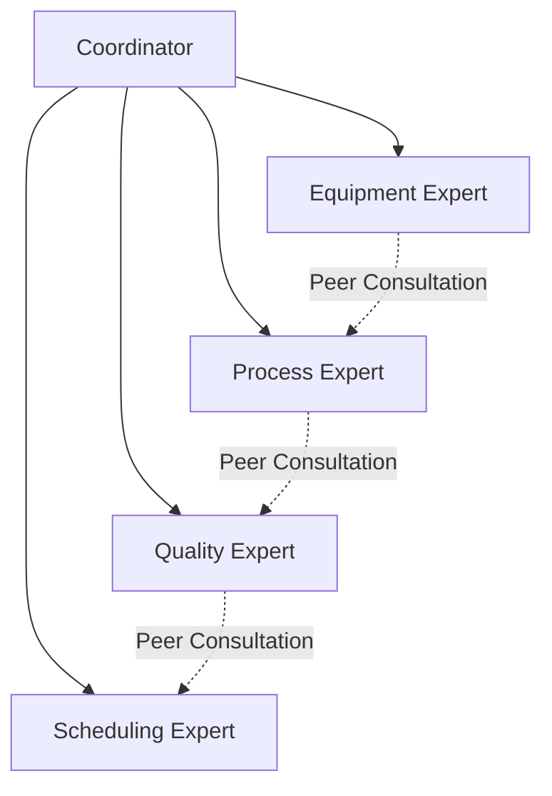
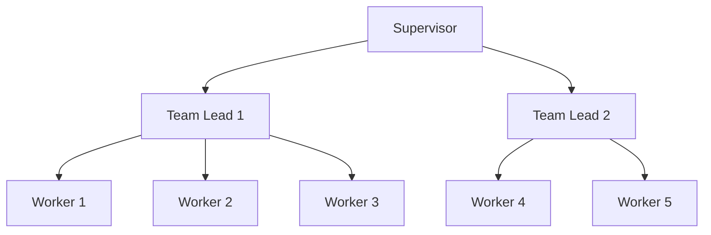
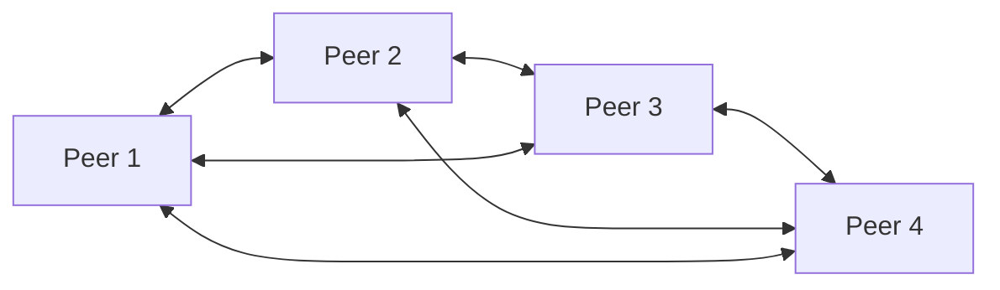
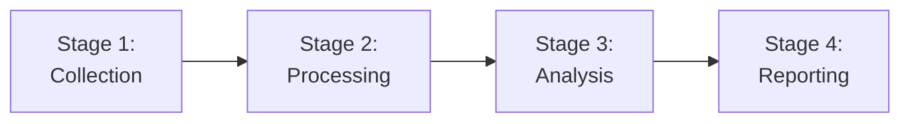
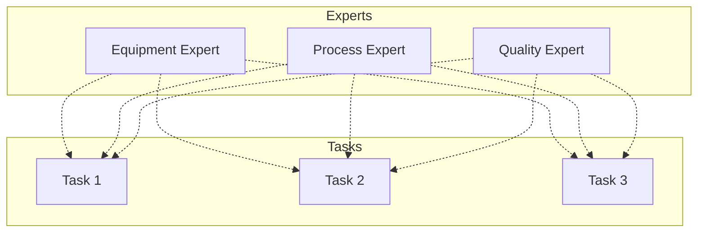

# Team Composition: Building Effective Agent Teams

## Overview

Team composition is the art and science of assembling agent teams that work together effectively to solve complex industrial problems. Well-composed teams leverage complementary capabilities, clear coordination mechanisms, and appropriate size to deliver superior outcomes.

Effective team composition is critical for MAGS success. The right team structure amplifies individual agent capabilities through synergy, while poor composition leads to coordination overhead, capability gaps, and suboptimal results. This document provides comprehensive guidance for building teams that consistently deliver value.

### Why Team Composition Matters

**The Challenge**: Industrial problems are multifaceted, requiring diverse expertise that no single agent possesses. Simply adding more agents doesn't guarantee better results—the wrong team composition can actually reduce effectiveness.

**The Solution**: Systematic team composition based on proven principles from organizational theory, multi-agent systems research, and industrial deployments.

**The Result**: Teams where the whole exceeds the sum of parts, delivering coordinated intelligence that solves complex problems effectively.

### Key Insights

1. **Complementary capabilities are essential**: Teams need diverse, non-overlapping expertise
2. **Size matters**: Too few agents lack coverage, too many create coordination overhead
3. **Coordination mechanisms must match team structure**: Different sizes and structures require different coordination approaches
4. **Clear roles prevent confusion**: Every agent must know its responsibilities and boundaries
5. **Teams must evolve**: Static teams become ineffective as problems and contexts change
6. **Agent count must emerge from use case characteristics** — not intuition or arbitrary limits. Without a structured process, different designers produce teams that vary by 50% in size for the same problem.

---

## Practical Implementation

> **For tactical, step-by-step team sizing**, see [Team Size & Role Separation](../implementation-guides/team-size-role-separation.md) in the Implementation Guides. It provides the full 7-dimension scoring worksheet, the AND Test, Single Expert Test, Data Domain Rule, and hardened combination rules.

### The Three Tests for Role Splitting

When deciding whether to split a role into two agents, apply these tests in order:

**1. The AND Test** (primary test)
Write the system prompt for the proposed combined agent. If it requires the word "AND" to connect two fundamentally different disciplines, split them.
- ❌ "Analyse separation thermodynamics AND calculate market price economics" → split
- ✅ "Analyse batch performance AND compare to golden batch" → same domain, combine

**2. The Single Expert Test**
Ask: "Would a single human expert be expected to have both of these skills?" A process engineer and an economist are different people. If the answer is no, split.

**3. The Data Domain Rule**
If the two roles evaluate fundamentally different data schemas (e.g., thermodynamic sensor readings vs. financial market price feeds), they must be separate agents. Different domain knowledge + different data sources + different reasoning = different agents.

### Mandatory Separations (Non-Negotiable)

These separations cannot be overridden by any efficiency or cost argument:

| Separation | Reason |
|-----------|--------|
| Guardian/Validator must be independent from any economic/optimisation role | The Guardian's value comes entirely from having no incentive to relax constraints for profit |
| Executor must not have decision-making authority | Creates auditable chain of custody: propose → approve → execute |
| Monitor must not have write access to control systems | Prevents a data collection error from accidentally triggering a control action |

### Cross-LLM Validation

The team sizing process has been validated across multiple AI systems (Claude, ChatGPT, Gemini, Grok). Without a structured process, the same use case produced teams of 4, 5, 5, and 6 agents — a 50% variance. After applying the hardened scoring rules and combination tests, all four systems converged to consistent team designs.

**The implication**: Team composition decisions must be documented with explicit reasoning, not just a final count. The reasoning is as important as the number.

The MAGS Configuration Wizard includes a structured scoring worksheet that applies these rules step-by-step. Contact XMPro for access to the Configuration Wizard.

---

## Theoretical Foundations

### Organizational Theory

**Team Science Principles**:
- **Hackman's Model**: Input-Process-Output framework for team effectiveness
- **Tuckman's Stages**: Forming, Storming, Norming, Performing, Adjourning
- **Belbin's Team Roles**: Complementary roles for balanced teams
- **Katzenbach & Smith**: High-performing team characteristics

**Organizational Structures**:
- **Functional**: Organized by expertise domain
- **Divisional**: Organized by product or geography
- **Matrix**: Dual reporting for flexibility
- **Network**: Flexible, project-based collaboration
- **Hierarchical**: Clear authority and reporting lines

**Span of Control**:
- Optimal direct reports: 5-7 for complex work
- Maximum effective span: 10-12 for routine work
- Factors affecting span: task complexity, agent autonomy, coordination needs

### Multi-Agent Systems Theory

**Team Formation**:
- **Coalition formation**: Agents form temporary alliances for specific goals
- **Role assignment**: Matching agent capabilities to team needs
- **Task allocation**: Distributing work based on expertise and availability
- **Team optimization**: Maximizing team utility given constraints

**Coordination Mechanisms**:
- **Centralized**: Single coordinator manages all interactions
- **Decentralized**: Peer-to-peer coordination without central authority
- **Hierarchical**: Multi-level coordination with clear authority
- **Market-based**: Agents negotiate and bid for tasks
- **Consensus-based**: Democratic decision-making

**Communication Patterns**:
- **Broadcast**: One-to-all communication
- **Multicast**: One-to-many selective communication
- **Point-to-point**: Direct agent-to-agent communication
- **Publish-subscribe**: Event-driven asynchronous communication

### Social Psychology

**Group Dynamics**:
- **Social loafing**: Reduced individual effort in groups (mitigation needed)
- **Groupthink**: Conformity pressure reducing critical thinking (diversity helps)
- **Process loss**: Coordination overhead reducing efficiency (minimize through design)
- **Synergy**: Combined effect exceeding individual contributions (goal of good composition)

**Trust and Collaboration**:
- **Swift trust**: Initial trust in new teams
- **Competence trust**: Trust in agent capabilities
- **Benevolence trust**: Trust in agent intentions
- **Integrity trust**: Trust in agent reliability

### Industrial Systems Engineering

**Reliability Through Redundancy**:
- **Active redundancy**: Multiple agents performing same task
- **Standby redundancy**: Backup agents ready to take over
- **Diversity redundancy**: Different approaches to same problem
- **Voting redundancy**: Multiple agents vote on decisions

**Load Balancing**:
- **Round-robin**: Sequential assignment
- **Least-loaded**: Assign to agent with lowest workload
- **Capability-based**: Assign based on agent expertise
- **Geographic**: Assign based on location/proximity

---

## Core Composition Principles

### Principle 1: Complementary Capabilities

**Principle Statement**: Team members should have diverse, non-overlapping expertise that collectively covers all aspects of the problem domain.

**Rationale**:
- Diverse expertise enables comprehensive problem analysis
- Non-overlapping capabilities reduce redundancy and waste
- Complete coverage ensures no critical gaps
- Complementary skills create synergy

**Implementation Approach**:

1. **Identify Required Capabilities**:
   - Analyze problem domain thoroughly
   - List all necessary expertise areas
   - Identify critical vs. optional capabilities
   - Consider edge cases and exceptions

2. **Map Agent Capabilities**:
   - Document each agent's expertise
   - Identify capability overlaps
   - Find capability gaps
   - Assess capability depth

3. **Optimize Coverage**:
   - Ensure all critical capabilities covered
   - Minimize unnecessary overlaps
   - Add agents to fill gaps
   - Remove redundant agents

4. **Validate Completeness**:
   - Test team against problem scenarios
   - Identify remaining gaps
   - Verify no single points of failure
   - Confirm appropriate redundancy

**Example: Predictive Maintenance Team**

**Problem Domain Analysis**:
- Equipment health monitoring
- Failure prediction
- Maintenance scheduling
- Resource coordination
- Compliance tracking

**Team Composition**:

**Equipment Diagnostician**:
- Capabilities: Sensor data analysis, anomaly detection, health assessment
- Domain: Equipment condition monitoring
- Unique contribution: Real-time health insights

**Failure Predictor**:
- Capabilities: Pattern recognition, time-series forecasting, risk assessment
- Domain: Predictive analytics
- Unique contribution: Failure probability and timing

**Maintenance Planner**:
- Capabilities: Schedule optimization, constraint satisfaction, resource allocation
- Domain: Operations planning
- Unique contribution: Optimal maintenance schedules

**Resource Coordinator**:
- Capabilities: Inventory management, personnel scheduling, logistics
- Domain: Resource management
- Unique contribution: Feasibility validation and execution support

**Compliance Monitor**:
- Capabilities: Regulatory tracking, documentation, audit trail
- Domain: Compliance and governance
- Unique contribution: Regulatory adherence

**Capability Coverage Matrix**:

| Capability | Diagnostician | Predictor | Planner | Coordinator | Compliance |
|-----------|--------------|-----------|---------|-------------|------------|
| Health monitoring | ✓✓✓ | ✓ | - | - | - |
| Failure prediction | ✓ | ✓✓✓ | - | - | - |
| Schedule optimization | - | - | ✓✓✓ | ✓ | - |
| Resource management | - | - | ✓ | ✓✓✓ | - |
| Compliance tracking | - | - | - | ✓ | ✓✓✓ |

✓✓✓ = Primary expertise, ✓ = Supporting capability, - = Not applicable

**Validation**:
- All critical capabilities have primary owner
- Supporting capabilities provide redundancy
- No unnecessary overlaps
- Team can handle complete workflow

**Metrics**:
- Capability coverage: 100% of critical capabilities
- Redundancy level: 1-2 agents per critical capability
- Overlap efficiency: <20% unnecessary duplication
- Gap count: 0 critical gaps

---

### Principle 2: Clear Coordination

**Principle Statement**: Teams must have well-defined communication patterns, consensus mechanisms, and escalation paths appropriate for their structure and size.

**Rationale**:
- Clear coordination prevents confusion and conflicts
- Appropriate mechanisms match team characteristics
- Defined processes enable reliable collaboration
- Escalation paths handle exceptions effectively

**Implementation Approach**:

1. **Select Coordination Pattern**:
   - **Small teams (2-5)**: Direct peer communication
   - **Medium teams (5-10)**: Coordinator-mediated
   - **Large teams (10-20)**: Hierarchical coordination
   - **Very large (20+)**: Multi-layer hierarchy or matrix

2. **Define Communication Protocols**:
   - Message formats and standards
   - Communication channels
   - Response time expectations
   - Error handling procedures

3. **Establish Consensus Mechanisms**:
   - Voting rules (majority, supermajority, unanimous)
   - Conflict resolution procedures
   - Tie-breaking approaches
   - Escalation triggers

4. **Create Escalation Paths**:
   - When to escalate (triggers)
   - Who to escalate to (authority)
   - How to escalate (process)
   - Timeout handling

**Example: Quality Control Team Coordination**

**Team Structure**: Hierarchical (12 agents)
```
Quality Supervisor (1)
├── Inspection Lead (1)
│   ├── Line Inspector A (1)
│   ├── Line Inspector B (1)
│   ├── Line Inspector C (1)
│   └── Final Inspector (1)
└── Analysis Lead (1)
    ├── Root Cause Analyzer (1)
    ├── Corrective Action Planner (1)
    ├── Trend Analyzer (1)
    └── Compliance Validator (1)
```

**Communication Protocols**:

**Routine Communication**:
- Inspectors → Inspection Lead: Real-time quality observations
- Analyzers → Analysis Lead: Investigation findings
- Leads → Supervisor: Daily summaries and exception reports

**Exception Communication**:
- Critical quality issue: Direct to Supervisor (bypass lead)
- Urgent corrective action: Broadcast to all relevant agents
- Compliance violation: Immediate escalation chain

**Consensus Mechanisms**:

**Inspection Decisions** (within inspection team):
- Minor issues: Inspector autonomous decision
- Moderate issues: Inspection Lead approval required
- Major issues: Supervisor approval required

**Root Cause Analysis** (within analysis team):
- Hypothesis generation: All analyzers contribute
- Root cause determination: 75% agreement required
- Corrective action: Analysis Lead approval + Supervisor review

**Escalation Paths**:

**Level 1**: Inspector detects issue
- Autonomous: Log and monitor (confidence >0.85, low risk)
- Escalate to Lead: Adjust parameters (confidence >0.75, medium risk)

**Level 2**: Inspection Lead reviews
- Autonomous: Approve minor adjustments
- Escalate to Supervisor: Production line stop (high risk)

**Level 3**: Supervisor decides
- Autonomous: Stop line if confidence >0.95
- Escalate to Human: Batch scrap decisions (critical risk)

**Validation**:
- Are communication paths clear?
- Do consensus mechanisms work reliably?
- Are escalation triggers appropriate?
- Is coordination overhead acceptable?

**Metrics**:
- Communication latency: <target for message type
- Consensus achievement rate: >90%
- Escalation appropriateness: >95%
- Coordination overhead: <15% of total time

---

### Principle 3: Appropriate Size

**Principle Statement**: Teams should be sized to provide necessary capability coverage while minimizing coordination overhead. Start small and scale based on validated need.

**Rationale**:
- Larger teams have more capabilities but higher coordination costs
- Smaller teams are more agile but may lack coverage
- Optimal size balances coverage and coordination
- Premature scaling wastes resources

**Implementation Approach**:

1. **Start with Minimum Viable Team**:
   - Identify absolutely essential capabilities
   - Include only agents providing unique value
   - Typically 2-5 agents for initial deployment
   - Validate effectiveness before expanding

2. **Measure Performance**:
   - Track team outcomes and efficiency
   - Identify capability gaps
   - Measure coordination overhead
   - Assess scalability needs

3. **Scale Incrementally**:
   - Add one agent at a time
   - Validate improvement after each addition
   - Monitor coordination overhead
   - Stop when diminishing returns appear

4. **Optimize Continuously**:
   - Remove underutilized agents
   - Consolidate overlapping capabilities
   - Adjust team size based on workload
   - Maintain efficiency metrics

**Team Size Guidelines**:

**Small Teams (2-5 agents)**:

**Characteristics**:
- Fast coordination
- Low overhead
- High agility
- Limited coverage

**Best For**:
- Simple, focused problems
- Single domain expertise
- Rapid response needs
- Proof of concept

**Coordination**: Direct peer communication, simple consensus

**Example**: Equipment monitoring team
- Monitor agent: Tracks equipment health
- Predictor agent: Forecasts failures
- Coordinator agent: Manages workflow

**Medium Teams (5-10 agents)**:

**Characteristics**:
- Balanced coordination
- Moderate overhead
- Good coverage
- Manageable complexity

**Best For**:
- Multi-domain problems
- Most industrial scenarios
- Production deployments
- Balanced requirements

**Coordination**: Coordinator-mediated or structured peer protocols

**Example**: Process optimization team
- 3 domain experts (equipment, process, quality)
- 2 optimization agents (efficiency, cost)
- 1 coordinator
- 1 execution agent
- 1 monitoring agent

**Large Teams (10-20 agents)**:

**Characteristics**:
- Comprehensive coverage
- Higher overhead
- Deep specialization
- Complex coordination

**Best For**:
- Complex, multi-faceted problems
- Enterprise-scale deployments
- Multiple facilities
- Comprehensive solutions

**Coordination**: Hierarchical structure with sub-teams

**Example**: Enterprise maintenance system
- 4 equipment specialists (rotating, electrical, process, instrumentation)
- 3 predictive analysts (failure, performance, cost)
- 3 planners (maintenance, resource, compliance)
- 2 coordinators (operations, execution)
- 1 supervisor

**Very Large Teams (20+ agents)**:

**Characteristics**:
- Maximum coverage
- Significant overhead
- Requires sub-teams
- Multi-layer hierarchy

**Best For**:
- Enterprise-wide deployments
- Multiple plants/facilities
- Comprehensive programs
- Long-term initiatives

**Coordination**: Multi-layer hierarchy, matrix structure, or federated model

**Example**: Multi-plant quality management
- Plant-level teams (5-7 agents each) × 3 plants
- Enterprise specialists (3-5 agents)
- Coordination layer (2-3 agents)
- Executive oversight (1 agent)

**Scaling Decision Framework**:

```
Current team size: N agents
Current performance: P
Current coordination overhead: C

Add agent if:
- Capability gap identified AND
- Expected performance improvement > 10% AND
- Coordination overhead increase < 5% AND
- No existing agent can be enhanced instead

Remove agent if:
- Utilization < 50% AND
- No unique critical capability AND
- Removal doesn't create gaps AND
- Coordination overhead decreases
```

**Validation**:
- Is team size appropriate for problem complexity?
- Is coordination overhead acceptable?
- Are all agents providing value?
- Can team scale if needed?

**Metrics**:
- Team efficiency: Output / (Agents × Time)
- Coordination overhead: Coordination time / Total time
- Agent utilization: Active time / Available time
- Scaling efficiency: Performance(N) / (N × Performance(1))

---

### Principle 4: Role Clarity

**Principle Statement**: Every agent must have a clearly defined role with explicit responsibilities, authority levels, and boundaries.

**Rationale**:
- Clear roles prevent confusion and conflicts
- Explicit responsibilities enable accountability
- Defined authority enables appropriate autonomy
- Known boundaries reduce overlap and gaps

**Implementation Approach**:

1. **Define Role Components**:
   - **Purpose**: Why this role exists
   - **Responsibilities**: What this agent does
   - **Authority**: What decisions this agent can make
   - **Boundaries**: What this agent doesn't do
   - **Interfaces**: How this agent interacts with others

2. **Document Roles**:
   - Create role profiles for each agent
   - Specify required capabilities
   - Define success metrics
   - Clarify reporting relationships

3. **Communicate Roles**:
   - Share role definitions with all team members
   - Ensure understanding of interfaces
   - Clarify boundary cases
   - Address overlaps explicitly

4. **Validate Roles**:
   - Test role definitions in scenarios
   - Identify ambiguities
   - Resolve conflicts
   - Refine based on experience

**Example: Maintenance Team Role Definitions**

**Equipment Diagnostician Role**:

**Purpose**: Monitor equipment health and detect anomalies requiring attention

**Responsibilities**:
- Continuous monitoring of sensor data
- Anomaly detection and classification
- Health assessment and trending
- Alert generation for significant issues
- Historical pattern analysis

**Authority**:
- Autonomous: Log observations, generate alerts
- Approval required: Recommend equipment shutdown
- Not authorized: Schedule maintenance, order parts

**Boundaries**:
- IN SCOPE: Equipment health assessment, anomaly detection
- OUT OF SCOPE: Failure prediction (Predictor's role), maintenance scheduling (Planner's role)

**Interfaces**:
- Provides to: Failure Predictor (health assessments), Maintenance Planner (alert notifications)
- Receives from: Data sources (sensor streams), Coordinator (monitoring requests)

**Success Metrics**:
- Anomaly detection accuracy: >90%
- False positive rate: <10%
- Detection latency: <5 minutes
- Alert relevance: >85%

**Failure Predictor Role**:

**Purpose**: Forecast equipment failures to enable proactive maintenance

**Responsibilities**:
- Analyze health trends and patterns
- Predict failure probability and timing
- Assess prediction confidence
- Provide failure scenarios
- Update predictions based on new data

**Authority**:
- Autonomous: Generate predictions, update forecasts
- Approval required: Recommend urgent maintenance
- Not authorized: Schedule maintenance, allocate resources

**Boundaries**:
- IN SCOPE: Failure prediction, risk assessment
- OUT OF SCOPE: Health monitoring (Diagnostician's role), scheduling (Planner's role)

**Interfaces**:
- Provides to: Maintenance Planner (predictions), Coordinator (risk assessments)
- Receives from: Diagnostician (health data), Historical database (patterns)

**Success Metrics**:
- Prediction accuracy: >85%
- Lead time adequacy: >90% predictions with >48hr lead time
- Confidence calibration: <10% error
- False alarm rate: <15%

**Role Clarity Matrix**:

| Activity | Diagnostician | Predictor | Planner | Coordinator |
|----------|--------------|-----------|---------|-------------|
| Monitor equipment | **R** | C | I | I |
| Detect anomalies | **R** | C | I | I |
| Predict failures | C | **R** | I | I |
| Schedule maintenance | I | C | **R** | A |
| Allocate resources | I | I | **R** | A |
| Coordinate workflow | I | I | C | **R** |

**R** = Responsible (does the work)  
**A** = Accountable (final authority)  
**C** = Consulted (provides input)  
**I** = Informed (kept updated)

**Validation**:
- Can each agent describe its role in one sentence?
- Are responsibilities clear and non-overlapping?
- Is authority appropriate for responsibilities?
- Are boundaries understood by all?

**Metrics**:
- Role clarity: >90% stakeholder agreement
- Responsibility conflicts: <5% of decisions
- Authority appropriateness: >95% of decisions
- Boundary violations: <2% of activities

---

### Principle 5: Adaptive Composition

**Principle Statement**: Team composition should evolve based on performance feedback, changing requirements, and lessons learned.

**Rationale**:
- Static teams become ineffective as conditions change
- Performance feedback reveals composition issues
- Requirements evolve over time
- Continuous improvement requires adaptation

**Implementation Approach**:

1. **Monitor Team Performance**:
   - Track outcome quality
   - Measure efficiency
   - Assess coordination effectiveness
   - Identify bottlenecks

2. **Analyze Composition Issues**:
   - Capability gaps
   - Redundant agents
   - Coordination problems
   - Workload imbalances

3. **Plan Adjustments**:
   - Add agents for gaps
   - Remove underutilized agents
   - Reassign responsibilities
   - Adjust coordination mechanisms

4. **Implement Changes**:
   - Make one change at a time
   - Validate improvement
   - Document rationale
   - Communicate to team

5. **Review Regularly**:
   - Quarterly composition reviews
   - Post-incident analysis
   - Performance trend analysis
   - Stakeholder feedback

**Example: Evolving Quality Team**

**Initial Composition** (Month 1):
```
Quality Team (5 agents):
- Inspector A (Line 1)
- Inspector B (Line 2)
- Root Cause Analyzer
- Corrective Action Planner
- Coordinator
```

**Performance Issues Identified** (Month 3):
- Line 3 quality issues not detected (gap)
- Root cause analysis slow (bottleneck)
- Corrective actions not validated (gap)

**Composition Adjustment** (Month 4):
```
Quality Team (7 agents):
- Inspector A (Line 1)
- Inspector B (Line 2)
- Inspector C (Line 3) [ADDED - fills gap]
- Root Cause Analyzer 1 (mechanical)
- Root Cause Analyzer 2 (process) [ADDED - reduces bottleneck]
- Corrective Action Planner
- Validation Agent [ADDED - fills gap]
- Coordinator
```

**New Performance Issues** (Month 6):
- Inspector A underutilized (Line 1 stable)
- Coordination overhead increasing

**Composition Optimization** (Month 7):
```
Quality Team (7 agents):
- Inspector A/C (Lines 1 & 3 - shared) [CONSOLIDATED]
- Inspector B (Line 2)
- Root Cause Analyzer 1 (mechanical)
- Root Cause Analyzer 2 (process)
- Corrective Action Planner
- Validation Agent
- Coordinator
```

**Adaptation Triggers**:

**Add Agent When**:
- Capability gap identified
- Workload exceeds capacity
- Response time degrading
- Quality declining

**Remove Agent When**:
- Utilization <50% sustained
- Capability redundant
- No unique value
- Coordination overhead excessive

**Reassign When**:
- Workload imbalanced
- Skills mismatched
- Better utilization possible
- Coordination can improve

**Restructure When**:
- Team size exceeds optimal
- Coordination breaking down
- Major requirement changes
- Performance plateauing

**Validation**:
- Is team performance improving?
- Are adjustments data-driven?
- Is change management effective?
- Are stakeholders informed?

**Metrics**:
- Adaptation frequency: 2-4 changes per year
- Improvement per change: >10% on key metric
- Change success rate: >80%
- Stakeholder satisfaction: >85%

---

## Team Archetypes

### Specialist Team

**Description**: Team of domain experts coordinated by a central agent, each providing deep expertise in their area.

**Structure**:


**Characteristics**:
- Deep domain expertise
- Parallel analysis capability
- Coordinator manages workflow
- Specialists focus on their domain
- Consensus for integrated decisions

**When to Use**:
- Complex multi-domain problems
- Deep expertise required
- Parallel processing beneficial
- Clear domain boundaries exist

**Team Size**: 4-8 agents (1 coordinator + 3-7 specialists)

**Coordination**: Coordinator-mediated with peer consultation

**Example**: Predictive maintenance team with equipment, failure prediction, planning, and resource specialists

**Advantages**:
- Deep expertise in each domain
- Parallel processing reduces latency
- Clear responsibilities
- Scalable by adding specialists

**Disadvantages**:
- Coordinator can become bottleneck
- Requires effective integration
- Consensus may be slow
- Coordination overhead increases with size

---

### Hierarchical Team

**Description**: Multi-layer team with clear authority structure, suitable for large teams and regulatory environments.

**Structure**:


**Characteristics**:
- Clear chain of command
- Escalation through hierarchy
- Authority-based decisions
- Accountability at each level
- Span of control limits (5-7)

**When to Use**:
- Large teams (10+ agents)
- Regulatory compliance critical
- Clear authority needed
- Accountability important
- Structured escalation required

**Team Size**: 10-20+ agents (multi-layer hierarchy)

**Coordination**: Top-down assignment, bottom-up reporting

**Example**: Quality control team with supervisor, inspection lead, analysis lead, and multiple inspectors/analyzers

**Advantages**:
- Clear accountability
- Structured escalation
- Regulatory compliance easier
- Predictable behavior
- Scales well with layers

**Disadvantages**:
- Potential bottlenecks at each level
- Slower decision-making
- Less flexibility
- Risk of over-centralization

---

### Peer Collaboration Team

**Description**: Team of equals working collaboratively with consensus-based decision-making.

**Structure**:


**Characteristics**:
- Equal authority among agents
- Consensus required for decisions
- Collaborative problem-solving
- Shared responsibility
- No single point of control

**When to Use**:
- Equal expertise among agents
- Democratic decisions preferred
- No clear hierarchy appropriate
- Collaborative analysis needed
- Fault tolerance important

**Team Size**: 3-6 agents (larger becomes unwieldy)

**Coordination**: Peer-to-peer with consensus protocols

**Example**: Multi-expert root cause analysis team with process, equipment, quality, and operations experts

**Advantages**:
- Robust to single agent failure
- Diverse perspectives considered
- Democratic, fair decisions
- No hierarchical bottlenecks
- Thorough analysis

**Disadvantages**:
- Slower consensus process
- Potential deadlocks
- Higher coordination complexity
- May struggle with urgent decisions

---

### Pipeline Team

**Description**: Sequential processing team where each agent adds value in a defined order.

**Structure**:


**Characteristics**:
- Linear workflow
- Clear handoffs between stages
- Sequential dependencies
- Each stage adds distinct value
- Asynchronous processing possible

**When to Use**:
- Sequential processing natural
- Clear stage boundaries
- Linear dependencies exist
- Parallel processing not beneficial
- Data transformation workflow

**Team Size**: 3-6 agents (one per stage)

**Coordination**: Queue-based handoffs, asynchronous processing

**Example**: Data analysis pipeline with collection, processing, analysis, insight generation, and reporting stages

**Advantages**:
- Simple, clear coordination
- Well-defined responsibilities
- Easy to understand
- Each stage scalable independently
- Natural for many workflows

**Disadvantages**:
- Sequential bottlenecks possible
- No parallel processing benefits
- Failure propagates through pipeline
- End-to-end latency is sum of stages

---

### Matrix Team

**Description**: Agents serve multiple teams/tasks, providing cross-functional expertise and resource optimization.

**Structure**:


**Characteristics**:
- Agents serve multiple teams
- Cross-functional expertise
- Resource optimization through sharing
- Complex coordination
- Dual reporting (task and domain)

**When to Use**:
- Multiple dimensions of expertise required
- Resource sharing beneficial
- Cross-functional coordination needed
- Flexible assignment desired
- Limited agent resources

**Team Size**: Variable (agents shared across teams)

**Coordination**: Dynamic assignment, priority-based allocation

**Example**: Multi-plant operations with shared domain experts serving multiple plant teams

**Advantages**:
- Efficient resource utilization
- Cross-domain learning
- Flexible assignment
- Comprehensive coverage with fewer agents
- Expertise leveraged across tasks

**Disadvantages**:
- Complex coordination
- Potential resource conflicts
- Agent context switching overhead
- Requires sophisticated management

---

## Best Practices

### Practice 1: Start Small, Scale Deliberately

**Approach**:
1. Begin with minimum viable team (2-5 agents)
2. Validate effectiveness before expanding
3. Add one agent at a time
4. Measure impact of each addition
5. Stop when diminishing returns appear

**Benefits**:
- Lower initial complexity
- Faster initial deployment
- Validated scaling path
- Avoided waste

**Example**:
```
Phase 1: Core team (3 agents) - Validate concept
Phase 2: Add specialist (4 agents) - Fill identified gap
Phase 3: Add coordinator (5 agents) - Improve coordination
Phase 4: Evaluate - Measure performance improvement
```

---

### Practice 2: Define Roles Explicitly

**Approach**:
1. Create detailed role profiles
2. Document responsibilities and authority
3. Clarify boundaries and interfaces
4. Share with all team members
5. Review and refine regularly

**Benefits**:
- Clear accountability
- Reduced conflicts
- Efficient coordination
- Better performance

---

### Practice 3: Match Coordination to Team Size

**Approach**:
1. Small teams (2-5): Direct peer communication
2. Medium teams (5-10): Coordinator-mediated
3. Large teams (10-20): Hierarchical structure
4. Very large (20+): Multi-layer or matrix

**Benefits**:
- Appropriate coordination overhead
- Effective communication
- Scalable structure
- Reliable collaboration

---

### Practice 4: Monitor and Adapt

**Approach**:
1. Track team performance metrics
2. Identify composition issues
3. Plan and implement adjustments
4. Validate improvements
5. Iterate continuously

**Benefits**:
- Continuously improving performance
- Responsive to changes
- Optimized resource usage
- Sustained effectiveness

---

### Practice 5: Balance Specialization and Flexibility

**Approach**:
1. Provide deep domain expertise
2. Enable cross-training where beneficial
3. Maintain some capability overlap
4. Allow flexible assignment
5. Balance efficiency and resilience

**Benefits**:
- Expert-level performance
- Fault tolerance
- Adaptability
- Optimal resource usage

---

## Common Pitfalls

### Pitfall 1: Over-Staffing

**Problem**: Too many agents for the problem complexity, creating excessive coordination overhead.

**Symptoms**:
- High coordination time
- Slow decision-making
- Underutilized agents
- Diminishing returns

**Solution**: Start with minimum viable team, scale based on validated need, remove underutilized agents.

**Prevention**: Measure coordination overhead, track agent utilization, validate value of each agent.

---

### Pitfall 2: Unclear Roles

**Problem**: Overlapping or undefined responsibilities leading to confusion and conflicts.

**Symptoms**:
- Duplicated work
- Gaps in coverage
- Coordination conflicts
- Accountability confusion

**Solution**: Create explicit role definitions, document responsibilities, clarify boundaries, use RACI matrices.

**Prevention**: Regular role clarity reviews, responsibility mapping, conflict detection and resolution.

---

### Pitfall 3: Inappropriate Coordination

**Problem**: Coordination mechanism doesn't match team size or structure.

**Symptoms**:
- Coordination failures
- Communication bottlenecks
- Slow consensus
- Missed dependencies

**Solution**: Select coordination mechanism appropriate for team size and structure, implement proper protocols.

**Prevention**: Match coordination to team characteristics, monitor coordination efficiency, adjust as team evolves.

---

### Pitfall 4: Static Composition

**Problem**: Team composition doesn't adapt to changing requirements or performance feedback.

**Symptoms**:
- Declining performance
- Capability gaps emerging
- Inefficient resource usage
- Missed opportunities

**Solution**: Regular composition reviews, performance-based adjustments, continuous optimization.

**Prevention**: Scheduled reviews, performance monitoring, feedback loops, adaptation triggers.

---

### Pitfall 5: Ignoring Span of Control

**Problem**: Too many direct reports for coordinator, exceeding effective management capacity.

**Symptoms**:
- Coordinator bottleneck
- Slow responses
- Poor oversight
- Coordination failures

**Solution**: Add coordination layers when span exceeds 5-7 agents, implement hierarchical structure.

**Prevention**: Monitor coordinator workload, plan vertical scaling, respect span of control limits.

---

## Measuring Team Effectiveness

### Team Performance Metrics

**Team Outcome Quality**:
```
Outcome Quality = Successful Outcomes / Total Outcomes
Target: >90%
```

**Team Efficiency**:
```
Team Efficiency = Output / (Number of Agents × Time)
Target: >80% of theoretical maximum
```

**Coordination Efficiency**:
```
Coordination Efficiency = Productive Time / (Productive Time + Coordination Time)
Target: >85%
```

**Consensus Achievement**:
```
Consensus Rate = Successful Consensus / Total Decisions Requiring Consensus
Target: >90%
```

### Composition Quality Metrics

**Capability Coverage**:
```
Coverage = Covered Capabilities / Required Capabilities
Target: 100% of critical capabilities
```

**Role Clarity**:
```
Role Clarity = Stakeholders Agreeing on Roles / Total Stakeholders
Target: >90%
```

**Agent Utilization**:
```
Utilization = Active Time / Available Time (per agent)
Target: 60-85% (balanced, not overloaded)
```

**Redundancy Level**:
```
Redundancy = Agents per Critical Capability
Target: 1.5-2.0 (appropriate backup)
```

### Coordination Metrics

**Communication Latency**:
```
Latency = Time from Message Sent to Response Received
Target: <target for message type
```

**Escalation Appropriateness**:
```
Appropriate Escalations = Correct Escalations / Total Escalations
Target: >95%
```

**Coordination Overhead**:
```
Overhead = Coordination Time / Total Time
Target: <15% for most teams
```

**Consensus Time**:
```
Consensus Time = Time to Reach Agreement
Target: <target for decision type
```

### Business Impact Metrics

**Value Delivered**:
- Problem resolution rate
- Cost savings achieved
- Quality improvements
- Efficiency gains

**Stakeholder Satisfaction**:
- Trust in team decisions
- Perceived team effectiveness
- Collaboration quality
- Overall satisfaction

---

## Advanced Topics

### Dynamic Team Formation

**Concept**: Teams that form and dissolve dynamically based on current needs.

**Approaches**:
- Task-based coalition formation
- Capability-based agent selection
- Auction-based team assembly
- Reputation-based selection

**Benefits**:
- Optimal team for each task
- Efficient resource utilization
- Flexibility and adaptability
- Scalability

**Challenges**:
- Complex coordination
- Team formation overhead
- Trust building in temporary teams
- Knowledge continuity

---

### Cross-Functional Teams

**Concept**: Teams that span multiple organizational boundaries or domains.

**Design Considerations**:
- Clear governance structure
- Shared objectives and metrics
- Cross-domain communication
- Conflict resolution mechanisms

**Benefits**:
- Comprehensive problem-solving
- Innovation through diversity
- Reduced silos
- Better integration

---

### Self-Organizing Teams

**Concept**: Teams that adapt their own structure and processes based on performance.

**Approaches**:
- Emergent role assignment
- Adaptive coordination mechanisms
- Self-optimization algorithms
- Collective intelligence

**Benefits**:
- Continuous optimization
- Adaptation to change
- Reduced management overhead
- Innovation

**Considerations**:
- Stability vs. adaptability
- Governance and oversight
- Change validation
- Performance monitoring

---

## Related Documentation

- [Agent Team Patterns](../design-patterns/agent-team-patterns.md) - Detailed team patterns and structures
- [Agent Design Principles](agent-design-principles.md) - Individual agent design
- [Communication Patterns](../design-patterns/communication-patterns.md) - Team communication approaches
- [Decision Patterns](../design-patterns/decision-patterns.md) - Team decision-making
- [Objective Function Design](objective-function-design.md) - Team goal alignment
- [Agent Types](../concepts/agent_types.md) - Available agent types

---

## References

### Organizational Theory
- Hackman, J. R. (2002). "Leading Teams: Setting the Stage for Great Performances"
- Katzenbach, J. R., & Smith, D. K. (1993). "The Wisdom of Teams"
- Mintzberg, H. (1979). "The Structuring of Organizations"
- Galbraith, J. R. (2014). "Designing Organizations"

### Team Science
- Salas, E., et al. (2008). "On Teams, Teamwork, and Team Performance"
- Kozlowski, S. W., & Ilgen, D. R. (2006). "Enhancing the Effectiveness of Work Groups and Teams"
- Mathieu, J. E., et al. (2008). "Team Effectiveness 1997-2007: A Review of Recent Advancements"

### Multi-Agent Systems
- Wooldridge, M. (2009). "An Introduction to MultiAgent Systems"
- Ferber, J. (1999). "Multi-Agent Systems: An Introduction to Distributed Artificial Intelligence"
- Weiss, G. (1999). "Multiagent Systems: A Modern Approach to Distributed Artificial Intelligence"

### Coordination Theory
- Malone, T. W., & Crowston, K. (1994). "The Interdisciplinary Study of Coordination"
- Van de Ven, A. H., et al. (1976). "Determinants of Coordination Modes within Organizations"
- Thompson, J. D. (1967). "Organizations in Action"

### Social Psychology
- Forsyth, D. R. (2018). "Group Dynamics"
- Levine, J. M., & Moreland, R. L. (1990). "Progress in Small Group Research"
- Steiner, I. D. (1972). "Group Process and Productivity"

---

**Document Version**: 2.0
**Last Updated**: December 5, 2025
**Status**: ✅ Enhanced to Match Phases 1-4 Quality Standard