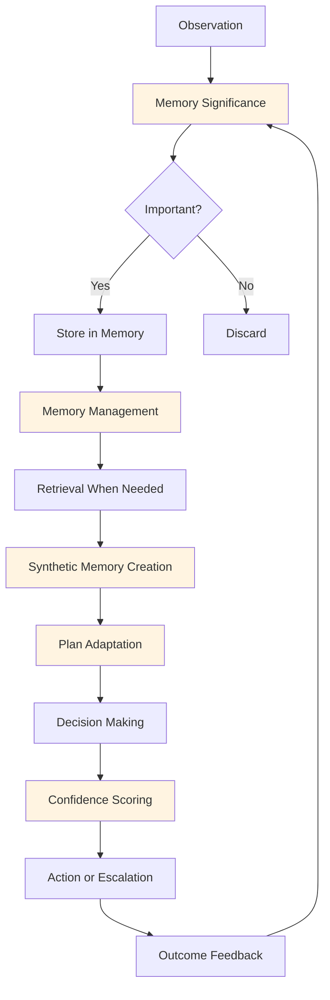

# Cognitive Intelligence: The Foundation of MAGS

## Overview

Cognitive Intelligence is the first and most fundamental category of the [15 business process intelligence capabilities](../architecture/business-process-intelligence.md) that distinguish XMPro MAGS from LLM wrappers. These capabilities enable agents to perceive, remember, learn, and adapt—mimicking human cognitive processes through research-based algorithms.

While LLMs provide text processing (the ~10% utility layer), cognitive intelligence provides the sophisticated reasoning and learning that constitutes the core of the ~90% intelligence layer.

### The Four Cognitive Capabilities

1. **[Memory Significance & Synthetic Memory](memory-significance.md)** - Determining what's important and creating insights
2. **[Content-Specific Processing](content-processing.md)** - Domain-aware interpretation and understanding
3. **[Memory Management & Retrieval](memory-management.md)** - Efficient storage and context-aware retrieval
4. **[Confidence Scoring](confidence-scoring.md)** - Quality control and self-assessment
5. **[Plan Adaptation](plan-adaptation.md)** - Change detection and dynamic adjustment

### Why Cognitive Intelligence Matters

**The Challenge**: Industrial operations generate massive amounts of data and require sophisticated decision-making that goes far beyond text generation.

**The Solution**: Cognitive intelligence capabilities that:
- Identify what information is truly important (not just what's recent)
- Create higher-level insights from raw observations
- Retrieve relevant context efficiently
- Adapt to changing conditions dynamically
- Assess decision quality with confidence

**The Result**: Agents that learn, adapt, and improve over time—capabilities that LLMs alone cannot provide.

---

## Theoretical Foundations

Cognitive intelligence in MAGS is grounded in 100+ years of cognitive science research:

### Information Theory (Shannon, 1948)
**Principle**: Rare events carry more information than common ones.

**Application in MAGS**:
- Memory significance calculation
- Surprise-based importance scoring
- Information content quantification

**Why It Matters**: Helps agents focus on truly significant events, not just frequent ones.

---

### Attention Economics (Herbert Simon, 1971)
**Principle**: "Attention is the scarce resource."

**Application in MAGS**:
- Importance weighting based on attention
- Frequency-based significance
- Sustained attention tracking

**Why It Matters**: Agents must allocate cognitive resources efficiently, just like humans.

---

### Prospect Theory (Kahneman & Tversky, 1979)
**Principle**: Context-dependent evaluation with loss aversion.

**Application in MAGS**:
- Context-aware significance scoring
- Reference point dependence
- Two-dimensional surprise (what × when)

**Why It Matters**: Same information has different significance in different contexts.

---

### Ebbinghaus Forgetting Curve (1885)
**Principle**: Memory strength decays exponentially over time.

**Application in MAGS**:
- Memory decay factors
- Temporal weighting
- Recency scoring

**Why It Matters**: Recent information is generally more relevant, but important old information shouldn't be forgotten.

---

### Atkinson-Shiffrin Memory Model (1968)
**Principle**: Multi-store memory system (sensory → short-term → long-term).

**Application in MAGS**:
- Recent memory cache (short-term)
- Vector database (semantic long-term)
- Time series database (episodic long-term)

**Why It Matters**: Different types of memory serve different purposes and require different storage.

---

### Tulving's Memory Types (1972)
**Principle**: Episodic memory (events) vs. semantic memory (knowledge).

**Application in MAGS**:
- Time series DB for episodic memory (when, what happened)
- Vector DB for semantic memory (meaning, relationships)
- Graph DB for structural memory (who, connections)

**Why It Matters**: Enables both "what happened" and "what it means" understanding.

---

### Metacognition (Flavell, 1979)
**Principle**: "Thinking about thinking" - self-monitoring and regulation.

**Application in MAGS**:
- Confidence scoring
- Self-assessment
- Calibration based on outcomes

**Why It Matters**: Agents must know when they're confident and when to seek help.

---

## How Cognitive Intelligence Works

### The Cognitive Cycle

**Flow Description**:
1. **Observe**: Agent receives information from environment
2. **Significance**: Determine if information is important
3. **Store**: Keep important information, discard noise
4. **Manage**: Organize and maintain memory efficiently
5. **Retrieve**: Access relevant context when needed
6. **Synthesize**: Create higher-level insights
7. **Adapt**: Adjust plans based on new information
8. **Decide**: Make decisions with context
9. **Assess**: Score confidence in decisions
10. **Act**: Execute or escalate based on confidence
11. **Learn**: Feedback improves future significance scoring

---

## Cognitive Intelligence vs. LLM Capabilities

### What LLMs Provide
- Text generation and understanding
- Pattern recognition in training data
- General knowledge retrieval
- Natural language processing

### What LLMs Cannot Provide
- ❌ Context-aware importance determination
- ❌ Exponential memory decay
- ❌ Multi-store memory management
- ❌ Confidence calibration from outcomes
- ❌ Dynamic plan adaptation
- ❌ Domain-specific significance scoring

### What Cognitive Intelligence Adds
- ✅ Sophisticated importance calculation (Shannon, Simon, Kahneman)
- ✅ Research-based memory management (Atkinson-Shiffrin, Tulving)
- ✅ Temporal decay and recency effects (Ebbinghaus, Murdock)
- ✅ Self-assessment and calibration (Flavell, Bayesian statistics)
- ✅ Adaptive learning from outcomes
- ✅ Domain-specific processing

**Result**: Agents that truly learn and adapt, not just generate text.

---

## Integration with Other Capabilities

Cognitive intelligence enables the other 11 capabilities:

### Enables Decision Orchestration
- **Consensus Management**: Memory provides context for voting
- **Communication**: Synthetic memories enable sophisticated sharing
- **Governance**: Confidence scoring triggers compliance checks

### Enables Performance Optimization
- **Goal Optimization**: Memory informs objective function tuning
- **Plan Optimization**: Adaptation improves planning strategies
- **Performance Monitoring**: Confidence enables self-assessment

### Enables Integration & Execution
- **Tool Orchestration**: Memory tracks tool effectiveness
- **DataStream Integration**: Significance filters important events
- **Telemetry**: Confidence scores inform monitoring

[Learn more about all 15 capabilities →](../architecture/business-process-intelligence.md)

---

## Design Patterns

### Pattern 1: Significance-First Processing

**Principle**: Determine importance before processing.

**Approach**:
1. Calculate significance score
2. If above threshold, process fully
3. If below threshold, discard or summarize
4. Store only significant information

**Benefits**:
- Reduced computational cost
- Focused attention on important events
- Efficient memory usage

**Use Cases**:
- High-volume sensor data
- Event stream processing
- Log analysis

---

### Pattern 2: Multi-Store Memory

**Principle**: Different memory types for different purposes.

**Approach**:
1. Short-term: Recent, fast access, volatile
2. Long-term semantic: Meaning, slower access, persistent
3. Long-term episodic: Events, temporal, persistent

**Benefits**:
- Optimized for access patterns
- Efficient storage
- Rich context retrieval

**Use Cases**:
- Decision-making with context
- Root cause analysis
- Pattern recognition

---

### Pattern 3: Confidence-Gated Actions

**Principle**: Act only when confident, escalate when uncertain.

**Approach**:
1. Calculate confidence score
2. If high confidence, act autonomously
3. If medium confidence, act with monitoring
4. If low confidence, escalate to human

**Benefits**:
- Risk management
- Quality control
- Appropriate autonomy

**Use Cases**:
- Critical decisions
- Safety-critical operations
- Regulatory compliance

---

### Pattern 4: Adaptive Learning

**Principle**: Learn from outcomes to improve future decisions.

**Approach**:
1. Make decision with confidence score
2. Track actual outcome
3. Compare expected vs. actual
4. Adjust significance scoring and confidence calibration
5. Improve future decisions

**Benefits**:
- Continuous improvement
- Domain adaptation
- Reduced errors over time

**Use Cases**:
- Predictive maintenance
- Quality control
- Process optimization

---

## Use Cases

### Predictive Maintenance

**Challenge**: Identify equipment that needs maintenance before failure.

**Cognitive Intelligence Application**:
1. **Memory Significance**: Identify unusual vibration patterns
2. **Content Processing**: Interpret domain-specific sensor data
3. **Memory Retrieval**: Find similar past failures
4. **Synthetic Memory**: Create failure prediction patterns
5. **Confidence Scoring**: Assess prediction reliability
6. **Plan Adaptation**: Adjust maintenance schedule dynamically

**Result**: Accurate predictions with appropriate confidence, reducing both failures and unnecessary maintenance.

---

### Quality Control

**Challenge**: Detect quality issues and determine root causes.

**Cognitive Intelligence Application**:
1. **Memory Significance**: Flag significant quality deviations
2. **Content Processing**: Understand quality metrics in context
3. **Memory Retrieval**: Find related quality issues
4. **Synthetic Memory**: Identify recurring patterns
5. **Confidence Scoring**: Assess root cause confidence
6. **Plan Adaptation**: Adjust quality thresholds dynamically

**Result**: Faster quality issue detection with accurate root cause identification.

---

### Process Optimization

**Challenge**: Continuously improve process efficiency.

**Cognitive Intelligence Application**:
1. **Memory Significance**: Identify optimization opportunities
2. **Content Processing**: Understand process constraints
3. **Memory Retrieval**: Find successful past optimizations
4. **Synthetic Memory**: Create optimization strategies
5. **Confidence Scoring**: Assess optimization impact
6. **Plan Adaptation**: Refine optimization approaches

**Result**: Continuous process improvement with measurable confidence.

---

## Best Practices

### Memory Significance Tuning

**For Stable Processes**:
- Higher significance thresholds (focus on exceptions)
- Slower memory decay (retain historical patterns)
- Lower reflection frequency (less frequent synthesis)

**For Dynamic Processes**:
- Lower significance thresholds (catch more changes)
- Faster memory decay (adapt quickly)
- Higher reflection frequency (frequent synthesis)

**For Learning Phases**:
- Very low thresholds (learn everything)
- Slow decay (retain learning)
- High reflection frequency (rapid synthesis)

---

### Content Processing Optimization

**Domain Specialization**:
- Use domain-specific embeddings
- Incorporate domain rules
- Leverage domain ontologies

**Context Management**:
- Maintain domain context across interactions
- Switch contexts appropriately
- Combine multiple domains when needed

---

### Memory Management Efficiency

**Caching Strategy**:
- Cache frequently accessed memories
- Use time-based expiration
- Implement LRU eviction

**Retrieval Optimization**:
- Index by multiple dimensions
- Use approximate nearest neighbor for vectors
- Leverage time-based partitioning

---

### Confidence Calibration

**Calibration Approach**:
- Track historical accuracy
- Adjust confidence based on outcomes
- Use domain-specific calibration

**Threshold Setting**:
- High confidence: Autonomous action
- Medium confidence: Monitored action
- Low confidence: Human escalation

---

## Common Pitfalls

### Avoid These Mistakes

**❌ Treating All Information Equally**
- Problem: Information overload, poor focus
- Solution: Use memory significance to prioritize

**❌ Ignoring Temporal Context**
- Problem: Stale information influences decisions
- Solution: Apply memory decay and recency weighting

**❌ Over-Confident Decisions**
- Problem: Acting on uncertain information
- Solution: Use confidence scoring and calibration

**❌ Static Significance Thresholds**
- Problem: Poor adaptation to changing conditions
- Solution: Use plan adaptation to adjust dynamically

**❌ Generic Processing for All Domains**
- Problem: Poor understanding of domain-specific data
- Solution: Use content-specific processing

---

## Measuring Success

### Key Metrics

**Memory Significance**:
- Precision: % of significant events correctly identified
- Recall: % of truly significant events captured
- False positive rate: % of insignificant events flagged

**Memory Management**:
- Retrieval latency: Time to find relevant memories
- Storage efficiency: Memory used vs. information retained
- Cache hit rate: % of retrievals served from cache

**Confidence Scoring**:
- Calibration error: Difference between confidence and accuracy
- Escalation rate: % of decisions escalated
- Autonomous success rate: % of autonomous decisions correct

**Plan Adaptation**:
- Adaptation frequency: How often plans are adjusted
- Adaptation effectiveness: Improvement from adaptations
- Adaptation latency: Time to detect and respond to changes

---

## Related Documentation

### Architecture
- [Two-Layer Framework](../architecture/two-layer-framework.md)
- [Business Process Intelligence](../architecture/business-process-intelligence.md)
- [System Components](../architecture/system-components.md)
- [Data Architecture](../architecture/data-architecture.md)

### Concepts
- [Memory Systems](../concepts/memory-systems.md)
- [ORPA Cycle](../concepts/orpa-cycle.md)
- [Agent Types](../concepts/agent_types.md)

### Individual Capabilities
- [Memory Significance](memory-significance.md)
- [Content Processing](content-processing.md)
- [Memory Management](memory-management.md)
- [Confidence Scoring](confidence-scoring.md)
- [Plan Adaptation](plan-adaptation.md)

---

## References

### Cognitive Science
- Shannon, C. E. (1948). "A Mathematical Theory of Communication"
- Simon, H. A. (1971). "Designing Organizations for an Information-Rich World"
- Kahneman, D., & Tversky, A. (1979). "Prospect Theory: An Analysis of Decision under Risk"
- Ebbinghaus, H. (1885). "Memory: A Contribution to Experimental Psychology"
- Atkinson, R. C., & Shiffrin, R. M. (1968). "Human memory: A proposed system"
- Tulving, E. (1972). "Episodic and semantic memory"
- Flavell, J. H. (1979). "Metacognition and cognitive monitoring"

### Information Theory
- Shannon, C. E., & Weaver, W. (1949). "The Mathematical Theory of Communication"
- Cover, T. M., & Thomas, J. A. (2006). "Elements of Information Theory"

### Memory Systems
- Baddeley, A. (2000). "The episodic buffer: A new component of working memory?"
- Squire, L. R. (2004). "Memory systems of the brain: A brief history and current perspective"

---

**Document Version**: 1.0  
**Last Updated**: December 5, 2024  
**Status**: ✅ Complete  
**Next**: [Memory Significance](memory-significance.md)