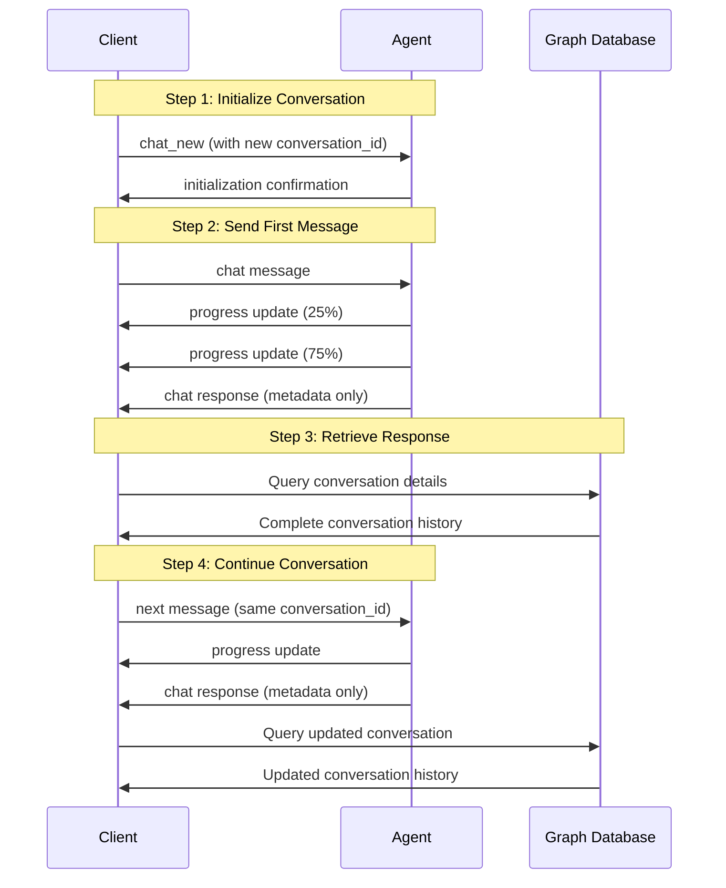

# Agent Messaging Protocol

This document outlines how to interact with XMPro MAGS agents through messaging. There are two main interaction patterns: conversations (chat) and observations.

## Conversations with Agents

### 1. Conversation Initialization (Required First Step)

Before you can start chatting with an agent, you MUST initialize a conversation:

**Topic**: `XMAGS/{teamId}/CMD/chat_new/{agentId}`

**Payload**:
```json
{
    "agent_id": "CNT-SPEC-AGENT-001",
    "conversation_id": "550e8400-e29b-41d4-a716-446655440000",
    "content": " "
}
```

**Expected Responses**: 

1. Success Case:
```json
{
    "conversation_id": "550e8400-e29b-41d4-a716-446655440000",
    "agent_id": "FERM-DATA-AGENT-001",
    "status": "initialized",
    "timestamp": "2024-04-08T10:30:00Z"
}
```

2. Id Already Exists:
```json
{
    "conversation_id": "550e8400-e29b-41d4-a716-446655440000",
    "agent_id": "FERM-DATA-AGENT-001",
    "status": "exists",
    "message": "Conversation Id already exists",
    "timestamp": "2024-04-08T10:30:00Z"
}
```

> **Important**: 
> - You must generate a valid GUID for the conversation_id
> - The conversation_id must be unique - reusing an existing ID will result in an "exists" response
> - Both success and error responses come through the progress topic


### 2. Sending Messages

After initialization, you can send messages using the conversation Id received:

**Topic**: `XMAGS/{teamId}/DATA/chat/{agentId}/{conversationId}`

**Payload**:
```json
{
    "agent_id": "{agentId}",
    "conversation_id": "{conversationId}",
    "content": "What is the current status of asset XYZ?"
}
```

### 3. Receiving Agent Responses

The agent sends two types of responses:

1. **Progress Updates** (Multiple, Optional)
   
   **Topic**: `XMAGS/{teamId}/EVT/chat_progress/{agentId}/{conversationId}`
   
   **Standard Progress Update**:
   ```json
   {
       "conversation_id": "550e8400-e29b-41d4-a716-446655440000",
       "agent_id": "FERM-DATA-AGENT-001",
       "status": "observation check",
       "message": "Verifying if an observation is required based on the information received",
       "timestamp": "2024-04-08T10:30:05Z",
       "current_operation": "observation"
   }
   ```

   **Tool Execution Progress Update**:
   ```json
   {
       "conversation_id": "550e8400-e29b-41d4-a716-446655440000",
       "agent_id": "FERM-DATA-AGENT-001",
       "status": "processing_tool",
       "message": "Listening on stream Pump Condition Monitoring... (12 messages received)",
       "timestamp": "2024-04-08T10:30:05Z",
       "progress_percentage": 100,
       "current_operation": "tool_execution",
       "message_sequence": 12,
   }
   ```

   > **Note**: The `progress_percentage` and `message_sequence` fields are only included when the agent is executing tools. These fields help track the progress of tool operations.

2. **Final Response**
   
   **Topic**: `XMAGS/{teamId}/EVT/chat_response/{agentId}/{conversationId}`
   
   **Payload**:
   ```json
   {
       "agent_id": "FERM-DATA-AGENT-001",
       "conversation_id": "2cd01186-15b2-43c2-9237-7f94f725048c",
       "timestamp": 1731020972
   }
   ```

   > **Important**: The final response contains only metadata. To retrieve the actual conversation content, you must query the graph database using the conversation_id. See [Graph Database Queries](#graph-database-queries) below.

### Graph Database Queries

To get the conversation details after receiving the final response:

```cypher
MATCH (c:Artifact {type: 'Conversation', id: $conversationId})-[:HAS_ENTRY]->(start:Entry)
MATCH path = (start)-[:NEXT*0..]->(e:Entry)
RETURN e.reply as reply, e.prompt as prompt, e.response as response, e.summary as summary, e.user_query as user_query, e.timestamp as timestamp
ORDER BY e.timestamp ASC
```

This returns the complete conversation history including:
- Prompts and responses
- Summaries
- Original user queries
- Timestamps
- Performance metrics (token usage, response times)
- Tool usage information
- Any observations triggered by the conversation

### Example Conversation Flow

Here's a typical chat interaction sequence:

1. Client sends chat initialization
2. Client sends message
3. Agent sends progress updates (possibly multiple)
4. Agent sends final response
5. Client sends next message
6. (Process repeats)



### Important Notes

1. Always include `conversation_id` when sending chat messages
2. Messages must be sent in the correct sequence
3. Wait for response before sending next message
4. Handle progress updates appropriately in your UI
5. Process error messages and provide appropriate user feedback

For the complete topic naming convention, see [Message Broker Topic Naming Convention](../naming-conventions/Message-Broker-Topic.md).

## Observations

### Sending Observations

**Agent-Specific Observation**
   
   **Topic**: `XMAGS/{teamId}/DATA/observation/{agentId}`
   
   **Payload**:
   ```json
   {
       "content": "Asset XYZ temperature has exceeded normal operating range",
       "agent_id": "FERM-DATA-AGENT-001"
   }
   ```

### 1. Receiving Observation Results

When an observation is triggered, you'll receive a metadata message:

**Topic**: `XMAGS/{teamId}/EVT/observation_result/{agentId}`

**Payload**:
```json
{
  "agent_id": "FERM-MAINT-AGENT-001",
  "importance": 0,
  "observation_id": "37eb8450-c59c-41e1-ab45-5ebe38171f56",
  "timestamp": "2024-11-08T19:43:55.6796639Z"
}
```

To retrieve the actual reflection content, query the graph database:

```cypher
MATCH (m:Memory {id: $observationId})
RETURN m
```

### 2. Receiving Reflection Results

When a reflection is triggered, you'll receive a metadata message:

**Topic**: `XMAGS/{teamId}/EVT/reflection_result/{agentId}`

**Payload**:
```json
{
  "agent_id": "FERM-MAINT-AGENT-001",
  "importance": 1,
  "reflection_id": "3afda26c-2d8f-4473-8b4b-ff78aedd2bfa",
  "timestamp": "2024-11-08T19:44:09.7342147Z"
}
```

To retrieve the actual reflection content, query the graph database:

```cypher
MATCH (m:Memory {id: $reflectionId})
RETURN m
```

## Planning

The agent sends several types of plan-related messages:

### New Plan Creation

**Topic**: `XMAGS/{teamId}/EVT/plan_new/{agentId}`

**Payload**:
```json
{
    "active": true,
    "agent_id": "FERM-DATA-AGENT-001",
    "plan_id": "plan_550e8400-e29b-41d4-a716-446655440000",
    "status": "Active",
    "timestamp": "2024-04-08T10:30:00Z"
}
```

### Plan Updates

**Topic**: `XMAGS/{teamId}/EVT/plan_update/{agentId}`

**Payload**:
```json
{
    "active": true,
    "agent_id": "FERM-DATA-AGENT-001",
    "plan_id": "plan_550e8400-e29b-41d4-a716-446655440000",
    "status": "Updated",
    "timestamp": "2024-04-08T10:30:00Z"
}
```

### Plan Tasks Distribution

**Topic**: `XMAGS/{teamId}/CMD/plan_task`

**Payload**:
```json
{
    "active": true,
    "pddl_actions": "...", // PDDL plan representation
    "plan_id": "plan_550e8400-e29b-41d4-a716-446655440000",
    "source_agent_id": "FERM-DATA-AGENT-001",
    "status": "new", // or "adjusted" for updates
    "timestamp": "2024-04-08T10:30:00Z"
}
```

### Plan Actions Distribution

**Topic**: `XMAGS/{teamId}/CMD/plan_action`

**Payload**:
```json
{
    "plan_id": "plan_550e8400-e29b-41d4-a716-446655440000",
    "source_agent_id": "FERM-DATA-AGENT-001",
    "status": "new", // or "adjusted" for updates
    "tasks": [
        {
            "id": "task_123",
            "description": "Monitor fermentation temperature",
            "status": "Pending"
            // Additional task details
        }
    ],
    "timestamp": "2024-04-08T10:30:00Z"
}
```

As with conversations, observations and reflections, to get the complete plan details, query the graph database:

```cypher
MATCH (p:Artifact {type: 'Plan', active: true, agent_id: $agentId})
OPTIONAL MATCH (p)-[:HAS_TASK]->(t:Entry {type: 'Task'})
WHERE t.status <> 'Cancelled' OR t.status IS NULL
OPTIONAL MATCH (t)-[:HAS_ACTION]->(a:Entry {type: 'Action'})
RETURN p, 
 t,
 collect(a) as actions
 ```

## Error Responses

If something goes wrong, you'll receive an error message:

**Topic**: `XMAGS/{teamId}/EVT/error/{agentId}`

**Payload**:
```json
{
  "agent_id": "FERM-MAINT-AGENT-001",
  "exception_type": "Neo4j.Driver.ServiceUnavailableException",
  "message": "Failed to connect to any routing server. Please make sure that the cluster is up and can be accessed by the driver and retry.",
  "stack_trace": "   at Neo4j.Driver.Internal.Routing.RoutingTableManager.UpdateRoutingTableAsync(AccessMode mode, String database, SessionConfig sessionConfig, Bookmarks bookmarks)\n   at Neo4j.Driver.Internal.Routing.RoutingTableManager.EnsureRoutingTableForModeAsync(AccessMode mode, String database, SessionConfig sessionConfig, Bookmarks bookmarks)\n   at Neo4j.Driver.Internal.Routing.LoadBalancer.AcquireConnectionAsync(AccessMode mode, String database, SessionConfig sessionConfig, Bookmarks bookmarks, Boolean forceAuth)\n   at Neo4j.Driver.Internal.Routing.LoadBalancer.AcquireAsync(AccessMode mode, String database, SessionConfig sessionConfig, Bookmarks bookmarks, Boolean forceAuth)\n   at Neo4j.Driver.Internal.AsyncSession.AcquireConnectionAndDbNameAsync(AccessMode mode, Boolean forceAuth)\n   at Neo4j.Driver.Internal.AsyncSession.<>c__DisplayClass38_0.<<RunAsync>b__0>d.MoveNext()\n--- End of stack trace from previous location ---\n   at Neo4j.Driver.Internal.Logging.DriverLoggerUtil.TryExecuteAsync[T](ILogger logger, Func`1 func, String message)\n   at Neo4j.Driver.Internal.AsyncSession.DiscardUnconsumedResultAsync()\n   at XMPro.MAGS.Data.DatabaseManager.RunQueryAsync(String query, Object parameters)\n   at XMPro.MAGS.Data.DatabaseManager.GetAgentInstanceWithTeam(String agentId)\n   at XMPro.MAGS.MemoryCycle.MemoryCycle.GetAgentInstance(String agentId)",
  "timestamp": "2024-11-08T18:29:46.3979459Z"
}
```

## Important Notes

1. Both chat responses, observation and reflection results return only metadata through the message broker
2. The actual content must be retrieved from the graph database using the provided Ids
3. This pattern allows for:
   - Efficient real-time messaging
   - Complete content storage and retrieval
   - Historical querying and analysis
   - Complex relationship tracking between conversations, observation and reflections
