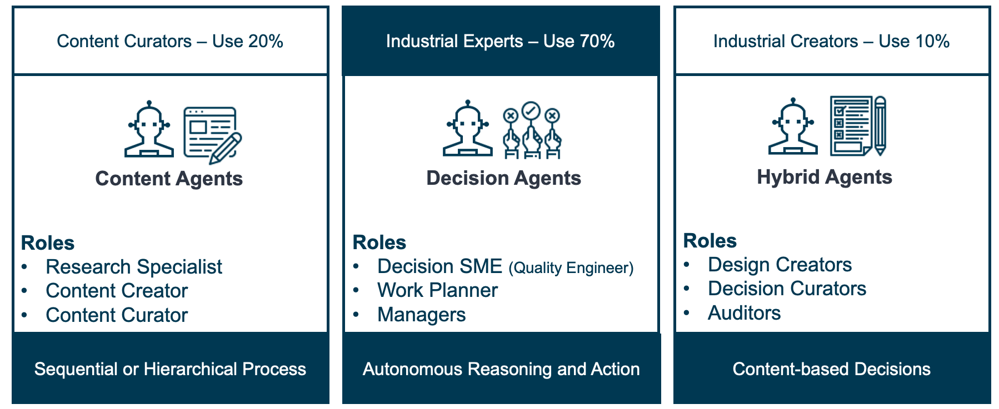

# Agent Types in Multi-Agent Generative Systems (MAGS)

## Table of Contents
1. [Overview](#overview)
2. [Content Agents](#1-content-agents-llm-powered-information-generation-and-curation)
   - [Capabilities](#capabilities)
   - [Typical Roles](#typical-roles)
   - [Value Proposition](#value-proposition)
3. [Decision Agents](#2-decision-agents-strategic-process-optimization-and-decision-making)
   - [Capabilities](#capabilities-1)
   - [Typical Roles](#typical-roles-1)
   - [Value Proposition](#value-proposition-1)
4. [Hybrid Agents](#3-hybrid-agents-versatile-problem-solvers-with-integrated-content-and-decision-capabilities)
   - [Capabilities](#capabilities-2)
   - [Typical Roles](#typical-roles-2)
   - [Value Proposition](#value-proposition-2)

## Overview

Multi-Agent Generative Systems (MAGS) represent an advanced integration of artificial intelligence in industrial applications, bringing together specialized agents to optimize processes, enhance decision-making, and drive continuous improvement. MAGS are composed of three primary types of agents **Content Agents**, **Decision Agents**, and **Hybrid Agents**, each contributing unique capabilities that collectively transform industrial operations.

## 1. Content Agents: LLM-Powered Information Generation and Curation

**Content Agents** are specialized AI entities that leverage Large Language Models (LLMs) to generate, curate, and manage information. These agents excel in tasks related to content creation, documentation management, and compliance support, making them the backbone of information processing in MAGS. Content Agents streamline workflows by automating data-intensive processes, ensuring that critical information is accessible, accurate, and up-to-date.

### Capabilities

1. **Content Generation:**
   - Content Agents use LLMs to produce technical documentation, reports, procedural guides, and other information-rich outputs. This automation ensures consistency, accuracy, and efficiency in content creation.
   - **Key Functions:**
     - Generate reports, manuals, and technical documents based on predefined prompts and inputs.
     - Create content tailored to specific operational needs, including safety protocols, operational guidelines, and training materials.
     - Automate routine documentation tasks, freeing up human resources for more strategic activities.

2. **Data Synthesis and Curation:**
   - These agents aggregate and synthesize data from diverse sources, including internal databases, regulatory documents, and industry standards. They maintain and update knowledge bases, ensuring that content remains relevant to current operations.
   - **Key Functions:**
     - Compile data from various sources to produce comprehensive analyses and insights.
     - Organize and categorize content, creating structured collections and knowledge repositories.
     - Update existing documentation to reflect changes in processes, standards, or regulations.

3. **Compliance Auditing and Reporting:**
   - Content Agents assist in auditing existing documentation against current and upcoming regulatory requirements, identifying gaps and potential non-compliances that could affect certifications and asset management.
   - **Key Functions:**
     - Conduct audits of compliance documentation, ensuring alignment with industry standards and regulations.
     - Generate compliance reports and update certifications for regulated equipment, such as pressure vessels and relief valves.
     - Identify areas where existing documentation may become outdated due to regulatory changes and suggest necessary updates.

### Typical Roles

1. **Simulation Scenario Generator**
   - **Function:** Creates diverse simulation scenarios for testing and validation, enhancing robustness and reliability.
   - **Application:** Used in automotive and industrial environments to simulate varying conditions and validate system performance.

2. **Software Architecture Assistant**
   - **Function:** Documents software architectures, generating detailed descriptions and component overviews to support the development process.
   - **Application:** Assists software teams by providing structured documentation that supports system design and integration.

3. **Parameters Identification**
   - **Function:** Identifies and documents key parameters from technical data, creating comprehensive parameter sets for analysis and optimization.
   - **Application:** Commonly used in engineering fields to document important variables affecting performance and safety.

4. **Compliance Audit Agent**
   - **Function:** Conducts compliance audits on current documentation, specifications, and certifications, ensuring they meet evolving standards and regulations.
   - **Application:** Essential in regulated industries to maintain up-to-date compliance and ensure continued certification of critical assets.

5. **Requirement Assistant**
   - **Function:** Manages and curates requirements documentation, ensuring clarity and consistency across projects.
   - **Application:** Deployed in various industries to support the accurate definition and management of requirements.

6. **Requirements Migration**
   - **Function:** Facilitates the transition of requirements between different systems or formats, maintaining data consistency.
   - **Application:** Streamlines requirements management during tool migrations or system upgrades.

7. **Test Copilot**
   - **Function:** Develops and manages test cases and procedures, automating testing documentation.
   - **Application:** Supports quality assurance by enhancing traceability and consistency in testing processes.

8. **Traceability Assistant**
   - **Function:** Maintains traceability between requirements, designs, and tests, ensuring alignment across project phases.
   - **Application:** Critical for compliance and quality management, ensuring consistency from design to testing.

### Value Proposition

Content Agents play a crucial role in managing structured information, supporting regulatory compliance, and maintaining up-to-date documentation. By automating content creation and curation tasks, they enhance operational efficiency, ensure consistency, and provide reliable support across various stages of industrial workflows.

## 2. Decision Agents: Strategic Process Optimization and Decision-Making

**Decision Agents** are the strategic core of MAGS, simulating human-like reasoning and decision-making processes to optimize industrial operations. These agents observe, reflect, plan, and act autonomously, managing complex, dynamic environments where rapid, data-driven decisions are crucial for maintaining optimal performance. Decision Agents enhance operational outcomes by integrating advanced AI capabilities that continuously learn and adapt to changing conditions.

### Capabilities

1. **Observation:**
   - Decision Agents monitor data from sensors, equipment metrics, production data, and operational logs, providing real-time insights into the system’s current state.
   - **Key Functions:**
     - Detect anomalies or deviations in data that indicate potential issues.
     - Monitor key performance indicators (KPIs) such as temperature, pressure, and cycle times.
     - Track equipment status and production rates, identifying inefficiencies or early signs of failure.

2. **Reflection:**
   - Decision Agents analyze gathered data to identify patterns, trends, and correlations. They reflect on information using historical data and industry best practices, simulating how human experts assess and understand their environment.
   - **Key Functions:**
     - Conduct root cause analysis to determine the factors affecting performance.
     - Compare current data with historical benchmarks to detect deviations or improvement opportunities.
     - Use predictive analytics to anticipate potential failures or quality issues.

3. **Planning:**
   - Leveraging insights from reflection, Decision Agents simulate scenarios and develop strategic action plans. They evaluate multiple options, considering potential risks and benefits, before selecting the optimal course of action.
   - **Key Functions:**
     - Generate optimized control strategies by simulating process adjustments.
     - Develop predictive maintenance schedules to minimize downtime and extend equipment lifespan.
     - Model the impacts of proposed changes using scenario simulations to ensure effective implementations.

4. **Action:**
   - Decision Agents execute planned actions autonomously, making real-time adjustments to processes, implementing control strategies, or initiating maintenance activities.
   - **Key Functions:**
     - Dynamically adjust process variables to align with optimal conditions.
     - Initiate maintenance activities based on predictive insights.
     - Implement control adjustments to stabilize processes and enhance efficiency.

### Typical Roles

1. **Process Parameter Optimization Agent**
   - **Function:** Analyzes real-time data to optimize process parameters, continuously adapting to maximize efficiency.
   - **Application:** Enhances productivity and quality in manufacturing environments through precise process control.

2. **Advanced Control Strategy Agent**
   - **Function:** Develops complex control strategies by analyzing process variables and desired outcomes, adjusting controls dynamically.
   - **Application:** Crucial in precision manufacturing where maintaining tight control is essential for consistent quality.

3. **Predictive Maintenance Agent**
   - **Function:** Forecasts potential equipment failures using sensor data and maintenance logs, scheduling proactive maintenance.
   - **Application:** Reduces downtime and extends asset life in industries where equipment reliability is critical.

4. **Anomaly Detection and Root Cause Analysis Agent**
   - **Function:** Detects anomalies in operational data, performs root cause analysis, and recommends corrective actions.
   - **Application:** Vital in maintaining process stability and preventing defects in dynamic environments.

5. **Simulation and Scenario Analysis Agent**
   - **Function:** Simulates different operating conditions, allowing pre-implementation evaluation of process adjustments.
   - **Application:** Used in process improvement initiatives to test changes in a virtual environment before real-world application.

6. **Performance Monitoring Agent**
   - **Function:** Tracks equipment performance metrics, identifying bottlenecks and providing insights to improve efficiency.
   - **Application:** Key in production environments focused on maximizing Overall Equipment Effectiveness (OEE).

7. **Quality Monitoring Agent**
   - **Function:** Monitors product quality data, identifying defects and recommending improvements to maintain high standards.
   - **Application:** Supports stringent quality control in manufacturing processes.

8. **Knowledge Synthesis and Decision Support Agent**
   - **Function:** Synthesizes data from various sources, generating decision support reports and providing actionable insights.
   - **Application:** Enhances decision-making in complex setups by delivering clear, data-driven guidance.

### Value Proposition

Decision Agents provide a robust layer of autonomous decision-making, continuously optimizing processes, improving equipment reliability, and enhancing product quality. Their human-like reasoning capabilities enable them to handle complex scenarios with speed and precision, driving significant improvements in operational efficiency.

## 3. Hybrid Agents: Versatile Problem-Solvers with Integrated Content and Decision Capabilities

**Hybrid Agents** combine the strengths of Content and Decision Agents, making them uniquely capable of handling tasks that require both data synthesis and strategic decision-making. These agents manage information while simultaneously executing decisions, providing a holistic approach to complex industrial challenges. Hybrid Agents excel in roles that demand versatility, integrating content generation with real-time decision execution.

### Capabilities

1. **Content Generation and Curation:**
   - Hybrid Agents use LLMs to generate, synthesize, and maintain information, producing technical documentation and reports while managing knowledge bases.
   - **Key Functions:**
     - Aggregate data from multiple sources to produce comprehensive insights and reports

.
     - Maintain and update documentation, ensuring it reflects current standards and processes.
     - Curate structured knowledge bases, enhancing accessibility and usability of information.

2. **Data Analysis and Reflection:**
   - Hybrid Agents analyze operational data, identifying trends and drawing insights that inform decision-making. They use historical data and best practices to understand the context of current operations.
   - **Key Functions:**
     - Analyze data to identify inefficiencies or improvement opportunities.
     - Reflect on past performance to inform future actions.
     - Apply predictive analytics to anticipate challenges and develop proactive strategies.

3. **Strategic Planning:**
   - Hybrid Agents simulate scenarios and develop plans, evaluating options and selecting optimal strategies to achieve desired outcomes.
   - **Key Functions:**
     - Generate and evaluate process adjustments through scenario simulations.
     - Plan and prioritize tasks based on data-driven insights.
     - Balance content management with strategic decision-making.

4. **Decision Execution:**
   - Hybrid Agents execute decisions autonomously, adjusting processes, updating documentation, or implementing control strategies in real time.
   - **Key Functions:**
     - Implement process adjustments based on analysis.
     - Update compliance documentation to reflect regulatory changes.
     - Initiate corrective actions to optimize operations.

### Typical Roles

1. **Design Creator**
   - **Function:** Develops detailed design proposals and prototypes, integrating content creation with strategic evaluation.
   - **Application:** Supports innovation and product development in R&D and engineering teams.

2. **Decision Curator**
   - **Function:** Curates information into structured knowledge bases while optimizing knowledge distribution strategies.
   - **Application:** Deployed in training and compliance management to maintain accessible, up-to-date information.

3. **Compliance and Audit Agent**
   - **Function:** Conducts audits on documentation and specifications, ensuring compliance with evolving standards.
   - **Application:** Essential in regulated industries to maintain current compliance and certification.

4. **Innovation Strategist**
   - **Function:** Synthesizes research to create strategic initiatives, evaluating the feasibility of new technologies.
   - **Application:** Used in continuous improvement efforts to adopt innovative solutions.

5. **Operational Auditor**
   - **Function:** Conducts audits of operational processes, identifying inefficiencies and recommending improvements.
   - **Application:** Supports routine audits and continuous improvement in manufacturing and industrial settings.

6. **Risk Governance Analyst**
   - **Function:** Compiles data for risk assessment, evaluating risks and recommending mitigation strategies.
   - **Application:** Deployed in industries where risk management is critical to operations.

### Value Proposition

Hybrid Agents bridge the gap between content management and decision-making, offering a versatile approach to complex challenges. By integrating both capabilities, they enable organizations to manage information effectively while executing strategic actions that enhance performance, compliance, and continuous improvement.
