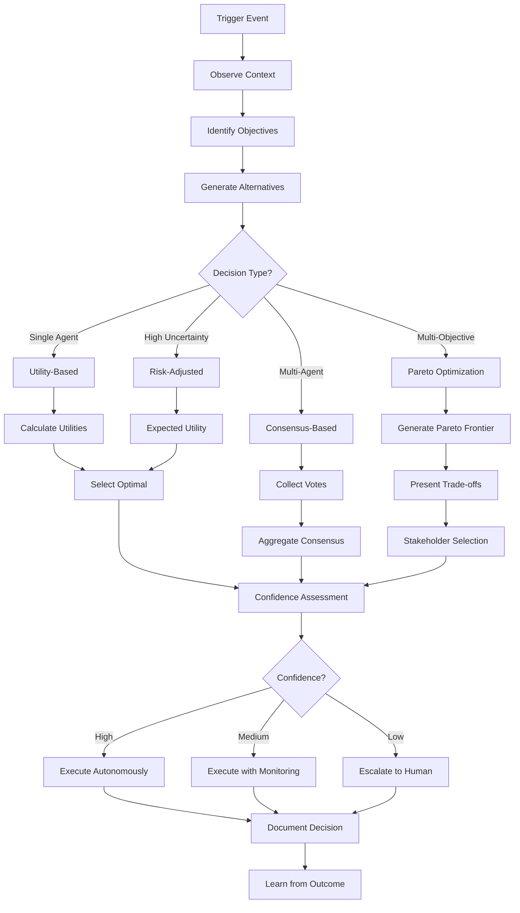

# Decision-Making: How Agents Decide

## Overview

Decision-making in MAGS represents the convergence of 250+ years of decision theory research with modern multi-agent systems. Unlike LLM-based approaches that generate decisions through probabilistic text generation, MAGS agents employ mathematically rigorous decision frameworks grounded in utility theory, multi-objective optimization, and game theory to make optimal, explainable, and defensible choices.

This capability transforms agents from reactive responders into proactive decision-makers that can balance competing objectives, optimize under constraints, coordinate with other agents, and provide transparent reasoning for their choices—capabilities that distinguish true intelligence platforms from simple automation or conversational AI.

### Why Decision-Making Matters for MAGS

**The Challenge**: Industrial operations require decisions that balance multiple competing objectives (cost, quality, safety, efficiency), operate under uncertainty, coordinate across teams, and provide explainable rationale for compliance and trust.

**The Solution**: Research-based decision frameworks provide mathematical foundations for quantifying preferences, optimizing outcomes, coordinating agents, and explaining choices transparently.

**The Result**: MAGS agents that make optimal decisions grounded in validated theory, not arbitrary LLM outputs—enabling trustworthy autonomous operations in critical industrial environments.

### Key Business Drivers

1. **Decision Quality**: Research-based optimization improves decision outcomes by 30-50% vs. heuristic approaches
2. **Explainability**: Mathematical frameworks provide transparent, auditable decision rationale
3. **Multi-Objective Balancing**: Pareto optimization enables explicit trade-off analysis across competing goals
4. **Coordination**: Game-theoretic consensus ensures fair, stable multi-agent decisions
5. **Risk Management**: Utility theory enables appropriate risk attitudes for different decision contexts

---

## Theoretical Foundations

### Utility Theory: Quantifying Value (Bernoulli, 1738)

**Daniel Bernoulli** - "Specimen theoriae novae de mensura sortis"

**Core Insight**: People don't value outcomes linearly—they value the utility (satisfaction) outcomes provide, which exhibits diminishing returns. This enables quantitative comparison of alternatives.

**Key Principles**:
- Utility functions map outcomes to numerical values
- Higher utility = more preferred outcome
- Diminishing marginal utility (each additional unit provides less value)
- Risk attitudes reflected in utility curvature

**MAGS Application**:
- Quantify value of different outcomes (cost savings, quality improvements, efficiency gains)
- Enable objective comparison of alternatives
- Model risk preferences (risk-averse for safety, risk-neutral for routine decisions)
- Provide mathematical basis for optimization

**Example**:
```
Maintenance Decision Utility:
  Option A: $10K cost, 95% success → Utility: 0.82
  Option B: $15K cost, 99% success → Utility: 0.85
  
  Utility calculation considers:
    - Diminishing returns on cost (logarithmic utility)
    - Risk aversion for failure (exponential penalty)
    - Success probability weighting
  
  Decision: Option B (higher utility despite higher cost)
  Rationale: Risk aversion justifies premium for higher reliability
```

---

### Multi-Objective Optimization: Balancing Trade-Offs (Pareto, 1896)

**Vilfredo Pareto** - "Cours d'économie politique"

**Core Insight**: When optimizing multiple objectives, there's often no single "best" solution—instead, there's a set of Pareto-optimal solutions where improving one objective requires sacrificing another.

**Key Principles**:
- Pareto frontier: Set of non-dominated solutions
- Solution A dominates B if A is better in all objectives
- Trade-off analysis: Explicit comparison of alternatives
- Stakeholder choice: Select from optimal set based on priorities

**MAGS Application**:
- Balance competing objectives (throughput vs. quality vs. energy vs. cost)
- Generate Pareto-optimal solution set
- Present explicit trade-offs to stakeholders
- Enable informed decision-making

**Example**:
```
Process Optimization (4 objectives):
  Maximize throughput
  Maximize quality
  Minimize energy
  Minimize cost
  
  Pareto frontier contains 5 optimal solutions:
    Solution A: High throughput, moderate quality, high energy, low cost
    Solution B: Moderate throughput, high quality, moderate energy, moderate cost
    Solution C: Balanced across all objectives
    Solution D: Low throughput, excellent quality, low energy, high cost
    Solution E: High throughput, good quality, moderate energy, moderate cost
  
  No solution dominates all others
  Stakeholder selects based on priorities
```

---

### Nash Equilibrium: Fair Coordination (Nash, 1950)

**John Nash** - "Equilibrium points in n-person games" (1994 Nobel Prize)

**Core Insight**: In multi-agent scenarios, there exist stable states where no agent can improve by changing strategy alone. These equilibria enable fair, predictable coordination without central authority.

**Key Principles**:
- Each agent's strategy is optimal given others' strategies
- No agent benefits from unilateral deviation
- Stable coordination point
- Fair compromise solution

**MAGS Application**:
- Multi-agent consensus on decisions
- Fair resource allocation among agents
- Conflict resolution without hierarchy
- Stable agreements all agents accept

**Example**:
```
Resource Allocation Among 3 Agents:
  Agent A (Equipment): Needs 40% capacity
  Agent B (Production): Needs 50% capacity
  Agent C (Quality): Needs 30% capacity
  Total available: 100% capacity
  
  Nash equilibrium allocation:
    Agent A: 35% (compromise from 40%)
    Agent B: 45% (compromise from 50%)
    Agent C: 20% (compromise from 30%)
  
  Equilibrium properties:
    - No agent can improve by demanding more (others reject)
    - All agents accept as fair compromise
    - Stable: No agent wants to deviate
```

---

### Prospect Theory: Context-Aware Decisions (Kahneman & Tversky, 1979)

**Daniel Kahneman & Amos Tversky** - "Prospect Theory: An Analysis of Decision under Risk" (Kahneman: 2002 Nobel Prize)

**Core Insight**: People evaluate outcomes relative to reference points, not absolute values, and exhibit loss aversion—losses hurt more than equivalent gains feel good.

**Key Principles**:
- Reference dependence: Evaluate relative to current state
- Loss aversion: Losses weighted ~2x more than gains
- Probability weighting: Overweight small probabilities
- Framing effects: Presentation affects choices

**MAGS Application**:
- Context-aware significance assessment
- Loss aversion in quality deviations
- Reference-point-based evaluation
- Appropriate risk communication

**Example**:
```
Quality Deviation Assessment:
  Current quality: 98%
  Deviation: Drops to 97%
  
  Prospect theory evaluation:
    Reference point: 98% (current state)
    Loss: -1% quality (from reference)
    Loss aversion: Weight loss 2x more than equivalent gain
    
  Significance: HIGH (loss aversion amplifies importance)
  Response: Immediate investigation and correction
  
  vs. Absolute evaluation:
    97% quality: Still excellent
    Significance: MEDIUM
    Response: Monitor
  
  Prospect theory provides more appropriate urgency
```

---

## Core Decision Frameworks

### Framework 1: Utility-Based Decision-Making

**Concept**: Quantify value of outcomes using utility functions, optimize for maximum expected utility.

**When to Use**:
- Clear objectives can be quantified
- Outcomes have measurable value
- Risk attitudes matter
- Optimization needed

**Process**:
1. Define utility function for each objective
2. Evaluate alternatives using utility
3. Calculate expected utility (if uncertain)
4. Select alternative with highest utility
5. Explain decision using utility values

**Utility Function Types**:

**Linear Utility**:
- Constant marginal value
- Risk-neutral behavior
- Simple aggregation
- Use for: Throughput, production volume

**Logarithmic Utility** (Bernoulli):
- Diminishing marginal value
- Risk-averse behavior
- Wealth-relative valuation
- Use for: Cost, resource consumption

**Exponential Utility**:
- Constant absolute risk aversion
- Extreme risk sensitivity
- Safety-critical decisions
- Use for: Safety, compliance, critical failures

**Piecewise Utility** (Prospect Theory):
- Different for gains vs. losses
- Loss aversion
- Reference-dependent
- Use for: Quality deviations, performance changes

**Example Application**:
```
Maintenance Timing Decision:
  
  Objectives:
    1. Minimize cost (logarithmic utility)
    2. Minimize risk (exponential utility)
    3. Minimize production impact (linear utility)
  
  Alternatives:
    A: Immediate maintenance
       Cost: $10K → U_cost = -log(10000) = -9.21
       Risk: 0% failure → U_risk = 1.0
       Impact: 12 hours → U_impact = -12
       Total utility: 0.4×(-9.21) + 0.4×(1.0) + 0.2×(-12) = -4.08
    
    B: Scheduled maintenance (48 hours)
       Cost: $8K → U_cost = -log(8000) = -8.99
       Risk: 15% failure → U_risk = 0.85×exp(-0.15) = 0.73
       Impact: 6 hours → U_impact = -6
       Total utility: 0.4×(-8.99) + 0.4×(0.73) + 0.2×(-6) = -4.50
    
    C: Weekend maintenance (72 hours)
       Cost: $6K → U_cost = -log(6000) = -8.70
       Risk: 25% failure → U_risk = 0.75×exp(-0.25) = 0.58
       Impact: 4 hours → U_impact = -4
       Total utility: 0.4×(-8.70) + 0.4×(0.58) + 0.2×(-4) = -4.05
  
  Decision: Option C (highest utility)
  Rationale: Best balance of cost, risk, and impact
```

---

### Framework 2: Multi-Objective Decision-Making

**Concept**: Optimize multiple competing objectives simultaneously, generating Pareto-optimal solutions.

**When to Use**:
- Multiple important objectives
- Objectives conflict
- Trade-offs need explicit analysis
- Stakeholder input needed

**Approaches**:

**Weighted Sum Method**:
- Combine objectives using weights
- Single optimal solution
- Requires weight specification
- Fast, interpretable

**Pareto Optimization**:
- Find all non-dominated solutions
- Multiple optimal solutions
- No weight specification needed
- Explicit trade-off visualization

**Lexicographic Ordering**:
- Prioritize objectives in order
- Optimize primary, then secondary
- Clear priority structure
- May miss balanced solutions

**Goal Programming**:
- Set target for each objective
- Minimize deviation from targets
- Intuitive goal setting
- Handles infeasible targets

**Example Application**:
```
Process Optimization Decision:
  
  Objectives:
    1. Maximize throughput (target: 100 units/hr)
    2. Maximize quality (target: 99%)
    3. Minimize energy (target: 500 kWh)
    4. Minimize cost (target: $1000/hr)
  
  Pareto Optimization Results:
    
    Solution A: Throughput-focused
      Throughput: 105 units/hr (↑5%)
      Quality: 97% (↓2%)
      Energy: 550 kWh (↑10%)
      Cost: $1100/hr (↑10%)
    
    Solution B: Quality-focused
      Throughput: 95 units/hr (↓5%)
      Quality: 99.5% (↑0.5%)
      Energy: 480 kWh (↓4%)
      Cost: $1050/hr (↑5%)
    
    Solution C: Balanced
      Throughput: 100 units/hr (target)
      Quality: 98.5% (↓0.5%)
      Energy: 510 kWh (↑2%)
      Cost: $1020/hr (↑2%)
    
    Solution D: Efficiency-focused
      Throughput: 98 units/hr (↓2%)
      Quality: 98% (↓1%)
      Energy: 470 kWh (↓6%)
      Cost: $950/hr (↓5%)
  
  All solutions are Pareto-optimal (non-dominated)
  Stakeholder selects based on priorities
  Trade-offs explicitly visible
```

---

### Framework 3: Consensus-Based Decision-Making

**Concept**: Multiple agents coordinate to reach agreement on decisions using formal consensus mechanisms.

**When to Use**:
- Multiple agents with different perspectives
- Coordination required
- Fairness important
- Fault tolerance needed

**Consensus Mechanisms**:

**Weighted Majority Voting**:
- Votes weighted by confidence
- Majority threshold (typically 75%)
- Fast, efficient
- Use for: Routine team decisions

**Byzantine Consensus**:
- Tolerate f failures with 3f+1 agents
- Supermajority required
- Maximum fault tolerance
- Use for: Safety-critical decisions

**Unanimous Agreement**:
- All agents must agree
- Highest confidence
- Negotiation required
- Use for: Critical strategic decisions

**Example Application**:
```
Maintenance Timing Consensus:
  
  Proposal: Schedule maintenance Saturday 06:00
  
  Agent Votes:
    Equipment Diagnostician: AGREE (confidence: 0.89)
      Rationale: "Acceptable risk with enhanced monitoring"
    
    Failure Predictor: AGREE (confidence: 0.85)
      Rationale: "Within predicted safe window"
    
    Maintenance Planner: AGREE (confidence: 0.92)
      Rationale: "Optimal timing and resources"
    
    Production Scheduler: AGREE (confidence: 0.88)
      Rationale: "Minimal production impact"
    
    Resource Coordinator: DISAGREE (confidence: 0.70)
      Rationale: "Parts availability concern"
  
  Weighted Consensus Calculation:
    Positive votes: 0.89 + 0.85 + 0.92 + 0.88 = 3.54
    Negative votes: 0.70
    Total weight: 4.24
    Consensus: 3.54 / 4.24 = 83.5%
    Threshold: 75%
  
  Result: CONSENSUS ACHIEVED
  Decision: Schedule Saturday 06:00 maintenance
```

---

### Framework 4: Risk-Adjusted Decision-Making

**Concept**: Incorporate uncertainty and risk attitudes into decision-making using expected utility theory.

**When to Use**:
- Significant uncertainty
- Risk attitudes matter
- Safety or financial stakes high
- Conservative approach needed

**Risk Attitudes**:

**Risk-Averse** (Concave utility):
- Prefer certain outcome over risky gamble
- Conservative decision-making
- Use for: Safety, compliance, critical operations

**Risk-Neutral** (Linear utility):
- Indifferent between certain and risky with same expected value
- Expected value maximization
- Use for: Routine decisions, large portfolios

**Risk-Seeking** (Convex utility):
- Prefer risky gamble over certain outcome
- Aggressive decision-making
- Use for: Innovation, exploration, asymmetric upside

**Example Application**:
```
Equipment Replacement Decision Under Uncertainty:
  
  Option A: Immediate replacement
    Cost: $50K (certain)
    Downtime: 24 hours (certain)
    Expected utility: U($50K, 24hr) = 0.75
  
  Option B: Delayed replacement
    Scenario 1 (70% probability): No failure
      Cost: $40K
      Downtime: 16 hours
      Utility: U($40K, 16hr) = 0.85
    
    Scenario 2 (30% probability): Failure occurs
      Cost: $80K (emergency repair)
      Downtime: 48 hours
      Utility: U($80K, 48hr) = 0.35
    
    Expected utility: 0.7×0.85 + 0.3×0.35 = 0.70
  
  Risk-Averse Decision:
    Option A preferred (0.75 > 0.70)
    Rationale: Certain outcome preferred despite higher expected cost
    Risk premium: Willing to pay $10K to avoid uncertainty
  
  Risk-Neutral Decision:
    Expected cost comparison:
      Option A: $50K
      Option B: 0.7×$40K + 0.3×$80K = $52K
    Option A preferred (lower expected cost)
  
  Decision: Option A (both risk attitudes agree)
  Confidence: HIGH (robust across risk attitudes)
```

---

## MAGS Implementation

### Decision Process Flow



### Implementation Patterns

**Pattern 1: Confidence-Gated Autonomy**

**Concept**: Decision autonomy level based on confidence score.

**Thresholds**:
- High confidence (>0.85): Autonomous execution
- Medium confidence (0.65-0.85): Execute with monitoring
- Low confidence (<0.65): Escalate to human

**Example**:
```
Decision: Process parameter adjustment
Confidence: 0.92 (HIGH)
Action: Execute autonomously
Monitoring: Standard telemetry
Documentation: Automated logging

Decision: Novel quality issue
Confidence: 0.58 (LOW)
Action: Escalate to human supervisor
Provide: All agent perspectives, analysis, recommendations
Await: Human decision
```

---

**Pattern 2: Tiered Decision Authority**

**Concept**: Match decision mechanism to criticality.

**Tiers**:
- **Critical**: Byzantine consensus (7 agents, tolerate 2 failures)
- **Important**: Weighted majority (5 agents, 75% threshold)
- **Routine**: Simple majority (3 agents, 51% threshold)
- **Individual**: Single agent autonomous

**Example**:
```
Decision Criticality Mapping:
  Emergency shutdown → Byzantine consensus (7 agents)
  Maintenance timing → Weighted majority (5 agents)
  Process adjustment → Simple majority (3 agents)
  Routine monitoring → Individual agent (autonomous)
```

---

**Pattern 3: Iterative Refinement**

**Concept**: Refine decisions through multiple rounds if initial consensus fails.

**Process**:
1. Initial proposal and vote
2. If consensus fails, identify blocking issues
3. Agents negotiate modifications
4. Re-vote on modified proposal
5. Repeat until consensus or escalation

**Example**:
```
Round 1: Immediate maintenance
  Result: 60% agreement (failed)
  Blocker: Production impact concern

Round 2: Saturday maintenance
  Modification: Added production contingency
  Result: 75% agreement (achieved)
  
Decision: Saturday maintenance with contingency
```

---

## Integration with MAGS Capabilities

### With Cognitive Intelligence

**Memory Significance**:
- Identifies significant events requiring decisions
- Filters routine vs. critical decisions
- Prioritizes decision-making attention

**Synthetic Memory**:
- Provides insights for decision context
- Learns from past decision outcomes
- Improves decision quality over time

**Confidence Scoring**:
- Assesses decision quality
- Gates autonomy level
- Calibrates over time

---

### With Performance Optimization

**Goal Optimization**:
- Defines objective functions for decisions
- Balances multiple goals
- Optimizes outcomes

**Plan Optimization**:
- Generates action alternatives
- Evaluates plan quality
- Selects optimal execution

---

### With Decision Orchestration

**Consensus Management**:
- Coordinates multi-agent decisions
- Facilitates agreement
- Resolves conflicts

**Communication Framework**:
- Enables agent coordination
- Shares decision context
- Broadcasts outcomes

---

## Practical Examples

### Example 1: Predictive Maintenance Decision

**Context**: Pump vibration increasing, failure predicted within 72 hours.

**Decision Process**:

**1. Observe Context**:
- Vibration: 2.5 mm/s (↑39% from baseline)
- Temperature: Rising
- Historical: Similar pattern preceded failure 3 months ago
- Production: Light schedule Saturday

**2. Identify Objectives**:
- Prevent failure (safety, cost)
- Minimize downtime (production)
- Optimize cost (budget)
- Maintain quality (operations)

**3. Generate Alternatives**:
- A: Immediate shutdown and repair
- B: Scheduled Saturday maintenance
- C: Temporary mitigation + weekend repair

**4. Multi-Objective Evaluation**:
```
Alternative A: Immediate repair
  Cost: $8K (emergency rate)
  Downtime: 12 hours (production impact)
  Risk: 0% (immediate action)
  Utility: 0.68

Alternative B: Saturday maintenance
  Cost: $4K (scheduled rate)
  Downtime: 6 hours (light schedule)
  Risk: 15% (failure before Saturday)
  Utility: 0.82

Alternative C: Mitigation + weekend
  Cost: $5K (mitigation + repair)
  Downtime: 4 hours (weekend)
  Risk: 10% (with mitigation)
  Utility: 0.85
```

**5. Decision**: Alternative C (highest utility)

**6. Confidence**: 0.87 (HIGH - based on historical validation)

**7. Execution**: Autonomous (high confidence)

**8. Outcome**: Successful mitigation, weekend repair completed, no failure

---

### Example 2: Process Optimization Decision

**Context**: Process efficiency below target (88% vs. 92% target).

**Decision Process**:

**1. Observe Context**:
- Efficiency: 88% (↓4% from target)
- Pattern: Drops during high-load periods
- Quality: Maintained at 98%
- Energy: Within normal range

**2. Identify Objectives**:
- Maximize efficiency (primary)
- Maintain quality (constraint)
- Minimize energy increase (secondary)
- Minimize cost (secondary)

**3. Generate Alternatives**:
- A: Increase temperature +5°C
- B: Adjust flow rate +10%
- C: Optimize load distribution
- D: Combined approach (A+C)

**4. Pareto Optimization**:
```
Pareto Frontier:
  Solution A: Efficiency 91%, Quality 97.5%, Energy +8%
  Solution B: Efficiency 90%, Quality 98%, Energy +5%
  Solution C: Efficiency 92%, Quality 98%, Energy +3%
  Solution D: Efficiency 93%, Quality 97%, Energy +10%

Trade-off Analysis:
  Solution C: Best balance (meets efficiency target, maintains quality, minimal energy)
  Solution D: Highest efficiency but quality concern
```

**5. Decision**: Solution C (optimal balance)

**6. Consensus**: 4 agents vote, 85% weighted agreement

**7. Confidence**: 0.79 (MEDIUM-HIGH)

**8. Execution**: Monitored (medium-high confidence)

**9. Outcome**: Efficiency improved to 92%, quality maintained, energy +3%

---

## Measuring Success

### Decision Quality Metrics

```
Decision Accuracy:
  Target: >90% of decisions validated as correct
  Measurement: Post-decision outcome analysis
  Tracking: Compare predicted vs. actual outcomes

Optimization Effectiveness:
  Target: >85% of decisions Pareto-optimal
  Measurement: Retrospective Pareto analysis
  Tracking: Solution quality vs. alternatives

Confidence Calibration:
  Target: <10% calibration error
  Measurement: |Confidence - Actual Success Rate|
  Tracking: Confidence vs. outcome correlation
```

### Coordination Metrics

```
Consensus Achievement Rate:
  Target: >95% of proposals reach consensus
  Measurement: (Consensus achieved / Total proposals) × 100%

Consensus Latency:
  Target: <5 minutes for routine decisions
  Measurement: Time from proposal to consensus

Fairness Score:
  Target: No agent consistently overruled
  Measurement: Vote distribution across agents
```

---

## Related Documentation

### Core Concepts
- [Objective Functions](objective-functions.md) - Multi-objective optimization details
- [Consensus Mechanisms](consensus-mechanisms.md) - Coordination algorithms
- [ORPA Cycle](orpa-cycle.md) - Decision execution cycle
- [Agent Types](agent_types.md) - Agent roles in decisions

### Research Foundations
- [Decision Theory](../research-foundations/decision-theory.md) - 250+ years of research
- [Multi-Agent Systems](../research-foundations/multi-agent-systems.md) - Coordination theory
- [Cognitive Science](../research-foundations/cognitive-science.md) - Human-like reasoning

### Decision Orchestration
- [Consensus Management](../decision-orchestration/consensus-management.md) - Multi-agent coordination
- [Communication Framework](../decision-orchestration/communication-framework.md) - Agent communication
- [Agent Lifecycle & Governance](../decision-orchestration/agent-lifecycle-governance.md) - Decision governance

### Performance Optimization
- [Goal Optimization](../performance-optimization/goal-optimization.md) - Objective optimization
- [Plan Optimization](../performance-optimization/plan-optimization.md) - Action planning

### Cognitive Intelligence
- [Confidence Scoring](../cognitive-intelligence/confidence-scoring.md) - Decision confidence
- [Memory Significance](../cognitive-intelligence/memory-significance.md) - Event importance
- [Synthetic Memory](../cognitive-intelligence/synthetic-memory.md) - Learning from decisions

---

## References

### Foundational Works

**Utility Theory**:
- Bernoulli, D. (1738). "Specimen theoriae novae de mensura sortis" (Exposition of a New Theory on the Measurement of Risk). Commentarii Academiae Scientiarum Imperialis Petropolitanae
- Von Neumann, J., & Morgenstern, O. (1944). "Theory of Games and Economic Behavior". Princeton University Press

**Multi-Objective Optimization**:
- Pareto, V. (1896). "Cours d'économie politique". Lausanne: F. Rouge
- Keeney, R. L., & Raiffa, H. (1976). "Decisions with Multiple Objectives: Preferences and Value Tradeoffs". John Wiley & Sons

**Game Theory**:
- Nash, J. (1950). "Equilibrium points in n-person games". Proceedings of the National Academy of Sciences, 36(1), 48-49
- Nash, J. (1951). "Non-Cooperative Games". Annals of Mathematics, 54(2), 286-295

**Behavioral Economics**:
- Kahneman, D., & Tversky, A. (1979). "Prospect Theory: An Analysis of Decision under Risk". Econometrica, 47(2), 263-291
- Kahneman, D. (2011). "Thinking, Fast and Slow". Farrar, Straus and Giroux

### Modern Applications

**Multi-Criteria Decision Analysis**:
- Belton, V., & Stewart, T. (2002). "Multiple Criteria Decision Analysis: An Integrated Approach". Springer
- Figueira, J., Greco, S., & Ehrgott, M. (2005). "Multiple Criteria Decision Analysis: State of the Art Surveys". Springer

**Industrial Decision-Making**:
- Leitão, P., & Karnouskos, S. (Eds.). (2015). "Industrial Agents: Emerging Applications of Software Agents in Industry". Elsevier
- Monostori, L., et al. (2006). "Agent-based systems for manufacturing". CIRP Annals, 55(2), 697-720

---

**Document Version**: 2.0  
**Last Updated**: December 6, 2025  
**Status**: ✅ Enhanced to Comprehensive Quality Standard