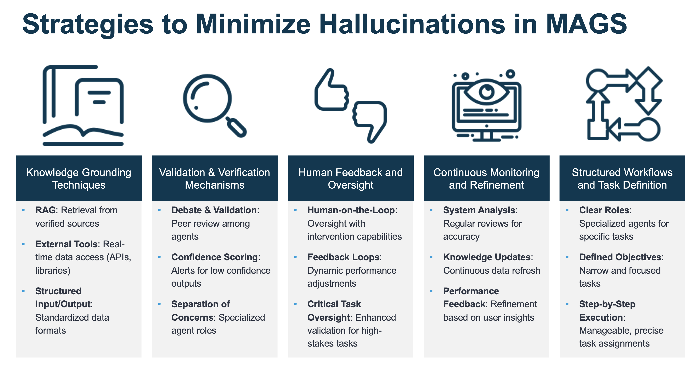

# Reducing Hallucinations in Multi-Agent Generative Systems with XMPro

Multi-Agent Generative Systems (MAGS) utilize Large Language Models (LLMs) to perform complex tasks through observation, reflection, planning, and action. However, minimizing hallucinations—where models produce incorrect or fabricated information—remains a critical challenge. XMPro employs a comprehensive approach to address this issue, using knowledge grounding, validation mechanisms, human oversight, continuous monitoring, and structured workflows. This article details the step-by-step strategies XMPro uses to ensure the reliability and accuracy of MAGS.

# What are Hallucinations
LLM (Large Language Model) hallucinations refer to instances where an AI language model generates information that is incorrect, fabricated, or nonsensical, despite appearing coherent and plausible. This phenomenon occurs because LLMs don't have true understanding or knowledge, but rather produce text based on patterns learned from their training data.

Key aspects of LLM hallucinations include:

1. False information: The model may confidently state incorrect facts or details.

2. Non-existent entities: It might invent people, places, or events that don't exist.

3. Inconsistencies: The model may contradict itself within the same response.

4. Misinterpretation: It could misunderstand the context or question, leading to irrelevant answers.

5. Blending of information: The model might combine unrelated pieces of information in ways that don't make sense.

Hallucinations are a significant challenge in AI development, as they can mislead users who rely on the model for accurate information. 

# Strategies to Reduce Hallucinations in Multi-Agent Generative Systems with XMPro

## 1. Knowledge Grounding Techniques

Grounding LLM outputs in factual information is essential to reduce hallucinations. XMPro uses various techniques to ensure that the outputs of MAGS agents are accurate and based on current data rather than outdated or incorrect information.

- **Retrieval Augmented Generation (RAG)**: XMPro implements RAG by creating domain-specific knowledge bases that agents query before generating responses. This method helps anchor outputs in verified data, making them more reliable.

- **Access to External Tools and Knowledge Sources**: XMPro MAGS agents have access to external databases, APIs, and real-time data sources. Additionally, they utilize domain-specific Python libraries like SimPy for simulation, Reliability for engineering analysis, and others that provide specialized skills at a PhD level for specific domains. This capability allows agents to perform advanced tasks, cross-check facts, and access the latest information, significantly reducing reliance on potentially outdated internal data.

- **Structured Input and Output**: XMPro agents work with standardized input formats, ensuring clear and consistent data flows. This structured approach reduces ambiguity in outputs, leading to more accurate and verifiable responses.

## 2. Validation and Verification Mechanisms

XMPro employs rigorous validation and verification processes to ensure MAGS outputs meet high standards of accuracy before being presented to users. These processes involve multiple layers of cross-checks and scoring systems.

- **Multi-Agent Debate and Validation**: XMPro’s MAGS framework assigns specific roles to agents, such as fact-checkers and critics, to scrutinize each other’s outputs. This intra-system peer review fosters a culture of verification, where agents challenge and refine outputs collaboratively.

- **Confidence Scoring and Automated Alert Systems**: XMPro uses confidence scoring to assess the reliability of agent-generated content. Responses falling below a set confidence threshold trigger alerts, prompting further review and validation, which helps in maintaining high accuracy levels.

- **Separation of Concerns**: XMPro defines distinct roles for each agent, ensuring tasks are handled by agents with specific expertise. This targeted approach minimizes the risk of errors and hallucinations by leveraging agents’ specialized knowledge.

## 3. Human Feedback and Oversight

Incorporating human oversight ensures that XMPro’s MAGS maintain high standards of accuracy, particularly in complex or sensitive tasks. Human feedback serves as a crucial checkpoint in the system’s operations.

- **Human-on-the-Loop Systems**: XMPro integrates human-on-the-loop systems, allowing experts to monitor and intervene when necessary. This approach keeps humans engaged in the oversight process, providing guidance without requiring them to manage every detail of the system’s decisions.

- **Continuous Feedback Loops**: XMPro uses feedback loops to continuously refine agent performance. Feedback from users and experts is analyzed and applied to adjust system behavior, helping to reduce hallucinations and improve overall accuracy.

- **Oversight in Critical Tasks**: XMPro places additional emphasis on human oversight in high-stakes applications. By incorporating human validation in critical scenarios, XMPro adds a robust layer of review that helps catch and correct hallucinations before they impact decisions.

## 4. Continuous Monitoring and Refinement

XMPro’s approach to MAGS does not stop at deployment; it includes continuous monitoring and improvement to ensure the system remains effective and accurate over time.

- **Ongoing System Analysis**: XMPro regularly reviews outputs from MAGS to identify inaccuracies and areas for improvement. This ongoing analysis helps maintain the system’s alignment with current data and accuracy standards.

- **Knowledge Base Updates**: The knowledge base underpinning XMPro MAGS is continuously updated with the latest information. This proactive approach reduces the risk of generating outputs based on outdated data, maintaining the accuracy of agent responses.

- **Performance Feedback Integration**: XMPro collects feedback from system users and integrates it into the performance evaluation process. This iterative refinement helps tailor agent behavior, minimizing hallucinations and enhancing output quality.

## 5. Structured Workflows and Task Definition

XMPro’s MAGS operate within clearly defined workflows, with structured task assignments that manage complexity and maintain focus. This structured approach ensures that agents operate within clear boundaries, reducing the potential for errors.

- **Clear Role Assignments and Specialized Agents**: XMPro assigns precise roles to agents, such as data analysis, verification, and fact-checking. This clear role definition ensures that each agent’s expertise is leveraged effectively, minimizing the risk of inaccuracies.

- **Narrow and Specific Objectives**: XMPro focuses on setting clear and specific objectives for each task, reducing complexity and improving the ease of validation. This approach limits opportunities for agents to generate incorrect responses.

- **Step-by-Step Task Execution**: XMPro decomposes complex workflows into manageable steps, assigning each step to the most suitable agent. This systematic approach ensures that tasks are executed accurately and that each output is carefully validated.

# Conclusion

XMPro’s comprehensive approach to reducing hallucinations in Multi-Agent Generative Systems involves grounding outputs in accurate information, rigorous validation, and active human oversight. Continuous monitoring and structured workflows ensure that MAGS deliver reliable, high-quality outputs, making XMPro a trusted choice for advanced AI-driven applications. By integrating advanced validation techniques, access to domain-specific tools, and consistent refinement, XMPro MAGS stand as robust solutions that address the challenges of hallucinations in generative AI systems.