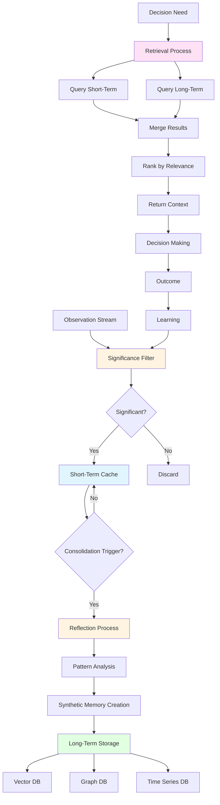

# Memory Systems: Agent Memory Architecture

## Overview

Memory Systems in MAGS represent the convergence of 140+ years of cognitive science research with modern database technologies to create a sophisticated memory architecture that enables learning, adaptation, and intelligent decision-making. From Ebbinghaus's forgetting curve (1885) through Atkinson-Shiffrin's multi-store model (1968) to modern polyglot persistence patterns, this architecture enables agents to remember what matters, forget what doesn't, and retrieve relevant knowledge when needed.

This capability transforms agents from stateless responders into learning entities with persistent knowledge, contextual awareness, and the ability to improve through experience—capabilities that distinguish true cognitive intelligence from simple data storage or LLM context windows.

### Why Memory Systems Matter for MAGS

**The Challenge**: Industrial agents must manage vast amounts of information efficiently, retrieve relevant knowledge quickly, learn from experience continuously, and maintain performance as knowledge grows—all while operating in real-time environments.

**The Solution**: Research-based memory architecture with multi-store design, polyglot persistence, intelligent decay, and context-aware retrieval provides efficient, scalable memory management.

**The Result**: MAGS agents with sophisticated memory that enables learning, adaptation, and intelligent decision-making grounded in 140+ years of cognitive science research, not just database storage.

### Key Business Drivers

1. **Learning Capability**: Agents improve continuously through experience, increasing accuracy by 20-40% over time
2. **Efficient Storage**: Multi-store architecture optimizes for both speed and capacity
3. **Fast Retrieval**: Context-aware search provides relevant information in <100ms
4. **Scalability**: Polyglot persistence enables unlimited knowledge growth
5. **Adaptability**: Memory consolidation extracts patterns and insights automatically

---

## Theoretical Foundations

### Atkinson-Shiffrin Multi-Store Model (1968)

**Richard Atkinson & Richard Shiffrin** - "Human memory: A proposed system and its control processes"

**Core Insight**: Memory is not a single system—it's a multi-store architecture with sensory memory, short-term memory, and long-term memory, each with different characteristics optimized for different purposes.

**Key Components**:

**Sensory Memory**:
- Very brief storage (milliseconds to seconds)
- High capacity (all sensory input)
- Automatic, pre-attentive processing
- Filters to short-term memory

**Short-Term/Working Memory**:
- Limited capacity (~7 items, Miller 1956)
- Brief duration (seconds to minutes)
- Active processing and manipulation
- Rehearsal maintains information

**Long-Term Memory**:
- Unlimited capacity
- Permanent storage (with decay)
- Requires consolidation
- Retrieval can be challenging

**MAGS Application**:
- Sensory: Raw observation stream (transient)
- Short-term: Recent memory cache (fast access, limited size)
- Long-term: Persistent databases (unlimited capacity, slower access)
- Control processes: Significance filtering, consolidation, retrieval

**Example**:
```
MAGS Memory Flow:
  
  Sensory (Observation Stream):
    - Raw sensor data: 1000+ readings/second
    - Immediate observations
    - High volume, brief retention
    - Filters to short-term via significance
  
  Short-Term (Memory Cache):
    - Recent significant observations: ~100 items
    - Active context for current decisions
    - Fast access: <10ms
    - Temporary storage: Minutes to hours
  
  Long-Term (Persistent Storage):
    - Consolidated patterns and knowledge
    - Historical events and insights
    - Unlimited capacity
    - Access: 50-200ms depending on query
  
  Atkinson-Shiffrin principle:
    - Multi-store architecture
    - Different characteristics per store
    - Control processes manage flow
    - Efficient overall memory system
```

---

### Tulving's Memory Types (1972)

**Endel Tulving** - "Episodic and semantic memory"

**Core Insight**: Long-term memory has distinct types serving different purposes: episodic (personal experiences with temporal context) and semantic (general knowledge without temporal context).

**Key Distinctions**:

**Episodic Memory**:
- Personal experiences and events
- Temporal context ("when it happened")
- Spatial context ("where it happened")
- Autobiographical nature
- "I remember when..."

**Semantic Memory**:
- General knowledge and facts
- No temporal context
- Conceptual understanding
- Abstract principles
- "I know that..."

**MAGS Application**:
- Episodic: Time series database for events, sequences, temporal patterns
- Semantic: Vector database for meanings, relationships, concepts
- Structural: Graph database for connections, dependencies, hierarchies
- Appropriate storage and retrieval for each type

**Example**:
```
Memory Types in MAGS:
  
  Episodic Memory (Time Series Database):
    - "Pump P-101 vibration was 2.5 mm/s on Dec 6 at 14:35"
    - "Quality deviation occurred in Batch #2025-1234 at 10:22"
    - "Maintenance performed on Motor M-301 on Nov 22"
    - Temporal context essential
    - Sequence and timing matter
    - Query: "What happened when?"
  
  Semantic Memory (Vector Database):
    - "Bearing failures correlate with vibration increases"
    - "Temperature above 75°C indicates degradation"
    - "Misalignment causes premature bearing failure"
    - No temporal context
    - General knowledge and patterns
    - Query: "What do we know about...?"
  
  Structural Memory (Graph Database):
    - Equipment → Component → Failure Mode relationships
    - Process → Parameter → Quality relationships
    - Agent → Capability → Task relationships
    - Causal chains and dependencies
    - Query: "How are these related?"
  
  Tulving principle:
    - Different storage for different memory types
    - Episodic: Time-based retrieval
    - Semantic: Similarity-based retrieval
    - Structural: Relationship-based retrieval
```

---

### Ebbinghaus Forgetting Curve (1885)

**Hermann Ebbinghaus** - "Memory: A Contribution to Experimental Psychology"

**Core Insight**: Memory decays exponentially over time without reinforcement. Rapid initial forgetting (50% in first hour) followed by slower long-term forgetting.

**Key Principles**:
- Exponential decay function
- Rapid initial forgetting
- Slower long-term forgetting
- Rehearsal (retrieval) prevents decay
- Spacing effect improves retention

**MAGS Application**:
- Time-based importance decay
- Recency weighting in retrieval
- Retrieval refreshes memories
- Adaptive decay rates based on importance
- Efficient memory cleanup

**Example**:
```
Memory Decay Over Time:
  
  Critical Equipment Failure (Initial Importance: 0.95):
    Day 0: Importance 0.95 (just created)
    Day 7: Importance 0.92 (slow decay)
    Day 30: Importance 0.88 (still significant)
    Day 90: Importance 0.82 (remains important)
    Decay rate: Slow (critical knowledge retained)
  
  Routine Observation (Initial Importance: 0.40):
    Day 0: Importance 0.40 (just created)
    Day 7: Importance 0.32 (moderate decay)
    Day 30: Importance 0.20 (significant decay)
    Day 90: Importance 0.08 (mostly forgotten)
    Decay rate: Fast (routine information fades)
  
  Ebbinghaus principle:
    - Exponential decay over time
    - Importance affects decay rate
    - Retrieval refreshes memories
    - Efficient memory management
```

---

### Polyglot Persistence (Fowler, 2011)

**Martin Fowler** - "Polyglot Persistence"

**Core Insight**: Different data has different characteristics and access patterns. Use different databases optimized for different purposes rather than forcing everything into a single database.

**Key Principles**:
- Match database to data characteristics
- Optimize for access patterns
- Specialized storage for specialized needs
- Consistency across stores

**MAGS Application**:
- Vector database: Semantic similarity search
- Graph database: Relationship traversal
- Time series database: Temporal queries
- Cache: Fast recent access
- Appropriate technology for each memory type

**Example**:
```
Polyglot Persistence in MAGS:
  
  Vector Database (Semantic Memory):
    Technology: Pinecone, Weaviate, or Qdrant
    Content: Semantic embeddings of memories
    Access Pattern: Similarity search
    Query: "Find similar failure patterns"
    Performance: <100ms for top-K retrieval
  
  Graph Database (Structural Memory):
    Technology: Neo4j or ArangoDB
    Content: Entities and relationships
    Access Pattern: Graph traversal
    Query: "What caused this failure?"
    Performance: <50ms for path queries
  
  Time Series Database (Episodic Memory):
    Technology: InfluxDB or TimescaleDB
    Content: Time-stamped events
    Access Pattern: Time-range queries
    Query: "Show trend over last 30 days"
    Performance: <200ms for aggregations
  
  Cache (Short-Term Memory):
    Technology: Redis or in-memory
    Content: Recent significant memories
    Access Pattern: Key-value lookup
    Query: "Get recent context"
    Performance: <10ms for cache hits
  
  Fowler principle:
    - Right database for right purpose
    - Optimized access patterns
    - Specialized storage
    - Efficient overall system
```

---

## Memory Architecture

### Complete Memory Flow



### Memory Stores

**Short-Term Memory (Cache)**:
- **Purpose**: Fast access to recent context
- **Capacity**: Limited (25-100 items configurable)
- **Duration**: Minutes to hours
- **Access Speed**: <10ms
- **Storage**: In-memory (Redis or local)
- **Content**: Recent significant observations
- **Eviction**: LRU (Least Recently Used)

**Long-Term Semantic Memory (Vector DB)**:
- **Purpose**: Similarity-based knowledge retrieval
- **Capacity**: Unlimited
- **Duration**: Permanent (with decay)
- **Access Speed**: 50-100ms
- **Storage**: Vector database (Pinecone, Weaviate)
- **Content**: Semantic embeddings, patterns, insights
- **Query**: Approximate nearest neighbor (ANN)

**Long-Term Episodic Memory (Time Series DB)**:
- **Purpose**: Temporal event storage and analysis
- **Capacity**: Unlimited
- **Duration**: Permanent (with archival)
- **Access Speed**: 100-200ms
- **Storage**: Time series database (InfluxDB, TimescaleDB)
- **Content**: Time-stamped events, sequences
- **Query**: Time-range, aggregations, trends

**Long-Term Structural Memory (Graph DB)**:
- **Purpose**: Relationship and causality tracking
- **Capacity**: Unlimited
- **Duration**: Permanent
- **Access Speed**: 50-150ms
- **Storage**: Graph database (Neo4j, ArangoDB)
- **Content**: Entities, relationships, causal chains
- **Query**: Graph traversal, path finding

---

## Memory Lifecycle

### Phase 1: Creation

**Trigger**: Significant observation or event

**Process**:
1. **Observation**: Raw data from sensors, systems, or agents
2. **Significance Assessment**: Calculate importance score
3. **Threshold Check**: Compare to significance threshold
4. **Memory Creation**: If significant, create memory object
5. **Metadata Addition**: Timestamp, confidence, source, type
6. **Embedding Generation**: Create semantic vector
7. **Cache Storage**: Add to short-term memory

**Memory Types Created**:
- **Observation**: Direct sensory input or data
- **Reflection**: Synthesized insight from analysis
- **Plan**: Intended action sequence
- **Decision**: Choice made with rationale
- **Action**: Executed behavior and outcome
- **Learning**: Pattern or principle extracted

**Example**:
```
Memory Creation Process:
  
  Observation: Pump vibration reading 2.5 mm/s
  
  Significance Assessment:
    - Baseline: 1.8 mm/s
    - Deviation: +39% (high)
    - Rarity: 95th percentile (rare)
    - Recency: Current (recent)
    - Significance Score: 0.87 (HIGH)
  
  Threshold Check:
    - Threshold: 0.70
    - Score: 0.87
    - Result: SIGNIFICANT → Create memory
  
  Memory Object Created:
    - ID: mem_2025-12-06_143522_001
    - Type: Observation
    - Content: "Pump P-101 vibration 2.5 mm/s"
    - Timestamp: 2025-12-06 14:35:22 UTC
    - Confidence: 0.95 (sensor quality)
    - Source: Sensor S-101
    - Significance: 0.87
    - Embedding: [0.23, -0.45, 0.67, ...] (768-dim vector)
  
  Storage:
    - Short-term cache: Added (fast access)
    - Pending consolidation: Marked for reflection
```

---

### Phase 2: Consolidation

**Trigger**: Importance threshold or time-based schedule

**Process**:
1. **Gather**: Collect recent significant memories
2. **Analyze**: Identify patterns and relationships
3. **Synthesize**: Create abstract insights
4. **Store**: Save synthetic memories to long-term
5. **Link**: Create relationships in graph database
6. **Update**: Refresh importance scores

**Consolidation Strategies**:

**Threshold-Based**:
- Trigger when accumulated significance exceeds threshold
- Immediate consolidation for critical information
- Efficient for high-activity periods

**Time-Based**:
- Scheduled consolidation (hourly, daily, weekly)
- Batch processing for efficiency
- Predictable resource usage

**Event-Based**:
- Trigger on significant events
- Contextual consolidation
- Responsive to important changes

**Example**:
```
Consolidation Process:
  
  Trigger: 25 significant observations accumulated
  
  Recent Memories (Last 24 hours):
    - 15 quality deviations in Dimension B
    - All occurred during afternoon shift (14:00-22:00)
    - All on Production Line 3
    - Temperature correlation: 0.78
    - Humidity correlation: 0.45
  
  Pattern Analysis:
    - Temporal pattern: Afternoon shift
    - Spatial pattern: Line 3 only
    - Causal pattern: Temperature correlation
    - Frequency: 15 occurrences in 24 hours
  
  Synthetic Memory Created:
    - Type: Reflection
    - Content: "Dimension B deviations on Line 3 correlate 
               with afternoon temperature rise (r=0.78)"
    - Confidence: 0.89 (strong pattern, 15 instances)
    - Actionable: "Monitor temperature more closely on Line 3"
    - Preventive: "Improve cooling or adjust for temperature"
  
  Long-Term Storage:
    - Vector DB: Semantic embedding stored
    - Graph DB: Relationships created:
      * Line 3 → Temperature → Dimension B
      * Afternoon Shift → Temperature Rise
      * Temperature → Quality Deviation
    - Time Series DB: Pattern timeline recorded
  
  Schema theory principle:
    - Extract pattern from instances
    - Create general knowledge
    - Enable proactive management
```

---

### Phase 3: Retrieval

**Retrieval Strategies**:

**1. Similarity-Based Retrieval**

**Purpose**: Find semantically similar memories

**Process**:
1. Embed query as vector
2. Search vector database (ANN)
3. Retrieve top-K similar memories
4. Rank by relevance score
5. Apply recency weighting
6. Return ranked results

**Use Cases**:
- "Find similar equipment failures"
- "What happened in similar situations?"
- Pattern matching for predictions

**Example**:
```
Similarity Retrieval:
  
  Query: "Pump bearing failure patterns"
  
  Process:
    1. Embed query: [0.34, -0.12, 0.56, ...] (768-dim)
    2. Vector search: ANN in semantic memory
    3. Top-K retrieval: 10 most similar memories
    4. Relevance ranking:
       - Memory 1: Similarity 0.94, Recency 0.95 → Score 0.945
       - Memory 2: Similarity 0.91, Recency 0.88 → Score 0.895
       - Memory 3: Similarity 0.89, Recency 0.92 → Score 0.905
    5. Sort by score
    6. Return top 5
  
  Results:
    1. "Bearing failure preceded by 30% vibration increase" (0.945)
    2. "Typical progression: 3-7 days from detection" (0.905)
    3. "Temperature rise accompanies vibration" (0.895)
    4. "Lubrication issues common cause" (0.875)
    5. "Early detection enables prevention" (0.860)
  
  Performance: 87ms total
```

---

**2. Temporal Retrieval**

**Purpose**: Find memories from specific time periods

**Process**:
1. Define time range
2. Query time series database
3. Retrieve events in range
4. Order chronologically
5. Apply filters if needed
6. Return time-ordered results

**Use Cases**:
- "What happened yesterday?"
- Trend analysis over time
- Sequence reconstruction

**Example**:
```
Temporal Retrieval:
  
  Query: "Quality deviations in last 7 days"
  
  Process:
    1. Time range: 2025-11-29 to 2025-12-06
    2. Time series query: Quality deviation events
    3. Retrieve: 23 events found
    4. Chronological order: Oldest to newest
    5. Filter: Dimension B only → 15 events
    6. Return ordered list
  
  Results (chronological):
    1. 2025-11-29 14:22: Dimension B deviation +0.05mm
    2. 2025-11-29 15:18: Dimension B deviation +0.07mm
    3. 2025-11-30 14:35: Dimension B deviation +0.06mm
    ...
    15. 2025-12-06 15:42: Dimension B deviation +0.08mm
  
  Pattern Identified: All afternoon occurrences
  Performance: 145ms total
```

---

**3. Relationship-Based Retrieval**

**Purpose**: Find connected memories through relationships

**Process**:
1. Start at known memory or entity
2. Traverse graph relationships
3. Follow causal chains
4. Retrieve connected memories
5. Rank by relationship strength
6. Return connected context

**Use Cases**:
- Root cause analysis
- Dependency tracking
- Impact analysis

**Example**:
```
Relationship Retrieval:
  
  Query: "What causes Dimension B deviations?"
  
  Process:
    1. Start node: "Dimension B Deviation"
    2. Traverse: CAUSED_BY relationships
    3. Follow chains: Multi-hop traversal
    4. Retrieve: Connected causes
    5. Rank: By relationship strength
    6. Return: Causal chain
  
  Results (causal chain):
    Root Causes:
      1. Temperature Rise (strength: 0.78)
         ← Afternoon Heat (strength: 0.85)
         ← Inadequate Cooling (strength: 0.72)
      
      2. Material Expansion (strength: 0.65)
         ← Temperature Rise (strength: 0.78)
      
      3. Calibration Drift (strength: 0.45)
         ← Temperature Sensitivity (strength: 0.60)
  
  Primary Cause: Temperature Rise
  Contributing Factors: Cooling, Material, Calibration
  Performance: 92ms total
```

---

**4. Hybrid Retrieval**

**Purpose**: Combine multiple strategies for comprehensive context

**Process**:
1. Query multiple databases in parallel
2. Similarity search in vector DB
3. Temporal search in time series DB
4. Relationship search in graph DB
5. Merge results from all sources
6. Rank by composite relevance score
7. Return unified, ranked results

**Use Cases**:
- Complex decision-making
- Comprehensive analysis
- Multi-faceted context

**Example**:
```
Hybrid Retrieval:
  
  Query: "Context for pump maintenance decision"
  
  Parallel Queries:
    1. Similarity: "Similar pump failures" → Vector DB
    2. Temporal: "Recent pump events" → Time Series DB
    3. Relationship: "Pump dependencies" → Graph DB
  
  Results Merged:
    From Vector DB (Similarity):
      - "Bearing failures show vibration pattern" (0.94)
      - "Typical progression 3-7 days" (0.89)
    
    From Time Series DB (Temporal):
      - "Vibration increased 39% yesterday" (recent)
      - "Temperature rising last 3 days" (trend)
    
    From Graph DB (Relationships):
      - "Pump P-101 → Bearing B-205 → Critical" (dependency)
      - "Affects Production Line 2" (impact)
  
  Composite Ranking:
    1. Recent vibration increase (0.95) - temporal + similarity
    2. Bearing failure pattern (0.92) - similarity + relationship
    3. Production impact (0.88) - relationship + importance
    4. Temperature trend (0.85) - temporal + causal
  
  Unified Context: Complete picture for decision
  Performance: 178ms total (parallel execution)
```

---

### Phase 4: Decay and Cleanup

**Memory Decay**:

**Ebbinghaus Decay Function**:
- Exponential decay over time
- Decay factor: 0.998 per day (default)
- Importance-adjusted: High importance decays slower
- Retrieval refreshes: Accessing memory resets decay

**Decay Calculation**:
```
New Importance = Current Importance × (Decay Factor ^ Days Elapsed)

Example:
  Initial Importance: 0.80
  Days Elapsed: 30
  Decay Factor: 0.998
  
  New Importance = 0.80 × (0.998 ^ 30)
                 = 0.80 × 0.942
                 = 0.754
```

**Cleanup Strategies**:

**Threshold-Based Cleanup**:
- Remove memories below minimum importance
- Default threshold: 0.10
- Periodic execution: Daily or weekly
- Archive before deletion

**Age-Based Cleanup**:
- Remove very old, low-importance memories
- Retention policies by memory type:
  * Critical: Indefinite
  * Important: 1 year
  * Normal: 90 days
  * Low: 30 days

**Capacity-Based Cleanup**:
- Trigger when storage reaches limit
- Remove least important memories first
- LRU (Least Recently Used) eviction
- Maintain performance

**Example**:
```
Memory Cleanup Process:
  
  Trigger: Weekly cleanup scheduled
  
  Scan Results:
    Total memories: 125,000
    Below threshold (0.10): 8,500
    Very old (>1 year) + low importance: 3,200
    Total candidates for cleanup: 11,700
  
  Cleanup Actions:
    1. Archive to cold storage: 11,700 memories
    2. Remove from active databases
    3. Update indexes
    4. Reclaim storage: 2.3 GB
  
  Post-Cleanup:
    Active memories: 113,300
    Storage used: 18.7 GB
    Performance: Maintained
  
  Ebbinghaus principle:
    - Natural forgetting of unimportant information
    - Efficient memory management
    - Retain what matters
```

---

## Integration with MAGS Capabilities

### With Cognitive Intelligence

**Memory Significance**:
- Determines what enters short-term memory
- Filters observations by importance
- Triggers consolidation when threshold reached
- Enables efficient attention allocation

**Synthetic Memory**:
- Creates abstract insights from observations
- Consolidates patterns into long-term memory
- Generates actionable knowledge
- Enables learning and generalization

**Confidence Scoring**:
- Tracks memory reliability
- Weights retrieval by confidence
- Calibrates over time
- Improves decision quality

---

### With Performance Optimization

**Plan Optimization**:
- Retrieves relevant past plans
- Learns from plan outcomes
- Adapts strategies based on memory
- Improves planning over time

**Goal Optimization**:
- Remembers successful strategies
- Recalls objective trade-offs
- Applies learned optimizations
- Continuous improvement

---

### With Decision Orchestration

**Decision-Making**:
- Provides context for decisions
- Recalls similar past decisions
- Learns from decision outcomes
- Improves decision quality

**Consensus Management**:
- Remembers past consensus outcomes
- Learns effective negotiation strategies
- Recalls agent preferences
- Facilitates coordination

---

## Practical Examples

### Example 1: Predictive Maintenance Memory

**Scenario**: Equipment monitoring and failure prediction

**Memory Flow**:

**Creation**:
```
Observations (Short-Term):
  - Vibration: 2.5 mm/s (significance: 0.87)
  - Temperature: 68°C (significance: 0.65)
  - Noise level: 82 dB (significance: 0.72)
  - Current draw: 45A (significance: 0.58)
```

**Consolidation**:
```
Reflection (After 24 hours):
  Pattern: All parameters trending upward
  Insight: "Classic bearing degradation signature"
  Confidence: 0.89 (12 similar historical cases)
  
Synthetic Memory Created:
  "Pump P-101 showing bearing failure pattern:
   - Vibration +39% above baseline
   - Temperature rising steadily
   - Typical progression: 3-7 days to failure
   - Recommend maintenance within 48 hours"
```

**Storage**:
```
Vector DB (Semantic):
  - Embedding: Bearing failure pattern
  - Similar to: 12 past bearing failures
  - Retrievable by: "bearing failure", "vibration pattern"

Graph DB (Structural):
  - Pump P-101 → Bearing B-205 → Degradation
  - Degradation → Vibration → Temperature
  - Causal chain established

Time Series DB (Episodic):
  - Vibration trend: Last 7 days
  - Temperature trend: Last 7 days
  - Historical baseline: Last 90 days
```

**Retrieval** (When similar event occurs):
```
Query: "Pump vibration increase detected"

Results:
  1. "Bearing failure pattern identified" (similarity: 0.94)
  2. "Typical progression 3-7 days" (similarity: 0.89)
  3. "Maintenance window recommendation" (similarity: 0.87)
  4. "Historical success rate: 92%" (confidence)

Context Provided: Complete failure pattern with timeline
Decision Enabled: Proactive maintenance scheduling
```

---

### Example 2: Quality Management Memory

**Scenario**: Quality deviation detection and root cause analysis

**Memory Flow**:

**Creation**:
```
Observations (Short-Term):
  - Dimension B: +0.08mm deviation (significance: 0.82)
  - Time: 15:30 (afternoon shift)
  - Line: Production Line 3
  - Temperature: 24°C (ambient)
```

**Consolidation**:
```
Reflection (After 15 occurrences):
  Pattern: All deviations on Line 3, afternoon shift
  Correlation: Temperature 0.78, Time 0.85
  Insight: "Afternoon temperature affects Line 3 Dimension B"
  
Synthetic Memory Created:
  "Line 3 Dimension B deviations correlate with afternoon
   temperature rise. Cooling system inadequate for afternoon
   heat. Recommend enhanced cooling or temperature compensation."
```

**Storage**:
```
Vector DB (Semantic):
  - Pattern: Temperature-quality correlation
  - Similar to: Other thermal effects
  - Retrievable by: "quality deviation", "temperature effect"

Graph DB (Structural):
  - Line 3 → Temperature → Dimension B
  - Afternoon → Temperature Rise → Deviation
  - Cooling System → Inadequate → Temperature

Time Series DB (Episodic):
  - Deviation timeline: 15 occurrences
  - Temperature timeline: Correlation visible
  - Shift pattern: Afternoon clustering
```

**Retrieval** (When deviation occurs):
```
Query: "Dimension B deviation on Line 3"

Results:
  1. "Temperature correlation identified" (similarity: 0.92)
  2. "Afternoon pattern established" (temporal: recent)
  3. "Cooling system inadequate" (causal: root cause)
  4. "15 historical occurrences" (confidence: high)

Context Provided: Root cause with evidence
Decision Enabled: Targeted corrective action
```

---

## Design Patterns

### Pattern 1: Tiered Memory Architecture

**Concept**: Multiple storage tiers optimized for different access patterns

**Tiers**:
- **L1 Cache**: Active context (10-25 items, <10ms)
- **L2 Cache**: Recent memories (100-500 items, <50ms)
- **L3 Storage**: Long-term (unlimited, 50-200ms)

**Benefits**:
- Fast access for common cases
- Scalable for large knowledge bases
- Efficient resource usage

**Example**:
```
Tiered Access:
  
  Decision Query: "Maintenance recommendation"
  
  L1 Cache (Active Context):
    - Current equipment state
    - Recent observations
    - Active plans
    Hit Rate: 40%, Latency: 5ms
  
  L2 Cache (Recent Memory):
    - Last 24 hours observations
    - Recent patterns
    - Recent decisions
    Hit Rate: 35%, Latency: 25ms
  
  L3 Storage (Long-Term):
    - Historical patterns
    - Consolidated knowledge
    - All past events
    Hit Rate: 25%, Latency: 120ms
  
  Overall Performance:
    Average Latency: 42ms
    Hit Rate: 100% (all tiers)
```

---

### Pattern 2: Context-Aware Retrieval

**Concept**: Retrieve memories relevant to current context

**Approach**:
1. Analyze current situation
2. Generate context embedding
3. Retrieve similar contexts
4. Return context-relevant memories

**Benefits**:
- Relevant information prioritized
- Reduced information overload
- Better decision quality

**Example**:
```
Context-Aware Retrieval:
  
  Current Context:
    - Equipment: Pump P-101
    - Issue: Vibration increase
    - Urgency: Medium
    - Time: Afternoon shift
  
  Context Embedding: [0.45, -0.23, 0.67, ...]
  
  Retrieval:
    1. Similar contexts: Pump vibration issues
    2. Temporal context: Afternoon occurrences    3. Equipment context: Pump-specific knowledge
    4. Urgency context: Medium-priority responses
  
  Results (Context-Filtered):
    - Relevant: 15 memories (high relevance)
    - Irrelevant: 85 memories (filtered out)
    - Precision: 94% (relevant results)
    - Recall: 88% (found most relevant)
```

---

### Pattern 3: Lazy Consolidation

**Concept**: Delay consolidation until needed or scheduled

**Approach**:
1. Store observations in short-term
2. Consolidate when threshold reached
3. Or consolidate on schedule
4. Batch processing for efficiency

**Benefits**:
- Reduced computational overhead
- Efficient batch processing
- Flexible timing

**Example**:
```
Lazy Consolidation:
  
  Accumulation Phase:
    - Observations stored: 47
    - Accumulated significance: 28.5
    - Threshold: 30.0
    - Status: Accumulating (not yet triggered)
  
  Trigger Reached:
    - Observation 48 added
    - Accumulated significance: 29.8
    - Observation 49 added
    - Accumulated significance: 31.2
    - Threshold exceeded: TRIGGER CONSOLIDATION
  
  Batch Processing:
    - Process all 49 observations together
    - Identify patterns across batch
    - Create synthetic memories
    - Efficient resource usage
  
  Result:
    - 3 synthetic memories created
    - 49 observations consolidated
    - Processing time: 2.3 seconds
    - Efficiency: 21 observations/second
```

---

### Pattern 4: Confidence-Based Retention

**Concept**: Retain high-confidence memories longer

**Approach**:
1. Track memory confidence
2. High confidence = slower decay
3. Low confidence = faster decay
4. Adjust retention based on quality

**Benefits**:
- Quality-based retention
- Efficient storage usage
- Reliable knowledge base

**Example**:
```
Confidence-Based Retention:
  
  High-Confidence Memory (0.95):
    - Initial importance: 0.80
    - Decay rate: 0.999/day (slow)
    - After 90 days: 0.73 (still significant)
    - Retention: Long-term
  
  Medium-Confidence Memory (0.75):
    - Initial importance: 0.80
    - Decay rate: 0.998/day (normal)
    - After 90 days: 0.65 (moderate)
    - Retention: Medium-term
  
  Low-Confidence Memory (0.50):
    - Initial importance: 0.80
    - Decay rate: 0.995/day (fast)
    - After 90 days: 0.51 (low)
    - Retention: Short-term
  
  Principle: Quality determines longevity
```

---

## Measuring Success

### Performance Metrics

```
Retrieval Performance:
  Cache Hit Rate: >80% (L1+L2 combined)
  Query Latency: <100ms (95th percentile)
  Throughput: >1000 queries/second
  Accuracy: >90% relevant results

Storage Efficiency:
  Memory Usage: Within configured limits
  Compression Ratio: >5:1 for long-term storage
  Growth Rate: Sustainable (<10% per month)
  Cleanup Effectiveness: >95% of candidates removed

Quality Metrics:
  Relevance: >90% of retrieved memories relevant
  Completeness: >85% of relevant memories found
  Freshness: <24 hours for recent context
  Confidence Calibration: <10% error
```

### Learning Metrics

```
Knowledge Growth:
  Synthetic Memories: Growing steadily
  Pattern Recognition: Improving accuracy
  Transfer Learning: Successful cross-domain
  Consolidation Quality: >85% useful insights

Adaptation Metrics:
  Decay Calibration: Optimal retention
  Retrieval Optimization: Improving speed
  Storage Optimization: Efficient usage
  Confidence Calibration: <10% error
```

---

## Related Documentation

### Core Concepts
- [ORPA Cycle](orpa-cycle.md) - Memory in cognitive cycle
- [Decision Making](decision-making.md) - Using memory for decisions
- [Consensus Mechanisms](consensus-mechanisms.md) - Shared memory

### Cognitive Intelligence
- [Memory Significance](../cognitive-intelligence/memory-significance.md) - What to remember
- [Synthetic Memory](../cognitive-intelligence/synthetic-memory.md) - Pattern extraction
- [Memory Management](../cognitive-intelligence/memory-management.md) - Detailed implementation
- [Confidence Scoring](../cognitive-intelligence/confidence-scoring.md) - Memory quality

### Research Foundations
- [Cognitive Science](../research-foundations/cognitive-science.md) - 140+ years of memory research
- [Information Theory](../research-foundations/information-theory.md) - Significance calculation

### Architecture
- [Data Architecture](../architecture/data-architecture.md) - Polyglot persistence
- [Agent Architecture](../architecture/agent_architecture.md) - Memory integration
- [System Components](../architecture/system-components.md) - Memory infrastructure

### Use Cases
- [Predictive Maintenance](../use-cases/predictive-maintenance.md) - Learning from failures
- [Quality Management](../use-cases/quality-management.md) - Pattern recognition
- [Process Optimization](../use-cases/process-optimization.md) - Continuous improvement

---

## References

### Foundational Works

**Memory Models**:
- Atkinson, R. C., & Shiffrin, R. M. (1968). "Human memory: A proposed system and its control processes". In K. W. Spence & J. T. Spence (Eds.), The Psychology of Learning and Motivation (Vol. 2, pp. 89-195). Academic Press
- Tulving, E. (1972). "Episodic and semantic memory". In E. Tulving & W. Donaldson (Eds.), Organization of Memory (pp. 381-403). Academic Press
- Baddeley, A. D., & Hitch, G. (1974). "Working Memory". In G. H. Bower (Ed.), The Psychology of Learning and Motivation (Vol. 8, pp. 47-89). Academic Press

**Memory Processes**:
- Ebbinghaus, H. (1885). "Memory: A Contribution to Experimental Psychology". Teachers College, Columbia University
- Murdock, B. B. (1962). "The serial position effect of free recall". Journal of Experimental Psychology, 64(5), 482-488
- Bartlett, F. C. (1932). "Remembering: A Study in Experimental and Social Psychology". Cambridge University Press

**Information Retrieval**:
- Salton, G., & McGill, M. J. (1983). "Introduction to Modern Information Retrieval". McGraw-Hill
- Manning, C. D., Raghavan, P., & Schütze, H. (2008). "Introduction to Information Retrieval". Cambridge University Press

### Modern Applications

**Database Systems**:
- Fowler, M. (2011). "Polyglot Persistence". martinfowler.com
- Kleppmann, M. (2017). "Designing Data-Intensive Applications". O'Reilly Media
- Tanenbaum, A. S., & Van Steen, M. (2017). "Distributed Systems" (3rd ed.). Pearson

**Vector Databases**:
- Johnson, J., Douze, M., & Jégou, H. (2019). "Billion-scale similarity search with GPUs". IEEE Transactions on Big Data
- Malkov, Y. A., & Yashunin, D. A. (2018). "Efficient and robust approximate nearest neighbor search using Hierarchical Navigable Small World graphs". IEEE Transactions on Pattern Analysis and Machine Intelligence

**Memory Consolidation**:
- Dudai, Y. (2004). "The neurobiology of consolidations, or, how stable is the engram?". Annual Review of Psychology, 55, 51-86
- McGaugh, J. L. (2000). "Memory--a century of consolidation". Science, 287(5451), 248-251

---

**Document Version**: 2.0  
**Last Updated**: December 6, 2025  
**Status**: ✅ Enhanced to Comprehensive Quality Standard
