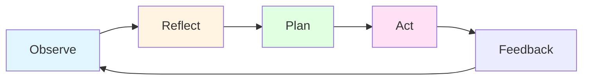
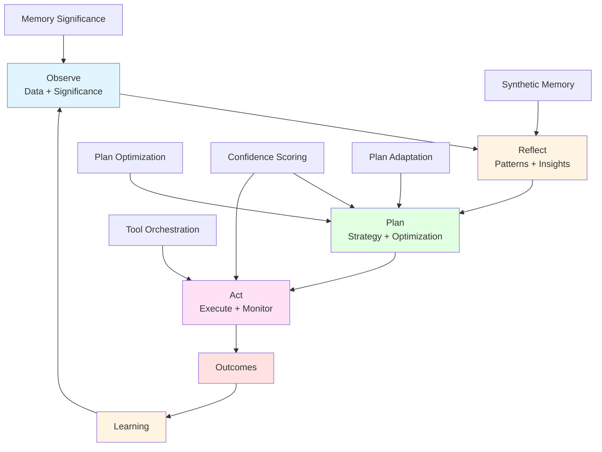

# The ORPA Cycle: Observe, Reflect, Plan, Act

## Overview

The ORPA Cycle (Observe-Reflect-Plan-Act) is the fundamental cognitive cycle that drives agent behavior in XMPro MAGS. Inspired by Stanford's Generative Agents research and grounded in cognitive science, this cycle mimics human decision-making processes to enable sophisticated, context-aware autonomous behavior.

The ORPA Cycle is what transforms MAGS from a reactive system into a proactive, learning intelligence platform.

### The Four Phases



1. **Observe**: Gather information about the current state
2. **Reflect**: Synthesize observations into insights
3. **Plan**: Determine optimal action sequence
4. **Act**: Execute the plan
5. **Feedback**: Learn from outcomes (returns to Observe)

---

## Theoretical Foundation

### Stanford Generative Agents Research

**Source**: Park, J. S., et al. (2023). "Generative Agents: Interactive Simulacra of Human Behavior"

**Core Concepts**:
- Agents store complete record of experiences
- Synthesize memories into higher-level reflections
- Dynamically retrieve memories to plan behavior
- Create believable, adaptive behavior

**MAGS Adaptation**:
- Extended for industrial applications
- Added confidence scoring and quality control
- Integrated with multi-agent coordination
- Enhanced with domain-specific processing

---

### Cognitive Science Principles

**Perception-Action Cycle** (Neisser, 1976):
- Perception guides action
- Action modifies environment
- Modified environment perceived
- Continuous cycle

**Reflective Practice** (Schön, 1983):
- Reflection-in-action (during)
- Reflection-on-action (after)
- Learning from experience
- Continuous improvement

**Deliberative Reasoning** (Kahneman, 2011):
- System 1: Fast, automatic (Observe, Act)
- System 2: Slow, deliberate (Reflect, Plan)
- Both systems integrated
- Context-appropriate selection

---

## Phase 1: Observe

### Purpose
Gather information about the current state of the environment, systems, and processes.

### Activities

**Data Collection**:
- Monitor data streams (sensors, systems, processes)
- Receive messages (from other agents, humans, systems)
- Detect events (alarms, notifications, state changes)
- Collect observations (measurements, status, conditions)

**Significance Assessment**:
- Calculate importance using [Memory Significance](../cognitive-intelligence/memory-significance.md)
- Filter noise and routine information
- Focus on significant events
- Prioritize attention

**Context Gathering**:
- Retrieve relevant historical context
- Identify related entities and relationships
- Understand current operational state
- Assess environmental conditions

### Theoretical Foundation

**Information Theory** (Shannon, 1948):
- Rare events carry more information
- Significance based on surprise
- Context-dependent importance

**Attention Economics** (Simon, 1971):
- Attention as scarce resource
- Selective attention to important information
- Efficient cognitive resource allocation

### Design Patterns

**Pattern 1: Continuous Monitoring**
- Real-time data stream processing
- Event-driven observation creation
- Automatic significance filtering

**Pattern 2: Selective Attention**
- Focus on high-significance events
- Ignore routine, expected behavior
- Context-aware importance assessment

**Pattern 3: Multi-Source Integration**
- Combine data from multiple sources
- Correlate related observations
- Build comprehensive situational awareness

### Example

```
Observation Phase:
- Data Stream: Pump vibration 0.8mm/s (↑ from 0.5mm/s)
- Significance: 0.87 (HIGH - unusual increase)
- Context: Normal operation, no recent maintenance
- Related: Temperature also rising (0.72 significance)
- Historical: Similar pattern preceded failure 3 months ago
→ Create significant observation, proceed to Reflect
```

---

## Phase 2: Reflect

### Purpose
Synthesize observations into insights, patterns, and higher-level understanding.

### Activities

**Pattern Analysis**:
- Identify patterns in recent observations
- Compare to historical patterns
- Detect trends and anomalies
- Extract meaningful relationships

**Insight Generation**:
- Create [Synthetic Memories](../cognitive-intelligence/synthetic-memory.md)
- Form abstractions and generalizations
- Identify causal relationships
- Generate hypotheses

**Knowledge Integration**:
- Connect new insights to existing knowledge
- Update domain understanding
- Refine mental models
- Build expertise

### Theoretical Foundation

**Metacognition** (Flavell, 1979):
- Thinking about thinking
- Self-monitoring and regulation
- Knowledge consolidation

**Memory Consolidation** (Atkinson-Shiffrin, 1968):
- Short-term to long-term transfer
- Pattern extraction
- Knowledge organization

**Schema Theory** (Bartlett, 1932):
- Knowledge organized in frameworks
- New information assimilated
- Schemas enable prediction

### Design Patterns

**Pattern 1: Importance-Triggered Reflection**
- Reflect when cumulative importance exceeds threshold
- Automatic insight generation
- Efficient resource usage

**Pattern 2: Time-Based Reflection**
- Periodic reflection (hourly, daily, weekly)
- Comprehensive analysis
- Scheduled knowledge building

**Pattern 3: Multi-Level Abstraction**
- Create insights at multiple levels
- Specific to general
- Hierarchical knowledge

### Example

```
Reflection Phase:
Input: Recent observations (vibration, temperature, noise)
Analysis: All three increasing together
Pattern: Classic bearing failure signature
Insight: "Bearing degradation in progress"
Causal: Lubrication issue → friction → heat → vibration
Prediction: "Failure likely within 72 hours"
Confidence: 0.89 (based on 12 similar historical cases)
→ Create synthetic memory, proceed to Plan
```

---

## Phase 3: Plan

### Purpose
Determine optimal action sequence to achieve goals based on reflections and objectives.

### Activities

**Goal Definition**:
- Identify objectives (prevent failure, maintain quality, optimize efficiency)
- Prioritize competing goals
- Define success criteria
- Set constraints

**Strategy Generation**:
- Generate potential action sequences
- Use [Plan Optimization](../performance-optimization/plan-optimization.md)
- Consider resource constraints
- Evaluate alternatives

**Optimization**:
- Apply [Objective Functions](objective-functions.md)
- Balance multiple objectives
- Optimize for best outcome
- Assess trade-offs

**Validation**:
- Check feasibility
- Verify resource availability
- Assess risks
- Calculate [Confidence Score](../cognitive-intelligence/confidence-scoring.md)

### Theoretical Foundation

**PDDL Planning** (McDermott et al., 1998):
- Standardized planning language
- State-space search
- Goal-directed reasoning

**HTN Planning** (Erol, Hendler, Nau, 1994):
- Hierarchical task decomposition
- Method selection
- Constraint satisfaction

**Multi-Objective Optimization** (Pareto, 1896):
- Trade-off analysis
- Pareto optimality
- Balanced solutions

### Design Patterns

**Pattern 1: PDDL-Based Planning**
- Define domain, problem, and goals
- Generate action sequences
- Optimize for objectives

**Pattern 2: Hierarchical Planning**
- Decompose complex goals
- Plan at multiple levels
- Coordinate subtasks

**Pattern 3: Contingency Planning**
- Plan for multiple scenarios
- Prepare alternatives
- Enable rapid adaptation

### Example

```
Planning Phase:
Goal: Prevent pump failure
Constraints: Minimize downtime, cost < $5K, within 72 hours
Options:
1. Immediate shutdown and repair (cost: $8K, downtime: 12hrs)
2. Scheduled maintenance in 48hrs (cost: $4K, downtime: 6hrs)
3. Temporary mitigation + weekend repair (cost: $5K, downtime: 4hrs)

Optimization:
- Option 1: Exceeds cost constraint
- Option 2: Acceptable, moderate risk
- Option 3: Optimal (best cost-downtime balance)

Selected Plan: Option 3
Confidence: 0.82 (HIGH)
→ Proceed to Act
```

---

## Phase 4: Act

### Purpose
Execute the plan and monitor outcomes.

### Activities

**Execution**:
- Execute planned actions
- Use [Tool Orchestration](../integration-execution/tool-orchestration.md)
- Monitor progress
- Handle errors

**Monitoring**:
- Track execution status
- Measure performance
- Detect deviations
- Assess outcomes

**Adaptation**:
- Use [Plan Adaptation](../cognitive-intelligence/plan-adaptation.md)
- Adjust if conditions change
- Handle unexpected events
- Maintain effectiveness

**Documentation**:
- Record actions taken
- Log outcomes
- Track confidence vs. actual
- Enable learning

### Theoretical Foundation

**Control Theory**:
- Feedback loops
- Error correction
- Stability maintenance

**Execution Monitoring**:
- Progress tracking
- Deviation detection
- Corrective action

### Design Patterns

**Pattern 1: Monitored Execution**
- Execute with continuous monitoring
- Detect issues early
- Adapt as needed

**Pattern 2: Confidence-Gated Execution**
- High confidence: Autonomous
- Medium confidence: Monitored
- Low confidence: Escalated

**Pattern 3: Rollback-Capable Execution**
- Track execution state
- Enable rollback if needed
- Minimize impact of failures

### Example

```
Action Phase:
Plan: Implement temporary mitigation (vibration damper)
Execution:
- 10:00: Install damper
- 10:30: Monitor vibration (reduced to 0.6mm/s)
- 11:00: Verify temperature (stable at 72°C)
- 12:00: Confirm effectiveness (vibration stable)

Outcome: Successful mitigation
Actual vs. Expected: Better than predicted
Confidence Validation: 0.82 predicted, 0.95 actual (well-calibrated)
Learning: Update confidence calibration, validate approach
→ Return to Observe (continuous cycle)
```

---

## The Complete Cycle

### Integration of All Phases



### Capability Integration

**Observe Phase Uses**:
- Memory Significance (filter important information)
- Content Processing (domain understanding)
- Memory Management (retrieve context)

**Reflect Phase Uses**:
- Synthetic Memory (create insights)
- Memory Management (consolidate knowledge)
- Content Processing (domain interpretation)

**Plan Phase Uses**:
- Plan Optimization (generate strategies)
- Objective Functions (balance goals)
- Confidence Scoring (assess quality)
- Plan Adaptation (adjust for changes)

**Act Phase Uses**:
- Tool Orchestration (execute actions)
- Confidence Scoring (gate execution)
- Plan Adaptation (handle changes)
- Telemetry (monitor outcomes)

---

## Design Patterns

### Pattern 1: Continuous ORPA

**Principle**: Cycle runs continuously, not just on demand.

**Approach**:
- Always observing (data streams)
- Periodic reflection (time or importance-based)
- Dynamic planning (as needed)
- Continuous action (when appropriate)

**Benefits**:
- Proactive behavior
- Early problem detection
- Continuous improvement
- Adaptive response

---

### Pattern 2: Interrupt-Driven ORPA

**Principle**: External events can interrupt and restart cycle.

**Approach**:
- Normal cycle progression
- Critical events interrupt
- Immediate cycle restart
- Resume or replan

**Benefits**:
- Responsive to critical events
- Appropriate urgency
- Flexible prioritization

---

### Pattern 3: Multi-Agent ORPA

**Principle**: Multiple agents run ORPA cycles, coordinating through communication.

**Approach**:
- Each agent runs own ORPA cycle
- Agents share observations and reflections
- Coordinated planning through consensus
- Synchronized or independent action

**Benefits**:
- Distributed intelligence
- Coordinated behavior
- Scalable architecture
- Fault tolerance

---

## Use Cases

### Predictive Maintenance

**ORPA Application**:

**Observe**: Monitor equipment sensors, detect vibration increase
**Reflect**: "Vibration pattern matches bearing failure signature"
**Plan**: "Schedule maintenance in 48 hours during planned downtime"
**Act**: Create work order, notify maintenance team, prepare parts
**Feedback**: Maintenance successful, bearing was degraded, validate prediction

---

### Quality Control

**ORPA Application**:

**Observe**: Detect quality deviation in product measurements
**Reflect**: "Deviation correlates with temperature fluctuation"
**Plan**: "Adjust temperature control, increase monitoring"
**Act**: Modify temperature setpoint, enhance inspection frequency
**Feedback**: Quality restored, temperature control effective, update strategy

---

### Process Optimization

**ORPA Application**:

**Observe**: Notice efficiency below target (88% vs. 92% target)
**Reflect**: "Efficiency drops during high-load periods"
**Plan**: "Optimize load distribution and process parameters"
**Act**: Implement load balancing, adjust parameters
**Feedback**: Efficiency improved to 91%, validate optimization

---

## Best Practices

### Cycle Timing

**Fast Cycles** (seconds/minutes):
- Real-time control
- Safety-critical operations
- Rapid response needed

**Medium Cycles** (minutes/hours):
- Normal operations
- Standard decision-making
- Balanced responsiveness

**Slow Cycles** (hours/days):
- Strategic planning
- Long-term optimization
- Deep analysis

---

### Phase Balance

**Observation-Heavy**:
- Data-rich environments
- Monitoring focus
- Pattern detection

**Reflection-Heavy**:
- Learning phases
- Knowledge building
- Insight generation

**Planning-Heavy**:
- Complex decisions
- Multi-objective optimization
- Strategic operations

**Action-Heavy**:
- Execution focus
- Real-time control
- Rapid response

---

## Common Pitfalls

### Pitfall 1: Skipping Reflection

**Problem**: Observe → Plan → Act (no reflection)

**Result**: Reactive behavior, no learning, poor decisions

**Solution**: Ensure regular reflection, even if brief

---

### Pitfall 2: Analysis Paralysis

**Problem**: Observe → Reflect → Reflect → Reflect (no action)

**Result**: No execution, missed opportunities, wasted analysis

**Solution**: Set reflection limits, confidence-based action triggers

---

### Pitfall 3: No Feedback Loop

**Problem**: Act without learning from outcomes

**Result**: No improvement, repeated mistakes, static behavior

**Solution**: Always track outcomes, update knowledge

---

## Decision Trace Capture During ORPA

### Overview

As MAGS agents execute ORPA cycles, they automatically create **decision traces**—complete records of decisions with full context, reasoning, and outcomes. These traces feed the **DecisionGraph** in the XMPro AO Platform, enabling precedent search, pattern discovery, and decision simulation.

**Purpose:** Capture not just what the agent did, but **why it was allowed to do it**—turning operational precedent into queryable organizational knowledge.

### What Gets Captured

**During Observe:**
- Which entities accessed (sensors, data sources)
- What triggered the observation
- Significance assessment

**During Reflect:**
- Which historical data reviewed
- What patterns recognized
- What insights generated

**During Plan:**
- Which precedents searched
- What policies evaluated
- What exceptions considered
- What confidence calculated

**During Act:**
- Complete decision with PROV-O provenance
- Approval chain (if human-in-the-loop)
- Generated plan
- Execution status

**After Outcome:**
- Result (success/failure)
- Outcome evidence
- Lessons learned

### Agent Trajectory

The **trajectory** is the path an agent takes through systems during an ORPA cycle:

**Example Trajectory:**
```
Observe: VibrationSensor-001
Reflect: BearingHistory-001, SimilarFailures-DB
Plan: ProductionSchedule-001, SparePartsInventory-001
Act: MaintenancePlan-789
```

**Why It Matters:**
- Trajectories reveal which entities matter for which decisions
- Patterns emerge from analyzing many trajectories
- Organizational structure discovered from agent behavior
- "Learned ontology" - schema as output, not input

### Integration with DecisionGraph

**MAGS Role:**
- Execute ORPA cycles
- Create decision traces
- Record trajectories

**AO Platform DecisionGraph Role:**
- Store decision traces (RDF triple-store)
- Discover patterns from trajectories
- Enable precedent search
- Support decision simulation
- Validate against standards (ISO 14224, IDO)

**Together:**
- MAGS provides agent intelligence
- DecisionGraph provides organizational intelligence
- Hybrid ontology (standards + learned patterns)

### Benefits

**1. Precedent-Based Decisions:**
- Agents query past similar decisions
- Learn from organizational experience
- Higher success rates

**2. Continuous Learning:**
- Patterns discovered from trajectories
- System gets smarter over time
- Knowledge compounds

**3. Trust Through Transparency:**
- Every decision explainable
- Complete audit trails
- Regulatory compliance

**4. Organizational Knowledge:**
- Expertise preserved
- Tribal knowledge captured
- New agents learn from experienced

### Example: Bearing Maintenance Decision

**ORPA Cycle:**
1. **Observe**: Vibration at 6.8 mm/s (below threshold but increasing)
2. **Reflect**: "Rapid increase rate indicates imminent failure"
3. **Plan**: Search precedents → Find 12 similar successful decisions → Recommend early maintenance
4. **Act**: Request supervisor approval → Approved → Schedule maintenance

**Decision Trace Captured:**
- WHO: Agent-MAINT-001, approved by Supervisor-Jane
- WHAT: Prevent bearing failure, early maintenance
- WHEN: 2025-01-15 10:30:00
- WHY: Vibration pattern, precedents show 87% success rate
- HOW: Followed BearingMaintenancePattern
- OUTCOME: Success - failure prevented

**Future Benefit:**
- Next agent facing similar situation queries DecisionGraph
- Finds this decision as precedent
- Makes better-informed decision

### Learn More

**Decision Traces Concept:**
- [Decision Traces](decision-traces.md) - Complete explanation

**AO Platform DecisionGraph:**
- [DecisionGraph Architecture](../../../xmpro-ao-platform/docs/design/24-DecisionGraph-Architecture.md)
- [Decision Traces Provenance](../../../xmpro-ao-platform/docs/design/25-Decision-Traces-Provenance.md)
- [Examples](../../../xmpro-ao-platform/examples/decision-traces/)

---

## Related Documentation

- [Decision Traces](decision-traces.md) - **NEW: How ORPA creates decision traces**
- [Cognitive Intelligence](../cognitive-intelligence/README.md)
- [Memory Significance](../cognitive-intelligence/memory-significance.md)
- [Synthetic Memory](../cognitive-intelligence/synthetic-memory.md)
- [Plan Optimization](../performance-optimization/plan-optimization.md)
- [Agent Architecture](../architecture/agent_architecture.md)

---

## References

- Park, J. S., et al. (2023). "Generative Agents: Interactive Simulacra of Human Behavior"
- Neisser, U. (1976). "Cognition and Reality"
- Schön, D. A. (1983). "The Reflective Practitioner"
- Kahneman, D. (2011). "Thinking, Fast and Slow"
- Gupta, J. & Koratana, A. (2024). "How do you build a context graph?" - Context graphs and decision traces

---

**Document Version**: 1.1
**Last Updated**: December 31, 2025
**Status**: ✅ Complete
**Next**: [Memory Systems](memory-systems.md) or [Decision Traces](decision-traces.md)