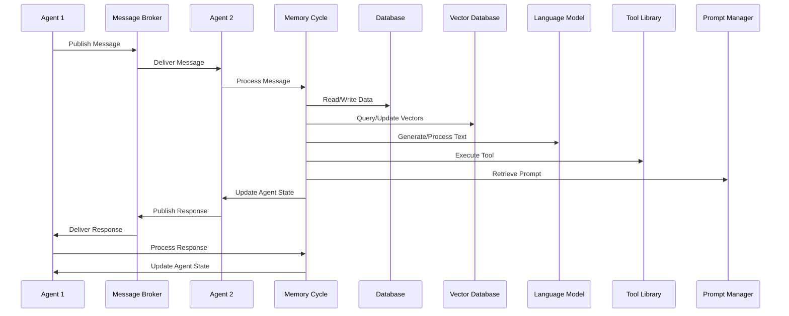

# XMPro MAGS: Advanced Multi-Agent Systems for Industrial AI

## Introduction

Multi-agent systems have become increasingly important in solving complex problems in industrial and enterprise settings. XMPro's Multi-Agent Generative Systems (MAGS) and Agent Platform EXperience (APEX) offer advanced capabilities in both functionality and scalability. This article examines the technical details of XMPro's approach and compares it to other agent frameworks in the market.

## MAGS: Advanced Communication Architecture

### Industrial-Grade Messaging Infrastructure

XMPro MAGS is built on robust messaging protocols, making it suitable for industrial applications:

- **MQTT and DDS Integration**: These industry-standard protocols provide:
  1. Scalability to manage thousands of devices and agents
  2. Reliability in challenging network environments
  3. Real-time performance essential for industrial processes

The use of these protocols ensures that MAGS can operate effectively in large-scale industrial deployments. It can handle high-volume data streams and maintain communication integrity even in unstable network conditions. This infrastructure is particularly valuable in environments where real-time data processing and agent communication are critical for operations.

### Dual-Database Approach for Enhanced Cognition

MAGS employs two specialized databases to improve its cognitive capabilities:

1. **Vector Database**:
   - Enables efficient semantic similarity searches
   - Supports advanced AI operations and retrieval-augmented generation (RAG)

2. **Graph Database (Neo4j)**:
   - Represents complex relationships between entities
   - Facilitates nuanced reasoning about interconnected data

This dual-database system allows MAGS to process and understand complex data relationships more effectively than systems using simpler database structures. The Vector Database enables quick retrieval of semantically similar information, while the Graph Database provides context and relational understanding. Together, they enable MAGS to make more informed decisions based on a comprehensive understanding of the data landscape.

### Integrated Memory Cycle

The Memory Cycle in MAGS functions as a cognitive engine, closely integrated with various subsystems:

This integrated approach enables:
- Complex reasoning and decision-making processes
- Seamless interaction between agents, databases, language models, and specialized tools

The Memory Cycle acts as the central processing unit for each agent, coordinating interactions between different components of the system. It manages the flow of information, ensures that relevant data is retrieved and processed, and updates the agent's state based on new inputs and decisions. This integration allows for more sophisticated and context-aware decision-making compared to systems with less tightly coupled components.

### Advanced Cognitive Architecture

XMPro MAGS offers a sophisticated cognitive architecture that mimics human decision-making processes:

1. **Contextual Information Gathering**: Combines vector similarity searches with graph-based relationship queries.
2. **Information Synthesis**: Filters and ranks retrieved information based on relevance and analyzes temporal and causal relationships.
3. **Knowledge Augmentation**: Uses Retrieval-Augmented Generation (RAG) with Large Language Models (LLMs) to generate additional insights and scenarios.
4. **Decision Formulation**: Employs LLMs to generate and evaluate potential decision options based on augmented knowledge.
5. **Continuous Learning**: Feeds back each decision and its outcomes into the system, allowing for adaptive improvement over time.

This cognitive architecture allows MAGS to process complex information and make decisions in a way that's more similar to human cognition. It can consider multiple factors, understand context, and learn from past experiences. This approach is particularly valuable in industrial settings where decisions often require balancing multiple variables and considering long-term consequences.

## APEX: Scalable AgentOps Platform

APEX serves as a comprehensive management platform for MAGS, overseeing the lifecycle, integration, and optimization of AI agents.

### Seamless OT/IT Integration

APEX bridges the gap between operational technology (OT) and information technology (IT) systems:
- Allows AI agents to process data from OT systems
- Interfaces with IT systems for higher-level decision making and reporting

This integration is crucial in industrial environments where there's often a divide between operational systems and business IT. APEX allows for seamless data flow and decision-making across these traditionally separate domains. This capability enables more holistic operational management and data-driven decision-making at all levels of an organization.

### Robust Governance Framework

APEX incorporates a strong ethical framework to ensure responsible AI deployment:
- Implements deontic rules and organizational policies
- Ensures AI agents operate within defined boundaries
- Aligns with corporate governance and industry regulations

The governance framework is essential for maintaining control and accountability in AI systems. It ensures that AI agents act in accordance with organizational policies and regulatory requirements. This is particularly important in industries with strict compliance needs or where AI decisions can have significant operational or safety implications.

### Advanced Observability

Utilizing OpenTelemetry integration, APEX provides:
- Deep insights into system performance and behavior
- Comprehensive monitoring and optimization of AI operations

Advanced observability allows for real-time monitoring and troubleshooting of the AI system. It provides visibility into how agents are performing, how decisions are being made, and where potential issues might arise. This capability is crucial for maintaining system reliability and for continuous improvement of AI operations.

### Flexible Communication Infrastructure

APEX supports protocols like MQTT and DDS, facilitating:
- Efficient and reliable data exchange in distributed environments
- High-performance communication suitable for industrial settings

The flexible communication infrastructure allows APEX to adapt to various industrial communication needs. It can handle high-volume data streams and ensure reliable message delivery even in challenging network conditions. This flexibility is key to deploying AI systems across diverse industrial environments with varying communication requirements.

### Extensible Architecture

APEX is designed for adaptability:
- Employs abstract classes and interfaces
- Allows for easy customization and extension to meet specific industry requirements

The extensible architecture of APEX ensures that it can be tailored to specific industry needs without compromising its core functionality. This adaptability is crucial in industrial settings where each deployment may have unique requirements or constraints. It allows organizations to leverage the power of MAGS while still addressing their specific operational needs.

## XMPro MAGS vs Traditional Agent Frameworks: A New Approach to LLM Utilization

XMPro MAGS represents a significant advancement in how Large Language Models (LLMs) are integrated into multi-agent systems. This section compares MAGS' approach to that of traditional agent frameworks like CrewAI, LlamaIndex, LangGraph, and Autogen.

### XMPro MAGS: Cognitive Decision-Making with LLMs

XMPro MAGS deeply embeds LLMs into its cognitive architecture, using them as integral components of the decision-making process. This approach allows for more nuanced, context-aware, and adaptive decision-making.

Key aspects of XMPro MAGS' cognitive approach include:

1. **Contextual Information Gathering**:
   - MAGS uses vector similarity searches to find relevant past experiences or knowledge.
   - The Graph Database provides structured context around these relevant pieces of information.
   - LLMs synthesize and interpret this multi-modal information, creating a rich contextual understanding.

2. **Information Synthesis and Reasoning**:
   - LLMs analyze and draw insights from the gathered information.
   - They understand causal relationships, temporal sequences, and complex interdependencies between different pieces of information.
   - The system leverages the LLM's ability to perform analogical reasoning, drawing parallels between current situations and past experiences.

3. **Hypothesis Generation and Evaluation**:
   - MAGS uses LLMs to generate multiple hypotheses or potential solutions based on the synthesized information.
   - These hypotheses are evaluated using a combination of LLM-based reasoning and structured data from the Graph Database.
   - This process mimics human cognitive abilities to ideate and critically evaluate potential solutions.

4. **Decision Formulation and Justification**:
   - LLMs play a crucial role in formulating decisions based on the evaluated hypotheses.
   - They generate explanations and justifications for these decisions, providing transparency and interpretability.
   - This process leverages the LLM's natural language understanding and generation capabilities to produce human-readable rationales.

5. **Continuous Learning and Adaptation**:
   - MAGS uses LLMs to reflect on past decisions and their outcomes, stored in the Memory Cycle.
   - This reflection process allows for the generation of new insights and the updating of decision-making strategies.
   - LLMs help in abstracting general principles from specific experiences, facilitating transfer learning across different domains.

6. **Multi-Agent Collaboration**:
   - LLMs facilitate sophisticated inter-agent communication, allowing agents to share complex ideas, strategies, and reasoning.
   - They enable agents to understand and respond to nuanced requests or information from other agents, fostering more effective collaboration.

### Traditional Agent Frameworks: Procedural Approach with LLMs

Traditional agent frameworks typically adopt a more procedural programming approach. In these frameworks:

1. **Agent Structure**:
   - Agents are often implemented as code blocks or classes with predefined methods and behaviors.
   - The decision-making logic is usually hardcoded or follows rigid, predefined rules.

2. **LLM Utilization**:
   - LLMs are primarily used as tools for specific tasks such as content generation, text summarization, or question answering.
   - They are not deeply integrated into the decision-making process itself.

3. **Information Processing**:
   - Information is typically processed in a linear, step-by-step manner, with LLMs being called at specific points for specific tasks.
   - There's often a clear separation between data processing (done procedurally) and natural language tasks (delegated to LLMs).

4. **Limited Context Awareness**:
   - These frameworks often lack the sophisticated context gathering and synthesis capabilities of XMPro MAGS.
   - Context is usually limited to what's explicitly provided in the agent's current state or immediate input.

5. **Predefined Workflows**:
   - Agents often follow predetermined paths or decision trees.
   - While these can be complex, they lack the flexibility and adaptability of MAGS' cognitive approach.

6. **Inter-Agent Communication**:
   - Communication between agents is typically more structured and limited, often based on predefined protocols or message formats.
   - LLMs might be used to generate or interpret messages, but the communication logic itself is usually procedural.

### Key Differences and Advantages of XMPro MAGS

1. **Cognitive Depth**: 
   - MAGS: Simulates cognitive processes more closely, allowing for more human-like reasoning and decision-making.
   - Traditional Frameworks: Rely more on programmatic logic and predefined workflows.

2. **Adaptability**:
   - MAGS: Can adapt its decision-making strategies based on accumulated experiences and changing contexts.
   - Traditional Frameworks: Adaptability is limited to predefined parameters or requires manual updates to the codebase.

3. **Context Integration**:
   - MAGS: Deeply integrates multi-modal contextual information into every stage of the decision-making process.
   - Traditional Frameworks: Context is often limited and not as deeply integrated into decision-making.

4. **LLM Integration**:
   - MAGS: LLMs are central to the decision-making process, involved in reasoning, planning, and evaluation.
   - Traditional Frameworks: LLMs are peripheral tools, mainly used for text processing tasks.

5. **Scalability in Complexity**:
   - MAGS: Designed to handle highly complex, nuanced decision scenarios with multiple interdependencies.
   - Traditional Frameworks: Better suited for well-defined tasks with clear inputs and outputs.

6. **Explainability**:
   - MAGS: Can provide detailed, context-aware explanations for its decisions, leveraging LLMs' natural language capabilities.
   - Traditional Frameworks: Explanations are often limited to predefined messages or simple logs of the decision process.

7. **Transfer Learning**:
   - MAGS: Can more easily apply learnings from one domain to another, thanks to the LLM's broad knowledge base and the system's cognitive architecture.
   - Traditional Frameworks: Transfer learning typically requires explicit programming or model retraining.

## Conclusion

XMPro MAGS represents a significant advancement in how LLMs are utilized in multi-agent systems. By deeply integrating LLMs into the cognitive decision-making process, MAGS achieves a level of sophistication, adaptability, and contextual awareness that surpasses traditional agent frameworks. This approach allows MAGS to handle the complex, dynamic environments typical in industrial and enterprise settings more effectively.

While traditional frameworks have their strengths, particularly in well-defined, task-specific scenarios, XMPro MAGS' cognitive approach opens up new possibilities for AI agents that can reason, learn, and make decisions in ways that more closely mimic human cognitive processes. This makes MAGS particularly well-suited for complex industrial applications where adaptability, contextual understanding, and sophisticated decision-making are crucial.

The combination of MAGS' advanced cognitive architecture and APEX's robust management capabilities provides a comprehensive solution for organizations looking to implement advanced AI systems in industrial environments. It offers the flexibility, scalability, and intelligence needed to address complex operational challenges while maintaining the governance and observability required for responsible AI deployment.
