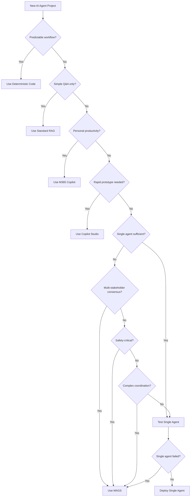

# When NOT to Use MAGS - Decision Guide

**Document Type:** Decision Framework  
**Target Audience:** Business Leaders, Enterprise Architects, Solution Architects  
**Status:** ✅ Complete  
**Last Updated:** December 2025

---

## Executive Summary

Not every AI agent scenario requires the sophistication of MAGS (Multi-Agent Generative Systems). This guide helps organizations make informed decisions about when to use simpler alternatives, ensuring optimal resource allocation and faster time-to-value.

**Key Principle:** Use the simplest solution that meets your requirements. MAGS is designed for complex, multi-stakeholder scenarios requiring consensus, coordination, and industrial-grade reliability.

---

## Decision Framework

### Quick Assessment Questions

Answer these questions to determine if MAGS is appropriate for your use case:

| Question | If YES → | If NO → |
|----------|----------|---------|
| Is the workflow **predictable and rule-based**? | Use deterministic code | Continue assessment |
| Is it **simple information retrieval** without actions? | Use standard RAG | Continue assessment |
| Does it require **single-user productivity** only? | Use Microsoft 365 Copilot | Continue assessment |
| Can a **single agent** handle all requirements? | Test single-agent first | Continue assessment |
| Do you need **rapid prototyping** (days, not weeks)? | Use Microsoft Copilot Studio | Continue assessment |
| Does it require **multi-agent consensus**? | ✅ Consider MAGS | Continue assessment |
| Is it **safety-critical** with audit requirements? | ✅ Consider MAGS | Continue assessment |
| Does it involve **multiple stakeholders** with conflicting goals? | ✅ Consider MAGS | Continue assessment |

---

## 1. When to Use Deterministic Code or Non-Generative AI

### Use Cases

❌ **Don't use MAGS for:**
- Fixed business rules and validation logic
- Predictable data transformations
- Mathematical calculations and algorithms
- Scheduled batch processing
- Simple if-then-else workflows
- Data pipeline orchestration with known steps

### Why Not MAGS?

- **Cost:** Deterministic code is cheaper to run (no LLM costs)
- **Speed:** Faster execution without LLM latency
- **Reliability:** 100% predictable outcomes
- **Simplicity:** Easier to test, debug, and maintain

### Recommended Alternatives

| Scenario | Recommended Solution |
|----------|---------------------|
| Business rule validation | Azure Functions, Logic Apps |
| Data transformation | Azure Data Factory, Databricks |
| Predictive analytics | Azure Machine Learning (traditional ML) |
| Scheduled workflows | Azure Logic Apps, Power Automate |

### Example

**Scenario:** Validate invoice data against business rules  
**Wrong Choice:** MAGS multi-agent system  
**Right Choice:** Azure Function with validation logic  
**Reason:** Fixed rules, no reasoning required, deterministic outcome needed

---

## 2. When to Use Standard RAG (Retrieval-Augmented Generation)

### Use Cases

❌ **Don't use MAGS for:**
- FAQ chatbots with static knowledge base
- Document search with generative summaries
- Knowledge base assistants (single-turn interactions)
- Content generation from fixed templates
- Simple question-answering systems

### Why Not MAGS?

- **Complexity:** RAG is simpler to implement and maintain
- **Cost:** Lower operational costs (no multi-agent coordination)
- **Latency:** Faster response times (single LLM call)
- **Sufficient:** Meets requirements without orchestration

### Recommended Alternatives

| Scenario | Recommended Solution |
|----------|---------------------|
| Internal knowledge base | Microsoft Foundry with RAG |
| Customer support FAQ | Azure OpenAI + Azure AI Search |
| Document Q&A | Microsoft Copilot Studio with knowledge sources |
| Content summarization | Azure OpenAI with prompt engineering |

### Example

**Scenario:** Employee HR policy chatbot  
**Wrong Choice:** MAGS with multiple agents  
**Right Choice:** RAG application with Azure AI Search  
**Reason:** Static knowledge, single-turn Q&A, no actions required

---

## 3. When to Use Microsoft 365 Copilot or SaaS Agents

### Use Cases

❌ **Don't use MAGS for:**
- Personal productivity enhancement
- Email drafting and summarization
- Meeting notes and action items
- Document creation and editing
- Calendar management
- Simple task automation within M365

### Why Not MAGS?

- **Ready-to-use:** SaaS agents are pre-built and immediately available
- **Integration:** Native integration with M365 apps
- **Cost:** Included in M365 licensing
- **Maintenance:** No custom code to maintain

### Recommended Alternatives

| Scenario | Recommended Solution |
|----------|---------------------|
| Email assistance | Microsoft 365 Copilot |
| Document drafting | Microsoft 365 Copilot (Word) |
| Data analysis | Microsoft 365 Copilot (Excel) |
| Meeting summaries | Microsoft 365 Copilot (Teams) |
| Code assistance | GitHub Copilot |
| Security operations | Microsoft Security Copilot |

### Example

**Scenario:** Help employees draft professional emails  
**Wrong Choice:** Custom MAGS implementation  
**Right Choice:** Microsoft 365 Copilot  
**Reason:** Standard productivity task, no custom business logic needed

---

## 4. When to Use Single-Agent Solutions

### Use Cases

❌ **Don't use MAGS for:**
- Single-user workflows without coordination
- Tasks that don't cross organizational boundaries
- Scenarios without conflicting objectives
- Simple automation without consensus requirements
- Low-complexity decision-making

### Why Not MAGS?

- **Simplicity:** Single agent is easier to develop and maintain
- **Cost:** Lower operational costs (one agent vs. team)
- **Latency:** Faster execution without coordination overhead
- **Sufficient:** Meets requirements without multi-agent complexity

### Recommended Alternatives

| Scenario | Recommended Solution |
|----------|---------------------|
| Customer service bot | Microsoft Copilot Studio (single agent) |
| Data analysis assistant | Microsoft Foundry (declarative agent) |
| Process automation | Microsoft Foundry (hosted agent) |
| Task execution | Azure OpenAI with function calling |

### Decision Criteria

**Test with a single agent first if:**
- ✅ One role/perspective is sufficient
- ✅ No conflicting objectives between stakeholders
- ✅ No security/compliance boundaries to cross
- ✅ No need for formal consensus or voting
- ✅ Low to moderate complexity

**Consider MAGS if single agent fails to:**
- ❌ Handle conflicting requirements
- ❌ Provide sufficient expertise across domains
- ❌ Meet audit and compliance requirements
- ❌ Scale to handle complexity
- ❌ Coordinate across organizational boundaries

### Example

**Scenario:** Automated customer order processing  
**Test First:** Single agent with order processing logic  
**Escalate to MAGS if:** Multiple departments need to approve, conflicting policies exist, or consensus required

---

## 5. When to Use Microsoft Copilot Studio (Low-Code)

### Use Cases

❌ **Don't use MAGS for:**
- Rapid prototyping and proof-of-concepts
- Business user-led development
- Simple conversational interfaces
- Standard workflow automation
- Time-to-market is critical (days/weeks)

### Why Not MAGS?

- **Speed:** Faster development with low-code tools
- **Accessibility:** Business users can build without coding
- **Cost:** Lower development costs
- **Sufficient:** Meets requirements for moderate complexity

### Recommended Alternatives

| Scenario | Recommended Solution |
|----------|---------------------|
| Conversational bot | Microsoft Copilot Studio |
| Workflow automation | Power Automate + Copilot Studio |
| Form processing | Power Apps + AI Builder |
| Simple task agents | Copilot Studio with connectors |

### When to Escalate to MAGS

Consider MAGS when Copilot Studio limitations are reached:
- Need for complex multi-agent coordination
- Advanced memory and learning requirements
- Custom cognitive architectures (ORPA)
- Industrial-grade reliability and self-healing
- Sophisticated consensus mechanisms

### Example

**Scenario:** IT helpdesk chatbot  
**Start With:** Microsoft Copilot Studio  
**Escalate to MAGS if:** Requires multi-department coordination, complex troubleshooting logic, or formal escalation protocols

---

## 6. When MAGS IS the Right Choice

### Core Scenarios for MAGS

✅ **Use MAGS when you need:**

#### Multi-Stakeholder Consensus
- Multiple departments with conflicting objectives
- Formal voting or approval processes
- Collaborative decision-making with audit trails
- Resource allocation across competing priorities

#### Safety-Critical Operations
- Industrial process control
- Healthcare decision support
- Financial trading and risk management
- Infrastructure management (power, water, transportation)

#### Complex Coordination
- Multi-step workflows requiring agent collaboration
- Dynamic task allocation based on expertise
- Adaptive planning with conflict resolution
- Cross-organizational process orchestration

#### Regulatory Compliance
- Audit trail requirements for all decisions
- Explainability and transparency mandates
- Multi-party validation and approval
- Compliance with industry regulations (FDA, FAA, etc.)

#### Industrial-Grade Requirements
- Self-healing and autonomous repair
- Advanced memory and learning capabilities
- Sophisticated cognitive architecture (ORPA)
- High availability and reliability (99.9%+)

### Example Use Cases

| Industry | Scenario | Why MAGS? |
|----------|----------|-----------|
| **Manufacturing** | Production line optimization | Multi-agent coordination, consensus on resource allocation |
| **Healthcare** | Treatment plan development | Multi-specialist input, safety-critical, audit requirements |
| **Finance** | Credit approval process | Multiple risk assessments, regulatory compliance, explainability |
| **Energy** | Grid management | Real-time coordination, safety-critical, autonomous operation |
| **Supply Chain** | Multi-vendor coordination | Conflicting objectives, complex optimization, consensus needed |

---

## 7. Cost-Benefit Analysis Framework

### Total Cost of Ownership (TCO) Comparison

| Solution Type | Development Cost | Operational Cost | Maintenance Cost | Time to Value |
|--------------|------------------|------------------|------------------|---------------|
| **Deterministic Code** | Low | Very Low | Low | Fast (days) |
| **Standard RAG** | Low-Medium | Low | Low-Medium | Fast (weeks) |
| **SaaS Agents** | Very Low | Medium | Very Low | Immediate |
| **Single Agent** | Medium | Medium | Medium | Medium (weeks) |
| **Copilot Studio** | Low | Medium | Low | Fast (days-weeks) |
| **MAGS** | High | High | Medium | Slower (months) |

### When MAGS ROI Justifies Cost

MAGS investment is justified when:

1. **High-Value Decisions:** Decisions impact millions of dollars or critical operations
2. **Compliance Requirements:** Regulatory penalties exceed implementation costs
3. **Safety-Critical:** Failures could result in injury, death, or environmental damage
4. **Operational Efficiency:** Multi-agent coordination saves significant time/resources
5. **Competitive Advantage:** Sophisticated AI capabilities differentiate your business

### ROI Calculation Template

```
MAGS ROI = (Annual Benefits - Annual Costs) / Implementation Cost

Annual Benefits:
+ Operational cost savings
+ Revenue increase from faster decisions
+ Risk reduction (compliance, safety)
+ Competitive advantage value

Annual Costs:
- Infrastructure (compute, storage, networking)
- LLM API costs
- Maintenance and support
- Training and change management

Implementation Cost:
- Development effort
- Integration work
- Testing and validation
- Initial training
```

---

## 8. Migration Path Decision Tree



---

## 9. Common Anti-Patterns

### ❌ Anti-Pattern 1: "AI for Everything"

**Problem:** Using MAGS for simple tasks that don't require AI  
**Example:** Using multi-agent system for basic data validation  
**Solution:** Use deterministic code for predictable logic

### ❌ Anti-Pattern 2: "Premature Optimization"

**Problem:** Starting with MAGS before validating single-agent approach  
**Example:** Building multi-agent system without testing simpler solutions  
**Solution:** Follow Microsoft's decision tree - test single agent first

### ❌ Anti-Pattern 3: "Technology-Driven"

**Problem:** Choosing MAGS because it's sophisticated, not because it's needed  
**Example:** Using consensus mechanisms when no conflicting objectives exist  
**Solution:** Start with business requirements, then select appropriate technology

### ❌ Anti-Pattern 4: "Ignoring SaaS Options"

**Problem:** Building custom solution when SaaS agent would suffice  
**Example:** Creating custom email assistant instead of using M365 Copilot  
**Solution:** Evaluate SaaS agents first before custom development

### ❌ Anti-Pattern 5: "Over-Engineering"

**Problem:** Adding multi-agent complexity for future requirements that may never materialize  
**Example:** Building consensus mechanisms "just in case" they're needed later  
**Solution:** Implement what's needed now, design for future extensibility

---

## 10. Decision Checklist

Use this checklist to validate your technology choice:

### Before Choosing MAGS

- [ ] Confirmed that deterministic code is insufficient
- [ ] Validated that standard RAG doesn't meet requirements
- [ ] Evaluated available SaaS agents (M365 Copilot, etc.)
- [ ] Tested single-agent approach and documented limitations
- [ ] Identified specific multi-agent requirements (consensus, coordination, etc.)
- [ ] Calculated ROI and confirmed positive business case
- [ ] Assessed organizational readiness for complex AI system
- [ ] Confirmed availability of required expertise (AI, DevOps, domain experts)
- [ ] Validated compliance and security requirements
- [ ] Obtained executive sponsorship and budget approval

### Red Flags (Reconsider MAGS)

- [ ] No clear multi-agent coordination requirement
- [ ] Single stakeholder with no conflicting objectives
- [ ] Tight timeline (< 3 months to production)
- [ ] Limited budget (< $100K for implementation)
- [ ] No in-house AI/ML expertise
- [ ] Simple, predictable workflows
- [ ] No regulatory or safety-critical requirements
- [ ] Existing SaaS solution meets 80%+ of requirements

---

## 11. Recommended Approach

### Step 1: Start Simple

1. **Evaluate SaaS Options:** Check Microsoft 365 Copilot, Security Copilot, etc.
2. **Test Standard RAG:** Build proof-of-concept with Azure OpenAI + AI Search
3. **Try Low-Code:** Prototype in Microsoft Copilot Studio

### Step 2: Validate Need for Custom Agent

1. **Document Limitations:** Why don't simpler solutions work?
2. **Test Single Agent:** Build minimal viable agent with Microsoft Foundry
3. **Measure Performance:** Does it meet requirements?

### Step 3: Escalate to MAGS Only When Necessary

1. **Identify Multi-Agent Requirements:** Consensus, coordination, expertise distribution
2. **Validate Business Case:** ROI justifies complexity and cost
3. **Confirm Organizational Readiness:** Skills, budget, executive support

### Step 4: Implement Incrementally

1. **Start with Core Agents:** Implement minimum viable multi-agent system
2. **Add Complexity Gradually:** Consensus, self-healing, advanced memory
3. **Measure and Optimize:** Validate value at each stage

---

## 12. Summary

### Use MAGS When You Need:

✅ Multi-stakeholder consensus and coordination  
✅ Safety-critical operations with audit requirements  
✅ Complex industrial processes requiring distributed intelligence  
✅ Regulatory compliance with explainability mandates  
✅ Industrial-grade reliability and self-healing  
✅ Advanced cognitive architecture (ORPA)  
✅ Sophisticated memory and learning capabilities  

### Don't Use MAGS When:

❌ Workflow is predictable and rule-based  
❌ Simple information retrieval is sufficient  
❌ Personal productivity is the primary goal  
❌ Single agent can handle all requirements  
❌ Rapid prototyping is critical  
❌ Budget or timeline is constrained  
❌ No multi-agent coordination needed  

### Key Principle

**"Use the simplest solution that meets your requirements. Escalate to MAGS only when simpler approaches fail to deliver the necessary capabilities."**

---

## Next Steps

1. **Review Your Use Case:** Apply the decision framework to your scenario
2. **Complete the Checklist:** Validate technology choice systematically
3. **Consult Experts:** Engage with MAGS team if multi-agent requirements are confirmed
4. **Start Simple:** Test simpler alternatives before committing to MAGS
5. **Document Decision:** Record rationale for technology choice for future reference

---

**Related Documents:**
- [Azure CAF Alignment Analysis](../strategic-positioning/azure-caf-alignment-analysis.md)
- [Migration from Single-Agent to Multi-Agent Playbook](migration-single-to-multi-agent.md) *(coming soon)*
- [MAGS Business Adoption Framework](../adoption-framework/README.md) *(coming soon)*

**Document Status:** ✅ Ready for Review and Stakeholder Validation