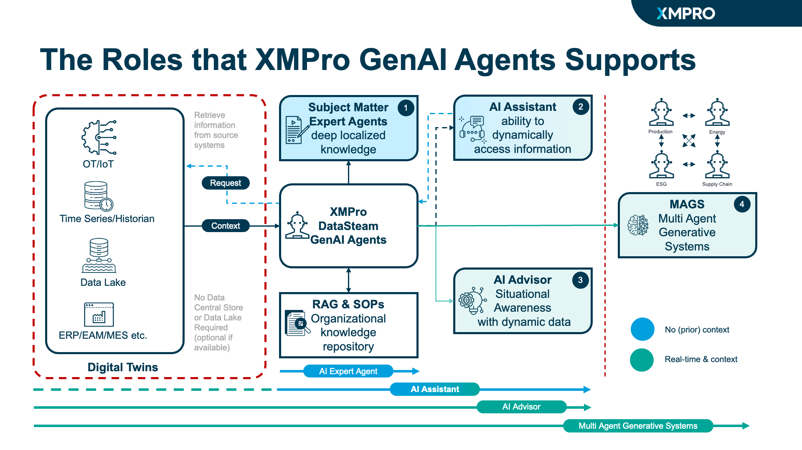
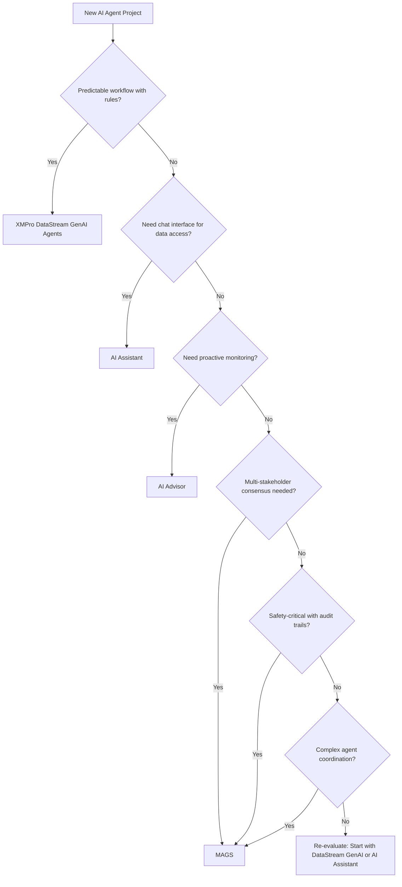

# When NOT to Use MAGS - Decision Guide

**Document Type:** Decision Framework  
**Target Audience:** Business Leaders, Enterprise Architects, Solution Architects  
**Status:** ✅ Complete  
**Last Updated:** December 2025

---

## Executive Summary

Not every AI agent scenario requires the sophistication of MAGS (Multi-Agent Generative Systems). XMPro's Agentic Operations platform provides a comprehensive suite of AI capabilities designed to match the right solution to your specific needs.

**Key Principle:** Use the simplest XMPro solution that meets your requirements. MAGS is designed for complex, multi-stakeholder scenarios requiring consensus, coordination, and industrial-grade reliability.

---

## XMPro Agentic Operations: The Complete Suite

*Figure: XMPro's comprehensive Agentic Operations platform showing the four distinct AI agent capabilities, each optimized for different operational needs - from rule-based DataStream agents to sophisticated Multi-Agent Generative Systems.*

XMPro offers four distinct AI agent capabilities, each optimized for different use cases:

### 1. **XMPro DataStream GenAI Agents** 
**Best for:** Rule-based solutions with LLM capability
- Predictable workflows with AI enhancement
- Real-time data processing with intelligent decision support
- Integration with OT/IoT systems through XMPro Data Streams
- Low-code/no-code configuration

### 2. **AI Assistant**
**Best for:** Interactive information access with chat interface
- Dynamic access to real-time operational data
- Conversational interface for data exploration
- Subject matter expert knowledge retrieval
- Single-user productivity enhancement

### 3. **AI Advisor**
**Best for:** Situational awareness with dynamic data
- Real-time monitoring and alerting
- Context-aware recommendations
- Operational intelligence and insights
- Proactive guidance based on current conditions

### 4. **MAGS (Multi-Agent Generative Systems)**
**Best for:** Complex multi-stakeholder coordination
- Formal consensus mechanisms
- Multi-agent collaboration and coordination
- Safety-critical operations with audit trails
- Distributed intelligence across organizational boundaries

---

## Decision Framework

### Quick Assessment Questions

Answer these questions to determine which XMPro solution is appropriate:

| Question | Recommended Solution |
|----------|---------------------|
| Is the workflow **predictable and rule-based**? | XMPro DataStream GenAI Agents |
| Do you need **chat-based information access**? | AI Assistant |
| Do you need **real-time situational awareness**? | AI Advisor |
| Does it require **multi-agent consensus**? | MAGS |
| Is it **safety-critical** with audit requirements? | MAGS |
| Does it involve **multiple stakeholders** with conflicting goals? | MAGS |

---

## 1. When to Use XMPro DataStream GenAI Agents

### Ideal Use Cases

✅ **Use DataStream GenAI Agents for:**
- Predictable workflows enhanced with AI reasoning
- Real-time data processing with intelligent decision support
- Rule-based automation with LLM-powered flexibility
- Integration with OT/IoT systems and sensors
- Data transformation and enrichment pipelines
- Scheduled batch processing with AI insights
- Event-driven workflows with contextual understanding

### Why DataStream GenAI Agents?

- **Real-Time Integration:** Direct connection to operational data through XMPro Data Streams
- **Low-Code Configuration:** Visual designer for rapid development
- **Hybrid Intelligence:** Combines deterministic rules with LLM reasoning
- **Cost-Effective:** Optimized for high-volume, predictable workflows
- **Proven Reliability:** Built on XMPro's industrial-grade platform

### Example Scenarios

| Industry | Use Case | Why DataStream GenAI Agents? |
|----------|----------|------------------------------|
| **Manufacturing** | Quality control validation | Rule-based checks enhanced with AI anomaly detection |
| **Energy** | Sensor data processing | Real-time data transformation with intelligent alerting |
| **Mining** | Equipment monitoring | Predictable workflows with AI-powered insights |
| **Utilities** | Asset performance tracking | Scheduled analysis with contextual recommendations |

### When to Escalate to MAGS

Consider MAGS when DataStream GenAI Agents cannot provide:
- Multi-stakeholder consensus requirements
- Complex agent-to-agent coordination
- Formal voting or approval processes
- Distributed decision-making across teams

---

## 2. When to Use AI Assistant

### Ideal Use Cases

✅ **Use AI Assistant for:**
- Interactive data exploration and analysis
- Conversational access to operational information
- Subject matter expert knowledge retrieval
- Real-time data querying with natural language
- Single-user productivity enhancement
- Ad-hoc information requests
- Training and onboarding support

### Why AI Assistant?

- **Dynamic Data Access:** Real-time connection to operational systems
- **Natural Language Interface:** Intuitive chat-based interaction
- **Contextual Understanding:** Leverages organizational knowledge
- **Rapid Deployment:** Quick setup and configuration
- **User-Friendly:** No technical expertise required

### Example Scenarios

| Industry | Use Case | Why AI Assistant? |
|----------|----------|-------------------|
| **Manufacturing** | Production data queries | Operators need quick access to real-time metrics |
| **Healthcare** | Patient information lookup | Clinicians need fast, conversational data access |
| **Logistics** | Shipment tracking | Staff need instant status updates via chat |
| **Retail** | Inventory inquiries | Store managers need real-time stock information |

### When to Escalate to MAGS

Consider MAGS when AI Assistant cannot provide:
- Multi-agent collaboration requirements
- Complex decision-making workflows
- Formal approval processes
- Cross-departmental coordination

---

## 3. When to Use AI Advisor

### Ideal Use Cases

✅ **Use AI Advisor for:**
- Real-time situational awareness and monitoring
- Proactive alerts and recommendations
- Context-aware operational guidance
- Performance optimization insights
- Risk detection and mitigation
- Operational intelligence dashboards
- Continuous monitoring with intelligent alerting

### Why AI Advisor?

- **Situational Awareness:** Real-time understanding of operational context
- **Proactive Guidance:** Anticipates issues before they become critical
- **Dynamic Data Integration:** Continuously updated with live information
- **Actionable Insights:** Provides specific, context-aware recommendations
- **Always-On Monitoring:** 24/7 operational intelligence

### Example Scenarios

| Industry | Use Case | Why AI Advisor? |
|----------|----------|-----------------|
| **Energy** | Grid stability monitoring | Real-time awareness with proactive recommendations |
| **Manufacturing** | Production optimization | Continuous monitoring with performance insights |
| **Transportation** | Fleet management | Dynamic routing and maintenance recommendations |
| **Oil & Gas** | Safety monitoring | Proactive risk detection and mitigation guidance |

### When to Escalate to MAGS

Consider MAGS when AI Advisor cannot provide:
- Multi-stakeholder decision coordination
- Formal consensus mechanisms
- Complex agent collaboration
- Distributed autonomous operations

---

## 4. When MAGS IS the Right Choice

### Core Scenarios for MAGS

✅ **Use MAGS when you need:**

#### Multi-Stakeholder Consensus
- Multiple departments with conflicting objectives
- Formal voting or approval processes
- Collaborative decision-making with audit trails
- Resource allocation across competing priorities

#### Safety-Critical Operations
- Industrial process control requiring multiple validations
- Healthcare decision support with multi-specialist input
- Financial trading with risk management oversight
- Infrastructure management with redundant decision-making

#### Complex Coordination
- Multi-step workflows requiring agent collaboration
- Dynamic task allocation based on expertise
- Adaptive planning with conflict resolution
- Cross-organizational process orchestration

#### Regulatory Compliance
- Audit trail requirements for all decisions
- Explainability and transparency mandates
- Multi-party validation and approval
- Compliance with industry regulations (FDA, FAA, etc.)

#### Industrial-Grade Requirements
- Self-healing and autonomous repair
- Advanced memory and learning capabilities
- Sophisticated cognitive architecture (ORPA)
- High availability and reliability (99.9%+)

### Example Use Cases

| Industry | Scenario | Why MAGS? |
|----------|----------|-----------|
| **Manufacturing** | Production line optimization | Multi-agent coordination, consensus on resource allocation |
| **Healthcare** | Treatment plan development | Multi-specialist input, safety-critical, audit requirements |
| **Finance** | Credit approval process | Multiple risk assessments, regulatory compliance, explainability |
| **Energy** | Grid management | Real-time coordination, safety-critical, autonomous operation |
| **Supply Chain** | Multi-vendor coordination | Conflicting objectives, complex optimization, consensus needed |

---

## 5. XMPro Solution Comparison

### Capability Matrix

| Capability | DataStream GenAI | AI Assistant | AI Advisor | MAGS |
|-----------|------------------|--------------|------------|------|
| **Real-Time Data Access** | ✅ Native | ✅ Yes | ✅ Yes | ✅ Yes |
| **Rule-Based Logic** | ✅ Primary | ❌ No | ⚠️ Limited | ⚠️ Limited |
| **Chat Interface** | ❌ No | ✅ Primary | ⚠️ Optional | ⚠️ Optional |
| **Proactive Monitoring** | ⚠️ Limited | ❌ No | ✅ Primary | ✅ Yes |
| **Multi-Agent Coordination** | ❌ No | ❌ No | ❌ No | ✅ Primary |
| **Consensus Mechanisms** | ❌ No | ❌ No | ❌ No | ✅ Yes |
| **Development Complexity** | Low | Low | Low-Medium | High |
| **Time to Value** | Days | Days | Days-Weeks | Months |
| **Operational Cost** | Low | Low | Medium | High |

### Cost-Benefit Analysis

| Solution | Development Cost | Operational Cost | Maintenance Cost | Time to Value |
|----------|------------------|------------------|------------------|---------------|
| **DataStream GenAI** | Low | Low | Low | Fast (days) |
| **AI Assistant** | Low | Low | Low | Fast (days) |
| **AI Advisor** | Low-Medium | Medium | Low-Medium | Fast (days-weeks) |
| **MAGS** | High | High | Medium | Slower (months) |

---

## 6. When to Consider External Alternatives

Only after evaluating all XMPro Agentic Operations capabilities should you consider external alternatives:

### External Options (Last Resort)

**Consider external solutions only if:**
- ❌ None of the XMPro solutions meet your requirements
- ❌ You need capabilities outside XMPro's operational focus
- ❌ Integration with XMPro platform is not feasible
- ❌ Specific vendor requirements mandate alternative solutions

### Common External Alternatives

| Scenario | External Option | Why Last Resort? |
|----------|----------------|------------------|
| Personal productivity | Microsoft 365 Copilot | XMPro focuses on operational intelligence, not office productivity |
| Code development | GitHub Copilot | Outside XMPro's operational scope |
| Security operations | Microsoft Security Copilot | Specialized security focus beyond XMPro's domain |
| Generic chatbots | Various SaaS options | XMPro solutions provide operational data integration |

---

## 7. Decision Tree

---

## 8. Common Anti-Patterns

### ❌ Anti-Pattern 1: "MAGS for Everything"

**Problem:** Using MAGS for simple tasks that don't require multi-agent coordination  
**Example:** Using MAGS for basic data validation  
**Solution:** Use XMPro DataStream GenAI Agents for rule-based workflows

### ❌ Anti-Pattern 2: "Ignoring XMPro's Simpler Solutions"

**Problem:** Building custom solutions when XMPro has built-in capabilities  
**Example:** Creating custom chatbot instead of using AI Assistant  
**Solution:** Evaluate all XMPro Agentic Operations capabilities first

### ❌ Anti-Pattern 3: "External-First Thinking"

**Problem:** Defaulting to external solutions without considering XMPro's integrated capabilities  
**Example:** Using external RAG solution instead of AI Assistant with real-time data  
**Solution:** Leverage XMPro's native operational data integration

### ❌ Anti-Pattern 4: "Premature Complexity"

**Problem:** Starting with MAGS before validating simpler XMPro solutions  
**Example:** Building multi-agent system without testing DataStream GenAI Agents  
**Solution:** Start simple, escalate only when necessary

### ❌ Anti-Pattern 5: "Technology-Driven Selection"

**Problem:** Choosing solution based on sophistication rather than requirements  
**Example:** Using MAGS because it's advanced, not because it's needed  
**Solution:** Match solution to actual business requirements

---

## 9. Decision Checklist

### Before Choosing MAGS

- [ ] Confirmed that XMPro DataStream GenAI Agents are insufficient
- [ ] Validated that AI Assistant doesn't meet requirements
- [ ] Tested AI Advisor and documented limitations
- [ ] Identified specific multi-agent requirements (consensus, coordination, etc.)
- [ ] Calculated ROI and confirmed positive business case
- [ ] Assessed organizational readiness for complex AI system
- [ ] Confirmed availability of required expertise
- [ ] Validated compliance and security requirements
- [ ] Obtained executive sponsorship and budget approval

### Red Flags (Reconsider MAGS)

- [ ] No clear multi-agent coordination requirement
- [ ] Single stakeholder with no conflicting objectives
- [ ] Tight timeline (< 3 months to production)
- [ ] Limited budget (< $100K for implementation)
- [ ] Simple, predictable workflows
- [ ] No regulatory or safety-critical requirements
- [ ] XMPro's simpler solutions meet 80%+ of requirements

---

## 10. Recommended Approach

### Step 1: Start with XMPro's Simpler Solutions

1. **Evaluate DataStream GenAI Agents:** For rule-based workflows with AI enhancement
2. **Test AI Assistant:** For conversational data access needs
3. **Try AI Advisor:** For situational awareness and monitoring

### Step 2: Validate Need for MAGS

1. **Document Limitations:** Why don't simpler XMPro solutions work?
2. **Identify Multi-Agent Requirements:** Consensus, coordination, distributed intelligence
3. **Measure Complexity:** Does the scenario truly require agent collaboration?

### Step 3: Escalate to MAGS Only When Necessary

1. **Confirm Multi-Stakeholder Needs:** Multiple departments, conflicting objectives
2. **Validate Business Case:** ROI justifies complexity and cost
3. **Confirm Organizational Readiness:** Skills, budget, executive support

### Step 4: Implement Incrementally

1. **Start with Core Agents:** Implement minimum viable multi-agent system
2. **Add Complexity Gradually:** Consensus, self-healing, advanced memory
3. **Measure and Optimize:** Validate value at each stage

---

## 11. Summary

### XMPro Agentic Operations Decision Guide

**Use XMPro DataStream GenAI Agents when:**
- ✅ Predictable workflows with AI enhancement
- ✅ Real-time data processing needs
- ✅ Rule-based automation with flexibility
- ✅ Low-code/no-code development preferred

**Use AI Assistant when:**
- ✅ Chat-based data access needed
- ✅ Interactive information exploration
- ✅ Single-user productivity focus
- ✅ Natural language interface preferred

**Use AI Advisor when:**
- ✅ Real-time situational awareness needed
- ✅ Proactive monitoring and alerting
- ✅ Context-aware recommendations
- ✅ Continuous operational intelligence

**Use MAGS when:**
- ✅ Multi-stakeholder consensus required
- ✅ Safety-critical operations with audit trails
- ✅ Complex agent coordination needed
- ✅ Distributed intelligence across boundaries
- ✅ Regulatory compliance with explainability
- ✅ Industrial-grade reliability required

### Key Principle

**"Start with the simplest XMPro solution that meets your requirements. Leverage XMPro's integrated Agentic Operations capabilities before considering external alternatives. Escalate to MAGS only when multi-agent coordination is truly necessary."**

---

## Next Steps

1. **Review Your Use Case:** Apply the decision framework to your scenario
2. **Start with XMPro's Simpler Solutions:** Test DataStream GenAI, AI Assistant, or AI Advisor first
3. **Complete the Checklist:** Validate technology choice systematically
4. **Consult XMPro Experts:** Engage with the team if MAGS requirements are confirmed
5. **Document Decision:** Record rationale for technology choice for future reference

---

**Related Documents:**
- [XMPro DataStream Documentation](../integration-execution/datastream-integration.md)
- [MAGS Architecture](../architecture/README.md)
- [Use Cases](../use-cases/README.md)

**Document Status:** ✅ Updated to reflect XMPro Agentic Operations capabilities