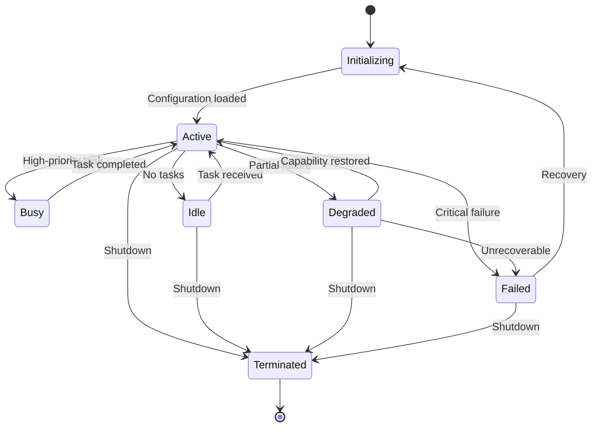
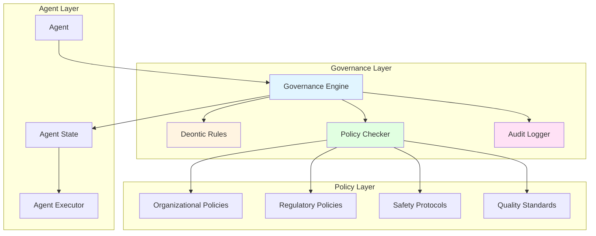
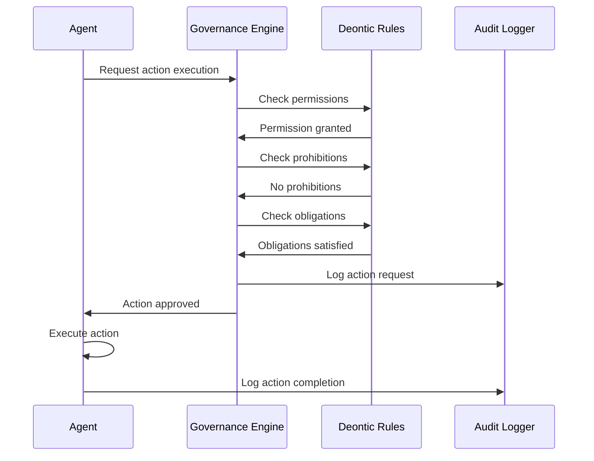

# Agent Lifecycle & Governance: State Management and Compliance

## Overview

Agent Lifecycle & Governance manages agent states, enforces rules and policies, and ensures compliance with organizational and regulatory requirements. Grounded in deontic logic (Von Wright, 1951) and organizational theory, this capability provides the accountability, compliance, and governance required for industrial AI operations—enabling agents to operate autonomously while remaining within defined boundaries and maintaining full auditability.

In industrial environments, autonomous agents must operate within strict boundaries defined by safety regulations, quality standards, operational policies, and organizational rules. Agent Lifecycle & Governance ensures agents understand their permissions, fulfill their obligations, respect prohibitions, and maintain complete audit trails—capabilities that distinguish accountable, compliant multi-agent systems from ungoverned autonomous systems.

### Why Agent Lifecycle & Governance Matters for MAGS

**The Challenge**: Industrial AI systems must operate autonomously while ensuring compliance with safety regulations, quality standards, operational policies, and organizational rules. Agents need clear boundaries, accountability, and auditability—not unconstrained autonomy.

**The Solution**: Deontic logic provides formal framework for obligations, permissions, and prohibitions. State management ensures controlled lifecycle. Audit trails provide accountability.

**The Result**: MAGS agents that operate autonomously within defined boundaries, comply with all rules and regulations, maintain complete audit trails, and provide full accountability—grounded in 70+ years of deontic logic and organizational theory research.

### Key Business Drivers

1. **Regulatory Compliance**: Ensure 100% compliance with safety, quality, and environmental regulations
2. **Accountability**: Complete audit trail for all agent decisions and actions
3. **Risk Management**: Enforce safety boundaries and operational constraints
4. **Operational Control**: Maintain governance over autonomous operations
5. **Quality Assurance**: Ensure adherence to quality standards and procedures

---

## Theoretical Foundations

### Deontic Logic: Logic of Obligations (1951)

**Georg Henrik von Wright** - "Deontic Logic"

**Core Insight**: Formal logic can represent and reason about obligations, permissions, and prohibitions—the normative concepts that govern behavior in organizations and society.

**Key Principles**:

**Deontic Operators**:
- **Obligatory (O)**: Agent must perform action
- **Permitted (P)**: Agent may perform action
- **Forbidden (F)**: Agent must not perform action
- **Optional**: Neither obligatory nor forbidden

**Deontic Relationships**:
- If action is obligatory, it is also permitted
- If action is forbidden, it is not permitted
- Obligations can conflict (deontic dilemmas)
- Permissions can be conditional

**MAGS Application**:
- Define agent permissions (what agents may do)
- Specify agent obligations (what agents must do)
- Enforce prohibitions (what agents must not do)
- Resolve deontic conflicts

**Example**:
```
Equipment Monitor Agent Deontic Rules:

Obligations (O):
  - O(monitor_continuously): Must monitor equipment 24/7
  - O(report_anomalies): Must report detected anomalies
  - O(maintain_audit_trail): Must log all observations
  - O(comply_with_safety): Must respect safety boundaries

Permissions (P):
  - P(read_sensor_data): May read sensor data
  - P(generate_alerts): May generate alerts
  - P(request_maintenance): May request maintenance
  - P(communicate_with_team): May communicate with other agents

Prohibitions (F):
  - F(modify_process_parameters): Must not modify process
  - F(stop_equipment): Must not stop equipment directly
  - F(override_safety): Must not override safety systems
  - F(delete_audit_logs): Must not delete audit records

Deontic principle:
  - Clear boundaries for autonomous operation
  - Formal specification of allowed behavior
  - Enforceable compliance
  - Accountable actions
```

---

### State Machine Theory: Formal State Management

**Core Concepts**: Systems transition between well-defined states according to formal rules

**Key Principles**:
- **States**: Discrete system conditions
- **Transitions**: Rules for moving between states
- **Events**: Triggers for transitions
- **Guards**: Conditions that enable transitions
- **Actions**: Operations performed during transitions

**MAGS Application**:
- Agent lifecycle states (initializing, active, idle, failed, terminated)
- State transition rules
- Event-driven state changes
- Controlled lifecycle management

**Example**:
```
Agent State Machine:

States:
  - INITIALIZING: Starting up, loading configuration
  - ACTIVE: Operating normally, processing tasks
  - BUSY: Processing high-priority task
  - IDLE: Waiting for work
  - DEGRADED: Operating with reduced capability
  - FAILED: Error state, requires intervention
  - TERMINATED: Shut down

Transitions:
  INITIALIZING → ACTIVE: Configuration loaded successfully
  ACTIVE → BUSY: High-priority task received
  BUSY → ACTIVE: Task completed
  ACTIVE → IDLE: No tasks available
  IDLE → ACTIVE: Task received
  ACTIVE → DEGRADED: Partial failure detected
  DEGRADED → ACTIVE: Capability restored
  ACTIVE → FAILED: Critical failure detected
  FAILED → INITIALIZING: Recovery initiated
  Any State → TERMINATED: Shutdown command received

Guards (conditions):
  ACTIVE → BUSY: IF priority == "critical" AND resources_available
  DEGRADED → ACTIVE: IF all_capabilities_restored AND health_check_passed
```

---

### Organizational Theory: Governance Structures

**Core Concepts**: Organizations use hierarchies, policies, and rules to coordinate behavior

**Key Principles**:
- **Hierarchy**: Authority and reporting structures
- **Policies**: Organizational rules and guidelines
- **Roles**: Defined responsibilities and authorities
- **Accountability**: Responsibility for decisions and actions

**MAGS Application**:
- Agent roles and responsibilities
- Organizational policies as deontic rules
- Hierarchical governance structures
- Accountability mechanisms

---

## What It Does

### Core Capabilities

**Agent State Management**:
- Tracks agent lifecycle states
- Manages state transitions
- Monitors agent health
- Handles failures and recovery

**Deontic Rule Enforcement**:
- Enforces obligations (must do)
- Validates permissions (may do)
- Blocks prohibitions (must not do)
- Resolves rule conflicts

**Policy Compliance**:
- Enforces organizational policies
- Ensures regulatory compliance
- Validates safety protocols
- Maintains quality standards

**Audit Trail Management**:
- Logs all agent actions
- Records decision rationale
- Tracks state transitions
- Provides compliance evidence

---

## How It Works

### Agent Lifecycle Management



### State Transition Process

**Step 1: State Monitoring**

*Continuous Monitoring*:
- Track current agent state
- Monitor health metrics
- Detect state change triggers
- Evaluate transition conditions

**Example**:
```
Equipment Monitor Agent:
  Current State: ACTIVE
  Health Metrics:
    - CPU: 45%
    - Memory: 60%
    - Message Queue: 12 messages
    - Last Heartbeat: 2 seconds ago
    - Error Count: 0
  Status: HEALTHY
```

**Step 2: Event Detection**

*Trigger Events*:
- Task received
- Task completed
- Failure detected
- Recovery completed
- Shutdown command

**Example**:
```
Event Detected:
  Type: HIGH_PRIORITY_TASK_RECEIVED
  Task: Emergency anomaly analysis
  Priority: CRITICAL
  Timestamp: 2025-12-06T10:30:00Z
  
Trigger: State transition from ACTIVE to BUSY
```

**Step 3: Transition Validation**

*Guard Evaluation*:
- Check transition conditions
- Validate permissions
- Verify resource availability
- Ensure compliance

**Example**:
```
Transition: ACTIVE → BUSY
Guards:
  ✓ Task priority == CRITICAL
  ✓ Resources available (CPU < 80%, Memory < 80%)
  ✓ No conflicting obligations
  ✓ Permission granted (P(process_critical_tasks))
  
Result: TRANSITION ALLOWED
```

**Step 4: State Transition**

*Transition Execution*:
- Exit current state (cleanup)
- Execute transition actions
- Enter new state (initialization)
- Update state records

**Example**:
```
State Transition Execution:
  Exit ACTIVE:
    - Save current work
    - Release non-critical resources
    - Update status
  
  Transition Actions:
    - Allocate additional resources
    - Set priority flag
    - Notify team coordinator
  
  Enter BUSY:
    - Initialize critical task processing
    - Set busy flag
    - Start task timer
  
  State Updated: ACTIVE → BUSY
  Timestamp: 2025-12-06T10:30:00.123Z
  Audit Log: Recorded
```

**Step 5: State Monitoring**

*Post-Transition*:
- Monitor new state
- Track task progress
- Detect completion or failure
- Prepare for next transition

---

## Deontic Rule System

### Rule Structure

**Deontic Rule Format**:
```json
{
  "rule_id": "rule-001",
  "rule_type": "obligation",
  "agent_role": "EquipmentMonitor",
  "condition": "anomaly_detected",
  "action": "report_to_team",
  "priority": "high",
  "enforcement": "mandatory",
  "violation_consequence": "escalate_to_human"
}
```

### Rule Types

**Type 1: Obligations (Must Do)**

*Definition*: Actions agent must perform

*Enforcement*: Mandatory execution

*Example*:
```
Obligation Rules for Equipment Monitor:

O1: Continuous Monitoring
  Condition: Agent is ACTIVE
  Action: Monitor equipment every 10 seconds
  Priority: HIGH
  Violation: Alert supervisor if monitoring stops

O2: Anomaly Reporting
  Condition: Anomaly detected
  Action: Report to team within 60 seconds
  Priority: CRITICAL
  Violation: Escalate to human immediately

O3: Audit Logging
  Condition: Any action performed
  Action: Log to audit trail
  Priority: HIGH
  Violation: System integrity alert

O4: Safety Compliance
  Condition: Always
  Action: Respect safety boundaries
  Priority: CRITICAL
  Violation: Immediate shutdown
```

**Type 2: Permissions (May Do)**

*Definition*: Actions agent is allowed to perform

*Enforcement*: Validated before execution

*Example*:
```
Permission Rules for Equipment Monitor:

P1: Read Sensor Data
  Scope: All equipment sensors
  Conditions: Agent is ACTIVE or BUSY
  Restrictions: Read-only access

P2: Generate Alerts
  Scope: Team communication channels
  Conditions: Anomaly detected
  Restrictions: Rate limit: 10 alerts/minute

P3: Request Maintenance
  Scope: Maintenance planning system
  Conditions: Failure predicted
  Restrictions: Requires confidence > 0.8

P4: Communicate with Team
  Scope: Team members only
  Conditions: Agent is ACTIVE
  Restrictions: Approved protocols only
```

**Type 3: Prohibitions (Must Not Do)**

*Definition*: Actions agent is forbidden to perform

*Enforcement*: Blocked before execution

*Example*:
```
Prohibition Rules for Equipment Monitor:

F1: Modify Process Parameters
  Scope: All process control systems
  Reason: Safety-critical, requires human approval
  Enforcement: Block all attempts

F2: Stop Equipment
  Scope: All equipment
  Reason: Production impact, requires authorization
  Enforcement: Block unless emergency

F3: Override Safety Systems
  Scope: All safety systems
  Reason: Regulatory compliance
  Enforcement: Block always, log attempts

F4: Delete Audit Logs
  Scope: All audit records
  Reason: Compliance requirement
  Enforcement: Block always, alert security
```

---

## MAGS Implementation

### Governance Architecture



### Action Validation Process

**Before Action Execution**:



**Validation Steps**:

1. **Permission Check**: Is agent permitted to perform action?
2. **Prohibition Check**: Is action forbidden?
3. **Obligation Check**: Are all obligations satisfied?
4. **Policy Check**: Does action comply with policies?
5. **Audit Log**: Record validation and decision

**Example**:
```
Action Request: Adjust process temperature

Validation:
  1. Permission Check:
     Rule: P(adjust_temperature)
     Condition: IF confidence > 0.85 AND within_safe_range
     Agent Confidence: 0.92
     Temperature Change: +5°C (within safe range)
     Result: ✓ PERMITTED

  2. Prohibition Check:
     Rule: F(exceed_safety_limits)
     Safety Limit: 150°C
     Proposed Temperature: 125°C
     Result: ✓ NOT PROHIBITED

  3. Obligation Check:
     Rule: O(notify_team_before_adjustment)
     Team Notification: Sent
     Result: ✓ OBLIGATION SATISFIED

  4. Policy Check:
     Organizational Policy: Require supervisor approval for >10°C
     Change: +5°C
     Result: ✓ POLICY COMPLIANT

  5. Audit Log:
     Action: adjust_temperature
     Validation: APPROVED
     Timestamp: 2025-12-06T10:30:00Z
     Rationale: All checks passed

Final Decision: ACTION APPROVED
```

---

## Design Patterns

### Pattern 1: Role-Based Governance

**Concept**: Different agent roles have different deontic rules

**Benefits**:
- Clear role boundaries
- Appropriate permissions per role
- Scalable governance
- Easy role management

**Example**:
```
Equipment Monitor Role:
  Obligations: Monitor, report, log
  Permissions: Read sensors, generate alerts
  Prohibitions: Modify process, stop equipment

Maintenance Planner Role:
  Obligations: Plan maintenance, optimize schedules
  Permissions: Create work orders, allocate resources
  Prohibitions: Execute maintenance, override safety

Process Controller Role:
  Obligations: Maintain process stability
  Permissions: Adjust parameters, control equipment
  Prohibitions: Exceed safety limits, bypass interlocks
```

---

### Pattern 2: Hierarchical Governance

**Concept**: Multi-level governance with escalation

**Benefits**:
- Distributed governance
- Appropriate autonomy per level
- Clear escalation paths
- Scalable structure

**Example**:
```
Level 1 (Agent): Autonomous within permissions
  - Execute routine actions
  - Report to team coordinator
  - Escalate if uncertain

Level 2 (Team Coordinator): Team-level governance
  - Coordinate team actions
  - Resolve conflicts
  - Escalate critical decisions

Level 3 (Human Supervisor): Human oversight
  - Approve critical actions
  - Handle exceptions
  - Override when necessary
```

---

### Pattern 3: Conditional Permissions

**Concept**: Permissions depend on conditions

**Benefits**:
- Context-aware governance
- Dynamic permissions
- Risk-based control
- Flexible compliance

**Example**:
```
Conditional Permission: Adjust Process Parameters

Base Permission: P(adjust_parameters)

Conditions:
  IF confidence > 0.9 AND change < 5%:
    Permission: GRANTED (autonomous)
  
  ELSE IF confidence > 0.8 AND change < 10%:
    Permission: GRANTED (with notification)
  
  ELSE IF confidence > 0.7 AND change < 15%:
    Permission: GRANTED (with approval)
  
  ELSE:
    Permission: DENIED (escalate to human)
```

---

### Pattern 4: Audit Trail by Design

**Concept**: Comprehensive logging built into governance

**Benefits**:
- Complete auditability
- Compliance evidence
- Forensic analysis
- Continuous improvement

**Example**:
```
Audit Trail Entry:
  Timestamp: 2025-12-06T10:30:00.123Z
  Agent: equipment-monitor-01
  Action: adjust_temperature
  Request: +5°C adjustment
  Validation:
    - Permission: GRANTED (P(adjust_temperature))
    - Prohibition: NONE
    - Obligation: SATISFIED (O(notify_team))
    - Policy: COMPLIANT
  Decision: APPROVED
  Execution: SUCCESS
  Result: Temperature adjusted to 125°C
  Confidence: 0.92
  Rationale: "Optimize throughput while maintaining quality"
```

---

## Integration with Other Capabilities

### With Consensus Management

**Governance Enables Consensus**:
- Validates voting permissions
- Enforces consensus obligations
- Ensures compliant decisions
- Audits consensus process

---

### With Communication Framework

**Governance Controls Communication**:
- Validates message permissions
- Enforces communication protocols
- Ensures secure communication
- Audits message exchanges

---

### With Cognitive Intelligence

**Governance Bounds Intelligence**:
- Validates decision permissions
- Enforces decision obligations
- Ensures compliant reasoning
- Audits decision process

---

## Use Cases

### Use Case 1: Safety-Critical Operation Governance

**Scenario**: Equipment monitor must operate within safety boundaries

**Deontic Rules**:
```
Obligations:
  O1: Monitor safety parameters continuously
  O2: Alert immediately if safety limit approached
  O3: Escalate if safety limit exceeded
  O4: Log all safety-related observations

Permissions:
  P1: Read all safety sensors
  P2: Generate safety alerts
  P3: Request emergency shutdown (if critical)

Prohibitions:
  F1: Never override safety interlocks
  F2: Never disable safety systems
  F3: Never delete safety logs
  F4: Never adjust safety limits

Governance Enforcement:
  - All safety actions validated before execution
  - Safety violations blocked immediately
  - All safety events logged to immutable audit trail
  - Regulatory compliance maintained 100%
```

---

### Use Case 2: Quality Compliance Governance

**Scenario**: Quality agent must ensure ISO 9001 compliance

**Deontic Rules**:
```
Obligations:
  O1: Inspect all products per sampling plan
  O2: Document all quality deviations
  O3: Escalate non-conformances
  O4: Maintain quality records for 7 years

Permissions:
  P1: Access quality data
  P2: Generate quality reports
  P3: Initiate corrective actions
  P4: Request process adjustments

Prohibitions:
  F1: Never approve out-of-spec products
  F2: Never modify quality records
  F3: Never skip required inspections
  F4: Never override quality standards

Compliance Validation:
  - ISO 9001 requirements mapped to deontic rules
  - All quality actions validated for compliance
  - Complete audit trail for certification
  - Automated compliance reporting
```

---

### Use Case 3: Operational Policy Enforcement

**Scenario**: Maintenance planner must follow organizational policies

**Deontic Rules**:
```
Obligations:
  O1: Optimize maintenance schedules
  O2: Minimize production impact
  O3: Stay within budget constraints
  O4: Coordinate with production schedule

Permissions:
  P1: Create maintenance work orders
  P2: Allocate maintenance resources
  P3: Schedule maintenance windows
  P4: Request budget approval (if needed)

Prohibitions:
  F1: Never schedule during peak production
  F2: Never exceed approved budget without approval
  F3: Never compromise safety for cost
  F4: Never skip required maintenance

Policy Enforcement:
  - Organizational policies encoded as deontic rules
  - All maintenance plans validated for policy compliance
  - Budget constraints enforced automatically
  - Production impact minimized per policy
```

---

## Measuring Success

### Governance Performance Metrics

```
Compliance Rate:
  Target: 100% for critical rules
  Target: >99.9% for all rules
  Measurement: (Compliant actions / Total actions) × 100%

Rule Violation Rate:
  Target: <0.1% for critical rules
  Target: <1% for all rules
  Measurement: (Violations / Total actions) × 100%

Audit Trail Completeness:
  Target: 100% of actions logged
  Measurement: (Logged actions / Total actions) × 100%

State Transition Accuracy:
  Target: >99.9% valid transitions
  Measurement: (Valid transitions / Total transitions) × 100%
```

### Compliance Metrics

```
Regulatory Compliance:
  Target: 100% compliance with regulations
  Measurement: Audit findings, certification status

Policy Adherence:
  Target: >99% adherence to organizational policies
  Measurement: Policy violation reports

Safety Compliance:
  Target: 100% compliance with safety protocols
  Measurement: Safety incident rate, near-miss reports
```

---

## Related Documentation

### Core Concepts
- [Deontic Principles](../concepts/deontic-principles.md) - Deontic logic details
- [Agent Architecture](../architecture/agent_architecture.md) - Agent structure

### Research Foundations
- [Multi-Agent Systems](../research-foundations/multi-agent-systems.md) - Agent coordination
- [Distributed Systems](../research-foundations/distributed-systems.md) - State management

### Decision Orchestration
- [Consensus Management](consensus-management.md) - Consensus governance
- [Communication Framework](communication-framework.md) - Communication governance
- [Decision Orchestration Overview](README.md) - Category overview

### Architecture
- [System Components](../architecture/system-components.md) - Governance infrastructure
- [Two-Layer Framework](../architecture/two-layer-framework.md) - Framework positioning

### Use Cases
- All use cases demonstrate governance in action

---

## References

### Foundational Works

**Deontic Logic**:
- Von Wright, G. H. (1951). "Deontic Logic". Mind, 60(237), 1-15
- Meyer, J. J. C., & Wieringa, R. J. (1993). "Deontic Logic in Computer Science: Normative System Specification". John Wiley & Sons
- Åqvist, L. (2002). "Deontic Logic". In D. Gabbay & F. Guenthner (Eds.), Handbook of Philosophical Logic (Vol. 8, pp. 147-264). Springer

**State Machine Theory**:
- Harel, D. (1987). "Statecharts: A visual formalism for complex systems". Science of Computer Programming, 8(3), 231-274
- Lee, E. A., & Seshia, S. A. (2016). "Introduction to Embedded Systems: A Cyber-Physical Systems Approach" (2nd ed.). MIT Press

**Organizational Theory**:
- March, J. G., & Simon, H. A. (1958). "Organizations". John Wiley & Sons
- Mintzberg, H. (1979). "The Structuring of Organizations". Prentice-Hall

### Multi-Agent Governance

**Agent Organizations**:
- Ferber, J., Gutknecht, O., & Michel, F. (2004). "From Agents to Organizations: An Organizational View of Multi-agent Systems". In Agent-Oriented Software Engineering IV (pp. 214-230). Springer
- Dignum, V. (2004). "A Model for Organizational Interaction: Based on Agents, Founded in Logic". PhD Thesis, Utrecht University

**Normative Multi-Agent Systems**:
- Boella, G., & van der Torre, L. (2006). "A Game Theoretic Approach to Contracts in Multiagent Systems". IEEE Transactions on Systems, Man, and Cybernetics, Part C, 36(1), 68-79
- Criado, N., Argente, E., & Botti, V. (2011). "A BDI Architecture for Normative Decision Making". In Proceedings of AAMAS, 1383-1384

### Industrial Applications

**Industrial Compliance**:
- Leitão, P., & Karnouskos, S. (Eds.). (2015). "Industrial Agents: Emerging Applications of Software Agents in Industry". Elsevier
- Colombo, A. W., et al. (2017). "Industrial Cloud-Based Cyber-Physical Systems". Springer

**Safety and Compliance**:
- Leveson, N. G. (2011). "Engineering a Safer World: Systems Thinking Applied to Safety". MIT Press
- International Electrotechnical Commission (2010). "IEC 61508: Functional Safety of Electrical/Electronic/Programmable Electronic Safety-related Systems"

---

**Document Version**: 2.0  
**Last Updated**: December 6, 2025  
**Status**: ✅ Enhanced to Comprehensive Quality Standard