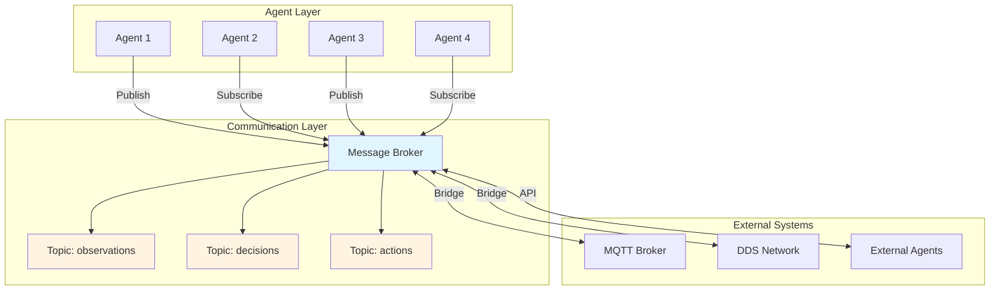
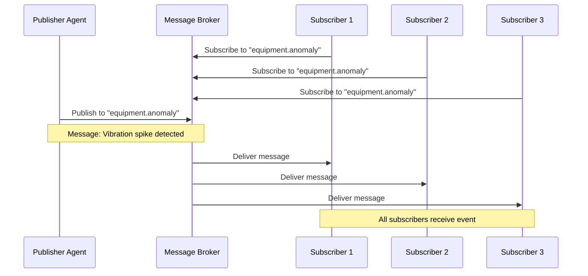
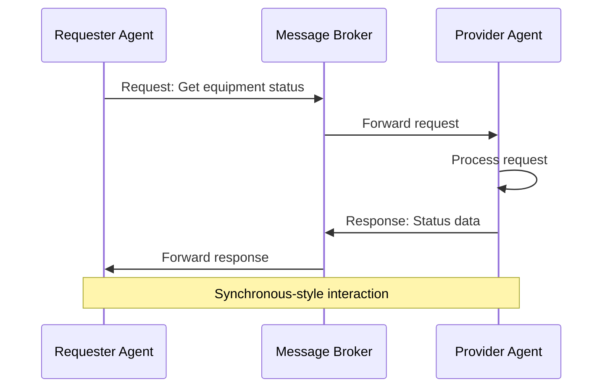
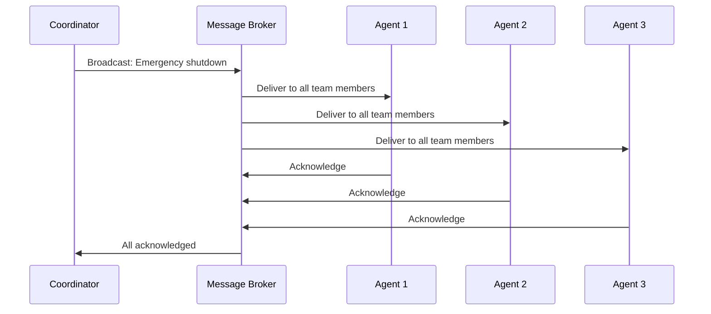

# Communication Framework: Inter-Agent Communication

## Overview

The Communication Framework enables sophisticated inter-agent communication and coordination through industrial-grade messaging protocols. Grounded in distributed systems theory and multi-agent communication research, this capability provides the foundation for reliable information sharing, coordinated action execution, and scalable multi-agent collaboration in industrial operations.

In industrial environments, agents must communicate reliably across distributed systems, coordinate actions in real-time, share observations and insights, and integrate with external systems. The Communication Framework provides the protocols, patterns, and infrastructure for reliable, scalable, and secure inter-agent communication—capabilities that distinguish production-grade multi-agent systems from fragile message-passing implementations.

### Why Communication Framework Matters for MAGS

**The Challenge**: Industrial multi-agent systems require reliable communication across distributed agents, real-time coordination, integration with industrial protocols (MQTT, DDS), and scalable message routing—not just simple message passing.

**The Solution**: Industrial-grade communication protocols, proven message patterns, and distributed messaging infrastructure provide reliable, scalable inter-agent communication.

**The Result**: MAGS agents that communicate reliably, coordinate effectively, integrate seamlessly with industrial systems, and scale to thousands of agents—grounded in decades of distributed systems and industrial communication research.

### Key Business Drivers

1. **Reliability**: Industrial-grade protocols ensure 99.9%+ message delivery
2. **Real-Time Performance**: Sub-second latency for time-critical coordination
3. **Scalability**: Support for thousands of agents and millions of messages/day
4. **Interoperability**: Integration with industrial systems (SCADA, MES, ERP)
5. **Security**: Encrypted, authenticated communication for sensitive operations

---

## Theoretical Foundations

### Message Passing Systems

**Core Concepts**: Distributed agents communicate through structured message exchange

**Key Principles**:
- **Asynchronous Communication**: Agents don't block waiting for responses
- **Decoupling**: Agents don't need direct knowledge of each other
- **Scalability**: Message brokers enable many-to-many communication
- **Reliability**: Message persistence and delivery guarantees

**MAGS Application**:
- Asynchronous agent coordination
- Decoupled agent architecture
- Scalable message routing
- Reliable information sharing

---

### Publish-Subscribe Pattern

**Core Concepts**: Agents publish events to topics; interested agents subscribe

**Key Principles**:
- **Topic-Based Routing**: Messages routed by topic, not destination
- **Many-to-Many**: Multiple publishers, multiple subscribers
- **Dynamic Subscription**: Agents subscribe/unsubscribe dynamically
- **Event-Driven**: Reactive communication based on events

**MAGS Application**:
- Event-driven agent coordination
- Scalable information distribution
- Dynamic agent collaboration
- Loose coupling between agents

---

### Industrial Communication Protocols

**MQTT (Message Queuing Telemetry Transport)**:
- Lightweight, efficient protocol
- Quality of Service (QoS) levels
- Optimized for IoT and high-volume messaging
- Widely adopted in industrial systems

**DDS (Data Distribution Service)**:
- Real-time, data-centric protocol
- Deterministic delivery
- Quality of Service policies
- Mission-critical industrial applications

**MAGS Application**:
- MQTT for high-volume sensor data and observations
- DDS for real-time control and coordination
- Protocol selection based on requirements
- Industrial system integration

---

## What It Does

### Core Capabilities

**Inter-Agent Communication**:
- Point-to-point messaging between agents
- Publish-subscribe event distribution
- Broadcast announcements to teams
- Request-response interactions

**Industrial Protocol Support**:
- MQTT for lightweight, high-volume messaging
- DDS for real-time, deterministic communication
- HTTP/REST for external system integration
- WebSocket for real-time bidirectional communication

**Message Routing and Delivery**:
- Topic-based message routing
- Quality of Service guarantees
- Message persistence and replay
- Dead letter handling

**Interoperability**:
- Integration with external agents ("contractors")
- Protocol translation and bridging
- Standard message formats
- API-based communication

---

## How It Works

### Communication Architecture



### Message Flow Patterns

**Pattern 1: Publish-Subscribe (Event Distribution)**



**Pattern 2: Request-Response (Direct Communication)**



**Pattern 3: Broadcast (Team Coordination)**



---

## Communication Patterns

### Pattern 1: Point-to-Point Communication

**When to Use**:
- Direct agent-to-agent communication
- Request-response interactions
- Targeted information sharing
- Private communication

**Mechanism**:
- Direct addressing by agent ID
- Message delivered to specific agent
- Optional response expected
- Private communication channel

**Example**:
```
Equipment Monitor → Failure Predictor:
  Message: "Request failure prediction for Pump-101"
  Topic: agent.failure-predictor.requests
  Payload: {
    "equipment_id": "Pump-101",
    "current_state": {...},
    "request_id": "req-12345"
  }

Failure Predictor → Equipment Monitor:
  Message: "Failure prediction response"
  Topic: agent.equipment-monitor.responses
  Payload: {
    "request_id": "req-12345",
    "prediction": {
      "failure_probability": 0.85,
      "time_to_failure": "72 hours",
      "confidence": 0.88
    }
  }
```

---

### Pattern 2: Publish-Subscribe (Event Distribution)

**When to Use**:
- Event-driven coordination
- One-to-many information sharing
- Asynchronous notifications
- Scalable distribution

**Mechanism**:
- Publisher publishes to topic
- Multiple subscribers receive
- Asynchronous delivery
- Decoupled communication

**Example**:
```
Equipment Monitor publishes:
  Topic: "equipment.anomaly.detected"
  Payload: {
    "equipment_id": "Pump-101",
    "anomaly_type": "vibration_spike",
    "severity": "high",
    "timestamp": "2025-12-06T10:30:00Z",
    "details": {
      "vibration": 2.5,
      "baseline": 1.8,
      "deviation": "+39%"
    }
  }

Subscribers receive:
  - Failure Predictor: Analyzes for failure prediction
  - Maintenance Planner: Evaluates maintenance need
  - Team Coordinator: Coordinates team response
  - Telemetry System: Logs for analysis
```

---

### Pattern 3: Broadcast (Team Coordination)

**When to Use**:
- Team-wide announcements
- Critical notifications
- Coordination signals
- Emergency communications

**Mechanism**:
- Message sent to all team members
- Guaranteed delivery to all
- Acknowledgment tracking
- High-priority delivery

**Example**:
```
Team Coordinator broadcasts:
  Topic: "team.coordination.emergency"
  Payload: {
    "message_type": "emergency_shutdown",
    "priority": "critical",
    "timestamp": "2025-12-06T10:35:00Z",
    "reason": "Pressure spike detected",
    "required_actions": [
      "Acknowledge receipt",
      "Execute shutdown sequence",
      "Report status"
    ]
  }

All team members:
  - Receive message immediately
  - Acknowledge receipt
  - Execute required actions
  - Report completion status
```

---

### Pattern 4: Request-Response (Synchronous-Style)

**When to Use**:
- Information queries
- Service requests
- Synchronous-style interactions
- Guaranteed responses

**Mechanism**:
- Requester sends request with correlation ID
- Provider processes and responds
- Response matched by correlation ID
- Timeout handling for failures

**Example**:
```
Maintenance Planner requests:
  Topic: "service.resource-coordinator.requests"
  Payload: {
    "correlation_id": "req-67890",
    "request_type": "check_availability",
    "resource": "bearing_SKF-6312",
    "quantity": 1,
    "required_by": "2025-12-06T18:00:00Z"
  }

Resource Coordinator responds:
  Topic: "service.maintenance-planner.responses"
  Payload: {
    "correlation_id": "req-67890",
    "status": "available",
    "details": {
      "location": "Warehouse B",
      "quantity": 2,
      "lead_time": "immediate"
    }
  }
```

---

## Industrial Protocols

### MQTT (Message Queuing Telemetry Transport)

**Characteristics**:
- Lightweight, efficient protocol
- Publish-subscribe model
- Quality of Service (QoS) levels
- Optimized for IoT and high-volume messaging

**QoS Levels**:
- **QoS 0**: At most once (fire and forget)
- **QoS 1**: At least once (acknowledged delivery)
- **QoS 2**: Exactly once (guaranteed delivery)

**MAGS Use Cases**:
- High-volume sensor data ingestion
- Observation sharing among agents
- Event notifications
- Non-critical coordination

**Example**:
```
MQTT Topic Structure:
  mags/plant-01/equipment/pump-101/observations
  mags/plant-01/agents/equipment-monitor/events
  mags/plant-01/team/maintenance/coordination

MQTT Message:
  Topic: mags/plant-01/equipment/pump-101/observations
  QoS: 1 (at least once)
  Payload: {
    "timestamp": "2025-12-06T10:30:00Z",
    "vibration": 2.5,
    "temperature": 75,
    "pressure": 120
  }
```

---

### DDS (Data Distribution Service)

**Characteristics**:
- Real-time, data-centric protocol
- Deterministic delivery
- Quality of Service policies
- Mission-critical industrial applications

**QoS Policies**:
- **Reliability**: Reliable vs. best-effort delivery
- **Durability**: Transient vs. persistent data
- **Deadline**: Maximum time between updates
- **Latency Budget**: Maximum acceptable latency

**MAGS Use Cases**:
- Real-time control coordination
- Time-critical decisions
- Safety-critical communications
- Deterministic agent coordination

**Example**:
```
DDS Topic:
  Name: EquipmentControl
  Type: ControlCommand
  QoS:
    Reliability: RELIABLE
    Durability: TRANSIENT_LOCAL
    Deadline: 100ms
    Latency Budget: 50ms

DDS Message:
  Topic: EquipmentControl
  Data: {
    "equipment_id": "Pump-101",
    "command": "adjust_speed",
    "target_speed": 1500,
    "timestamp": "2025-12-06T10:30:00.123Z"
  }
```

---

## MAGS Implementation

### Message Structure

**Standard Message Format**:
```json
{
  "message_id": "msg-uuid-12345",
  "timestamp": "2025-12-06T10:30:00.000Z",
  "sender": {
    "agent_id": "equipment-monitor-01",
    "agent_type": "EquipmentMonitor",
    "team_id": "maintenance-team-01"
  },
  "message_type": "observation",
  "topic": "equipment.anomaly.detected",
  "priority": "high",
  "payload": {
    "equipment_id": "Pump-101",
    "anomaly_type": "vibration_spike",
    "severity": "high",
    "details": {...}
  },
  "metadata": {
    "correlation_id": "req-67890",
    "reply_to": "agent.equipment-monitor.responses",
    "ttl": 300,
    "qos": 1
  }
}
```

---

### Topic Naming Convention

**Hierarchical Structure**:
```
{domain}/{plant}/{category}/{subcategory}/{action}

Examples:
  mags/plant-01/equipment/pump-101/observations
  mags/plant-01/agents/equipment-monitor/events
  mags/plant-01/team/maintenance/coordination
  mags/plant-01/decisions/consensus/votes
  mags/plant-01/actions/maintenance/scheduled
```

**Topic Categories**:
- **observations**: Sensor data and monitoring
- **events**: Agent-generated events
- **decisions**: Decision-making and consensus
- **actions**: Action execution and coordination
- **coordination**: Team coordination messages
- **telemetry**: System monitoring and metrics

---

### Quality of Service Selection

**QoS Decision Matrix**:

| Message Type | Criticality | QoS Level | Protocol |
|--------------|-------------|-----------|----------|
| Sensor observations | Low | MQTT QoS 0 | MQTT |
| Agent events | Medium | MQTT QoS 1 | MQTT |
| Consensus votes | High | MQTT QoS 2 | MQTT |
| Control commands | Critical | DDS Reliable | DDS |
| Emergency signals | Critical | DDS Reliable | DDS |

**Selection Criteria**:
- **Criticality**: How important is delivery?
- **Latency**: How fast must it arrive?
- **Volume**: How many messages?
- **Reliability**: Can we tolerate loss?

---

## Design Patterns

### Pattern 1: Event-Driven Coordination

**Concept**: Agents react to events published by other agents

**Benefits**:
- Loose coupling between agents
- Scalable coordination
- Asynchronous processing
- Event-driven architecture

**Example**:
```
Event Flow:
  1. Equipment Monitor detects anomaly
  2. Publishes "equipment.anomaly.detected" event
  3. Multiple agents subscribe and react:
     - Failure Predictor: Analyzes failure risk
     - Maintenance Planner: Evaluates maintenance need
     - Team Coordinator: Coordinates response
     - Telemetry: Logs for analysis
  4. Each agent processes independently
  5. Coordinated response emerges from individual actions
```

---

### Pattern 2: Command-Query Separation

**Concept**: Separate commands (actions) from queries (information requests)

**Benefits**:
- Clear intent separation
- Different QoS for commands vs. queries
- Easier testing and debugging
- Better scalability

**Example**:
```
Commands (Actions):
  Topic: commands.equipment.control
  QoS: High (DDS Reliable)
  Example: "Adjust pump speed to 1500 RPM"

Queries (Information):
  Topic: queries.equipment.status
  QoS: Medium (MQTT QoS 1)
  Example: "Get current pump status"
```

---

### Pattern 3: Message Correlation

**Concept**: Track related messages using correlation IDs

**Benefits**:
- Request-response matching
- Conversation tracking
- Distributed tracing
- Audit trail

**Example**:
```
Request:
  correlation_id: "req-12345"
  message: "Predict failure for Pump-101"

Response:
  correlation_id: "req-12345"
  message: "Failure prediction: 72 hours"

Follow-up:
  correlation_id: "req-12345"
  message: "Schedule maintenance based on prediction"
```

---

### Pattern 4: Dead Letter Handling

**Concept**: Handle messages that cannot be delivered

**Benefits**:
- No message loss
- Error visibility
- Retry capability
- System reliability

**Example**:
```
Normal Flow:
  Message → Broker → Agent (success)

Failure Flow:
  Message → Broker → Agent (failure)
  → Retry (3 attempts)
  → Dead Letter Queue
  → Alert human operator
  → Manual intervention
```

---

## Integration with Other Capabilities

### With Consensus Management

**Communication Enables Consensus**:
- Distributes consensus proposals
- Collects agent votes
- Broadcasts consensus decisions
- Coordinates execution

**Example**:
```
Consensus Communication Flow:
  1. Coordinator publishes proposal
     Topic: team.consensus.proposals
  
  2. Agents publish votes
     Topic: team.consensus.votes
  
  3. Coordinator publishes decision
     Topic: team.consensus.decisions
  
  4. Agents acknowledge commitment
     Topic: team.consensus.acknowledgments
```

---

### With Cognitive Intelligence

**Communication Distributes Intelligence**:
- Shares observations and insights
- Distributes memory updates
- Coordinates learning
- Synchronizes knowledge

**Example**:
```
Knowledge Sharing:
  Equipment Monitor observes pattern
  → Publishes to team.knowledge.patterns
  → Other agents learn from observation
  → Collective intelligence improves
```

---

### With Performance Optimization

**Communication Coordinates Optimization**:
- Shares optimization objectives
- Coordinates multi-agent optimization
- Distributes optimal solutions
- Synchronizes execution

---

## Use Cases

### Use Case 1: Distributed Equipment Monitoring

**Scenario**: Multiple agents monitor equipment fleet

**Communication Pattern**: Publish-Subscribe

**Flow**:
```
Equipment Monitors (50 agents):
  Each publishes observations to:
    equipment/{equipment-id}/observations
  
  QoS: MQTT QoS 0 (high volume, best effort)
  Frequency: Every 10 seconds
  Volume: 5 messages/second × 50 agents = 250 msg/sec

Subscribers:
  - Failure Predictor: Subscribes to all equipment
  - Maintenance Planner: Subscribes to critical equipment
  - Telemetry System: Subscribes to all for logging
  - Dashboard: Subscribes to all for visualization

Benefits:
  - Scalable to hundreds of equipment
  - Decoupled monitoring and analysis
  - Multiple consumers of same data
  - Efficient message distribution
```

---

### Use Case 2: Real-Time Process Control

**Scenario**: Agents coordinate real-time process adjustments

**Communication Pattern**: DDS for deterministic delivery

**Flow**:
```
Process Control Coordination:
  Process Agent detects deviation
  → Publishes control command (DDS)
  → Equipment Agent receives (< 50ms)
  → Executes adjustment
  → Publishes confirmation (DDS)
  → Process Agent verifies (< 100ms)

DDS QoS:
  Reliability: RELIABLE
  Deadline: 100ms
  Latency Budget: 50ms

Benefits:
  - Deterministic delivery
  - Real-time performance
  - Guaranteed coordination
  - Mission-critical reliability
```

---

### Use Case 3: Multi-Agent Problem Solving

**Scenario**: Team of agents collaborates on root cause analysis

**Communication Pattern**: Mixed (Pub-Sub + Request-Response)

**Flow**:
```
Root Cause Analysis Communication:
  1. Coordinator broadcasts problem
     Topic: team.problems.new
     Pattern: Broadcast
  
  2. Agents publish hypotheses
     Topic: team.hypotheses.proposed
     Pattern: Publish-Subscribe
  
  3. Agents request data from each other
     Pattern: Request-Response
  
  4. Agents vote on root cause
     Topic: team.consensus.votes
     Pattern: Publish-Subscribe
  
  5. Coordinator publishes conclusion
     Topic: team.conclusions.final
     Pattern: Broadcast

Benefits:
  - Flexible collaboration
  - Multiple communication patterns
  - Coordinated problem solving
  - Transparent process
```

---

### Use Case 4: External System Integration

**Scenario**: MAGS agents integrate with external systems

**Communication Pattern**: Protocol bridging

**Flow**:
```
External Integration:
  SCADA System (MQTT)
    ↓
  MQTT Bridge
    ↓
  MAGS Message Broker
    ↓
  MAGS Agents

  MAGS Agents
    ↓
  MAGS Message Broker
    ↓
  REST API Bridge
    ↓
  ERP System (HTTP/REST)

Benefits:
  - Seamless integration
  - Protocol translation
  - Unified communication
  - Interoperability
```

---

## Measuring Success

### Communication Performance Metrics

```
Message Delivery Rate:
  Target: >99.9% for critical messages
  Measurement: (Delivered / Sent) × 100%

Message Latency:
  Target: <100ms for real-time messages
  Target: <1s for routine messages
  Measurement: Time from publish to delivery

Throughput:
  Target: >10,000 messages/second
  Measurement: Messages processed per second

System Availability:
  Target: >99.95% uptime
  Measurement: (Uptime / Total time) × 100%
```

### Communication Quality Metrics

```
Message Loss Rate:
  Target: <0.1% for critical messages
  Measurement: (Lost / Sent) × 100%

Duplicate Rate:
  Target: <0.01%
  Measurement: (Duplicates / Delivered) × 100%

Out-of-Order Rate:
  Target: <1% for ordered topics
  Measurement: (Out-of-order / Delivered) × 100%
```

---

## Related Documentation

### Core Concepts
- [Agent Messaging](../concepts/agent-messaging.md) - Message patterns and protocols
- [ORPA Cycle](../concepts/orpa-cycle.md) - Communication in decision cycle

### Research Foundations
- [Multi-Agent Systems](../research-foundations/multi-agent-systems.md) - Communication theory
- [Distributed Systems](../research-foundations/distributed-systems.md) - Distributed communication
- [Information Theory](../research-foundations/information-theory.md) - Information transmission

### Decision Orchestration
- [Consensus Management](consensus-management.md) - Consensus communication
- [Agent Lifecycle & Governance](agent-lifecycle-governance.md) - State communication
- [Decision Orchestration Overview](README.md) - Category overview

### Architecture
- [System Components](../architecture/system-components.md) - Communication infrastructure
- [Data Architecture](../architecture/data-architecture.md) - Data communication

### Use Cases
- All use cases demonstrate inter-agent communication

---

## References

### Distributed Systems

**Message Passing**:
- Tanenbaum, A. S., & Van Steen, M. (2017). "Distributed Systems" (3rd ed.). Pearson
- Coulouris, G., et al. (2011). "Distributed Systems: Concepts and Design" (5th ed.). Addison-Wesley

**Publish-Subscribe Systems**:
- Eugster, P. T., et al. (2003). "The many faces of publish/subscribe". ACM Computing Surveys, 35(2), 114-131
- Baldoni, R., et al. (2007). "Content-Based Publish-Subscribe over Structured Overlay Networks". In Proceedings of ICDCS

### Industrial Protocols

**MQTT**:
- Banks, A., & Gupta, R. (2014). "MQTT Version 3.1.1". OASIS Standard
- Hunkeler, U., et al. (2008). "MQTT-S—A publish/subscribe protocol for Wireless Sensor Networks". In Proceedings of COMSWARE

**DDS**:
- Object Management Group (2015). "Data Distribution Service (DDS) Version 1.4". OMG Specification
- Pardo-Castellote, G. (2003). "OMG Data-Distribution Service: architectural overview". In Proceedings of ICDCS Workshops

### Multi-Agent Communication

**Agent Communication Languages**:
- FIPA (2002). "FIPA ACL Message Structure Specification". Foundation for Intelligent Physical Agents
- Labrou, Y., et al. (1999). "Agent Communication Languages: The Current Landscape". IEEE Intelligent Systems, 14(2), 45-52

**Coordination Protocols**:
- Jennings, N. R. (1996). "Coordination techniques for distributed artificial intelligence". In Foundations of Distributed Artificial Intelligence. John Wiley & Sons
- Wooldridge, M. (2009). "An Introduction to MultiAgent Systems" (2nd ed.). John Wiley & Sons

### Industrial Applications

**Industrial IoT Communication**:
- Sisinni, E., et al. (2018). "Industrial Internet of Things: Challenges, Opportunities, and Directions". IEEE Transactions on Industrial Informatics, 14(11), 4724-4734
- Wollschlaeger, M., et al. (2017). "The Future of Industrial Communication". IEEE Industrial Electronics Magazine, 11(1), 17-27

---

**Document Version**: 2.0  
**Last Updated**: December 6, 2025  
**Status**: ✅ Enhanced to Comprehensive Quality Standard