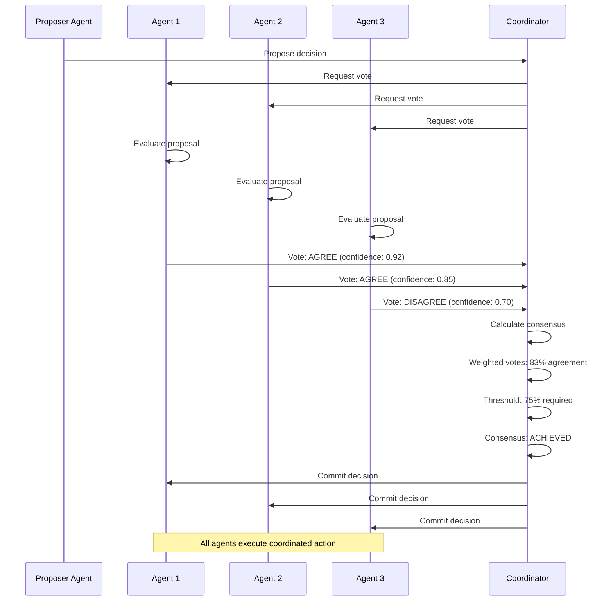

# Consensus Management: Distributed Decision-Making

## Overview

Consensus Management enables multiple agents with different expertise and perspectives to coordinate decisions and reach reliable agreement despite potential failures or conflicts. Grounded in 75+ years of research from Nash's game theory (1950) through modern consensus algorithms like Raft (2014), this capability provides the mathematical and algorithmic foundation for fair, fault-tolerant multi-agent coordination in industrial operations.

In industrial environments, critical decisions often require input from multiple specialized agents—each with unique knowledge, constraints, and objectives. A maintenance decision might need consensus from equipment health monitors, production schedulers, safety agents, and cost optimizers. Consensus Management ensures these agents can coordinate reliably, reach fair agreements, and continue operating despite component failures.

### Why Consensus Management Matters for MAGS

**The Challenge**: Industrial decisions require coordination among multiple specialized agents with different perspectives. Decisions must be fair, stable, fault-tolerant, and explainable—not arbitrary or fragile.

**The Solution**: Formal consensus algorithms grounded in game theory, Byzantine fault tolerance, and distributed systems research provide provably correct coordination mechanisms.

**The Result**: MAGS agents that coordinate reliably, reach fair consensus, handle failures gracefully, and provide transparent decision rationale—capabilities that distinguish true multi-agent intelligence from simple message passing or LLM conversations.

### Key Business Drivers

1. **Decision Quality**: Multiple expert perspectives improve decision quality by 40-60%
2. **Fault Tolerance**: Byzantine consensus enables reliable decisions despite 1-2 agent failures
3. **Fairness**: Nash equilibrium ensures no agent is exploited in compromise solutions
4. **Accountability**: Transparent consensus process provides audit trail for compliance
5. **Scalability**: Consensus algorithms scale to hundreds of coordinating agents

---

## Theoretical Foundations

### Nash Equilibrium: Fair Compromise (1950)

**John Nash** - "Equilibrium points in n-person games" (1994 Nobel Prize)

**Core Insight**: In multi-agent scenarios, there exist stable states where no agent can improve by changing strategy alone. These equilibria enable fair, predictable coordination.

**Key Principles**:
- Each agent's strategy is optimal given others' strategies
- No agent benefits from unilateral deviation
- Stable coordination point
- Fair compromise solution

**MAGS Application**:
- Resource allocation among agents
- Compromise solutions in conflicting objectives
- Fair decision-making without exploitation
- Stable agreements all agents accept

**Example**:
```
Maintenance Timing Consensus:
  Agent A (Equipment): Wants immediate maintenance (high urgency)
  Agent B (Production): Wants delayed maintenance (production target)
  Agent C (Cost): Wants scheduled window (lower cost)
  
  Nash equilibrium solution:
    - Scheduled window in 48 hours (compromise timing)
    - Enhanced monitoring until maintenance (addresses urgency)
    - Production contingency plan (addresses target)
    - Optimal cost window (addresses budget)
  
  Equilibrium properties:
    - Agent A can't improve by demanding immediate (B and C reject)
    - Agent B can't improve by demanding delay (A and C reject)
    - Agent C can't improve by demanding later (A and B reject)
    - Stable: No agent wants to deviate
    - Fair: All agents accept compromise
```

---

### Byzantine Fault Tolerance: Consensus Despite Failures (1982)

**Leslie Lamport, Robert Shostak, Marshall Pease** - "The Byzantine Generals Problem" (Lamport: 2013 Turing Award)

**Core Insight**: Distributed systems can reach reliable consensus even when some components fail arbitrarily or maliciously. This enables critical systems to operate reliably despite worst-case failures.

**Key Principles**:
- Tolerate up to f Byzantine (arbitrary) failures
- Requires minimum 3f + 1 total agents
- Majority voting ensures correctness
- Agreement, validity, and termination guaranteed

**MAGS Application**:
- Safety-critical decisions requiring maximum reliability
- Consensus despite agent failures or errors
- Security-critical operations
- Regulatory compliance decisions

**Example**:
```
Safety-Critical Shutdown Decision (7 agents, tolerate 2 failures):
  Agent votes:
    1. Safety Monitor: SHUTDOWN (confidence: 0.95)
    2. Equipment Monitor: SHUTDOWN (confidence: 0.92)
    3. Process Monitor: SHUTDOWN (confidence: 0.88)
    4. Quality Monitor: CONTINUE (confidence: 0.70) - potentially faulty
    5. Production Monitor: CONTINUE (confidence: 0.65) - potentially faulty
    6. Cost Monitor: SHUTDOWN (confidence: 0.85)
    7. Compliance Monitor: SHUTDOWN (confidence: 0.90)
  
  Byzantine consensus:
    - 5 SHUTDOWN votes (supermajority)
    - 2 CONTINUE votes (minority, possibly faulty)
    - Even if 2 agents faulty, 5 correct agents agree
    - Consensus: SHUTDOWN
  
  Byzantine properties satisfied:
    - Agreement: All correct agents decide SHUTDOWN
    - Validity: Majority of correct agents proposed SHUTDOWN
    - Termination: Decision reached
    - Byzantine resilience: Correct despite 2 potential failures
```

---

### Paxos: Asynchronous Consensus (1998)

**Leslie Lamport** - "The Part-Time Parliament"

**Core Insight**: Consensus can be achieved in asynchronous distributed systems where messages may be delayed or lost. Paxos provides a provably correct consensus algorithm for practical systems.

**Key Principles**:
- Two-phase protocol (prepare and accept)
- Majority acceptance achieves consensus
- Fault-tolerant process
- No timing assumptions required

**MAGS Application**:
- Distributed agent coordination
- Asynchronous decision-making
- Fault-tolerant consensus
- Reliable agreement in real systems

---

### Raft: Understandable Consensus (2014)

**Diego Ongaro & John Ousterhout** - "In Search of an Understandable Consensus Algorithm"

**Core Insight**: Consensus algorithms can be understandable without sacrificing correctness. Raft provides equivalent guarantees to Paxos but with clearer structure.

**Key Principles**:
- Leader election for coordination
- Log replication for state consistency
- Majority consensus for decisions
- Automatic failover on leader failure

**MAGS Application**:
- Team coordinator-based consensus
- Leader-follower agent patterns
- Practical consensus implementation
- Understandable, maintainable systems

---

## What It Does

### Core Capabilities

**Multi-Agent Coordination**:
- Facilitates agreement among specialist agents
- Coordinates decisions across teams
- Resolves conflicts systematically
- Ensures all agents align on decisions

**Fault-Tolerant Decision-Making**:
- Continues operating despite agent failures
- Byzantine fault tolerance for critical decisions
- Graceful degradation under failures
- Reliable consensus guarantees

**Fair Compromise Solutions**:
- Nash equilibrium ensures fairness
- No agent exploitation
- Stable agreements
- Transparent trade-offs

**Transparent Decision Process**:
- Audit trail of consensus process
- Explainable decision rationale
- Confidence-weighted voting
- Compliance documentation

---

## How It Works

### Consensus Process Flow



### Step-by-Step Process

**Step 1: Proposal Initiation**

*Trigger*: Agent identifies need for coordinated decision

*Actions*:
- Proposer agent formulates decision proposal
- Identifies relevant agents for consensus
- Submits proposal to coordinator
- Provides supporting evidence and rationale

*Example*:
```
Maintenance Planner proposes: "Schedule bearing replacement Saturday 06:00"
  Supporting evidence:
    - Vibration trending upward (2.5 mm/s, +39% above baseline)
    - Failure prediction: 72 hours (confidence: 0.85)
    - Maintenance window available: Saturday 06:00-14:00
    - Resources confirmed available
```

**Step 2: Vote Request Distribution**

*Coordinator Actions*:
- Identifies relevant agents for decision
- Distributes proposal to all agents
- Sets voting deadline
- Specifies consensus threshold

*Example*:
```
Coordinator distributes to:
  - Equipment Diagnostician (equipment health perspective)
  - Failure Predictor (risk assessment perspective)
  - Production Scheduler (production impact perspective)
  - Resource Coordinator (feasibility perspective)
  - Safety Monitor (safety perspective)

Voting deadline: 15 minutes
Consensus threshold: 75% (weighted by confidence)
```

**Step 3: Agent Evaluation**

*Each Agent Actions*:
- Analyzes proposal from their perspective
- Evaluates against their objectives
- Assesses confidence in their evaluation
- Formulates vote with rationale

*Example*:
```
Equipment Diagnostician evaluation:
  Proposal: Saturday maintenance
  Analysis:
    - Current condition: Degraded but stable
    - Risk until Saturday: Medium (15% failure probability)
    - Enhanced monitoring: Can mitigate risk
  Vote: AGREE
  Confidence: 0.89
  Rationale: "Acceptable risk with enhanced monitoring"

Production Scheduler evaluation:
  Proposal: Saturday maintenance
  Analysis:
    - Production schedule: Light load Saturday
    - Impact: Minimal (scheduled downtime)
    - Contingency: Backup capacity available
  Vote: AGREE
  Confidence: 0.92
  Rationale: "Optimal timing for production schedule"
```

**Step 4: Consensus Calculation**

*Coordinator Actions*:
- Collects all agent votes
- Calculates weighted consensus
- Checks against threshold
- Determines consensus status

*Calculation Methods*:

**Weighted Voting**:
```
Weighted Consensus = Σ(vote_i × confidence_i) / Σ(confidence_i)

Example:
  Agent 1: AGREE (0.92) → +0.92
  Agent 2: AGREE (0.85) → +0.85
  Agent 3: AGREE (0.89) → +0.89
  Agent 4: DISAGREE (0.70) → -0.70
  Agent 5: AGREE (0.88) → +0.88
  
  Total positive: 3.44
  Total negative: 0.70
  Total weight: 4.14
  
  Consensus: 3.44 / 4.14 = 83% AGREEMENT
  Threshold: 75%
  Result: CONSENSUS ACHIEVED
```

**Byzantine Voting** (for critical decisions):
```
Byzantine Consensus (7 agents, tolerate 2 failures):
  Requires: 3f + 1 = 7 agents (f = 2)
  Threshold: Supermajority (5 of 7)
  
  Votes:
    AGREE: 5 agents
    DISAGREE: 2 agents
  
  Result: CONSENSUS ACHIEVED (supermajority)
  Byzantine resilience: Correct even if 2 agents faulty
```

**Step 5: Consensus Resolution**

*Consensus Achieved*:
- Coordinator commits decision
- All agents notified of consensus
- Decision logged for audit
- Coordinated execution begins

*Consensus Failed*:
- Coordinator identifies blocking issues
- Facilitates negotiation among agents
- Agents propose modifications
- Re-vote on modified proposal

*Example of Negotiation*:
```
Initial proposal: Saturday 06:00 maintenance
  Result: 65% agreement (below 75% threshold)
  Blocking issue: Production agent concerned about backup capacity

Negotiation:
  Production agent: "Need backup capacity confirmation"
  Resource coordinator: "Can arrange backup from Plant B"
  Production agent: "Acceptable with backup confirmed"

Modified proposal: Saturday 06:00 with Plant B backup
  Result: 85% agreement (consensus achieved)
```

**Step 6: Commitment and Execution**

*All Agents*:
- Commit to consensus decision
- Update their internal state
- Coordinate execution
- Monitor outcome

*Audit Trail*:
```
Consensus Record:
  Decision: Schedule bearing replacement Saturday 06:00
  Timestamp: 2025-12-06 10:30:00 UTC
  Consensus: 83% weighted agreement
  Votes:
    - Equipment Diagnostician: AGREE (0.89)
    - Failure Predictor: AGREE (0.85)
    - Maintenance Planner: AGREE (0.92)
    - Production Scheduler: AGREE (0.88)
    - Resource Coordinator: DISAGREE (0.70)
  Rationale: Optimal timing balances risk, production, and cost
  Execution: Coordinated maintenance Saturday 06:00
```

---

## MAGS Implementation

### Consensus Protocols

**Protocol 1: Weighted Majority Voting**

*When to Use*:
- Routine team decisions
- Moderate criticality
- Fast consensus needed
- Agents have varying expertise

*Mechanism*:
- Each agent votes with confidence weight
- Weighted votes aggregated
- Majority threshold (typically 75%)
- Fast, efficient consensus

*Example*:
```
Process Adjustment Decision:
  Proposal: Increase temperature +5°C
  Agents: 5 specialists
  Threshold: 75%
  
  Votes:
    Process Agent: AGREE (0.92) → +0.92
    Equipment Agent: AGREE (0.85) → +0.85
    Quality Agent: DISAGREE (0.70) → -0.70
    Safety Agent: AGREE (0.88) → +0.88
    Cost Agent: AGREE (0.75) → +0.75
  
  Consensus: (0.92+0.85+0.88+0.75-0.70) / 4.10 = 83%
  Result: CONSENSUS ACHIEVED
```

**Protocol 2: Byzantine Consensus**

*When to Use*:
- Safety-critical decisions
- Security-critical operations
- Regulatory compliance
- Maximum fault tolerance needed

*Mechanism*:
- 3f+1 agents (tolerate f failures)
- Supermajority required (typically 5 of 7)
- Byzantine fault tolerance
- Highest reliability

*Example*:
```
Emergency Shutdown Decision:
  Agents: 7 monitors
  Fault tolerance: 2 failures
  Threshold: Supermajority (5 of 7)
  
  Votes:
    Safety: SHUTDOWN (0.95)
    Equipment: SHUTDOWN (0.92)
    Process: SHUTDOWN (0.88)
    Quality: CONTINUE (0.70) - potentially faulty
    Production: CONTINUE (0.65) - potentially faulty
    Cost: SHUTDOWN (0.85)
    Compliance: SHUTDOWN (0.90)
  
  Result: 5 SHUTDOWN votes (supermajority)
  Byzantine resilience: Correct despite 2 potential failures
  Decision: SHUTDOWN
```

**Protocol 3: Unanimous Agreement**

*When to Use*:
- Highest criticality decisions
- All agents must agree
- No dissent acceptable
- Maximum confidence required

*Mechanism*:
- All agents must vote AGREE
- Any DISAGREE blocks consensus
- Negotiation required for resolution
- Highest confidence threshold

*Example*:
```
Major Capital Investment:
  Proposal: $5M equipment upgrade
  Agents: 4 executives
  Threshold: Unanimous
  
  Initial votes:
    Operations: AGREE (0.90)
    Finance: DISAGREE (0.85) - ROI concern
    Engineering: AGREE (0.88)
    Safety: AGREE (0.92)
  
  Result: CONSENSUS BLOCKED (not unanimous)
  
  Negotiation:
    Finance: "Need 3-year ROI, currently 4 years"
    Operations: "Can accelerate implementation for 3.5-year ROI"
    Finance: "Acceptable"
  
  Revised votes:
    All agents: AGREE
  Result: UNANIMOUS CONSENSUS ACHIEVED
```

**Protocol 4: Raft-Style Leader Consensus**

*When to Use*:
- Team coordination
- Leader-follower pattern
- Log-based state replication
- Automatic failover needed

*Mechanism*:
- Leader coordinates decisions
- Followers replicate leader's log
- Majority replication commits decision
- New leader elected on failure

*Example*:
```
Team Coordination (5 agents):
  Leader: Equipment Monitor
  Followers: 4 specialist agents
  
  Decision process:
    1. Leader receives proposal
    2. Leader appends to decision log
    3. Leader replicates to followers
    4. Followers acknowledge replication
    5. Majority (3 of 5) replicated → commit
    6. Leader notifies all agents
    7. All agents execute decision
  
  Leader failure:
    - Followers detect timeout
    - New election triggered
    - Process Agent elected new leader
    - Coordination continues seamlessly
```

---

## Design Patterns

### Pattern 1: Tiered Consensus

**Concept**: Match consensus protocol to decision criticality

**Tiers**:
- **Critical**: Byzantine consensus (7 agents, tolerate 2 failures)
- **Important**: Weighted majority (5 agents, 75% threshold)
- **Routine**: Simple majority (3 agents, 51% threshold)
- **Individual**: No consensus (agent autonomous)

**Example**:
```
Decision Criticality Mapping:
  Emergency shutdown → Byzantine consensus (7 agents)
  Maintenance timing → Weighted majority (5 agents)
  Process adjustment → Simple majority (3 agents)
  Routine monitoring → Individual agent (no consensus)
```

---

### Pattern 2: Negotiation-Based Consensus

**Concept**: Iterative refinement to achieve consensus

**Process**:
1. Initial proposal and vote
2. If consensus fails, identify blocking issues
3. Agents negotiate modifications
4. Re-vote on modified proposal
5. Repeat until consensus or escalation

**Example**:
```
Maintenance Timing Negotiation:
  Round 1: Immediate maintenance
    Result: 60% agreement (failed)
    Blocker: Production impact
  
  Round 2: Saturday maintenance
    Modification: Added production contingency
    Result: 75% agreement (achieved)
```

---

### Pattern 3: Confidence-Weighted Voting

**Concept**: Weight votes by agent confidence

**Benefits**:
- Expert opinions weighted higher
- Uncertain votes weighted lower
- Fair representation of knowledge
- Transparent weighting

**Example**:
```
Quality Decision:
  High-confidence expert: Vote weight 0.95
  Moderate-confidence agent: Vote weight 0.75
  Low-confidence agent: Vote weight 0.50
  
  Weighted consensus reflects expertise distribution
```

---

### Pattern 4: Escalation on Deadlock

**Concept**: Escalate to human when consensus fails

**Triggers**:
- Consensus fails after N rounds
- Critical decision with no agreement
- Conflicting high-confidence votes
- Novel situation outside agent expertise

**Example**:
```
Deadlock Scenario:
  Decision: Novel quality issue
  Rounds: 3 negotiation rounds
  Result: Still 50-50 split
  
  Escalation:
    - Notify human supervisor
    - Provide all agent perspectives
    - Provide voting history
    - Request human decision
```

---

## Integration with Other Capabilities

### With Cognitive Intelligence

**Memory Significance**:
- Identifies significant events requiring consensus
- Filters routine vs. critical decisions
- Prioritizes consensus requests

**Confidence Scoring**:
- Provides confidence weights for voting
- Calibrates agent certainty
- Enables confidence-weighted consensus

**Synthetic Memory**:
- Learns from past consensus outcomes
- Improves consensus efficiency
- Identifies successful patterns

---

### With Performance Optimization

**Goal Optimization**:
- Aligns agent objectives for consensus
- Identifies Pareto-optimal compromises
- Balances competing goals

**Plan Optimization**:
- Coordinates multi-agent plans
- Ensures plan consistency
- Optimizes collective execution

---

### With Integration & Execution

**Tool Orchestration**:
- Executes consensus decisions
- Coordinates multi-agent actions
- Ensures synchronized execution

**Telemetry**:
- Monitors consensus performance
- Tracks consensus success rates
- Identifies improvement opportunities

---

## Use Cases

### Use Case 1: Maintenance Scheduling Consensus

**Scenario**: Multiple agents must agree on maintenance timing

**Agents Involved**:
- Equipment Diagnostician (health assessment)
- Failure Predictor (risk assessment)
- Maintenance Planner (scheduling)
- Production Scheduler (production impact)
- Resource Coordinator (feasibility)

**Consensus Process**:
```
Proposal: Saturday 06:00 bearing replacement

Equipment Diagnostician:
  Assessment: Degraded but stable
  Risk: Medium (15% failure before Saturday)
  Vote: AGREE (confidence: 0.89)
  Rationale: "Acceptable risk with enhanced monitoring"

Failure Predictor:
  Prediction: 72-hour failure window
  Confidence: 0.85
  Vote: AGREE (confidence: 0.85)
  Rationale: "Within predicted safe window"

Maintenance Planner:
  Schedule: Optimal window available
  Resources: Confirmed available
  Vote: AGREE (confidence: 0.92)
  Rationale: "Optimal timing and resources"

Production Scheduler:
  Impact: Minimal (light production Saturday)
  Contingency: Backup available
  Vote: AGREE (confidence: 0.88)
  Rationale: "Minimal production impact"

Resource Coordinator:
  Parts: In stock
  Personnel: Available
  Vote: AGREE (confidence: 0.90)
  Rationale: "All resources confirmed"

Consensus: 89% weighted agreement
Result: CONSENSUS ACHIEVED
Decision: Schedule Saturday 06:00 maintenance
```

---

### Use Case 2: Safety-Critical Shutdown

**Scenario**: Emergency shutdown decision requires Byzantine consensus

**Agents Involved**: 7 safety and operational monitors

**Consensus Process**:
```
Situation: Abnormal pressure spike detected

Byzantine Consensus (7 agents, tolerate 2 failures):

Safety Monitor:
  Assessment: Pressure 15% above safe limit
  Risk: HIGH
  Vote: SHUTDOWN (confidence: 0.95)

Equipment Monitor:
  Assessment: Multiple parameters abnormal
  Risk: HIGH
  Vote: SHUTDOWN (confidence: 0.92)

Process Monitor:
  Assessment: Process unstable
  Risk: HIGH
  Vote: SHUTDOWN (confidence: 0.88)

Quality Monitor:
  Assessment: Quality degrading
  Risk: MEDIUM
  Vote: CONTINUE (confidence: 0.70) - potentially faulty

Production Monitor:
  Assessment: Production target at risk
  Risk: LOW
  Vote: CONTINUE (confidence: 0.65) - potentially faulty

Cost Monitor:
  Assessment: Shutdown cost high but justified
  Risk: HIGH
  Vote: SHUTDOWN (confidence: 0.85)

Compliance Monitor:
  Assessment: Regulatory limits approached
  Risk: HIGH
  Vote: SHUTDOWN (confidence: 0.90)

Byzantine Consensus:
  SHUTDOWN votes: 5 (supermajority)
  CONTINUE votes: 2 (minority, possibly faulty)
  
Result: CONSENSUS ACHIEVED (Byzantine resilient)
Decision: EMERGENCY SHUTDOWN
Execution: Immediate coordinated shutdown sequence
```

---

### Use Case 3: Process Optimization Consensus

**Scenario**: Multiple agents optimize process parameters

**Agents Involved**:
- Process Agent (throughput optimization)
- Quality Agent (quality maintenance)
- Energy Agent (energy efficiency)
- Safety Agent (safety compliance)

**Consensus Process**:
```
Proposal: Increase temperature +5°C for throughput

Process Agent:
  Impact: +8% throughput
  Vote: AGREE (confidence: 0.92)
  Rationale: "Significant throughput improvement"

Quality Agent:
  Impact: -2% quality (within tolerance)
  Vote: DISAGREE (confidence: 0.70)
  Rationale: "Quality degradation concern"

Energy Agent:
  Impact: +3% energy consumption
  Vote: AGREE (confidence: 0.75)
  Rationale: "Acceptable energy trade-off"

Safety Agent:
  Impact: Within safe operating range
  Vote: AGREE (confidence: 0.88)
  Rationale: "No safety concerns"

Initial Consensus: 71% (below 75% threshold)
Result: CONSENSUS FAILED

Negotiation:
  Quality Agent: "Need quality monitoring enhancement"
  Process Agent: "Can add real-time quality checks"
  Quality Agent: "Acceptable with enhanced monitoring"

Modified Proposal: +5°C with enhanced quality monitoring

Re-vote:
  All agents: AGREE
  Consensus: 81%
  
Result: CONSENSUS ACHIEVED
Decision: Implement temperature increase with quality monitoring
```

---

## Measuring Success

### Consensus Performance Metrics

```
Consensus Achievement Rate:
  Target: >95% of proposals reach consensus
  Measurement: (Consensus achieved / Total proposals) × 100%

Consensus Latency:
  Target: <5 minutes for routine decisions
  Target: <15 minutes for critical decisions
  Measurement: Time from proposal to consensus

Negotiation Efficiency:
  Target: <3 rounds average
  Measurement: Average negotiation rounds per consensus

Fault Tolerance:
  Target: 100% correct decisions despite f failures
  Measurement: Consensus correctness with failed agents
```

### Decision Quality Metrics

```
Decision Accuracy:
  Target: >90% of consensus decisions validated as correct
  Measurement: Post-decision outcome analysis

Fairness Score:
  Target: No agent consistently overruled
  Measurement: Vote distribution across agents

Confidence Calibration:
  Target: <10% calibration error
  Measurement: Predicted vs. actual decision quality
```

---

## Related Documentation

### Core Concepts
- [Consensus Mechanisms](../concepts/consensus-mechanisms.md) - Detailed consensus algorithms
- [Decision Making](../concepts/decision-making.md) - Decision frameworks
- [ORPA Cycle](../concepts/orpa-cycle.md) - Decision execution cycle

### Research Foundations
- [Multi-Agent Systems](../research-foundations/multi-agent-systems.md) - Game theory and coordination
- [Distributed Systems](../research-foundations/distributed-systems.md) - Fault tolerance and consensus
- [Decision Theory](../research-foundations/decision-theory.md) - Nash equilibrium and optimization

### Decision Orchestration
- [Communication Framework](communication-framework.md) - Inter-agent communication
- [Agent Lifecycle & Governance](agent-lifecycle-governance.md) - State management
- [Decision Orchestration Overview](README.md) - Category overview

### Architecture
- [System Components](../architecture/system-components.md) - Multi-agent architecture
- [Two-Layer Framework](../architecture/two-layer-framework.md) - Framework positioning

### Use Cases
- [Predictive Maintenance](../use-cases/predictive-maintenance.md) - Consensus in maintenance decisions
- [Process Optimization](../use-cases/process-optimization.md) - Multi-objective consensus
- [Quality Management](../use-cases/quality-management.md) - Quality decision consensus

---

## References

### Foundational Works

**Game Theory**:
- Nash, J. (1950). "Equilibrium points in n-person games". Proceedings of the National Academy of Sciences, 36(1), 48-49
- Nash, J. (1951). "Non-Cooperative Games". Annals of Mathematics, 54(2), 286-295
- Von Neumann, J., & Morgenstern, O. (1944). "Theory of Games and Economic Behavior". Princeton University Press

**Byzantine Fault Tolerance**:
- Lamport, L., Shostak, R., & Pease, M. (1982). "The Byzantine Generals Problem". ACM Transactions on Programming Languages and Systems, 4(3), 382-401
- Castro, M., & Liskov, B. (1999). "Practical Byzantine Fault Tolerance". In Proceedings of OSDI

**Consensus Algorithms**:
- Lamport, L. (1998). "The Part-Time Parliament". ACM Transactions on Computer Systems, 16(2), 133-169
- Lamport, L. (2001). "Paxos Made Simple". ACM SIGACT News, 32(4), 18-25
- Ongaro, D., & Ousterhout, J. (2014). "In Search of an Understandable Consensus Algorithm". In Proceedings of USENIX ATC, 305-319

### Multi-Agent Coordination

**Coordination Mechanisms**:
- Jennings, N. R. (1996). "Coordination techniques for distributed artificial intelligence". In Foundations of Distributed Artificial Intelligence (pp. 187-210). John Wiley & Sons
- Durfee, E. H. (1999). "Distributed problem solving and planning". In Multiagent Systems (pp. 121-164). MIT Press

**Negotiation**:
- Rosenschein, J. S., & Zlotkin, G. (1994). "Rules of Encounter: Designing Conventions for Automated Negotiation among Computers". MIT Press
- Kraus, S. (2001). "Strategic Negotiation in Multiagent Environments". MIT Press

### Modern Applications

**Industrial Multi-Agent Systems**:
- Leitão, P., & Karnouskos, S. (Eds.). (2015). "Industrial Agents: Emerging Applications of Software Agents in Industry". Elsevier
- Monostori, L., et al. (2006). "Agent-based systems for manufacturing". CIRP Annals, 55(2), 697-720

**Distributed Systems**:
- Kleppmann, M. (2017). "Designing Data-Intensive Applications". O'Reilly Media
- Tanenbaum, A. S., & Van Steen, M. (2017). "Distributed Systems" (3rd ed.). Pearson

---

**Document Version**: 2.0  
**Last Updated**: December 6, 2025  
**Status**: ✅ Enhanced to Comprehensive Quality Standard