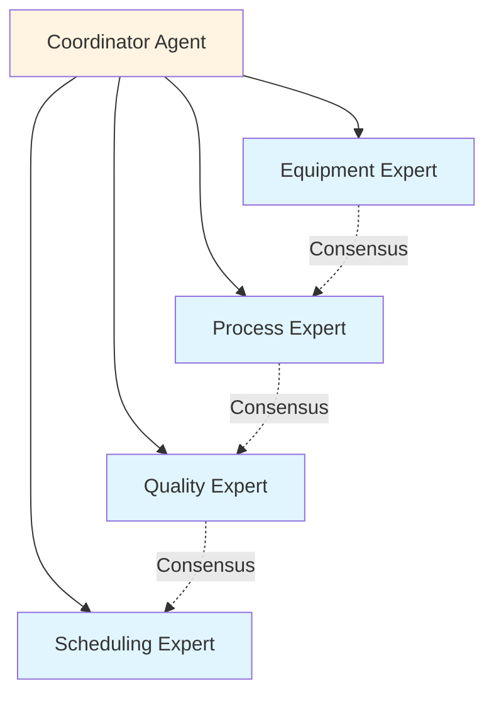
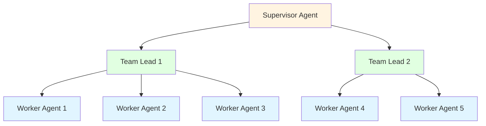
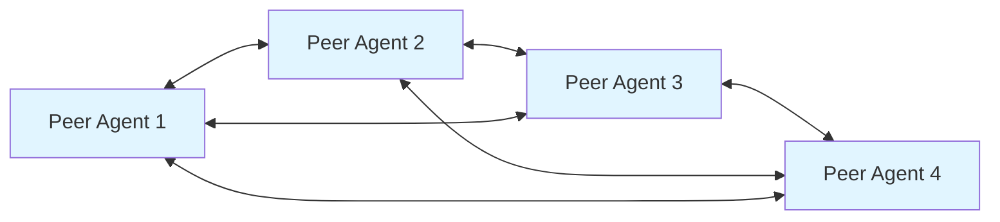
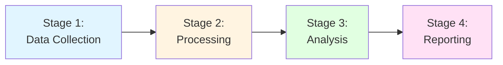
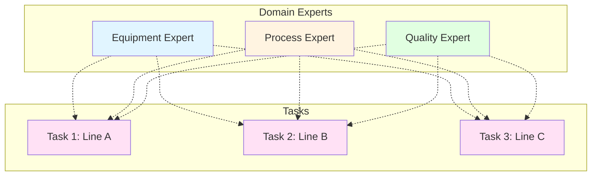

# Agent Team Patterns: Building Effective Teams

## Overview

Agent team patterns provide proven approaches for composing and coordinating multi-agent teams for different industrial scenarios. These patterns distill lessons from industrial deployments into reusable team structures that balance specialization, coordination, and scalability.

Effective team composition is critical for MAGS success—the right team structure can dramatically improve outcomes while poor composition leads to coordination overhead and suboptimal results.

### Why Team Patterns Matter

**The Challenge**: Industrial problems are complex and multifaceted, requiring diverse expertise that no single agent possesses.

**The Solution**: Proven team patterns that combine specialized agents effectively.

**The Result**: Coordinated intelligence that exceeds the sum of individual agent capabilities.

---

## Theoretical Foundations

### Multi-Agent Systems Theory
- Team formation principles
- Coordination mechanisms
- Role assignment strategies
- Communication patterns

### Organizational Theory
- Hierarchical structures
- Peer collaboration models
- Matrix organizations
- Span of control principles

### Distributed Systems
- Scalability patterns
- Fault tolerance approaches
- Load balancing strategies
- Coordination overhead management

---

## Core Team Patterns

### Pattern 1: Specialist Team

**When to Use**:
- Complex problems requiring diverse expertise
- Multiple domains involved (equipment, process, quality, scheduling)
- Deep specialization needed in each area
- Coordination overhead manageable
- Parallel processing beneficial

**Team Structure**:


**Characteristics**:
- Each agent has deep domain expertise
- Coordinator manages workflow and integration
- Specialists focus on their domain
- Consensus mechanism for major decisions
- Parallel analysis when possible

**Coordination Approach**:
- Coordinator assigns tasks to specialists
- Specialists analyze independently
- Specialists provide domain-specific recommendations
- Consensus reached on integrated decisions
- Coordinator ensures execution

**Advantages**:
- Deep expertise in each domain
- Parallel processing reduces latency
- Clear responsibilities minimize confusion
- Scalable by adding specialists
- Fault-tolerant (specialist failure doesn't stop team)

**Disadvantages**:
- Coordination overhead increases with team size
- Potential bottleneck at coordinator
- Requires effective communication framework
- Consensus may be slow for large teams

**Example: Predictive Maintenance Team**:

**Team Composition**:
- **Equipment Diagnostician**: Analyzes sensor data, identifies anomalies, assesses equipment health
- **Failure Predictor**: Predicts failure probability and timeline based on patterns
- **Maintenance Planner**: Generates optimal maintenance schedule considering constraints
- **Resource Coordinator**: Ensures parts availability and personnel scheduling
- **Team Coordinator**: Orchestrates workflow, integrates recommendations, ensures consensus

**Workflow**:
1. Diagnostician detects vibration anomaly (confidence: 0.89)
2. Predictor forecasts failure in 72 hours (confidence: 0.85)
3. Planner generates 3 maintenance options
4. Resource Coordinator validates feasibility
5. Team reaches consensus on optimal option
6. Coordinator executes plan

**Success Metrics**:
- Prediction accuracy: >85%
- Maintenance cost reduction: >20%
- Coordination efficiency: >90%
- Consensus achievement: >95%

---

### Pattern 2: Hierarchical Team

**When to Use**:
- Clear authority structure required
- Regulatory compliance critical
- Escalation paths needed for safety/quality
- Accountability important
- Span of control limits apply

**Team Structure**:


**Characteristics**:
- Clear chain of command
- Escalation through hierarchy
- Authority-based decision-making
- Accountability at each level
- Span of control (typically 5-7 subordinates)

**Coordination Approach**:
- Top-down task assignment
- Bottom-up reporting and escalation
- Escalation for exceptions and critical decisions
- Supervisor approval for high-risk actions
- Team leads manage day-to-day operations

**Advantages**:
- Clear accountability and responsibility
- Structured escalation for safety/compliance
- Regulatory compliance easier
- Predictable, auditable behavior
- Scales well with additional layers

**Disadvantages**:
- Potential bottlenecks at each level
- Slower decision-making due to approvals
- Less flexibility and autonomy
- Risk of over-centralization

**Example: Quality Control Team**:

**Team Composition**:
- **Quality Supervisor**: Overall quality responsibility, approves critical actions, regulatory compliance
- **Inspection Lead**: Manages inspection agents, coordinates inspections
  - Inspector 1: Production line A monitoring
  - Inspector 2: Production line B monitoring
  - Inspector 3: Final product inspection
- **Analysis Lead**: Manages analysis agents, coordinates investigations
  - Root Cause Analyzer: Investigates quality issues
  - Corrective Action Planner: Develops solutions

**Workflow**:
1. Inspector detects quality deviation
2. Reports to Inspection Lead
3. Lead escalates to Analysis Lead
4. Root Cause Analyzer investigates
5. Corrective Action Planner develops solution
6. Analysis Lead reviews and escalates to Supervisor
7. Supervisor approves (if critical) or delegates
8. Implementation coordinated through hierarchy

**Success Metrics**:
- Quality compliance: >99%
- Escalation appropriateness: >95%
- Decision latency: <target for risk level
- Audit trail completeness: 100%

---

### Pattern 3: Peer Collaboration

**When to Use**:
- Equal expertise among agents
- Consensus-based decisions preferred
- No clear hierarchy appropriate
- Collaborative problem-solving needed
- Democratic decision-making valued

**Team Structure**:


**Characteristics**:
- Equal authority among all agents
- Consensus required for decisions
- Collaborative analysis and problem-solving
- Shared responsibility for outcomes
- No single point of control

**Coordination Approach**:
- Any agent can propose decisions
- All agents vote on proposals
- Byzantine consensus for fault tolerance
- Conflict resolution through discussion
- No hierarchical authority

**Advantages**:
- Robust to single agent failure
- Diverse perspectives considered
- Democratic, fair decision-making
- No bottlenecks from hierarchy
- Encourages thorough analysis

**Disadvantages**:
- Slower consensus process
- Potential deadlocks if agents disagree
- Higher coordination complexity
- May struggle with urgent decisions

**Example: Multi-Expert Root Cause Analysis**:

**Team Composition**:
- **Process Expert**: Analyzes process parameters and control loops
- **Equipment Expert**: Analyzes equipment behavior and health
- **Quality Expert**: Analyzes quality data and specifications
- **Operations Expert**: Analyzes operational context and procedures

**Workflow**:
1. Quality issue detected
2. All experts analyze from their perspective
3. Each proposes potential root causes
4. Agents discuss and evaluate proposals
5. Consensus reached on most likely root cause
6. Coordinated corrective action plan
7. All agents monitor implementation

**Consensus Mechanism**:
- Weighted voting (by confidence)
- Minimum 75% agreement required
- Conflict resolution through additional analysis
- Escalation if consensus impossible

**Success Metrics**:
- Consensus achievement rate: >90%
- Root cause accuracy: >85%
- Time to consensus: <target
- Solution effectiveness: >80%

---

### Pattern 4: Pipeline Team

**When to Use**:
- Sequential processing is natural workflow
- Each stage adds distinct value
- Clear handoffs between stages
- Parallel processing not beneficial
- Linear dependencies exist

**Team Structure**:


**Characteristics**:
- Linear workflow with clear stages
- Each agent processes and passes forward
- Clear input/output contracts
- Sequential dependencies
- Asynchronous processing possible

**Coordination Approach**:
- Output of one stage is input to next
- Queue-based handoffs for buffering
- Asynchronous processing when possible
- Error handling at each stage
- Backpressure management

**Advantages**:
- Simple, clear coordination
- Well-defined responsibilities
- Easy to understand and maintain
- Each stage scalable independently
- Natural workflow for many processes

**Disadvantages**:
- Sequential bottlenecks possible
- No parallel processing benefits
- Failure propagates through pipeline
- End-to-end latency is sum of stages

**Example: Data Analysis Pipeline**:

**Team Composition**:
- **Data Collector**: Gathers operational data from multiple sources
- **Data Processor**: Cleans, validates, and transforms data
- **Pattern Analyzer**: Identifies trends, anomalies, and patterns
- **Insight Generator**: Creates actionable insights and recommendations
- **Report Generator**: Produces stakeholder-appropriate reports

**Workflow**:
1. Collector gathers sensor data, logs, events (continuous)
2. Processor validates and transforms (batch or stream)
3. Analyzer identifies patterns using statistical methods
4. Generator creates insights using synthetic memory
5. Reporter formats for different audiences

**Optimization**:
- Parallel collectors for different data sources
- Batch processing for efficiency
- Stream processing for real-time needs
- Caching between stages

**Success Metrics**:
- Pipeline throughput: >target
- Stage efficiency: >85% each
- End-to-end latency: <target
- Data quality: >95%

---

### Pattern 5: Matrix Team

**When to Use**:
- Multiple dimensions of expertise required
- Cross-functional coordination needed
- Resource sharing beneficial
- Complex dependencies exist
- Flexible assignment desired

**Team Structure**:


**Characteristics**:
- Agents serve multiple teams/tasks
- Cross-functional expertise applied
- Resource optimization through sharing
- Complex coordination requirements
- Dual reporting (task and domain)

**Coordination Approach**:
- Agents assigned to tasks dynamically
- Priority-based resource allocation
- Conflict resolution for resource contention
- Domain leads maintain expertise
- Task leads manage execution

**Advantages**:
- Efficient resource utilization
- Cross-domain learning and knowledge sharing
- Flexible assignment based on priorities
- Comprehensive coverage with fewer agents
- Expertise leveraged across multiple tasks

**Disadvantages**:
- Complex coordination and scheduling
- Potential resource conflicts
- Agent context switching overhead
- Requires sophisticated resource management

**Example: Multi-Plant Operations**:

**Team Composition**:
- **Equipment Experts** (3): Serve all plants for equipment issues
- **Process Experts** (3): Serve all plants for process optimization
- **Quality Experts** (2): Serve all plants for quality management
- **Plant Coordinators** (3): One per plant, coordinate local operations

**Resource Allocation**:
- Experts assigned based on priority and availability
- Critical issues get immediate expert attention
- Routine issues queued for expert review
- Load balancing across experts

**Success Metrics**:
- Expert utilization: 75-85% (not overloaded)
- Response time by priority: <targets
- Cross-plant learning: Measurable improvement
- Resource conflict rate: <10%

---

## Scaling Patterns

### Horizontal Scaling

**Principle**: Add more agents of the same type to handle increased workload.

**When to Use**:
- Workload increases beyond single agent capacity
- Same expertise needed in multiple places
- Parallel processing possible and beneficial
- Coordination overhead acceptable

**Implementation Approach**:
1. Clone successful agent profiles
2. Distribute workload using load balancing
3. Implement coordination mechanism
4. Monitor for diminishing returns

**Scaling Strategies**:

**Load Balancing**:
- Round-robin assignment
- Least-loaded agent selection
- Capability-based routing
- Geographic distribution

**Coordination**:
- Shared message broker
- Distributed consensus
- Eventual consistency
- Conflict resolution

**Example**: Scaling inspection agents from 3 to 10 as production increases

**Considerations**:
- Communication overhead grows with team size
- Coordination complexity increases
- Diminishing returns after optimal size
- Monitor efficiency metrics

**Optimal Scaling**:
- Small teams: 2-5 agents (low overhead)
- Medium teams: 5-10 agents (balanced)
- Large teams: 10-20 agents (requires sub-teams)
- Very large: 20+ agents (hierarchical structure needed)

---

### Vertical Scaling

**Principle**: Add coordination layers to manage larger teams.

**When to Use**:
- Team size exceeds coordination capacity
- Hierarchical structure beneficial
- Span of control limits reached (typically 5-7 direct reports)
- Clear authority needed

**Implementation Approach**:
1. Identify coordination bottlenecks
2. Add team lead layer
3. Group workers under leads
4. Implement hierarchical reporting
5. Define escalation paths

**Scaling Strategies**:

**Layer Addition**:
- Add team leads when workers exceed 5-7
- Add supervisors when leads exceed 5-7
- Add managers for multiple supervisors
- Maintain flat structure when possible

**Coordination**:
- Each layer coordinates its level
- Escalation for exceptions
- Delegation for routine decisions
- Clear authority boundaries

**Example**: Quality team grows from 5 to 25 agents

**Structure Evolution**:
```
Initial (5 agents):
Supervisor → 5 Workers

Scaled (25 agents):
Supervisor → 4 Team Leads → 5-7 Workers each
```

**Considerations**:
- Decision latency increases with layers
- Bottleneck risk at each layer
- Accountability must remain clear
- Communication paths longer

---

### Hybrid Scaling

**Principle**: Combine horizontal and vertical scaling for optimal structure.

**When to Use**:
- Large-scale deployments (50+ agents)
- Complex operations with multiple dimensions
- Both breadth and depth needed
- Flexibility required

**Implementation Approach**:
1. Scale horizontally within teams (specialists)
2. Scale vertically across teams (hierarchy)
3. Add matrix coordination if needed
4. Optimize for specific scenario

**Example: Enterprise-Wide Deployment**:

**Structure**:
```
Enterprise Supervisor
├── Plant 1 Coordinator
│   ├── Maintenance Team (5 specialists)
│   ├── Quality Team (4 specialists)
│   └── Operations Team (6 specialists)
├── Plant 2 Coordinator
│   ├── Maintenance Team (5 specialists)
│   ├── Quality Team (4 specialists)
│   └── Operations Team (6 specialists)
└── Plant 3 Coordinator
    ├── Maintenance Team (5 specialists)
    ├── Quality Team (4 specialists)
    └── Operations Team (6 specialists)
```

**Total**: 1 Enterprise + 3 Plant + 9 Team + 45 Specialist = 58 agents

**Coordination**:
- Horizontal: Within specialist teams
- Vertical: Through plant coordinators
- Matrix: Cross-plant expert sharing
- Hybrid: Optimized for scenario

**Success Metrics**:
- Overall coordination efficiency: >80%
- Cross-plant learning: Measurable
- Resource utilization: 75-85%
- Scalability: Linear to 100+ agents

---

## Team Composition Guidelines

### Minimum Viable Team

**Start Small Principle**: Begin with minimal team, expand based on validated need.

**Minimum Configurations**:

**Single Domain** (2-3 agents):
- Domain expert agent
- Coordinator/validator agent
- (Optional) Backup/redundancy agent

**Multi-Domain** (4-6 agents):
- 2-3 domain expert agents
- Coordinator agent
- Integration/synthesis agent
- (Optional) Quality assurance agent

**Complex Problem** (7-10 agents):
- 3-5 domain specialists
- Coordinator agent
- Integration agent
- Quality agent
- Resource agent
- (Optional) Backup agents

**Expansion Strategy**:
1. Start with minimum viable team
2. Measure performance and identify gaps
3. Add one agent at a time
4. Validate improvement
5. Repeat until optimal

---

### Optimal Team Size

**Research-Based Guidelines** (from organizational theory):

**Small Teams** (2-5 agents):
- **Advantages**: Fast coordination, low overhead, clear communication
- **Disadvantages**: Limited capability coverage
- **Best For**: Simple problems, single domain, rapid response
- **Coordination**: Direct communication, simple consensus

**Medium Teams** (5-10 agents):
- **Advantages**: Balanced coordination, good coverage, manageable complexity
- **Disadvantages**: Moderate overhead
- **Best For**: Most industrial scenarios, multi-domain problems
- **Coordination**: Structured protocols, consensus mechanisms

**Large Teams** (10-20 agents):
- **Advantages**: Comprehensive coverage, deep specialization
- **Disadvantages**: High coordination overhead
- **Best For**: Complex, multi-faceted problems
- **Coordination**: Hierarchical structure, sub-teams

**Very Large Teams** (20+ agents):
- **Advantages**: Enterprise-scale coverage
- **Disadvantages**: Complex coordination, potential inefficiency
- **Best For**: Enterprise deployments, multiple facilities
- **Coordination**: Multi-layer hierarchy, matrix structure

---

## Best Practices

### Practice 1: Clear Role Definition

**Define for Each Agent**:
- Primary responsibilities
- Decision authority level
- Required capabilities
- Communication patterns
- Escalation paths

**Documentation**:
- Agent profile with clear role description
- Capability matrix
- Authority matrix
- Communication diagram

**Benefit**: Eliminates confusion, ensures accountability, enables effective coordination

---

### Practice 2: Effective Coordination Mechanisms

**Select Appropriate Mechanism**:
- **Small teams**: Direct communication
- **Medium teams**: Consensus protocols
- **Large teams**: Hierarchical coordination
- **Very large**: Matrix coordination

**Implement**:
- Clear communication protocols
- Defined consensus mechanisms
- Conflict resolution procedures
- Performance monitoring

**Benefit**: Smooth operations, reliable outcomes, scalable coordination

---

### Practice 3: Continuous Team Optimization

**Monitor**:
- Team performance metrics
- Coordination efficiency
- Individual agent effectiveness
- Bottlenecks and delays

**Analyze**:
- Identify improvement opportunities
- Detect coordination issues
- Find optimization potential
- Assess team balance

**Adjust**:
- Team composition changes
- Coordination mechanism tuning
- Role reassignments
- Scaling decisions

**Benefit**: Continuously improving team performance

---

## Common Pitfalls

### Pitfall 1: Over-Staffing

**Problem**: Too many agents for the problem complexity

**Symptoms**:
- High coordination overhead
- Slow decision-making
- Resource waste
- Diminishing returns

**Solution**: Start with minimum viable team, scale based on validated need

**Prevention**: Measure coordination efficiency, track value per agent added

---

### Pitfall 2: Unclear Roles

**Problem**: Overlapping or undefined responsibilities

**Symptoms**:
- Duplicated work
- Gaps in coverage
- Coordination conflicts
- Accountability confusion

**Solution**: Clear role definition, documented responsibilities, capability matrices

**Prevention**: Role clarity reviews, responsibility mapping, conflict detection

---

### Pitfall 3: Poor Coordination

**Problem**: Inadequate coordination mechanisms for team size/structure

**Symptoms**:
- Conflicting decisions
- Communication failures
- Missed dependencies
- Slow consensus

**Solution**: Appropriate consensus mechanisms, clear protocols, structured communication

**Prevention**: Coordination efficiency monitoring, mechanism selection validation

---

### Pitfall 4: Ignoring Span of Control

**Problem**: Too many direct reports for coordinator

**Symptoms**:
- Coordinator bottleneck
- Slow responses
- Poor oversight
- Coordination failures

**Solution**: Add coordination layers when span exceeds 5-7 agents

**Prevention**: Monitor coordinator workload, plan vertical scaling

---

### Pitfall 5: Static Team Structure

**Problem**: Not adapting team as needs change

**Symptoms**:
- Declining performance
- Misaligned capabilities
- Inefficient resource usage
- Poor adaptation

**Solution**: Regular team reviews, performance-based adjustments, continuous optimization

**Prevention**: Scheduled reviews, performance monitoring, feedback loops

---

## Measuring Team Effectiveness

### Key Metrics

**Coordination Efficiency**:
```
Coordination Efficiency = Productive Time / (Productive Time + Coordination Time)
Target: >80%
```

**Team Performance**:
```
Team Performance = Actual Outcomes / Expected Outcomes
Target: >90%
```

**Scalability**:
```
Scalability = Performance(N agents) / (N × Performance(1 agent))
Target: >0.7 (70% linear scaling)
```

**Consensus Achievement**:
```
Consensus Rate = Successful Consensus / Total Decisions
Target: >90%
```

---

## Related Documentation

- [Team Composition Best Practices](../best-practices/team-composition.md)
- [Consensus Mechanisms](../concepts/consensus-mechanisms.md)
- [Communication Framework](../decision-orchestration/communication-framework.md)
- [Agent Types](../concepts/agent_types.md)
- [System Components](../architecture/system-components.md)

---

## References

### Multi-Agent Systems
- Wooldridge, M. (2009). "An Introduction to MultiAgent Systems"
- Ferber, J. (1999). "Multi-Agent Systems"

### Organizational Theory
- Mintzberg, H. (1979). "The Structuring of Organizations"
- Galbraith, J. R. (2014). "Designing Organizations"

### Team Science
- Hackman, J. R. (2002). "Leading Teams"
- Katzenbach, J. R., & Smith, D. K. (1993). "The Wisdom of Teams"

---

**Document Version**: 2.0  
**Last Updated**: December 5, 2025  
**Status**: ✅ Enhanced to Match Phases 1-4 Quality