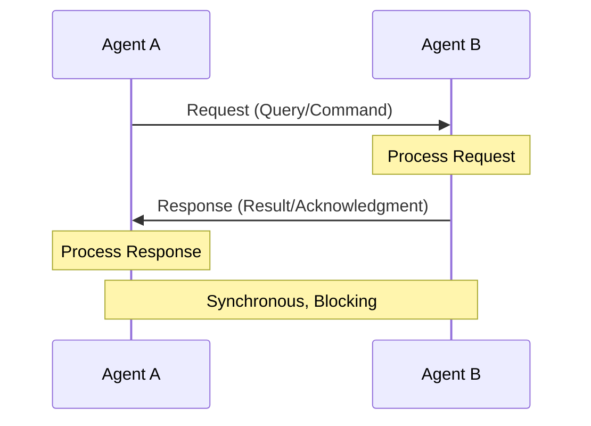
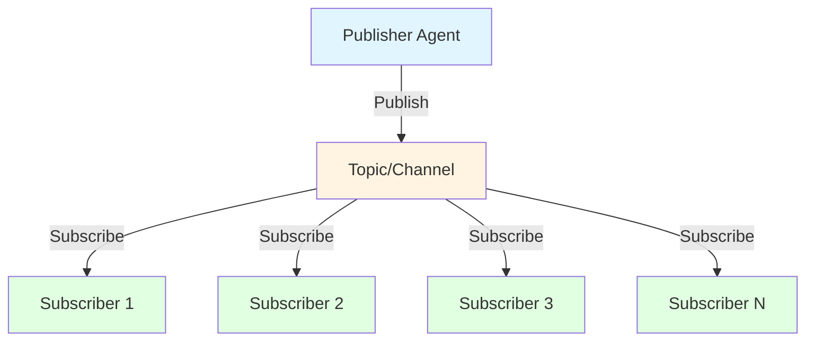
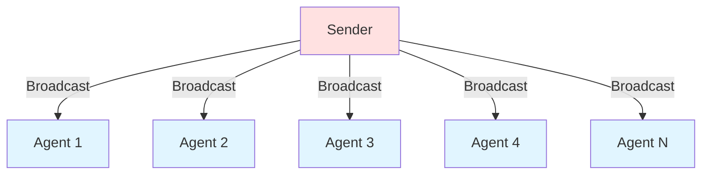
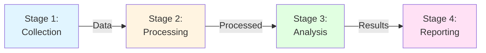
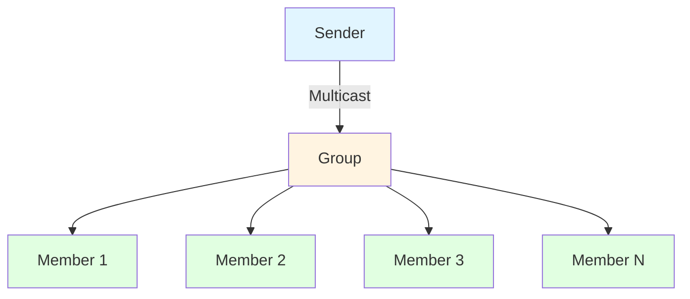
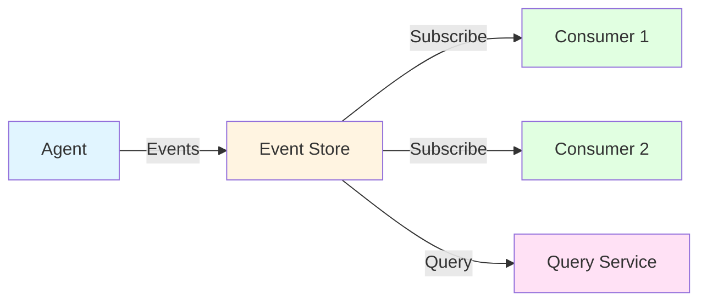

# Communication Patterns: Effective Information Flow

## Overview

Communication patterns define how information flows between agents, systems, and humans in multi-agent deployments. These patterns address the fundamental challenge of distributed coordination: how agents exchange information efficiently, reliably, and at scale while maintaining consistency and minimizing overhead.

Effective communication is the foundation of multi-agent coordination—the right communication pattern enables seamless collaboration while poor communication structures lead to bottlenecks, inconsistencies, and coordination failures.

### Why Communication Patterns Matter

**The Challenge**: Industrial multi-agent systems must coordinate across distributed agents, handle high-volume data streams, ensure message delivery, maintain consistency, and scale to hundreds of agents—all while meeting real-time performance requirements.

**The Solution**: Proven communication patterns that match information flow to coordination needs, ensuring efficient, reliable, and scalable agent communication.

**The Result**: Seamless coordination that enables complex multi-agent behaviors without communication becoming a bottleneck.

---

## Theoretical Foundations

### Distributed Systems Theory

**Message Passing Models** (Lamport, 1978):
- Asynchronous communication
- Message ordering guarantees
- Delivery semantics
- Failure handling

**Consistency Models**:
- Strong consistency
- Eventual consistency
- Causal consistency
- Sequential consistency

**CAP Theorem** (Brewer, 2000):
- Consistency vs. Availability trade-offs
- Partition tolerance requirements
- System design implications
- Practical considerations

### Communication Protocols

**Protocol Layers**:
- Application layer (semantics)
- Transport layer (reliability)
- Network layer (routing)
- Physical layer (transmission)

**Quality of Service (QoS)**:
- At-most-once delivery
- At-least-once delivery
- Exactly-once delivery
- Ordered delivery

**Protocol Selection Criteria**:
- Latency requirements
- Throughput needs
- Reliability guarantees
- Scalability characteristics

### Information Theory

**Shannon's Theory** (Shannon, 1948):
- Channel capacity
- Information entropy
- Noise and redundancy
- Optimal encoding

**Message Efficiency**:
- Compression techniques
- Redundancy elimination
- Semantic compression
- Bandwidth optimization

### Coordination Theory

**Coordination Mechanisms** (Malone & Crowston, 1994):
- Shared resources management
- Producer-consumer relationships
- Simultaneity constraints
- Task dependencies

**Coordination Overhead**:
- Communication costs
- Synchronization delays
- Conflict resolution
- Consensus building

---

## Core Communication Patterns

### Pattern 1: Request-Response

**When to Use**:
- Direct query needed
- Synchronous interaction required
- Response expected immediately
- One-to-one communication
- Transactional semantics needed
- Simple coordination sufficient

**Communication Structure**:


**Characteristics**:
- Synchronous communication
- Blocking operation (requester waits)
- Direct point-to-point
- Response guaranteed (or timeout)
- Simple error handling
- Transactional semantics

**Implementation Approaches**:

**1. Synchronous RPC (Remote Procedure Call)**:
```
result = agent_b.query_status(equipment_id)
# Blocks until response received
process_result(result)
```

**2. Asynchronous with Callback**:
```
agent_b.query_status(equipment_id, callback=handle_response)
# Non-blocking, callback invoked when response arrives
```

**3. Future/Promise Pattern**:
```
future = agent_b.query_status_async(equipment_id)
# Do other work
result = future.get()  # Block only when result needed
```

**Example 1: Equipment Status Query**

**Scenario**: Maintenance agent queries equipment health status

**Communication Flow**:
1. **Request**: Maintenance agent sends status query
   ```
   Request: {
     type: "query",
     target: "equipment_agent_42",
     query: "get_health_status",
     equipment_id: "PUMP-001",
     timestamp: "2025-12-05T23:00:00Z"
   }
   ```

2. **Processing**: Equipment agent retrieves current status
   - Query sensor data
   - Calculate health score
   - Assess maintenance needs
   - Prepare response

3. **Response**: Equipment agent returns status
   ```
   Response: {
     type: "response",
     request_id: "req_12345",
     status: "success",
     data: {
       equipment_id: "PUMP-001",
       health_score: 0.87,
       vibration: "normal",
       temperature: 72.3,
       maintenance_due: "2025-12-15",
       confidence: 0.92
     },
     timestamp: "2025-12-05T23:00:01Z"
   }
   ```

4. **Processing**: Maintenance agent processes response
   - Update maintenance schedule
   - Log status
   - Trigger actions if needed

**Performance**: 
- Latency: <100ms typical
- Throughput: 1,000+ requests/second per agent
- Reliability: >99.9% with retries

**Example 2: Inventory Availability Check**

**Scenario**: Production agent checks part availability before scheduling

**Communication Flow**:
1. **Request**: Production agent queries inventory
   ```
   Request: {
     type: "query",
     target: "inventory_agent",
     query: "check_availability",
     part_number: "PART-5678",
     quantity_needed: 100,
     required_by: "2025-12-10"
   }
   ```

2. **Processing**: Inventory agent checks stock
   - Query current inventory
   - Check reserved quantities
   - Verify incoming shipments
   - Calculate availability

3. **Response**: Inventory agent returns availability
   ```
   Response: {
     type: "response",
     status: "success",
     data: {
       part_number: "PART-5678",
       available: 150,
       reserved: 30,
       available_for_order: 120,
       lead_time_days: 3,
       confidence: 0.95
     }
   }
   ```

4. **Decision**: Production agent proceeds with scheduling

**Advantages**:
- Simple, intuitive pattern
- Easy error handling
- Transactional semantics
- Guaranteed response (or timeout)
- Direct accountability

**Disadvantages**:
- Blocking (synchronous versions)
- Tight coupling between agents
- Scalability limitations
- No broadcast capability
- Potential bottlenecks

**Best Practices**:
- Implement timeouts
- Use connection pooling
- Cache frequent queries
- Implement retry logic
- Monitor response times

**Success Metrics**:
- Response time: <100ms (p95)
- Success rate: >99.9%
- Timeout rate: <0.1%
- Throughput: >1,000 req/s per agent

---

### Pattern 2: Publish-Subscribe

**When to Use**:
- Event-driven architecture
- One-to-many communication
- Loose coupling desired
- Asynchronous processing
- Dynamic subscriber sets
- Scalable information distribution

**Communication Structure**:


**Characteristics**:
- Asynchronous communication
- Decoupled publishers and subscribers
- Topic-based routing
- Multiple subscribers per topic
- Dynamic subscription management
- Scalable distribution

**Topic Organization Strategies**:

**1. Hierarchical Topics**:
```
plant/line1/equipment/pump001/status
plant/line1/equipment/pump001/alerts
plant/line2/quality/measurements
plant/line2/quality/deviations
```

**2. Wildcard Subscriptions**:
```
plant/+/equipment/+/alerts  # All equipment alerts
plant/line1/#                # Everything from line 1
```

**3. Content-Based Filtering**:
```
Subscribe to: equipment_status
Filter: health_score < 0.7 OR temperature > 80
```

**Example 1: Equipment Status Updates**

**Scenario**: Equipment agents publish status, multiple agents subscribe

**Publishers**:
- Equipment monitoring agents (50+ agents)
- Each publishes status every 30 seconds

**Subscribers**:
- Maintenance planning agent
- Operations dashboard agent
- Analytics agent
- Alerting agent

**Communication Flow**:
1. **Publication**: Equipment agent publishes status
   ```
   Topic: "equipment/PUMP-001/status"
   Message: {
     equipment_id: "PUMP-001",
     health_score: 0.87,
     vibration: 2.3,
     temperature: 72.3,
     operating_hours: 15420,
     timestamp: "2025-12-05T23:00:00Z"
   }
   ```

2. **Distribution**: Message broker routes to subscribers
   - Maintenance agent receives (interested in health_score)
   - Dashboard agent receives (displays current status)
   - Analytics agent receives (stores for trending)
   - Alerting agent receives (monitors thresholds)

3. **Processing**: Each subscriber processes independently
   - Maintenance: Updates maintenance schedule if health_score < 0.8
   - Dashboard: Updates real-time display
   - Analytics: Stores in time-series database
   - Alerting: Checks against alert rules

**Performance**:
- Latency: <50ms from publish to delivery
- Throughput: 10,000+ messages/second
- Scalability: 1,000+ subscribers per topic

**Example 2: Quality Deviation Alerts**

**Scenario**: Quality monitoring publishes deviations, multiple teams respond

**Publisher**:
- Quality monitoring agent

**Subscribers**:
- Production control agent
- Quality assurance agent
- Maintenance agent
- Operations manager notification

**Communication Flow**:
1. **Detection**: Quality agent detects deviation
   ```
   Topic: "quality/line2/deviations"
   Message: {
     type: "quality_deviation",
     severity: "medium",
     parameter: "viscosity",
     measured: 145,
     specification: "120-140",
     deviation_percent: 3.6,
     batch_id: "BATCH-2025-1205-042",
     timestamp: "2025-12-05T23:00:00Z",
     confidence: 0.91
   }
   ```

2. **Distribution**: All interested parties notified simultaneously

3. **Coordinated Response**:
   - Production: Adjusts process parameters
   - QA: Initiates investigation
   - Maintenance: Checks equipment calibration
   - Operations: Notified for awareness

**Advantages**:
- Loose coupling (publishers don't know subscribers)
- Scalable (add subscribers without impacting publishers)
- Flexible (dynamic subscription changes)
- Efficient (one publish, many receives)
- Asynchronous (non-blocking)

**Disadvantages**:
- No guaranteed delivery (depends on QoS)
- Potential message loss
- Ordering not guaranteed across topics
- Debugging more complex
- Requires message broker infrastructure

**Best Practices**:
- Use hierarchical topic structure
- Implement appropriate QoS levels
- Monitor broker performance
- Design for idempotency
- Include timestamps in messages

**Success Metrics**:
- Message delivery rate: >99.9%
- End-to-end latency: <100ms (p95)
- Broker throughput: >10,000 msg/s
- Subscriber lag: <1 second

---

### Pattern 3: Broadcast

**When to Use**:
- System-wide notifications
- Emergency alerts
- Configuration updates
- Coordination signals
- All agents must receive
- Immediate delivery required

**Communication Structure**:


**Characteristics**:
- One-to-all communication
- Immediate delivery
- No selective routing
- High priority
- Guaranteed delivery
- Acknowledgment tracking

**Implementation Approaches**:

**1. Network Broadcast**:
- UDP broadcast packets
- Fast, low overhead
- No delivery guarantee
- Suitable for non-critical updates

**2. Broker-Based Broadcast**:
- Special broadcast topic
- All agents subscribe
- Delivery guarantees available
- Acknowledgment possible

**3. Direct Multi-Send**:
- Send to each agent individually
- Guaranteed delivery
- Acknowledgment tracking
- Higher overhead

**Example 1: Emergency Shutdown**

**Scenario**: Safety system broadcasts emergency shutdown

**Communication Flow**:
1. **Detection**: Safety system detects critical condition
   ```
   Broadcast Message: {
     type: "emergency_shutdown",
     severity: "critical",
     reason: "pressure_exceeded_limit",
     affected_systems: ["line1", "line2"],
     action_required: "immediate_shutdown",
     timestamp: "2025-12-05T23:00:00Z",
     message_id: "EMERG-2025-1205-001"
   }
   ```

2. **Distribution**: Sent to all agents simultaneously
   - Production control agents
   - Equipment control agents
   - Safety monitoring agents
   - Operations dashboard
   - Alert notification system

3. **Acknowledgment**: Each agent acknowledges receipt
   ```
   Acknowledgment: {
     agent_id: "production_control_line1",
     message_id: "EMERG-2025-1205-001",
     status: "received_and_executing",
     timestamp: "2025-12-05T23:00:01Z"
   }
   ```

4. **Execution**: All agents execute shutdown procedures
   - Stop production processes
   - Close safety valves
   - Activate emergency protocols
   - Log actions taken

5. **Verification**: Safety system verifies all agents responded
   - Track acknowledgments
   - Identify non-responsive agents
   - Escalate if needed

**Performance**:
- Delivery time: <1 second to all agents
- Acknowledgment time: <5 seconds
- Success rate: 100% (critical requirement)

**Example 2: Configuration Update**

**Scenario**: System administrator broadcasts configuration change

**Communication Flow**:
1. **Update**: Administrator initiates configuration update
   ```
   Broadcast Message: {
     type: "configuration_update",
     priority: "high",
     component: "logging_level",
     old_value: "INFO",
     new_value: "DEBUG",
     effective_time: "immediate",
     duration: "2_hours",
     reason: "troubleshooting_investigation"
   }
   ```

2. **Distribution**: All agents receive update

3. **Application**: Each agent applies configuration
   - Update logging level
   - Acknowledge receipt
   - Log configuration change

4. **Reversion**: Automatic reversion after duration
   ```
   Broadcast Message: {
     type: "configuration_revert",
     component: "logging_level",
     value: "INFO",
     reason: "duration_expired"
   }
   ```

**Advantages**:
- Guaranteed all agents receive
- Fast system-wide coordination
- Simple implementation
- Suitable for critical messages
- Acknowledgment tracking possible

**Disadvantages**:
- High network traffic
- All agents must process (even if not relevant)
- Potential network congestion
- Scalability limitations
- Acknowledgment overhead

**Best Practices**:
- Reserve for critical messages only
- Implement acknowledgment tracking
- Use priority queuing
- Monitor delivery success
- Have fallback mechanisms

**Success Metrics**:
- Delivery success: 100%
- Delivery time: <1 second
- Acknowledgment rate: 100%
- Processing time: <5 seconds

---

### Pattern 4: Pipeline

**When to Use**:
- Sequential processing required
- Data transformation workflow
- Each stage adds value
- Linear dependencies
- Clear handoffs
- Staged processing beneficial

**Communication Structure**:


**Characteristics**:
- Sequential flow
- Each stage processes and forwards
- Clear input/output contracts
- Buffering between stages
- Asynchronous processing
- Backpressure management

**Pipeline Architectures**:

**1. Synchronous Pipeline**:
- Each stage waits for previous
- Simple coordination
- End-to-end latency is sum of stages
- No parallelism

**2. Asynchronous Pipeline**:
- Stages process independently
- Queue-based handoffs
- Parallel processing of different items
- Better throughput

**3. Parallel Pipeline**:
- Multiple instances per stage
- Load balancing
- Higher throughput
- More complex coordination

**Example 1: Data Analysis Pipeline**

**Scenario**: Sensor data flows through analysis pipeline

**Pipeline Stages**:
1. **Collection Agent**: Gathers sensor data
2. **Validation Agent**: Validates and cleanses data
3. **Analysis Agent**: Performs statistical analysis
4. **Insight Agent**: Generates actionable insights
5. **Reporting Agent**: Creates reports

**Communication Flow**:
1. **Stage 1 - Collection**:
   ```
   Output: {
     type: "raw_sensor_data",
     sensors: [
       {id: "TEMP-001", value: 72.3, timestamp: "..."},
       {id: "PRESS-001", value: 145.2, timestamp: "..."},
       {id: "FLOW-001", value: 23.5, timestamp: "..."}
     ],
     collection_time: "2025-12-05T23:00:00Z"
   }
   ```

2. **Stage 2 - Validation**:
   - Validate sensor readings
   - Remove outliers
   - Fill missing values
   - Normalize data
   ```
   Output: {
     type: "validated_data",
     sensors: [...],  # Cleaned data
     validation_status: "passed",
     outliers_removed: 2,
     confidence: 0.95
   }
   ```

3. **Stage 3 - Analysis**:
   - Calculate statistics
   - Identify trends
   - Detect anomalies
   - Compare to baselines
   ```
   Output: {
     type: "analysis_results",
     statistics: {mean: 72.1, std: 1.2, ...},
     trends: ["increasing_temperature"],
     anomalies: [],
     confidence: 0.88
   }
   ```

4. **Stage 4 - Insights**:
   - Generate recommendations
   - Assess significance
   - Prioritize actions
   ```
   Output: {
     type: "insights",
     recommendations: [
       {
         action: "monitor_temperature_trend",
         priority: "medium",
         rationale: "Gradual increase detected",
         confidence: 0.85
       }
     ]
   }
   ```

5. **Stage 5 - Reporting**:
   - Format for stakeholders
   - Generate visualizations
   - Distribute reports

**Performance**:
- Throughput: 100 items/minute
- End-to-end latency: 30 seconds
- Stage efficiency: >90% each

**Example 2: Quality Control Pipeline**

**Scenario**: Product quality data flows through inspection pipeline

**Pipeline Stages**:
1. **Measurement Agent**: Collects quality measurements
2. **Comparison Agent**: Compares to specifications
3. **Classification Agent**: Classifies as pass/fail/marginal
4. **Root Cause Agent**: Investigates failures
5. **Action Agent**: Initiates corrective actions

**Communication Flow**:
1. **Measurement**: Collect quality parameters
2. **Comparison**: Check against specifications
3. **Classification**: Determine product status
4. **Investigation**: Analyze failures
5. **Action**: Implement corrections

**Backpressure Handling**:
- If Stage 4 (investigation) is slow, queue builds
- Stage 3 slows down to match
- Prevents overwhelming downstream stages
- Maintains system stability

**Advantages**:
- Clear separation of concerns
- Each stage independently scalable
- Easy to add/remove stages
- Natural buffering
- Fault isolation

**Disadvantages**:
- End-to-end latency is cumulative
- Potential bottlenecks at slow stages
- Requires queue management
- Backpressure complexity
- Debugging across stages

**Best Practices**:
- Implement backpressure handling
- Monitor queue depths
- Balance stage throughput
- Use asynchronous processing
- Implement error handling at each stage

**Success Metrics**:
- Pipeline throughput: >target
- Stage efficiency: >85% each
- Queue depth: <threshold
- End-to-end latency: <target

---

### Pattern 5: Multicast

**When to Use**:
- Selective group communication
- Team coordination
- Role-based distribution
- Efficient group messaging
- Dynamic group membership
- Scalable group communication

**Communication Structure**:


**Characteristics**:
- One-to-group communication
- Selective delivery
- Group membership management
- Efficient distribution
- Dynamic groups
- Role-based routing

**Group Management Strategies**:

**1. Static Groups**:
- Predefined membership
- Rarely changes
- Simple management
- Example: All maintenance agents

**2. Dynamic Groups**:
- Membership changes frequently
- Join/leave operations
- Complex management
- Example: Agents working on current issue

**3. Role-Based Groups**:
- Membership by role
- Automatic assignment
- Flexible composition
- Example: All "quality_inspector" role agents

**Example 1: Team Coordination**

**Scenario**: Coordinator multicasts to maintenance team

**Group**: Maintenance team for Line 1
- Mechanical maintenance agent
- Electrical maintenance agent
- Instrumentation agent
- Maintenance scheduler

**Communication Flow**:
1. **Coordinator**: Identifies maintenance need
   ```
   Multicast to: "maintenance_team_line1"
   Message: {
     type: "maintenance_required",
     equipment: "PUMP-001",
     issue: "vibration_anomaly",
     priority: "high",
     required_skills: ["mechanical", "vibration_analysis"],
     estimated_duration: "4_hours",
     preferred_window: "2025-12-06 02:00-06:00"
   }
   ```

2. **Distribution**: All team members receive

3. **Responses**: Team members respond
   ```
   From mechanical_agent: {
     status: "available",
     can_start: "2025-12-06 02:00",
     estimated_completion: "2025-12-06 05:00"
   }
   
   From electrical_agent: {
     status: "available_for_support",
     note: "Can assist if electrical issue found"
   }
   ```

4. **Coordination**: Team coordinates execution

**Example 2: Alert Distribution**

**Scenario**: Alert system multicasts to relevant agents

**Groups**: 
- Critical alerts → Operations team
- Quality alerts → Quality team
- Maintenance alerts → Maintenance team

**Communication Flow**:
1. **Alert Generation**: System detects issue
   ```
   Multicast to: "quality_team"
   Message: {
     type: "quality_alert",
     severity: "high",
     parameter: "pH_level",
     measured: 8.5,
     specification: "7.0-7.5",
     batch: "BATCH-2025-1205-042",
     action_required: "immediate_investigation"
   }
   ```

2. **Team Response**: Quality team coordinates response

**Advantages**:
- Efficient group communication
- Selective delivery
- Dynamic membership
- Scalable
- Role-based routing

**Disadvantages**:
- Group management overhead
- Membership synchronization
- Potential message duplication
- Complex routing logic

**Best Practices**:
- Use role-based groups
- Implement group discovery
- Monitor group membership
- Handle membership changes gracefully
- Use appropriate QoS

**Success Metrics**:
- Delivery success: >99%
- Group management overhead: <5%
- Membership accuracy: >99%
- Delivery latency: <100ms

---

### Pattern 6: Event Sourcing

**When to Use**:
- Complete history needed
- Audit trail required
- Time-travel queries
- Event replay capability
- Debugging complex interactions
- Compliance requirements

**Communication Structure**:


**Characteristics**:
- All changes stored as events
- Immutable event log
- Event replay capability
- Complete audit trail
- Time-based queries
- State reconstruction

**Event Store Design**:

**1. Event Structure**:
```
Event: {
  event_id: "evt_12345",
  event_type: "equipment_status_changed",
  aggregate_id: "PUMP-001",
  timestamp: "2025-12-05T23:00:00Z",
  data: {
    old_status: "running",
    new_status: "maintenance",
    reason: "scheduled_maintenance",
    initiated_by: "maintenance_agent_42"
  },
  metadata: {
    agent_id: "equipment_agent_001",
    correlation_id: "maint_2025_1205_001",
    causation_id: "evt_12344"
  }
}
```

**2. Event Ordering**:
- Timestamp-based
- Sequence number
- Causal ordering
- Partition key

**Example: Equipment Lifecycle Tracking**

**Scenario**: Track complete equipment history through events

**Events**:
1. **Equipment Commissioned**:
   ```
   {
     event_type: "equipment_commissioned",
     equipment_id: "PUMP-001",
     timestamp: "2024-01-15T08:00:00Z",
     data: {
       model: "XYZ-500",
       serial: "SN-123456",
       location: "Line1-Station3"
     }
   }
   ```

2. **Status Changes** (ongoing):
   ```
   {
     event_type: "status_changed",
     equipment_id: "PUMP-001",
     timestamp: "2025-12-05T23:00:00Z",
     data: {
       from: "running",
       to: "maintenance"
     }
   }
   ```

3. **Maintenance Events**:
   ```
   {
     event_type: "maintenance_completed",
     equipment_id: "PUMP-001",
     timestamp: "2025-12-06T06:00:00Z",
     data: {
       type: "preventive",
       duration_hours: 4,
       parts_replaced: ["bearing_001"],
       technician: "tech_42"
     }
   }
   ```

**Query Capabilities**:
- Current state: Replay all events
- Historical state: Replay events up to timestamp
- Event history: Query event log
- Audit trail: Complete event sequence

**Advantages**:
- Complete audit trail
- Time-travel queries
- Event replay for debugging
- State reconstruction
- Compliance support

**Disadvantages**:
- Storage requirements
- Query complexity
- Event schema evolution
- Performance considerations

**Best Practices**:
- Design immutable events
- Include causation/correlation IDs
- Implement event versioning
- Optimize for common queries
- Archive old events

**Success Metrics**:
- Event capture rate: 100%
- Query performance: <1 second
- Storage efficiency: Optimized
- Replay accuracy: 100%

---

## Protocol Selection

### Protocol Comparison

| Protocol | Latency | Throughput | Reliability | Use Case |
|----------|---------|------------|-------------|----------|
| MQTT | Low | High | Configurable QoS | IoT, sensors, lightweight |
| DDS | Very Low | Very High | High | Real-time, mission-critical |
| HTTP/REST | Medium | Medium | High | External systems, APIs |
| gRPC | Low | High | High | Internal services, streaming |
| AMQP | Low | High | High | Enterprise messaging |
| WebSocket | Low | Medium | Medium | Real-time dashboards |

### MQTT (Message Queuing Telemetry Transport)

**Characteristics**:
- Lightweight publish-subscribe
- Three QoS levels (0, 1, 2)
- Topic-based routing
- Last Will and Testament
- Retained messages

**When to Use**:
- IoT device communication
- High-volume sensor data
- Bandwidth-constrained networks
- Battery-powered devices
- Unreliable networks

**QoS Levels**:
- **QoS 0**: At most once (fire and forget)
- **QoS 1**: At least once (acknowledged delivery)
- **QoS 2**: Exactly once (guaranteed delivery)

**Example Configuration**:
```
Broker: mosquitto
Port: 1883 (unencrypted), 8883 (TLS)
Topics: plant/{line}/{equipment}/{metric}
QoS: 1 (at-least-once for sensor data)
Retain: true (for status messages)
```

**Performance**:
- Latency: 10-50ms
- Throughput: 100,000+ msg/s
- Overhead: ~2 bytes per message

---

### DDS (Data Distribution Service)

**Characteristics**:
- Real-time publish-subscribe
- Quality of Service policies
- Content-based filtering
- Discovery protocol
- Type-safe data model

**When to Use**:
- Mission-critical systems
- Real-time requirements (<10ms)
- High-reliability needs
- Complex data types
- Deterministic behavior

**QoS Policies**:
- Reliability (reliable/best-effort)
- Durability (volatile/transient/persistent)
- History (keep last N samples)
- Deadline (max time between samples)
- Liveliness (participant alive detection)

**Example Configuration**:
```
Domain: 0
Topics: EquipmentStatus, QualityMeasurement
Reliability: RELIABLE
Durability: TRANSIENT_LOCAL
History: KEEP_LAST 10
Deadline: 100ms
```

**Performance**:
- Latency: <1ms (local), <10ms (network)
- Throughput: 1,000,000+ msg/s
- Jitter: <100μs

---

### HTTP/REST

**Characteristics**:
- Request-response model
- Stateless protocol
- Standard methods (GET, POST, PUT, DELETE)
- JSON/XML payloads
- Wide compatibility

**When to Use**:
- External system integration
- API-based communication
- Web-based interfaces
- Standard protocols required
- Firewall-friendly communication

**Example Configuration**:
```
Base URL: https://api.plant.example.com/v1
Authentication: OAuth 2.0 / API Key
Content-Type: application/json
Rate Limiting: 1000 requests/minute
Timeout: 30 seconds
```

**Performance**:
- Latency: 50-200ms
- Throughput: 1,000-10,000 req/s
- Overhead: ~500 bytes per request

---

## Pattern Selection Framework

### Selection Matrix

| Requirement | Recommended Pattern |
|-------------|-------------------|
| Direct query | Request-Response |
| Event distribution | Publish-Subscribe |
| Emergency notification | Broadcast |
| Sequential processing | Pipeline |
| Team coordination | Multicast |
| Audit trail | Event Sourcing |

### Selection Criteria

**1. Communication Style**:
- Synchronous → Request-Response
- Asynchronous → Publish-Subscribe, Pipeline
- One-to-many → Publish-Subscribe, Multicast, Broadcast

**2. Coupling**:
- Tight coupling acceptable → Request-Response
- Loose coupling required → Publish-Subscribe
- No coupling → Event Sourcing

**3. Delivery Guarantees**:
- Must receive → Broadcast, Request-Response
- Best effort → Publish-Subscribe (QoS 0)
- Exactly once → Event Sourcing, MQTT QoS 2

**4. Scalability**:
- Few agents → Request-Response
- Many agents → Publish-Subscribe, Multicast
- Very large scale → Event Sourcing with streaming

---

## Best Practices

### Practice 1: Choose Appropriate Pattern

**Guideline**: Match communication pattern to coordination needs

**Implementation**:
1. Analyze communication requirements
2. Consider scalability needs
3. Evaluate delivery guarantees
4. Select appropriate pattern
5. Validate with prototyping

**Benefit**: Optimal performance and reliability

---

### Practice 2: Implement Idempotency

**Guideline**: Design message handlers to be idempotent

**Implementation**:
1. Use unique message IDs
2. Track processed messages
3. Handle duplicates gracefully
4. Design stateless operations when possible

**Example**:
```
def handle_message(message):
    if message.id in processed_messages:
        return  # Already processed
    
    # Process message
    process(message)
    
    # Mark as processed
    processed_messages.add(message.id)
```

**Benefit**: Reliable message processing with at-least-once delivery

---

### Practice 3: Monitor Communication Health

**Guideline**: Continuously monitor communication metrics

**Metrics to Track**:
- Message delivery rate
- End-to-end latency
- Queue depths
- Error rates
- Throughput

**Implementation**:
1. Instrument communication paths
2. Collect metrics
3. Set up alerts
4. Dashboard visualization
5. Regular review

**Benefit**: Early detection of communication issues

---

### Practice 4: Implement Circuit Breakers

**Guideline**: Protect against cascading failures

**Implementation**:
```
class CircuitBreaker:
    def __init__(self, failure_threshold=5, timeout=60):
        self.failure_count = 0
        self.failure_threshold = failure_threshold
        self.timeout = timeout
        self.state = "closed"  # closed, open, half-open
        self.last_failure_time = None
    
    def call(self, func, *args, **kwargs):
        if self.state == "open":
            if time.time() - self.last_failure_time > self.timeout:
                self.state = "half-open"
            else:
                raise CircuitBreakerOpen()
        
        try:
            result = func(*args, **kwargs)
            if self.state == "half-open":
                self.state = "closed"
                self.failure_count = 0
            return result
        except Exception as e:
            self.failure_count += 1
            self.last_failure_time = time.time()
            if self.failure_count >= self.failure_threshold:
                self.state = "open"
            raise
```

**Benefit**: System resilience and graceful degradation

---

### Practice 5: Use Message Versioning

**Guideline**: Support message schema evolution

**Implementation**:
```
Message: {
  version: "2.0",
  type: "equipment_status",
  data: {
    // Version 2.0 fields
  }
}
```

**Strategies**:
- Include version in message
- Support multiple versions
- Gradual migration
- Backward compatibility

**Benefit**: Smooth system evolution

---

## Common Pitfalls

### Pitfall 1: Tight Coupling

**Problem**: Direct dependencies between agents

**Symptoms**:
- Changes cascade across agents
- Difficult to scale
- Brittle system
- Hard to test

**Solution**: Use Publish-Subscribe or Event Sourcing for loose coupling

**Prevention**: Design for loose coupling from start

---

### Pitfall 2: Message Storms

**Problem**: Excessive message volume overwhelms system

**Symptoms**:
- Queue buildup
- Increased latency
- System slowdown
- Message loss

**Solution**:
- Implement rate limiting
- Use message batching
- Apply backpressure
- Filter unnecessary messages

**Prevention**: Design for expected load + 3x headroom

---

### Pitfall 3: Lost Messages

**Problem**: Messages not delivered or processed

**Symptoms**:
- Missing data
- Inconsistent state
- Coordination failures
- Audit gaps

**Solution**:
- Use appropriate QoS levels
- Implement acknowledgments
- Add retry logic
- Monitor delivery rates

**Prevention**: Choose reliable protocols and patterns

---

### Pitfall 4: Ordering Issues

**Problem**: Messages processed out of order

**Symptoms**:
- Inconsistent state
- Logic errors
- Race conditions
- Incorrect results

**Solution**:
- Use sequence numbers
- Implement ordering guarantees
- Design for eventual consistency
- Use event sourcing

**Prevention**: Design for out-of-order delivery

---

### Pitfall 5: Inadequate Error Handling

**Problem**: Communication failures not handled properly

**Symptoms**:
- System crashes
- Data loss
- Inconsistent state
- Poor user experience

**Solution**:
- Implement comprehensive error handling
- Use circuit breakers
- Add retry logic with exponential backoff
- Log all errors

**Prevention**: Design error handling from start

---

## Measuring Communication Effectiveness

### Key Metrics

**Message Delivery Rate**:
```
Delivery_Rate = Messages_Delivered / Messages_Sent
Target: >99.9%
```

**End-to-End Latency**:
```
Latency = Time_Received - Time_Sent
Target: <100ms (p95)
```

**Throughput**:
```
Throughput = Messages_Processed / Time_Period
Target: >10,000 msg/s
```

**Queue Depth**:
```
Queue_Depth = Messages_Waiting
Target: <1000 messages
```

**Error Rate**:
```
Error_Rate = Failed_Messages / Total_Messages
Target: <0.1%
```

---

## Advanced Topics

### Message Compression

**When to Use**:
- Large message payloads
- Bandwidth constraints
- Cost optimization
- Network efficiency

**Techniques**:
- gzip compression
- Protocol buffers
- Message pack
- Custom compression

**Trade-offs**:
- CPU overhead vs. bandwidth savings
- Latency impact
- Compatibility considerations

---

### Message Encryption

**When to Use**:
- Sensitive data
- Regulatory requirements
- Security policies
- Cross-network communication

**Approaches**:
- TLS/SSL transport encryption
- Message-level encryption
- End-to-end encryption
- Key management

**Considerations**:
- Performance impact
- Key distribution
- Certificate management
- Compliance requirements

---

### Adaptive Communication

**Concept**: Adjust communication patterns based on conditions

**Strategies**:
- Switch protocols based on network conditions
- Adjust QoS based on importance
- Dynamic batching based on load
- Adaptive retry intervals

**Benefits**:
- Optimized performance
- Better resource utilization
- Improved reliability
- Cost efficiency

---

## Related Documentation

- [Communication Framework](../decision-orchestration/communication-framework.md)
- [System Components](../architecture/system-components.md)
- [Agent Team Patterns](./agent-team-patterns.md)
- [Decision Patterns](./decision-patterns.md)
- [Data Architecture](../architecture/data-architecture.md)

---

## References

### Distributed Systems
- Lamport, L. (1978). "Time, Clocks, and the Ordering of Events in a Distributed System"
- Brewer, E. (2000). "Towards Robust Distributed Systems" (CAP Theorem)
- Vogels, W. (2009). "Eventually Consistent"

### Communication Protocols
- Banks, A., & Gupta, R. (2014). "MQTT Version 3.1.1"
- Object Management Group (2015). "Data Distribution Service (DDS)"
- Fielding, R. T. (2000). "Architectural Styles and the Design of Network-based Software Architectures" (REST)

### Message Patterns
- Hohpe, G., & Woolf, B. (2003). "Enterprise Integration Patterns"
- Vernon, V. (2013). "Implementing Domain-Driven Design" (Event Sourcing)

### Coordination Theory
- Malone, T. W., & Crowston, K. (1994). "The Interdisciplinary Study of Coordination"
- Jennings, N. R. (1996). "Coordination Techniques for Distributed Artificial Intelligence"

### Information Theory
- Shannon, C. E. (1948). "A Mathematical Theory of Communication"
- Cover, T. M., & Thomas, J. A. (2006). "Elements of Information Theory"

---

**Document Version**: 2.0
**Last Updated**: December 5, 2025
**Status**: ✅ Enhanced to Match Phases 1-4 Quality Standard