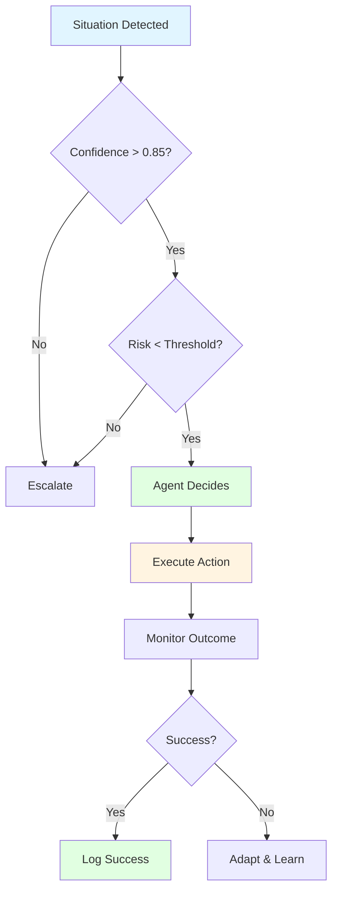
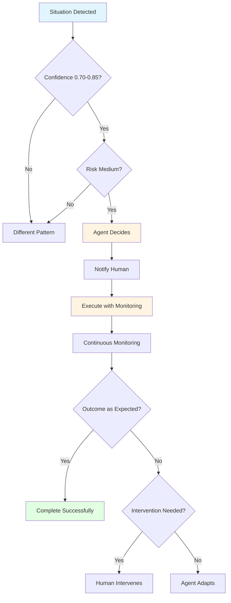
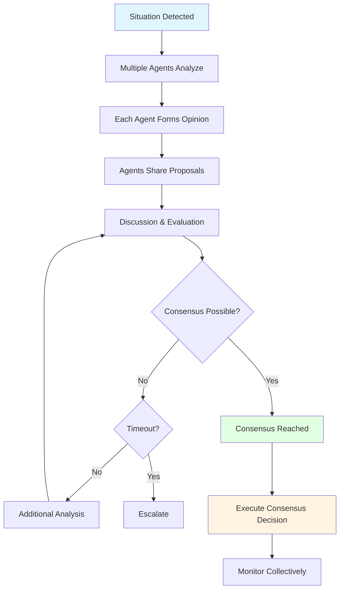
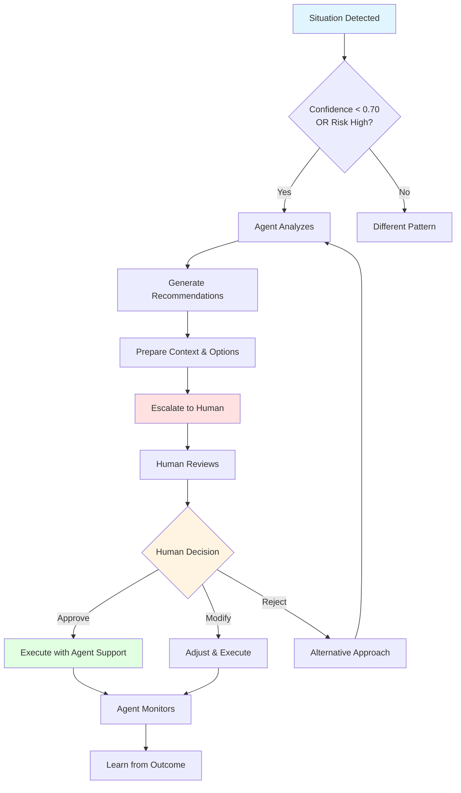
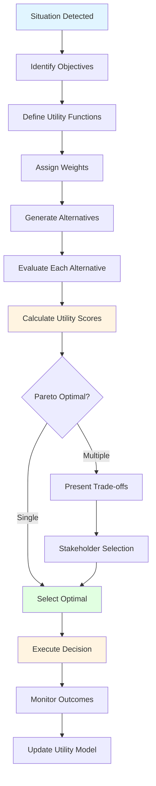

# Decision Patterns: Effective Decision-Making Approaches

## Overview

Decision patterns provide proven approaches for structuring and executing different types of decisions in multi-agent systems. These patterns address the fundamental challenge of autonomous decision-making: how agents should make choices that are effective, safe, and aligned with business objectives while operating in complex, uncertain industrial environments.

Effective decision-making is the cornerstone of agent autonomy—the right decision pattern can enable confident autonomous action while poor decision structures lead to hesitation, errors, or inappropriate escalation.

### Why Decision Patterns Matter

**The Challenge**: Industrial agents must make decisions ranging from routine monitoring to safety-critical interventions, each requiring different approaches based on risk, confidence, coordination needs, and time constraints.

**The Solution**: Proven decision patterns that match decision structure to decision characteristics, ensuring appropriate autonomy, safety, and effectiveness.

**The Result**: Confident, reliable decision-making that balances autonomy with appropriate oversight and coordination.

---

## Theoretical Foundations

### Decision Theory

**Classical Decision Theory** (von Neumann & Morgenstern, 1944):
- Rational choice under uncertainty
- Expected utility maximization
- Risk preferences and attitudes
- Value of information

**Bounded Rationality** (Simon, 1955):
- Satisficing vs. optimizing
- Cognitive limitations
- Heuristic decision-making
- Computational constraints

**Multi-Attribute Utility Theory** (Keeney & Raiffa, 1976):
- Multiple competing objectives
- Trade-off analysis
- Weight assignment
- Aggregation methods

### Game Theory

**Cooperative Game Theory**:
- Coalition formation
- Payoff distribution
- Stability concepts
- Negotiation mechanisms

**Non-Cooperative Game Theory**:
- Strategic interaction
- Nash equilibrium
- Dominant strategies
- Sequential games

**Mechanism Design**:
- Incentive compatibility
- Truth revelation
- Optimal mechanisms
- Implementation theory

### Distributed Decision-Making

**Consensus Protocols** (Lamport, 1998):
- Byzantine fault tolerance
- Agreement algorithms
- Consistency guarantees
- Coordination overhead

**Distributed Optimization**:
- Decomposition methods
- Dual decomposition
- ADMM (Alternating Direction Method of Multipliers)
- Convergence properties

**Multi-Agent Planning**:
- Centralized planning
- Distributed planning
- Hierarchical planning
- Plan coordination

### Uncertainty Management

**Probability Theory**:
- Bayesian inference
- Prior and posterior distributions
- Likelihood functions
- Credible intervals

**Fuzzy Logic** (Zadeh, 1965):
- Membership functions
- Fuzzy inference
- Defuzzification
- Linguistic variables

**Dempster-Shafer Theory**:
- Belief functions
- Evidence combination
- Uncertainty representation
- Plausibility measures

---

## Core Decision Patterns

### Pattern 1: Autonomous Decision

**When to Use**:
- Single agent has complete information
- High confidence in decision quality (>0.85)
- Low risk impact (<threshold)
- Time-critical response needed
- No coordination required
- Reversible decision
- Well-established procedures

**Decision Structure**:


**Characteristics**:
- No human intervention required
- Immediate execution
- Self-monitoring
- Automatic learning from outcomes
- Audit trail maintained

**Decision Process**:
1. **Situation Assessment**: Agent analyzes current state
2. **Confidence Evaluation**: Calculate decision confidence
3. **Risk Assessment**: Evaluate potential impact
4. **Decision**: Select optimal action
5. **Execution**: Implement decision immediately
6. **Monitoring**: Track outcome
7. **Learning**: Update knowledge based on results

**Confidence Calculation**:
```
Confidence = w1 × Data_Quality + w2 × Model_Accuracy + w3 × Historical_Success
where w1 + w2 + w3 = 1.0
```

**Risk Assessment**:
```
Risk = Probability(Failure) × Impact(Failure)
Threshold typically: 0.1 (10% of maximum impact)
```

**Example 1: Routine Data Collection**

**Scenario**: Sensor data collection agent monitoring temperature readings

**Decision Context**:
- Confidence: 0.95 (sensor validated, normal range)
- Risk: 0.02 (data collection has minimal impact)
- Time constraint: Real-time collection required
- Coordination: None needed

**Decision Process**:
1. Sensor reading received: 72.3°C
2. Validate reading (within expected range 60-80°C)
3. Confidence: 0.95 (sensor calibrated, stable readings)
4. Risk: 0.02 (data collection only)
5. **Decision**: Store reading, continue monitoring
6. Execute: Write to time-series database
7. Monitor: Verify write success
8. Log: Record successful collection

**Outcome**: 99.9% success rate, <10ms latency

**Example 2: Standard Process Adjustment**

**Scenario**: Process control agent adjusting flow rate

**Decision Context**:
- Confidence: 0.88 (clear deviation, known correction)
- Risk: 0.05 (small adjustment, reversible)
- Time constraint: 30-second response window
- Coordination: None (within agent authority)

**Decision Process**:
1. Detect flow rate deviation: -3% from setpoint
2. Analyze cause: Upstream pressure change
3. Calculate correction: +2% valve opening
4. Confidence: 0.88 (similar situations resolved successfully)
5. Risk: 0.05 (small change, easily reversed)
6. **Decision**: Adjust valve opening
7. Execute: Send control signal
8. Monitor: Verify flow rate correction
9. Learn: Update response model

**Outcome**: Flow rate corrected in 45 seconds, no adverse effects

**Advantages**:
- Fastest response time
- No coordination overhead
- Scales to high-frequency decisions
- Enables true autonomy
- Reduces human workload

**Disadvantages**:
- Limited to low-risk decisions
- Requires high confidence
- No human oversight
- Potential for cascading errors if wrong

**Success Metrics**:
- Decision accuracy: >95%
- Response time: <target for scenario
- Reversal rate: <5%
- Learning improvement: Measurable over time

---

### Pattern 2: Monitored Decision

**When to Use**:
- Single agent decision
- Medium confidence (0.70-0.85)
- Medium risk (threshold to 2× threshold)
- Reversible with monitoring
- Time allows for oversight
- Learning opportunity
- Gradual autonomy building

**Decision Structure**:


**Characteristics**:
- Agent makes decision
- Human notified (not approval required)
- Enhanced monitoring during execution
- Intervention possible if needed
- Learning from monitored outcomes

**Decision Process**:
1. **Situation Assessment**: Analyze current state
2. **Confidence Evaluation**: Calculate confidence (0.70-0.85)
3. **Risk Assessment**: Evaluate medium risk
4. **Decision**: Select action with monitoring plan
5. **Notification**: Alert human of decision and plan
6. **Execution**: Implement with enhanced monitoring
7. **Monitoring**: Track closely with intervention readiness
8. **Learning**: Update models based on outcome

**Monitoring Strategy**:
```
Monitoring_Frequency = Base_Frequency × (1 + Risk_Factor)
Intervention_Threshold = Expected_Outcome ± Tolerance
Alert_Conditions = {Deviation, Unexpected_Event, Time_Exceeded}
```

**Example 1: Process Parameter Adjustment**

**Scenario**: Optimization agent adjusting reactor temperature

**Decision Context**:
- Confidence: 0.78 (model-based prediction, some uncertainty)
- Risk: 0.15 (affects product quality, reversible)
- Time constraint: 2-hour window for adjustment
- Coordination: None, but monitoring required

**Decision Process**:
1. Detect optimization opportunity: +2% yield possible
2. Analyze: Increase temperature by 5°C
3. Model prediction: 78% confidence in improvement
4. Risk: 15% (quality impact if wrong, but reversible)
5. **Decision**: Increase temperature with monitoring
6. Notify: Alert operator of planned adjustment
7. Execute: Gradual temperature increase over 30 minutes
8. Monitor: Track yield, quality, stability every 5 minutes
9. Outcome: Yield increased 1.8%, quality maintained
10. Learn: Update model with actual results

**Monitoring Plan**:
- Temperature: Every 1 minute
- Yield indicators: Every 5 minutes
- Quality parameters: Every 10 minutes
- Intervention threshold: Yield decrease >0.5% or quality deviation
- Rollback plan: Reduce temperature if issues detected

**Outcome**: 85% of monitored decisions succeed without intervention

**Example 2: Maintenance Scheduling Adjustment**

**Scenario**: Maintenance agent rescheduling preventive maintenance

**Decision Context**:
- Confidence: 0.75 (equipment health good, schedule flexibility)
- Risk: 0.12 (delayed maintenance could increase failure risk)
- Time constraint: 1-week decision window
- Coordination: Notify maintenance team

**Decision Process**:
1. Analyze equipment health: Better than expected
2. Production schedule: High-priority orders next week
3. Calculate: Delay maintenance by 2 weeks is acceptable
4. Confidence: 0.75 (health data reliable, but some uncertainty)
5. Risk: 0.12 (small increase in failure probability)
6. **Decision**: Delay maintenance to week 3
7. Notify: Alert maintenance team and production
8. Execute: Update maintenance schedule
9. Monitor: Enhanced equipment monitoring during delay
10. Outcome: Equipment remained healthy, production completed

**Monitoring Plan**:
- Vibration monitoring: Increased frequency
- Temperature monitoring: Continuous
- Performance indicators: Daily review
- Intervention threshold: Any degradation triggers immediate maintenance
- Escalation: If health score drops below 0.85

**Outcome**: 92% of schedule adjustments successful without issues

**Advantages**:
- Balances autonomy with oversight
- Enables learning in medium-risk scenarios
- Human can intervene if needed
- Builds confidence in agent capabilities
- Gradual autonomy expansion

**Disadvantages**:
- Requires monitoring infrastructure
- Human attention needed (though not approval)
- Slower than autonomous decisions
- Intervention may be too late in some cases

**Success Metrics**:
- Decision success rate: >85%
- Intervention rate: <15%
- Monitoring effectiveness: >90% issue detection
- Learning rate: Confidence improvement over time

---

### Pattern 3: Consensus Decision

**When to Use**:
- Multiple agents involved
- Coordination required
- Distributed knowledge
- No single authority
- Collective intelligence beneficial
- Fault tolerance needed
- Democratic decision-making valued

**Decision Structure**:


**Characteristics**:
- Multiple agents participate
- Each agent contributes expertise
- Voting or consensus mechanism
- Conflict resolution process
- Collective responsibility
- Fault-tolerant decision-making

**Consensus Mechanisms**:

**1. Weighted Voting**:
```
Decision = argmax(Σ(wi × votei))
where wi = agent expertise weight
```

**2. Byzantine Consensus**:
- Tolerates faulty agents
- Requires 2f+1 honest agents for f faulty
- Guaranteed agreement if possible
- Fault-tolerant

**3. Threshold Consensus**:
```
Consensus if: Agreement_Rate > Threshold (typically 0.75-0.90)
```

**4. Confidence-Weighted**:
```
Decision = argmax(Σ(confidencei × votei))
```

**Example 1: Multi-System Maintenance Scheduling**

**Scenario**: Coordinating maintenance across interconnected systems

**Team Composition**:
- Equipment Agent A: Monitors System A health
- Equipment Agent B: Monitors System B health
- Equipment Agent C: Monitors System C health
- Scheduling Agent: Coordinates overall schedule
- Resource Agent: Manages maintenance resources

**Decision Context**:
- Multiple systems need maintenance
- Systems are interdependent
- Limited maintenance resources
- Production impact must be minimized
- Coordination essential

**Consensus Process**:
1. **Situation**: All three systems approaching maintenance window
2. **Analysis**: Each equipment agent assesses its system
   - Agent A: Maintenance needed in 2 weeks (confidence: 0.85)
   - Agent B: Maintenance needed in 3 weeks (confidence: 0.78)
   - Agent C: Maintenance needed in 1 week (confidence: 0.92)
3. **Proposals**: Each agent proposes preferred schedule
   - Agent A: Week 2, 8-hour window
   - Agent B: Week 3, 6-hour window
   - Agent C: Week 1, 10-hour window
4. **Constraints**: Resource agent identifies limitations
   - Only 2 systems can be down simultaneously
   - Maintenance crew available weeks 1, 2, 4
5. **Discussion**: Agents evaluate options
   - System C is most urgent (confidence 0.92)
   - Systems A and B can be coordinated
   - Week 1: System C, Week 2: Systems A+B
6. **Voting**: Confidence-weighted consensus
   - Proposal 1 (C then A+B): 0.88 weighted support
   - Proposal 2 (A+B then C): 0.65 weighted support
7. **Consensus**: Proposal 1 accepted (>0.75 threshold)
8. **Execution**: Coordinated maintenance schedule
9. **Monitoring**: All agents track execution

**Outcome**: All maintenance completed successfully, production impact minimized

**Example 2: Root Cause Analysis**

**Scenario**: Multiple experts analyzing quality issue

**Team Composition**:
- Process Expert: Analyzes process parameters
- Equipment Expert: Analyzes equipment behavior
- Quality Expert: Analyzes quality data
- Materials Expert: Analyzes raw material quality

**Decision Context**:
- Quality deviation detected
- Multiple potential root causes
- Expertise from multiple domains needed
- Coordinated investigation required

**Consensus Process**:
1. **Situation**: Product quality deviation detected
2. **Analysis**: Each expert investigates from their domain
   - Process Expert: Temperature deviation found (confidence: 0.75)
   - Equipment Expert: Valve wear detected (confidence: 0.82)
   - Quality Expert: Composition variation noted (confidence: 0.88)
   - Materials Expert: Raw material within spec (confidence: 0.90)
3. **Hypotheses**: Each expert proposes root cause
   - Process: Temperature control issue
   - Equipment: Valve malfunction causing flow variation
   - Quality: Composition indicates upstream issue
   - Materials: Not material-related
4. **Discussion**: Experts evaluate evidence
   - Valve wear could cause flow variation
   - Flow variation could cause temperature deviation
   - Temperature deviation explains composition variation
   - Causal chain: Valve → Flow → Temperature → Quality
5. **Consensus**: Valve wear is root cause
   - Agreement: 4/4 experts (100%)
   - Confidence: 0.85 (weighted average)
6. **Decision**: Replace valve, verify temperature control
7. **Execution**: Coordinated corrective action
8. **Validation**: Monitor quality after correction

**Outcome**: Quality restored, root cause confirmed

**Advantages**:
- Leverages diverse expertise
- Robust to individual agent errors
- Democratic, fair decision-making
- Fault-tolerant (Byzantine consensus)
- Comprehensive analysis

**Disadvantages**:
- Slower than single-agent decisions
- Coordination overhead
- Potential deadlocks
- Requires effective communication
- May struggle with urgent decisions

**Success Metrics**:
- Consensus achievement rate: >90%
- Decision quality: >85% correct
- Time to consensus: <target for scenario
- Coordination efficiency: >80%

---

### Pattern 4: Escalated Decision

**When to Use**:
- Low confidence (<0.70)
- High risk (>2× threshold)
- Novel situation (no precedent)
- Safety-critical decision
- Regulatory requirement
- Ethical considerations
- Human judgment essential

**Decision Structure**:


**Characteristics**:
- Agent recommends, human decides
- Comprehensive context provided
- Multiple options presented
- Risk/benefit analysis included
- Agent supports execution
- Learning from human decisions

**Escalation Process**:
1. **Situation Assessment**: Agent analyzes situation
2. **Confidence Evaluation**: Determines low confidence or high risk
3. **Analysis**: Comprehensive investigation
4. **Recommendations**: Generate 2-4 options with analysis
5. **Context Preparation**: Prepare decision package
6. **Escalation**: Present to appropriate human authority
7. **Human Decision**: Human reviews and decides
8. **Execution Support**: Agent assists implementation
9. **Monitoring**: Agent tracks outcome
10. **Learning**: Update models from human decision

**Decision Package Contents**:
```
1. Situation Summary
2. Analysis Results
3. Recommended Options (2-4)
   - Option description
   - Pros and cons
   - Risk assessment
   - Expected outcomes
   - Resource requirements
4. Agent Confidence Levels
5. Time Constraints
6. Regulatory Considerations
7. Historical Context
```

**Example 1: Safety-Critical Equipment Shutdown**

**Scenario**: Equipment showing concerning behavior

**Decision Context**:
- Confidence: 0.62 (unusual pattern, limited precedent)
- Risk: 0.45 (potential safety impact if wrong decision)
- Time constraint: 30-minute decision window
- Coordination: Safety team, operations, maintenance

**Escalation Process**:
1. **Detection**: Vibration pattern unusual but not critical threshold
2. **Analysis**: 
   - Pattern not in historical database
   - Could indicate bearing failure developing
   - Could be benign resonance from process change
   - Confidence: 0.62 (uncertain interpretation)
3. **Risk Assessment**:
   - Continue operation: Risk 0.45 (potential failure)
   - Shutdown: Risk 0.15 (production loss, but safe)
4. **Recommendations**:
   - **Option 1**: Immediate shutdown for inspection
     - Pros: Eliminates safety risk, enables inspection
     - Cons: Production loss ($50K), may be unnecessary
     - Risk: 0.15
   - **Option 2**: Enhanced monitoring, continue operation
     - Pros: Maintains production, may be sufficient
     - Cons: Risk of failure if issue is serious
     - Risk: 0.45
   - **Option 3**: Reduce load, enhanced monitoring
     - Pros: Reduces risk while maintaining some production
     - Cons: Partial production loss, may not prevent failure
     - Risk: 0.25
5. **Context**:
   - Similar pattern 2 years ago was benign
   - But one case 5 years ago led to failure
   - Current production schedule: High-priority order
   - Maintenance crew available for inspection
6. **Escalation**: Present to operations manager and safety officer
7. **Human Decision**: Option 3 selected (reduce load, monitor)
8. **Execution**: Agent coordinates load reduction, enhanced monitoring
9. **Outcome**: Pattern stabilized, inspection during next planned shutdown revealed minor issue
10. **Learning**: Update pattern recognition, validate decision approach

**Outcome**: Safe resolution, production partially maintained, issue identified

**Example 2: Novel Quality Issue**

**Scenario**: Quality deviation with no historical precedent

**Decision Context**:
- Confidence: 0.55 (novel situation, no similar cases)
- Risk: 0.35 (customer impact, regulatory implications)
- Time constraint: 4-hour decision window
- Coordination: Quality, production, customer service

**Escalation Process**:
1. **Detection**: Quality parameter outside specification
2. **Analysis**:
   - Pattern not in historical database
   - Multiple potential causes identified
   - No clear root cause
   - Confidence: 0.55 (high uncertainty)
3. **Investigation**:
   - Process parameters: Within normal range
   - Equipment: Functioning normally
   - Materials: Specifications met
   - Environmental: No unusual conditions
4. **Recommendations**:
   - **Option 1**: Hold all production, full investigation
     - Pros: Prevents customer impact, thorough analysis
     - Cons: Significant production loss, may be overreaction
     - Risk: 0.10 (safe but costly)
   - **Option 2**: Continue production, enhanced testing
     - Pros: Maintains production, monitors for recurrence
     - Cons: Risk of additional non-conforming product
     - Risk: 0.35 (customer impact possible)
   - **Option 3**: Quarantine affected batch, continue with enhanced monitoring
     - Pros: Balances risk and production
     - Cons: Some production loss, monitoring overhead
     - Risk: 0.18 (balanced approach)
5. **Context**:
   - Affected batch: 500 units
   - Customer: Critical account
   - Regulatory: Reportable if shipped
   - Production schedule: Moderate pressure
6. **Escalation**: Present to quality manager and plant manager
7. **Human Decision**: Option 3 selected with additional testing protocol
8. **Execution**: Agent coordinates quarantine, enhanced testing, monitoring
9. **Outcome**: Root cause identified (supplier process change), corrective action implemented
10. **Learning**: Add new pattern to database, update detection algorithms

**Outcome**: Customer impact prevented, root cause found, production minimally affected

**Advantages**:
- Appropriate for high-risk decisions
- Leverages human judgment
- Ensures safety and compliance
- Builds trust in agent system
- Learning opportunity for agents

**Disadvantages**:
- Slower decision-making
- Requires human availability
- May create bottlenecks
- Human may lack agent's data analysis capability
- Potential for inconsistent decisions

**Success Metrics**:
- Escalation appropriateness: >95%
- Human decision quality: >90%
- Response time: <target for risk level
- Learning effectiveness: Confidence improvement over time

---

### Pattern 5: Utility-Optimized Decision

**When to Use**:
- Multiple competing objectives
- Trade-offs required
- Quantifiable objectives
- Optimization possible
- Pareto frontier exploration needed
- Stakeholder preferences known
- Mathematical optimization applicable

**Decision Structure**:


**Characteristics**:
- Multiple objectives quantified
- Utility functions defined
- Weights assigned to objectives
- Mathematical optimization
- Trade-off analysis
- Pareto frontier exploration

**Utility Optimization Framework**:

**1. Multi-Objective Utility Function**:
```
U(x) = Σ(wi × ui(x))
where:
  U(x) = total utility of decision x
  wi = weight of objective i (Σwi = 1)
  ui(x) = utility of decision x for objective i
```

**2. Objective Functions**:
```
u_cost(x) = 1 - (Cost(x) / Max_Cost)
u_quality(x) = Quality(x) / Max_Quality
u_time(x) = 1 - (Time(x) / Max_Time)
u_risk(x) = 1 - (Risk(x) / Max_Risk)
```

**3. Weight Assignment Methods**:
- **Analytical Hierarchy Process (AHP)**: Pairwise comparisons
- **Direct Assignment**: Stakeholder preferences
- **Historical Analysis**: Learn from past decisions
- **Optimization**: Inverse optimization from outcomes

**Example 1: Production Scheduling Optimization**

**Scenario**: Optimize production schedule balancing multiple objectives

**Objectives**:
1. **Minimize Cost**: Production and inventory costs
2. **Maximize Quality**: Product quality and consistency
3. **Minimize Time**: Order fulfillment time
4. **Minimize Risk**: Schedule disruption risk

**Decision Context**:
- 5 orders to schedule
- 3 production lines available
- Multiple feasible schedules
- Trade-offs between objectives

**Optimization Process**:
1. **Define Objectives**:
   - Cost: Total production + inventory + changeover costs
   - Quality: Expected quality score (0-100)
   - Time: Maximum order fulfillment time
   - Risk: Schedule robustness score (0-1)

2. **Assign Weights** (from stakeholder preferences):
   - w_cost = 0.35
   - w_quality = 0.30
   - w_time = 0.25
   - w_risk = 0.10

3. **Generate Alternatives** (10 feasible schedules):
   - Schedule A: Cost-optimized
   - Schedule B: Quality-optimized
   - Schedule C: Time-optimized
   - Schedule D: Risk-optimized
   - Schedules E-J: Balanced alternatives

4. **Evaluate Alternatives**:
   ```
   Schedule A: Cost=$45K, Quality=85, Time=5d, Risk=0.75
   Schedule B: Cost=$52K, Quality=95, Time=6d, Risk=0.80
   Schedule C: Cost=$55K, Quality=82, Time=3d, Risk=0.65
   Schedule D: Cost=$48K, Quality=88, Time=5d, Risk=0.90
   Schedule E: Cost=$50K, Quality=90, Time=4d, Risk=0.82
   ```

5. **Calculate Utility Scores**:
   ```
   U(A) = 0.35×0.82 + 0.30×0.85 + 0.25×0.60 + 0.10×0.75 = 0.789
   U(B) = 0.35×0.73 + 0.30×0.95 + 0.25×0.50 + 0.10×0.80 = 0.791
   U(C) = 0.35×0.69 + 0.30×0.82 + 0.25×1.00 + 0.10×0.65 = 0.803
   U(D) = 0.35×0.78 + 0.30×0.88 + 0.25×0.60 + 0.10×0.90 = 0.807
   U(E) = 0.35×0.75 + 0.30×0.90 + 0.25×0.75 + 0.10×0.82 = 0.832 ← Optimal
   ```

6. **Select Optimal**: Schedule E (highest utility)

7. **Execute**: Implement Schedule E

8. **Monitor**: Track actual cost, quality, time, risk

9. **Update**: Refine utility model based on outcomes

**Outcome**: Balanced schedule achieving 90% of optimal for each objective

**Example 2: Maintenance Strategy Selection**

**Scenario**: Select optimal maintenance strategy for equipment fleet

**Objectives**:
1. **Minimize Cost**: Maintenance and downtime costs
2. **Maximize Availability**: Equipment uptime
3. **Maximize Reliability**: Failure prevention
4. **Minimize Environmental Impact**: Resource usage

**Decision Context**:
- 50-unit equipment fleet
- Multiple maintenance strategies possible
- Long-term optimization (5-year horizon)
- Sustainability considerations

**Optimization Process**:
1. **Define Objectives**:
   - Cost: Total 5-year maintenance cost
   - Availability: Average equipment availability (%)
   - Reliability: Mean time between failures (MTBF)
   - Environmental: Carbon footprint, waste generation

2. **Assign Weights**:
   - w_cost = 0.40
   - w_availability = 0.30
   - w_reliability = 0.20
   - w_environmental = 0.10

3. **Generate Alternatives**:
   - Strategy A: Reactive maintenance (fix when broken)
   - Strategy B: Preventive maintenance (time-based)
   - Strategy C: Predictive maintenance (condition-based)
   - Strategy D: Hybrid (predictive + preventive)

4. **Evaluate Alternatives** (5-year projections):
   ```
   Strategy A: Cost=$2.5M, Avail=85%, MTBF=1200h, Env=High
   Strategy B: Cost=$3.2M, Avail=92%, MTBF=2000h, Env=Medium
   Strategy C: Cost=$2.8M, Avail=95%, MTBF=2500h, Env=Low
   Strategy D: Cost=$3.0M, Avail=96%, MTBF=2800h, Env=Low
   ```

5. **Calculate Utility Scores**:
   ```
   U(A) = 0.40×1.00 + 0.30×0.85 + 0.20×0.43 + 0.10×0.00 = 0.741
   U(B) = 0.40×0.78 + 0.30×0.92 + 0.20×0.71 + 0.10×0.50 = 0.801
   U(C) = 0.40×0.89 + 0.30×0.95 + 0.20×0.89 + 0.10×1.00 = 0.919 ← Optimal
   U(D) = 0.40×0.83 + 0.30×0.96 + 0.20×1.00 + 0.10×1.00 = 0.920 ← Optimal
   ```

6. **Select Optimal**: Strategy D (hybrid approach)

7. **Execute**: Implement hybrid maintenance strategy

8. **Monitor**: Track cost, availability, reliability, environmental metrics

9. **Update**: Refine utility model based on 5-year results

**Outcome**: Optimal balance across all objectives, 15% improvement over reactive approach

**Advantages**:
- Handles multiple competing objectives
- Quantifiable trade-off analysis
- Stakeholder preferences incorporated
- Mathematical rigor
- Optimal or near-optimal solutions

**Disadvantages**:
- Requires quantifiable objectives
- Weight assignment can be subjective
- Computational complexity for many alternatives
- May miss qualitative factors
- Assumes objectives are independent

**Success Metrics**:
- Utility score achievement: >90% of theoretical optimal
- Stakeholder satisfaction: >85%
- Objective balance: All objectives >80% of target
- Model accuracy: Predicted vs. actual utility correlation >0.85

---

## Pattern Selection Framework

### Decision Matrix

Use this matrix to select the appropriate decision pattern:

| Confidence | Risk | Coordination | Time | Pattern |
|-----------|------|--------------|------|---------|
| >0.85 | Low | None | Critical | Autonomous |
| 0.70-0.85 | Medium | None | Moderate | Monitored |
| Any | Any | Multiple Agents | Flexible | Consensus |
| <0.70 | High | Any | Flexible | Escalated |
| Any | Any | None | Flexible | Utility-Optimized (if multi-objective) |

### Selection Criteria

**1. Confidence Level**:
- High (>0.85): Autonomous or Monitored
- Medium (0.70-0.85): Monitored or Consensus
- Low (<0.70): Escalated

**2. Risk Level**:
- Low (<threshold): Autonomous
- Medium (threshold to 2×): Monitored
- High (>2× threshold): Escalated

**3. Coordination Needs**:
- None: Autonomous, Monitored, or Utility-Optimized
- Multiple agents: Consensus
- Human required: Escalated

**4. Time Constraints**:
- Critical (<1 minute): Autonomous only
- Moderate (1 minute to 1 hour): Autonomous or Monitored
- Flexible (>1 hour): Any pattern

**5. Objective Complexity**:
- Single objective: Any pattern
- Multiple objectives: Utility-Optimized or Consensus

---

## Best Practices

### Practice 1: Match Pattern to Decision Characteristics

**Guideline**: Always select the decision pattern that best matches the decision's confidence, risk, coordination needs, and time constraints.

**Implementation**:
1. Assess decision characteristics
2. Use decision matrix for initial selection
3. Validate pattern appropriateness
4. Document pattern selection rationale

**Benefit**: Optimal balance of autonomy, safety, and effectiveness

---

### Practice 2: Implement Confidence Scoring

**Guideline**: Use rigorous confidence scoring to guide pattern selection.

**Implementation**:
1. Define confidence calculation method
2. Include data quality, model accuracy, historical success
3. Calibrate confidence scores against outcomes
4. Update confidence models continuously

**Benefit**: Reliable pattern selection based on actual capability

---

### Practice 3: Define Clear Risk Thresholds

**Guideline**: Establish explicit risk thresholds for pattern selection.

**Implementation**:
1. Define risk calculation method
2. Set thresholds for low, medium, high risk
3. Align thresholds with business objectives
4. Review and adjust based on outcomes

**Benefit**: Consistent, appropriate risk management

---

### Practice 4: Enable Pattern Transitions

**Guideline**: Allow decisions to transition between patterns as circumstances change.

**Implementation**:
1. Monitor decision execution continuously
2. Reassess confidence and risk during execution
3. Transition to more appropriate pattern if needed
4. Document transitions for learning

**Example**: Autonomous decision transitions to Escalated if unexpected issues arise

**Benefit**: Adaptive decision-making that responds to changing conditions

---

### Practice 5: Learn from Decision Outcomes

**Guideline**: Systematically learn from decision outcomes to improve pattern selection and execution.

**Implementation**:
1. Track decision outcomes comprehensively
2. Analyze pattern effectiveness
3. Update confidence models
4. Refine risk assessments
5. Adjust pattern selection criteria

**Benefit**: Continuously improving decision-making capability

---

## Common Pitfalls

### Pitfall 1: Over-Automation

**Problem**: Using Autonomous pattern for decisions that require oversight

**Symptoms**:
- Errors in medium/high-risk decisions
- Lack of human awareness
- Inappropriate actions
- Trust erosion

**Solution**:
- Use Monitored pattern for medium-risk decisions
- Escalate high-risk decisions
- Implement proper confidence scoring
- Define appropriate risk thresholds

**Prevention**: Conservative pattern selection, especially during initial deployment

---

### Pitfall 2: Under-Automation

**Problem**: Using Escalated pattern for decisions agents can handle autonomously

**Symptoms**:
- Human bottlenecks
- Slow response times
- Underutilized agent capabilities
- Human fatigue from excessive alerts

**Solution**:
- Use Autonomous pattern for high-confidence, low-risk decisions
- Use Monitored pattern to build confidence
- Gradually expand autonomy based on proven performance
- Reserve escalation for truly high-risk decisions

**Prevention**: Regular review of escalation patterns, confidence calibration

---

### Pitfall 3: Poor Confidence Calibration

**Problem**: Confidence scores don't match actual decision quality

**Symptoms**:
- High-confidence decisions failing
- Low-confidence decisions succeeding
- Inappropriate pattern selection
- Suboptimal autonomy levels

**Solution**:
- Calibrate confidence scores against outcomes
- Use multiple confidence factors
- Update confidence models regularly
- Validate confidence calculation methods

**Prevention**: Continuous confidence monitoring and calibration

---

### Pitfall 4: Rigid Pattern Selection

**Problem**: Not adapting pattern selection to changing circumstances

**Symptoms**:
- Pattern mismatches
- Inefficient decision-making
- Missed opportunities for autonomy
- Unnecessary escalations

**Solution**:
- Enable pattern transitions
- Monitor decision execution
- Reassess pattern appropriateness
- Allow dynamic pattern adjustment

**Prevention**: Flexible pattern selection framework, continuous monitoring

---

### Pitfall 5: Ignoring Consensus Overhead

**Problem**: Using Consensus pattern when coordination overhead exceeds benefits

**Symptoms**:
- Slow decision-making
- High coordination costs
- Diminishing returns from additional agents
- Consensus failures

**Solution**:
- Use Consensus only when multiple perspectives essential
- Limit team size to optimal range
- Implement efficient consensus mechanisms
- Consider Autonomous or Monitored for single-agent decisions

**Prevention**: Careful evaluation of coordination needs, efficiency monitoring

---

## Measuring Decision Pattern Effectiveness

### Key Metrics

**Decision Accuracy**:
```
Accuracy = Correct_Decisions / Total_Decisions
Target: >95% for Autonomous, >90% for Monitored, >85% for Consensus
```

**Response Time**:
```
Response_Time = Decision_Time + Execution_Time
Target: <1min for Autonomous, <10min for Monitored, <30min for Consensus
```

**Pattern Appropriateness**:
```
Appropriateness = Appropriate_Pattern_Selections / Total_Decisions
Target: >90%
```

**Escalation Rate**:
```
Escalation_Rate = Escalated_Decisions / Total_Decisions
Target: 5-15% (depends on domain)
```

**Confidence Calibration**:
```
Calibration = Correlation(Confidence_Score, Actual_Success)
Target: >0.85
```

**Utility Achievement** (for Utility-Optimized):
```
Utility_Achievement = Actual_Utility / Predicted_Utility
Target: >0.90
```

---

## Advanced Topics

### Hybrid Decision Patterns

**Concept**: Combine multiple patterns for complex decisions

**Example**: Consensus for analysis, Utility-Optimized for selection, Monitored for execution

**Benefits**:
- Leverages strengths of multiple patterns
- Handles complex, multi-stage decisions
- Balances multiple considerations

**Challenges**:
- Increased complexity
- Coordination overhead
- Requires careful orchestration

---

### Adaptive Pattern Selection

**Concept**: Machine learning to optimize pattern selection

**Approach**:
1. Track decision characteristics and outcomes
2. Learn patterns of successful pattern selections
3. Predict optimal pattern for new decisions
4. Continuously refine selection model

**Benefits**:
- Optimized pattern selection
- Adapts to changing conditions
- Learns from experience

---

### Context-Aware Patterns

**Concept**: Adjust pattern parameters based on context

**Examples**:
- Lower confidence threshold during off-peak hours
- Higher risk tolerance for non-critical systems
- Faster consensus for urgent decisions
- More conservative patterns during high-stakes periods

**Benefits**:
- Context-appropriate decision-making
- Flexible autonomy levels
- Optimized for specific situations

---

## Related Documentation

- [Decision-Making Concepts](../concepts/decision-making.md)
- [Consensus Mechanisms](../concepts/consensus-mechanisms.md)
- [Confidence Scoring](../cognitive-intelligence/confidence-scoring.md)
- [Agent Team Patterns](./agent-team-patterns.md)
- [Communication Patterns](./communication-patterns.md)
- [ORPA Cycle](../concepts/orpa-cycle.md)

---

## References

### Decision Theory
- von Neumann, J., & Morgenstern, O. (1944). "Theory of Games and Economic Behavior"
- Simon, H. A. (1955). "A Behavioral Model of Rational Choice"
- Keeney, R. L., & Raiffa, H. (1976). "Decisions with Multiple Objectives"

### Game Theory
- Nash, J. (1950). "Equilibrium Points in N-Person Games"
- Myerson, R. B. (1991). "Game Theory: Analysis of Conflict"

### Distributed Systems
- Lamport, L. (1998). "The Part-Time Parliament" (Paxos algorithm)
- Castro, M., & Liskov, B. (1999). "Practical Byzantine Fault Tolerance"

### Multi-Agent Systems
- Wooldridge, M. (2009). "An Introduction to MultiAgent Systems"
- Weiss, G. (Ed.). (2013). "Multiagent Systems" (2nd ed.)

### Uncertainty Management
- Zadeh, L. A. (1965). "Fuzzy Sets"
- Shafer, G. (1976). "A Mathematical Theory of Evidence"
- Pearl, J. (1988). "Probabilistic Reasoning in Intelligent Systems"

---

**Document Version**: 2.0
**Last Updated**: December 5, 2025
**Status**: ✅ Enhanced to Match Phases 1-4 Quality Standard