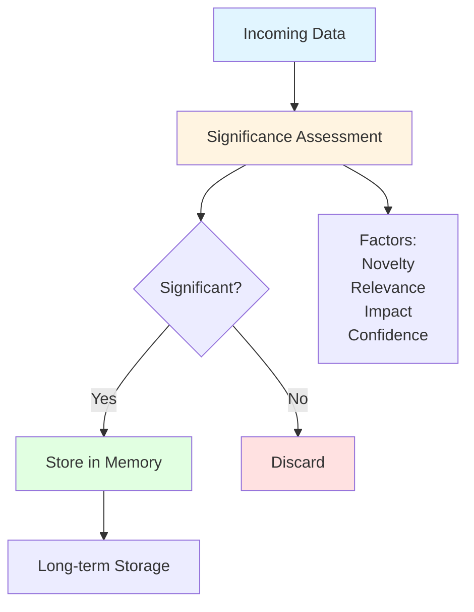
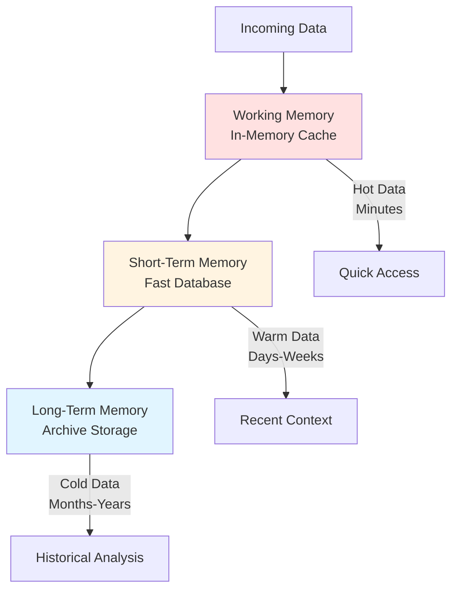
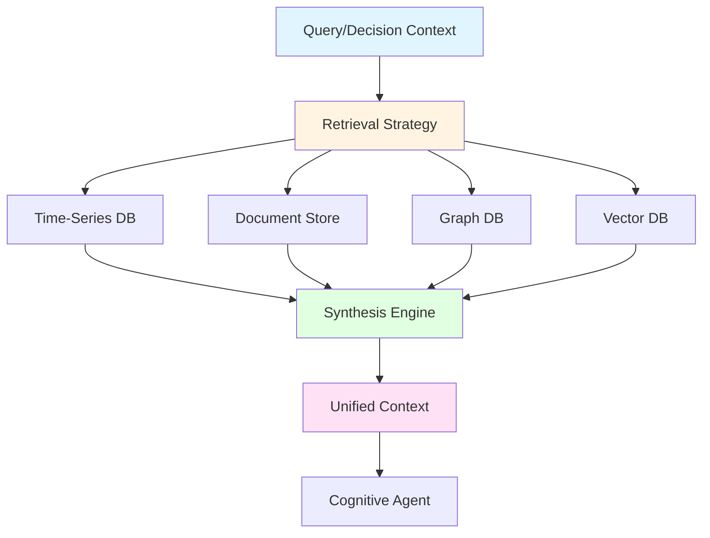
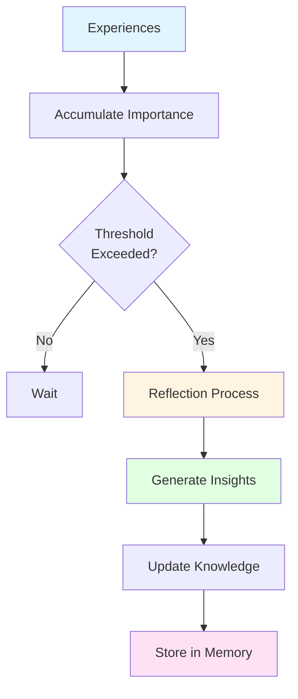

# Memory Patterns: Effective Knowledge Management

## Overview

Memory patterns provide proven approaches for managing agent knowledge across different timescales and access patterns. These patterns address the fundamental challenge of knowledge management in autonomous systems: how agents store, retrieve, consolidate, and learn from experience while maintaining efficiency and relevance.

Effective memory management is critical for agent intelligence—the right memory pattern enables agents to learn from experience, make informed decisions, and adapt to changing conditions while poor memory structures lead to information overload, irrelevant context, and missed learning opportunities.

### Why Memory Patterns Matter

**The Challenge**: Industrial agents must manage vast amounts of operational data, distinguish signal from noise, retrieve relevant context quickly, learn from experience, and maintain knowledge over time—all while operating within computational and storage constraints.

**The Solution**: Proven memory patterns that match storage and retrieval strategies to information characteristics and decision needs, ensuring efficient, relevant, and adaptive knowledge management.

**The Result**: Intelligent agents that learn continuously, make context-aware decisions, and improve performance over time without being overwhelmed by data volume.

---

## Theoretical Foundations

### Cognitive Science

**Human Memory Models** (Atkinson & Shiffrin, 1968):
- Sensory memory (immediate perception)
- Short-term/working memory (active processing)
- Long-term memory (permanent storage)
- Memory consolidation processes

**Levels of Processing** (Craik & Lockhart, 1972):
- Shallow processing (surface features)
- Deep processing (semantic meaning)
- Elaborative rehearsal
- Encoding specificity

**Forgetting Curves** (Ebbinghaus, 1885):
- Exponential decay of memory
- Spacing effect
- Retrieval practice benefits
- Interference theory

### Information Theory

**Information Value**:
- Relevance to current goals
- Novelty and surprise
- Predictive power
- Decision impact

**Storage Efficiency**:
- Compression techniques
- Redundancy elimination
- Hierarchical organization
- Semantic encoding

**Retrieval Optimization**:
- Indexing strategies
- Query optimization
- Caching policies
- Access patterns

### Database Theory

**Storage Models**:
- Relational databases (structured data)
- Document stores (semi-structured)
- Time-series databases (temporal data)
- Graph databases (relationships)
- Vector databases (embeddings)

**Query Optimization**:
- Index selection
- Query planning
- Join strategies
- Caching mechanisms

**Consistency Models**:
- ACID properties
- Eventual consistency
- Causal consistency
- Read/write trade-offs

### Machine Learning

**Continual Learning**:
- Catastrophic forgetting prevention
- Experience replay
- Progressive neural networks
- Elastic weight consolidation

**Memory-Augmented Networks**:
- Neural Turing Machines
- Differentiable Neural Computers
- Memory Networks
- Attention mechanisms

---

## Core Memory Patterns

### Pattern 1: Significance-First Storage

**When to Use**:
- High-volume data streams
- Limited storage capacity
- Need to focus on important information
- Signal-to-noise ratio low
- Real-time processing required
- Computational constraints exist

**Memory Structure**:


**Characteristics**:
- Filter before storage
- Significance scoring
- Threshold-based retention
- Automatic pruning
- Focus on valuable information
- Efficient resource usage

**Significance Calculation**:
```
Significance = w1×Novelty + w2×Relevance + w3×Impact + w4×Confidence

where:
  Novelty = 1 - Similarity_to_Existing_Knowledge
  Relevance = Alignment_with_Current_Goals
  Impact = Potential_Decision_Influence
  Confidence = Data_Quality_Score
  
  w1 + w2 + w3 + w4 = 1.0
```

**Threshold Strategy**:
```
Store if: Significance > Threshold

Adaptive Threshold:
  Threshold = Base_Threshold × (1 + Storage_Pressure)
  
  Storage_Pressure = Current_Storage / Max_Storage
```

**Example 1: Sensor Data Filtering**

**Scenario**: Equipment monitoring agent processing 1,000 sensor readings per second

**Significance Assessment**:
1. **Incoming Data**: Temperature reading 72.3°C
2. **Novelty Check**: 
   - Recent readings: 72.1°C, 72.2°C, 72.4°C
   - Novelty: 0.1 (very similar to recent)
3. **Relevance Check**:
   - Current goal: Monitor for anomalies
   - Normal range: 70-75°C
   - Relevance: 0.3 (within normal range)
4. **Impact Check**:
   - Would not trigger any decisions
   - Impact: 0.2 (low decision influence)
5. **Confidence Check**:
   - Sensor calibrated, stable
   - Confidence: 0.95 (high quality)
6. **Significance Score**:
   ```
   Significance = 0.25×0.1 + 0.35×0.3 + 0.30×0.2 + 0.10×0.95
   Significance = 0.025 + 0.105 + 0.06 + 0.095 = 0.285
   ```
7. **Decision**: Below threshold (0.5) → Discard, update running statistics only

**Contrast with Significant Event**:
1. **Incoming Data**: Temperature reading 78.5°C
2. **Novelty**: 0.9 (unusual spike)
3. **Relevance**: 0.9 (potential anomaly)
4. **Impact**: 0.8 (may trigger maintenance)
5. **Confidence**: 0.95
6. **Significance**: 0.25×0.9 + 0.35×0.9 + 0.30×0.8 + 0.10×0.95 = 0.875
7. **Decision**: Above threshold → **Store with high priority**

**Storage Efficiency**:
- Without filtering: 1,000 readings/sec = 86.4M readings/day
- With filtering (5% significant): 50 readings/sec = 4.3M readings/day
- Storage reduction: 95%
- Information retention: >99% (all significant events captured)

**Example 2: Quality Deviation Filtering**

**Scenario**: Quality monitoring agent processing product measurements

**Significance Factors**:
1. **Deviation Magnitude**: How far from specification
2. **Trend Significance**: Part of concerning pattern
3. **Customer Impact**: Affects critical customer
4. **Regulatory Relevance**: Reportable deviation

**Assessment**:
```
Measurement: pH 7.3 (spec: 7.0-7.5)
- Deviation: 0.3/0.5 = 0.6 (moderate)
- Trend: Stable, no pattern = 0.2
- Customer: Standard product = 0.3
- Regulatory: Within limits = 0.1
Significance: 0.4×0.6 + 0.3×0.2 + 0.2×0.3 + 0.1×0.1 = 0.37
Decision: Below threshold (0.5) → Discard

Measurement: pH 7.6 (spec: 7.0-7.5)
- Deviation: 0.6/0.5 = 1.0 (out of spec)
- Trend: Third consecutive increase = 0.8
- Customer: Critical account = 0.9
- Regulatory: Reportable = 1.0
Significance: 0.4×1.0 + 0.3×0.8 + 0.2×0.9 + 0.1×1.0 = 0.82
Decision: Above threshold → Store with investigation flag
```

**Advantages**:
- Dramatic storage reduction
- Focus on important information
- Automatic noise filtering
- Scalable to high-volume streams
- Computational efficiency

**Disadvantages**:
- Potential information loss
- Threshold tuning required
- May miss subtle patterns
- Significance assessment overhead

**Best Practices**:
- Calibrate significance weights for domain
- Use adaptive thresholds
- Maintain summary statistics even for discarded data
- Periodically review threshold effectiveness
- Log significance scores for tuning

**Success Metrics**:
- Storage reduction: >90%
- Significant event capture: >99%
- False positive rate: <5%
- Processing latency: <10ms per item

---

### Pattern 2: Multi-Store Architecture

**When to Use**:
- Different access patterns needed
- Varying data lifetimes
- Multiple query types
- Performance optimization required
- Cost-effective storage needed
- Compliance requirements exist

**Memory Structure**:


**Characteristics**:
- Tiered storage
- Automatic data migration
- Access-pattern optimization
- Cost-performance balance
- Lifecycle management
- Query routing

**Storage Tiers**:

**1. Working Memory (Hot)**:
- **Technology**: In-memory cache (Redis, Memcached)
- **Capacity**: 1-10 GB
- **Retention**: Minutes to hours
- **Access Time**: <1ms
- **Use Cases**: Active decisions, current context, real-time aggregations

**2. Short-Term Memory (Warm)**:
- **Technology**: Fast database (PostgreSQL, MongoDB)
- **Capacity**: 100 GB - 1 TB
- **Retention**: Days to weeks
- **Access Time**: 1-10ms
- **Use Cases**: Recent history, trend analysis, operational queries

**3. Long-Term Memory (Cold)**:
- **Technology**: Archive storage (S3, Data Lake)
- **Capacity**: Unlimited
- **Retention**: Months to years
- **Access Time**: 100ms - seconds
- **Use Cases**: Historical analysis, compliance, model training

**Data Migration Strategy**:
```
Migration Rules:
1. Working → Short-term: After 1 hour or when cache full
2. Short-term → Long-term: After 30 days or when database 80% full
3. Long-term → Archive: After 1 year, compressed

Access-Based Promotion:
- Frequently accessed data stays in faster tiers
- LRU (Least Recently Used) eviction
- Access count tracking
```

**Example 1: Equipment Monitoring**

**Scenario**: Monitor 100 pieces of equipment with 1-minute data intervals

**Data Flow**:
1. **Working Memory**: Current status of all equipment
   ```
   Equipment_Status: {
     PUMP-001: {
       temperature: 72.3,
       vibration: 2.1,
       status: "running",
       last_update: "2025-12-05T23:00:00Z"
     },
     // ... 99 more
   }
   ```
   - Size: ~100 KB
   - Access: Every decision (100+ times/minute)
   - Retention: Current values only

2. **Short-Term Memory**: Last 30 days of readings
   ```
   Time-series data:
   - 100 equipment × 1440 readings/day × 30 days = 4.3M readings
   - Size: ~500 MB
   - Access: Trend analysis, anomaly detection
   - Retention: 30 days
   ```

3. **Long-Term Memory**: Historical archive
   ```
   Compressed historical data:
   - Years of operational history
   - Size: ~50 GB (compressed)
   - Access: Model training, compliance reporting
   - Retention: 7 years (regulatory requirement)
   ```

**Query Routing**:
```
Query: "What is current temperature of PUMP-001?"
→ Working Memory (cache hit, <1ms)

Query: "Show temperature trend for PUMP-001 last 7 days"
→ Short-Term Memory (time-series query, ~10ms)

Query: "Analyze failure patterns over last 3 years"
→ Long-Term Memory (batch query, ~30 seconds)
```

**Example 2: Quality Management**

**Scenario**: Track product quality across production batches

**Multi-Store Design**:
1. **Working Memory**: Active batch quality metrics
   - Current batch measurements
   - Real-time quality score
   - Alert status
   - Size: ~1 MB
   - Retention: Until batch complete

2. **Short-Term Memory**: Recent batch history
   - Last 1,000 batches
   - Quality trends
   - Investigation notes
   - Size: ~10 GB
   - Retention: 90 days

3. **Long-Term Memory**: Complete quality archive
   - All historical batches
   - Regulatory documentation
   - Root cause analyses
   - Size: ~500 GB
   - Retention: 10 years

**Data Lifecycle**:
```
Batch Start:
  → Create entry in Working Memory
  → Stream measurements to Working Memory

Batch Complete:
  → Finalize quality score
  → Migrate to Short-Term Memory
  → Clear from Working Memory

After 90 Days:
  → Compress batch data
  → Migrate to Long-Term Memory
  → Remove from Short-Term Memory

After 10 Years:
  → Archive to cold storage
  → Maintain index for compliance queries
```

**Advantages**:
- Optimized performance for each access pattern
- Cost-effective storage
- Scalable architecture
- Automatic lifecycle management
- Query performance optimization

**Disadvantages**:
- Complexity in data migration
- Potential data inconsistency during migration
- Multiple systems to maintain
- Query routing logic required

**Best Practices**:
- Define clear migration policies
- Implement automatic data lifecycle management
- Use appropriate technology for each tier
- Monitor tier utilization
- Optimize query routing

**Success Metrics**:
- Working memory hit rate: >95%
- Short-term query latency: <10ms (p95)
- Long-term query success: 100%
- Storage cost optimization: >60% vs. single-tier

---

### Pattern 3: Context-Aware Retrieval

**When to Use**:
- Decisions need relevant historical context
- Multiple data sources available
- Context improves decision quality
- Semantic search beneficial
- Relationship traversal needed
- Synthesis required

**Retrieval Structure**:


**Characteristics**:
- Multi-database queries
- Semantic search
- Relationship traversal
- Context synthesis
- Relevance ranking
- Adaptive retrieval

**Retrieval Strategies**:

**1. Temporal Context**:
```
Query: Recent history relevant to current situation
Source: Time-series database
Example: "Equipment behavior last 24 hours before similar events"
```

**2. Semantic Context**:
```
Query: Conceptually similar situations
Source: Vector database (embeddings)
Example: "Past incidents with similar symptoms"
```

**3. Relational Context**:
```
Query: Connected entities and relationships
Source: Graph database
Example: "Upstream/downstream equipment affected by this issue"
```

**4. Procedural Context**:
```
Query: Relevant procedures and guidelines
Source: Document store
Example: "Maintenance procedures for this equipment type"
```

**Example 1: Predictive Maintenance Decision**

**Scenario**: Agent deciding on maintenance timing for equipment showing anomaly

**Context Retrieval**:
1. **Temporal Context** (Time-Series DB):
   ```
   Query: Equipment behavior last 7 days
   Retrieved:
   - Gradual vibration increase: 2.1 → 2.8 mm/s
   - Temperature stable: 72°C ± 1°C
   - Operating hours: 15,420 → 15,588 (168 hours)
   ```

2. **Semantic Context** (Vector DB):
   ```
   Query: Similar vibration patterns
   Retrieved (by similarity):
   - Case #1247: Similar pattern, bearing failure after 3 days (similarity: 0.89)
   - Case #0892: Similar pattern, alignment issue resolved (similarity: 0.82)
   - Case #1556: Similar pattern, false alarm (similarity: 0.75)
   ```

3. **Relational Context** (Graph DB):
   ```
   Query: Connected equipment and dependencies
   Retrieved:
   - Upstream: Feed pump (critical dependency)
   - Downstream: 3 production lines (high impact)
   - Spare parts: Bearing available, 2-hour replacement
   - Maintenance crew: Available tonight 10 PM - 6 AM
   ```

4. **Procedural Context** (Document Store):
   ```
   Query: Maintenance procedures for this equipment
   Retrieved:
   - Vibration analysis guidelines
   - Bearing replacement procedure
   - Safety protocols
   - Quality impact assessment
   ```

**Context Synthesis**:
```
Unified Context:
{
  current_state: {
    vibration: 2.8,
    trend: "increasing",
    severity: "moderate"
  },
  historical_precedents: [
    {case: "#1247", outcome: "failure", confidence: 0.89},
    {case: "#0892", outcome: "resolved", confidence: 0.82}
  ],
  impact_analysis: {
    downstream_risk: "high",
    spare_parts: "available",
    maintenance_window: "tonight 10PM-6AM"
  },
  recommendations: {
    action: "schedule_maintenance",
    timing: "tonight",
    confidence: 0.85,
    rationale: "Pattern matches bearing failure case #1247"
  }
}
```

**Decision**: Schedule maintenance tonight based on comprehensive context

**Example 2: Quality Investigation**

**Scenario**: Agent investigating quality deviation

**Context Retrieval**:
1. **Temporal**: Recent process parameters
2. **Semantic**: Similar quality issues
3. **Relational**: Supplier changes, equipment maintenance
4. **Procedural**: Investigation procedures, root cause templates

**Synthesis**: Comprehensive investigation context enabling faster root cause identification

**Retrieval Optimization**:

**1. Query Planning**:
```
Parallel Queries:
- Execute all database queries simultaneously
- Aggregate results as they arrive
- Timeout: 100ms per query

Sequential Queries:
- Use results from one query to inform next
- Adaptive depth based on findings
- Stop when sufficient context gathered
```

**2. Relevance Ranking**:
```
Relevance Score = w1×Recency + w2×Similarity + w3×Impact + w4×Confidence

Sort retrieved items by relevance
Return top N items (typically N=10-20)
```

**3. Caching Strategy**:
```
Cache frequently accessed context
Cache duration based on data volatility
Invalidate cache on relevant updates
```

**Advantages**:
- Rich, comprehensive context
- Multiple perspectives
- Semantic understanding
- Relationship awareness
- Improved decision quality

**Disadvantages**:
- Query complexity
- Latency from multiple sources
- Synthesis overhead
- Potential information overload

**Best Practices**:
- Parallel query execution
- Relevance-based filtering
- Context summarization
- Caching strategies
- Timeout management

**Success Metrics**:
- Context retrieval time: <100ms (p95)
- Context relevance: >85%
- Decision improvement: >20% with context
- Cache hit rate: >80%

---

### Pattern 4: Importance-Triggered Consolidation

**When to Use**:
- Learning from experience needed
- Pattern recognition beneficial
- Insight generation valuable
- Knowledge synthesis required
- Continuous improvement desired
- Computational resources available

**Consolidation Structure**:


**Characteristics**:
- Automatic triggering
- Importance accumulation
- Reflection process
- Insight generation
- Knowledge update
- Continuous learning

**Importance Accumulation**:
```
Cumulative_Importance = Σ(Experience_Importance)

Trigger Consolidation when:
  Cumulative_Importance > Threshold
  OR Time_Since_Last_Consolidation > Max_Interval
  OR Critical_Event_Occurred
```

**Reflection Process**:
1. **Gather Recent Experiences**: Collect experiences since last consolidation
2. **Identify Patterns**: Look for recurring themes, trends, anomalies
3. **Generate Insights**: Synthesize learnings and recommendations
4. **Update Models**: Refine decision models based on outcomes
5. **Store Knowledge**: Save insights to long-term memory

**Example 1: Maintenance Strategy Learning**

**Scenario**: Agent learning optimal maintenance timing

**Experience Accumulation**:
```
Week 1-4 Experiences:
1. Early maintenance (health_score: 0.85)
   - Outcome: No issues found
   - Cost: $5,000
   - Importance: 0.3 (unnecessary maintenance)

2. Delayed maintenance (health_score: 0.65)
   - Outcome: Bearing failure during operation
   - Cost: $25,000 + downtime
   - Importance: 0.9 (costly failure)

3. Optimal timing (health_score: 0.75)
   - Outcome: Bearing wear detected, replaced
   - Cost: $6,000
   - Importance: 0.7 (good outcome)

4. Optimal timing (health_score: 0.78)
   - Outcome: Minor issues corrected
   - Cost: $5,500
   - Importance: 0.6 (good outcome)

Cumulative_Importance = 0.3 + 0.9 + 0.7 + 0.6 = 2.5
Threshold = 2.0
→ Trigger Consolidation
```

**Reflection Process**:
```
Pattern Analysis:
- Health score 0.75-0.80: Optimal maintenance window
- Health score >0.85: Too early (waste)
- Health score <0.70: Too late (risk)

Insight Generation:
"Optimal maintenance timing is when health score reaches 0.75-0.80.
This balances cost ($5,500 avg) vs. risk (no failures).
Early maintenance (>0.85) wastes resources.
Late maintenance (<0.70) risks costly failures."

Model Update:
- Maintenance threshold: 0.75 (was 0.80)
- Confidence in threshold: 0.85
- Expected cost at threshold: $5,500
- Failure risk at threshold: <5%
```

**Knowledge Storage**:
```
Consolidated Memory Entry:
{
  type: "maintenance_strategy_insight",
  timestamp: "2025-12-05T23:00:00Z",
  insight: "Optimal maintenance at health_score 0.75-0.80",
  evidence: [
    {experience_id: "exp_001", outcome: "waste"},
    {experience_id: "exp_002", outcome: "failure"},
    {experience_id: "exp_003", outcome: "optimal"},
    {experience_id: "exp_004", outcome: "optimal"}
  ],
  confidence: 0.85,
  impact: "high",
  application: "Update maintenance scheduling threshold"
}
```

**Example 2: Quality Parameter Learning**

**Scenario**: Agent learning quality-process relationships

**Experience Accumulation**:
```
Batch 1-10 Experiences:
- Temperature 72°C → Quality 95% (importance: 0.5)
- Temperature 75°C → Quality 92% (importance: 0.6)
- Temperature 78°C → Quality 88% (importance: 0.7)
- Temperature 70°C → Quality 93% (importance: 0.6)
- pH 7.2 → Quality 96% (importance: 0.5)
- pH 7.5 → Quality 89% (importance: 0.7)
- Combined optimal → Quality 97% (importance: 0.8)

Cumulative_Importance = 4.4 > Threshold (3.0)
→ Trigger Consolidation
```

**Reflection**:
```
Pattern: Temperature 70-72°C and pH 7.0-7.2 yield highest quality

Insight: "Optimal quality achieved with:
- Temperature: 70-72°C (not 75°C as previously thought)
- pH: 7.0-7.2 (tighter control needed)
- Combined control more important than individual parameters"

Model Update:
- Target temperature: 71°C ± 1°C (was 73°C ± 2°C)
- Target pH: 7.1 ± 0.1 (was 7.2 ± 0.3)
- Expected quality: 96-97% (vs. 92-94% previous)
```

**Consolidation Triggers**:

**1. Importance Threshold**:
```
Trigger when: Cumulative_Importance > Threshold
Typical threshold: 2.0-5.0 (domain-dependent)
```

**2. Time-Based**:
```
Trigger when: Time_Since_Last > Max_Interval
Typical interval: Daily, weekly, or monthly
```

**3. Event-Based**:
```
Trigger when: Critical_Event or Significant_Change
Examples: Major failure, process change, new equipment
```

**4. Performance-Based**:
```
Trigger when: Performance_Degradation > Threshold
Indicates model drift, need for update
```

**Advantages**:
- Automatic learning
- Pattern recognition
- Knowledge synthesis
- Continuous improvement
- Adaptive behavior

**Disadvantages**:
- Computational overhead
- Potential for incorrect insights
- Requires sufficient data
- May need human validation

**Best Practices**:
- Set appropriate importance thresholds
- Validate insights before applying
- Track insight effectiveness
- Maintain audit trail
- Allow human override

**Success Metrics**:
- Insights generated: >1 per week
- Insight accuracy: >85%
- Performance improvement: >10% from insights
- Consolidation efficiency: <5 minutes per cycle

---

## Pattern Selection Framework

### Selection Matrix

| Requirement | Recommended Pattern |
|-------------|-------------------|
| High-volume streams | Significance-First Storage |
| Multiple access patterns | Multi-Store Architecture |
| Context-rich decisions | Context-Aware Retrieval |
| Continuous learning | Importance-Triggered Consolidation |

### Selection Criteria

**1. Data Volume**:
- High volume → Significance-First Storage
- Moderate volume → Multi-Store Architecture
- Any volume → Context-Aware Retrieval

**2. Access Patterns**:
- Single pattern → Simple storage
- Multiple patterns → Multi-Store Architecture
- Complex queries → Context-Aware Retrieval

**3. Learning Needs**:
- No learning → Simple storage
- Continuous learning → Importance-Triggered Consolidation
- Pattern recognition → Context-Aware Retrieval + Consolidation

**4. Performance Requirements**:
- Ultra-fast → Working memory only
- Fast → Multi-Store with caching
- Flexible → Full multi-store architecture

---

## Best Practices

### Practice 1: Implement Significance Scoring

**Guideline**: Use rigorous significance assessment for all stored data

**Implementation**:
1. Define significance factors for domain
2. Assign appropriate weights
3. Calibrate thresholds
4. Monitor effectiveness
5. Adjust based on outcomes

**Benefit**: Efficient storage, focused attention

---

### Practice 2: Design for Multiple Timescales

**Guideline**: Support different data lifetimes and access patterns

**Implementation**:
1. Identify access patterns
2. Design appropriate tiers
3. Define migration policies
4. Implement automatic lifecycle management
5. Monitor tier utilization

**Benefit**: Optimized performance and cost

---

### Practice 3: Enable Rich Context Retrieval

**Guideline**: Provide comprehensive context for decisions

**Implementation**:
1. Identify relevant data sources
2. Design retrieval strategies
3. Implement synthesis logic
4. Optimize query performance
5. Cache frequently accessed context

**Benefit**: Improved decision quality

---

### Practice 4: Automate Learning

**Guideline**: Enable continuous learning from experience

**Implementation**:
1. Track experience importance
2. Define consolidation triggers
3. Implement reflection process
4. Generate actionable insights
5. Update models automatically

**Benefit**: Continuous improvement

---

### Practice 5: Monitor Memory Health

**Guideline**: Continuously monitor memory system performance

**Metrics to Track**:
- Storage utilization
- Query performance
- Cache hit rates
- Consolidation effectiveness
- Learning outcomes

**Benefit**: Early detection of issues

---

## Common Pitfalls

### Pitfall 1: Storing Everything

**Problem**: No filtering, overwhelming storage

**Symptoms**:
- Storage costs escalating
- Query performance degrading
- Difficulty finding relevant information
- System slowdown

**Solution**: Implement Significance-First Storage

**Prevention**: Design filtering from start

---

### Pitfall 2: Single-Tier Storage

**Problem**: One storage system for all access patterns

**Symptoms**:
- Slow queries
- High costs
- Poor performance
- Scalability issues

**Solution**: Implement Multi-Store Architecture

**Prevention**: Analyze access patterns early

---

### Pitfall 3: Context-Free Decisions

**Problem**: Decisions made without relevant historical context

**Symptoms**:
- Repeated mistakes
- Suboptimal decisions
- Missed patterns
- Poor learning

**Solution**: Implement Context-Aware Retrieval

**Prevention**: Design for context from start

---

### Pitfall 4: No Learning Mechanism

**Problem**: Agent doesn't learn from experience

**Symptoms**:
- Static behavior
- No improvement over time
- Repeated errors
- Missed optimization opportunities

**Solution**: Implement Importance-Triggered Consolidation

**Prevention**: Build learning into architecture

---

### Pitfall 5: Inadequate Consolidation

**Problem**: Insights not generated or applied

**Symptoms**:
- Knowledge not synthesized
- Patterns not recognized
- No performance improvement
- Wasted experiences

**Solution**: Proper consolidation triggers and processes

**Prevention**: Design reflection mechanisms

---

## Measuring Memory Effectiveness

### Key Metrics

**Storage Efficiency**:
```
Storage_Efficiency = Significant_Data_Stored / Total_Data_Received
Target: >90% reduction with >99% information retention
```

**Retrieval Performance**:
```
Retrieval_Latency = Time_to_Retrieve_Context
Target: <100ms (p95)
```

**Context Relevance**:
```
Context_Relevance = Relevant_Items / Total_Items_Retrieved
Target: >85%
```

**Learning Effectiveness**:
```
Learning_Rate = Performance_Improvement / Time_Period
Target: >10% improvement per quarter
```

**Memory Utilization**:
```
Utilization = Used_Storage / Available_Storage
Target: 60-80% (allows growth, avoids waste)
```

---

## Advanced Topics

### Semantic Memory Organization

**Concept**: Organize memory by meaning rather than just time or type

**Approaches**:
- Vector embeddings for similarity search
- Concept hierarchies
- Semantic clustering
- Knowledge graphs

**Benefits**:
- Better context retrieval
- Pattern recognition
- Analogical reasoning
- Transfer learning

---

### Adaptive Forgetting

**Concept**: Intelligently forget less important information

**Strategies**:
- Importance-based retention
- Access-based retention
- Decay functions
- Selective consolidation

**Benefits**:
- Storage efficiency
- Focus on relevant information
- Reduced noise
- Better performance

---

### Memory Compression

**Concept**: Compress stored information without losing essential meaning

**Techniques**:
- Summarization
- Abstraction
- Prototype extraction
- Hierarchical encoding

**Benefits**:
- Storage savings
- Faster retrieval
- Clearer patterns
- Reduced redundancy

---

## Related Documentation

- [Memory Systems](../concepts/memory-systems.md)
- [Memory Significance](../cognitive-intelligence/memory-significance.md)
- [Memory Management](../cognitive-intelligence/memory-management.md)
- [Synthetic Memory](../cognitive-intelligence/synthetic-memory.md)
- [Data Architecture](../architecture/data-architecture.md)

---

## References

### Cognitive Science
- Atkinson, R. C., & Shiffrin, R. M. (1968). "Human Memory: A Proposed System and its Control Processes"
- Craik, F. I., & Lockhart, R. S. (1972). "Levels of Processing: A Framework for Memory Research"
- Ebbinghaus, H. (1885). "Memory: A Contribution to Experimental Psychology"

### Information Theory
- Shannon, C. E. (1948). "A Mathematical Theory of Communication"
- Cover, T. M., & Thomas, J. A. (2006). "Elements of Information Theory"

### Database Theory
- Codd, E. F. (1970). "A Relational Model of Data for Large Shared Data Banks"
- DeWitt, D. J., & Gray, J. (1992). "Parallel Database Systems: The Future of High Performance Database Systems"

### Machine Learning
- Kirkpatrick, J., et al. (2017). "Overcoming Catastrophic Forgetting in Neural Networks"
- Graves, A., et al. (2014). "Neural Turing Machines"
- Weston, J., et al. (2015). "Memory Networks"

### Multi-Agent Systems
- Wooldridge, M. (2009). "An Introduction to MultiAgent Systems"
- Stone, P., & Veloso, M. (2000). "Multiagent Systems: A Survey from a Machine Learning Perspective"

---

**Document Version**: 2.0
**Last Updated**: December 5, 2025
**Status**: ✅ Enhanced to Match Phases 1-4 Quality Standard