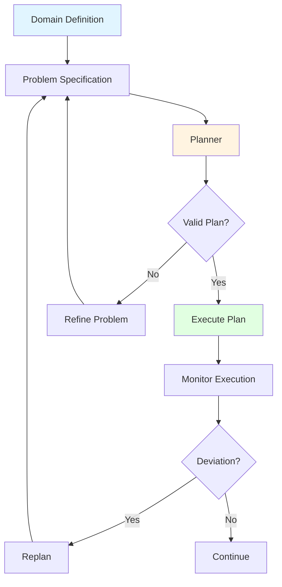
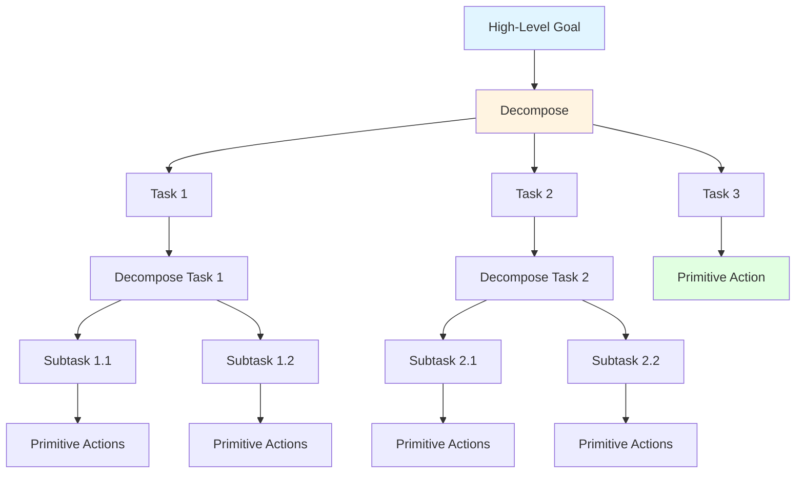
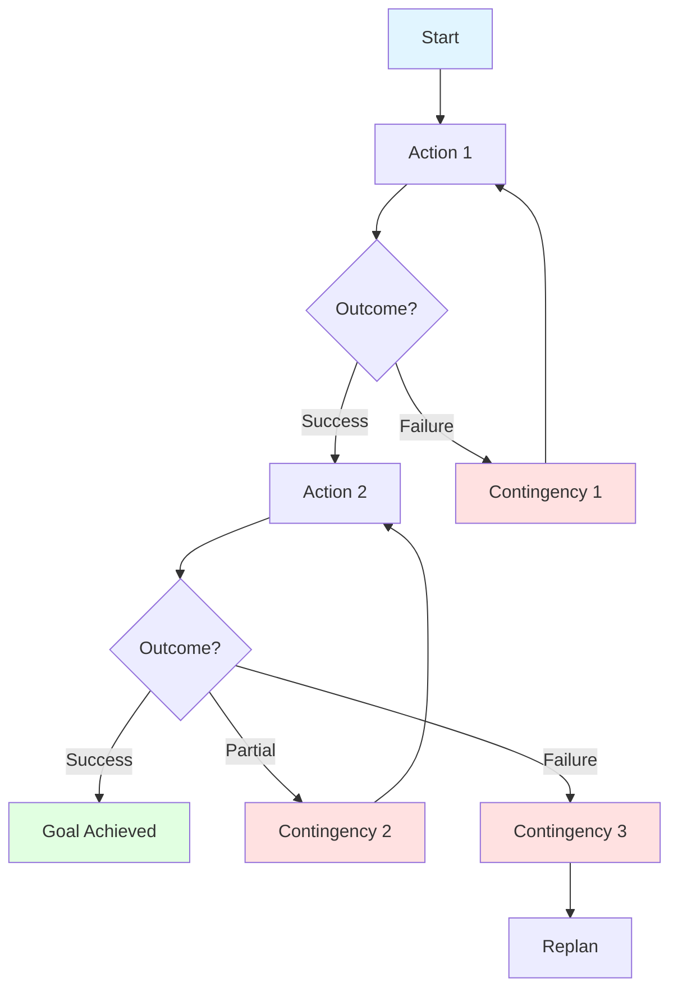
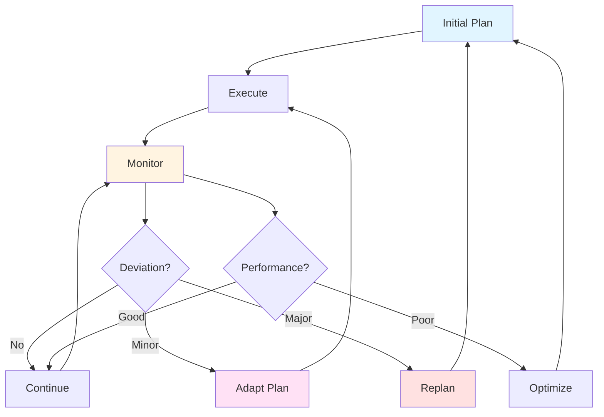

# Planning Patterns: Strategic Action Sequencing

## Overview

Planning patterns provide proven strategies for generating, optimizing, and adapting action sequences in multi-agent systems. These patterns address the fundamental challenge of autonomous planning: how agents determine what actions to take, in what order, to achieve goals effectively while handling uncertainty, constraints, and dynamic conditions.

Effective planning is critical for agent autonomy—the right planning pattern enables agents to achieve complex goals efficiently while poor planning approaches lead to suboptimal actions, missed opportunities, and inability to adapt to changing conditions.

### Why Planning Patterns Matter

**The Challenge**: Industrial agents must plan actions across multiple timescales, handle complex constraints, coordinate with other agents, adapt to changing conditions, and optimize for multiple objectives—all while operating under time pressure and uncertainty.

**The Solution**: Proven planning patterns that match planning approach to problem characteristics, ensuring effective, efficient, and adaptive action sequencing.

**The Result**: Agents that achieve goals reliably, adapt to changes gracefully, and optimize performance continuously.

---

## Theoretical Foundations

### Automated Planning

**Classical Planning** (Fikes & Nilsson, 1971):
- State-space search
- Goal-directed reasoning
- Action preconditions and effects
- Plan validation

**PDDL (Planning Domain Definition Language)**:
- Domain modeling
- Problem specification
- Planner independence
- Standardized representation

**Planning Algorithms**:
- Forward search (progression)
- Backward search (regression)
- Heuristic search (A*, IDA*)
- Satisfiability-based planning

### Hierarchical Planning

**HTN (Hierarchical Task Networks)** (Erol et al., 1994):
- Task decomposition
- Method selection
- Hierarchical abstraction
- Constraint propagation

**Abstraction Hierarchies**:
- Multiple levels of detail
- Top-down refinement
- Bottom-up aggregation
- Level-appropriate reasoning

### Temporal Planning

**Temporal Reasoning**:
- Duration constraints
- Temporal ordering
- Resource allocation over time
- Deadline management

**Scheduling**:
- Resource-constrained scheduling
- Job shop scheduling
- Critical path analysis
- Makespan optimization

### Contingency Planning

**Decision Theory Under Uncertainty**:
- Probability distributions
- Expected utility
- Risk assessment
- Robust planning

**Conditional Planning**:
- Branching plans
- Sensing actions
- Belief state tracking
- Contingency handling

### Multi-Agent Planning

**Distributed Planning**:
- Plan merging
- Conflict resolution
- Coordination mechanisms
- Communication protocols

**Cooperative Planning**:
- Joint goals
- Shared resources
- Coordinated actions
- Team strategies

---

## Core Planning Patterns

### Pattern 1: PDDL-Based Planning

**When to Use**:
- Formal planning required
- Complex action sequences needed
- Constraints must be satisfied
- Optimality important
- Domain well-defined
- Computational resources available

**Planning Structure**:


**Characteristics**:
- Formal domain modeling
- Declarative problem specification
- Automated plan generation
- Optimality guarantees (with appropriate planner)
- Plan validation
- Reusable domain models

**PDDL Components**:

**1. Domain Definition**:
```
(define (domain maintenance)
  (:requirements :strips :typing :durative-actions)
  
  (:types
    equipment location technician tool
  )
  
  (:predicates
    (at ?e - equipment ?l - location)
    (available ?t - technician)
    (has-tool ?t - technician ?tool - tool)
    (needs-maintenance ?e - equipment)
    (operational ?e - equipment)
  )
  
  (:action perform-maintenance
    :parameters (?e - equipment ?t - technician ?l - location)
    :precondition (and
      (at ?e ?l)
      (available ?t)
      (needs-maintenance ?e)
      (has-tool ?t wrench)
    )
    :effect (and
      (not (needs-maintenance ?e))
      (operational ?e)
      (not (available ?t))
    )
  )
)
```

**2. Problem Specification**:
```
(define (problem maintenance-problem-1)
  (:domain maintenance)
  
  (:objects
    pump-001 pump-002 - equipment
    bay-1 bay-2 - location
    tech-1 tech-2 - technician
    wrench-1 wrench-2 - tool
  )
  
  (:init
    (at pump-001 bay-1)
    (at pump-002 bay-2)
    (available tech-1)
    (available tech-2)
    (has-tool tech-1 wrench-1)
    (has-tool tech-2 wrench-2)
    (needs-maintenance pump-001)
    (needs-maintenance pump-002)
  )
  
  (:goal (and
    (operational pump-001)
    (operational pump-002)
  ))
)
```

**3. Generated Plan**:
```
Plan:
1. perform-maintenance(pump-001, tech-1, bay-1)
2. perform-maintenance(pump-002, tech-2, bay-2)

Makespan: 2 time units (parallel execution)
Cost: 2 actions
```

**Example 1: Maintenance Procedure Planning**

**Scenario**: Plan maintenance sequence for multiple equipment items

**Domain**: Equipment maintenance with constraints
- Equipment locations
- Technician availability
- Tool requirements
- Safety protocols
- Time windows

**Problem**: Maintain 5 pieces of equipment with 3 technicians

**Planning Process**:
1. **Define Domain**: Equipment, technicians, tools, locations, actions
2. **Specify Problem**: Initial state, goal state, constraints
3. **Generate Plan**: Use PDDL planner (e.g., Fast Downward)
4. **Validate Plan**: Check all constraints satisfied
5. **Execute Plan**: Coordinate technicians
6. **Monitor**: Track execution, replan if needed

**Generated Plan**:
```
Time 0-2h: tech-1 maintains pump-001 at bay-1
Time 0-2h: tech-2 maintains compressor-001 at bay-2
Time 2-4h: tech-1 maintains valve-001 at bay-1
Time 2-4h: tech-3 maintains pump-002 at bay-3
Time 4-6h: tech-2 maintains motor-001 at bay-2

Total time: 6 hours
Parallel efficiency: 83% (5 tasks / 6 hours / 3 techs)
```

**Example 2: Production Sequence Planning**

**Scenario**: Plan production sequence to meet orders

**Domain**: Manufacturing with setup times, quality requirements, deadlines

**Problem**: Schedule 10 orders across 3 production lines

**Constraints**:
- Setup times between product types
- Quality requirements per order
- Delivery deadlines
- Resource availability
- Maintenance windows

**Planning Result**:
- Optimal sequence minimizing setup times
- All deadlines met
- Quality requirements satisfied
- 15% improvement over manual scheduling

**Advantages**:
- Formal correctness guarantees
- Optimal or near-optimal plans
- Handles complex constraints
- Reusable domain models
- Automated plan generation

**Disadvantages**:
- Requires formal domain modeling
- Computational complexity for large problems
- May not handle all real-world nuances
- Replanning overhead
- Domain modeling expertise needed

**Best Practices**:
- Start with simple domain, refine iteratively
- Use appropriate planner for problem characteristics
- Validate plans before execution
- Monitor execution closely
- Maintain domain model as system evolves

**Success Metrics**:
- Plan generation time: <1 minute for typical problems
- Plan quality: >90% of optimal
- Constraint satisfaction: 100%
- Execution success rate: >95%

---

### Pattern 2: Hierarchical Planning (HTN)

**When to Use**:
- Complex goals need decomposition
- Multiple abstraction levels beneficial
- Domain knowledge available
- Procedural knowledge exists
- Scalability important
- Human-like reasoning desired

**Planning Structure**:


**Characteristics**:
- Top-down decomposition
- Multiple abstraction levels
- Method selection
- Procedural knowledge encoding
- Hierarchical constraints
- Scalable planning

**HTN Components**:

**1. Task Hierarchy**:
```
High-Level Task: Optimize Production
├── Task: Analyze Current State
│   ├── Subtask: Collect Performance Data
│   ├── Subtask: Identify Bottlenecks
│   └── Subtask: Calculate Metrics
├── Task: Generate Improvement Plan
│   ├── Subtask: Evaluate Options
│   ├── Subtask: Select Best Option
│   └── Subtask: Create Action Sequence
└── Task: Implement Improvements
    ├── Subtask: Adjust Parameters
    ├── Subtask: Verify Changes
    └── Subtask: Monitor Results
```

**2. Decomposition Methods**:
```
Method: Optimize-Production-Method-1
  Task: Optimize Production
  Preconditions:
    - Production data available
    - System operational
  Decomposition:
    1. Analyze Current State
    2. Generate Improvement Plan
    3. Implement Improvements
  Constraints:
    - Sequential execution
    - Each step must succeed before next
```

**Example 1: Multi-System Optimization**

**Scenario**: Optimize interconnected production systems

**High-Level Goal**: Maximize overall throughput while maintaining quality

**Hierarchical Decomposition**:

**Level 1 - Strategic**:
```
Goal: Optimize Production System
├── Analyze System Performance
├── Identify Optimization Opportunities
├── Plan Improvements
└── Execute Optimization
```

**Level 2 - Tactical**:
```
Analyze System Performance:
├── Collect Data from All Systems
├── Calculate Performance Metrics
├── Identify Bottlenecks
└── Assess Interdependencies

Identify Optimization Opportunities:
├── Evaluate Bottleneck Solutions
├── Assess Parameter Adjustments
├── Consider Equipment Upgrades
└── Analyze Scheduling Changes
```

**Level 3 - Operational**:
```
Collect Data from All Systems:
├── Query System A sensors
├── Query System B sensors
├── Query System C sensors
└── Aggregate data

Calculate Performance Metrics:
├── Compute throughput
├── Compute quality scores
├── Compute efficiency
└── Compute utilization
```

**Execution**:
1. **Strategic Level**: Decide to optimize production
2. **Tactical Level**: Identify bottleneck in System B
3. **Operational Level**: Adjust System B parameters
4. **Result**: 12% throughput increase, quality maintained

**Example 2: Emergency Response Planning**

**Scenario**: Plan coordinated emergency response

**High-Level Goal**: Safely shut down affected systems, contain issue, restore operations

**Hierarchical Plan**:

**Level 1 - Emergency Response**:
```
1. Assess Situation
2. Ensure Safety
3. Contain Problem
4. Restore Operations
```

**Level 2 - Ensure Safety** (decomposed):
```
1. Identify Affected Systems
2. Shut Down Critical Systems
3. Evacuate Personnel if Needed
4. Verify Safety Status
```

**Level 3 - Shut Down Critical Systems** (decomposed):
```
1. Stop System A (highest priority)
2. Stop System B (dependent on A)
3. Stop System C (can run independently)
4. Verify all systems stopped
```

**Advantages**:
- Natural problem decomposition
- Scalable to complex problems
- Encodes domain expertise
- Human-readable plans
- Flexible abstraction levels

**Disadvantages**:
- Requires domain knowledge encoding
- Method selection complexity
- May miss optimal solutions
- Maintenance of task hierarchy

**Best Practices**:
- Design clear abstraction levels
- Encode domain expertise in methods
- Validate decompositions
- Monitor at appropriate levels
- Refine hierarchy based on experience

**Success Metrics**:
- Decomposition depth: 3-5 levels typical
- Planning time: <10 seconds for typical problems
- Plan quality: >85% of optimal
- Execution success: >90%

---

### Pattern 3: Contingency Planning

**When to Use**:
- High uncertainty
- Multiple possible outcomes
- Risk management critical
- Failure modes known
- Robustness required
- Backup plans needed

**Planning Structure**:


**Characteristics**:
- Multiple plan branches
- Conditional execution
- Sensing actions
- Failure handling
- Risk mitigation
- Robust execution

**Contingency Planning Approach**:

**1. Identify Uncertainties**:
```
Primary Plan: Perform maintenance during night shift
Uncertainties:
- Equipment condition worse than expected
- Parts not available
- Technician unavailable
- Unexpected complications
- Time overrun
```

**2. Develop Contingencies**:
```
Contingency 1: Equipment worse than expected
  → Extend maintenance window
  → Call additional technician
  → Use backup equipment

Contingency 2: Parts not available
  → Use alternative parts
  → Expedite parts delivery
  → Defer non-critical repairs

Contingency 3: Time overrun
  → Continue into day shift
  → Prioritize critical repairs
  → Schedule follow-up maintenance
```

**3. Define Triggers**:
```
Trigger Contingency 1 if:
  - Inspection reveals major damage
  - Repair time estimate > 4 hours

Trigger Contingency 2 if:
  - Required part not in stock
  - Part delivery delayed

Trigger Contingency 3 if:
  - 75% of time window used
  - <50% of work complete
```

**Example 1: Predictive Maintenance with Contingencies**

**Scenario**: Plan maintenance with uncertain equipment condition

**Primary Plan**:
```
1. Schedule maintenance for tonight 10 PM - 6 AM
2. Inspect equipment (expected: minor wear)
3. Replace worn parts (expected: 2 hours)
4. Test and verify (expected: 1 hour)
5. Return to service
```

**Contingencies**:

**Contingency A - Major Damage Found**:
```
Trigger: Inspection reveals bearing failure
Actions:
1. Notify operations of extended downtime
2. Call additional technician
3. Order emergency parts delivery
4. Extend maintenance window to 16 hours
5. Use backup equipment if available
```

**Contingency B - Parts Unavailable**:
```
Trigger: Required bearing not in stock
Actions:
1. Check alternative suppliers
2. Expedite delivery (4-hour delivery available)
3. Perform temporary repair if possible
4. Reschedule if necessary
5. Update inventory procedures
```

**Contingency C - Unexpected Complications**:
```
Trigger: Additional issues discovered during repair
Actions:
1. Assess criticality
2. Prioritize critical repairs
3. Defer non-critical items
4. Schedule follow-up maintenance
5. Document issues for future planning
```

**Execution**:
1. Start maintenance at 10 PM
2. Inspection at 10:30 PM reveals bearing failure (Contingency A triggered)
3. Additional technician called, arrives 11:30 PM
4. Emergency parts ordered, arrive 2 AM
5. Repair completed 5 AM
6. Testing completed 6 AM
7. Equipment returned to service

**Result**: Contingency plan enabled successful completion despite major issue

**Example 2: Production Scheduling with Contingencies**

**Scenario**: Schedule production with uncertain demand and equipment reliability

**Primary Plan**:
```
Week 1: Produce 1000 units Product A
Week 2: Produce 800 units Product B
Week 3: Produce 1200 units Product A
```

**Contingencies**:

**Demand Surge**:
```
Trigger: Customer orders increase >20%
Actions:
1. Add overtime shifts
2. Prioritize high-margin products
3. Defer non-urgent orders
4. Communicate new delivery dates
```

**Equipment Failure**:
```
Trigger: Production line failure
Actions:
1. Switch to backup line
2. Reduce production rate
3. Reschedule orders
4. Expedite repairs
```

**Quality Issues**:
```
Trigger: Quality deviation detected
Actions:
1. Stop affected production
2. Investigate root cause
3. Implement corrective action
4. Revalidate process
5. Resume production
```

**Advantages**:
- Robust to uncertainty
- Prepared for failures
- Faster response to issues
- Reduced downtime
- Better risk management

**Disadvantages**:
- Planning complexity
- Resource overhead for contingencies
- May over-prepare for unlikely events
- Maintenance of contingency plans

**Best Practices**:
- Identify critical uncertainties
- Develop realistic contingencies
- Define clear triggers
- Test contingency plans
- Update based on experience

**Success Metrics**:
- Contingency activation rate: 10-20% (indicates appropriate planning)
- Recovery time: <target for each contingency
- Plan robustness: >90% goal achievement despite uncertainties
- Contingency effectiveness: >85% successful recovery

---

### Pattern 4: Adaptive Planning

**When to Use**:
- Dynamic environment
- Frequent changes
- Real-time adaptation needed
- Monitoring available
- Replanning feasible
- Flexibility valued

**Planning Structure**:


**Characteristics**:
- Continuous monitoring
- Deviation detection
- Dynamic replanning
- Performance optimization
- Adaptive behavior
- Learning from execution

**Adaptive Planning Cycle**:

**1. Plan**:
```
Generate initial plan based on current state and goals
```

**2. Execute**:
```
Begin plan execution, track progress
```

**3. Monitor**:
```
Continuously monitor:
- Plan execution progress
- Environmental changes
- Performance metrics
- Constraint violations
```

**4. Detect Deviations**:
```
Compare actual vs. expected:
- State deviations
- Timing deviations
- Resource deviations
- Performance deviations
```

**5. Adapt or Replan**:
```
Minor deviation → Adapt current plan
Major deviation → Generate new plan
Performance issue → Optimize plan
```

**Example 1: Dynamic Production Scheduling**

**Scenario**: Adapt production schedule to changing conditions

**Initial Plan**:
```
Day 1: Produce 500 units Product A (Line 1)
Day 2: Produce 400 units Product B (Line 1)
Day 3: Produce 600 units Product A (Line 2)
```

**Execution with Adaptation**:

**Day 1, 10 AM**:
- **Monitoring**: Line 1 running at 90% efficiency (expected: 100%)
- **Deviation**: Minor performance degradation
- **Adaptation**: Extend Day 1 production by 1 hour to meet target
- **Result**: 500 units produced as planned

**Day 1, 3 PM**:
- **Monitoring**: Urgent order received for 200 units Product C
- **Deviation**: Major change (new priority order)
- **Replanning**:
  ```
  New Plan:
  Day 1: Complete Product A (500 units) ✓
  Day 2: Produce 200 units Product C (Line 1) - NEW
  Day 2: Produce 300 units Product B (Line 2) - ADJUSTED
  Day 3: Produce 600 units Product A (Line 2)
  Day 3: Produce 100 units Product B (Line 1) - ADDED
  ```
- **Result**: Urgent order accommodated, original orders rescheduled

**Day 2, 11 AM**:
- **Monitoring**: Line 2 failure detected
- **Deviation**: Major equipment failure
- **Replanning**:
  ```
  New Plan:
  Day 2: Complete Product C on Line 1 (200 units) ✓
  Day 2: Move Product B to Line 1 (150 units partial)
  Day 3: Complete Product B on Line 1 (150 units)
  Day 3: Repair Line 2
  Day 4: Produce Product A on Line 2 (600 units) - DELAYED
  ```
- **Result**: Adapted to equipment failure, minimized impact

**Adaptation Metrics**:
- Replanning frequency: 2 times in 3 days
- Adaptation time: <30 minutes per replan
- Goal achievement: 100% (all orders fulfilled)
- Customer impact: Minimal (1-day delay on non-urgent order)

**Example 2: Adaptive Maintenance Scheduling**

**Scenario**: Adapt maintenance schedule based on equipment health monitoring

**Initial Plan**:
```
Week 1: Maintain Equipment A
Week 2: Maintain Equipment B
Week 3: Maintain Equipment C
Week 4: Maintain Equipment D
```

**Adaptive Execution**:

**Week 1, Day 3**:
- **Monitoring**: Equipment C health score drops to 0.65 (threshold: 0.70)
- **Deviation**: Unexpected degradation
- **Adaptation**: Move Equipment C maintenance to Week 2, delay Equipment B
- **New Plan**:
  ```
  Week 1: Maintain Equipment A ✓
  Week 2: Maintain Equipment C (MOVED UP)
  Week 3: Maintain Equipment B (DELAYED)
  Week 4: Maintain Equipment D
  ```

**Week 2, Day 5**:
- **Monitoring**: Equipment A (just maintained) performing excellently
- **Learning**: Maintenance interval can be extended
- **Optimization**: Extend next maintenance cycle by 2 weeks
- **Updated Schedule**: Equipment A next maintenance Week 10 (was Week 8)

**Week 3, Day 2**:
- **Monitoring**: Equipment D health improving (score: 0.88)
- **Adaptation**: Defer Equipment D maintenance to Week 5
- **Benefit**: Maintenance resources available for other priorities

**Advantages**:
- Responsive to changes
- Optimizes continuously
- Handles uncertainty
- Learns from execution
- Maximizes performance

**Disadvantages**:
- Replanning overhead
- Potential instability from frequent changes
- Requires robust monitoring
- May sacrifice long-term optimality for short-term adaptation

**Best Practices**:
- Define clear deviation thresholds
- Balance adaptation frequency vs. stability
- Maintain plan history for learning
- Validate replans before execution
- Monitor adaptation effectiveness

**Success Metrics**:
- Adaptation response time: <target for deviation severity
- Plan stability: 70-85% (not too rigid, not too chaotic)
- Goal achievement: >95% despite changes
- Performance improvement: >10% vs. non-adaptive planning

---

## Pattern Selection Framework

### Selection Matrix

| Requirement | Recommended Pattern |
|-------------|-------------------|
| Formal correctness | PDDL-Based Planning |
| Complex decomposition | Hierarchical Planning (HTN) |
| High uncertainty | Contingency Planning |
| Dynamic environment | Adaptive Planning |

### Selection Criteria

**1. Problem Complexity**:
- Simple, well-defined → PDDL-Based
- Complex, hierarchical → HTN
- Uncertain → Contingency
- Dynamic → Adaptive

**2. Environment Characteristics**:
- Static → PDDL-Based or HTN
- Uncertain → Contingency
- Dynamic → Adaptive
- Adversarial → Game-theoretic planning

**3. Computational Resources**:
- Ample → PDDL-Based (optimal)
- Limited → HTN (efficient)
- Real-time → Adaptive (fast replanning)

**4. Domain Knowledge**:
- Formal model available → PDDL-Based
- Procedural knowledge → HTN
- Failure modes known → Contingency
- Learning possible → Adaptive

---

## Best Practices

### Practice 1: Model Domain Appropriately

**Guideline**: Choose modeling approach that matches problem characteristics

**Implementation**:
1. Analyze problem structure
2. Identify key entities and relationships
3. Select appropriate formalism
4. Validate model completeness
5. Refine based on planning results

**Benefit**: Effective, efficient planning

---

### Practice 2: Balance Planning Depth

**Guideline**: Plan at appropriate level of detail

**Implementation**:
1. Identify decision horizons
2. Plan detailed for near-term
3. Plan abstract for long-term
4. Refine plans as execution approaches
5. Avoid over-planning

**Benefit**: Efficient use of planning resources

---

### Practice 3: Monitor and Adapt

**Guideline**: Continuously monitor execution and adapt as needed

**Implementation**:
1. Define monitoring metrics
2. Set deviation thresholds
3. Implement adaptation triggers
4. Balance stability vs. responsiveness
5. Learn from adaptations

**Benefit**: Robust execution despite changes

---

### Practice 4: Prepare for Uncertainty

**Guideline**: Develop contingencies for critical uncertainties

**Implementation**:
1. Identify key uncertainties
2. Assess impact and likelihood
3. Develop contingency plans
4. Define clear triggers
5. Test contingencies

**Benefit**: Resilient plans

---

### Practice 5: Learn from Execution

**Guideline**: Use execution experience to improve planning

**Implementation**:
1. Track plan execution outcomes
2. Analyze deviations and adaptations
3. Update domain models
4. Refine planning heuristics
5. Improve contingency plans

**Benefit**: Continuously improving planning

---

## Common Pitfalls

### Pitfall 1: Over-Planning

**Problem**: Planning in excessive detail too far ahead

**Symptoms**:
- Long planning times
- Frequent replanning
- Wasted planning effort
- Brittleness to changes

**Solution**: Plan detailed near-term, abstract long-term

**Prevention**: Define appropriate planning horizons

---

### Pitfall 2: Ignoring Uncertainty

**Problem**: Plans assume perfect execution

**Symptoms**:
- Frequent plan failures
- No backup plans
- Poor robustness
- Inability to handle deviations

**Solution**: Implement contingency planning

**Prevention**: Identify and plan for uncertainties

---

### Pitfall 3: Static Plans

**Problem**: Not adapting to changing conditions

**Symptoms**:
- Suboptimal execution
- Missed opportunities
- Inability to handle changes
- Poor performance

**Solution**: Implement adaptive planning

**Prevention**: Continuous monitoring and replanning

---

### Pitfall 4: Poor Decomposition

**Problem**: Inappropriate task hierarchy

**Symptoms**:
- Planning inefficiency
- Suboptimal plans
- Difficulty in plan understanding
- Maintenance challenges

**Solution**: Design clear, logical hierarchy

**Prevention**: Validate decomposition with domain experts

---

### Pitfall 5: No Learning

**Problem**: Not improving planning from experience

**Symptoms**:
- Repeated mistakes
- No performance improvement
- Static planning approaches
- Missed optimization opportunities

**Solution**: Implement learning mechanisms

**Prevention**: Track and analyze planning outcomes

---

## Measuring Planning Effectiveness

### Key Metrics

**Planning Time**:
```
Planning_Time = Time_to_Generate_Plan
Target: <1 minute for operational planning
```

**Plan Quality**:
```
Plan_Quality = Actual_Performance / Optimal_Performance
Target: >90%
```

**Plan Robustness**:
```
Robustness = Successful_Executions / Total_Executions
Target: >95%
```

**Adaptation Effectiveness**:
```
Adaptation_Success = Goals_Achieved_After_Adaptation / Total_Adaptations
Target: >90%
```

**Planning Efficiency**:
```
Efficiency = Value_Delivered / Planning_Effort
Target: Maximize
```

---

## Advanced Topics

### Multi-Agent Planning

**Concept**: Coordinate planning across multiple agents

**Approaches**:
- Centralized planning
- Distributed planning
- Plan merging
- Negotiation-based planning

**Benefits**:
- Coordinated actions
- Resource optimization
- Conflict avoidance
- Scalability

---

### Learning-Based Planning

**Concept**: Use machine learning to improve planning

**Techniques**:
- Reinforcement learning for policy learning
- Case-based reasoning for plan reuse
- Neural networks for heuristic learning
- Transfer learning across domains

**Benefits**:
- Improved plan quality
- Faster planning
- Adaptation to new domains
- Continuous improvement

---

### Anytime Planning

**Concept**: Generate progressively better plans over time

**Approach**:
- Start with quick, suboptimal plan
- Refine plan if time available
- Interrupt planning when needed
- Use best plan available

**Benefits**:
- Responsive to time constraints
- Graceful degradation
- Optimal use of available time

---

## Related Documentation

- [Planning Approaches](../concepts/planning-approaches.md)
- [Plan Optimization](../performance-optimization/plan-optimization.md)
- [Plan Adaptation](../cognitive-intelligence/plan-adaptation.md)
- [Decision Patterns](./decision-patterns.md)
- [ORPA Cycle](../concepts/orpa-cycle.md)

---

## References

### Automated Planning
- Fikes, R. E., & Nilsson, N. J. (1971). "STRIPS: A New Approach to the Application of Theorem Proving to Problem Solving"
- Ghallab, M., Nau, D., & Traverso, P. (2004). "Automated Planning: Theory and Practice"

### Hierarchical Planning
- Erol, K., Hendler, J., & Nau, D. S. (1994). "HTN Planning: Complexity and Expressivity"
- Nau, D., et al. (2003). "SHOP2: An HTN Planning System"

### Temporal and Contingency Planning
- Vere, S. (1983). "Planning in Time: Windows and Durations for Activities and Goals"
- Pryor, L., & Collins, G. (1996). "Planning for Contingencies: A Decision-based Approach"

### Multi-Agent Planning
- Durfee, E. H. (1999). "Distributed Problem Solving and Planning"
- de Weerdt, M., & Clement, B. (2009). "Introduction to Planning in Multiagent Systems"

### Learning and Adaptation
- Sutton, R. S., & Barto, A. G. (2018). "Reinforcement Learning: An Introduction"
- Kambhampati, S. (2007). "Model-lite Planning for the Web Age Masses"

---

**Document Version**: 2.0
**Last Updated**: December 5, 2025
**Status**: ✅ Enhanced to Match Phases 1-4 Quality Standard