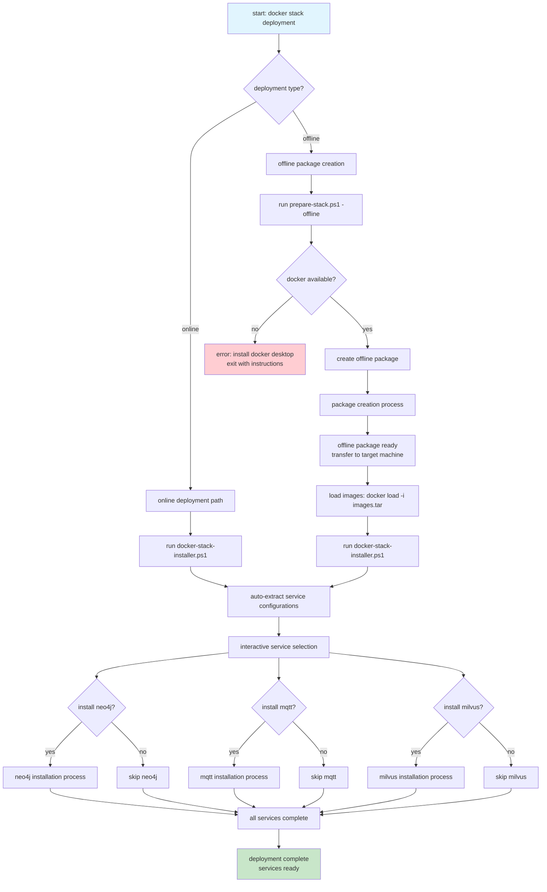
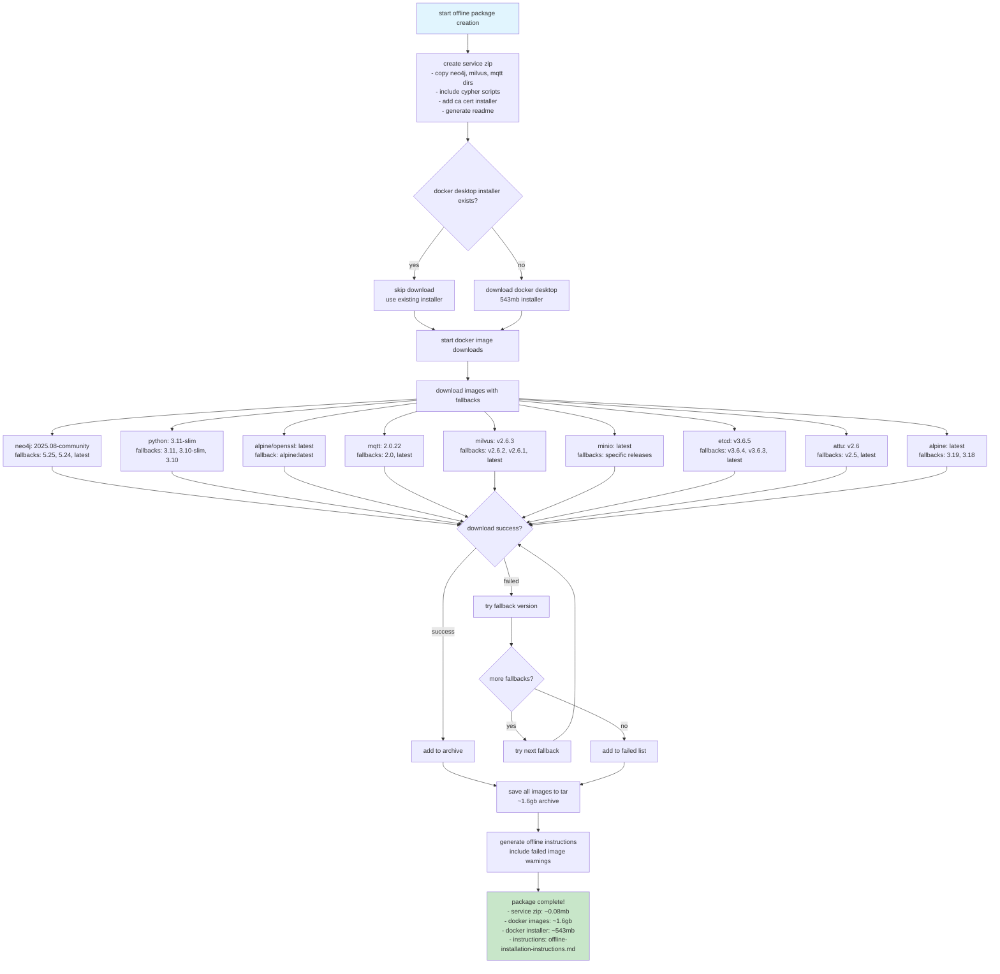
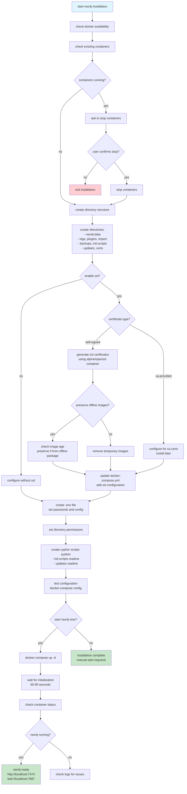
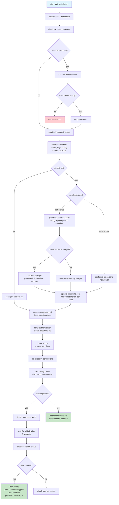
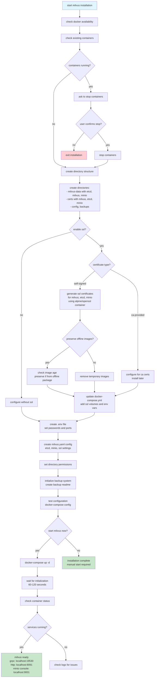
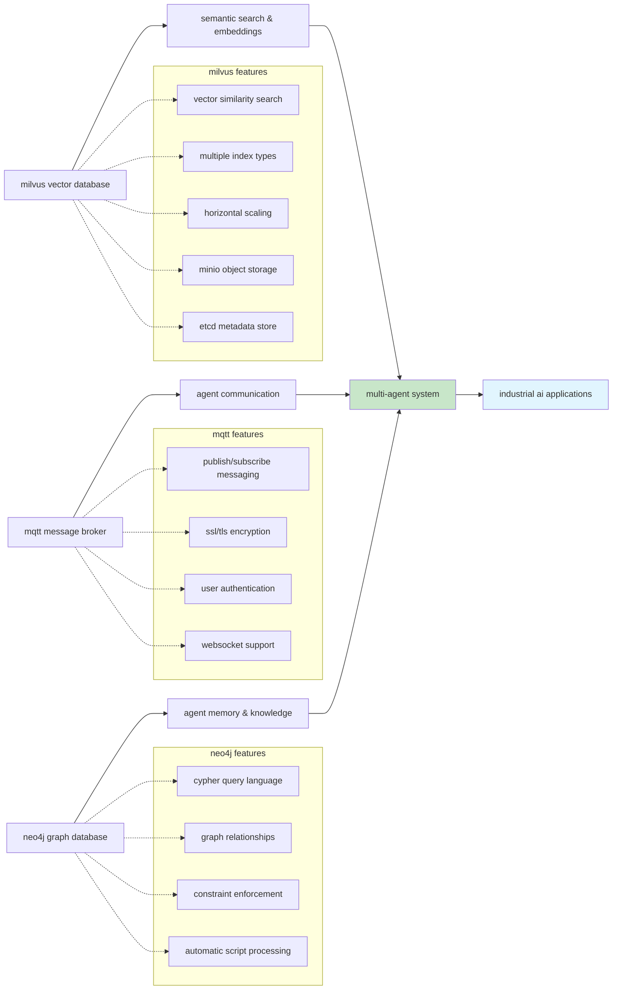

# Complete docker stack deployment process

this comprehensive flowchart shows the entire deployment process for the docker stack, including both online and offline deployment paths, and details what each service installation does.

## Main deployment decision flow

## Offline package creation details

## neo4j installation process

## mqtt installation process

## milvus installation process

## Service architecture overview

## Deployment summary

the complete deployment process provides:

- **flexible deployment**: online or offline installation paths
- **service modularity**: install only needed services (neo4j, mqtt, milvus)
- **ssl/tls support**: optional encryption for all services
- **offline capability**: pre-download images for air-gapped environments
- **image preservation**: smart cleanup that preserves offline-loaded images
- **comprehensive management**: backup, restore, ssl management scripts
- **industrial ready**: designed for multi-agent industrial ai systems

each service provides specific capabilities for the multi-agent system:
- **neo4j**: stores agent knowledge, relationships, and enforces data constraints
- **mqtt**: enables secure agent-to-agent communication with pub/sub messaging
- **milvus**: provides semantic search and vector similarity for ai embeddings
