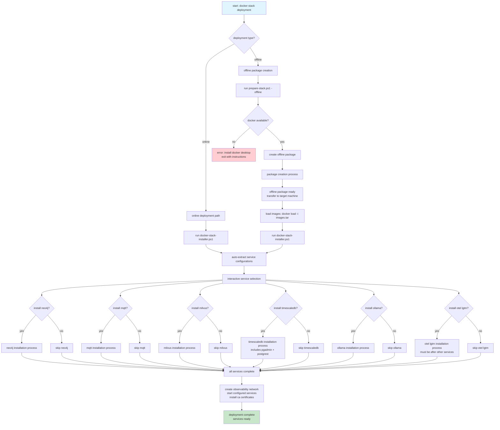
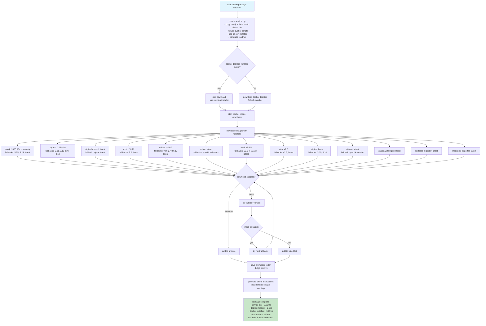
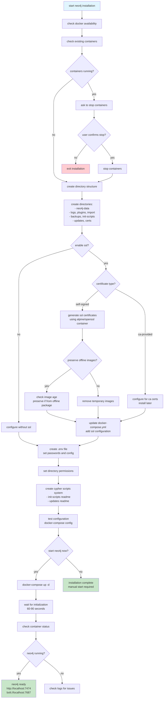
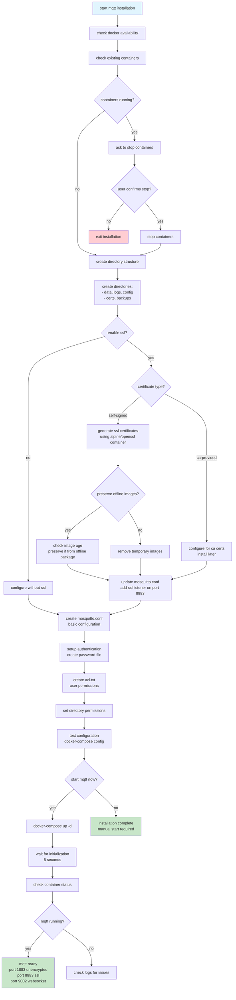
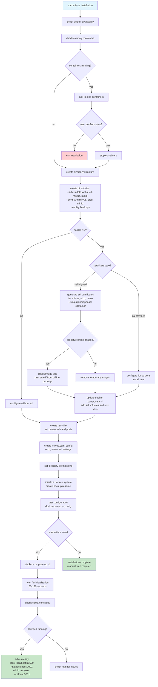
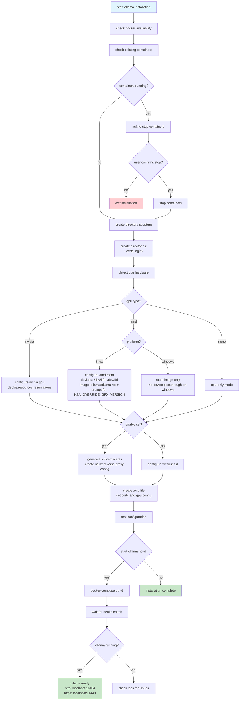
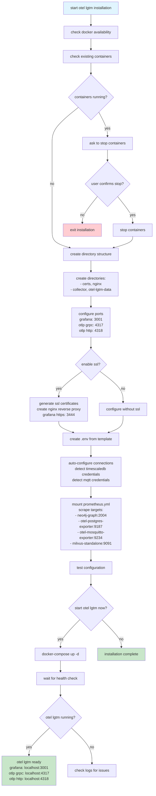
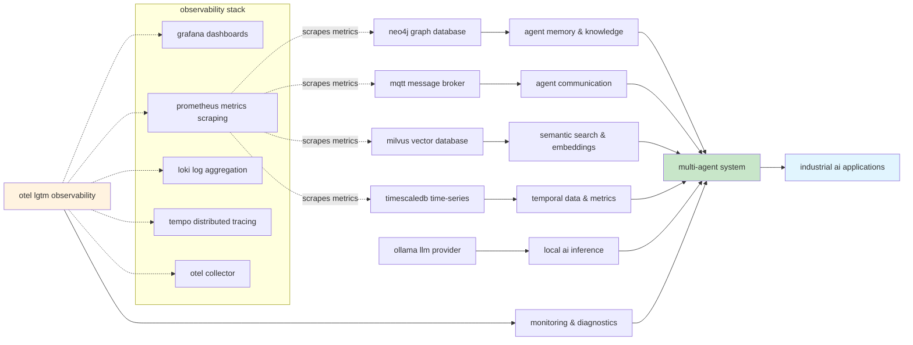
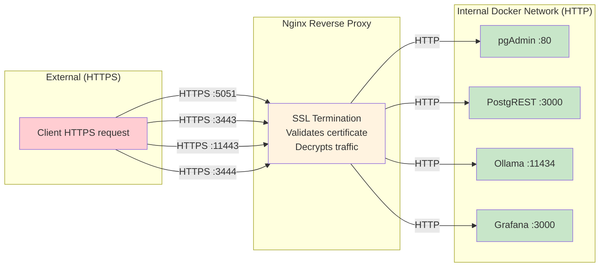
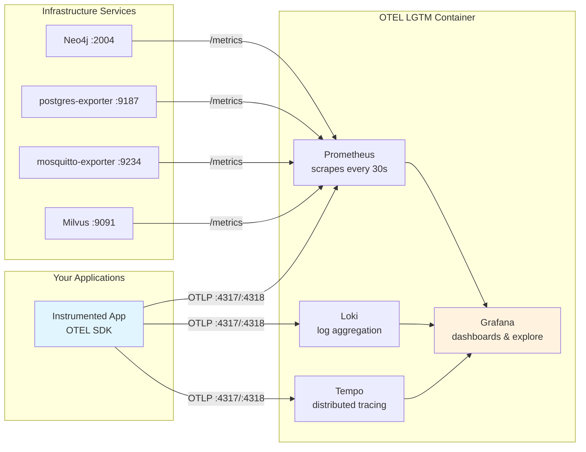

# Complete Docker Stack Deployment Process

This comprehensive flowchart shows the entire deployment process for the Docker stack, including both online and offline deployment paths, and details what each service installation does.

## Main Deployment Decision Flow

```mermaid
flowchart TD
    A[start: docker stack deployment] --> B{deployment type?}
    
    B -->|online| C[online deployment path]
    B -->|offline| D[offline package creation]
    
    %% online deployment path
    C --> E[run docker-stack-installer.ps1]
    E --> F[auto-extract service configurations]
    F --> G[interactive service selection]
    
    %% offline package creation path
    D --> H[run prepare-stack.ps1 -offline]
    H --> I{docker available?}
    I -->|no| J[error: install docker desktop<br/>exit with instructions]
    I -->|yes| K[create offline package]
    
    K --> L[package creation process]
    L --> M[offline package ready<br/>transfer to target machine]
    M --> N[load images: docker load -i images.tar]
    N --> O[run docker-stack-installer.ps1]
    O --> F
    
    %% service selection and installation
    G --> P{install neo4j?}
    G --> Q{install mqtt?}
    G --> R{install milvus?}
    G --> S{install timescaledb?}
    G --> T{install ollama?}
    G --> TA{install otel lgtm?}

    P -->|yes| U[neo4j installation process]
    Q -->|yes| V[mqtt installation process]
    R -->|yes| W[milvus installation process]
    S -->|yes| X[timescaledb installation process<br/>includes pgadmin + postgrest]
    T -->|yes| Y[ollama installation process]
    TA -->|yes| YA[otel lgtm installation process<br/>must be after other services]

    P -->|no| Z[skip neo4j]
    Q -->|no| AA[skip mqtt]
    R -->|no| AB[skip milvus]
    S -->|no| AC[skip timescaledb]
    T -->|no| AD[skip ollama]
    TA -->|no| ADA[skip otel lgtm]

    U --> AE[all services complete]
    V --> AE
    W --> AE
    X --> AE
    Y --> AE
    YA --> AE
    Z --> AE
    AA --> AE
    AB --> AE
    AC --> AE
    AD --> AE
    ADA --> AE

    AE --> AF[create observability network<br/>start configured services<br/>install ca certificates]
    AF --> AG[deployment complete<br/>services ready]
    
    style A fill:#e1f5fe
    style AG fill:#c8e6c9
    style J fill:#ffcdd2
```

## Offline Package Creation Details

```mermaid
flowchart TD
    A[start offline package creation] --> B[create service zip<br/>- copy neo4j, milvus, mqtt, ollama dirs<br/>- include cypher scripts<br/>- add ca cert installer<br/>- generate readme]
    
    B --> C{docker desktop installer exists?}
    C -->|yes| D[skip download<br/>use existing installer]
    C -->|no| E[download docker desktop<br/>543mb installer]
    
    D --> F[start docker image downloads]
    E --> F
    
    F --> G[download images with fallbacks]
    
    G --> H[neo4j: 2025.08-community<br/>fallbacks: 5.25, 5.24, latest]
    G --> I[python: 3.11-slim<br/>fallbacks: 3.11, 3.10-slim, 3.10]
    G --> J[alpine/openssl: latest<br/>fallback: alpine:latest]
    G --> K[mqtt: 2.0.22<br/>fallbacks: 2.0, latest]
    G --> L[milvus: v2.6.3<br/>fallbacks: v2.6.2, v2.6.1, latest]
    G --> M[minio: latest<br/>fallbacks: specific releases]
    G --> N[etcd: v3.6.5<br/>fallbacks: v3.6.4, v3.6.3, latest]
    G --> O[attu: v2.6<br/>fallbacks: v2.5, latest]
    G --> P[alpine: latest<br/>fallbacks: 3.19, 3.18]
    G --> PA[ollama: latest<br/>fallback: specific version]
    G --> PB[grafana/otel-lgtm: latest]
    G --> PC[postgres-exporter: latest]
    G --> PD[mosquitto-exporter: latest]
    
    H --> Q{download success?}
    I --> Q
    J --> Q
    K --> Q
    L --> Q
    M --> Q
    N --> Q
    O --> Q
    P --> Q
    PA --> Q
    PB --> Q
    PC --> Q
    PD --> Q
    
    Q -->|success| R[add to archive]
    Q -->|failed| S[try fallback version]
    S --> T{more fallbacks?}
    T -->|yes| U[try next fallback]
    U --> Q
    T -->|no| V[add to failed list]
    
    R --> W[save all images to tar<br/>~1.6gb archive]
    V --> W
    
    W --> X[generate offline instructions<br/>include failed image warnings]
    
    X --> Y[package complete!<br/>- service zip: ~0.08mb<br/>- docker images: ~1.6gb<br/>- docker installer: ~543mb<br/>- instructions: offline-installation-instructions.md]
    
    style A fill:#e1f5fe
    style Y fill:#c8e6c9
```

## Neo4j Installation Process

```mermaid
flowchart TD
    A[start neo4j installation] --> B[check docker availability]
    B --> C[check existing containers]
    C --> D{containers running?}
    D -->|yes| E[ask to stop containers]
    D -->|no| F[create directory structure]
    E --> G{user confirms stop?}
    G -->|yes| H[stop containers]
    G -->|no| I[exit installation]
    H --> F
    
    F --> J[create directories:<br/>- neo4j-data<br/>- logs, plugins, import<br/>- backups, init-scripts<br/>- updates, certs]
    
    J --> K{enable ssl?}
    K -->|yes| L{certificate type?}
    K -->|no| M[configure without ssl]
    
    L -->|self-signed| N[generate ssl certificates<br/>using alpine/openssl container]
    L -->|ca-provided| O[configure for ca certs<br/>install later]
    
    N --> P{preserve offline images?}
    P -->|yes| Q[check image age<br/>preserve if from offline package]
    P -->|no| R[remove temporary images]
    
    Q --> S[update docker-compose.yml<br/>add ssl configuration]
    R --> S
    O --> S
    M --> T[create .env file<br/>set passwords and config]
    S --> T
    
    T --> U[set directory permissions]
    U --> V[create cypher scripts system<br/>- init-scripts readme<br/>- updates readme]
    
    V --> W[test configuration<br/>docker-compose config]
    W --> X{start neo4j now?}
    X -->|yes| Y[docker-compose up -d]
    X -->|no| Z[installation complete<br/>manual start required]
    
    Y --> AA[wait for initialization<br/>60-90 seconds]
    AA --> BB[check container status]
    BB --> CC{neo4j running?}
    CC -->|yes| DD[neo4j ready<br/>http://localhost:7474<br/>bolt://localhost:7687]
    CC -->|no| EE[check logs for issues]
    
    style A fill:#e1f5fe
    style DD fill:#c8e6c9
    style Z fill:#c8e6c9
    style I fill:#ffcdd2
```

## MQTT Installation Process

```mermaid
flowchart TD
    A[start mqtt installation] --> B[check docker availability]
    B --> C[check existing containers]
    C --> D{containers running?}
    D -->|yes| E[ask to stop containers]
    D -->|no| F[create directory structure]
    E --> G{user confirms stop?}
    G -->|yes| H[stop containers]
    G -->|no| I[exit installation]
    H --> F
    
    F --> J[create directories:<br/>- data, logs, config<br/>- certs, backups]
    
    J --> K{enable ssl?}
    K -->|yes| L{certificate type?}
    K -->|no| M[configure without ssl]
    
    L -->|self-signed| N[generate ssl certificates<br/>using alpine/openssl container]
    L -->|ca-provided| O[configure for ca certs<br/>install later]
    
    N --> P{preserve offline images?}
    P -->|yes| Q[check image age<br/>preserve if from offline package]
    P -->|no| R[remove temporary images]
    
    Q --> S[update mosquitto.conf<br/>add ssl listener on port 8883]
    R --> S
    O --> S
    M --> T[create mosquitto.conf<br/>basic configuration]
    S --> T
    
    T --> U[setup authentication<br/>create password file]
    U --> V[create acl.txt<br/>user permissions]
    
    V --> W[set directory permissions]
    W --> X[test configuration<br/>docker-compose config]
    X --> Y{start mqtt now?}
    Y -->|yes| Z[docker-compose up -d]
    Y -->|no| AA[installation complete<br/>manual start required]
    
    Z --> BB[wait for initialization<br/>5 seconds]
    BB --> CC[check container status]
    CC --> DD{mqtt running?}
    DD -->|yes| EE[mqtt ready<br/>port 1883 unencrypted<br/>port 8883 ssl<br/>port 9002 websocket]
    DD -->|no| FF[check logs for issues]
    
    style A fill:#e1f5fe
    style EE fill:#c8e6c9
    style AA fill:#c8e6c9
    style I fill:#ffcdd2
```

## Milvus Installation Process

```mermaid
flowchart TD
    A[start milvus installation] --> B[check docker availability]
    B --> C[check existing containers]
    C --> D{containers running?}
    D -->|yes| E[ask to stop containers]
    D -->|no| F[create directory structure]
    E --> G{user confirms stop?}
    G -->|yes| H[stop containers]
    G -->|no| I[exit installation]
    H --> F
    
    F --> J[create directories:<br/>- milvus-data with etcd, milvus, minio<br/>- certs with milvus, etcd, minio<br/>- config, backups]
    
    J --> K{enable ssl?}
    K -->|yes| L{certificate type?}
    K -->|no| M[configure without ssl]
    
    L -->|self-signed| N[generate ssl certificates<br/>for milvus, etcd, minio<br/>using alpine/openssl container]
    L -->|ca-provided| O[configure for ca certs<br/>install later]
    
    N --> P{preserve offline images?}
    P -->|yes| Q[check image age<br/>preserve if from offline package]
    P -->|no| R[remove temporary images]
    
    Q --> S[update docker-compose.yml<br/>add ssl volumes and env vars]
    R --> S
    O --> S
    M --> T[create .env file<br/>set passwords and ports]
    S --> T
    
    T --> U[create milvus.yaml config<br/>etcd, minio, ssl settings]
    U --> V[set directory permissions]
    
    V --> W[initialize backup system<br/>create backup readme]
    W --> X[test configuration<br/>docker-compose config]
    X --> Y{start milvus now?}
    Y -->|yes| Z[docker-compose up -d]
    Y -->|no| AA[installation complete<br/>manual start required]
    
    Z --> BB[wait for initialization<br/>60-120 seconds]
    BB --> CC[check container status]
    CC --> DD{services running?}
    DD -->|yes| EE[milvus ready<br/>grpc: localhost:19530<br/>http: localhost:9091<br/>minio console: localhost:9001]
    DD -->|no| FF[check logs for issues]
    
    style A fill:#e1f5fe
    style EE fill:#c8e6c9
    style AA fill:#c8e6c9
    style I fill:#ffcdd2
```

## TimescaleDB Installation Process

```mermaid
flowchart TD
    A[start timescaledb installation] --> B[check docker availability]
    B --> C[check existing containers]
    C --> D{containers running?}
    D -->|yes| E[ask to stop containers]
    D -->|no| F[create directory structure]
    E --> G{user confirms stop?}
    G -->|yes| H[stop containers]
    G -->|no| I[exit installation]
    H --> F
    
    F --> J[create directories:<br/>- init, backups, certs<br/>- config, pgadmin, backup<br/>- timescaledb-data with data, pgadmin]
    
    J --> K[configure backup retention<br/>7/30/90/365 days]
    
    K --> L{enable ssl?}
    L -->|yes| M{certificate type?}
    L -->|no| N[configure without ssl]
    
    M -->|self-signed| O[generate ssl certificates<br/>using alpine/openssl container]
    M -->|ca-provided| P[configure for ca certs<br/>install later]
    
    O --> Q{preserve offline images?}
    Q -->|yes| R[check image age<br/>preserve if from offline package]
    Q -->|no| S[remove temporary images]
    
    R --> T[create postgresql.conf<br/>from template with ssl config]
    S --> T
    P --> T
    N --> U[create .env file<br/>set passwords and config]
    T --> U
    
    U --> V[create pgadmin servers.json<br/>pre-configure timescaledb connection]
    V --> W[create nginx.conf for pgadmin<br/>http or https based on ssl]
    
    W --> X[create backup script<br/>automated daily backups]
    X --> Y[create init sql script<br/>enable timescaledb extension]
    
    Y --> Z[set directory permissions]
    Z --> AA[test configuration<br/>docker-compose config]
    AA --> AB{start timescaledb now?}
    AB -->|yes| AC[docker-compose up -d]
    AB -->|no| AD[installation complete<br/>manual start required]
    
    AC --> AE[wait for initialization<br/>15 seconds]
    AE --> AF[check container status]
    AF --> AG{timescaledb running?}
    AG -->|yes| AH[timescaledb ready<br/>postgresql: localhost:5432<br/>pgadmin: localhost:5050/5051<br/>postgrest: localhost:3000/3443]
    AG -->|no| AI[check logs for issues]
    
    style A fill:#e1f5fe
    style AH fill:#c8e6c9
    style AD fill:#c8e6c9
    style I fill:#ffcdd2
```

## Ollama Installation Process

```mermaid
flowchart TD
    A[start ollama installation] --> B[check docker availability]
    B --> C[check existing containers]
    C --> D{containers running?}
    D -->|yes| E[ask to stop containers]
    D -->|no| F[create directory structure]
    E --> G{user confirms stop?}
    G -->|yes| H[stop containers]
    G -->|no| I[exit installation]
    H --> F

    F --> J[create directories:<br/>- certs, nginx]

    J --> K[detect gpu hardware]
    K --> L{gpu type?}

    L -->|nvidia| M[configure nvidia gpu<br/>deploy.resources.reservations]
    L -->|amd| N{platform?}
    L -->|none| O[cpu-only mode]

    N -->|linux| P[configure amd rocm<br/>devices: /dev/kfd, /dev/dri<br/>image: ollama/ollama:rocm<br/>prompt for HSA_OVERRIDE_GFX_VERSION]
    N -->|windows| Q[rocm image only<br/>no device passthrough on windows]

    M --> R{enable ssl?}
    P --> R
    Q --> R
    O --> R

    R -->|yes| S[generate ssl certificates<br/>create nginx reverse proxy config]
    R -->|no| T[configure without ssl]

    S --> U[create .env file<br/>set ports and gpu config]
    T --> U

    U --> V[test configuration]
    V --> W{start ollama now?}
    W -->|yes| X[docker-compose up -d]
    W -->|no| Y[installation complete]

    X --> Z[wait for health check]
    Z --> AA{ollama running?}
    AA -->|yes| AB[ollama ready<br/>http: localhost:11434<br/>https: localhost:11443]
    AA -->|no| AC[check logs for issues]

    style A fill:#e1f5fe
    style AB fill:#c8e6c9
    style Y fill:#c8e6c9
    style I fill:#ffcdd2
```

## OTEL LGTM Installation Process

```mermaid
flowchart TD
    A[start otel lgtm installation] --> B[check docker availability]
    B --> C[check existing containers]
    C --> D{containers running?}
    D -->|yes| E[ask to stop containers]
    D -->|no| F[create directory structure]
    E --> G{user confirms stop?}
    G -->|yes| H[stop containers]
    G -->|no| I[exit installation]
    H --> F

    F --> J[create directories:<br/>- certs, nginx<br/>- collector, otel-lgtm-data]

    J --> K[configure ports<br/>grafana: 3001<br/>otlp grpc: 4317<br/>otlp http: 4318]

    K --> L{enable ssl?}
    L -->|yes| M[generate ssl certificates<br/>create nginx reverse proxy<br/>grafana https: 3444]
    L -->|no| N[configure without ssl]

    M --> O[create .env from template]
    N --> O

    O --> P[auto-configure connections<br/>detect timescaledb credentials<br/>detect mqtt credentials]

    P --> Q[mount prometheus.yml<br/>scrape targets:<br/>- neo4j-graph:2004<br/>- otel-postgres-exporter:9187<br/>- otel-mosquitto-exporter:9234<br/>- milvus-standalone:9091]

    Q --> R[test configuration]
    R --> S{start otel lgtm now?}
    S -->|yes| T[docker-compose up -d]
    S -->|no| U[installation complete]

    T --> V[wait for health check]
    V --> W{otel lgtm running?}
    W -->|yes| X[otel lgtm ready<br/>grafana: localhost:3001<br/>otlp grpc: localhost:4317<br/>otlp http: localhost:4318]
    W -->|no| Y[check logs for issues]

    style A fill:#e1f5fe
    style X fill:#c8e6c9
    style U fill:#c8e6c9
    style I fill:#ffcdd2
```

## Service Architecture Overview

```mermaid
flowchart LR
    A[neo4j graph database] --> F[agent memory & knowledge]
    B[mqtt message broker] --> G[agent communication]
    C[milvus vector database] --> H[semantic search & embeddings]
    D[timescaledb time-series] --> I[temporal data & metrics]
    E[ollama llm provider] --> J[local ai inference]
    OT[otel lgtm observability] --> OBS[monitoring & diagnostics]

    F --> K[multi-agent system]
    G --> K
    H --> K
    I --> K
    J --> K
    OBS --> K

    K --> L[industrial ai applications]

    subgraph "observability stack"
        OT1[grafana dashboards]
        OT2[prometheus metrics scraping]
        OT3[loki log aggregation]
        OT4[tempo distributed tracing]
        OT5[otel collector]
    end

    OT -.-> OT1
    OT -.-> OT2
    OT -.-> OT3
    OT -.-> OT4
    OT -.-> OT5

    %% Observability connections to services
    OT2 -.->|scrapes metrics| A
    OT2 -.->|scrapes metrics| B
    OT2 -.->|scrapes metrics| C
    OT2 -.->|scrapes metrics| D

    style K fill:#c8e6c9
    style L fill:#e1f5fe
    style OT fill:#fff3e0
```

## Service Access & Interface Reference

### Network Access Diagram

```mermaid
flowchart TB
    CLIENT[Client / Application]

    subgraph "Neo4j"
        NEO_HTTP[HTTP Browser UI<br/>localhost:7474]
        NEO_HTTPS[HTTPS Browser UI<br/>localhost:7473]
        NEO_BOLT[Bolt Protocol<br/>bolt://localhost:7687]
        NEO_BOLTS[Bolt + TLS<br/>bolt+s://localhost:7687]
    end

    subgraph "TimescaleDB"
        TS_PG[PostgreSQL Wire Protocol<br/>localhost:5432<br/>sslmode=prefer/require]
        TS_PGADMIN_HTTP[pgAdmin Web UI - HTTP<br/>localhost:5050]
        TS_PGADMIN_HTTPS[pgAdmin Web UI - HTTPS<br/>localhost:5051 via nginx]
        TS_PGRST_HTTP[PostgREST API - HTTP<br/>localhost:3000]
        TS_PGRST_HTTPS[PostgREST API - HTTPS<br/>localhost:3443 via nginx]
    end

    subgraph "Milvus"
        MV_GRPC[gRPC API<br/>localhost:19530<br/>TLS when SSL enabled]
        MV_HTTP[HTTP API Internal<br/>localhost:9091]
        MV_CORS[HTTP API CORS Proxy<br/>localhost:19531 via nginx]
        MV_ATTU_HTTPS[Attu Web UI - HTTPS<br/>localhost:8001 via nginx]
        MV_ATTU_HTTP[Attu Web UI - HTTP redirect<br/>localhost:8002]
        MV_MINIO[MinIO Console<br/>localhost:9001]
    end

    subgraph "MQTT"
        MQ_TCP[MQTT Protocol - Unencrypted<br/>localhost:1883]
        MQ_TLS[MQTT Protocol - TLS<br/>localhost:8883]
        MQ_WS[WebSocket<br/>ws://localhost:9002]
    end

    subgraph "Ollama"
        OL_HTTP[HTTP API<br/>localhost:11434]
        OL_HTTPS[HTTPS API<br/>localhost:11443 via nginx]
    end

    subgraph "OTEL LGTM Observability"
        OT_GRAFANA[Grafana Dashboard - HTTP<br/>localhost:3001]
        OT_GRAFANA_S[Grafana Dashboard - HTTPS<br/>localhost:3444 via nginx]
        OT_GRPC[OTLP gRPC Receiver<br/>localhost:4317]
        OT_HTTP_R[OTLP HTTP Receiver<br/>localhost:4318]
    end

    CLIENT -->|SQL queries| TS_PG
    CLIENT -->|DB admin| TS_PGADMIN_HTTP
    CLIENT -->|DB admin SSL| TS_PGADMIN_HTTPS
    CLIENT -->|REST API| TS_PGRST_HTTP
    CLIENT -->|REST API SSL| TS_PGRST_HTTPS
    CLIENT -->|graph queries| NEO_BOLT
    CLIENT -->|graph queries TLS| NEO_BOLTS
    CLIENT -->|vector search| MV_GRPC
    CLIENT -->|pub/sub| MQ_TCP
    CLIENT -->|pub/sub TLS| MQ_TLS
    CLIENT -->|LLM inference| OL_HTTP
    CLIENT -->|send telemetry| OT_GRPC
    CLIENT -->|dashboards| OT_GRAFANA

    style CLIENT fill:#e1f5fe
```

### Service Interface Details

#### TimescaleDB Interfaces
| Interface | Port | Protocol | Purpose |
|-----------|------|----------|---------|
| PostgreSQL | 5432 | TCP (SQL wire protocol) | Direct database access for applications. Use `sslmode=require` when SSL enabled |
| pgAdmin HTTP | 5050 | HTTP | Web-based database admin UI (redirects to `/browser/`) |
| pgAdmin HTTPS | 5051 | HTTPS (nginx proxy) | SSL-terminated pgAdmin access. Only active with `ssl` profile |
| PostgREST HTTP | 3000 | HTTP REST | Auto-generated REST API from the `api` schema. JWT auth supported |
| PostgREST HTTPS | 3443 | HTTPS (nginx proxy) | SSL-terminated REST API. Only active with `ssl` profile |

**pgAdmin** is for interactive database administration — browse tables, run queries, manage schemas.
**PostgREST** exposes the `api` schema as a RESTful API — your applications call it to read/write data without writing SQL.

#### Neo4j Interfaces
| Interface | Port | Protocol | Purpose |
|-----------|------|----------|---------|
| HTTP Browser | 7474 | HTTP | Neo4j Browser UI (disabled when SSL enabled) |
| HTTPS Browser | 7473 | HTTPS | Neo4j Browser UI with SSL |
| Bolt | 7687 | Bolt / Bolt+TLS | Application query protocol. Use `bolt+s://` when SSL enabled |

**Browser UI** is for interactive graph exploration. **Bolt** is the binary protocol your applications use.

#### Milvus Interfaces
| Interface | Port | Protocol | Purpose |
|-----------|------|----------|---------|
| gRPC API | 19530 | gRPC (TLS optional) | Primary API for vector operations (insert, search, delete) |
| HTTP API | 9091 | HTTP | Internal management API |
| CORS Proxy | 19531 | HTTP (nginx) | Browser-accessible HTTP API with CORS headers |
| Attu HTTPS | 8001 | HTTPS (nginx) | Web UI for collection management and search |
| Attu HTTP | 8002 | HTTP | Redirects to HTTPS |
| MinIO Console | 9001 | HTTP | Object storage admin for underlying vector data |

**Attu** is the web UI for managing collections. **gRPC** is the primary application interface.

#### MQTT Interfaces
| Interface | Port | Protocol | Purpose |
|-----------|------|----------|---------|
| MQTT | 1883 | TCP | Unencrypted pub/sub messaging |
| MQTT TLS | 8883 | TLS | Encrypted pub/sub messaging |
| WebSocket | 9002 | WS | Browser-based MQTT clients |

Applications publish/subscribe to topics. Use port **8883** in production for encrypted communication.

#### Ollama Interfaces
| Interface | Port | Protocol | Purpose |
|-----------|------|----------|---------|
| HTTP API | 11434 | HTTP | OpenAI-compatible REST API for LLM inference and embeddings |
| HTTPS API | 11443 | HTTPS (nginx) | SSL-terminated API. Only active with `ssl` profile |

Compatible with any OpenAI SDK — just change the base URL to `http://localhost:11434`.

#### OTEL LGTM Interfaces
| Interface | Port | Protocol | Purpose |
|-----------|------|----------|---------|
| Grafana HTTP | 3001 | HTTP | Dashboards, metrics explorer, log viewer |
| Grafana HTTPS | 3444 | HTTPS (nginx) | SSL-terminated Grafana. Only active with `ssl` profile |
| OTLP gRPC | 4317 | gRPC | Receive traces, metrics, logs from instrumented applications |
| OTLP HTTP | 4318 | HTTP | Receive traces, metrics, logs (HTTP/protobuf) |

**Grafana** is where you view dashboards and explore metrics/logs/traces. **OTLP ports** are where your instrumented applications send telemetry data.

### SSL Traffic Flow

When SSL is enabled, nginx reverse proxies handle HTTPS termination for services that don't natively support it:

```mermaid
flowchart LR
    subgraph "External (HTTPS)"
        C1[Client HTTPS request]
    end

    subgraph "Nginx Reverse Proxy"
        N1[SSL Termination<br/>Validates certificate<br/>Decrypts traffic]
    end

    subgraph "Internal Docker Network (HTTP)"
        S1[pgAdmin :80]
        S2[PostgREST :3000]
        S3[Ollama :11434]
        S4[Grafana :3000]
    end

    C1 -->|HTTPS :5051| N1
    C1 -->|HTTPS :3443| N1
    C1 -->|HTTPS :11443| N1
    C1 -->|HTTPS :3444| N1
    N1 -->|HTTP| S1
    N1 -->|HTTP| S2
    N1 -->|HTTP| S3
    N1 -->|HTTP| S4

    style C1 fill:#ffcdd2
    style N1 fill:#fff3e0
    style S1 fill:#c8e6c9
    style S2 fill:#c8e6c9
    style S3 fill:#c8e6c9
    style S4 fill:#c8e6c9
```

Services with **native SSL support** (no nginx needed):
- **Neo4j**: Built-in HTTPS (port 7473) and Bolt+TLS (port 7687)
- **Milvus**: Built-in gRPC TLS (port 19530)
- **MQTT**: Built-in TLS listener (port 8883)
- **TimescaleDB**: Built-in PostgreSQL SSL (port 5432)

### Observability Data Flow

```mermaid
flowchart LR
    subgraph "Infrastructure Services"
        NEO[Neo4j :2004]
        PGE[postgres-exporter :9187]
        MQE[mosquitto-exporter :9234]
        MIL[Milvus :9091]
    end

    subgraph "OTEL LGTM Container"
        PROM[Prometheus<br/>scrapes every 30s]
        LOKI[Loki<br/>log aggregation]
        TEMPO[Tempo<br/>distributed tracing]
        GRAF[Grafana<br/>dashboards & explore]
    end

    subgraph "Your Applications"
        APP[Instrumented App<br/>OTEL SDK]
    end

    NEO -->|/metrics| PROM
    PGE -->|/metrics| PROM
    MQE -->|/metrics| PROM
    MIL -->|/metrics| PROM

    APP -->|OTLP :4317/:4318| TEMPO
    APP -->|OTLP :4317/:4318| LOKI
    APP -->|OTLP :4317/:4318| PROM

    PROM --> GRAF
    LOKI --> GRAF
    TEMPO --> GRAF

    style GRAF fill:#fff3e0
    style APP fill:#e1f5fe
```

- **Metrics** are automatically scraped from all infrastructure services via Prometheus exporters
- **Traces and Logs** must be sent from your applications using OpenTelemetry SDKs
- **Grafana** provides a unified view of all telemetry data

## Deployment Summary

The complete deployment process provides:

- **Flexible deployment**: Online or offline installation paths
- **Service modularity**: Install only needed services (Neo4j, MQTT, Milvus, TimescaleDB, Ollama, OTEL LGTM)
- **SSL/TLS support**: Optional encryption for all services
- **Offline capability**: Pre-download images for air-gapped environments
- **Image preservation**: Smart cleanup that preserves offline-loaded images
- **Comprehensive management**: Backup, restore, SSL management scripts
- **Industrial ready**: Designed for multi-agent industrial AI systems

Each service provides specific capabilities for the multi-agent system:
- **Neo4j**: Stores agent knowledge, relationships, and enforces data constraints
- **MQTT**: Enables secure agent-to-agent communication with pub/sub messaging
- **Milvus**: Provides semantic search and vector similarity for AI embeddings
- **TimescaleDB**: Time-series database for sensor data, metrics, and temporal analytics
- **Ollama**: Local LLM provider for AI inference and embeddings without cloud dependencies
- **OTEL LGTM**: Observability stack providing metrics, logs, traces, and dashboards for all services
