# XMPro MAGS - Solution Architecture (On-Premise)

This document describes the complete on-premise deployment architecture from a solution architect's perspective: what components exist, how they interact, and the role each plays in the XMPro Multi-Agent Generative System.

## End-to-End Architecture

The on-premise deployment consists of three layers: the **XMPro Application Platform** (IIS/Windows Server), the **MAGS Cognitive Engine** (which runs inside Data Streams on Stream Hosts, with its UI in XMPro AI), and the **Infrastructure Services** (Docker containers). Together they form an industrial-grade multi-agent system.

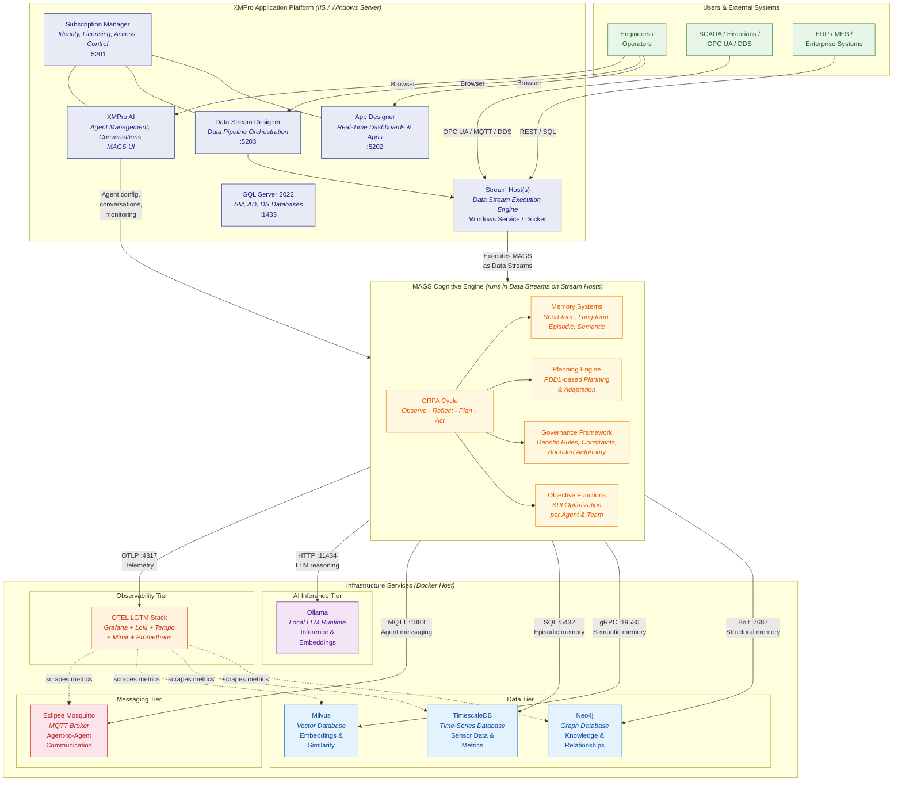

## XMPro Application Platform

The XMPro platform provides the operational front-end, data pipeline orchestration, and identity management. It is deployed on **Windows Server 2022** using **IIS** with a **SQL Server 2022** backend.

### Platform Components

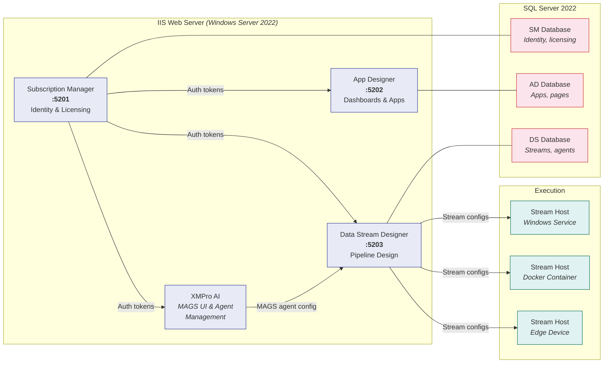

| Component | Port | Role | Depends On |
|-----------|------|------|------------|
| **Subscription Manager** | 5201 | Central identity, licensing, and access control hub. Must be installed first. | SQL Server |
| **App Designer** | 5202 | Visual drag-and-drop builder for real-time operational dashboards and applications. No coding required. | SM |
| **Data Stream Designer** | 5203 | Visual designer for streaming data pipelines. Connects industrial data sources to agents and applications. | SM |
| **Stream Host** | - | Execution engine that runs Data Streams -- including MAGS cognitive agents. Deployed as Windows Service, Docker container, or console app. Can run at the edge. | DS |
| **XMPro AI** | - | MAGS front-end: agent team configuration, agent conversations, monitoring, and management. The UI layer for interacting with cognitive agents. | SM |
| **SQL Server 2022** | 1433 | Stores platform metadata: identity, app definitions, stream configurations. Each component gets its own database. | - |

**Prerequisites:** Windows Server 2022, IIS 10+, .NET 8 Hosting Bundle, ASP.NET 4.8, SQL Server 2022 (mixed-mode auth), JWT signing certificate (.pfx, 4096-bit RSA), SSL certificates for HTTPS.

### Stream Host & Collections

Stream Hosts are the bridge between the XMPro platform and the physical/digital world. They execute Data Streams -- including MAGS cognitive agents -- that ingest data from SCADA, historians, IoT devices, and enterprise systems.

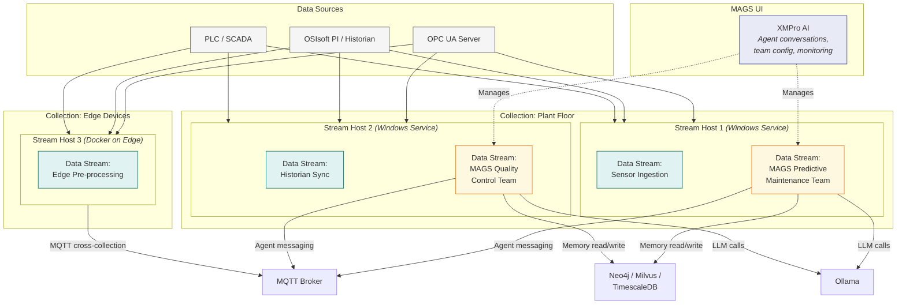

- **Collections** group Stream Hosts that run the same Data Streams (logical grouping by location or function)
- **MAGS agent teams run as Data Streams** alongside regular data ingestion streams on the same Stream Hosts
- Cross-collection communication uses **MQTT Remote Receivers/Publishers**
- Stream Hosts connect back to Data Stream Designer via HTTPS for configuration
- **XMPro AI** provides the UI for managing MAGS agents, viewing conversations, and monitoring decisions

---

## MAGS Cognitive Engine

MAGS is the AI decision-making layer. It deploys structured teams of cognitive agents that follow the **Observe-Reflect-Plan-Act (ORPA)** cycle. MAGS is ~90% business process intelligence and ~10% LLM utility.

**Runtime:** MAGS agents execute as **Data Streams on Stream Hosts**. The Data Stream Designer defines the agent pipeline (data ingestion, cognitive processing, action output), and Stream Hosts run it continuously. This means MAGS inherits all Stream Host capabilities: distributed execution, edge deployment, collection-based scaling, and cross-collection MQTT bridging.

**UI:** The **XMPro AI** product is the management and interaction layer for MAGS -- agent team configuration, real-time agent conversations, decision monitoring, and governance controls.

### How MAGS Uses Each Infrastructure Service

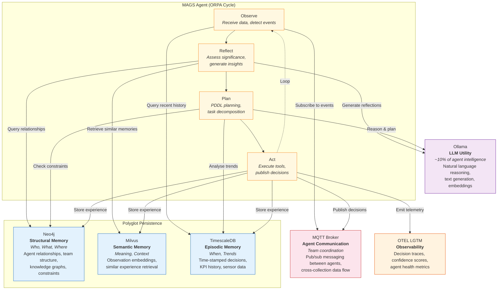

| ORPA Phase | Infrastructure Used | What Happens |
|------------|-------------------|--------------|
| **Observe** | MQTT, TimescaleDB | Agent subscribes to MQTT topics for real-time events; queries TimescaleDB for recent sensor/KPI history |
| **Reflect** | Milvus, Neo4j, Ollama | Retrieves semantically similar past observations from Milvus; queries Neo4j for entity relationships; uses LLM to assess significance and generate insights |
| **Plan** | Neo4j, TimescaleDB, Ollama | Checks deontic constraints in Neo4j; analyses trends in TimescaleDB; uses LLM + PDDL for task planning |
| **Act** | MQTT, Neo4j, Milvus, TimescaleDB, OTEL | Publishes decisions via MQTT; stores experience across all three databases; emits decision traces to OTEL |

### Agent Team Architecture

MAGS agents operate in structured teams with separation of duties:

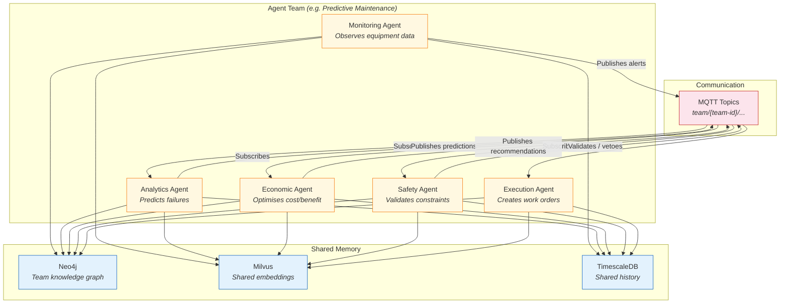

**Key design principles:**
- The agent that **proposes** an action is never the one that **approves** it
- Safety validation is structurally independent from economic optimisation
- Agents act only within engineer-approved **bounded autonomy** limits
- Every decision includes documented reasoning (explainability)
- Consensus mechanisms resolve conflicting recommendations

---

## Infrastructure Services (Docker)

### Component Breakdown

Each service stack is independently deployable on a single Docker host, connected through a shared observability network.

```mermaid
graph TB
    subgraph HOST["Docker Host"]

        subgraph OBS_NET["observability network <i>(shared by all services)</i>"]
            direction TB
        end

        subgraph NEO["Neo4j Stack"]
            NEO4J_DB["neo4j-graph<br/>neo4j:2025.08-community<br/><b>7474</b> HTTP | <b>7687</b> Bolt<br/><b>7473</b> HTTPS | <b>2004</b> Metrics"]
            NEO4J_WATCHER["neo4j-watcher<br/>python:3.11-slim<br/>Auto-executes .cypher scripts"]
            NEO4J_DB --- NEO4J_WATCHER
        end

        subgraph MQ["MQTT Stack"]
            MOSQUITTO["mosquitto<br/>eclipse-mosquitto:2.0.22<br/><b>1883</b> TCP | <b>8883</b> TLS<br/><b>9002</b> WebSocket | <b>9003</b> WSS"]
        end

        subgraph MIL["Milvus Stack"]
            direction TB
            ETCD["etcd<br/>v3.6.5<br/><i>Metadata store</i>"]
            MINIO["minio<br/>minio:latest<br/><b>9000</b> API | <b>9001</b> Console"]
            MILVUS_DB["milvus-standalone<br/>milvus:v2.6.3<br/><b>19530</b> gRPC | <b>9091</b> HTTP<br/><i>4 CPU / 8 GB RAM</i>"]
            ATTU["attu<br/>zilliz/attu:v2.6<br/><i>Web UI</i>"]
            ATTU_NGINX["nginx<br/><b>8001</b> HTTPS Attu<br/><b>19531</b> CORS proxy"]
            ETCD & MINIO --> MILVUS_DB --> ATTU --> ATTU_NGINX
        end

        subgraph TS["TimescaleDB Stack"]
            direction TB
            TSDB_PG["timescaledb<br/>timescale/timescaledb:pg16<br/><b>5432</b> PostgreSQL<br/><i>4 CPU / 8 GB RAM</i>"]
            PGADMIN["pgadmin4<br/><b>5050</b> HTTP | <b>5051</b> HTTPS"]
            POSTGREST["postgrest<br/><b>3000</b> HTTP | <b>3443</b> HTTPS<br/><i>Auto-generated REST API</i>"]
            BACKUP["backup scheduler<br/>postgres:16-alpine<br/><i>Daily 02:00 UTC</i>"]
            TSDB_PG --> PGADMIN & POSTGREST & BACKUP
        end

        subgraph OL["Ollama Stack"]
            OLLAMA_SVC["ollama<br/>ollama:latest<br/><b>11434</b> HTTP | <b>11443</b> HTTPS<br/><i>GPU: NVIDIA / AMD / CPU</i>"]
            OL_NGINX["nginx<br/><i>SSL termination</i>"]
            OLLAMA_SVC --> OL_NGINX
        end

        subgraph OTEL_S["OTEL LGTM Stack"]
            direction TB
            OTEL_LGTM["otel-lgtm<br/>grafana/otel-lgtm:latest<br/><b>3001</b> Grafana<br/><b>4317</b> OTLP gRPC | <b>4318</b> OTLP HTTP<br/><i>4 CPU / 4 GB RAM</i>"]
            PG_EXP["postgres-exporter<br/><i>:9187 metrics</i>"]
            MQ_EXP["mosquitto-exporter<br/><i>:9234 metrics</i>"]
            OTEL_NGINX["nginx<br/><b>3444</b> HTTPS Grafana"]
            OTEL_LGTM --- PG_EXP & MQ_EXP & OTEL_NGINX
        end
    end

    classDef neo fill:#e3f2fd,stroke:#1565c0
    classDef mq fill:#fce4ec,stroke:#c62828
    classDef mil fill:#e8eaf6,stroke:#283593
    classDef ts fill:#e0f2f1,stroke:#00695c
    classDef ol fill:#f3e5f5,stroke:#6a1b9a
    classDef otel fill:#fff3e0,stroke:#e65100

    class NEO4J_DB,NEO4J_WATCHER neo
    class MOSQUITTO mq
    class ETCD,MINIO,MILVUS_DB,ATTU,ATTU_NGINX mil
    class TSDB_PG,PGADMIN,POSTGREST,BACKUP ts
    class OLLAMA_SVC,OL_NGINX ol
    class OTEL_LGTM,PG_EXP,MQ_EXP,OTEL_NGINX otel
```

### Network Topology

All services join the shared **observability** network for centralized metrics collection. Each service stack also has its own isolated bridge network for internal communication.

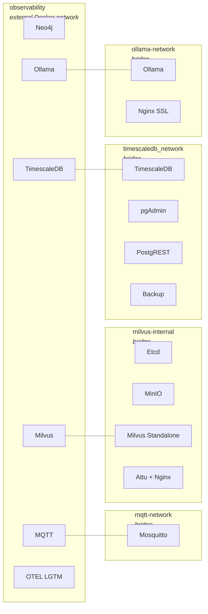

**Key design decisions:**
- The **observability** network is external (created once, shared across all compose stacks)
- Service-specific networks provide **blast radius isolation** -- a misconfigured Milvus container cannot reach MQTT internals
- Prometheus exporters (postgres-exporter, mosquitto-exporter) sit on the observability network and bridge into service networks to scrape metrics

---

## Observability Data Flow

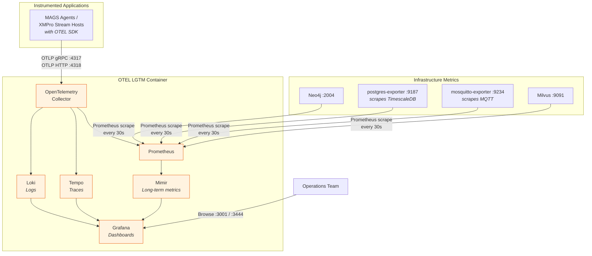

---

## SSL/TLS Architecture

The platform supports two SSL patterns depending on whether the service has native TLS support:

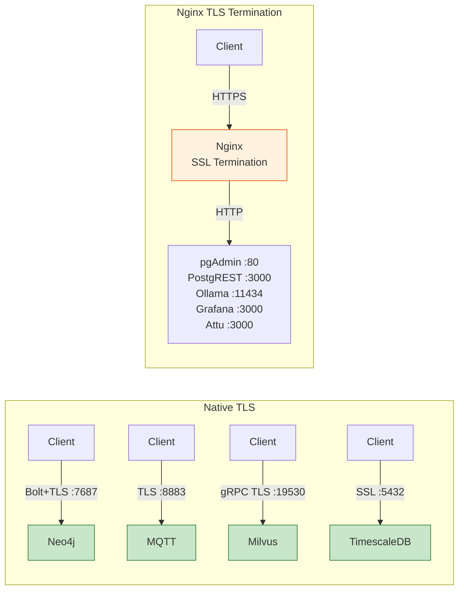

| HTTPS Endpoint | Host Port | Backend |
|----------------|-----------|---------|
| pgAdmin | 5051 | pgAdmin :80 |
| PostgREST | 3443 | PostgREST :3000 |
| Ollama | 11443 | Ollama :11434 |
| Grafana | 3444 | Grafana :3000 |
| Attu (Milvus UI) | 8001 | Attu :3000 |

XMPro platform components (SM, AD, DS) use IIS-managed HTTPS with their own SSL certificates.

---

## Resource Footprint

### Docker Infrastructure Services

| Service | CPU Limit | RAM Limit | CPU Reserved | RAM Reserved | Persistent Storage |
|---------|-----------|-----------|--------------|--------------|-------------------|
| Neo4j | 6 | 8 GB | 3 | 6 GB | Graph data, logs, plugins |
| Milvus Standalone | 4 | 8 GB | 2 | 4 GB | Vector indexes |
| TimescaleDB | 4 | 8 GB | - | - | PostgreSQL data, backups |
| OTEL LGTM | 4 | 4 GB | 2 | 2 GB | Metrics, logs, traces |
| Ollama | 6 | 8 GB | - | - | LLM model files (10-50 GB) |
| Etcd | 1 | 2 GB | 0.5 | 1 GB | Milvus metadata |
| MinIO | 1 | 2 GB | 0.5 | 1 GB | Vector object storage |
| **Docker total** | **~26** | **~40 GB** | **~8** | **~14 GB** | |

### XMPro Platform (Windows Server)

| Component | CPU | RAM | Storage |
|-----------|-----|-----|---------|
| IIS (SM + AD + DS + AI) | 4+ | 8+ GB | Application binaries, config |
| SQL Server 2022 | 4+ | 16+ GB | Platform databases |
| Stream Host(s) | 2+ per host | 4+ GB per host | Connector libraries |
| **Platform total** | **~10+** | **~28+ GB** | |

**Combined minimum for full stack:** ~36 CPU cores, ~68 GB RAM (production sizing depends on agent count, data volume, and model size).

---

## Deployment Topology Options

### Option A: Single Server (Dev / PoC)

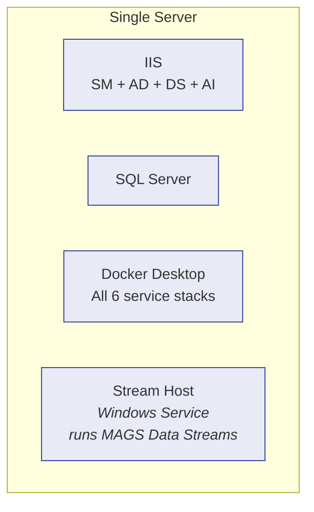

### Option B: Separated (Production)

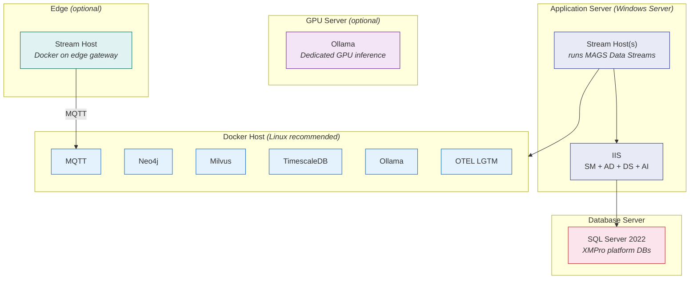

---

## Port Reference

### XMPro Platform

| Component | Port | Protocol | Description |
|-----------|------|----------|-------------|
| **Subscription Manager** | 5201 | HTTPS | Identity, licensing, access control |
| **App Designer** | 5202 | HTTPS | Dashboard and application UI |
| **Data Stream Designer** | 5203 | HTTPS | Data pipeline design UI |
| **XMPro AI** | - | HTTPS | MAGS agent management, conversations, monitoring |
| **SQL Server** | 1433 | TDS | Platform databases |

### Docker Infrastructure

| Service | Port | Protocol | Description |
|---------|------|----------|-------------|
| **Neo4j** | 7474 | HTTP | Browser UI |
| | 7473 | HTTPS | Browser UI (SSL) |
| | 7687 | Bolt/Bolt+TLS | Query protocol |
| **MQTT** | 1883 | TCP | Pub/sub messaging |
| | 8883 | TLS | Encrypted pub/sub |
| | 9002 | WebSocket | Browser clients |
| **Milvus** | 19530 | gRPC | Vector operations |
| | 9091 | HTTP | Health / management |
| | 9001 | HTTP | MinIO console |
| | 8001 | HTTPS | Attu web UI |
| **TimescaleDB** | 5432 | PostgreSQL | Database |
| | 5050/5051 | HTTP/HTTPS | pgAdmin |
| | 3000/3443 | HTTP/HTTPS | PostgREST API |
| **Ollama** | 11434 | HTTP | LLM API |
| | 11443 | HTTPS | LLM API (SSL) |
| **OTEL LGTM** | 3001/3444 | HTTP/HTTPS | Grafana dashboards |
| | 4317 | gRPC | OTLP receiver |
| | 4318 | HTTP | OTLP receiver |

---

## Deployment Modes (Docker Infrastructure)

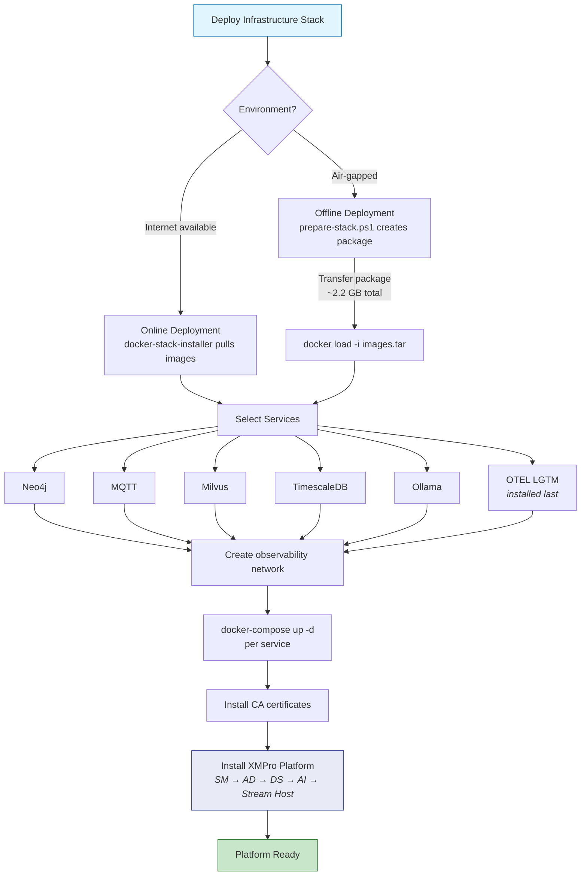

**Cross-platform:** Docker infrastructure uses identical Compose configurations with platform-specific installer scripts (PowerShell for Windows, Bash for Linux). The XMPro platform components require Windows Server with IIS.
