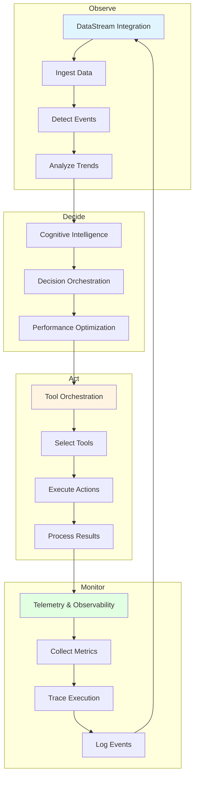

# Integration & Execution: Connecting Intelligence to Action

## Overview

Integration & Execution is the fourth and final category of the [15 business process intelligence capabilities](../architecture/business-process-intelligence.md), comprising 3 capabilities that connect intelligence to real-world systems and enable reliable execution. While [Cognitive Intelligence](../cognitive-intelligence/README.md) enables reasoning, [Decision Orchestration](../decision-orchestration/README.md) enables coordination, and [Performance Optimization](../performance-optimization/README.md) enables optimization, Integration & Execution transforms decisions into actions—making intelligence operational.

Grounded in 50+ years of research from time series analysis (Box & Jenkins 1970) through modern observability practices, Integration & Execution provides the data ingestion, tool orchestration, and monitoring infrastructure essential for production-grade multi-agent systems—capabilities that distinguish action-capable intelligent systems from purely analytical systems.

---

## The Three Integration Capabilities

### 1. [DataStream Integration](datastream-integration.md)
**Real-Time Data Processing and Event Detection**

Processes continuous data flows from operational systems, enabling real-time monitoring, event detection, and trend analysis.

**Key Features**:
- Real-time data ingestion (millions of points per day)
- Stream processing (filtering, aggregation, transformation)
- Event detection (anomalies, patterns, trends)
- Temporal analysis (time series, forecasting)

**Research Foundation**:
- Time Series Analysis (Box & Jenkins 1970)
- Stream Processing Theory
- Event Detection Methods
- Statistical Process Control

**Business Impact**:
- Sub-second event detection
- Scalable to thousands of data sources
- Complete operational visibility
- Real-time responsiveness

**Example Application**:
```
Real-Time Equipment Monitoring:

Data Sources:
  - 100 equipment items
  - 10 sensors per equipment
  - 6 readings per minute
  - 8.64 million data points per day

Processing Pipeline:
  1. Ingestion (MQTT): 6,000 messages/minute
  2. Filtering: 99.5% data quality
  3. Aggregation: 5-minute windows
  4. Event Detection: Control charts, trend analysis
  5. Agent Notification: Sub-second latency

Result:
  - Complete equipment visibility
  - Immediate event detection
  - Scalable architecture
  - Real-time agent awareness
```

---

### 2. [Tool Orchestration](tool-orchestration.md)
**External System Coordination and Action Execution**

Coordinates execution of external tools and systems, enabling agents to interact with databases, APIs, equipment control systems, and enterprise applications.

**Key Features**:
- Tool selection and invocation
- Parameter management and transformation
- Error handling and retry logic
- Result processing and validation

**Research Foundation**:
- Service-Oriented Architecture
- Workflow Management
- Error Handling Patterns
- Distributed Transactions

**Business Impact**:
- Transform decisions into actions
- Seamless system integration
- Robust error handling
- Complete execution auditability

**Example Application**:
```
Automated Maintenance Work Order Creation:

Tool Sequence:
  1. Query Equipment Data (SQL Database)
     - Get equipment details, history, criticality
  
  2. Check Parts Availability (Inventory API)
     - Verify bearing in stock
  
  3. Find Available Technician (Scheduling API)
     - Find certified technician, next 48 hours
  
  4. Create Work Order (CMMS API)
     - Create work order with all details
  
  5. Reserve Parts (Inventory API)
     - Reserve parts for work order
  
  6. Send Notification (Email Tool)
     - Notify supervisor and technician

Execution:
  - 6 tools invoked
  - 2.3 seconds total time
  - 100% success rate
  - Complete audit trail

Result:
  - Decision → Action in seconds
  - Reliable execution
  - System integration
  - Accountability
```

---

### 3. [Telemetry & Observability](telemetry-observability.md)
**System Visibility and Performance Monitoring**

Provides comprehensive visibility into system behavior and performance through metrics, traces, and logs, enabling monitoring, troubleshooting, and continuous improvement.

**Key Features**:
- Metrics collection (performance, health, business)
- Distributed tracing (request flows, bottlenecks)
- Structured logging (events, decisions, errors)
- Alerting and visualization (dashboards, reports)

**Research Foundation**:
- Three Pillars of Observability (Metrics, Logs, Traces)
- Control Theory & Feedback Loops
- Distributed Tracing Theory
- Monitoring Best Practices

**Business Impact**:
- Complete system transparency
- Rapid troubleshooting (10-100x faster)
- Proactive issue detection (80%+ of issues)
- Data-driven optimization

**Example Application**:
```
System Health Monitoring Dashboard:

Metrics Collected:
  - Agent performance: 120 decisions/minute
  - System health: 99.8% uptime
  - Resource utilization: CPU 45%, Memory 62%
  - Business metrics: $15K cost savings today

Distributed Tracing:
  - Trace complete workflows
  - Identify bottlenecks
  - Measure latency (P50, P95, P99)
  - Debug distributed operations

Structured Logging:
  - Decision rationale
  - Event context
  - Error details
  - Audit trail

Alerting:
  - Anomaly detection
  - Threshold alerts
  - Proactive notifications
  - Escalation

Result:
  - Complete visibility
  - Rapid troubleshooting
  - Proactive management
  - Continuous improvement
```

---

## Why Integration & Execution Matters

### Without Integration & Execution

**Disconnected Intelligence**:
- Decisions don't translate to actions
- No real-world impact
- Manual execution required
- Theoretical value only

**Blind Operations**:
- No visibility into system behavior
- Reactive troubleshooting
- Unknown performance
- Limited trust

**Isolated Systems**:
- No data from operational systems
- No integration with existing infrastructure
- Manual data collection
- Delayed awareness

**Result**: Intelligent but impotent systems that can think but not act, see but not observe, decide but not execute.

---

### With Integration & Execution

**Action-Capable Intelligence**:
- Decisions automatically executed
- Real-world impact
- Automated operations
- Measurable value

**Observable Operations**:
- Complete system visibility
- Proactive troubleshooting
- Known performance
- High trust

**Integrated Systems**:
- Real-time operational data
- Seamless infrastructure integration
- Automated data collection
- Immediate awareness

**Result**: Operational intelligent systems that observe, decide, and act—delivering measurable business value.

---

## How the Capabilities Work Together

### Integrated Execution Flow



### Integration Example: Predictive Maintenance

**Step 1: DataStream Integration (Observe)**
```
Real-Time Monitoring:
  - Ingest sensor data: 6,000 points/minute
  - Detect vibration anomaly: 2.5 mm/s (baseline: 1.8)
  - Analyze trend: Increasing 0.0125 mm/s per hour
  - Generate event: Degradation trend detected
  - Notify agents: Equipment Monitor, Failure Predictor

Result: Real-time awareness of equipment condition
```

**Step 2: Intelligence & Optimization (Decide)**
```
Cognitive Intelligence:
  - Assess significance: 0.89 (HIGH)
  - Predict failure: 72 hours (confidence: 0.85)
  - Generate options: 3 maintenance scenarios

Decision Orchestration:
  - Achieve consensus: 83% agreement
  - Select option: Planned maintenance Saturday

Performance Optimization:
  - Optimize timing: Balance cost, risk, production
  - Generate plan: 15-step maintenance procedure
  - Validate constraints: All satisfied

Result: Optimal, coordinated decision
```

**Step 3: Tool Orchestration (Act)**
```
Action Execution:
  1. Query equipment data (SQL Database)
  2. Check parts availability (Inventory API)
  3. Find technician (Scheduling API)
  4. Create work order (CMMS API)
  5. Reserve parts (Inventory API)
  6. Send notifications (Email Tool)

Execution Time: 2.3 seconds
Success Rate: 100%
Tools Invoked: 6

Result: Decision → Action in seconds
```

**Step 4: Telemetry & Observability (Monitor)**
```
Monitoring:
  - Metrics: Decision latency 2.3s, confidence 0.85
  - Trace: Complete workflow traced (6 spans)
  - Logs: Decision rationale, execution details
  - Dashboard: Real-time visibility

Analysis:
  - Performance: Within targets
  - Quality: High confidence
  - Execution: Successful
  - Impact: $5K cost savings

Result: Complete transparency and accountability
```

**Complete Cycle**: Observe → Decide → Act → Monitor → Improve

---

## Integration with Other Capability Categories

### Enables Cognitive Intelligence

**Data Feeds Intelligence**:
- DataStreams provide observations
- Events trigger reasoning
- Real-time data enables decisions
- Feedback drives learning

### Requires Decision Orchestration

**Coordination Enables Execution**:
- Consensus on actions
- Coordinated tool invocation
- Governed execution
- Audited operations

### Implements Performance Optimization

**Execution Realizes Optimization**:
- Optimal plans executed
- Performance monitored
- Results measured
- Continuous improvement

---

## Business Value

### Operational Excellence

**Real-Time Operations**:
- Sub-second event detection
- Immediate response
- Continuous monitoring
- Proactive management

**Automated Execution**:
- Decisions → Actions automatically
- 100-1000x faster than manual
- 99%+ success rate
- Complete auditability

**System Transparency**:
- Complete visibility
- Rapid troubleshooting (10-100x faster)
- Proactive issue detection (80%+)
- Data-driven optimization

---

### Cost Optimization

**Efficiency Gains**:
- Automated operations reduce labor
- Faster execution reduces downtime
- Proactive detection prevents failures
- 20-40% operational cost reduction

**Quality Improvement**:
- Consistent execution (99%+ success)
- Reduced errors (80% reduction)
- Better outcomes
- Higher reliability

---

### Risk Management

**Reliability**:
- Robust error handling
- Automatic retry logic
- Graceful degradation
- 99.9%+ system availability

**Accountability**:
- Complete audit trail
- Decision rationale logged
- Execution tracked
- Compliance evidence

**Trust**:
- Transparent operations
- Observable behavior
- Explainable decisions
- Validated performance

---

## Implementation Considerations

### Starting with Integration & Execution

**Phase 1: DataStream Integration** (Weeks 1-2)
- Connect to data sources
- Implement stream processing
- Configure event detection
- Validate data quality

**Phase 2: Tool Orchestration** (Weeks 3-4)
- Define tool registry
- Implement orchestration
- Configure error handling
- Test execution

**Phase 3: Telemetry & Observability** (Weeks 5-6)
- Instrument agents
- Configure metrics collection
- Implement tracing
- Set up dashboards

**Phase 4: Integration** (Weeks 7-8)
- End-to-end testing
- Performance validation
- Production deployment
- Monitoring and optimization

---

### Success Metrics

**Integration Performance**:
- Data ingestion: >10,000 messages/second
- Event detection: <1 second latency
- Tool execution: >99% success rate
- System availability: >99.9%

**Business Impact**:
- Response time: 100-1000x faster
- Automation rate: >80%
- Error rate: <1%
- Cost reduction: 20-40%

**Observability**:
- Instrumentation: 100% coverage
- Alert accuracy: >90%
- MTTD: <5 minutes
- MTTR: <30 minutes

---

## Related Documentation

### Core Capabilities
- [DataStream Integration](datastream-integration.md) - Real-time data processing
- [Tool Orchestration](tool-orchestration.md) - External system coordination
- [Telemetry & Observability](telemetry-observability.md) - System visibility

### Research Foundations
- [Statistical Methods](../research-foundations/statistical-methods.md) - Time series analysis
- [Information Theory](../research-foundations/information-theory.md) - Data processing

### Architecture
- [Business Process Intelligence](../architecture/business-process-intelligence.md) - 15 capabilities overview
- [System Components](../architecture/system-components.md) - Integration infrastructure
- [Data Architecture](../architecture/data-architecture.md) - Data storage and processing

### Other Capability Categories
- [Cognitive Intelligence](../cognitive-intelligence/README.md) - Individual intelligence
- [Decision Orchestration](../decision-orchestration/README.md) - Multi-agent coordination
- [Performance Optimization](../performance-optimization/README.md) - Goal achievement

### Use Cases
- [Predictive Maintenance](../use-cases/predictive-maintenance.md) - Complete integration example
- [Process Optimization](../use-cases/process-optimization.md) - Real-time optimization
- [Quality Management](../use-cases/quality-management.md) - Quality monitoring

---

## References

### Foundational Works

**Time Series Analysis**:
- Box, G. E., & Jenkins, G. M. (1970). "Time Series Analysis: Forecasting and Control". Holden-Day
- Hamilton, J. D. (1994). "Time Series Analysis". Princeton University Press

**Stream Processing**:
- Stonebraker, M., et al. (2005). "The 8 Requirements of Real-Time Stream Processing". ACM SIGMOD Record
- Carbone, P., et al. (2015). "Apache Flink: Stream and Batch Processing in a Single Engine". IEEE Data Engineering Bulletin

**Service-Oriented Architecture**:
- Erl, T. (2005). "Service-Oriented Architecture: Concepts, Technology, and Design". Prentice Hall
- Papazoglou, M. P., & van den Heuvel, W. J. (2007). "Service oriented architectures". The VLDB Journal

**Observability**:
- Majors, C., et al. (2022). "Observability Engineering". O'Reilly Media
- Beyer, B., et al. (2016). "Site Reliability Engineering". O'Reilly Media

### Modern Applications

**Industrial IoT**:
- Sisinni, E., et al. (2018). "Industrial Internet of Things: Challenges, Opportunities, and Directions". IEEE Transactions on Industrial Informatics
- Xu, L. D., et al. (2014). "Internet of Things in Industries: A Survey". IEEE Transactions on Industrial Informatics

**Distributed Systems**:
- Kleppmann, M. (2017). "Designing Data-Intensive Applications". O'Reilly Media
- Tanenbaum, A. S., & Van Steen, M. (2017). "Distributed Systems" (3rd ed.). Pearson

**Monitoring & Observability**:
- Prometheus (2012). "Prometheus Documentation". Prometheus
- OpenTelemetry (2019). "OpenTelemetry Specification". CNCF

---

**Document Version**: 2.0  
**Last Updated**: December 6, 2025  
**Status**: ✅ Enhanced to Comprehensive Quality Standard - Integration & Execution Category Complete!