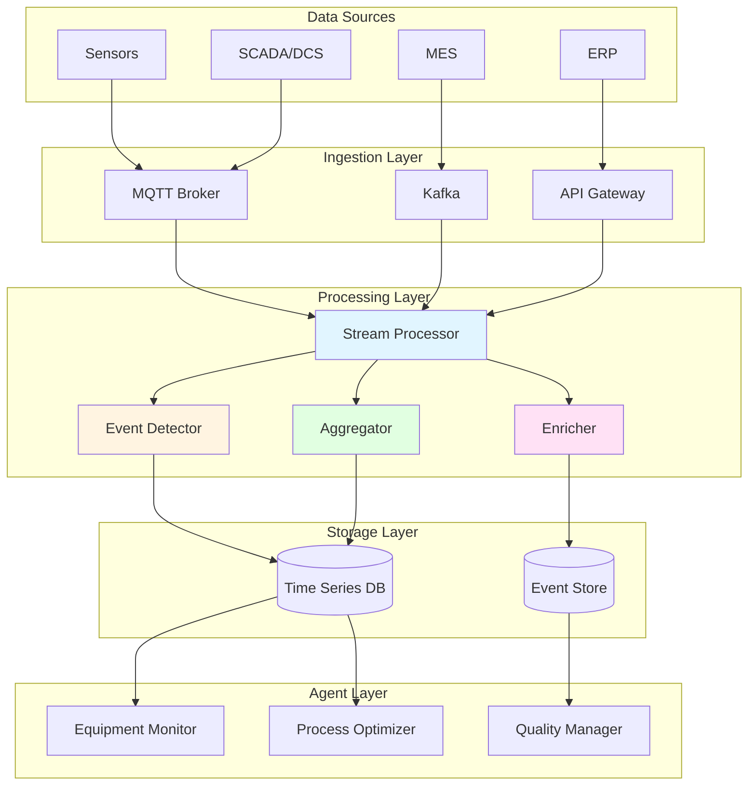

# DataStream Integration: Real-Time Data Processing

## Overview

DataStream Integration processes continuous data flows from operational systems, enabling real-time monitoring, event detection, and trend analysis for industrial operations. Grounded in 50+ years of research from time series analysis (Box & Jenkins 1970) through modern stream processing architectures, this capability provides the data ingestion and processing infrastructure essential for responsive, data-driven multi-agent systems—enabling agents to observe the real world in real-time and react immediately to changing conditions.

In industrial environments, operational data flows continuously from thousands of sensors, equipment controllers, quality systems, and business applications. DataStream Integration provides the frameworks to ingest this data at scale, process it in real-time, detect significant events, and make it available to agents for decision-making—capabilities that distinguish real-time intelligent systems from batch-processing or polling-based approaches.

### Why DataStream Integration Matters for MAGS

**The Challenge**: Industrial operations generate massive continuous data streams (millions of data points per day) that must be processed in real-time for monitoring, event detection, and decision-making—not just stored for later analysis.

**The Solution**: Stream processing architectures, time series analysis, and event detection algorithms provide scalable, real-time data processing infrastructure.

**The Result**: MAGS agents that observe operations in real-time, detect events within seconds, analyze trends continuously, and respond immediately to changing conditions—grounded in 50+ years of validated time series and stream processing research.

### Key Business Drivers

1. **Real-Time Responsiveness**: Sub-second event detection enables immediate response
2. **Scalability**: Process millions of data points per day from thousands of sources
3. **Event Detection**: Identify significant events automatically in continuous data
4. **Trend Analysis**: Detect patterns and trends as they emerge
5. **Operational Visibility**: Complete real-time view of operations

---

## Theoretical Foundations

### Time Series Analysis (1970)

**George Box & Gwilym Jenkins** - "Time Series Analysis: Forecasting and Control"

**Core Insight**: Time-ordered data exhibits patterns (trends, seasonality, autocorrelation) that can be modeled mathematically for forecasting and analysis. ARIMA models provide systematic framework for time series analysis.

**Key Principles**:

**ARIMA Models**:
- AutoRegressive (AR): Value depends on previous values
- Integrated (I): Differencing to achieve stationarity
- Moving Average (MA): Value depends on previous errors
- Combined: ARIMA(p,d,q) models

**Stationarity**:
- Statistical properties constant over time
- Required for many analysis methods
- Achieved through differencing or transformation
- Foundation for forecasting

**MAGS Application**:
- Sensor data analysis
- Trend detection
- Forecasting
- Anomaly detection

**Example**:
```
Equipment Vibration Time Series:

Data: Vibration measurements every 10 seconds
Pattern Analysis:
  - Trend: Gradually increasing (degradation)
  - Seasonality: Daily cycle (load variation)
  - Autocorrelation: Strong at lag 1 (smooth changes)

ARIMA Model: ARIMA(1,1,0)
  - AR(1): Current value depends on previous
  - I(1): First differencing for stationarity
  - MA(0): No moving average component

Forecast:
  - Next hour: 2.3 mm/s (±0.2)
  - Next day: 2.5 mm/s (±0.4)
  - Trend: Increasing, maintenance needed

Box-Jenkins principle:
  - Systematic time series modeling
  - Pattern identification
  - Statistical forecasting
  - Trend detection
```

---

### Stream Processing Theory

**Core Insight**: Continuous data streams require different processing paradigms than batch data. Stream processing enables real-time analysis of unbounded data sequences.

**Key Principles**:

**Stream Characteristics**:
- Unbounded: No defined end
- Continuous: Arrives continuously
- Ordered: Time-ordered sequence
- High-volume: Millions of events per day

**Processing Patterns**:
- Filtering: Select relevant events
- Aggregation: Summarize over windows
- Transformation: Convert formats
- Enrichment: Add context

**Windowing**:
- Tumbling: Fixed, non-overlapping windows
- Sliding: Overlapping windows
- Session: Activity-based windows
- Global: Entire stream

**MAGS Application**:
- Real-time sensor processing
- Event stream analysis
- Continuous aggregation
- Pattern detection

---

### Event Detection Methods

**Core Insight**: Significant events in continuous data can be detected automatically using statistical methods and pattern recognition.

**Key Principles**:

**Threshold-Based Detection**:
- Simple threshold crossing
- Hysteresis for stability
- Adaptive thresholds
- Multi-parameter thresholds

**Statistical Detection**:
- Control charts (Shewhart)
- CUSUM (cumulative sum)
- EWMA (exponentially weighted moving average)
- Bayesian change detection

**Pattern-Based Detection**:
- Signature matching
- Correlation analysis
- Sequence detection
- Complex event processing

**MAGS Application**:
- Anomaly detection
- Alarm generation
- Event correlation
- Trend identification

---

## What It Does

### Core Capabilities

**Real-Time Data Ingestion**:
- Connects to multiple data sources
- Handles high-volume streams
- Manages backpressure
- Ensures data quality

**Stream Processing**:
- Filters irrelevant data
- Aggregates over time windows
- Transforms data formats
- Enriches with context

**Event Detection**:
- Identifies significant events
- Detects anomalies
- Recognizes patterns
- Correlates multiple streams

**Temporal Analysis**:
- Analyzes trends
- Detects seasonality
- Forecasts future values
- Identifies cycles

---

## How It Works

### DataStream Architecture



### Stream Processing Pipeline

**Stage 1: Data Ingestion**

*Sources*:
```
Sensor Data:
  - Equipment sensors (vibration, temperature, pressure)
  - Frequency: 1-60 seconds
  - Volume: 1000+ sensors × 60 readings/hour = 60K+ points/hour

Process Data:
  - Production metrics (throughput, quality, yield)
  - Frequency: 1-5 minutes
  - Volume: 100+ metrics × 12 readings/hour = 1.2K+ points/hour

Event Data:
  - Alarms, notifications, state changes
  - Frequency: As-occurs
  - Volume: Variable, 100-1000+ events/day

Business Data:
  - Orders, inventory, schedules
  - Frequency: Minutes to hours
  - Volume: 10-100+ updates/hour
```

*Ingestion Protocols*:
```
MQTT:
  - Lightweight pub-sub
  - IoT optimized
  - QoS levels
  - Use: Sensor data

Kafka:
  - High-throughput
  - Distributed
  - Persistent
  - Use: Process and business data

REST APIs:
  - Request-response
  - Standard protocol
  - Synchronous
  - Use: External systems
```

**Stage 2: Stream Filtering**

*Purpose*: Remove irrelevant data, reduce volume

*Filters*:
```
Quality Filter:
  - Remove invalid readings (out of range, null, error codes)
  - Validate data types
  - Check timestamps
  - Example: Filter sensor readings < 0 or > max_range

Relevance Filter:
  - Select data relevant to current context
  - Filter by equipment, process, time
  - Example: Only vibration data for equipment under maintenance

Rate Limiting:
  - Downsample high-frequency data
  - Reduce processing load
  - Example: Aggregate 1-second readings to 10-second averages
```

**Stage 3: Stream Aggregation**

*Purpose*: Summarize data over time windows

*Window Types*:
```
Tumbling Window (Fixed, Non-Overlapping):
  Window: 5 minutes
  Data: Sensor readings every 10 seconds
  Aggregation: Average, min, max, stddev
  Output: One aggregate per 5-minute window
  
  Example:
    00:00-00:05: Avg 2.1 mm/s, Max 2.4 mm/s
    00:05-00:10: Avg 2.3 mm/s, Max 2.6 mm/s
    00:10-00:15: Avg 2.5 mm/s, Max 2.8 mm/s

Sliding Window (Overlapping):
  Window: 10 minutes
  Slide: 1 minute
  Aggregation: Moving average
  Output: Updated every minute
  
  Example:
    00:00-00:10: Avg 2.2 mm/s
    00:01-00:11: Avg 2.3 mm/s
    00:02-00:12: Avg 2.4 mm/s

Session Window (Activity-Based):
  Trigger: Equipment running
  Aggregation: Production metrics
  Output: One aggregate per production run
  
  Example:
    Run 1 (08:00-12:00): 450 units, 98.2% quality
    Run 2 (13:00-17:00): 480 units, 97.8% quality
```

**Stage 4: Event Detection**

*Methods*:
```
Threshold Detection:
  Condition: Value > threshold
  Example: Vibration > 2.5 mm/s
  Action: Generate alarm event
  
  With Hysteresis:
    Alarm threshold: 2.5 mm/s
    Clear threshold: 2.0 mm/s
    Prevents alarm flapping

Statistical Detection (Control Chart):
  Baseline: Mean = 2.0 mm/s, StdDev = 0.3 mm/s
  Control limits: Mean ± 3σ = [1.1, 2.9] mm/s
  Detection: Value outside control limits
  
  Example:
    Reading: 3.1 mm/s
    Status: Above upper control limit
    Action: Generate anomaly event

Pattern Detection:
  Pattern: Gradual increase over 24 hours
  Detection: Linear regression slope > threshold
  
  Example:
    Hour 0: 2.0 mm/s
    Hour 12: 2.3 mm/s
    Hour 24: 2.6 mm/s
    Slope: +0.025 mm/s per hour
    Status: Degradation pattern detected
    Action: Generate trend event
```

**Stage 5: Stream Enrichment**

*Purpose*: Add context to events

*Enrichment Types*:
```
Equipment Context:
  Event: Vibration alarm on Pump-101
  Enrichment:
    - Equipment type: Centrifugal pump
    - Criticality: High
    - Maintenance history: Last service 90 days ago
    - Current status: Running
    - Production impact: Critical path

Historical Context:
  Event: Temperature spike
  Enrichment:
    - Historical baseline: 68°C
    - Current deviation: +15°C
    - Similar events: 3 in past year
    - Outcomes: 2 led to failure, 1 false alarm

Operational Context:
  Event: Quality deviation
  Enrichment:
    - Current production run: Batch-2025-1234
    - Product: Product-A
    - Shift: Day shift
    - Operator: Operator-5
```

---

## MAGS Implementation

### Stream Processing Example

**Scenario**: Real-time equipment monitoring

**Data Sources**:
```
Equipment: Pump-101
Sensors:
  - Vibration: Every 10 seconds
  - Temperature: Every 10 seconds
  - Pressure: Every 10 seconds
  - Flow rate: Every 10 seconds

Volume: 4 sensors × 6 readings/minute = 24 data points/minute
Daily: 24 × 60 × 24 = 34,560 data points/day
```

**Processing Pipeline**:
```
1. Ingestion (MQTT):
   Topic: equipment/pump-101/sensors
   QoS: 1 (at least once)
   Format: JSON
   
   Message:
   {
     "timestamp": "2025-12-06T10:30:00Z",
     "equipment_id": "Pump-101",
     "vibration": 2.3,
     "temperature": 72,
     "pressure": 120,
     "flow_rate": 450
   }

2. Filtering:
   - Validate ranges (vibration 0-10, temp 0-150, etc.)
   - Remove duplicates
   - Check timestamp ordering
   
   Result: 99.8% data quality

3. Aggregation (5-minute tumbling window):
   Window: 00:30-00:35
   Aggregates:
     vibration_avg: 2.3 mm/s
     vibration_max: 2.5 mm/s
     vibration_stddev: 0.15 mm/s
     temperature_avg: 72°C
     temperature_max: 74°C
   
   Output: 1 aggregate per 5 minutes = 288 aggregates/day

4. Event Detection:
   Control Chart:
     Baseline: vibration_avg = 2.0 mm/s, σ = 0.3 mm/s
     Upper control limit: 2.0 + 3×0.3 = 2.9 mm/s
     Current: 2.3 mm/s
     Status: Within control ✓
   
   Trend Detection:
     Last 24 hours: 2.0 → 2.3 mm/s
     Slope: +0.0125 mm/s per hour
     Threshold: 0.01 mm/s per hour
     Status: Degradation trend detected ⚠️
     
   Event Generated:
   {
     "event_type": "degradation_trend",
     "equipment_id": "Pump-101",
     "parameter": "vibration",
     "severity": "medium",
     "trend_slope": 0.0125,
     "confidence": 0.85
   }

5. Enrichment:
   Event + Context:
   {
     "event": {...},
     "equipment": {
       "type": "centrifugal_pump",
       "criticality": "high",
       "last_maintenance": "2025-09-06"
     },
     "historical": {
       "baseline": 2.0,
       "similar_events": 5,
       "failure_rate": 0.60
     }
   }

6. Agent Notification:
   Publish to: agents/equipment-monitor/events
   Subscribers: Equipment Monitor, Failure Predictor
   
   Result: Agents notified within 1 second of detection
```

---

## Design Patterns

### Pattern 1: Lambda Architecture

**When to Use**:
- Need both real-time and batch processing
- Historical analysis required
- Fault tolerance important

**Architecture**:
```
Speed Layer (Real-Time):
  - Stream processing
  - Approximate results
  - Low latency
  - Recent data

Batch Layer (Historical):
  - Batch processing
  - Accurate results
  - High latency
  - All historical data

Serving Layer:
  - Merge results
  - Query interface
  - Unified view
```

---

### Pattern 2: Kappa Architecture

**When to Use**:
- Stream processing sufficient
- Simpler architecture preferred
- Real-time focus

**Architecture**:
```
Single Stream Processing Layer:
  - All data as streams
  - Reprocess from log
  - Simpler than Lambda
  - Real-time focus
```

---

### Pattern 3: Event Sourcing

**When to Use**:
- Complete audit trail needed
- Replay capability required
- Event-driven architecture

**Architecture**:
```
Event Store:
  - Immutable event log
  - Complete history
  - Replay capability
  - Audit trail

Projections:
  - Derived views
  - Materialized state
  - Query optimization
```

---

## Integration with Other Capabilities

### With Cognitive Intelligence

**DataStreams Feed Intelligence**:
- Observations from sensor streams
- Events trigger memory formation
- Trends inform predictions
- Real-time data enables reasoning

---

### With Decision Orchestration

**Data Enables Coordination**:
- Shared data visibility
- Event-driven coordination
- Real-time consensus
- Data-driven decisions

---

### With Performance Optimization

**Streams Enable Optimization**:
- Real-time objective tracking
- Performance monitoring
- Trend-based optimization
- Continuous improvement

---

## Use Cases

### Use Case 1: Real-Time Equipment Monitoring

**Scenario**: Monitor 100 equipment items in real-time

**Data Volume**:
```
Equipment: 100 items
Sensors per equipment: 10
Reading frequency: 10 seconds
Data points: 100 × 10 × 6/min = 6,000 points/minute
Daily: 6,000 × 60 × 24 = 8.64 million points/day
```

**Processing**:
```
Ingestion:
  - MQTT broker
  - 6,000 messages/minute
  - QoS 1 (at least once)

Filtering:
  - Validate ranges
  - Remove duplicates
  - 99.5% data quality

Aggregation:
  - 5-minute windows
  - 100 equipment × 10 sensors = 1,000 aggregates per 5 min
  - 288,000 aggregates/day

Event Detection:
  - Control charts per sensor
  - Trend detection
  - Pattern matching
  - ~100-500 events/day

Agent Notification:
  - Real-time event stream
  - Sub-second latency
  - Enriched with context
```

**Result**:
- Complete equipment visibility
- Immediate event detection
- Scalable to 1000+ equipment
- Sub-second response time

---

### Use Case 2: Process Quality Monitoring

**Scenario**: Real-time quality monitoring for production line

**Data Streams**:
```
Quality Measurements:
  - Dimensional checks: Every product
  - Chemical analysis: Every batch
  - Visual inspection: Every product
  - Performance tests: Sample basis

Volume: 1000 products/day × 5 measurements = 5,000 measurements/day
```

**Processing**:
```
Real-Time Analysis:
  - Statistical process control
  - Trend detection
  - Correlation analysis
  - Defect prediction

Event Detection:
  - Out-of-spec detection
  - Trend alerts
  - Pattern recognition
  - Predictive alerts

Actions:
  - Immediate operator notification
  - Automatic process adjustment
  - Quality hold if needed
  - Root cause investigation
```

**Result**:
- Real-time quality assurance
- Immediate defect detection
- Proactive quality management
- Reduced scrap and rework

---

### Use Case 3: Predictive Maintenance Data Pipeline

**Scenario**: Continuous data collection for predictive maintenance

**Data Collection**:
```
Equipment Data:
  - Vibration: 10-second intervals
  - Temperature: 10-second intervals
  - Current: 10-second intervals
  - Operating hours: Continuous

Maintenance Data:
  - Work orders: As-occurs
  - Failure events: As-occurs
  - Maintenance history: Historical

Volume: 50 equipment × 3 sensors × 6/min = 900 points/minute
```

**Processing Pipeline**:
```
Feature Engineering:
  - Statistical features (mean, std, max, min)
  - Frequency domain features (FFT)
  - Trend features (slope, acceleration)
  - Contextual features (operating mode, load)

Pattern Detection:
  - Degradation patterns
  - Failure signatures
  - Anomaly detection
  - Similarity matching

Prediction:
  - Remaining useful life
  - Failure probability
  - Maintenance timing
  - Confidence scoring
```

**Result**:
- Continuous condition monitoring
- Early failure detection
- Optimized maintenance timing
- Reduced unplanned downtime

---

## Measuring Success

### Performance Metrics

```
Ingestion Performance:
  Target: >10,000 messages/second
  Measurement: Messages processed per second

Processing Latency:
  Target: <1 second end-to-end
  Measurement: Time from ingestion to agent notification

Data Quality:
  Target: >99% valid data
  Measurement: (Valid points / Total points) × 100%

Event Detection Accuracy:
  Target: >95% true positive rate
  Target: <5% false positive rate
  Measurement: Confusion matrix analysis
```

### Business Impact Metrics

```
Response Time:
  Baseline: Minutes to hours (manual monitoring)
  Target: <1 second (automated)
  Improvement: 100-1000x faster

Event Detection:
  Baseline: 60% detection rate (manual)
  Target: >95% detection rate (automated)
  Improvement: 35+ percentage points

Operational Visibility:
  Baseline: Partial, delayed
  Target: Complete, real-time
  Impact: Comprehensive situational awareness
```

---

## Related Documentation

### Core Concepts
- [ORPA Cycle](../concepts/orpa-cycle.md) - Observe phase
- [Memory Systems](../concepts/memory-systems.md) - Episodic memory

### Research Foundations
- [Statistical Methods](../research-foundations/statistical-methods.md) - Time series analysis
- [Information Theory](../research-foundations/information-theory.md) - Data processing

### Cognitive Intelligence
- [Memory Significance](../cognitive-intelligence/memory-significance.md) - Event significance
- [Synthetic Memory](../cognitive-intelligence/synthetic-memory.md) - Pattern learning

### Integration & Execution
- [Tool Orchestration](tool-orchestration.md) - Data access tools
- [Telemetry & Observability](telemetry-observability.md) - System monitoring
- [Integration & Execution Overview](README.md) - Category overview

### Architecture
- [System Components](../architecture/system-components.md) - DataStream infrastructure
- [Data Architecture](../architecture/data-architecture.md) - Data storage

### Use Cases
- [Predictive Maintenance](../use-cases/predictive-maintenance.md) - Continuous monitoring
- [Process Optimization](../use-cases/process-optimization.md) - Real-time optimization
- [Quality Management](../use-cases/quality-management.md) - Quality monitoring

---

## References

### Foundational Works

**Time Series Analysis**:
- Box, G. E., & Jenkins, G. M. (1970). "Time Series Analysis: Forecasting and Control". Holden-Day
- Hamilton, J. D. (1994). "Time Series Analysis". Princeton University Press

**Stream Processing**:
- Stonebraker, M., et al. (2005). "The 8 Requirements of Real-Time Stream Processing". ACM SIGMOD Record, 34(4), 42-47
- Carbone, P., et al. (2015). "Apache Flink: Stream and Batch Processing in a Single Engine". IEEE Data Engineering Bulletin, 38(4), 28-38

**Event Detection**:
- Basseville, M., & Nikiforov, I. V. (1993). "Detection of Abrupt Changes: Theory and Application". Prentice Hall
- Chandola, V., et al. (2009). "Anomaly Detection: A Survey". ACM Computing Surveys, 41(3), 1-58

### Modern Applications

**Industrial IoT**:
- Sisinni, E., et al. (2018). "Industrial Internet of Things: Challenges, Opportunities, and Directions". IEEE Transactions on Industrial Informatics, 14(11), 4724-4734
- Xu, L. D., et al. (2014). "Internet of Things in Industries: A Survey". IEEE Transactions on Industrial Informatics, 10(4), 2233-2243

**Stream Processing Systems**:
- Zaharia, M., et al. (2013). "Discretized Streams: Fault-Tolerant Streaming Computation at Scale". In Proceedings of SOSP
- Akidau, T., et al. (2015). "The Dataflow Model: A Practical Approach to Balancing Correctness, Latency, and Cost in Massive-Scale, Unbounded, Out-of-Order Data Processing". In Proceedings of VLDB

**Time Series Databases**:
- Dunning, T., & Friedman, E. (2014). "Time Series Databases: New Ways to Store and Access Data". O'Reilly Media
- Jensen, S. K., et al. (2017). "Time Series Management Systems: A Survey". IEEE Transactions on Knowledge and Data Engineering, 29(11), 2581-2600

---

**Document Version**: 2.0  
**Last Updated**: December 6, 2025  
**Status**: ✅ Enhanced to Comprehensive Quality Standard