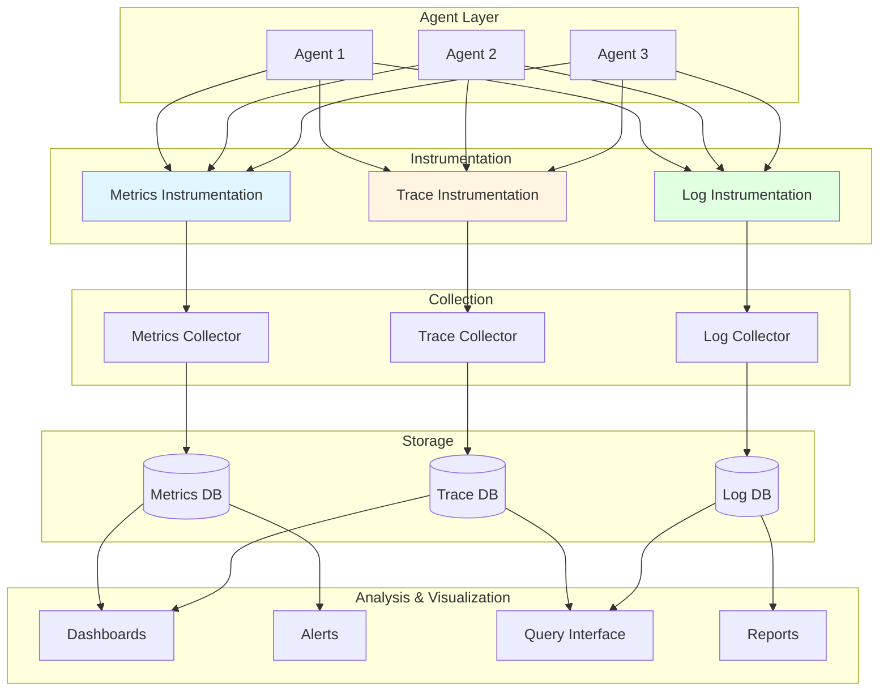

# Telemetry & Observability: System Visibility

## Overview

Telemetry & Observability provides comprehensive visibility into system behavior and performance through metrics, traces, and logs, enabling monitoring, troubleshooting, and continuous improvement. This capability transforms opaque "black box" systems into transparent, understandable, and debuggable systems—enabling operators to understand what agents are doing, why they're doing it, and how well it's working.

In industrial environments, autonomous agents must be observable and accountable. Operators need to monitor system health, troubleshoot issues, understand decision rationale, and validate performance. Telemetry & Observability provides the instrumentation, collection, and visualization infrastructure to make multi-agent systems transparent and trustworthy—capabilities that distinguish production-grade observable systems from opaque autonomous systems.

### Why Telemetry & Observability Matters for MAGS

**The Challenge**: Autonomous multi-agent systems must be transparent, debuggable, and accountable—not opaque black boxes. Operators need to understand system behavior, troubleshoot issues, and validate performance.

**The Solution**: Comprehensive telemetry (metrics, traces, logs) combined with observability practices (dashboards, alerts, analysis) provides complete system visibility.

**The Result**: MAGS systems that are transparent, debuggable, accountable, and continuously improving—enabling operators to trust and effectively manage autonomous operations.

### Key Business Drivers

1. **Operational Visibility**: Complete real-time view of system behavior
2. **Troubleshooting**: Rapid issue identification and resolution
3. **Performance Optimization**: Data-driven performance improvement
4. **Accountability**: Complete audit trail for compliance
5. **Trust**: Transparency builds operator confidence

---

## Theoretical Foundations

### The Three Pillars of Observability

**Core Insight**: System observability requires three complementary data types—metrics (what), logs (why), and traces (how)—working together to provide complete visibility.

**Key Principles**:

**Metrics** (Quantitative):
- Numerical measurements over time
- Aggregatable and queryable
- Efficient storage and transmission
- Trend analysis and alerting

**Logs** (Qualitative):
- Discrete event records
- Rich contextual information
- Searchable and filterable
- Root cause analysis

**Traces** (Relational):
- Request flow through system
- Timing and dependencies
- Distributed system visibility
- Performance bottleneck identification

**MAGS Application**:
- Metrics: Agent performance, system health
- Logs: Decision rationale, events, errors
- Traces: Multi-agent workflows, tool execution

---

### Control Theory & Feedback Loops

**Core Insight**: Observable systems enable feedback loops for control and optimization. Measurements inform adjustments, creating closed-loop control.

**Key Principles**:

**Feedback Loop**:
- Measure: Collect telemetry
- Compare: Actual vs. target
- Decide: Determine adjustment
- Act: Implement change
- Repeat: Continuous cycle

**Control Strategies**:
- Proportional: Adjust based on error magnitude
- Integral: Adjust based on accumulated error
- Derivative: Adjust based on error rate
- PID: Combined control

**MAGS Application**:
- Performance monitoring enables optimization
- Metrics inform decision-making
- Feedback drives continuous improvement
- Closed-loop system control

---

### Distributed Tracing Theory

**Core Insight**: In distributed systems, understanding request flow across components requires correlation of events across services. Distributed tracing provides this correlation.

**Key Principles**:

**Trace Context**:
- Trace ID: Unique request identifier
- Span ID: Unique operation identifier
- Parent Span: Operation hierarchy
- Baggage: Contextual metadata

**Span Attributes**:
- Operation name
- Start/end timestamps
- Status (success/error)
- Tags and annotations

**MAGS Application**:
- Trace multi-agent workflows
- Track tool execution chains
- Identify performance bottlenecks
- Debug distributed operations

---

## What It Does

### Core Capabilities

**Metrics Collection**:
- Collects performance metrics
- Aggregates time-series data
- Calculates statistics
- Enables trend analysis

**Distributed Tracing**:
- Traces request flows
- Correlates distributed operations
- Identifies bottlenecks
- Visualizes execution paths

**Structured Logging**:
- Records events and decisions
- Captures contextual information
- Enables search and analysis
- Provides audit trail

**Alerting & Monitoring**:
- Detects anomalies
- Triggers alerts
- Escalates issues
- Enables proactive response

**Visualization & Analysis**:
- Dashboards for monitoring
- Charts for trend analysis
- Heatmaps for patterns
- Reports for stakeholders

---

## How It Works

### Observability Architecture



### Telemetry Collection

**Metrics Collection**

*Types*:
```
Counter:
  - Monotonically increasing value
  - Example: Total decisions made, total errors
  - Operations: Increment
  
Gauge:
  - Point-in-time value
  - Example: Active agents, memory usage
  - Operations: Set, increment, decrement
  
Histogram:
  - Distribution of values
  - Example: Decision latency, confidence scores
  - Operations: Observe value, calculate percentiles
  
Summary:
  - Statistical summary
  - Example: Request duration quantiles
  - Operations: Observe value, calculate statistics
```

*Example Metrics*:
```
Agent Performance Metrics:
  - agent_decisions_total (counter)
  - agent_decision_latency_seconds (histogram)
  - agent_confidence_score (histogram)
  - agent_errors_total (counter)
  - agent_active_count (gauge)

System Health Metrics:
  - system_cpu_usage_percent (gauge)
  - system_memory_usage_bytes (gauge)
  - system_message_queue_depth (gauge)
  - system_database_connections (gauge)

Business Metrics:
  - equipment_monitored_total (gauge)
  - anomalies_detected_total (counter)
  - maintenance_scheduled_total (counter)
  - cost_savings_dollars (counter)
```

**Distributed Tracing**

*Trace Structure*:
```
Trace: Maintenance Decision Workflow
  Trace ID: trace-12345
  Duration: 2.3 seconds
  
  Span 1: Equipment Monitor - Detect Anomaly
    Span ID: span-001
    Parent: None (root)
    Duration: 0.5 seconds
    Status: Success
    Tags:
      equipment_id: Pump-101
      anomaly_type: vibration_spike
      confidence: 0.89
  
  Span 2: Failure Predictor - Predict Failure
    Span ID: span-002
    Parent: span-001
    Duration: 0.8 seconds
    Status: Success
    Tags:
      prediction: failure_in_72_hours
      confidence: 0.85
  
  Span 3: Maintenance Planner - Generate Options
    Span ID: span-003
    Parent: span-002
    Duration: 0.6 seconds
    Status: Success
    Tags:
      options_generated: 3
      optimal_option: option_2
  
  Span 4: Resource Coordinator - Check Availability
    Span ID: span-004
    Parent: span-003
    Duration: 0.3 seconds
    Status: Success
    Tags:
      parts_available: true
      technician_available: true
  
  Span 5: Team Coordinator - Achieve Consensus
    Span ID: span-005
    Parent: span-003
    Duration: 0.1 seconds
    Status: Success
    Tags:
      consensus_achieved: true
      agreement_percentage: 83
```

**Structured Logging**

*Log Structure*:
```
{
  "timestamp": "2025-12-06T10:30:00.123Z",
  "level": "INFO",
  "agent_id": "equipment-monitor-01",
  "agent_type": "EquipmentMonitor",
  "event_type": "anomaly_detected",
  "trace_id": "trace-12345",
  "span_id": "span-001",
  "message": "Vibration anomaly detected on Pump-101",
  "context": {
    "equipment_id": "Pump-101",
    "parameter": "vibration",
    "current_value": 2.5,
    "baseline": 1.8,
    "deviation_percent": 39,
    "significance_score": 0.89
  },
  "decision": {
    "action": "escalate_to_team",
    "rationale": "Significant deviation from baseline, similar patterns led to failure",
    "confidence": 0.89
  }
}
```

*Log Levels*:
```
TRACE: Detailed diagnostic information
DEBUG: Debugging information
INFO: Informational messages
WARN: Warning messages (potential issues)
ERROR: Error messages (failures)
FATAL: Critical errors (system failure)
```

---

## MAGS Implementation

### Instrumentation Example

**Agent Instrumentation**:
```python
class EquipmentMonitorAgent:
    def __init__(self):
        # Metrics
        self.decisions_counter = Counter('agent_decisions_total', 
                                         'Total decisions made',
                                         ['agent_id', 'decision_type'])
        self.latency_histogram = Histogram('agent_decision_latency_seconds',
                                          'Decision latency',
                                          ['agent_id'])
        self.confidence_histogram = Histogram('agent_confidence_score',
                                             'Decision confidence',
                                             ['agent_id'])
        
        # Tracer
        self.tracer = get_tracer(__name__)
        
        # Logger
        self.logger = get_logger(__name__)
    
    def detect_anomaly(self, equipment_id, sensor_data):
        # Start trace span
        with self.tracer.start_as_current_span("detect_anomaly") as span:
            span.set_attribute("equipment_id", equipment_id)
            
            start_time = time.time()
            
            try:
                # Log start
                self.logger.info(f"Analyzing sensor data for {equipment_id}")
                
                # Perform analysis
                result = self._analyze_sensor_data(sensor_data)
                
                # Record metrics
                latency = time.time() - start_time
                self.latency_histogram.labels(agent_id=self.agent_id).observe(latency)
                self.confidence_histogram.labels(agent_id=self.agent_id).observe(result.confidence)
                self.decisions_counter.labels(agent_id=self.agent_id, 
                                             decision_type='anomaly_detection').inc()
                
                # Add trace attributes
                span.set_attribute("anomaly_detected", result.anomaly_detected)
                span.set_attribute("confidence", result.confidence)
                span.set_status(Status(StatusCode.OK))
                
                # Log result
                self.logger.info(
                    "Anomaly detection complete",
                    extra={
                        "equipment_id": equipment_id,
                        "anomaly_detected": result.anomaly_detected,
                        "confidence": result.confidence,
                        "latency_seconds": latency
                    }
                )
                
                return result
                
            except Exception as e:
                # Record error
                span.set_status(Status(StatusCode.ERROR, str(e)))
                span.record_exception(e)
                
                self.logger.error(
                    f"Error detecting anomaly: {str(e)}",
                    extra={"equipment_id": equipment_id},
                    exc_info=True
                )
                
                raise
```

---

## Design Patterns

### Pattern 1: RED Method (Rate, Errors, Duration)

**Purpose**: Monitor service health with three key metrics

**Metrics**:
```
Rate: Requests per second
  - agent_requests_per_second
  - Indicates load and activity

Errors: Error rate
  - agent_errors_per_second
  - Indicates reliability

Duration: Response time
  - agent_response_time_seconds
  - Indicates performance

Dashboard:
  - Rate chart (line graph)
  - Error rate chart (line graph)
  - Duration percentiles (P50, P95, P99)
  - Alerts on anomalies
```

---

### Pattern 2: USE Method (Utilization, Saturation, Errors)

**Purpose**: Monitor resource health

**Metrics**:
```
Utilization: Resource usage percentage
  - cpu_utilization_percent
  - memory_utilization_percent
  - Indicates resource consumption

Saturation: Queue depth, wait time
  - message_queue_depth
  - request_queue_wait_seconds
  - Indicates resource pressure

Errors: Error count
  - resource_errors_total
  - Indicates resource issues

Dashboard:
  - Utilization gauges
  - Saturation trends
  - Error counts
  - Capacity planning
```

---

### Pattern 3: Golden Signals (Latency, Traffic, Errors, Saturation)

**Purpose**: Monitor user-facing service health

**Metrics**:
```
Latency: Response time
  - request_duration_seconds
  - User experience indicator

Traffic: Request rate
  - requests_per_second
  - Load indicator

Errors: Error rate
  - errors_per_second
  - Reliability indicator

Saturation: Resource utilization
  - resource_utilization_percent
  - Capacity indicator

Dashboard:
  - All four signals
  - Correlated views
  - Anomaly detection
  - SLO tracking
```

---

### Pattern 4: Distributed Tracing

**Purpose**: Track requests across distributed system

**Implementation**:
```
Trace Context Propagation:
  1. Generate trace ID at entry point
  2. Propagate trace ID through all operations
  3. Create spans for each operation
  4. Link spans with parent-child relationships
  5. Collect all spans for trace
  6. Visualize complete request flow

Benefits:
  - End-to-end visibility
  - Performance bottleneck identification
  - Dependency mapping
  - Error propagation tracking
```

---

## Integration with Other Capabilities

### With Performance Monitoring

**Telemetry Enables Monitoring**:
- Metrics feed performance tracking
- Traces reveal bottlenecks
- Logs provide context
- Combined analysis

---

### With Cognitive Intelligence

**Observability Reveals Intelligence**:
- Decision rationale logging
- Confidence score tracking
- Memory access patterns
- Learning progress

---

### With Decision Orchestration

**Transparency Builds Trust**:
- Consensus process visibility
- Communication tracking
- Governance audit trails
- Accountability

---

## Use Cases

### Use Case 1: System Health Monitoring

**Scenario**: Monitor multi-agent system health in real-time

**Dashboard**:
```
System Overview Dashboard:

Section 1: Agent Health
  - Active agents: 25/25 ✓
  - Average confidence: 0.87
  - Decision rate: 120/minute
  - Error rate: 0.2% ✓

Section 2: Performance
  - Average latency: 1.2 seconds ✓
  - P95 latency: 2.8 seconds ✓
  - P99 latency: 4.5 seconds ⚠️
  - Throughput: 2000 decisions/hour

Section 3: Resource Utilization
  - CPU: 45% ✓
  - Memory: 62% ✓
  - Message queue: 12 messages ✓
  - Database connections: 15/50 ✓

Section 4: Business Metrics
  - Equipment monitored: 100
  - Anomalies detected: 5 today
  - Maintenance scheduled: 3 today
  - Estimated cost savings: $15K today

Alerts:
  ⚠️ P99 latency above threshold (4.5s > 4.0s)
  Action: Investigate slow operations
```

---

### Use Case 2: Troubleshooting Decision Issue

**Scenario**: Agent made unexpected decision, investigate why

**Investigation Process**:
```
1. Find Decision in Logs:
   Query: agent_id="equipment-monitor-01" AND 
          event_type="decision" AND 
          timestamp > "2025-12-06T10:00:00Z"
   
   Result: Decision at 10:30:00 to schedule immediate maintenance

2. Get Trace Context:
   Trace ID: trace-12345
   Retrieve complete trace
   
3. Analyze Trace:
   Span 1: Anomaly detection (0.5s)
     - Vibration: 2.5 mm/s (baseline: 1.8)
     - Significance: 0.89
   
   Span 2: Failure prediction (0.8s)
     - Prediction: Failure in 72 hours
     - Confidence: 0.85
   
   Span 3: Maintenance planning (0.6s)
     - Options: 3 generated
     - Selected: Immediate maintenance
     - Rationale: High failure risk, critical equipment
   
4. Review Decision Rationale:
   Log entry shows:
     - Equipment criticality: HIGH
     - Failure probability: 85%
     - Production impact: CRITICAL
     - Decision: Immediate maintenance justified

5. Conclusion:
   Decision was correct based on:
     - High failure probability
     - Critical equipment
     - Significant production impact
   
   No issue found - decision appropriate
```

---

### Use Case 3: Performance Optimization

**Scenario**: Identify and resolve performance bottleneck

**Analysis**:
```
1. Observe Symptom:
   Dashboard shows P95 latency increased from 2.0s to 4.5s

2. Analyze Traces:
   Sample slow traces
   Identify common pattern:
     - Database query in Span 3 taking 2.5s (was 0.5s)
   
3. Investigate Database:
   Metrics show:
     - Query count increased 3x
     - Connection pool near capacity
     - Slow query log shows unoptimized query
   
4. Root Cause:
   New feature added query without index
   Query scanning full table (100K rows)
   
5. Resolution:
   Add database index
   Query time: 2.5s → 0.1s
   P95 latency: 4.5s → 1.8s ✓

6. Validation:
   Monitor metrics for 24 hours
   Confirm sustained improvement
   Document resolution
```

---

## Measuring Success

### Observability Metrics

```
Instrumentation Coverage:
  Target: 100% of agents instrumented
  Measurement: (Instrumented agents / Total agents) × 100%

Telemetry Completeness:
  Target: Metrics, traces, logs for all operations
  Measurement: Coverage assessment

Alert Accuracy:
  Target: >90% of alerts actionable
  Measurement: (Actionable alerts / Total alerts) × 100%

Mean Time to Detection (MTTD):
  Target: <5 minutes
  Measurement: Time from issue to alert

Mean Time to Resolution (MTTR):
  Target: <30 minutes
  Measurement: Time from alert to resolution
```

### Business Impact Metrics

```
System Transparency:
  Baseline: Limited visibility
  Target: Complete visibility
  Impact: Full system understanding

Troubleshooting Speed:
  Baseline: Hours to days
  Target: Minutes to hours
  Improvement: 10-100x faster

Proactive Issue Detection:
  Baseline: 20% issues detected proactively
  Target: >80% issues detected proactively
  Improvement: 60 percentage points
```

---

## Related Documentation

### Core Concepts
- [ORPA Cycle](../concepts/orpa-cycle.md) - Observe and reflect phases

### Performance Optimization
- [Performance Monitoring](../performance-optimization/performance-monitoring.md) - Performance tracking

### Integration & Execution
- [DataStream Integration](datastream-integration.md) - Data collection
- [Tool Orchestration](tool-orchestration.md) - Execution tracking
- [Integration & Execution Overview](README.md) - Category overview

### Architecture
- [System Components](../architecture/system-components.md) - Telemetry infrastructure

### Use Cases
- All use cases benefit from observability

---

## References

### Foundational Works

**Observability**:
- Majors, C., et al. (2022). "Observability Engineering". O'Reilly Media
- Beyer, B., et al. (2016). "Site Reliability Engineering". O'Reilly Media

**Distributed Tracing**:
- Sigelman, B. H., et al. (2010). "Dapper, a Large-Scale Distributed Systems Tracing Infrastructure". Google Technical Report
- OpenTelemetry (2019). "OpenTelemetry Specification". CNCF

**Monitoring**:
- Turnbull, J. (2014). "The Art of Monitoring". James Turnbull
- Beyer, B., et al. (2018). "The Site Reliability Workbook". O'Reilly Media

### Modern Applications

**Metrics**:
- Prometheus (2012). "Prometheus Documentation". Prometheus
- Grafana Labs (2014). "Grafana Documentation". Grafana Labs

**Logging**:
- Elastic (2010). "Elasticsearch, Logstash, Kibana (ELK Stack)". Elastic
- Splunk (2003). "Splunk Documentation". Splunk

**Tracing**:
- Jaeger (2017). "Jaeger: open source, end-to-end distributed tracing". CNCF
- Zipkin (2012). "Zipkin Documentation". OpenZipkin

**Observability Practices**:
- Honeycomb (2016). "Observability: A Manifesto". Honeycomb
- Google (2017). "The Four Golden Signals". Google SRE Book

---

**Document Version**: 2.0  
**Last Updated**: December 6, 2025  
**Status**: ✅ Enhanced to Comprehensive Quality Standard