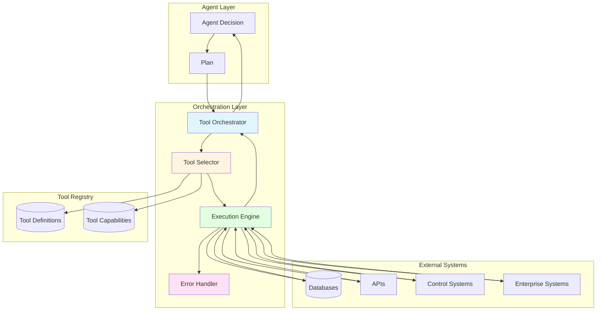

# Tool Orchestration: External System Coordination

## Overview

Tool Orchestration coordinates execution of external tools and systems, enabling agents to interact with databases, APIs, equipment control systems, and other operational infrastructure. This capability provides the execution layer that transforms agent decisions into real-world actions—enabling agents to not just think and plan, but actually execute changes in operational systems.

In industrial environments, intelligent decisions must translate into concrete actions: updating databases, controlling equipment, generating reports, sending notifications, and integrating with enterprise systems. Tool Orchestration provides the frameworks to select appropriate tools, sequence their invocation, manage parameters and results, and handle errors gracefully—capabilities that distinguish action-capable intelligent systems from purely analytical systems.

### Why Tool Orchestration Matters for MAGS

**The Challenge**: Agents must interact with diverse external systems (databases, APIs, control systems, enterprise applications) reliably, securely, and efficiently—not just generate recommendations.

**The Solution**: Tool orchestration frameworks provide standardized interfaces, error handling, retry logic, and execution monitoring for reliable external system interaction.

**The Result**: MAGS agents that execute actions reliably, integrate seamlessly with existing systems, handle errors gracefully, and provide complete execution auditability.

### Key Business Drivers

1. **Action Execution**: Transform decisions into real-world actions
2. **System Integration**: Seamless integration with existing infrastructure
3. **Reliability**: Robust error handling and retry mechanisms
4. **Auditability**: Complete execution tracking and logging
5. **Scalability**: Handle thousands of tool invocations per day

---

## Theoretical Foundations

### Service-Oriented Architecture (SOA)

**Core Insight**: Complex systems can be decomposed into loosely coupled services with well-defined interfaces. Services communicate through standardized protocols, enabling flexibility and reusability.

**Key Principles**:

**Loose Coupling**:
- Services independent
- Interface-based interaction
- Implementation hidden
- Flexible composition

**Service Contract**:
- Well-defined interface
- Input/output specifications
- Error conditions
- Service-level agreements

**MAGS Application**:
- Tools as services
- Standardized interfaces
- Flexible composition
- Reusable components

---

### Workflow Management

**Core Insight**: Complex processes can be modeled as workflows—sequences of tasks with dependencies, conditions, and error handling.

**Key Principles**:

**Workflow Patterns**:
- Sequential execution
- Parallel execution
- Conditional branching
- Loop iteration
- Error compensation

**Workflow Engine**:
- Task scheduling
- Dependency management
- State tracking
- Error handling

**MAGS Application**:
- Tool execution workflows
- Dependency management
- Error recovery
- Execution monitoring

---

## What It Does

### Core Capabilities

**Tool Selection**:
- Identifies appropriate tools for tasks
- Evaluates tool capabilities
- Considers constraints and requirements
- Selects optimal tool

**Execution Orchestration**:
- Sequences tool invocations
- Manages dependencies
- Handles parallel execution
- Coordinates workflows

**Parameter Management**:
- Prepares input parameters
- Validates parameter types
- Transforms data formats
- Handles parameter errors

**Result Processing**:
- Captures tool outputs
- Validates results
- Transforms output formats
- Propagates results

**Error Handling**:
- Detects execution errors
- Implements retry logic
- Performs error recovery
- Escalates when necessary

---

## How It Works

### Tool Orchestration Architecture



### Tool Execution Process

**Step 1: Tool Selection**

*Input*: Task requirements

*Selection Criteria*:
```
Task: Update maintenance work order

Candidate Tools:
  1. CMMS API
     - Capabilities: Create, update, delete work orders
     - Latency: 100-500ms
     - Reliability: 99.9%
     - Cost: $0.001 per call
     - Match: 100%
  
  2. Database Direct Access
     - Capabilities: Direct SQL updates
     - Latency: 10-50ms
     - Reliability: 99.99%
     - Cost: Negligible
     - Match: 80% (bypasses business logic)
  
  3. Manual Entry
     - Capabilities: Human data entry
     - Latency: Minutes to hours
     - Reliability: 95%
     - Cost: High (human time)
     - Match: 50%

Selection: CMMS API
Rationale:
  - Best match for requirements
  - Maintains business logic
  - Acceptable latency
  - High reliability
```

**Step 2: Parameter Preparation**

*Transform agent output to tool input*:
```
Agent Output:
{
  "action": "update_work_order",
  "work_order_id": "WO-2025-1234",
  "status": "scheduled",
  "scheduled_date": "2025-12-07",
  "assigned_technician": "tech-001",
  "estimated_duration": 180
}

Tool Input (CMMS API):
{
  "endpoint": "POST /api/v1/workorders/WO-2025-1234",
  "headers": {
    "Authorization": "Bearer <token>",
    "Content-Type": "application/json"
  },
  "body": {
    "status": "SCHEDULED",
    "scheduledDate": "2025-12-07T06:00:00Z",
    "assignedTo": "tech-001",
    "estimatedHours": 3.0
  }
}

Transformations:
  - status: "scheduled" → "SCHEDULED" (uppercase)
  - scheduled_date: "2025-12-07" → "2025-12-07T06:00:00Z" (ISO 8601)
  - assigned_technician: "tech-001" → assignedTo: "tech-001" (field rename)
  - estimated_duration: 180 → estimatedHours: 3.0 (minutes to hours)
```

**Step 3: Execution**

*Invoke tool with prepared parameters*:
```
Execution:
  Tool: CMMS API
  Method: POST
  Endpoint: /api/v1/workorders/WO-2025-1234
  Timeout: 5 seconds
  Retry: 3 attempts with exponential backoff

Attempt 1:
  Status: 200 OK
  Response Time: 245ms
  Result: Success

Response:
{
  "workOrderId": "WO-2025-1234",
  "status": "SCHEDULED",
  "scheduledDate": "2025-12-07T06:00:00Z",
  "assignedTo": "tech-001",
  "estimatedHours": 3.0,
  "updatedAt": "2025-12-06T10:30:00Z",
  "updatedBy": "agent-maintenance-planner"
}
```

**Step 4: Result Processing**

*Transform tool output to agent format*:
```
Tool Output:
{
  "workOrderId": "WO-2025-1234",
  "status": "SCHEDULED",
  ...
}

Agent Result:
{
  "success": true,
  "work_order_id": "WO-2025-1234",
  "status": "scheduled",
  "updated_at": "2025-12-06T10:30:00Z",
  "execution_time_ms": 245
}

Validation:
  ✓ Work order ID matches
  ✓ Status updated correctly
  ✓ Scheduled date set
  ✓ Technician assigned
  
Result: SUCCESS
```

**Step 5: Error Handling**

*Handle execution errors gracefully*:
```
Error Scenario: API timeout

Attempt 1:
  Status: Timeout (5 seconds)
  Action: Retry with exponential backoff

Attempt 2 (after 2 seconds):
  Status: Timeout (5 seconds)
  Action: Retry with exponential backoff

Attempt 3 (after 4 seconds):
  Status: 503 Service Unavailable
  Action: Retry with exponential backoff

Attempt 4 (after 8 seconds):
  Status: 200 OK
  Result: Success

Total Time: 19 seconds (5+2+5+4+5 = 21s with processing)
Retries: 3
Final Status: SUCCESS (after retries)
```

---

## Tool Categories

### Category 1: Data Access Tools

**Purpose**: Read and write data from databases and data stores

**Tools**:
```
SQL Database Tool:
  Capabilities:
    - Execute SELECT queries
    - Execute INSERT/UPDATE/DELETE
    - Transaction management
    - Connection pooling
  
  Example:
    Query: "SELECT * FROM equipment WHERE status = 'degraded'"
    Result: List of degraded equipment
    
Time Series Database Tool:
  Capabilities:
    - Query time-range data
    - Aggregate temporal data
    - Write time-stamped data
    - Downsample/upsample
  
  Example:
    Query: "Get vibration data for Pump-101, last 24 hours"
    Result: Time series of vibration measurements

Graph Database Tool:
  Capabilities:
    - Traverse relationships
    - Pattern matching
    - Path finding
    - Graph analytics
  
  Example:
    Query: "Find all equipment dependent on Pump-101"
    Result: Dependency graph
```

### Category 2: Analysis Tools

**Purpose**: Perform statistical analysis, ML inference, and computations

**Tools**:
```
Statistical Analysis Tool:
  Capabilities:
    - Descriptive statistics
    - Hypothesis testing
    - Regression analysis
    - Time series analysis
  
  Example:
    Input: Vibration time series
    Analysis: Trend detection
    Output: Trend slope, confidence

ML Model Tool:
  Capabilities:
    - Model inference
    - Batch prediction
    - Feature extraction
    - Confidence scoring
  
  Example:
    Input: Equipment sensor data
    Model: Failure prediction model
    Output: Failure probability, confidence

Optimization Tool:
  Capabilities:
    - Linear programming
    - Constraint satisfaction
    - Multi-objective optimization
    - Heuristic search
  
  Example:
    Input: Maintenance schedule constraints
    Optimization: Minimize cost, maximize availability
    Output: Optimal schedule
```

### Category 3: Control Tools

**Purpose**: Control equipment and processes

**Tools**:
```
Equipment Control Tool:
  Capabilities:
    - Start/stop equipment
    - Adjust parameters
    - Read status
    - Emergency stop
  
  Example:
    Command: "Adjust Pump-101 speed to 1500 RPM"
    Validation: Within safe operating range
    Execution: Send control command
    Verification: Confirm speed change

Process Control Tool:
  Capabilities:
    - Set process parameters
    - Read process variables
    - Implement control strategies
    - Safety interlocks
  
  Example:
    Command: "Increase reactor temperature to 125°C"
    Safety Check: Within limits, no alarms
    Execution: Gradual ramp (2°C/min)
    Monitoring: Continuous temperature tracking
```

### Category 4: Communication Tools

**Purpose**: Send notifications, generate reports, communicate with humans

**Tools**:
```
Notification Tool:
  Capabilities:
    - Email notifications
    - SMS alerts
    - Push notifications
    - Escalation
  
  Example:
    Event: Critical equipment failure
    Recipients: Maintenance supervisor, on-call technician
    Message: "Pump-101 critical failure detected. Immediate action required."
    Delivery: Email + SMS

Report Generation Tool:
  Capabilities:
    - Generate PDF reports
    - Create visualizations
    - Format data tables
    - Template-based generation
  
  Example:
    Data: Weekly maintenance summary
    Template: Standard maintenance report
    Output: PDF report with charts and tables
    Distribution: Email to stakeholders
```

---

## Design Patterns

### Pattern 1: Tool Registry

**Purpose**: Centralized tool definition and discovery

**Implementation**:
```
Tool Registry:
{
  "tools": [
    {
      "tool_id": "cmms_api",
      "name": "CMMS API",
      "category": "data_access",
      "capabilities": [
        "create_work_order",
        "update_work_order",
        "query_work_orders"
      ],
      "interface": {
        "protocol": "REST",
        "base_url": "https://cmms.example.com/api/v1",
        "authentication": "bearer_token"
      },
      "reliability": 0.999,
      "avg_latency_ms": 250,
      "cost_per_call": 0.001
    },
    ...
  ]
}

Tool Selection:
  Query: "Find tool for creating work orders"
  Match: cmms_api (100% capability match)
  Selection: cmms_api
```

---

### Pattern 2: Retry with Exponential Backoff

**Purpose**: Handle transient failures gracefully

**Implementation**:
```
Retry Logic:
  Max Attempts: 3
  Initial Delay: 1 second
  Backoff Factor: 2
  Max Delay: 10 seconds

Execution:
  Attempt 1: Execute immediately
    If fail: Wait 1 second
  
  Attempt 2: Execute after 1 second
    If fail: Wait 2 seconds
  
  Attempt 3: Execute after 2 seconds
    If fail: Report error

Total Max Time: 1 + 2 + execution times
```

---

### Pattern 3: Circuit Breaker

**Purpose**: Prevent cascading failures

**Implementation**:
```
Circuit Breaker States:
  CLOSED: Normal operation
  OPEN: Failures detected, reject requests
  HALF_OPEN: Test if service recovered

Thresholds:
  Failure Rate: >50% in 1 minute
  Open Duration: 30 seconds
  Success Threshold: 3 consecutive successes

Behavior:
  CLOSED → OPEN: After threshold failures
  OPEN → HALF_OPEN: After open duration
  HALF_OPEN → CLOSED: After success threshold
  HALF_OPEN → OPEN: On any failure
```

---

### Pattern 4: Saga Pattern for Distributed Transactions

**Purpose**: Coordinate multi-tool operations with rollback

**Implementation**:
```
Saga: Create Maintenance Work Order

Steps:
  1. Create work order in CMMS
     Compensation: Delete work order
  
  2. Reserve parts in inventory
     Compensation: Release parts
  
  3. Schedule technician
     Compensation: Cancel schedule
  
  4. Notify stakeholders
     Compensation: Send cancellation

Execution:
  Normal: 1 → 2 → 3 → 4 → Complete
  
  Failure at Step 3:
    Execute: 1 → 2 → 3 (FAIL)
    Compensate: 2 (release parts) → 1 (delete work order)
    Result: Rollback complete
```

---

## Integration with Other Capabilities

### With Plan Optimization

**Plans Drive Tool Execution**:
- Plans specify tool sequences
- Orchestration executes plans
- Results feed back to planning
- Replanning on failures

---

### With Performance Monitoring

**Monitoring Tracks Execution**:
- Tool execution metrics
- Success/failure rates
- Latency tracking
- Error analysis

---

### With Decision Orchestration

**Coordination Enables Execution**:
- Consensus on actions
- Coordinated tool invocation
- Governed execution
- Audited actions

---

## Use Cases

### Use Case 1: Automated Maintenance Work Order Creation

**Scenario**: Agent detects equipment degradation, creates work order

**Tool Sequence**:
```
1. Query Equipment Data (SQL Database Tool):
   Query: Get equipment details for Pump-101
   Result: Equipment specifications, history, criticality

2. Check Parts Availability (Inventory API Tool):
   Query: Check bearing SKF-6312 availability
   Result: In stock, Warehouse B, Qty: 2

3. Find Available Technician (Scheduling API Tool):
   Query: Find certified technician, next 48 hours
   Result: Technician John Smith available Saturday

4. Create Work Order (CMMS API Tool):
   Action: Create work order
   Details: Pump-101 bearing replacement, Saturday 06:00
   Result: Work order WO-2025-1234 created

5. Reserve Parts (Inventory API Tool):
   Action: Reserve bearing for work order
   Result: Parts reserved

6. Send Notification (Email Tool):
   Recipients: Maintenance supervisor, technician
   Message: Work order created, parts reserved
   Result: Notifications sent

Total Execution Time: 2.3 seconds
Tools Invoked: 6
Success Rate: 100%
```

---

### Use Case 2: Process Parameter Adjustment

**Scenario**: Agent optimizes process, adjusts parameters

**Tool Sequence**:
```
1. Read Current Parameters (Process Control Tool):
   Parameters: Temperature, pressure, flow rate
   Result: Current values retrieved

2. Calculate Optimal Parameters (Optimization Tool):
   Input: Current state, objectives, constraints
   Optimization: Multi-objective optimization
   Result: Optimal parameter set

3. Validate Safety (Safety System Tool):
   Check: Parameters within safe operating envelope
   Result: Validation passed

4. Adjust Parameters (Process Control Tool):
   Action: Gradual parameter adjustment
   Monitoring: Continuous safety monitoring
   Result: Parameters adjusted successfully

5. Verify Results (Data Analysis Tool):
   Analysis: Compare actual vs. target
   Result: Within tolerance

6. Log Changes (Audit Log Tool):
   Record: Parameter changes, rationale, results
   Result: Audit trail created

Total Execution Time: 45 seconds (gradual adjustment)
Tools Invoked: 6
Success Rate: 100%
```

---

### Use Case 3: Multi-System Data Collection

**Scenario**: Agent collects data from multiple systems for analysis

**Tool Sequence (Parallel)**:
```
Parallel Execution:

Thread 1: Equipment Data
  1. Query SCADA (SCADA API Tool)
  2. Query Historian (Time Series Tool)
  Duration: 1.2 seconds

Thread 2: Maintenance Data
  1. Query CMMS (CMMS API Tool)
  2. Query Work Orders (Database Tool)
  Duration: 0.8 seconds

Thread 3: Quality Data
  1. Query QMS (QMS API Tool)
  2. Query Lab Results (Database Tool)
  Duration: 1.5 seconds

Thread 4: Production Data
  1. Query MES (MES API Tool)
  2. Query Production Logs (Database Tool)
  Duration: 1.0 seconds

Synchronization:
  Wait for all threads to complete
  Total Time: 1.5 seconds (longest thread)
  
Sequential Time: 4.5 seconds
Parallel Time: 1.5 seconds
Speedup: 3x

Data Integration:
  Merge results from all sources
  Correlate by timestamp and equipment
  Result: Comprehensive dataset for analysis
```

---

## Measuring Success

### Execution Performance Metrics

```
Tool Execution Success Rate:
  Target: >99% success rate
  Measurement: (Successful executions / Total executions) × 100%

Execution Latency:
  Target: <1 second for data access
  Target: <5 seconds for control actions
  Measurement: Time from invocation to completion

Retry Rate:
  Target: <5% of executions require retry
  Measurement: (Retries / Total executions) × 100%

Error Recovery Rate:
  Target: >95% of errors recovered automatically
  Measurement: (Recovered errors / Total errors) × 100%
```

### Business Impact Metrics

```
Automation Rate:
  Baseline: 20% automated (manual execution)
  Target: >80% automated
  Improvement: 60 percentage points

Execution Speed:
  Baseline: Minutes to hours (manual)
  Target: Seconds (automated)
  Improvement: 100-1000x faster

Error Rate:
  Baseline: 5% error rate (manual)
  Target: <1% error rate (automated)
  Improvement: 80% reduction
```

---

## Related Documentation

### Core Concepts
- [ORPA Cycle](../concepts/orpa-cycle.md) - Act phase
- [Planning Approaches](../concepts/planning-approaches.md) - Plan execution

### Performance Optimization
- [Plan Optimization](../performance-optimization/plan-optimization.md) - Plan generation
- [Performance Monitoring](../performance-optimization/performance-monitoring.md) - Execution monitoring

### Decision Orchestration
- [Communication Framework](../decision-orchestration/communication-framework.md) - Tool communication
- [Agent Lifecycle & Governance](../decision-orchestration/agent-lifecycle-governance.md) - Execution governance

### Integration & Execution
- [DataStream Integration](datastream-integration.md) - Data access
- [Telemetry & Observability](telemetry-observability.md) - Execution monitoring
- [Integration & Execution Overview](README.md) - Category overview

### Architecture
- [System Components](../architecture/system-components.md) - Tool infrastructure

### Use Cases
- All use cases demonstrate tool orchestration

---

## References

### Foundational Works

**Service-Oriented Architecture**:
- Erl, T. (2005). "Service-Oriented Architecture: Concepts, Technology, and Design". Prentice Hall
- Papazoglou, M. P., & van den Heuvel, W. J. (2007). "Service oriented architectures: approaches, technologies and research issues". The VLDB Journal, 16(3), 389-415

**Workflow Management**:
- van der Aalst, W. M., & van Hee, K. M. (2004). "Workflow Management: Models, Methods, and Systems". MIT Press
- Russell, N., et al. (2006). "Workflow Control-Flow Patterns: A Revised View". BPM Center Report

**Error Handling**:
- Nygard, M. T. (2018). "Release It!: Design and Deploy Production-Ready Software" (2nd ed.). Pragmatic Bookshelf
- Richardson, C. (2018). "Microservices Patterns". Manning Publications

### Modern Applications

**API Integration**:
- Fielding, R. T. (2000). "Architectural Styles and the Design of Network-based Software Architectures". PhD Thesis, UC Irvine
- Masse, M. (2011). "REST API Design Rulebook". O'Reilly Media

**Distributed Transactions**:
- Garcia-Molina, H., & Salem, K. (1987). "Sagas". In Proceedings of ACM SIGMOD
- Helland, P. (2007). "Life beyond Distributed Transactions: an Apostate's Opinion". In Proceedings of CIDR

**Resilience Patterns**:
- Fowler, M. (2014). "Circuit Breaker". martinfowler.com
- Netflix (2012). "Hystrix: Latency and Fault Tolerance for Distributed Systems". Netflix Tech Blog

---

**Document Version**: 2.0  
**Last Updated**: December 6, 2025  
**Status**: ✅ Enhanced to Comprehensive Quality Standard