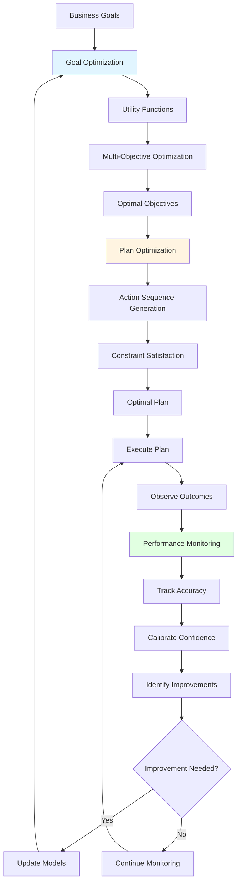

# Performance Optimization: Goal Achievement and Continuous Improvement

## Overview

Performance Optimization is the third category of the [15 business process intelligence capabilities](../architecture/business-process-intelligence.md), comprising 3 capabilities that enable agents to optimize outcomes, improve plans, and monitor performance. While [Cognitive Intelligence](../cognitive-intelligence/README.md) enables intelligent reasoning and [Decision Orchestration](../decision-orchestration/README.md) enables coordination, Performance Optimization ensures agents achieve goals efficiently, adapt plans dynamically, and continuously improve over time.

Grounded in 287+ years of research from Bernoulli's utility theory (1738) through modern metacognition (Flavell 1979), Performance Optimization provides the mathematical and algorithmic foundations for multi-objective optimization, efficient planning, and systematic performance improvement—capabilities that distinguish continuously improving intelligent systems from static rule-based systems or uncalibrated LLM outputs.

---

## The Three Optimization Capabilities

### 1. [Goal Optimization & Utility Functions](goal-optimization.md)
**Multi-Objective Optimization with Explainable Trade-Offs**

Enables agents to balance multiple competing objectives through utility theory and multi-objective optimization.

**Key Features**:
- Utility function design (linear, logarithmic, exponential, piecewise)
- Multi-objective balancing (weighted sum, Pareto, Nash product)
- Trade-off optimization and visualization
- Explainable decision rationale

**Research Foundation**:
- Utility Theory (Bernoulli 1738) - Quantifying preferences
- Pareto Optimality (1896) - Multi-objective trade-offs
- Nash Bargaining (1950) - Fair compromise solutions
- Prospect Theory (Kahneman & Tversky 1979) - Behavioral preferences

**Business Impact**:
- 10-30% improvement in objective values through optimization
- Explainable trade-offs build stakeholder trust
- Consistent, reproducible decision-making
- Measurable optimization gains

**Example Application**:
```
Process Optimization (4 objectives):
  Maximize Throughput: 900 units/hour (weight: 0.35)
  Maximize Quality: 98.2% (weight: 0.30)
  Minimize Energy: 1100 kWh/hour (weight: 0.20)
  Maximize Yield: 94% (weight: 0.15)

Pareto Optimization:
  Generated 50 candidate solutions
  Identified 8 Pareto-optimal solutions
  Selected Solution B (weighted utility: 0.892)

Result:
  - All objectives improved over baseline
  - Balanced trade-offs
  - Stakeholder-aligned solution
  - Pareto-optimal (no better solution exists)
```

---

### 2. [Plan Optimization](plan-optimization.md)
**Efficient Action Sequences with Constraint Satisfaction**

Creates efficient action sequences to achieve goals through formal planning methods (STRIPS, PDDL, HTN).

**Key Features**:
- Automated plan generation
- Constraint satisfaction
- Parallel execution identification
- Dynamic replanning

**Research Foundation**:
- STRIPS (Fikes & Nilsson 1971) - Planning foundation
- PDDL (McDermott et al. 1998) - Standardized planning language
- HTN Planning (Erol, Hendler, Nau 1994) - Hierarchical decomposition
- Partial-Order Planning (Sacerdoti 1975) - Parallel execution

**Business Impact**:
- 20-40% reduction in execution time through optimization
- Efficient resource allocation and utilization
- Guaranteed constraint satisfaction
- Parallel execution for faster completion

**Example Application**:
```
Maintenance Procedure Planning:

Goal: Replace degraded bearing on Pump-101

HTN Decomposition:
  1. PrepareMaintenance (30 min)
     - NotifyProduction, GatherTools, ObtainParts, Lockout
  
  2. ExecuteMaintenance (105 min)
     - Stop, Drain, Remove, Inspect, Install, Refill
  
  3. VerifyMaintenance (60 min)
     - Start, Monitor, Verify, RemoveLockout, Document

Generated Plan: 15 actions, 195 minutes total

Optimization:
  - Identified parallel actions (GatherTools + ObtainParts)
  - Optimized sequence for efficiency
  - Reduced to 180 minutes (8% improvement)

Result:
  - Provably correct plan
  - Constraint satisfaction guaranteed
  - Efficient execution
  - Within 4-hour maintenance window
```

---

### 3. [Performance Monitoring & Confidence](performance-monitoring.md)
**Quality Tracking and Continuous Improvement**

Tracks agent and system performance over time, enabling continuous improvement through confidence calibration and quality assessment.

**Key Features**:
- Decision accuracy tracking
- Confidence calibration
- Performance trend analysis
- Continuous improvement triggers

**Research Foundation**:
- Bayesian Statistics (Bayes 1763) - Probabilistic reasoning
- Metacognition (Flavell 1979) - Self-assessment
- Statistical Process Control (Shewhart 1920s) - Quality monitoring
- Calibration Theory - Confidence reliability

**Business Impact**:
- 10-20% annual performance improvement
- Calibrated confidence enables appropriate trust
- Early detection of performance degradation
- Systematic quality assurance

**Example Application**:
```
Failure Prediction Performance Monitoring:

Metrics Tracked:
  - Decision accuracy: 87% (target: >85%) ✓
  - Confidence calibration: ECE 7% (target: <10%) ✓
  - False alarm rate: 8% (target: <10%) ✓
  - Missed failure rate: 5% (target: <5%) ✓

Trend Analysis (12 weeks):
  Week 1-4: 85% accuracy (baseline)
  Week 5-8: 87% accuracy (improving)
  Week 9-12: 87% accuracy (stable)

Confidence Calibration:
  90-100% confidence predictions:
    Predicted: 95% average
    Actual: 82% accuracy
    Calibration error: 13% (overconfident)
  
  Adjustment: Reduce high-confidence predictions by 15%
  
  Post-adjustment:
    Predicted: 82% average
    Actual: 83% accuracy
    Calibration error: 1% ✓

Result:
  - Improved calibration
  - Appropriate escalation
  - Reliable confidence scores
  - Continuous improvement
```

---

## Theoretical Foundations

### Utility Theory & Multi-Objective Optimization (1738-1979)

**Daniel Bernoulli (1738)** - Utility Theory
**Vilfredo Pareto (1896)** - Pareto Optimality
**John Nash (1950)** - Nash Bargaining (1994 Nobel Prize)
**Kahneman & Tversky (1979)** - Prospect Theory (2002 Nobel Prize)

**Core Insights**:
- People value utility (satisfaction), not absolute outcomes
- Diminishing returns explain risk aversion
- Multiple objectives require trade-off optimization
- Pareto frontier reveals all optimal solutions
- Nash product provides fair compromise
- Loss aversion affects preferences

**MAGS Application**:
- Quantify business objectives mathematically
- Balance competing goals optimally
- Generate explainable trade-offs
- Enable stakeholder-aligned decisions

---

### Automated Planning (1971-1998)

**Fikes & Nilsson (1971)** - STRIPS
**McDermott et al. (1998)** - PDDL
**Erol, Hendler, Nau (1994)** - HTN Planning
**Sacerdoti (1975)** - Partial-Order Planning

**Core Insights**:
- Planning as state-space search
- Actions with preconditions and effects
- Hierarchical task decomposition
- Partial ordering enables parallelism
- Standardized planning languages

**MAGS Application**:
- Automated plan generation
- Efficient action sequences
- Constraint satisfaction
- Parallel execution optimization

---

### Bayesian Statistics & Metacognition (1763-1979)

**Thomas Bayes (1763)** - Bayesian Inference
**John Flavell (1979)** - Metacognition
**Walter Shewhart (1920s)** - Statistical Process Control

**Core Insights**:
- Beliefs updated based on evidence
- Uncertainty quantified mathematically
- Self-awareness enables improvement
- Statistical monitoring detects issues
- Calibration ensures reliability

**MAGS Application**:
- Confidence score calibration
- Performance monitoring
- Continuous improvement
- Quality assurance

---

## Why Optimization Matters

### Without Performance Optimization

**Suboptimal Decisions**:
- Ad-hoc trade-offs without optimization
- Unclear priorities and preferences
- Inconsistent decision-making
- No measurable improvement

**Inefficient Execution**:
- Manual planning, no optimization
- Sequential execution, no parallelism
- Resource waste
- Slow execution

**No Improvement**:
- No performance tracking
- Uncalibrated confidence
- No learning from outcomes
- Static performance

**Result**: Inefficient, suboptimal, non-improving systems unsuitable for competitive industrial operations.

---

### With Performance Optimization

**Optimal Decisions**:
- Mathematical optimization of trade-offs
- Quantified preferences and priorities
- Consistent, reproducible decisions
- Measurable optimization gains (10-30%)

**Efficient Execution**:
- Automated plan generation
- Parallel execution optimization
- Resource efficiency
- 20-40% time reduction

**Continuous Improvement**:
- Systematic performance tracking
- Calibrated confidence scores
- Learning from every outcome
- 10-20% annual improvement

**Result**: Optimal, efficient, continuously improving systems suitable for competitive industrial operations.

---

## How the Capabilities Work Together

### Integrated Optimization Flow



### Integration Example: Predictive Maintenance Optimization

**Step 1: Goal Optimization**
```
Objectives:
  - Minimize cost (weight: 0.3)
  - Minimize risk (weight: 0.4)
  - Minimize production impact (weight: 0.3)

Utility Functions:
  U_cost = -log(cost) (diminishing returns)
  U_risk = -exp(-2 × (1 - failure_prob)) (risk aversion)
  U_production = -(downtime_hours) (linear)

Optimization:
  Weighted sum: 0.3×U_cost + 0.4×U_risk + 0.3×U_production

Options:
  A: Emergency ($45K, 5% risk, 8hr) → Utility: 0.626
  B: Planned ($28K, 15% risk, 6hr) → Utility: 0.781 ⭐
  C: Deferred ($25K, 90% risk, 6hr) → Utility: 0.511

Selected: Option B (optimal trade-off)
```

**Step 2: Plan Optimization**
```
Goal: Execute planned maintenance

HTN Planning:
  1. PrepareMaintenance (30 min)
  2. ExecuteMaintenance (105 min)
  3. VerifyMaintenance (60 min)

Generated Plan: 15 actions, 195 minutes

Optimization:
  - Parallel actions identified
  - Sequence optimized
  - Reduced to 180 minutes

Result: Efficient, constraint-satisfying plan
```

**Step 3: Performance Monitoring**
```
Execution:
  - Plan executed successfully
  - Actual duration: 175 minutes
  - All constraints satisfied

Outcome Tracking:
  - Predicted failure probability: 15%
  - Actual: No failure occurred ✓
  - Prediction correct

Performance Update:
  - Prediction accuracy: 87% → 88%
  - Confidence calibration: ECE 7% → 6%
  - Plan efficiency: 92% → 93%

Continuous Improvement:
  - Models updated with new data
  - Confidence calibrated
  - Performance improved
```

**Result**: Optimal decision, efficient execution, continuous improvement.

---

## Integration with Other Capability Categories

### Enables Cognitive Intelligence

**Optimization Improves Intelligence**:
- Goal optimization guides memory significance
- Plan optimization structures reasoning
- Performance monitoring enables learning
- Continuous improvement enhances intelligence

### Requires Decision Orchestration

**Coordination Enables Optimization**:
- Consensus on optimization objectives
- Communication of plans
- Governance of execution
- Coordinated multi-agent optimization

### Enables Integration & Execution

**Optimization Guides Execution**:
- Optimal plans for execution
- Efficient resource allocation
- Performance-monitored execution
- Continuous execution improvement

---

## Business Value

### Operational Excellence

**Improved Decision Quality**:
- 10-30% improvement in objective values
- Optimal trade-offs
- Consistent decisions
- Measurable gains

**Execution Efficiency**:
- 20-40% time reduction through planning
- Efficient resource utilization
- Parallel execution
- Constraint satisfaction

**Continuous Improvement**:
- 10-20% annual performance improvement
- Systematic quality enhancement
- Learning from every outcome
- Measurable progress

---

### Cost Optimization

**Direct Cost Savings**:
- Optimal resource allocation
- Efficient execution
- Reduced waste
- 15-25% cost reduction typical

**Indirect Benefits**:
- Improved quality
- Reduced downtime
- Better utilization
- Competitive advantage

---

### Risk Management

**Calibrated Confidence**:
- Appropriate trust in decisions
- Correct escalation
- Risk-aware optimization
- Reduced overconfidence errors

**Performance Assurance**:
- Early degradation detection
- Systematic quality control
- Continuous monitoring
- Proactive improvement

---

## Implementation Considerations

### Starting with Performance Optimization

**Phase 1: Goal Optimization** (Weeks 1-2)
- Identify business objectives
- Design utility functions
- Implement optimization algorithms
- Validate with stakeholders

**Phase 2: Plan Optimization** (Weeks 3-4)
- Define planning domains
- Implement planning algorithms
- Generate and validate plans
- Optimize for efficiency

**Phase 3: Performance Monitoring** (Weeks 5-6)
- Set up monitoring infrastructure
- Implement calibration
- Establish baselines
- Configure alerts

**Phase 4: Integration** (Weeks 7-8)
- Integrate capabilities
- End-to-end testing
- Performance validation
- Production deployment

---

### Success Metrics

**Optimization Performance**:
- Optimization quality: >90% of theoretical optimum
- Planning efficiency: 20-40% time reduction
- Monitoring coverage: 100% of decisions

**Business Impact**:
- Decision quality: 10-30% improvement
- Execution efficiency: 20-40% time reduction
- Continuous improvement: 10-20% annual gain

**System Quality**:
- Confidence calibration: ECE <10%
- Plan success rate: >95%
- Performance stability: <5% variation

---

## Related Documentation

### Core Capabilities
- [Goal Optimization & Utility Functions](goal-optimization.md) - Multi-objective optimization
- [Plan Optimization](plan-optimization.md) - Efficient action sequences
- [Performance Monitoring & Confidence](performance-monitoring.md) - Quality tracking

### Research Foundations
- [Decision Theory](../research-foundations/decision-theory.md) - Utility theory and optimization
- [Automated Planning](../research-foundations/automated-planning.md) - Planning research
- [Statistical Methods](../research-foundations/statistical-methods.md) - Bayesian statistics
- [Cognitive Science](../research-foundations/cognitive-science.md) - Metacognition

### Architecture
- [Business Process Intelligence](../architecture/business-process-intelligence.md) - 15 capabilities overview
- [System Components](../architecture/system-components.md) - Optimization infrastructure

### Other Capability Categories
- [Cognitive Intelligence](../cognitive-intelligence/README.md) - Individual intelligence
- [Decision Orchestration](../decision-orchestration/README.md) - Multi-agent coordination
- [Integration & Execution](../integration-execution/README.md) - Action execution

### Use Cases
- [Process Optimization](../use-cases/process-optimization.md) - Multi-objective process optimization
- [Predictive Maintenance](../use-cases/predictive-maintenance.md) - Maintenance optimization
- [Quality Management](../use-cases/quality-management.md) - Quality optimization

---

## References

### Foundational Works

**Utility Theory**:
- Bernoulli, D. (1738). "Specimen theoriae novae de mensura sortis". Commentarii Academiae Scientiarum Imperialis Petropolitanae
- Von Neumann, J., & Morgenstern, O. (1944). "Theory of Games and Economic Behavior". Princeton University Press

**Multi-Objective Optimization**:
- Pareto, V. (1896). "Cours d'économie politique". Lausanne: F. Rouge
- Nash, J. (1950). "The Bargaining Problem". Econometrica, 18(2), 155-162
- Kahneman, D., & Tversky, A. (1979). "Prospect Theory: An Analysis of Decision under Risk". Econometrica, 47(2), 263-291

**Automated Planning**:
- Fikes, R. E., & Nilsson, N. J. (1971). "STRIPS: A New Approach to the Application of Theorem Proving to Problem Solving". Artificial Intelligence, 2(3-4), 189-208
- McDermott, D., et al. (1998). "PDDL—The Planning Domain Definition Language". Technical Report, Yale Center for Computational Vision and Control
- Erol, K., Hendler, J., & Nau, D. S. (1994). "HTN Planning: Complexity and Expressivity". In Proceedings of AAAI

**Performance Monitoring**:
- Bayes, T. (1763). "An Essay towards solving a Problem in the Doctrine of Chances". Philosophical Transactions of the Royal Society, 53, 370-418
- Flavell, J. H. (1979). "Metacognition and Cognitive Monitoring". American Psychologist, 34(10), 906-911
- Shewhart, W. A. (1931). "Economic Control of Quality of Manufactured Product". Van Nostrand

### Modern Applications

**Optimization**:
- Deb, K. (2001). "Multi-Objective Optimization using Evolutionary Algorithms". John Wiley & Sons
- Boyd, S., & Vandenberghe, L. (2004). "Convex Optimization". Cambridge University Press

**Planning**:
- Ghallab, M., Nau, D., & Traverso, P. (2004). "Automated Planning: Theory and Practice". Morgan Kaufmann
- Russell, S., & Norvig, P. (2020). "Artificial Intelligence: A Modern Approach" (4th ed.). Pearson

**Monitoring**:
- Guo, C., et al. (2017). "On Calibration of Modern Neural Networks". In Proceedings of ICML
- Montgomery, D. C. (2012). "Statistical Quality Control" (7th ed.). John Wiley & Sons

---

**Document Version**: 2.0  
**Last Updated**: December 6, 2025  
**Status**: ✅ Enhanced to Comprehensive Quality Standard - Performance Optimization Category Complete!