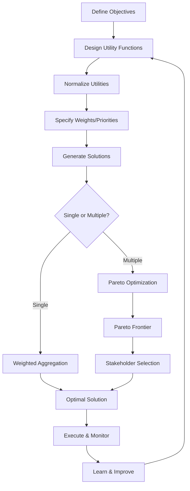

# Goal Optimization & Utility Functions

## Overview

Goal Optimization enables agents to balance multiple competing objectives through utility theory and multi-objective optimization. Grounded in 287+ years of research from Bernoulli's utility theory (1738) through modern behavioral economics (Kahneman & Tversky 1979), this capability transforms qualitative business goals into quantitative optimization problems with explainable trade-offs—enabling agents to make optimal decisions that balance cost, quality, efficiency, safety, and other competing objectives.

In industrial environments, decisions rarely involve a single objective. A maintenance decision must balance cost minimization, risk reduction, production impact, and resource availability. A process optimization must balance throughput maximization, quality maintenance, energy efficiency, and safety compliance. Goal Optimization provides the mathematical frameworks to quantify these objectives, optimize their trade-offs, and explain the resulting decisions—capabilities that distinguish true optimization from simple heuristics or LLM-generated suggestions.

### Why Goal Optimization Matters for MAGS

**The Challenge**: Industrial decisions involve multiple competing objectives that cannot all be maximized simultaneously. Simple rules or LLM prompting cannot provide optimal, explainable trade-offs.

**The Solution**: Utility theory quantifies preferences, multi-objective optimization finds optimal trade-offs, and Pareto analysis reveals the frontier of best solutions.

**The Result**: MAGS agents that make provably optimal decisions, balance competing objectives mathematically, and provide transparent trade-off explanations—grounded in 287+ years of validated optimization research.

### Key Business Drivers

1. **Optimal Decisions**: Mathematical optimization ensures best possible outcomes
2. **Explainable Trade-offs**: Transparent reasoning for multi-objective decisions
3. **Stakeholder Alignment**: Quantified preferences enable agreement on priorities
4. **Consistent Optimization**: Reproducible, rational decision-making
5. **Measurable Improvement**: Quantified optimization gains (10-30% typical)

---

## Theoretical Foundations

### Utility Theory: Quantifying Preferences (1738)

**Daniel Bernoulli** - "Specimen theoriae novae de mensura sortis"

**Core Insight**: People don't value outcomes linearly—they value the *utility* (satisfaction) outcomes provide, which exhibits diminishing returns. The first $1,000 is more valuable than the second $1,000.

**Key Principles**:

**Utility Function**:
- Maps outcomes to numerical values
- Higher utility = more preferred
- Enables quantitative comparison
- Foundation for optimization

**Diminishing Marginal Utility**:
- Each additional unit provides less utility
- Logarithmic utility function
- Explains risk aversion
- Models real preferences

**MAGS Application**:
- Quantify business objectives (cost, quality, throughput)
- Model diminishing returns (e.g., cost savings)
- Enable mathematical optimization
- Provide explainable preferences

**Example**:
```
Cost Utility Function (Logarithmic - Diminishing Returns):
  Cost $10K → Utility: -log(10,000) = -4.0
  Cost $20K → Utility: -log(20,000) = -4.3 (only -0.3 worse, not -2x)
  Cost $40K → Utility: -log(40,000) = -4.6 (diminishing impact)
  
  Bernoulli principle:
    - First $10K savings more valuable than second $10K
    - Diminishing returns on cost reduction
    - Realistic preference modeling
    - Enables optimal trade-offs
```

---

### Pareto Optimality: Multi-Objective Trade-Offs (1896)

**Vilfredo Pareto** - "Cours d'économie politique"

**Core Insight**: When optimizing multiple objectives, there's often no single "best" solution. Instead, there's a set of solutions (Pareto frontier) where improving one objective requires sacrificing another.

**Key Principles**:

**Pareto Dominance**:
- Solution A dominates B if A is better in all objectives
- Non-dominated solutions form Pareto frontier
- All Pareto-optimal solutions are "best" in some sense
- Choice depends on priorities

**Pareto Frontier**:
- Set of non-dominated solutions
- Reveals all optimal trade-offs
- Enables informed selection
- No solution on frontier dominates another

**MAGS Application**:
- Multi-objective process optimization
- Trade-off visualization
- Stakeholder-driven selection
- Transparent optimization

**Example**:
```
Process Optimization (3 objectives):
  Objective 1: Maximize throughput
  Objective 2: Minimize energy
  Objective 3: Maximize quality
  
  Pareto Frontier Solutions:
    Solution A: Throughput 100, Energy 80, Quality 95
    Solution B: Throughput 95, Energy 60, Quality 98
    Solution C: Throughput 90, Energy 50, Quality 99
    Solution D: Throughput 85, Energy 45, Quality 100
  
  No solution dominates:
    - A has highest throughput but highest energy
    - D has best quality but lowest throughput
    - B and C are balanced compromises
  
  Pareto principle:
    - All solutions optimal for some priorities
    - Explicit trade-off visualization
    - Stakeholder chooses based on priorities
    - No "hidden" better solution exists
```

---

### Nash Bargaining Solution (1950)

**John Nash** - "The Bargaining Problem" (1994 Nobel Prize)

**Core Insight**: When multiple parties negotiate, there exists a unique solution that maximizes the product of utilities—providing a fair, efficient compromise.

**Key Principles**:

**Nash Product**:
- Maximize product of utilities: U₁ × U₂ × ... × Uₙ
- Ensures fair distribution of gains
- Pareto-optimal solution
- Unique, stable compromise

**Fairness Properties**:
- Symmetric treatment of parties
- Pareto efficiency
- Independence of irrelevant alternatives
- Scale invariance

**MAGS Application**:
- Multi-agent objective aggregation
- Fair compromise solutions
- Balanced optimization
- Stakeholder alignment

**Example**:
```
Multi-Agent Objective Aggregation:
  Agent A utility: U_A (throughput focus)
  Agent B utility: U_B (quality focus)
  Agent C utility: U_C (cost focus)
  
  Nash Product: Maximize U_A × U_B × U_C
  
  Result:
    - Balanced solution
    - No agent gets everything
    - Fair distribution of gains
    - Pareto-optimal outcome
  
  Nash principle:
    - Mathematically fair compromise
    - Efficient solution
    - Stable agreement
    - Explainable fairness
```

---

### Prospect Theory: Behavioral Preferences (1979)

**Daniel Kahneman & Amos Tversky** - "Prospect Theory: An Analysis of Decision under Risk" (Kahneman: 2002 Nobel Prize)

**Core Insight**: People evaluate outcomes relative to reference points, with loss aversion—losses hurt more than equivalent gains feel good.

**Key Principles**:

**Reference Dependence**:
- Evaluate relative to current state
- Not absolute values
- Status quo bias
- Context matters

**Loss Aversion**:
- Losses weighted ~2x more than gains
- Asymmetric value function
- Risk-seeking for losses
- Risk-averse for gains

**MAGS Application**:
- Quality deviation assessment
- Change impact evaluation
- Risk-adjusted optimization
- Stakeholder preference modeling

**Example**:
```
Quality Deviation Assessment (Prospect Theory):
  Reference Point: Current quality 98%
  
  Scenario 1: Quality improves to 99%
    Gain: +1%
    Utility: +1.0 (positive, but moderate)
  
  Scenario 2: Quality drops to 97%
    Loss: -1%
    Utility: -2.0 (negative, weighted 2x)
  
  Loss aversion principle:
    - 1% quality loss feels worse than 1% gain feels good
    - Triggers higher priority response
    - Realistic preference modeling
    - Context-aware optimization
```

---

## What It Does

### Core Capabilities

**Objective Quantification**:
- Transforms qualitative goals into quantitative functions
- Defines utility for each business objective
- Enables mathematical optimization
- Provides measurable targets

**Multi-Objective Balancing**:
- Optimizes multiple competing objectives simultaneously
- Finds Pareto-optimal solutions
- Reveals trade-off frontiers
- Enables informed selection

**Trade-Off Optimization**:
- Balances conflicting objectives mathematically
- Generates optimal compromise solutions
- Provides explainable trade-offs
- Supports stakeholder alignment

**Explainable Decisions**:
- Transparent optimization process
- Quantified trade-offs
- Clear rationale for choices
- Auditable decision-making

---

## How It Works

### Utility Function Design

**Step 1: Identify Objectives**

*Business Objectives*:
- Cost minimization
- Quality maximization
- Throughput maximization
- Energy efficiency
- Safety compliance
- Resource utilization

*Example*:
```
Maintenance Decision Objectives:
  1. Minimize maintenance cost
  2. Minimize production impact
  3. Minimize failure risk
  4. Maximize resource efficiency
```

**Step 2: Define Utility Functions**

*Utility Function Types*:

**Linear Utility** (Proportional Value):
```
U(x) = a × x + b

When to use:
  - Constant marginal value
  - No diminishing returns
  - Simple proportional relationship

Example: Throughput
  U(throughput) = throughput
  (More is always proportionally better)
```

**Logarithmic Utility** (Diminishing Returns):
```
U(x) = a × log(x) + b

When to use:
  - Diminishing marginal value
  - Resource allocation
  - Cost optimization

Example: Cost
  U(cost) = -log(cost)
  (First $1K savings more valuable than second $1K)
```

**Exponential Utility** (Risk Aversion):
```
U(x) = -exp(-a × x)

When to use:
  - Risk-sensitive decisions
  - Safety-critical objectives
  - Extreme risk aversion

Example: Safety
  U(safety_score) = -exp(-2 × safety_score)
  (Extreme aversion to low safety scores)
```

**Piecewise Utility** (Loss Aversion):
```
U(x) = {
  (x - ref)^α           if x ≥ ref (gains)
  -λ × (ref - x)^β      if x < ref (losses)
}

When to use:
  - Reference-dependent evaluation
  - Loss aversion (λ ≈ 2)
  - Quality deviations

Example: Quality
  Reference: 98% quality
  Gains: (quality - 98)^0.88
  Losses: -2 × (98 - quality)^0.88
  (Losses weighted 2x more than gains)
```

**Step 3: Normalize Utilities**

*Normalization*:
- Scale all utilities to [0, 1] range
- Enables fair comparison
- Facilitates aggregation
- Improves interpretability

*Example*:
```
Raw Utilities:
  Cost: -log(cost) ∈ [-∞, 0]
  Quality: quality ∈ [0, 100]
  Throughput: throughput ∈ [0, 1000]

Normalized Utilities:
  U_cost = (log(cost_max) - log(cost)) / (log(cost_max) - log(cost_min))
  U_quality = quality / 100
  U_throughput = throughput / 1000

All utilities now in [0, 1] range
```

**Step 4: Aggregate Utilities**

*Aggregation Methods*:

**Weighted Sum** (Simple, Interpretable):
```
U_total = w₁×U₁ + w₂×U₂ + ... + wₙ×Uₙ
where Σwᵢ = 1

Advantages:
  - Simple, interpretable
  - Fast computation
  - Clear priority structure

Limitations:
  - Requires weight specification
  - May miss non-convex Pareto frontier
  - Assumes objectives commensurable

Example:
  U_total = 0.4×U_cost + 0.3×U_quality + 0.3×U_throughput
```

**Weighted Product** (Multiplicative):
```
U_total = U₁^w₁ × U₂^w₂ × ... × Uₙ^wₙ

Advantages:
  - Balanced optimization
  - No zero utilities
  - Nash bargaining solution

Limitations:
  - Requires all utilities > 0
  - Less intuitive
  - Sensitive to low values

Example:
  U_total = U_cost^0.4 × U_quality^0.3 × U_throughput^0.3
```

**Lexicographic** (Priority Ordering):
```
Optimize objectives in priority order:
  1. Optimize primary objective
  2. Among optimal, optimize secondary
  3. Continue for all objectives

Advantages:
  - Clear priority hierarchy
  - No weight specification
  - Handles incommensurable objectives

Limitations:
  - Strict priority may be too rigid
  - May miss balanced solutions

Example:
  1. Maximize safety (primary)
  2. Among safe solutions, minimize cost (secondary)
  3. Among cost-optimal, maximize throughput (tertiary)
```

**Tchebycheff** (Min-Max):
```
U_total = min(w₁×U₁, w₂×U₂, ..., wₙ×Uₙ)

Advantages:
  - Balanced optimization
  - Avoids extreme trade-offs
  - Finds entire Pareto frontier

Limitations:
  - More complex
  - Requires weight specification
  - Computationally intensive

Example:
  U_total = min(0.4×U_cost, 0.3×U_quality, 0.3×U_throughput)
  (Ensures no objective neglected)
```

---

## MAGS Implementation

### Optimization Process



### Example: Maintenance Decision Optimization

**Objectives**:
```
1. Minimize Cost
   Utility: U_cost = -log(cost)
   Normalized: (log(50000) - log(cost)) / (log(50000) - log(10000))
   Weight: 0.3

2. Minimize Risk
   Utility: U_risk = -exp(-2 × (1 - failure_probability))
   Normalized: Already in [0, 1]
   Weight: 0.4

3. Minimize Production Impact
   Utility: U_production = -downtime_hours
   Normalized: (24 - downtime_hours) / 24
   Weight: 0.3
```

**Options**:
```
Option A: Immediate Emergency Maintenance
  Cost: $45,000
  Failure Probability: 0.05 (very low risk)
  Downtime: 8 hours
  
  Utilities:
    U_cost = 0.15
    U_risk = 0.95
    U_production = 0.67
  
  Weighted Sum: 0.3×0.15 + 0.4×0.95 + 0.3×0.67 = 0.626

Option B: Planned Maintenance (48 hours)
  Cost: $28,000
  Failure Probability: 0.15 (medium risk)
  Downtime: 6 hours
  
  Utilities:
    U_cost = 0.72
    U_risk = 0.85
    U_production = 0.75
  
  Weighted Sum: 0.3×0.72 + 0.4×0.85 + 0.3×0.75 = 0.781 ⭐

Option C: Deferred Maintenance (7 days)
  Cost: $25,000
  Failure Probability: 0.90 (very high risk)
  Downtime: 6 hours
  
  Utilities:
    U_cost = 0.82
    U_risk = 0.10
    U_production = 0.75
  
  Weighted Sum: 0.3×0.82 + 0.4×0.10 + 0.3×0.75 = 0.511

Optimal Choice: Option B (Planned Maintenance)
  - Best weighted utility (0.781)
  - Balanced across all objectives
  - Explainable trade-offs
```

---

## Design Patterns

### Pattern 1: Single-Objective Optimization

**When to Use**:
- Clear primary objective
- Other factors are constraints
- Simple decision context
- Fast decision needed

**Approach**:
```
Objective: Minimize cost
Constraints:
  - Safety score ≥ 0.9
  - Quality ≥ 95%
  - Downtime ≤ 8 hours

Optimization:
  minimize cost
  subject to constraints

Result: Lowest cost solution meeting all constraints
```

---

### Pattern 2: Weighted Multi-Objective

**When to Use**:
- Multiple objectives with known priorities
- Weights can be specified confidently
- Single optimal solution desired
- Stakeholder alignment on priorities

**Approach**:
```
Objectives:
  - Cost (weight: 0.3)
  - Quality (weight: 0.4)
  - Throughput (weight: 0.3)

Optimization:
  maximize 0.3×U_cost + 0.4×U_quality + 0.3×U_throughput

Result: Single optimal solution balancing priorities
```

---

### Pattern 3: Pareto Multi-Objective

**When to Use**:
- Multiple objectives with unclear priorities
- Stakeholder input needed
- Trade-off exploration desired
- Multiple solutions acceptable

**Approach**:
```
Objectives:
  - Cost
  - Quality
  - Throughput

Optimization:
  Find all Pareto-optimal solutions

Result: Pareto frontier with 5-10 representative solutions
Stakeholder selects based on priorities
```

---

### Pattern 4: Hierarchical Optimization

**When to Use**:
- Clear priority hierarchy
- Primary objective dominates
- Regulatory or safety requirements
- Sequential optimization appropriate

**Approach**:
```
Priority 1: Safety (must be ≥ 0.95)
Priority 2: Quality (maximize among safe solutions)
Priority 3: Cost (minimize among quality-optimal solutions)

Optimization:
  1. Filter solutions with safety ≥ 0.95
  2. Among safe, find maximum quality
  3. Among quality-optimal, find minimum cost

Result: Hierarchically optimal solution
```

---

## Integration with Other Capabilities

### With Consensus Management

**Goal Optimization Enables Consensus**:
- Quantifies agent objectives
- Provides Nash bargaining solution
- Enables fair compromise
- Supports consensus voting

---

### With Plan Optimization

**Goals Guide Planning**:
- Utility functions define plan quality
- Multi-objective planning
- Trade-off-aware plan generation
- Optimal plan selection

---

### With Cognitive Intelligence

**Intelligence Informs Optimization**:
- Confidence scores weight objectives
- Memory significance prioritizes goals
- Learning improves utility functions
- Adaptation refines optimization

---

## Use Cases

### Use Case 1: Process Multi-Objective Optimization

**Scenario**: Optimize chemical process with 4 competing objectives

**Objectives**:
```
1. Maximize Throughput
   Current: 850 units/hour
   Target: 900+ units/hour
   Utility: Linear (U = throughput / 1000)
   Weight: 0.35

2. Maximize Quality
   Current: 96.5%
   Target: 98%+
   Utility: Piecewise (loss aversion, reference: 97%)
   Weight: 0.30

3. Minimize Energy
   Current: 1200 kWh/hour
   Target: <1100 kWh/hour
   Utility: Logarithmic (diminishing returns)
   Weight: 0.20

4. Maximize Yield
   Current: 92%
   Target: 94%+
   Utility: Linear
   Weight: 0.15
```

**Pareto Optimization**:
```
Generated 50 candidate solutions
Identified 8 Pareto-optimal solutions

Representative Solutions:
  Solution A: Throughput 920, Quality 97.5%, Energy 1150, Yield 93.5%
    Weighted Utility: 0.847
  
  Solution B: Throughput 900, Quality 98.2%, Energy 1100, Yield 94.0%
    Weighted Utility: 0.892 ⭐ (Recommended)
  
  Solution C: Throughput 880, Quality 98.8%, Energy 1050, Yield 94.5%
    Weighted Utility: 0.875
  
  Solution D: Throughput 860, Quality 99.0%, Energy 1000, Yield 95.0%
    Weighted Utility: 0.851

Stakeholder Selection: Solution B
  - Best weighted utility
  - Balanced across objectives
  - Achieves all targets
  - Pareto-optimal (no better solution exists)
```

---

### Use Case 2: Resource Allocation Optimization

**Scenario**: Allocate maintenance resources across 10 equipment items

**Objectives**:
```
1. Minimize Total Cost
   Budget: $500K
   Utility: Logarithmic (diminishing returns)

2. Minimize Total Risk
   Target: <5% fleet failure probability
   Utility: Exponential (risk aversion)

3. Maximize Resource Efficiency
   Target: >85% utilization
   Utility: Linear
```

**Optimization**:
```
Decision Variables:
  - Maintenance timing for each equipment
  - Resource allocation per equipment
  - Maintenance approach (preventive, predictive, reactive)

Constraints:
  - Total budget ≤ $500K
  - Resource capacity limits
  - Production schedule constraints

Nash Product Optimization:
  Maximize U_cost × U_risk × U_efficiency

Result:
  - Total cost: $485K (within budget)
  - Fleet failure probability: 3.2% (below target)
  - Resource utilization: 87% (above target)
  - Nash product: 0.756 (optimal)
  - All objectives balanced fairly
```

---

### Use Case 3: Quality vs. Cost Trade-Off

**Scenario**: Balance quality improvement against cost increase

**Objectives**:
```
1. Maximize Quality
   Current: 96%
   Utility: Piecewise (loss aversion, reference: 97%)
   
2. Minimize Cost
   Current: $1.2M/month
   Utility: Logarithmic (diminishing returns)
```

**Pareto Analysis**:
```
Pareto Frontier (10 solutions):
  Point A: Quality 98.5%, Cost $1.5M (high quality, high cost)
  Point B: Quality 98.0%, Cost $1.4M
  Point C: Quality 97.5%, Cost $1.3M ⭐ (Recommended)
  Point D: Quality 97.0%, Cost $1.25M
  Point E: Quality 96.5%, Cost $1.2M (current)

Trade-Off Analysis:
  A→B: Sacrifice 0.5% quality, save $100K
  B→C: Sacrifice 0.5% quality, save $100K
  C→D: Sacrifice 0.5% quality, save $50K
  D→E: Sacrifice 0.5% quality, save $50K

Recommendation: Point C
  - 1.5% quality improvement over current
  - $100K/month cost increase
  - Balanced trade-off
  - Pareto-optimal
```

---

## Measuring Success

### Optimization Performance Metrics

```
Optimization Quality:
  Target: >90% of theoretical optimum
  Measurement: Compare to exhaustive search or bounds

Solution Consistency:
  Target: <5% variation in repeated optimizations
  Measurement: Standard deviation of solutions

Computation Time:
  Target: <5 minutes for routine optimization
  Target: <30 minutes for complex multi-objective
  Measurement: Wall-clock time

Stakeholder Satisfaction:
  Target: >85% acceptance of recommended solutions
  Measurement: Stakeholder feedback surveys
```

### Business Impact Metrics

```
Decision Quality Improvement:
  Baseline: Manual decision-making
  Target: 10-30% improvement in objective values
  Measurement: Before/after comparison

Cost Savings:
  Target: 15-25% cost reduction through optimization
  Measurement: Actual vs. baseline costs

Efficiency Gains:
  Target: 10-20% throughput improvement
  Measurement: Production metrics

Quality Improvement:
  Target: 5-15% quality increase
  Measurement: Quality metrics
```

---

## Related Documentation

### Core Concepts
- [Objective Functions](../concepts/objective-functions.md) - Detailed objective function design
- [Decision Making](../concepts/decision-making.md) - Decision frameworks

### Research Foundations
- [Decision Theory](../research-foundations/decision-theory.md) - Comprehensive decision theory
- [Statistical Methods](../research-foundations/statistical-methods.md) - Optimization methods

### Performance Optimization
- [Plan Optimization](plan-optimization.md) - Action sequence optimization
- [Performance Monitoring](performance-monitoring.md) - Optimization tracking
- [Performance Optimization Overview](README.md) - Category overview

### Use Cases
- [Process Optimization](../use-cases/process-optimization.md) - Multi-objective process optimization
- [Predictive Maintenance](../use-cases/predictive-maintenance.md) - Maintenance optimization
- [Quality Management](../use-cases/quality-management.md) - Quality optimization

---

## References

### Foundational Works

**Utility Theory**:
- Bernoulli, D. (1738). "Specimen theoriae novae de mensura sortis". Commentarii Academiae Scientiarum Imperialis Petropolitanae
- Von Neumann, J., & Morgenstern, O. (1944). "Theory of Games and Economic Behavior". Princeton University Press

**Multi-Objective Optimization**:
- Pareto, V. (1896). "Cours d'économie politique". Lausanne: F. Rouge
- Keeney, R. L., & Raiffa, H. (1976). "Decisions with Multiple Objectives: Preferences and Value Tradeoffs". John Wiley & Sons
- Deb, K. (2001). "Multi-Objective Optimization using Evolutionary Algorithms". John Wiley & Sons

**Nash Bargaining**:
- Nash, J. (1950). "The Bargaining Problem". Econometrica, 18(2), 155-162
- Kalai, E., & Smorodinsky, M. (1975). "Other Solutions to Nash's Bargaining Problem". Econometrica, 43(3), 513-518

**Behavioral Economics**:
- Kahneman, D., & Tversky, A. (1979). "Prospect Theory: An Analysis of Decision under Risk". Econometrica, 47(2), 263-291
- Tversky, A., & Kahneman, D. (1992). "Advances in Prospect Theory: Cumulative Representation of Uncertainty". Journal of Risk and Uncertainty, 5(4), 297-323

### Modern Applications

**Multi-Criteria Decision Analysis**:
- Belton, V., & Stewart, T. (2002). "Multiple Criteria Decision Analysis: An Integrated Approach". Springer
- Figueira, J., Greco, S., & Ehrgott, M. (2005). "Multiple Criteria Decision Analysis: State of the Art Surveys". Springer

**Optimization Algorithms**:
- Boyd, S., & Vandenberghe, L. (2004). "Convex Optimization". Cambridge University Press
- Nocedal, J., & Wright, S. J. (2006). "Numerical Optimization" (2nd ed.). Springer

**Industrial Applications**:
- Marler, R. T., & Arora, J. S. (2004). "Survey of multi-objective optimization methods for engineering". Structural and Multidisciplinary Optimization, 26(6), 369-395
- Messac, A., et al. (2003). "The normalized normal constraint method for generating the Pareto frontier". Structural and Multidisciplinary Optimization, 25(2), 86-98

---

**Document Version**: 2.0  
**Last Updated**: December 6, 2025  
**Status**: ✅ Enhanced to Comprehensive Quality Standard