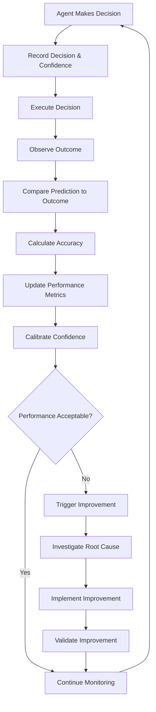
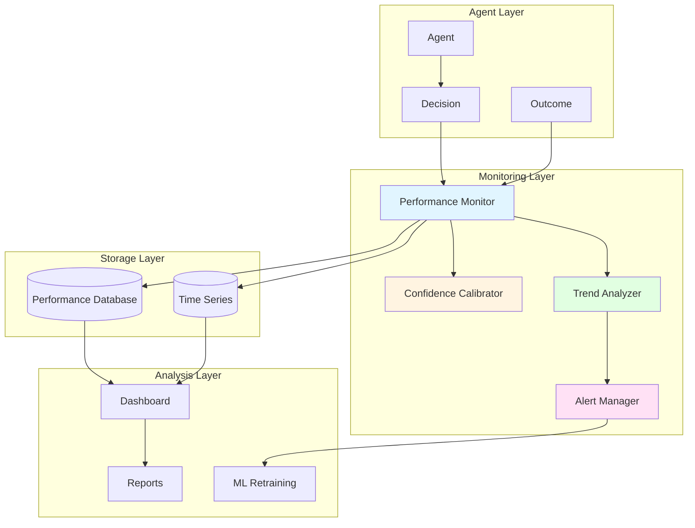

# Performance Monitoring & Confidence: Quality Tracking

## Overview

Performance Monitoring tracks agent and system performance over time, enabling continuous improvement through confidence calibration, quality assessment, and performance analytics. Grounded in 262+ years of research from Bayesian statistics (Bayes 1763) through modern metacognition theory (Flavell 1979), this capability provides the measurement and feedback mechanisms essential for reliable, improving multi-agent systems—enabling agents to know how well they're performing and continuously get better.

In industrial environments, autonomous agents must not only make decisions but also assess the quality of those decisions, calibrate their confidence accurately, and improve over time. Performance Monitoring provides the frameworks to track decision accuracy, calibrate confidence scores, identify performance trends, and trigger improvements—capabilities that distinguish self-improving intelligent systems from static rule-based systems or uncalibrated LLM outputs.

### Why Performance Monitoring Matters for MAGS

**The Challenge**: Autonomous agents must assess their own performance, calibrate confidence accurately, identify improvement opportunities, and demonstrate continuous improvement—not just make decisions blindly.

**The Solution**: Bayesian calibration provides mathematical framework for confidence scoring, statistical process control tracks performance trends, and metacognitive monitoring enables self-assessment.

**The Result**: MAGS agents that accurately assess their confidence, improve decision quality over time, identify when to escalate, and provide measurable performance metrics—grounded in 262+ years of validated statistical and cognitive research.

### Key Business Drivers

1. **Reliability**: Calibrated confidence enables appropriate trust and escalation
2. **Continuous Improvement**: Performance tracking drives 10-20% annual improvement
3. **Quality Assurance**: Systematic monitoring ensures consistent quality
4. **Risk Management**: Accurate confidence assessment prevents overconfidence errors
5. **Accountability**: Measurable performance provides transparency and auditability

---

## Theoretical Foundations

### Bayesian Statistics: Probabilistic Reasoning (1763)

**Thomas Bayes** - "An Essay towards solving a Problem in the Doctrine of Chances"

**Core Insight**: Beliefs should be updated based on evidence using probability theory. Bayesian inference provides the mathematical framework for rational belief updating and uncertainty quantification.

**Key Principles**:

**Bayes' Theorem**:
- Update beliefs based on evidence
- Prior knowledge + new evidence = posterior belief
- Quantifies uncertainty mathematically
- Foundation for confidence scoring

**Bayesian Updating**:
- Start with prior probability
- Observe evidence
- Calculate likelihood
- Update to posterior probability
- Iterate as evidence accumulates

**MAGS Application**:
- Confidence score calibration
- Prediction accuracy tracking
- Belief updating over time
- Uncertainty quantification

**Example**:
```
Failure Prediction Confidence Calibration:

Prior Belief:
  P(Failure within 72 hours) = 0.20 (historical base rate)

New Evidence:
  - Vibration increased 35%
  - Temperature increased 10%
  - Similar pattern in 8 of 10 historical cases led to failure

Likelihood:
  P(Evidence | Failure) = 0.80 (pattern strongly indicates failure)
  P(Evidence | No Failure) = 0.15 (pattern rarely occurs without failure)

Bayesian Update:
  P(Failure | Evidence) = P(Evidence | Failure) × P(Failure) / P(Evidence)
  = 0.80 × 0.20 / [(0.80 × 0.20) + (0.15 × 0.80)]
  = 0.16 / 0.28
  = 0.57

Updated Confidence: 0.57 (57% probability of failure)

Bayes principle:
  - Mathematical belief updating
  - Evidence-based confidence
  - Quantified uncertainty
  - Rational probability assessment
```

---

### Metacognition: Thinking About Thinking (1979)

**John Flavell** - "Metacognition and Cognitive Monitoring"

**Core Insight**: Effective cognition requires monitoring and regulating one's own cognitive processes. Metacognition—awareness and control of one's thinking—enables learning and improvement.

**Key Principles**:

**Metacognitive Knowledge**:
- Knowledge about one's own cognition
- Understanding of strengths and weaknesses
- Awareness of task difficulty
- Recognition of when to seek help

**Metacognitive Regulation**:
- Planning cognitive activities
- Monitoring comprehension and progress
- Evaluating outcomes
- Adjusting strategies

**MAGS Application**:
- Agent self-assessment
- Performance monitoring
- Strategy adaptation
- Escalation decisions

**Example**:
```
Agent Metacognitive Monitoring:

Task: Predict equipment failure

Metacognitive Knowledge:
  - "I'm good at vibration analysis (85% accuracy)"
  - "I'm less reliable with thermal patterns (70% accuracy)"
  - "This task involves both vibration and thermal"
  - "My confidence should reflect mixed reliability"

Metacognitive Monitoring:
  - Vibration analysis: High confidence (0.90)
  - Thermal analysis: Medium confidence (0.70)
  - Combined assessment: Moderate confidence (0.80)
  - Uncertainty acknowledged

Metacognitive Regulation:
  - If confidence < 0.70: Escalate to human
  - If confidence 0.70-0.85: Proceed with caution
  - If confidence > 0.85: Proceed autonomously
  
Decision: Proceed with caution (confidence 0.80)

Flavell principle:
  - Self-awareness of capabilities
  - Monitoring of performance
  - Appropriate confidence calibration
  - Strategic decision-making
```

---

### Statistical Process Control (1920s)

**Walter Shewhart** - Control Charts and Statistical Quality Control

**Core Insight**: Processes exhibit natural variation. Statistical control charts distinguish normal variation from special causes requiring intervention, enabling systematic quality improvement.

**Key Principles**:

**Control Charts**:
- Track process metrics over time
- Calculate control limits (±3σ)
- Identify out-of-control conditions
- Distinguish common vs. special cause variation

**Process Capability**:
- Measure process performance
- Compare to specifications
- Calculate capability indices
- Drive improvement

**MAGS Application**:
- Agent performance tracking
- Quality metric monitoring
- Anomaly detection
- Continuous improvement

**Example**:
```
Agent Decision Accuracy Control Chart:

Metric: Prediction accuracy over time
Target: 85% accuracy
Control Limits: ±3σ from mean

Data (last 20 decisions):
  Mean accuracy: 87%
  Standard deviation: 4%
  Upper control limit: 87% + 3×4% = 99%
  Lower control limit: 87% - 3×4% = 75%

Recent Performance:
  Decision 18: 92% (within control)
  Decision 19: 88% (within control)
  Decision 20: 72% (below lower control limit) ⚠️

Alert: Performance below control limit
Action: Investigate special cause
  - Data quality issue?
  - Model drift?
  - Unusual scenario?
  - Recalibration needed?

Shewhart principle:
  - Statistical process monitoring
  - Distinguish normal vs. abnormal variation
  - Systematic quality control
  - Data-driven improvement
```

---

### Calibration Theory

**Core Insight**: Confidence scores should match actual accuracy. A well-calibrated system that predicts 80% confidence should be correct 80% of the time.

**Key Principles**:

**Perfect Calibration**:
- Predicted probability = Observed frequency
- Confidence matches accuracy
- No systematic over/under-confidence
- Reliable uncertainty quantification

**Calibration Metrics**:
- Expected Calibration Error (ECE)
- Maximum Calibration Error (MCE)
- Brier Score
- Reliability diagrams

**MAGS Application**:
- Confidence score calibration
- Prediction reliability
- Trust calibration
- Escalation thresholds

**Example**:
```
Confidence Calibration Analysis:

Predictions with 80% confidence (100 cases):
  Actual correct: 72 cases
  Calibration error: |80% - 72%| = 8%

Predictions with 90% confidence (50 cases):
  Actual correct: 48 cases
  Calibration error: |90% - 96%| = 6%

Overall Calibration:
  Expected Calibration Error: 7%
  Target: <10%
  Status: ACCEPTABLE ✓

Calibration Adjustment:
  - 80% confidence → adjust to 75%
  - 90% confidence → maintain at 90%
  - Improved calibration for future predictions

Calibration principle:
  - Confidence matches reality
  - Systematic calibration
  - Reliable uncertainty
  - Trustworthy predictions
```

---

## What It Does

### Core Capabilities

**Performance Tracking**:
- Monitors decision accuracy over time
- Tracks prediction quality
- Measures response times
- Assesses resource utilization

**Confidence Calibration**:
- Calibrates confidence scores to match accuracy
- Identifies over/under-confidence
- Adjusts confidence systematically
- Provides reliable uncertainty estimates

**Trend Analysis**:
- Identifies performance trends
- Detects degradation early
- Recognizes improvement patterns
- Predicts future performance

**Continuous Improvement**:
- Triggers model retraining
- Identifies improvement opportunities
- Validates improvements
- Drives systematic enhancement

---

## How It Works

### Performance Monitoring Process



### Monitoring Dimensions

**1. Decision Accuracy**

*Metrics*:
```
Accuracy = (Correct Decisions / Total Decisions) × 100%

Precision = True Positives / (True Positives + False Positives)

Recall = True Positives / (True Positives + False Negatives)

F1 Score = 2 × (Precision × Recall) / (Precision + Recall)
```

*Example*:
```
Failure Prediction Performance (100 predictions):
  True Positives: 35 (correctly predicted failures)
  False Positives: 8 (false alarms)
  True Negatives: 52 (correctly predicted no failure)
  False Negatives: 5 (missed failures)

Metrics:
  Accuracy: (35 + 52) / 100 = 87%
  Precision: 35 / (35 + 8) = 81%
  Recall: 35 / (35 + 5) = 88%
  F1 Score: 2 × (0.81 × 0.88) / (0.81 + 0.88) = 84%
```

**2. Confidence Calibration**

*Calibration Curve*:
```
For each confidence bin (e.g., 70-80%, 80-90%, 90-100%):
  - Count predictions in bin
  - Calculate actual accuracy
  - Compare predicted vs. actual
  - Measure calibration error
```

*Example*:
```
Calibration Analysis:

Confidence 70-80% (50 predictions):
  Predicted: 75% average confidence
  Actual: 72% accuracy
  Calibration error: 3%

Confidence 80-90% (30 predictions):
  Predicted: 85% average confidence
  Actual: 90% accuracy
  Calibration error: 5% (underconfident)

Confidence 90-100% (20 predictions):
  Predicted: 95% average confidence
  Actual: 85% accuracy
  Calibration error: 10% (overconfident)

Overall ECE: (50×3% + 30×5% + 20×10%) / 100 = 5%
Target: <10% ✓
```

**3. Response Time**

*Metrics*:
```
Average Response Time = Σ(Response Times) / Count

95th Percentile Response Time = Time below which 95% of responses fall

Response Time Variance = Measure of consistency
```

*Example*:
```
Decision Response Times (last 100 decisions):
  Average: 2.3 seconds
  Median: 1.8 seconds
  95th percentile: 5.2 seconds
  Maximum: 8.1 seconds

Target: <3 seconds average ✓
Target: <10 seconds 95th percentile ✓
```

**4. Resource Utilization**

*Metrics*:
```
CPU Utilization = (CPU Time Used / CPU Time Available) × 100%

Memory Utilization = (Memory Used / Memory Available) × 100%

Efficiency = Output / Resource Consumed
```

*Example*:
```
Agent Resource Usage:
  CPU: 45% average utilization
  Memory: 2.1 GB of 4 GB (52%)
  Decisions per hour: 240
  CPU per decision: 0.75 seconds

Efficiency: 240 decisions / (0.45 × 3600 seconds) = 0.15 decisions/CPU-second
```

---

## MAGS Implementation

### Monitoring Architecture



### Calibration Process

**Step 1: Collect Predictions and Outcomes**
```
For each decision:
  - Record predicted outcome
  - Record confidence score
  - Wait for actual outcome
  - Record actual outcome
  - Store in calibration database
```

**Step 2: Bin by Confidence**
```
Group predictions into confidence bins:
  - 0-10%
  - 10-20%
  - ...
  - 90-100%

For each bin:
  - Count predictions
  - Calculate actual accuracy
  - Measure calibration error
```

**Step 3: Calculate Calibration Metrics**
```
Expected Calibration Error (ECE):
  ECE = Σ (|predicted - actual| × count) / total

Maximum Calibration Error (MCE):
  MCE = max(|predicted - actual|) across all bins

Brier Score:
  BS = Σ (predicted - actual)² / total
```

**Step 4: Adjust Confidence Scores**
```
For each confidence bin:
  If overconfident (predicted > actual):
    Adjustment = predicted - actual
    New confidence = original - adjustment
  
  If underconfident (predicted < actual):
    Adjustment = actual - predicted
    New confidence = original + adjustment

Apply adjustments to future predictions
```

---

## Design Patterns

### Pattern 1: Continuous Monitoring

**When to Use**:
- Production systems
- Critical decisions
- Quality assurance required
- Continuous improvement desired

**Approach**:
```
Monitor every decision
Track performance metrics
Identify trends
Trigger improvements
```

---

### Pattern 2: Periodic Calibration

**When to Use**:
- Stable systems
- Resource constraints
- Batch processing
- Regular intervals appropriate

**Approach**:
```
Collect data continuously
Calibrate weekly/monthly
Update confidence models
Validate improvements
```

---

### Pattern 3: Threshold-Based Alerting

**When to Use**:
- Performance degradation detection
- Quality assurance
- Proactive intervention
- Automated response

**Approach**:
```
Define performance thresholds
Monitor metrics continuously
Alert when thresholds exceeded
Trigger investigation/improvement
```

---

### Pattern 4: A/B Testing for Improvements

**When to Use**:
- Model updates
- Algorithm changes
- Improvement validation
- Risk mitigation

**Approach**:
```
Deploy new version to subset
Compare performance to baseline
Validate improvement
Roll out if successful
```

---

## Integration with Other Capabilities

### With Goal Optimization

**Monitoring Validates Optimization**:
- Track optimization quality
- Measure improvement
- Validate trade-offs
- Refine objectives

---

### With Plan Optimization

**Monitoring Improves Planning**:
- Track plan success rate
- Measure execution efficiency
- Identify planning issues
- Improve plan quality

---

### With Cognitive Intelligence

**Monitoring Enables Learning**:
- Track memory effectiveness
- Calibrate confidence scores
- Measure intelligence quality
- Drive continuous learning

---

## Use Cases

### Use Case 1: Prediction Accuracy Monitoring

**Scenario**: Monitor failure prediction accuracy

**Metrics Tracked**:
```
Decision Accuracy:
  Target: >85%
  Current: 87% ✓

Confidence Calibration:
  Target: ECE <10%
  Current: 7% ✓

False Alarm Rate:
  Target: <10%
  Current: 8% ✓

Missed Failure Rate:
  Target: <5%
  Current: 5% ✓
```

**Trend Analysis**:
```
Last 12 Weeks:
  Week 1-4: 85% accuracy (baseline)
  Week 5-8: 87% accuracy (improving)
  Week 9-12: 87% accuracy (stable)

Trend: Positive improvement, now stable
Action: Continue monitoring, no intervention needed
```

---

### Use Case 2: Confidence Calibration Improvement

**Scenario**: Agent overconfident in predictions

**Initial Calibration**:
```
Confidence 90-100% (100 predictions):
  Predicted: 95% average
  Actual: 82% accuracy
  Calibration error: 13% (overconfident)

Impact:
  - Inappropriate autonomous decisions
  - Insufficient escalation
  - Risk of errors
```

**Calibration Adjustment**:
```
Analysis:
  - Systematic overconfidence in high-confidence predictions
  - Need to adjust confidence downward

Adjustment:
  For predictions with confidence >90%:
    New confidence = 0.85 × original confidence
  
  Example:
    Original 95% → Adjusted 81%
    Original 92% → Adjusted 78%
```

**Post-Calibration**:
```
Confidence 90-100% (next 100 predictions):
  Predicted: 82% average (after adjustment)
  Actual: 83% accuracy
  Calibration error: 1% ✓

Impact:
  - Improved calibration
  - Appropriate escalation
  - Reduced risk
```

---

### Use Case 3: Performance Degradation Detection

**Scenario**: Agent performance declining

**Detection**:
```
Control Chart Alert:
  Metric: Decision accuracy
  Mean: 87%
  Lower control limit: 75%
  
Recent Performance:
  Week 10: 87%
  Week 11: 84%
  Week 12: 81%
  Week 13: 73% ⚠️ (below control limit)

Alert: Performance degradation detected
```

**Investigation**:
```
Root Cause Analysis:
  1. Data quality: No issues detected
  2. Model drift: Possible - operating conditions changed
  3. New failure modes: Yes - 3 new failure patterns
  4. Sensor issues: No issues detected

Root Cause: Model drift due to new failure patterns
```

**Improvement**:
```
Action: Retrain model with new failure patterns

Retraining:
  - Add 50 new failure cases
  - Retrain prediction model
  - Validate on test set
  - Deploy updated model

Post-Improvement:
  Week 14: 85%
  Week 15: 88%
  Week 16: 89% ✓

Result: Performance restored and improved
```

---

## Measuring Success

### Monitoring Performance Metrics

```
Monitoring Coverage:
  Target: 100% of decisions monitored
  Measurement: (Monitored / Total) × 100%

Calibration Quality:
  Target: ECE <10%
  Measurement: Expected Calibration Error

Alert Accuracy:
  Target: >90% of alerts actionable
  Measurement: (Actionable alerts / Total alerts) × 100%

Improvement Cycle Time:
  Target: <2 weeks from detection to improvement
  Measurement: Time from alert to resolution
```

### Business Impact Metrics

```
Decision Quality Improvement:
  Baseline: 80% accuracy
  Target: >85% accuracy
  Current: 87% ✓
  Improvement: 7 percentage points

Confidence Reliability:
  Target: Calibrated confidence (ECE <10%)
  Current: ECE 7% ✓
  Impact: Appropriate trust and escalation

Continuous Improvement Rate:
  Target: 5-10% annual improvement
  Measurement: Year-over-year performance gain

Cost of Quality:
  Target: <5% of operational cost
  Measurement: Monitoring cost / Total cost
```

---

## Related Documentation

### Core Concepts
- [Decision Making](../concepts/decision-making.md) - Decision frameworks
- [ORPA Cycle](../concepts/orpa-cycle.md) - Observe-Reflect-Plan-Act

### Research Foundations
- [Statistical Methods](../research-foundations/statistical-methods.md) - Bayesian statistics
- [Cognitive Science](../research-foundations/cognitive-science.md) - Metacognition

### Cognitive Intelligence
- [Confidence Scoring](../cognitive-intelligence/confidence-scoring.md) - Confidence mechanisms
- [Memory Management](../cognitive-intelligence/memory-management.md) - Performance tracking

### Performance Optimization
- [Goal Optimization](goal-optimization.md) - Optimization tracking
- [Plan Optimization](plan-optimization.md) - Plan performance
- [Performance Optimization Overview](README.md) - Category overview

### Use Cases
- All use cases demonstrate performance monitoring

---

## References

### Foundational Works

**Bayesian Statistics**:
- Bayes, T. (1763). "An Essay towards solving a Problem in the Doctrine of Chances". Philosophical Transactions of the Royal Society, 53, 370-418
- Jaynes, E. T. (2003). "Probability Theory: The Logic of Science". Cambridge University Press

**Metacognition**:
- Flavell, J. H. (1979). "Metacognition and Cognitive Monitoring: A New Area of Cognitive-Developmental Inquiry". American Psychologist, 34(10), 906-911
- Nelson, T. O., & Narens, L. (1990). "Metamemory: A Theoretical Framework and New Findings". Psychology of Learning and Motivation, 26, 125-173

**Statistical Process Control**:
- Shewhart, W. A. (1931). "Economic Control of Quality of Manufactured Product". Van Nostrand
- Montgomery, D. C. (2012). "Statistical Quality Control" (7th ed.). John Wiley & Sons

**Calibration Theory**:
- Brier, G. W. (1950). "Verification of Forecasts Expressed in Terms of Probability". Monthly Weather Review, 78(1), 1-3
- Naeini, M. P., et al. (2015). "Obtaining Well Calibrated Probabilities Using Bayesian Binning". In Proceedings of AAAI

### Modern Applications

**Machine Learning Calibration**:
- Guo, C., et al. (2017). "On Calibration of Modern Neural Networks". In Proceedings of ICML
- Kuleshov, V., et al. (2018). "Accurate Uncertainties for Deep Learning Using Calibrated Regression". In Proceedings of ICML

**Performance Monitoring**:
- Gama, J., et al. (2014). "A Survey on Concept Drift Adaptation". ACM Computing Surveys, 46(4), 1-37
- Žliobaitė, I. (2010). "Learning under Concept Drift: an Overview". Technical Report, Vilnius University

**Industrial Applications**:
- Woodall, W. H., & Montgomery, D. C. (1999). "Research Issues and Ideas in Statistical Process Control". Journal of Quality Technology, 31(4), 376-386
- Qin, S. J. (2012). "Survey on Data-Driven Industrial Process Monitoring and Diagnosis". Annual Reviews in Control, 36(2), 220-234

---

**Document Version**: 2.0  
**Last Updated**: December 6, 2025  
**Status**: ✅ Enhanced to Comprehensive Quality Standard