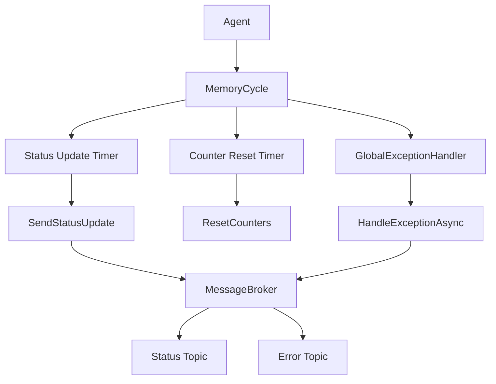
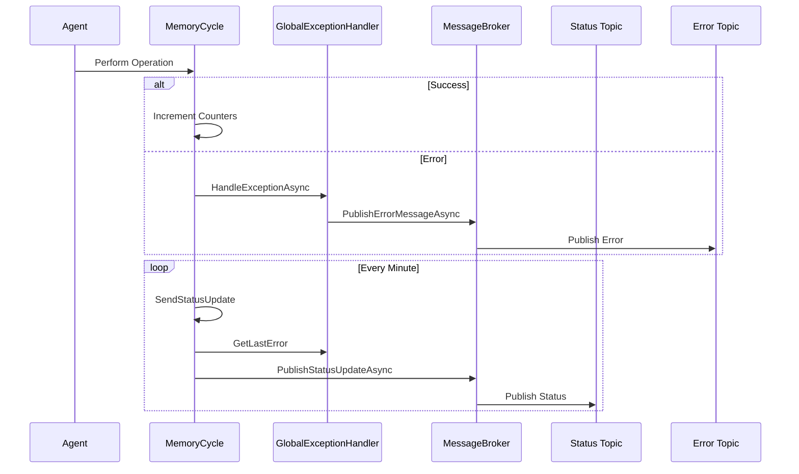

# Agent Status Monitoring and Error Handling System

## Concept

The Agent Status Monitoring and Error Handling System is designed to provide real-time insights into the operational status of agents within the Multi-Agent System (MAGS). It combines periodic status updates with comprehensive error handling to ensure robust operation and facilitate easy monitoring and debugging.
## Key Components

1. **Status Updates**: Regular broadcasts of agent operational metrics.
2. **Error Handling**: Centralized error capture and reporting.
3. **Performance Metrics**: CPU and memory usage tracking.
4. **Activity Counters**: Tracking of key operations (memories processed, plans generated, conversations handled).
5. **Tool Usage Metrics**: Tracking the usage frequency of different tools.
## Implementation Details
### Status Updates

The `MemoryCycle` class implements a timer-based status update mechanism:

The `StatusUpdateIntervalMs` and `CounterResetIntervalMs` are configured and read from `System Options` in the graph database.  Adjust them with caution. 

```csharp
private Timer _statusUpdateTimer;
private const int StatusUpdateIntervalMs = 60000; // 1 minute
private const int CounterResetIntervalMs = 24 * 60 * 60 * 1000; // 24 hours

public void Start(string agentId)
{
    // ...
    _statusUpdateTimer = new Timer(SendStatusUpdate, null, 0, StatusUpdateIntervalMs);
    // ...
}
```

The `SendStatusUpdate` method collects and publishes the status:

```csharp
private async void SendStatusUpdate(object state)
{
    var status = new AgentStatus
    {
        AgentId = _agentId,
        Timestamp = DateTime.UtcNow,
		//...
    };

    await _messageBroker.PublishStatusUpdateAsync(_agentId, agentInstance.TeamId, status);
}
```
### Error Handling

The `GlobalExceptionHandler` class provides centralized error management:

```csharp
public class GlobalExceptionHandler
{
    private readonly ConcurrentDictionary<string, string> _lastErrors = new ConcurrentDictionary<string, string>();

    public async Task HandleExceptionAsync(Exception ex, string agentId, string teamId)
    {
        var errorMessage = $"{ex.GetType().Name}: {ex.Message}";
        _lastErrors[agentId] = errorMessage;
        await _messageBroker.PublishErrorMessageAsync(agentId, teamId, errorMessage, ex);
    }

    public string GetLastError(string agentId)
    {
        _lastErrors.TryGetValue(agentId, out var errorMessage);
        return errorMessage;
    }
}
```
### Performance Metrics

CPU and memory usage are tracked using the `System.Diagnostics.Process` class:

```csharp
private float GetCpuUsage()

private float GetMemoryUsage()
```
### Activity Counters

Thread-safe counters track key operations:

```csharp
public void IncrementMemoriesProcessed()
{
    Interlocked.Increment(ref _memoriesProcessed);
}

public void IncrementPlansGenerated()
{
    Interlocked.Increment(ref _plansGenerated);
}

public void IncrementConversationsHandled()
{
    Interlocked.Increment(ref _conversationsHandled);
}
```
### Tool Usage Tracking

```c#
public void IncrementToolUsage(string toolName)
{
    lock (_toolUsage)
    {
        if (!_toolUsage.ContainsKey(toolName))
        {
            _toolUsage[toolName] = 0;
        }
        _toolUsage[toolName]++;
    }
}
```
## System Architecture Diagram



## Data Flow Diagram



## Reasoning and Benefits

1. **Real-time Monitoring**: Regular status updates provide insights into agent performance and health.
2. **Centralized Error Handling**: The `GlobalExceptionHandler` ensures consistent error management across the system.
3. **Performance Tracking**: CPU and memory metrics help identify resource-intensive operations or potential issues.
4. **Operation Insights**: Counters for memories processed and plans generated offer visibility into agent activity levels.
5. **Scalability**: The system is designed to work with multiple agents, each maintaining its own status and error information.
6. **Fault Tolerance**: Error handling and reporting continue even if status updates fail, ensuring no loss of critical information.
7. **Conversation Insights**: Tracking the number of conversations handled provides visibility into the agent's interaction load.
8. **Tool Utilization**: Monitoring tool usage helps identify which tools are most frequently used, informing potential optimizations or resource allocations.
## Conclusion

This system provides a robust framework for monitoring and maintaining the health of agents in the MAGS. By combining regular status updates with centralized error handling, it offers a comprehensive view of system operations, facilitating quick identification and resolution of issues. The use of message brokers for communication ensures scalability and flexibility, allowing for easy integration with various monitoring and alerting systems.
