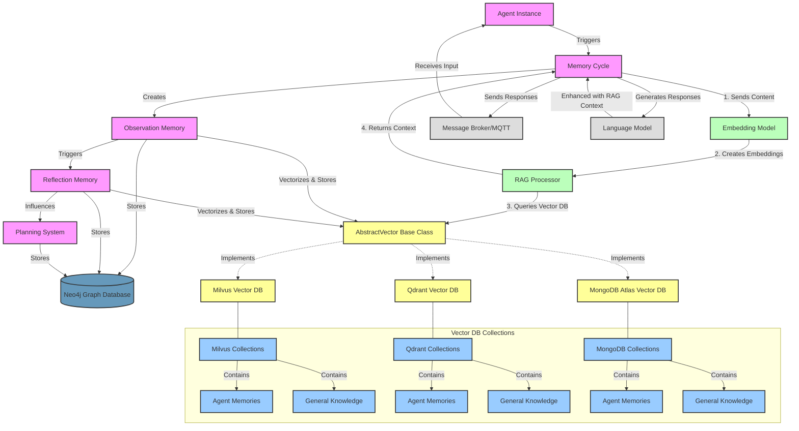

# Memory Cycle

## Overview

The Memory Cycle is a core component of the XMPro MAGS system, managing the cognitive processes of agents through observation, reflection, and planning integration. This document details the complete memory cycle process, its components, and their interactions.

## Architecture



## Components

### 1. Initialization & Setup

The Memory Cycle initializes with several key components:
- Database Manager (Neo4j and Vector DBs)
- Language Model integration
- Message Broker (MQTT/DDS)
- OpenTelemetry for tracing/metrics
- Tool Library for agent capabilities
- Prompt Manager for LLM interactions

### 2. Core Input Processing

When input is received through MQTT, it is:
1. Validated and routed based on type:
   - Chat messages
   - Observations
   - Datastream messages

### 3. Memory Creation Process

#### 3.1 Observation Creation

```plaintext
When a new observation is triggered:
1. Content is processed through RAG:
   - Query is embedded using the Embedding Model
   - Similar memories are retrieved from Vector DB
   - RAG context is retrieved from both general and agent-specific collections
2. LLM processes observation with context to generate:
   - Summary
   - Key Points
   - Context information
3. Importance score is calculated:
   - Uses LLM to evaluate importance (0-1 scale)
   - Considers agent goals and current context
4. Memory is stored:
   - Vector representation in chosen Vector DB
   - Relationship data in Neo4j
   - Additional metadata and metrics
```

#### 3.2 Reflection Creation

```plaintext
Reflections are triggered when:
1. Accumulated observation importance exceeds threshold
2. Significant time has passed
3. Critical new information is received

Process:
1. Recent memories are collected and ranked:
   - Time-based decay applied to importance scores
   - Vector similarity considered
   - Contextual relevance evaluated
2. RAG enhancement applied:
   - Similar past reflections retrieved
   - Relevant context aggregated
3. LLM generates reflection with:
   - Key insights
   - Action items
   - Updated understanding
4. Storage similar to observations but with:
   - Links to contributing memories
   - Additional metadata for reflection chain
```

### 4. Planning Integration

The memory cycle integrates with planning through:

```plaintext
1. Plan Detection:
   - Monitors reflection outcomes
   - Evaluates goal alignment
   - Checks for necessary plan updates

2. Plan Adaptation:
   - New reflections can trigger plan reviews
   - Environment changes can force replanning
   - Goal adjustments can initiate new plans

3. Plan Execution:
   - Tasks are distributed to appropriate agents
   - Progress is monitored and stored
   - Outcomes feed back into memory cycle
```

### 5. RAG Implementation

```plaintext
For each memory operation:
1. Content Processing:
   - Text is cleaned and formatted
   - Relevant sections are extracted
   - Context is structured

2. Vector Operations:
   - Content is embedded via Embedding Model
   - Vector DB collections are queried:
     * Agent-specific memories
     * General knowledge base
   - Results are ranked by relevance

3. Context Integration:
   - Top K results are retrieved
   - Context is formatted for LLM
   - Token limits are managed
```

### 6. Storage & Persistence

```plaintext
Dual Storage Strategy:
1. Neo4j Graph Database:
   - Relationship data
   - Temporal connections
   - Metadata and metrics
   - Planning linkages

2. Vector Database:
   - Semantic embeddings
   - Fast similarity search
   - Collections separated by:
     * Agent-specific memories
     * General knowledge
     * Different memory types
```

### 7. Metrics & Monitoring

```plaintext
The cycle tracks:
1. Memory Statistics:
   - Memories processed
   - Importance distributions
   - Response times
   - Token usage

2. RAG Metrics:
   - Query times
   - Relevance scores
   - Cache hit rates
   - Vector DB performance

3. System Health:
   - Resource usage
   - Error rates
   - Processing latencies
   - Queue depths
```

The Memory Cycle operates continuously, with each component feeding into others to maintain the agent's cognitive processes and decision-making capabilities. The system is designed to be both reactive to new inputs and proactive in generating insights and maintaining knowledge coherence.
