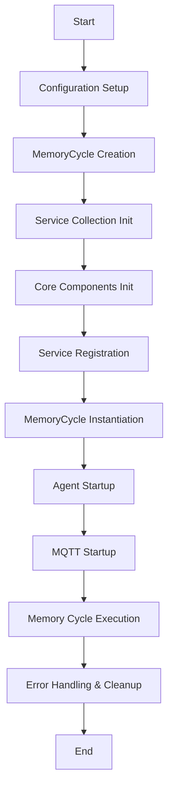
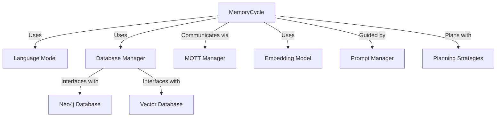
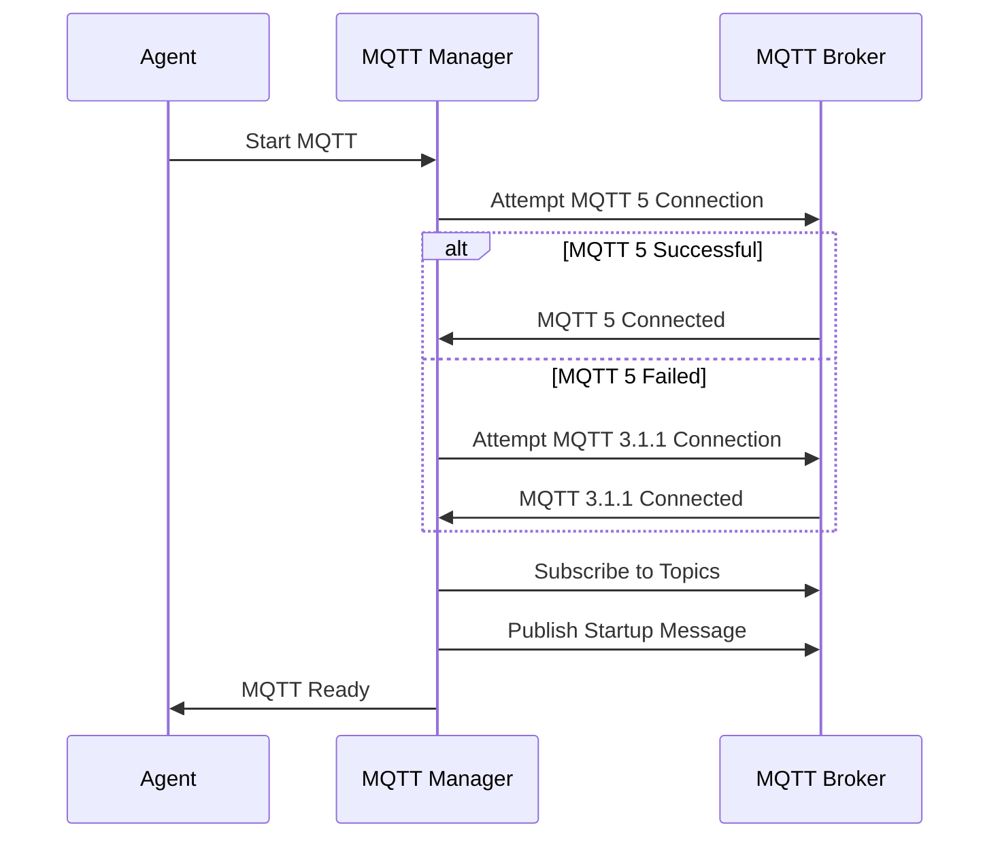

# Memory Cycle Instantiation Process

The agent instantiation process in XMPro MAGS (Multi-Agent System) involves several key components working together to create and initialize an agent within the system. This process is designed to be modular, scalable, and configurable, allowing for flexible deployment of agents with various capabilities.

## Key Components

1. **Memory Cycle Factory**: Responsible for creating and configuring the MemoryCycle instance.
2. **Memory Cycle**: The core component managing an agent's cognitive processes.
3. **MQTT Manager**: Handles MQTT communication for the agent.
4. **Database Manager**: Manages interactions with Neo4j and vector databases.
5. **Language Model**: Provides natural language processing capabilities.
6. **Open Telemetry**: Configures telemetry for monitoring and logging.

### Overall Process Flow



### Core Components Interaction



## 1. Configuration Initialization

The process begins by setting up various configuration dictionaries with the settings as configured on the agent:

| Config                | For                                  |
|-----------------------|--------------------------------------|
| `neo4jConfig`         | For Neo4j database connection        |
| `vectorDbConfig`      | For vector database configuration    |
| `embeddingConfig`     | For embedding model configuration    |
| `languagemodelConfig` | For language model configuration     |
| `mqttConfig`          | For MQTT communication configuration |
| `telemetryConfig`     | For logging, metrics and traces      |

## 2. Memory Cycle Creation

The `MemoryCycleFactory.CreateMemoryCycle()` method is called with these configurations:

```csharp
var memoryCycle = MemoryCycleFactory.CreateMemoryCycle(
    neo4jConfig,
    vectorDbConfig,
    embeddingConfig,
    languagemodelConfig,
    mqttConfig,
    Metadata.Name,
    Metadata.Version,
    telemetryConfigJson
);
```

The `CreateMemoryCycle` method performs the following steps:

| Step                            | Action                        | Details                                                                                                                    |
|---------------------------------|-------------------------------|---------------------------------------------------------------------------------------------------------------------------|
| 1. Initialize ServiceCollection | a. Configure telemetry        | - Set up telemetry and adds default logging                                                                                |
|                                 | b. Build ServiceProvider      | - Create the ServiceProvider                                                                                               |
| 2. Initialize Components        | a. Create Neo4jConnectionPool | - Set up connection pool for Neo4j graph database                                                                          |
|                                 | b. Initialize vector database | - Set up Milvus vector database                                                                                            |
|                                 | c. Initialize embedding model | - Set up Ollama Embedding, Open AI Embedding, or Azure Open AI Embedding                                                   |
|                                 | d. Initialize LanguageModel   | - Set up language models for Ollama, Open AI, Azure Open AI tasks (These are create on demand within the code when needed) |
|                                 | e. Create DatabaseManager     | - Set up manager for database operations                                                                                   |
|                                 | f. Initialize MQTTManager     | - Set up manager for MQTT communications                                                                                   |
| 3. Register Services            | a. Add singletons             | - Register DatabaseManager, LanguageModel, MQTTManager, OpenTelemetrySetup as singletons                                   |
|                                 | b. Register strategies        | - Register planning strategies and optimization algorithms                                                                 |
| 4. Create MemoryCycle Instance  | Return new MemoryCycle        | - Create and return a new MemoryCycle instance with all initialized components                                             |

```csharp
return new MemoryCycle(
   dbManager,
   languageModel,
   mqttManager,
   otelSetup,
   loggerFactory,
   serviceProvider
);
```

### Notes - Dependency Injection Setup

- A Service Collection is created to manage dependencies.
- Key services are registered as singletons or transients as appropriate.

## 3. Agent Startup

```csharp
memoryCycle.Start(AGENT_ID);
```

The `Start()` method in the MemoryCycle class is called to begin the agent's lifecycle. The method performs the following steps:

| Step                        | Action                                  | Details                                                                                         |
|-----------------------------|----------------------------------------|--------------------------------------------------------------------------------------------------|
| 1. Telemetry                | a. Start OpenTelemetry activity         | - Name: "memory_cycle_start"                                                                    |
|                             | b. Log information                      | - Message: Memory Cycle has started                                                             |
| 2. Agent Instance Retrieval | Call GetAgentInstance(agentId)          | - Retrieve the agent instance                                                                   |
| 3. MQTT Connection          | Call _mqttManager.Connect()             | - Connect to the MQTT broker                                                                    |
|                             |                                         | - Version Detection: Attempts to connect using MQTT 5, falling back to MQTT 3.1.1 if necessary. |
| 4. Topic Subscription       | Call _mqttManager.SubscribeToTopics()   | - Subscribes to agent-specific and team-wide topics.                                            |
|                             |                                         | - Parameters: agentId, _agentInstance.TeamId                                                    |
| 5. Startup Message          | Call SendStartupMessage(_agentInstance) | - Publishes a message to indicate the agent is online and ready                                 |
| 6. Logging                  | Log information                         | - Message: Agent has been initialized                                                           |
|                             |                                         | - Include agentId in the log                                                                    |
| 7. Error Handling           | a. Catch exceptions                     | - During the entire initialization process                                                      |
|                             | b. Log error                            | - If initialization fails                                                                       |
|                             | c. Re-throw exception                   | - To be handled by the caller                                                                   |

- The method ensures that the agent is properly connected to the MQTT system before it starts operating.
- It sets up the necessary communication channels for the agent to receive and send messages.
- The use of telemetry allows for monitoring and tracking of the initialization process.
- Error handling ensures that any issues during startup are logged and propagated appropriately.

This implementation provides a robust initialization process for each agent, ensuring they are properly set up within the MQTT-based multi-agent system before beginning their operations.

### MQTT Startup Process



## 4. Agent Run

```csharp
memoryCycle.Run();
```

The `Run()` is called to start the main processing loop of the agent. This loop handles incoming MQTT messages and manages the agent's cognitive processes.

## Error Handling and Cleanup

- Try-catch block surrounds the Run() method for error handling.
- In case of exceptions, errors are logged.
- Cleanup is performed in the finally block, calling Stop() and Dispose() on the MemoryCycle.

## Key Architectural Points

- **Modularity**: Each component (MQTT, Database, Language Model) is initialized separately, allowing for easy replacement or upgrading of individual parts.
- **Configurability**: Extensive use of configuration dictionaries allows for flexible setup without code changes.
- **Dependency Injection**: Use of ServiceCollection for dependency management promotes loose coupling and easier testing.
- **Telemetry Integration**: Built-in support for OpenTelemetry enables comprehensive monitoring and logging.
- **Error Handling**: Robust error handling and logging are integrated throughout the process.
- **Resource Management**: Proper disposal of resources is ensured through the use of IDisposable pattern.

This architecture allows for scalable and maintainable deployment of agents, with each agent capable of independent operation within the larger multi-agent system.