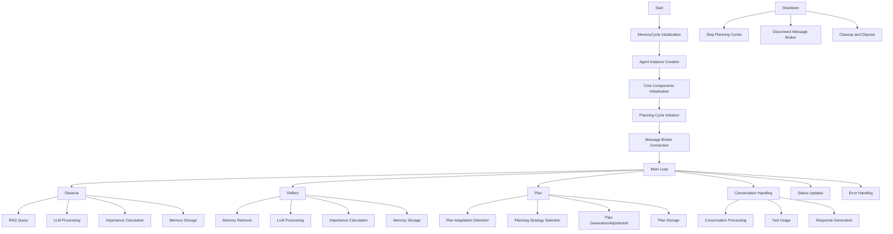
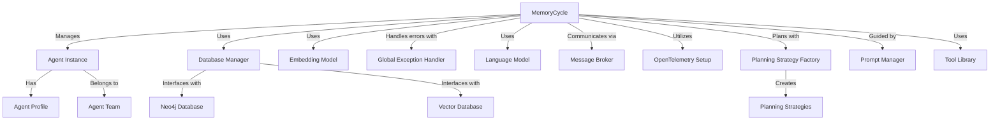
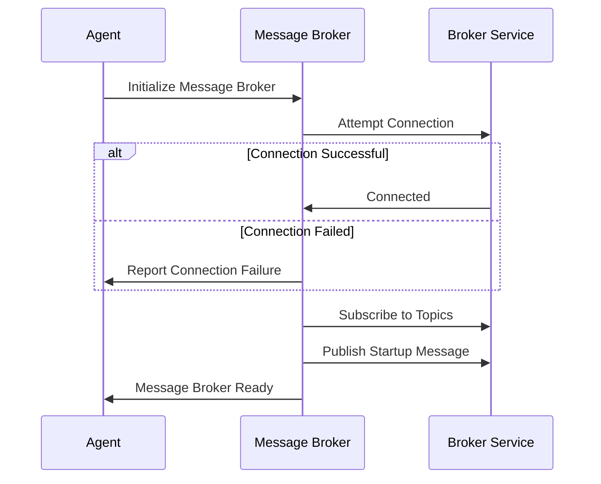
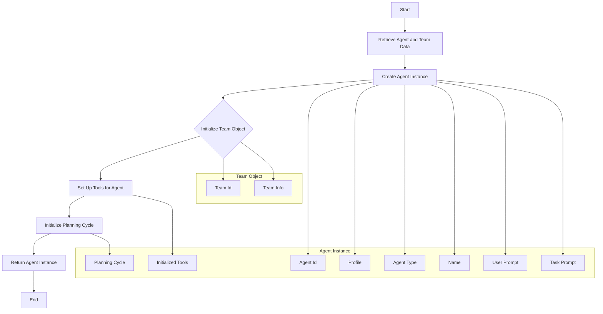

# Memory Cycle Instantiation Process

The agent instantiation process in XMPro MAGS (Multi-Agent System) involves several key components working together to create and initialize an agent within the system. This process is designed to be modular, scalable, and configurable, allowing for flexible deployment of agents with various capabilities.

## Key Components

1. **Memory Cycle Factory**: Responsible for creating and configuring the MemoryCycle instance.
2. **Memory Cycle**: The core component managing an agent's cognitive processes.
3. **Message Broker**: Handles message based communication for the agent.
4. **Database Manager**: Manages interactions with Neo4j and vector databases.
5. **Language Model**: Provides natural language processing capabilities.
6. **Open Telemetry**: Configures telemetry for monitoring and logging.

### Overall Process Flow



### Core Components Interaction



## 1. Configuration Initialization

The process begins by setting up various configuration dictionaries with the settings as configured on the agent:

| Config                | For                                  |
|-----------------------|--------------------------------------|
| `neo4jConfig`         | For Neo4j database connection        |
| `vectorDbConfig`      | For vector database configuration    |
| `embeddingConfig`     | For embedding model configuration    |
| `languagemodelConfig` | For language model configuration     |
| `messageBrokerConfig` | For message broker communication configuration |
| `telemetryConfig`     | For logging, metrics and traces      |
| `toolConfig`          | For tool configuration options       |

## 2. Memory Cycle Creation

The `MemoryCycleFactory.CreateMemoryCycle()` method is called with these configurations:

```C#
var config = SetupConfiguration();

memoryCycle = MemoryCycleFactory.CreateMemoryCycle(
    (Dictionary<string, object>)config["neo4jConfig"],
    (Dictionary<string, object>)config["vectorDbConfig"],
    (Dictionary<string, object>)config["embeddingConfig"],
    (Dictionary<string, object>)config["languagemodelConfig"],
    (Dictionary<string, object>)config["messageBrokerConfig"],
    (Dictionary<string, object>)config["telemetryConfigJson"],
    (Dictionary<string, object>)config["toolConfig"]
);
```

The `CreateMemoryCycle` method performs the following steps:

| Step                            | Action                        | Details                                                                                                                    |
|---------------------------------|-------------------------------|---------------------------------------------------------------------------------------------------------------------------|
| 1. Initialize ServiceCollection | a. Configure telemetry        | - Set up telemetry and adds default logging |
|                                 | b. Build ServiceProvider      | - Create the ServiceProvider |
| 2. Initialize Components        | a. Create Neo4jConnectionPool | - Set up connection pool for Neo4j graph database |
|                                 | b. Initialize vector database | - Set up the required vector database |
|                                 | c. Initialize embedding model | - Set up the required embedding |
|                                 | d. Initialize LanguageModel   | - Set up all language models (These are created on demand within the code when needed) |
|                                 | e. Create DatabaseManager     | - Set up manager for database operations |
|                                 | f. Load SystemOptions         | - Load system-wide options |
|                                 | g. Initialize MQTTManager     | - Set up manager for message broker communications |
|                                 | h. Initialize GlobalExceptionHandler | - Set up global exception handling |
|                                 | i. Initialize ToolLibrary     | - Set up library for agent tools |
| 3. Register Services            | a. Add singletons             | - Register Database Manager, Language Model, Message Broker, Open Telemetry Setup, Prompt Manager, Planning Strategy Factory, Tool Library, Plan Adapter Detector as singletons |
|                                 | b. Register strategies        | - Register planning strategies and optimization algorithms |
| 4. Create MemoryCycle Instance  | Return new MemoryCycle        | - Create and return a new MemoryCycle instance with all initialized components |

```C#
return new MemoryCycle(
    dbManager,
    languageModel,
    messageBroker,
    otelSetup,
    loggerFactory,
    serviceProvider,
    toolLibrary,
    systemOptions,
    globalExceptionHandler
);
```

### Notes - Dependency Injection Setup

- A Service Collection is created to manage dependencies.
- Key services are registered as singletons or transients as appropriate.

## 3. Agent Startup

```C#
memoryCycle.Start(AGENT_ID);
```

The `Start()` method in the MemoryCycle class is called to begin the agent's lifecycle. The method performs the following steps:

| Step                        | Action                                  | Details                                                                                         |
|-----------------------------|----------------------------------------|--------------------------------------------------------------------------------------------------|
| 1. Telemetry                | a. Start OpenTelemetry activity         | - Name: "memory_cycle_startup"                                                                    |
|                             | b. Log information                      | - Message: Memory Cycle started                                                             |
| 2. Agent Instance Retrieval | Call GetAgentInstance(agentId)          | - Retrieve the agent instance                                                                   |
| 3. Message Broker Connection | Call _messageBroker.Connect()          | - Connect to the Message broker                                                                    |
| 4. Topic Subscription       | Call _messageBroker.SubscribeToTopics()   | - Subscribes to agent-specific and team-wide topics.                                            |
|                             |                                         | - Parameters: _agentId, _teamId                                                    |
| 5. Startup Message          | Call SendStartupMessage(_agentInstance) | - Publishes a message to indicate the agent is online and ready                                 |
| 6. Initiate Status Message  | Start the _statusUpdateTimer and _counterResetTimer | - This initializes and starts the status update tha agent sends to the status topic                                 |
| 7. Logging                  | Log information                         | - Message: Agent has been initialized                                                           |
|                             |                                         | - Include agentId in the log                                                                    |
| 8. Error Handling           | a. Catch exceptions                     | - During the entire initialization process                                                      |
|                             | b. Log error                            | - If initialization fails                                                                       |
|                             | c. Re-throw exception                   | - To be handled by the caller                                                                   |

- The method ensures that the agent is properly connected to the message broker system before it starts operating.
- It sets up the necessary communication channels for the agent to receive and send messages.
- The use of telemetry allows for monitoring and tracking of the initialization process.
- Error handling ensures that any issues during startup are logged and propagated appropriately.

This implementation provides a robust initialization process for each agent, ensuring they are properly set up within the MQTT-based multi-agent system before beginning their operations.

### Message Broker Startup Process



## GetAgentInstance(agentId) in MemoryCycle

The GetAgentInstance method is central to the MAGS framework's ability to manage complex multi-agent interactions. It balances the need for detailed information about the primary agent with efficient representation of the team context, enabling sophisticated agent behaviors and team coordination.



### Purpose
The primary purpose of this method is to retrieve or create an agent instance based on the provided agentId. It not only initializes the  agent but also sets up the agent's awareness of its team and other team members.

### Key Features
1. Primary Agent Initialization:
    - Retrieves the full agent instance for the specified agentId.
    - Sets up the agent's profile, type, and other essential properties.

2. Team Awareness:
    - Retrieves the team associated with the agent.

3. Tool Initialization:
    - Initializes the tools available to the agent based on its profile and permissions.

4. Planning Cycle Setup:
    - Initiates the planning cycle for the agent if it hasn't been started already.

### Process Flow
1. Retrieve agent and team data from the database.
2. Create the Agent Instance with full details.
3. Initialize the Team object.
4. Set up tools and permissions for the agent.
5. Initialize the planning cycle if needed.
6. Return the fully initialized Agent Instance.

### Team Structure
The team structure returned by this method includes:

- Agent: A fully initialized Agent Instance with complete capabilities.
- Team Object: Contains:
    - Team ID and other team-specific information.

## 4. Agent Run

```C#
memoryCycle.Run();
```

The `Run()` is called to start the main processing loop of the agent. This loop handles incoming messages and manages the agent's cognitive processes.

## Error Handling and Cleanup

- A GlobalExceptionHandler is used to manage exceptions across the system.
- The GlobalExceptionHandler is initialized with a message broker, logger, and OpenTelemetry setup.
- Try-catch blocks are used throughout the code, including around the Run() method, for error handling.
- In case of exceptions:
    - Errors are logged using the configured logger.
    - Error messages are published to a specific error topic using the message broker.
    - The OpenTelemetry setup is used to record error traces for monitoring and debugging.
- Error messages are published to an error topic for the affected agent.
- Cleanup is performed in finally blocks, which includes:
    - Calling Stop() on the MemoryCycle to halt ongoing processes.
    - Calling Dispose() on the MemoryCycle to release resources.
    - Ensuring that all message broker connections are properly closed.

## Key Architectural Points

- **Modularity**: Each component (Message Broker, Database, Language Model) is initialized separately, allowing for easy replacement or upgrading of individual parts.
- **Configurability**: Extensive use of configuration dictionaries allows for flexible setup without code changes.
- **Dependency Injection**: Use of ServiceCollection for dependency management promotes loose coupling and easier testing.
- **Telemetry Integration**: Built-in support for OpenTelemetry enables comprehensive monitoring and logging.
- **Error Handling**: Robust error handling and logging are integrated throughout the process.
- **Resource Management**: Proper disposal of resources is ensured through the use of IDisposable pattern.

This architecture allows for scalable and maintainable deployment of agents, with each agent capable of independent operation within the larger multi-agent system.