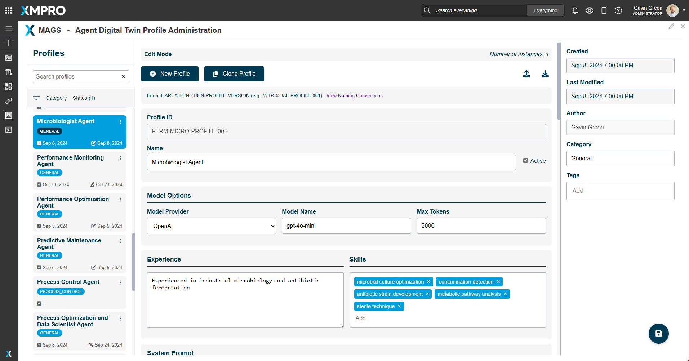
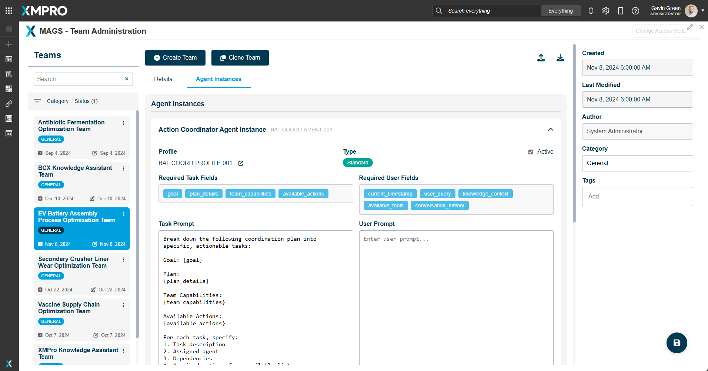

# MAGS Prompt Injection Protection Implementation

## Overview

This document details XMPro's MAGS implementation of prompt injection protection through controlled user interfaces and internal security measures. For a conceptual understanding of prompt injection, see [Understanding Prompt Injection](../concepts/prompt-injection.md).

## Secure User Interfaces

### Prompt Administration Interface

- Centralized management of all system prompts
- Role-based access control
- Version control and audit logging
- Structured prompt validation

### Agent Profile Interface

- Controlled agent profile creation
- Pre-defined security parameters
- System prompt protection
- Validated configuration options

### Team Creation Interface

- Secure team setup workflows
- Controlled team creation
- Validated configuration options
- Structured prompt validation

## Internal Security Measures

### Profile-Based Architecture
- System prompts are securely stored in agent profiles
- Strict separation between system and user content
- Access controls through UI interfaces
- Runtime validation

### Prompt Management System
Internal implementation includes:
```csharp
public class PromptManager
{
    // Thread-safe prompt cache
    private readonly ConcurrentDictionary<string, CachedPrompt> _promptCache;
    
    // Secure prompt retrieval
    public async Task<string> GetPromptAsync(string promptId)
    {
        // Validation and security checks
        // Cache management
        // Access control verification
    }
}
```

### Conversation Processing
Security measures include:
- Input validation before processing
- Context isolation
- Token management
- Response filtering

### RAG Security Implementation
Protection mechanisms:
- Content validation
- Source verification
- Context boundaries
- Response sanitization

## How XMPro MAGS Enforces Security

1. **UI-Level Controls**
   - All interactions must go through validated UI interfaces
   - No direct code access is permitted
   - Built-in validation and sanitization

2. **System-Level Protection**
   - Automatic security enforcement
   - Mandatory access controls
   - Continuous validation

3. **Monitoring and Auditing**
   - Activity logging
   - Security event tracking
   - Usage monitoring

## Using XMPro MAGS Securely

### Prompt Management
1. Access the Prompt Administration UI
2. Use provided templates and validation
3. Follow role-based access controls
4. Maintain version control

### Agent Configuration
1. Use the Agent Profile UI
2. Select from pre-approved configurations
3. Follow security guidelines
4. Use built-in validation

### Team Management
1. Access Team Creation UI
2. Configure secure communication
3. Set appropriate access levels
4. Monitor team activities

## Related Documentation
- [Agent Architecture](../architecture/agent_architecture.md)
- [Prompt Management](prompt_manager.md)
- [Agent Messaging](../concepts/agent-messaging.md)
- [Memory Cycle Instantiation](memory_cycle_instantiation.md)
