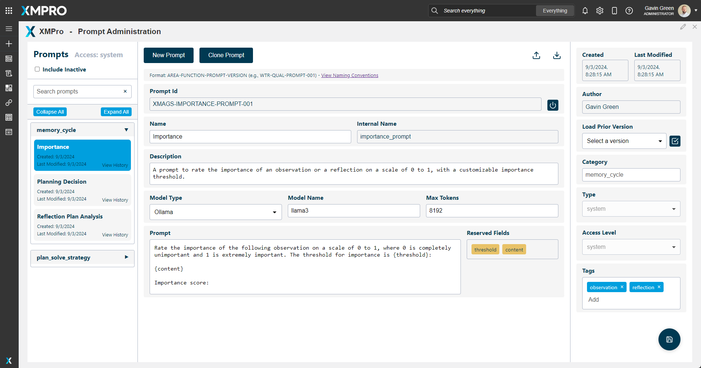
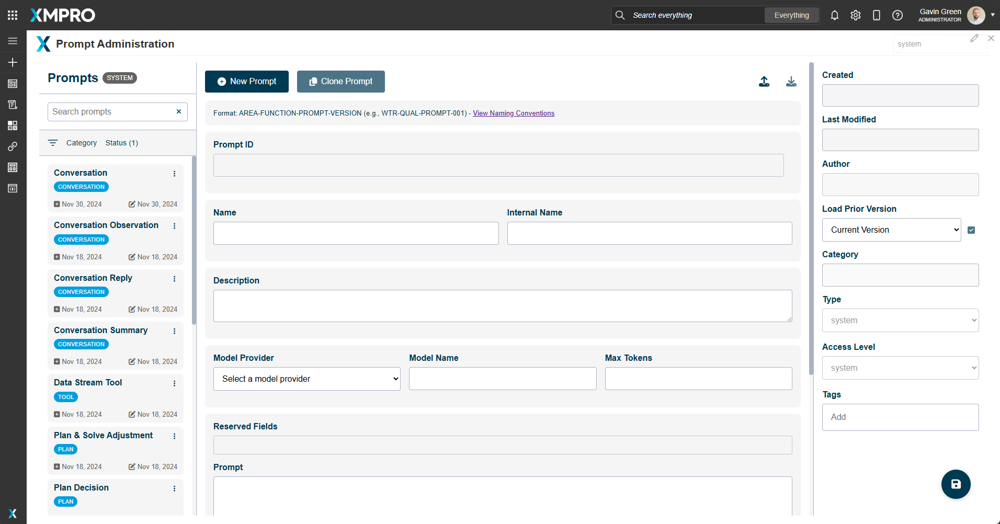
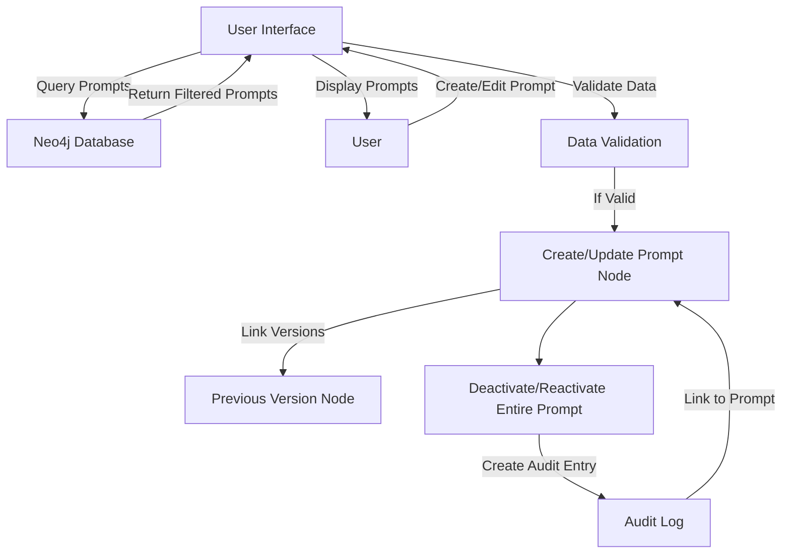

# Prompt Management System Documentation

The Prompt Library is a centralized repository for all prompts in the system. It provides a structured way to organize, manage, and access prompts.

## Table of Contents
1. [Introduction](#introduction)
2. [Features](#features)
3. [System Prompt Id Structure](#system-prompt-id-structure)
4. [Fields](#fields)
5. [User Interface](#user-interface)
6. [Functionality](#functionality)
   - [Initialization](#initialization)
   - [Audit History](#audit-history)
   - [Prompt Management](#prompt-management)
   - [Search and Filter](#search-and-filter)
   - [Version Control](#version-control)
7. [Modes of Operation](#modes-of-operation)
8. [Data Flow](#data-flow)
9. [Prompt Management Taxonomies](#prompt-management-taxonomies)
   - [Access Levels](#access-levels)
   - [Category Types](#category-types)
   - [Prompt Types](#prompt-types)
10. [Root Node](#root-node)

## Introduction
The Prompt Management System is a web-based application designed to create, manage, and version control AI prompts. It provides a user-friendly interface for prompt engineers and administrators to efficiently handle a large number of prompts used in various AI applications.

## Features

1. **Access Control**: Different levels of access (system, admin, restricted, user) to manage permissions.
2. **Audit History**: Tracks changes made to prompts over time.
3. **Categorization**: Prompts can be organized into categories for easy management.
4. **Cloning**: Users can clone existing prompts to create new ones quickly.
5. **Import/Export**: Functionality to import or export prompts as JSON files.
6. **Model Type Selection**: Users can specify the AI model type for each prompt.
7. **Prompt Activation/Deactivation**: Ability to activate or deactivate specific prompt versions or entire prompt (all versions).
8. **Prompt Creation and Editing**: Users can create new prompts or edit existing ones.
9. **Search Functionality**: Users can search for prompts based on names, tags, or content.
10. **Tagging System**: Prompts can be tagged for better organization and searchability.
11. **Version Control**: The system maintains a version history for each prompt, allowing users to track changes over time.

## System Prompt Id Structure

Structure: `XMAGS-[Process]-PROMPT-[Version]`

Example: `XMAGS-OBS-PROMPT-001`

Components:
- XMAGS: Fixed identifier for the Multi-Agent System
- [Process]: The specific cognitive process (OBS, REF, PLAN, ACT)
- PROMPT: Fixed identifier for Prompt type
- [Version]: A numeric version identifier

### Examples

| Prompt Purpose     | Prompt ID             | Breakdown                                                                     |
|--------------------|------------------------|-------------------------------------------------------------------------------|
| Action Prompt      | XMAGS-ACT-PROMPT-001  | XMAGS: Multi-Agent System ACT: Action PROMPT: Type 001: Version      |
| Observation Prompt | XMAGS-OBS-PROMPT-001  | XMAGS: Multi-Agent System OBS: Observation PROMPT: Type 001: Version |
| Planning Prompt    | XMAGS-PLAN-PROMPT-001 | XMAGS: Multi-Agent System PLAN: Planning PROMPT: Type 001: Version   |
| Reflection Prompt  | XMAGS-REF-PROMPT-001  | XMAGS: Multi-Agent System REF: Reflection PROMPT: Type 001: Version  |

### Fields

| Field Name         | Type             | Description                                        | Expanded Rationale                                                                                                                                                                                                                                    |
|--------------------|------------------|----------------------------------------------------|-------------------------------------------------------------------------------------------------------------------------------------------------------------------------------------------------------------------------------------------------------|
| access_level       | String           | Indicates who can use or modify this prompt        | Useful for implementing access control. In a multi-user or organization setting, this allows for restricting sensitive prompts to certain user groups or individuals, enhancing security and privacy.                                                 |
| active             | Boolean          | Indicates if the prompt is currently in use        | Allows for easy filtering of current vs. archived prompts. This is particularly useful in large systems where prompts may be deprecated but kept for historical reasons. It simplifies queries for active prompts.                                    |
| author             | String           | The creator of the prompt                          | Important for attribution and accountability. In a multi-user system, this allows tracking who created which prompts, which can be useful for quality control, performance evaluation, and giving credit where it's due.                              |
| category           | String           | The general category or type of the prompt         | Allows for easier organization and retrieval of prompts. This can be used to group similar prompts together, making it easier for users to find relevant prompts for their needs. It also allows for analysis of prompt performance by category.      |
| created_date       | DateTime         | Date and time the prompt was created               | Useful for tracking the prompt's lifecycle. This timestamp helps in auditing, allows for chronological sorting of prompts, and can be used to analyze prompt creation patterns over time.                                                             |
| description        | String           | A brief explanation of the prompt's purpose        | Provides context without having to read the full prompt. This helps users quickly understand what a prompt does without needing to interpret the prompt text itself. It's particularly useful in large prompt libraries.                              |
| internal_name      | String           | A code-friendly name for backend use               | This internal name is used code, queries, and other backend operations where a simplified, consistent naming format is beneficial.                                                                                                                    |
| last_modified_date | DateTime         | Date and time of the last modification             | Important for tracking changes and auditing. This helps identify which prompts have been recently updated, which is crucial for version control and ensuring users are working with the most up-to-date prompts.                                      |
| last_used_date     | DateTime         | Date the prompt was last utilized                  | Useful for identifying outdated or frequently used prompts. This can help in maintenance tasks, such as archiving old prompts or prioritizing the review of frequently used ones. It can also be used to analyze usage patterns over time.            |
| max_tokens         | Integer          | Maximum number of tokens allowed for this prompt   | Defines the upper limit of tokens for the prompt response. This is crucial for controlling the length and complexity of AI-generated content, managing computational resources, and ensuring responses fit within model constraints.                |
| model_name         | String           | The specific AI model this prompt is optimized for | Provides more granular information about model compatibility. This allows for fine-tuned optimization of prompts for specific models, which can be crucial for achieving the best performance.                                                        |
| model_provider         | String           | The provider of the AI model this prompt is designed for   | Ensures prompts are used with compatible model architectures. This is crucial for maintaining prompt effectiveness across different AI systems. It allows for easy filtering of prompts suitable for specific model types.                            |
| name               | String           | A unique, human-readable name for the prompt       | Provides a quick, identifiable reference for the prompt. This makes it easier for users to search for and recognize prompts without needing to read the full prompt text. It also serves as a natural key for ensuring uniqueness across all prompts. |
| prompt             | String           | The actual prompt text                             | Core content of the prompt. This is the main text that will be used to guide the AI's response. It's crucial for the functioning of the system and is what users will primarily interact with.                                                        |
| prompt_id          | String           | Unique identifier for the prompt                   | Essential for referencing specific prompts. This allows for efficient querying and relationship building in the graph database. It's particularly useful when linking prompts to other entities or when tracking prompt versions.                     |
| reserved_fields    | Object/String    | Any reserved fields                                | Useful for storing prompt-specific metadata that doesn't fit into other categories. This flexibility allows for future expansions without changing the node structure. It can store custom attributes that are specific to certain types of prompts.  |
| type               | String           | The type of prompt (e.g., "system", "user")        | Categorizes the prompt's role in the system. This classification is essential for organizing prompts, applying appropriate access controls, and determining how the prompt should be processed or utilized within the AI system's workflows.       |
| tags               | Array of Strings | Relevant tags or keywords                          | Enhances searchability and categorization. Tags provide a flexible way to associate prompts with multiple concepts, making them easier to find. They can also be used for filtering and analyzing trends in prompt creation and usage.                |
| version            | Integer          | Current version number of the prompt               | Helps in tracking the evolution of the prompt. This is crucial for version control, allowing users to understand how many iterations a prompt has gone through and potentially rollback to previous versions if needed. 

## User Interface

The UI is divided into three main sections:
1. **Metadata Panel**: The metadata for the prompt selected.
2. **Prompt Editor**: Form for creating or editing prompts.
3. **Prompt List**: Displays all prompts, organized by categories.

## Functionality

### Initialization
1. Loads necessary scripts (Neo4j driver).
2. Initializes the Neo4j driver with provided credentials.
3. Fetches system options from the database.
4. Loads all prompts and populates the prompt list.
5. Sets up event listeners for various UI elements.

### Audit History
- The system maintains an audit log when an entire prompt is made inactive or reactivated.
- Users can view the audit history for each prompt.

#### Audit Entry Properties

Each AuditEntry node contains the following information:

- `change`: Description of the action or change made (e.g., "Deactivated prompt")
- `user`: The user who performed the action
- `timestamp`: The date and time when the action occurred

#### Example Audit Log Entries

Here are some example audit log entries from the system:

1. Deactivation of a prompt:
   - Change: "Deactivated prompt"
   - User: "Sam Johnson"
   - Timestamp: 2024-09-01 15:04:35.284

2. Earlier deactivation of the same prompt:
   - Change: "Deactivated prompt"
   - User: "Sam Johnson"
   - Timestamp: 2024-09-01 15:02:30.304

3. Initial deactivation of the prompt:
   - Change: "Deactivated prompt"
   - User: "Sam Johnson"
   - Timestamp: 2024-09-01 15:01:21.827

### Prompt Management

1. **Creating a New Prompt**:
   - User clicks "New Prompt" button.
   - Form is cleared and set to new mode.
   - User fills in prompt details.
   - System generates a unique Prompt Id.
   - User saves the prompt, which is then stored in the database.

2. **Editing an Existing Prompt**:
   - User selects a prompt from the list.
   - Prompt details are loaded into the form.
   - User makes changes and saves.
   - A new version of the prompt is created in the database marked as active, and the prior prompt marked as inactive.

3. **Cloning a Prompt**:
   - User selects a prompt and clicks "Clone Prompt".
   - A copy of the prompt is created with a new Id.
   - User can modify the cloned prompt before saving.

4. **Activating/Deactivating Prompts**:
   - User can activate or deactivate entire prompts, including all their prior versions to make them inactive or active as required.
   - This changes the 'active' status in the database.

5. **Importing/Exporting Prompts**:
   - Prompts can be exported as JSON files.
   - JSON files can be imported to create new prompts.

### Search and Filter
- Users can search prompts by name, tags.
- Prompts can be filtered by category.
- Option to include or exclude inactive prompts in the list.

### Version Control
- Each edit creates a new version of the prompt.
- Users can view and activate prior versions of a prompt.

## Modes of Operation

1. **Clone Mode**: Similar to edit mode, but creates a new prompt based on an existing one.
2. **Edit Mode**: Activated when creating editing an existing one. Most fields become editable.
2. **New Mode**: Activated when creating a new prompt. Fields become editable.

## Data Flow

## Prompt Management Taxonomies

### Access Levels

| Level      | Description                                                                                   |
| ---------- | --------------------------------------------------------------------------------------------- |
| admin      | For system administrators with full access to all prompts                                      |
| restricted | For sensitive prompts that require special permission to access                                |
| system     | For core system prompts essential for the functioning of the MAGs memory cycle implementation  |
| user       | For regular users of the system                                                                |

The Prompt Library implements a role-based access control system with four levels: system, admin, restricted, and user. Each level has different permissions and capabilities within the system.

#### Access Level Permissions Table

| Feature                     | System | Admin | Restricted | User |
|-----------------------------|--------|-------|------------|------|
| View all prompts            | ✓      | ✓     | ✗          | ✗    |
| Create new prompts          | ✓      | ✓     | ✓          | ✓    |
| Edit own prompts            | ✓      | ✓     | ✓          | ✓    |
| Edit others' prompts        | ✗      | ✓     | ✗          | ✗    |
| Delete prompts              | ✗      | ✗     | ✗          | ✗    |
| Activate/Deactivate prompts | ✓      | ✓     | ✓          | ✓    |
| View audit history          | ✓      | ✓     | ✓          | ✓    |
| Import/Export prompts       | ✓      | ✓     | ✓          | ✓    |
| Clone prompts               | ✓      | ✓     | ✓          | ✓    |
| Manage system prompts       | ✓      | ✗     | ✗          | ✗    |
| Change prompt access level  | ✓      | ✓     | ✗          | ✗    |
| View restricted prompts     | ✗      | ✓     | ✓          | ✗    |

### Category Types

| Type                 | Description                                   |
| -------------------- | --------------------------------------------- |
| conversation         | For the conversation functionality            |
| memory_cycle         | For core memory_cycle functionality           |
| plan_solve_strategy  | For the plan and solve strategy functionality |
| team_creation_wizard | For the team wizard functionality             |
| user_defined         | Defaults to for storing user prompts                      |

### Prompt Types

| Type           | Description                                                                     |
| -------------- | ------------------------------------------------------------------------------- |
| analysis       | For prompts designed to analyze or interpret data or text                        |
| classification | For prompts that categorize or label input                                       |
| dialogue       | For prompts used in conversational or interactive contexts                       |
| extraction     | For prompts designed to extract specific information from text                   |
| generation     | For prompts focused on generating new content or ideas                           |
| system         | For core system functionality                                                    |
| task-specific  | For prompts designed for particular tasks within the application                 |
| template       | For base prompts that can be customized or extended for specific use cases       |
| user           | For prompts created or customized by users                                       |
| utility        | For helper prompts that support other processes but aren't main functionalities  |

## Root Node
There is a root node called Library (type: `prompt`) to which all prompts are linked.  The reasons for this are:

1. Organization: It provides a clear organizational structure, making it easier to manage and understand the relationship between prompts.

2. Querying: While it adds one more hop in some queries, it makes it much easier to perform operations on all prompts (e.g., finding all prompts, updating properties across all prompts).

3. Consistency: Having a root node allows you to enforce consistent properties or relationships across all prompts more easily.

4. Scalability: As your prompt library grows, having a root node will make it easier to manage and maintain the structure.

5. Flexibility: You can still easily query individual prompts, and the added structure doesn't significantly impact performance for most use cases.

