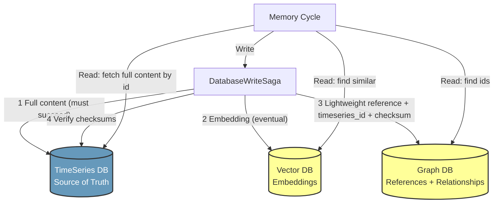
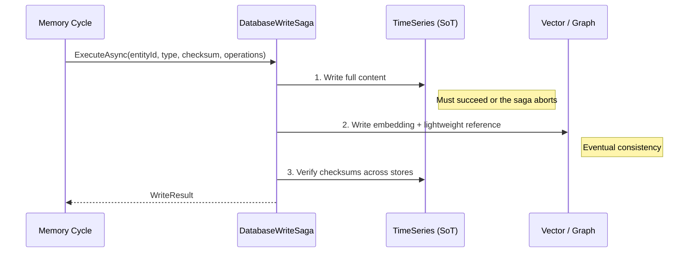

# TimeSeries Storage & Hybrid Database Architecture

## Overview

XMPro MAGS uses a **three-database hybrid architecture**. Each store is optimized for the job it does best, and a single logical record (a memory, a conversation entry, a decision, a plan) is split across them:

1. **TimeSeries DB** (TimescaleDB, or InfluxDB 3) — the **source of truth** for all temporal, content-bearing data.
2. **Vector DB** (Milvus, Qdrant, MongoDB Atlas) — semantic embeddings for similarity search.
3. **Graph DB** (Neo4j, Memgraph, Cosmos DB Gremlin, Neptune) — lightweight references and the relationships between records.

This replaced the earlier dual-store model (Graph + Vector) in which the graph database held the full content of every memory, conversation, and plan. Under the hybrid model the graph holds only a **thin reference node** — an id, a type, a timestamp, a `timeseries_id`, and a `checksum` — while the heavy content (prompts, responses, summaries, PDDL, token metrics) lives in the TimeSeries database.

> **If you have code or documentation that reads agent content directly out of the graph database, it needs updating.** Graph nodes no longer carry `prompt`, `response`, `reply`, `key_points`, PDDL, or metric fields. See [Retrieving Content](#retrieving-content) below.

## Why This Split

| Concern | Store | Reason |
|---------|-------|--------|
| Full content + metrics + audit history | TimeSeries | Purpose-built for high-volume, time-ordered writes; automatic partitioning by time; compression; time-bucketed analytics |
| "Which memories are similar to this?" | Vector | Approximate nearest-neighbour search over embeddings |
| "What is related to what?" / traversal | Graph | Relationship queries, conversation threading, plan → task → action hierarchies |

Keeping the graph lightweight keeps traversals fast and the graph small, while the TimeSeries database absorbs the write volume and long-term retention.

## Architecture



## What Is Stored Where

### TimeSeries DB (source of truth)

All content-bearing, temporal records. Tables follow the `mags_<domain>_<type>` naming convention:

| Table | Purpose |
|-------|---------|
| `mags_memory_records` | Observations and reflections (summary, key points, actionable insights, significance & confidence scores, token metrics) |
| `mags_conversation_summaries` | Rolling conversation summaries (Tier 1 memory) |
| `mags_conversation_entries` | Agent-to-agent and agent-to-user conversation turns (prompt, reply, response, summary, user query) |
| `mags_decision_records` | All decision types (planning, communication, consensus) |
| `mags_planning_entries` | Planning-step LLM interactions |
| `mags_plan_artifacts` | Complete plan documents (PDDL) |
| `mags_plan_tasks` | Individual plan tasks |
| `mags_plan_actions` | Plan action definitions |
| `mags_tool_artifacts` | Tool-usage summaries (input, result, metrics) |
| `mags_tool_attempts` | Individual tool-execution attempts |
| `mags_tool_llm_calls` | LLM calls made during tool execution |
| `mags_plan_audit_log` | Audit trail for plan/task changes |
| `mags_sbom_records` | Software Bill of Materials |
| `mags_objective_function_switching_entries` | Objective-function switching events |
| `mags_repair_queue` | Saga-pattern repair tracking |

Every table has `time TIMESTAMPTZ NOT NULL` as its first column (the hypertable dimension), a composite `PRIMARY KEY (<id>, time)`, and a `checksum` column for cross-database integrity verification.

### Vector DB

Semantic embeddings only, split into agent-specific and general-knowledge collections. See [Vector Database](vector_database.md).

### Graph DB

Lightweight reference nodes and relationships. A typical node carries:

```
id / entry_id     — the record identifier (also the join key into TimeSeries)
type              — Memory | Conversation | Decision | Plan | Task | Action | ...
created_date
timestamp
timeseries_id     — join key into the TimeSeries table
checksum          — for integrity verification against the TimeSeries copy
```

Relationships are preserved in the graph exactly as before — `PARTICIPATED_IN`, `HAS_ENTRY`, `NEXT` (conversation threading), `HAS_TASK`, `HAS_ACTION`, `RELATED_TO`, `MADE`, etc.

### Not stored in TimeSeries

- **Measure / objective / utility-function data** — read-only from external XMPro DataStreams, referenced in the Graph DB.
- **Agent / team / profile configuration** — static configuration in the Graph DB.
- **Relationships** — Graph DB.
- **Embeddings** — Vector DB.

## The Write Path — Saga Pattern

Writes that span more than one store go through `DatabaseWriteSaga`, which enforces ordering and consistency:



1. **TimeSeries first.** The source-of-truth write must succeed; if it fails the operation aborts.
2. **References second.** The embedding (Vector) and the lightweight reference node (Graph) are written, carrying the same `checksum`.
3. **Verify.** Checksums are compared across stores. Failures are queued in `mags_repair_queue` for the self-healing subsystem to reconcile.

TimeSeries-only records (no graph relationship needed) are written directly rather than through the saga.

## Retrieving Content

Because content moved out of the graph, retrieval is a **two-step, hybrid** operation:

1. Find the relevant **ids** — either by traversing relationships in the Graph DB, or by similarity search in the Vector DB.
2. Fetch the **full content** from the TimeSeries DB using those ids.

For many read patterns you can skip the graph entirely and query TimeSeries directly, because the TimeSeries tables carry the natural foreign keys (`conversation_id`, `agent_id`, `memory_id`).

### Example — a full conversation

Direct from TimeSeries (simplest):

```sql
SELECT entry_id, prompt, reply, response, summary, user_query,
       total_token_usage, response_time, time
FROM mags_conversation_entries
WHERE conversation_id = :conversation_id
ORDER BY time ASC;
```

If you need the exact threaded order or related artifacts, get the ordered `entry_id`s from the graph first:

```cypher
MATCH (c:Artifact {type: 'Conversation', id: $conversationId})-[:HAS_ENTRY]->(start:Entry)
MATCH path = (start)-[:NEXT*0..]->(e:Entry)
RETURN e.entry_id AS entry_id, e.summary AS summary, e.timestamp AS timestamp
ORDER BY e.timestamp ASC
```

…then fetch content from `mags_conversation_entries` by `entry_id`.

### Example — an observation or reflection

The graph `Memory` node gives you only `id`, `type`, `timeseries_id`, `checksum`. Fetch the content from TimeSeries:

```sql
SELECT memory_id, memory_type, summary, key_points, actionable_insights,
       importance, surprise, confidence_score, total_token_usage, time
FROM mags_memory_records
WHERE memory_id = :memory_id;
```

### Example — a plan

Graph holds the plan → task → action hierarchy with `timeseries_id` on each node; the PDDL and full task/action detail come from `mags_plan_artifacts`, `mags_plan_tasks`, and `mags_plan_actions` keyed by those ids.

### Optional: REST access via PostgREST

The TimescaleDB deployment ships with a [PostgREST](https://postgrest.org/) container that exposes an `api` schema over HTTP. **The `mags_*` tables live in the `public` schema and are not exposed by default.** To expose a read path, create a view in the `api` schema and grant access to the appropriate role:

```sql
CREATE VIEW api.conversation_entries AS
SELECT entry_id, conversation_id, agent_id, prompt, reply, response, summary, time
FROM public.mags_conversation_entries;

GRANT SELECT ON api.conversation_entries TO webuser;
```

PostgREST then serves it:

```
GET /conversation_entries?conversation_id=eq.{conversationId}&order=time.asc
```

See the [TimescaleDB deployment README](../installation/docker/src/timescaledb/timescaledb_readme.md) for PostgREST setup, roles, and SSL.

## Configuration

TimeSeries connection settings live alongside the other database settings in the agent configuration:

```json
{
  "timeseries": {
    "type": "timescaledb",
    "host": "localhost",
    "port": 5432,
    "database": "mags_timeseries",
    "username": "postgres",
    "password": "your_password",
    "connectionPoolSize": 10,
    "commandTimeout": 15,
    "connectionTimeout": 15,
    "sslMode": "Prefer"
  }
}
```

| Parameter | Default | Description |
|-----------|---------|-------------|
| `type` | `timescaledb` | `timescaledb` or `influxdb3` |
| `host` / `port` | `localhost` / `5432` | Database endpoint |
| `database` | `mags_timeseries` | Database name |
| `connectionPoolSize` | `10` | Maximum pooled connections |
| `commandTimeout` | `15` | Command timeout (seconds) |
| `connectionTimeout` | `15` | Connection timeout (seconds) |
| `sslMode` | `Prefer` | `Disable` \| `Allow` \| `Prefer` \| `Require` \| `VerifyCA` \| `VerifyFull` |

The schema (tables, hypertables, indexes, and the repair queue) is created automatically on startup via `InitializeSchemaAsync()`. Tables are created with `IF NOT EXISTS`, so startup is idempotent.

## Storage Management

MAGS deliberately **does not delete data automatically** — complete audit trails are required for decision provenance, forensic analysis, and compliance. Storage is managed with TimescaleDB features instead:

- **Compression** (recommended) — compress older chunks for 90 %+ storage savings while keeping the data queryable. High-volume tables (memory, conversation, tool attempts/calls) compress after a few days; audit and SBOM after 90 days.
- **Continuous aggregates** — pre-computed daily/hourly rollups for analytics, so dashboards don't scan raw data.
- **Partitioning** — TimescaleDB partitions each hypertable by time automatically.
- **Retention policies** — supported but **off by default**, because deletion breaks audit continuity. Only enable if you are legally required to delete data.

The [TimescaleDB deployment README](../installation/docker/src/timescaledb/timescaledb_readme.md) contains the concrete compression, aggregate, retention, backup, and monitoring commands.

## Related Documentation

- [Memory Cycle](memory_cycle.md) — how observations, reflections, and plans flow through the stores
- [Agent Messaging Protocol](../concepts/agent-messaging.md) — retrieving content after a message response
- [Vector Database](vector_database.md) — the embedding store
- [TimescaleDB Deployment](../installation/docker/src/timescaledb/timescaledb_readme.md) — installation, PostgREST, storage operations
