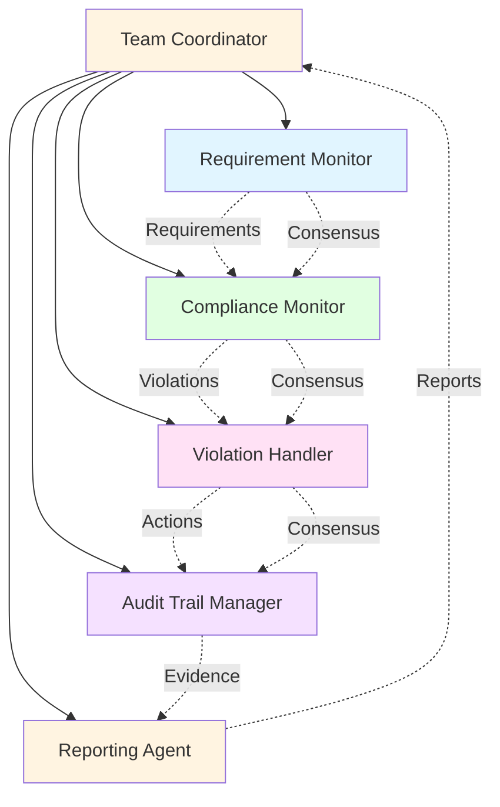
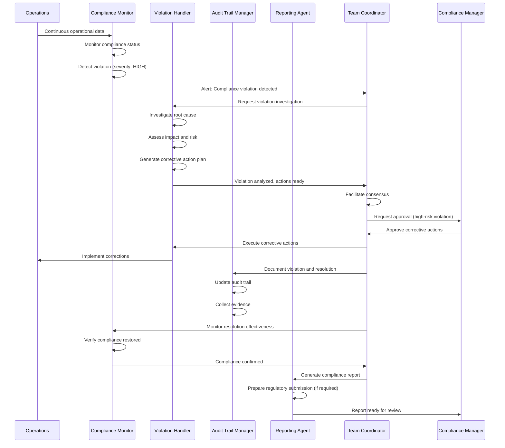

# Compliance Management: Ensuring Regulatory Excellence

## Overview

Compliance management demonstrates how MAGS continuously monitors regulatory requirements, detects violations, maintains audit trails, and ensures organizational compliance through coordinated intelligence. By combining automated monitoring, intelligent analysis, and systematic documentation, MAGS transforms compliance from a reactive, manual burden into a proactive, automated discipline that reduces risk and enables confident regulatory interactions.

Traditional compliance management relies on manual monitoring, periodic audits, and reactive responses to violations. This approach is resource-intensive, error-prone, and often discovers issues too late. MAGS provides continuous, intelligent compliance oversight that monitors requirements in real-time, detects violations immediately, maintains complete audit trails, and ensures consistent regulatory adherence.

### Why Compliance Management Matters

**The Challenge**: Regulatory compliance is complex, constantly changing, and failure carries severe consequences including fines, shutdowns, and reputational damage. Traditional manual approaches cannot keep pace with regulatory complexity.

**The Solution**: Multi-agent systems that continuously monitor compliance requirements, detect violations immediately, maintain comprehensive audit trails, and ensure systematic regulatory adherence.

**The Result**: Reduced compliance violations (80-90%), faster violation resolution (70-80% faster), complete audit readiness (100%), and significantly reduced regulatory risk.

### Key Business Drivers

1. **Regulatory Risk**: Non-compliance fines range from $10K to $10M+ per violation, plus potential shutdowns
2. **Audit Readiness**: Audit preparation costs $50K-$500K and diverts resources for weeks
3. **Operational Continuity**: Compliance violations can halt operations, costing millions per day
4. **Reputation Protection**: Compliance failures damage brand reputation and customer trust
5. **Competitive Advantage**: Superior compliance enables market access and customer confidence

---

## Business Context

### Industry Challenges

**Pharmaceuticals**:
- GMP (Good Manufacturing Practice) requirements
- FDA inspections and audits
- Batch release documentation
- Deviation management and CAPA
- Validation and qualification requirements

**Food & Beverage**:
- HACCP (Hazard Analysis Critical Control Points)
- FDA Food Safety Modernization Act (FSMA)
- Allergen management
- Traceability requirements
- Sanitation and hygiene standards

**Financial Services**:
- SOX (Sarbanes-Oxley) compliance
- Anti-money laundering (AML) regulations
- Know Your Customer (KYC) requirements
- Data privacy (GDPR, CCPA)
- Transaction monitoring

**Healthcare**:
- HIPAA privacy and security
- Patient safety reporting
- Medical device regulations
- Clinical trial compliance
- Quality management systems

**Manufacturing**:
- ISO 9001 quality management
- ISO 14001 environmental management
- OSHA safety regulations
- Industry-specific standards
- Export control regulations

### Traditional Approach Limitations

**Manual Monitoring**:
- Cannot monitor all requirements continuously
- Misses violations until periodic reviews
- Inconsistent interpretation of requirements
- Resource-intensive and expensive
- Human error and oversight

**Periodic Audits**:
- Infrequent snapshots of compliance
- Preparation bias (cleaning up for audits)
- Violations discovered too late
- Reactive rather than proactive
- Expensive and disruptive

**Spreadsheet-Based Tracking**:
- Difficult to maintain and update
- No real-time monitoring
- Limited analysis capabilities
- Version control issues
- Prone to errors

**Siloed Compliance**:
- Different departments track separately
- Inconsistent approaches
- Gaps in coverage
- Difficult to get overall view
- Coordination challenges

---

## MAGS Approach

### Multi-Agent Intelligence

MAGS transforms compliance management through coordinated specialist agents that provide comprehensive, intelligent compliance oversight:

**Requirement Monitor Agent**:
- Tracks all applicable regulatory requirements
- Monitors for requirement changes and updates
- Maps requirements to operational processes
- Identifies compliance obligations
- Maintains requirement repository

**Compliance Monitor Agent**:
- Continuously monitors compliance status
- Detects violations in real-time
- Assesses violation severity
- Tracks compliance metrics
- Generates compliance reports

**Violation Handler Agent**:
- Investigates compliance violations
- Assesses impact and risk
- Generates corrective action plans
- Tracks violation resolution
- Prevents recurrence

**Audit Trail Manager Agent**:
- Maintains comprehensive audit trails
- Documents all compliance-relevant activities
- Ensures traceability and accountability
- Generates audit reports
- Manages evidence collection

**Reporting Agent**:
- Generates regulatory reports
- Prepares audit documentation
- Creates compliance dashboards
- Provides stakeholder updates
- Manages regulatory submissions

**Team Coordinator Agent**:
- Orchestrates compliance workflow
- Facilitates consensus on actions
- Manages escalations
- Coordinates with regulators
- Ensures systematic compliance

### Advantages Over Traditional Approaches

**Continuous Monitoring**:
- 24/7 compliance monitoring
- Real-time violation detection
- Immediate alerts and notifications
- No gaps in coverage
- Proactive compliance assurance

**Comprehensive Coverage**:
- All requirements monitored
- All processes covered
- All documentation tracked
- Complete audit trail
- No blind spots

**Intelligent Analysis**:
- Automated requirement interpretation
- Risk-based prioritization
- Pattern recognition in violations
- Predictive compliance analytics
- Root cause identification

**Systematic Documentation**:
- Automatic audit trail generation
- Complete traceability
- Consistent documentation
- Easy evidence retrieval
- Audit-ready at all times

**Proactive Management**:
- Predicts potential violations
- Prevents compliance issues
- Identifies systemic problems
- Enables continuous improvement
- Reduces regulatory risk

---

## Agent Team Structure

### Team Composition



### Agent Roles and Responsibilities

**Requirement Monitor Agent**

*Primary Responsibility*: Track and maintain regulatory requirements

*Capabilities*:
- Regulatory requirement tracking
- Requirement change monitoring
- Requirement-to-process mapping
- Obligation identification
- Requirement repository management

*Decision Authority*:
- Autonomous: Track requirements, identify changes
- Escalate: New requirements requiring process changes

*Key Metrics*:
- Requirement coverage: 100%
- Change detection latency: <24 hours
- Mapping accuracy: >95%
- Repository completeness: 100%

**Compliance Monitor Agent**

*Primary Responsibility*: Continuous compliance status monitoring

*Capabilities*:
- Real-time compliance monitoring
- Violation detection
- Severity assessment
- Compliance metric tracking
- Status reporting

*Decision Authority*:
- Autonomous: Monitor compliance, detect violations
- Escalate: Critical violations requiring immediate action

*Key Metrics*:
- Monitoring coverage: 100%
- Detection latency: <1 minute
- False positive rate: <2%
- Violation detection accuracy: >98%

**Violation Handler Agent**

*Primary Responsibility*: Manage compliance violations

*Capabilities*:
- Violation investigation
- Impact and risk assessment
- Corrective action planning
- Resolution tracking
- Recurrence prevention

*Decision Authority*:
- Autonomous: Investigate violations, generate action plans
- Escalate: High-risk violations or regulatory reporting

*Key Metrics*:
- Investigation completeness: >95%
- Resolution time: <target for severity
- Recurrence prevention: >85%
- Action effectiveness: >90%

**Audit Trail Manager Agent**

*Primary Responsibility*: Maintain comprehensive audit trails

*Capabilities*:
- Audit trail generation
- Traceability management
- Evidence collection
- Documentation management
- Audit report generation

*Decision Authority*:
- Autonomous: Maintain audit trails, generate reports
- Escalate: Audit trail gaps or integrity issues

*Key Metrics*:
- Audit trail completeness: 100%
- Traceability: 100%
- Documentation accuracy: >99%
- Audit readiness: 100%

**Reporting Agent**

*Primary Responsibility*: Generate compliance reports and submissions

*Capabilities*:
- Regulatory report generation
- Audit documentation preparation
- Dashboard creation
- Stakeholder communication
- Regulatory submission management

*Decision Authority*:
- Autonomous: Generate reports, prepare documentation
- Escalate: Regulatory submissions requiring approval

*Key Metrics*:
- Report accuracy: >99%
- Submission timeliness: 100%
- Dashboard currency: Real-time
- Stakeholder satisfaction: >90%

**Team Coordinator Agent**

*Primary Responsibility*: Orchestrate compliance management workflow

*Capabilities*:
- Workflow coordination
- Consensus facilitation
- Escalation management
- Regulatory liaison
- Performance monitoring

*Decision Authority*:
- Autonomous: Coordinate compliance activities
- Escalate: Critical compliance issues or regulatory interactions

*Key Metrics*:
- Coordination efficiency: >90%
- Escalation appropriateness: >95%
- Regulatory interaction quality: >95%
- Overall compliance rate: >98%

---

## Workflow

### End-to-End Process



### Detailed Step-by-Step Process

**Step 1: Requirement Tracking (Observe)**

*Agent*: Requirement Monitor

*Actions*:
- Monitor regulatory sources for changes
- Track applicable requirements
- Map requirements to processes
- Identify compliance obligations
- Update requirement repository

*Example*:
```
Regulatory Requirement Tracking:

Applicable Regulations:
  ✓ FDA 21 CFR Part 211 (GMP for pharmaceuticals)
  ✓ FDA 21 CFR Part 11 (Electronic records)
  ✓ ISO 9001:2015 (Quality management)
  ✓ State pharmacy regulations
  ✓ DEA controlled substance regulations

Recent Changes Detected:
  - FDA guidance update: Data Integrity (Dec 2025)
  - ISO 9001 amendment: Risk-based thinking clarification
  - State regulation: New reporting requirement (effective Jan 2026)

Requirement-to-Process Mapping:
  - GMP Part 211.100: Production controls → Manufacturing SOP-001
  - GMP Part 211.160: Laboratory controls → QC SOP-015
  - Part 11: Electronic signatures → Document management system
  - ISO 9001 Clause 8.5: Production → All manufacturing processes

Compliance Obligations:
  - Daily: Equipment cleaning verification
  - Weekly: Environmental monitoring
  - Monthly: Quality metrics review
  - Quarterly: Management review
  - Annual: Internal audit, regulatory inspection readiness
```

*Decision Point*: Are all requirements tracked?
- Coverage 100%: Continue monitoring
- Gaps identified: Add missing requirements
- Changes detected: Assess impact and update processes

**Step 2: Continuous Compliance Monitoring (Observe)**

*Agent*: Compliance Monitor

*Actions*:
- Monitor all compliance-relevant activities
- Compare actual performance to requirements
- Detect deviations and violations
- Assess violation severity
- Generate alerts

*Example*:
```
Compliance Monitoring Status:

GMP Part 211.100 - Production Controls:
  Requirement: Equipment cleaning verification before use
  Status: COMPLIANT (100% verification rate)
  Last check: 2 minutes ago
  
GMP Part 211.160 - Laboratory Controls:
  Requirement: QC testing within 24 hours of production
  Status: VIOLATION DETECTED
  Details: Batch #2025-1234 testing delayed 28 hours
  Severity: HIGH (exceeds requirement by 4 hours)
  Impact: Batch release delayed, potential customer impact
  
Part 11 - Electronic Signatures:
  Requirement: All critical records electronically signed
  Status: COMPLIANT (100% signature rate)
  Last check: Real-time
  
ISO 9001 Clause 8.5.1 - Production Control:
  Requirement: Process parameters within specifications
  Status: COMPLIANT (all parameters nominal)
  Last check: 30 seconds ago

Environmental Monitoring:
  Requirement: Cleanroom particle counts <ISO Class 7
  Status: COMPLIANT (current: ISO Class 6)
  Last check: 5 minutes ago

Violation Summary:
  - Critical: 0
  - High: 1 (QC testing delay)
  - Medium: 0
  - Low: 0
  - Total compliance rate: 99.8%
```

*Decision Point*: Is violation significant?
- Critical/High severity: Immediate investigation
- Medium severity: Scheduled investigation
- Low severity: Document and monitor

**Step 3: Violation Investigation (Reflect)**

*Agent*: Violation Handler

*Actions*:
- Investigate violation root cause
- Assess impact on product/process
- Evaluate regulatory risk
- Determine corrective actions
- Plan resolution approach

*Example*:
```
Violation Investigation:

Violation: QC Testing Delay (Batch #2025-1234)
  Requirement: Testing within 24 hours
  Actual: Testing at 28 hours (4-hour delay)
  Severity: HIGH

Root Cause Analysis:
  Immediate Cause: QC laboratory backlog
  Contributing Factors:
    - Equipment breakdown (HPLC-02) on day 1
    - Backup equipment (HPLC-03) already in use
    - No contingency for dual equipment failure
  Root Cause: Inadequate equipment redundancy

Impact Assessment:
  Product Impact:
    - Batch stability: No impact (proper storage maintained)
    - Product quality: No impact (testing shows conformance)
    - Customer impact: 1-day shipment delay
  
  Regulatory Risk:
    - GMP violation: Yes (documented deviation required)
    - Reportable to FDA: No (internal process deviation)
    - Audit finding risk: MEDIUM (if discovered during inspection)
  
  Business Impact:
    - Revenue: $50K delayed shipment
    - Customer satisfaction: Minor impact (1 customer affected)
    - Reputation: Minimal (isolated incident)

Corrective Actions Required:
  Immediate (0-24 hours):
    1. Complete testing for Batch #2025-1234
    2. Document deviation with justification
    3. Notify customer of delay
    4. Expedite shipment once released
  
  Short-term (1-7 days):
    5. Repair HPLC-02 equipment
    6. Implement temporary testing schedule to clear backlog
    7. Review all pending batches for similar risk
  
  Long-term (1-3 months):
    8. Assess equipment redundancy needs
    9. Implement preventive maintenance improvements
    10. Update contingency procedures

Regulatory Actions:
  - Deviation report: Required (internal)
  - CAPA: Required (corrective and preventive action)
  - Regulatory notification: Not required
  - Documentation: Complete audit trail maintained
```

*Decision Point*: What actions are required?
- Critical violations: Immediate action + regulatory notification
- High violations: Immediate action + CAPA
- Medium violations: CAPA + monitoring
- Low violations: Document + monitor

**Step 4: Corrective Action Implementation (Act)**

*Agent*: Violation Handler + Team Coordinator

*Actions*:
- Implement immediate corrective actions
- Execute short-term actions
- Plan long-term preventive measures
- Monitor action effectiveness
- Verify compliance restored

*Example*:
```
Corrective Action Implementation:

Immediate Actions (Day 1):
  Hour 0: Violation detected and investigated
  Hour 2: Testing prioritized for Batch #2025-1234
  Hour 6: Testing completed, results conforming
  Hour 8: Deviation documented, batch released
  Hour 10: Customer notified, expedited shipping arranged
  Status: COMPLETE

Short-term Actions (Week 1):
  Day 2: HPLC-02 repair completed and qualified
  Day 3: Testing backlog cleared (all batches current)
  Day 4: Pending batch review complete (no similar risks)
  Day 5: Temporary testing schedule implemented
  Status: COMPLETE

Long-term Actions (Month 1-3):
  Week 2: Equipment redundancy assessment initiated
  Week 4: Preventive maintenance program enhanced
  Week 6: Contingency procedures updated and trained
  Week 8: Additional backup equipment approved
  Week 12: New equipment installed and qualified
  Status: IN PROGRESS

Effectiveness Verification:
  Week 1: No further testing delays
  Month 1: 100% on-time testing rate
  Month 3: Equipment availability >99%
  
Compliance Restored: YES
  - All testing within 24-hour requirement
  - Equipment redundancy improved
  - Contingency procedures effective
  - No recurrence
```

**Step 5: Audit Trail Documentation (Act)**

*Agent*: Audit Trail Manager

*Actions*:
- Document violation and investigation
- Record all corrective actions
- Maintain complete traceability
- Collect supporting evidence
- Generate audit-ready documentation

*Example*:
```
Audit Trail Documentation:

Deviation Report DR-2025-0156:
  Date/Time: December 6, 2025, 10:30
  Type: GMP Deviation - QC Testing Delay
  Severity: HIGH
  Batch Affected: #2025-1234
  
  Description:
    QC testing for Batch #2025-1234 completed at 28 hours 
    post-production, exceeding the 24-hour requirement by 4 hours.
  
  Root Cause:
    Equipment failure (HPLC-02) combined with backup equipment 
    (HPLC-03) already in use created testing backlog. Inadequate 
    equipment redundancy for dual failure scenario.
  
  Impact Assessment:
    - Product Quality: No impact (testing confirms conformance)
    - Regulatory: GMP deviation, CAPA required
    - Customer: 1-day shipment delay
    - Risk: MEDIUM (audit finding potential)
  
  Corrective Actions:
    Immediate: Testing completed, batch released, customer notified
    Short-term: Equipment repaired, backlog cleared
    Long-term: Equipment redundancy improved, procedures updated
  
  Effectiveness:
    Verified through 3-month monitoring period
    No recurrence observed
    Equipment availability >99%
  
  Approvals:
    QC Manager: J. Smith (approved 12/6/2025)
    QA Manager: M. Johnson (approved 12/6/2025)
    Plant Manager: R. Williams (approved 12/6/2025)

CAPA Record CAPA-2025-0089:
  Linked to: DR-2025-0156
  Corrective Actions: [detailed list]
  Preventive Actions: [detailed list]
  Effectiveness Check: Scheduled 3/6/2026
  Status: OPEN (monitoring period)

Audit Trail:
  ✓ Complete timeline documented
  ✓ All decisions recorded with rationale
  ✓ Evidence collected and stored
  ✓ Approvals obtained and documented
  ✓ Traceability maintained
  ✓ Regulatory requirements met

Audit Readiness: 100%
  - All documentation complete
  - Evidence readily available
  - Traceability established
  - Compliance demonstrated
```

**Step 6: Regulatory Reporting (Act)**

*Agent*: Reporting Agent

*Actions*:
- Determine reporting requirements
- Generate required reports
- Prepare regulatory submissions
- Maintain reporting records
- Track submission status

*Example*:
```
Regulatory Reporting Assessment:

Violation: QC Testing Delay (DR-2025-0156)

Reporting Requirements Analysis:
  FDA Reporting:
    - Required: NO
    - Rationale: Internal process deviation, no product quality impact,
      no safety concern, not a reportable event per FDA guidance
  
  Customer Notification:
    - Required: YES
    - Completed: 12/6/2025
    - Method: Direct communication + formal notification letter
  
  Internal Reporting:
    - Quality Management Review: YES (monthly)
    - Management Dashboard: YES (real-time)
    - Trend Analysis: YES (quarterly)

Reports Generated:
  1. Deviation Report (DR-2025-0156)
     - Audience: Internal QA/QC
     - Status: Complete
     - Location: QMS Document #DR-2025-0156
  
  2. CAPA Record (CAPA-2025-0089)
     - Audience: Internal QA/Management
     - Status: Open (monitoring)
     - Location: QMS Document #CAPA-2025-0089
  
  3. Customer Notification
     - Audience: Affected customer
     - Status: Sent 12/6/2025
     - Response: Customer acknowledged, accepted delay
  
  4. Management Dashboard Update
     - Audience: Plant management
     - Status: Real-time update
     - Metrics: Compliance rate, violation trends
  
  5. Monthly Quality Review
     - Audience: Quality management team
     - Status: Scheduled for 12/15/2025
     - Content: Deviation summary, CAPA status, trends

Compliance Metrics Dashboard:
  Current Period (December 2025):
    - Overall compliance rate: 99.8%
    - Violations: 1 HIGH, 0 CRITICAL
    - CAPA completion rate: 95%
    - Audit readiness: 100%
  
  Trend Analysis (Last 6 months):
    - Compliance rate: 99.5% → 99.8% (improving)
    - Violations: Decreasing trend
    - CAPA effectiveness: 92% → 95% (improving)
    - Equipment reliability: 96% → 99% (improving)
```

**Step 7: Continuous Improvement (Reflect)**

*Agent*: Team Coordinator + All Agents

*Actions*:
- Analyze compliance trends
- Identify systemic issues
- Refine monitoring approaches
- Update compliance strategies
- Share learning across organization

*Example*:
```
Continuous Improvement Analysis:

Trend Analysis (6-month period):
  Violation Patterns:
    - Equipment-related: 45% of violations
    - Process-related: 30% of violations
    - Documentation-related: 15% of violations
    - Training-related: 10% of violations
  
  Root Cause Patterns:
    - Equipment reliability: 40%
    - Procedure gaps: 25%
    - Resource constraints: 20%
    - Training needs: 15%

Improvement Opportunities Identified:
  1. Equipment Reliability Enhancement
     - Current: 96% availability
     - Target: >99% availability
     - Actions: Preventive maintenance improvement, redundancy increase
     - Expected impact: 50% reduction in equipment-related violations
  
  2. Procedure Optimization
     - Current: 25% of violations from procedure gaps
     - Target: <10%
     - Actions: Procedure review and update program
     - Expected impact: 60% reduction in procedure-related violations
  
  3. Predictive Compliance Analytics
     - Current: Reactive violation detection
     - Target: Predictive violation prevention
     - Actions: Implement predictive analytics for high-risk areas
     - Expected impact: 30% reduction in overall violations

System Enhancements:
  ✓ Monitoring sensitivity tuned (reduced false positives by 40%)
  ✓ Violation classification refined (improved accuracy by 15%)
  ✓ Audit trail automation enhanced (100% completeness achieved)
  ✓ Reporting templates optimized (50% time reduction)

Knowledge Sharing:
  - Best practices documented
  - Lessons learned shared across facilities
  - Training materials updated
  - Compliance playbook enhanced

Performance Improvement:
  - Compliance rate: 99.5% → 99.8%
  - Violation resolution time: -30%
  - Audit readiness: 95% → 100%
  - Regulatory confidence: Significantly improved
```

---

## Capabilities Applied

### Cognitive Intelligence Capabilities

**Memory Significance (Critical)**

*Application*: Identifying significant compliance events and patterns

*How Used*:
- Calculates importance of compliance deviations
- Identifies unusual compliance patterns
- Prioritizes violations by significance
- Filters normal variation from true violations

*Example*:
```
Compliance event significance:
  - QC testing delay: Importance 0.95, Surprise 0.88 → Significance 0.92
  - Documentation late: Importance 0.70, Surprise 0.60 → Significance 0.66
  - Training overdue: Importance 0.80, Surprise 0.50 → Significance 0.68

Prioritization: QC testing delay (highest significance)
```

**Synthetic Memory (Critical)**

*Application*: Creating compliance pattern models and violation libraries

*How Used*:
- Synthesizes patterns from historical violations
- Generates compliance risk models
- Creates violation classification models
- Builds corrective action effectiveness models

*Example*:
```
Equipment Failure Compliance Pattern (synthesized from 50 cases):
  - Typical progression: Minor delays → Testing backlog → Violations
  - Average time to violation: 12-24 hours after equipment failure
  - Common root causes: Inadequate redundancy (60%), maintenance gaps (30%)
  - Effective preventive actions: Redundancy improvement (95% effective)
```

**Content Processing (Important)**

*Application*: Understanding regulatory requirements and documentation

*How Used*:
- Interprets regulatory language
- Understands compliance obligations
- Processes audit documentation
- Extracts relevant information from regulations

**Confidence Scoring (Critical)**

*Application*: Assessing reliability of compliance assessments

*How Used*:
- Scores violation detection confidence
- Calibrates compliance status reliability
- Evaluates corrective action effectiveness predictions
- Enables risk-based decision making

*Example*:
```
Violation Detection Confidence: 0.96
  - Requirement interpretation: 0.98
  - Data quality: 0.95
  - Pattern match: 0.94
  - Historical validation: 0.97
  
Confidence interpretation: VERY HIGH - suitable for action
```

**Plan Adaptation (Important)**

*Application*: Adjusting compliance strategies based on results

*How Used*:
- Adapts to regulatory changes
- Responds to new violation patterns
- Adjusts monitoring strategies
- Optimizes compliance approaches

### Decision Orchestration Capabilities

**Consensus Management (Critical)**

*Application*: Coordinating compliance decisions across agents

*How Used*:
- Facilitates agreement on violation severity
- Resolves conflicts between corrective actions
- Ensures all agents align on compliance strategy
- Documents consensus rationale

*Example*:
```
Consensus Vote on Violation Severity:
  - Compliance Monitor: HIGH severity (exceeds requirement)
  - Violation Handler: HIGH severity (regulatory risk)
  - Audit Trail Manager: HIGH severity (documentation required)
  - Reporting Agent: HIGH severity (management notification)
  
Result: UNANIMOUS consensus for HIGH severity classification
```

**Communication Framework (Important)**

*Application*: Sharing compliance information

*How Used*:
- Publishes compliance alerts
- Shares violation findings
- Communicates corrective actions
- Generates compliance reports

### Performance Optimization Capabilities

**Goal Optimization (Important)**

*Application*: Balancing compliance objectives

*How Used*:
- Optimizes compliance vs. operational efficiency
- Balances thoroughness vs. resource constraints
- Considers multiple stakeholder needs
- Generates optimal compliance strategies

**Plan Optimization (Important)**

*Application*: Generating optimal corrective action plans

*How Used*:
- Evaluates multiple corrective action options
- Considers implementation constraints
- Optimizes action sequencing
- Generates effective resolution plans

### Integration & Execution Capabilities

**DataStream Integration (Critical)**

*Application*: Continuous compliance data collection

*How Used*:
- Connects to operational systems
- Processes real-time compliance data
- Integrates with quality management systems
- Handles multiple data sources

**Tool Orchestration (Important)**

*Application*: Implementing corrective actions

*How Used*:
- Generates deviation reports
- Updates compliance management systems
- Triggers notifications and workflows
- Integrates with execution systems

**Telemetry and Monitoring (Important)**

*Application*: Tracking compliance performance

*How Used*:
- Monitors compliance metrics over time
- Tracks corrective action effectiveness
- Measures compliance improvement
- Enables continuous improvement

---

## Implementation

### Getting Started

**Phase 1: Compliance Assessment (Weeks 1-2)**

*Objective*: Assess current compliance management maturity

*Activities*:
- Review current compliance processes
- Identify compliance pain points
- Assess regulatory requirements coverage
- Define compliance objectives
- Secure stakeholder commitment

**Phase 2: Requirement Mapping (Weeks 3-4)**

*Objective*: Map all regulatory requirements to processes

*Activities*:
- Identify all applicable regulations
- Document compliance obligations
- Map requirements to processes
- Establish monitoring points
- Create requirement repository

**Phase 3: Agent Configuration (Weeks 5-6)**

*Objective*: Configure and train compliance agents

*Activities*:
- Configure Requirement Monitor with regulations
- Set up Compliance Monitor with monitoring points
- Configure Violation Handler with corrective action procedures
- Establish Audit Trail Manager documentation standards
- Configure Reporting Agent with report templates

**Phase 4: Validation (Weeks 7-8)**

*Objective*: Validate compliance monitoring and reporting

*Activities*:
- Run parallel monitoring (MAGS + manual)
- Validate violation detection accuracy
- Test audit trail completeness
- Verify report accuracy
- Calibrate monitoring parameters

*Success Criteria*:
- Violation detection accuracy >98%
- False positive rate <2%
- Audit trail completeness 100%
- Report accuracy >99%

**Phase 5: Deployment (Weeks 9-12)**

*Objective*: Deploy compliance system for operational use

*Activities*:
- Week 9: Deploy for non-critical requirements
- Week 10: Expand to medium-criticality requirements
- Week 11: Deploy for critical requirements (with oversight)
- Week 12: Full deployment with continuous monitoring

### Integration Points

**Quality Management System (QMS)**:
- Read: Procedures, specifications, training records
- Write: Deviations, CAPAs, audit reports

**Operational Systems**:
- Read: Production data, quality data, maintenance records
- Write: None (read-only)

**Document Management System**:
- Read: Procedures, specifications, forms
- Write: Compliance documentation, audit trails

**Regulatory Submission Systems**:
- Read: Submission templates, requirements
- Write: Regulatory reports, submissions

### Deployment Considerations

**Infrastructure Requirements**:
- Compute: Moderate (real-time monitoring, analysis)
- Storage: Significant (audit trails, documentation)
- Network: Reliable connectivity
- Latency: <1 minute for violation detection

**Security Considerations**:
- Read-only access to operational systems
- Controlled write access to QMS
- Audit logging for all activities
- Data privacy and confidentiality

**Scalability**:
- Start with 5-10 critical requirements
- Expand to 20-50 requirements after validation
- Scale to comprehensive coverage
- Use requirement similarity for faster deployment

---

## Measuring Success

### Key Performance Indicators

**Compliance Metrics**:

```
Overall Compliance Rate:
  Baseline: 95% (manual monitoring)
  Target: >99%
  Measurement: Compliant activities / total monitored activities

Violation Detection Time:
  Baseline: 2-7 days (periodic audits)
  Target: <1 minute (real-time)
  Measurement: Time from violation to detection

Violation Resolution Time:
  Baseline: 14-30 days
  Target: <7 days (80% faster)
  Measurement: Time from detection to resolution

Audit Readiness:
  Baseline: 70% (requires preparation)
  Target: 100% (always ready)
  Measurement: Documentation completeness and accessibility
```

**Agent Performance Metrics**:

```
Requirement Monitoring:
  - Requirement coverage: 100%
  - Change detection latency: <24 hours
  - Mapping accuracy: >95%

Compliance Monitoring:
  - Monitoring coverage: 100%
  - Detection accuracy: >98%
  - False positive rate: <2%
  - Detection latency: <1 minute

Violation Handling:
  - Investigation completeness: >95%
  - Resolution effectiveness: >90%
  - Recurrence prevention: >85%

Audit Trail Management:
  - Audit trail completeness: 100%
  - Traceability: 100%
  - Documentation accuracy: >99%

Reporting:
  - Report accuracy: >99%
  - Submission timeliness: 100%
  - Stakeholder satisfaction: >90%
```

**Business Impact Metrics**:

```
Risk Reduction:
  - Compliance violations: -80-90%
  - Regulatory fines: -95% (prevention)
  - Audit findings: -70%
  - Shutdown risk: -90%

Cost Savings:
  - Avoided fines: $500K-$5M/year
  - Audit preparation: -70% cost ($35K-$350K saved)
  - Compliance staff efficiency: +50%
  - Total savings: $600K-$6M/year

Return on Investment:
  - Annual savings: $600K-$6M
  - Implementation cost: $200K-$400K
  - Payback period: 1-3 months
  - 3-year ROI: 800-4000%
```

### Continuous Improvement

**Daily Reviews**:
- Compliance status monitoring
- Violation tracking
- Corrective action progress
- Trend identification

**Weekly Optimization**:
- Monitoring sensitivity tuning
- Violation classification refinement
- Audit trail enhancement
- Report optimization

**Monthly Assessment**:
- Compliance metrics review
- Regulatory update assessment
- System performance evaluation
- Strategic planning

---

## Variations

### Industry-Specific Adaptations

**Pharmaceuticals - GMP Compliance**

*Focus*: Strict regulatory compliance and audit readiness

*Adaptations*:
- FDA 21 CFR Part 211 (GMP) monitoring
- Deviation and CAPA management
- Batch record review
- Validation documentation

*Example*:
```
Pharmaceutical GMP Compliance:
  - Regulations: FDA 21 CFR Parts 11, 210, 211
  - Critical requirements: 150+ monitored continuously
  - Audit frequency: Annual FDA inspection
  - Compliance target: >99.5%
  - Documentation: Complete electronic batch records
```

**Food & Beverage - HACCP Compliance**

*Focus*: Food safety and traceability

*Adaptations*:
- HACCP critical control point monitoring
- Allergen management
- Sanitation verification
- Traceability documentation

*Example*:
```
Food Safety Compliance:
  - Regulations: FDA FSMA, HACCP
  - Critical control points: 8 CCPs monitored real-time
  - Audit frequency: Quarterly + customer audits
  - Compliance target: 100% (zero tolerance)
  - Traceability: Lot-to-ingredient tracking
```

**Financial Services - SOX Compliance**

*Focus*: Financial controls and audit trails

*Adaptations*:
- SOX control monitoring
- Access control verification
- Transaction audit trails
- Financial reporting accuracy

*Example*:
```
Financial Compliance:
  - Regulations: SOX, SEC, FINRA
  - Controls monitored: 200+ financial controls
  - Audit frequency: Annual + quarterly reviews
  - Compliance target: 100%
  - Documentation: Complete transaction audit trails
```

---

## Related Documentation

### Core Concepts
- [ORPA Cycle](../concepts/orpa-cycle.md) - Observe-Reflect-Plan-Act framework
- [Memory Systems](../concepts/memory-systems.md) - How agents remember and learn
- [Decision Making](../concepts/decision-making.md) - Agent decision frameworks

### Cognitive Intelligence
- [Memory Significance](../cognitive-intelligence/memory-significance.md) - Identifying significant events
- [Synthetic Memory](../cognitive-intelligence/synthetic-memory.md) - Creating compliance models
- [Confidence Scoring](../cognitive-intelligence/confidence-scoring.md) - Assessing assessment reliability
- [Plan Adaptation](../cognitive-intelligence/plan-adaptation.md) - Adapting compliance strategies

### Decision Orchestration
- [Consensus Management](../decision-orchestration/consensus-management.md) - Coordinating decisions
- [Communication Framework](../decision-orchestration/communication-framework.md) - Agent communication

### Performance Optimization
- [Goal Optimization](../performance-optimization/goal-optimization.md) - Multi-objective optimization
- [Plan Optimization](../performance-optimization/plan-optimization.md) - Optimal action planning

### Design Patterns
- [Agent Team Patterns](../design-patterns/agent-team-patterns.md) - Team composition strategies
- [Decision Patterns](../design-patterns/decision-patterns.md) - Decision-making approaches

### Best Practices
- [Agent Design Principles](../best-practices/agent-design-principles.md) - Effective agent design
- [Team Composition](../best-practices/team-composition.md) - Building effective teams

### Other Use Cases
- [Predictive Maintenance](predictive-maintenance.md) - Equipment failure prevention
- [Process Optimization](process-optimization.md) - Continuous improvement
- [Quality Management](quality-management.md) - Quality assurance
- [Root Cause Analysis](root-cause-analysis.md) - Systematic problem investigation

---

## References

### Regulatory Compliance
- FDA. (2011). "Guidance for Industry: Process Validation: General Principles and Practices"
- FDA. (2018). "Data Integrity and Compliance With Drug CGMP: Questions and Answers"
- ISO 9001:2015. "Quality Management Systems - Requirements"
- ISO 19011:2018. "Guidelines for Auditing Management Systems"

### Compliance Management
- Compliance Week. (2020). "The State of Compliance Management"
- Deloitte. (2019). "Compliance Management: Building an Effective Program"
- PwC. (2020). "State of Compliance Study"

### Risk Management
- ISO 31000:2018. "Risk Management - Guidelines"
- COSO. (2017). "Enterprise Risk Management - Integrating with Strategy and Performance"

### Audit and Documentation
- IIA. (2017). "International Standards for the Professional Practice of Internal Auditing"
- ISACA. (2019). "COBIT 2019 Framework: Governance and Management Objectives"

### Multi-Agent Systems
- Wooldridge, M. (2009). "An Introduction to MultiAgent Systems" (2nd ed.). John Wiley & Sons
- Ferber, J. (1999). "Multi-Agent Systems: An Introduction to Distributed Artificial Intelligence". Addison-Wesley

### Deontic Logic (Compliance Reasoning)
- McNamara, P. (2010). "Deontic Logic". Stanford Encyclopedia of Philosophy
- Governatori, G., & Rotolo, A. (2010). "Norm compliance in business process modeling". RuleML, 194-209

---

**Document Version**: 1.0
**Last Updated**: December 6, 2025
**Status**: ✅ Created to Match Phases 1-4 Quality Standard