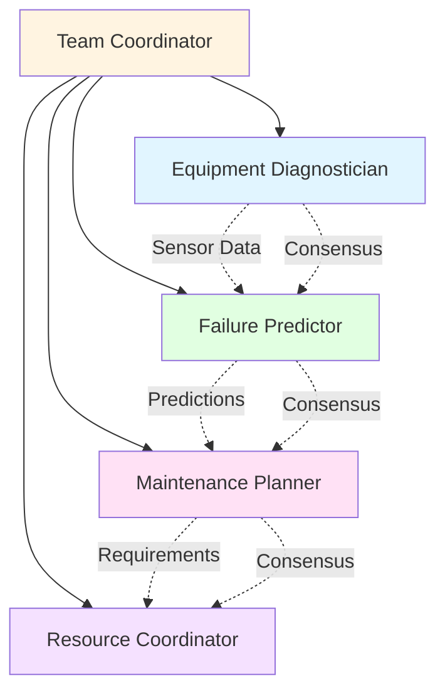
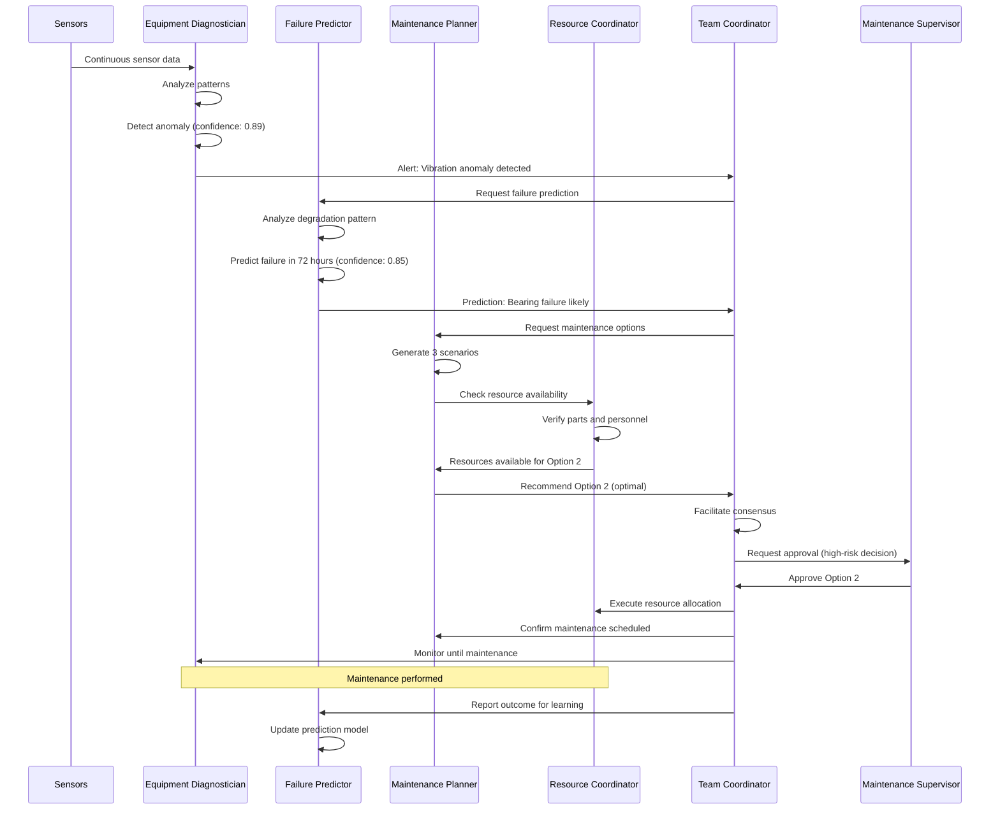

# Predictive Maintenance: Preventing Failures Before They Occur

## Overview

Predictive maintenance represents one of the most impactful applications of multi-agent systems in industrial operations. By continuously monitoring equipment health, predicting failures before they occur, and optimizing maintenance schedules, MAGS transforms reactive maintenance into a proactive, data-driven discipline that reduces downtime, extends asset life, and optimizes maintenance costs.

Traditional maintenance approaches—reactive (fix when broken) and preventive (scheduled regardless of condition)—are inefficient and costly. Reactive maintenance leads to unexpected failures and production losses. Preventive maintenance wastes resources on unnecessary interventions. Predictive maintenance, powered by MAGS, provides the optimal middle ground: intervene precisely when needed, before failure occurs.

### Why Predictive Maintenance Matters

**The Challenge**: Industrial equipment failures are costly, dangerous, and often preventable. Traditional approaches either wait for failure (reactive) or perform unnecessary maintenance (preventive).

**The Solution**: Multi-agent systems that continuously monitor equipment, predict failures with confidence scoring, and optimize maintenance timing.

**The Result**: Reduced unplanned downtime (30-50%), optimized maintenance costs (20-40% reduction), extended equipment life (20-30%), and improved safety.

### Key Business Drivers

1. **Downtime Reduction**: Unplanned downtime costs $260,000/hour in automotive manufacturing, $5M/hour in oil & gas
2. **Cost Optimization**: Maintenance represents 15-40% of production costs in heavy industry
3. **Asset Life Extension**: Proper maintenance extends equipment life by 20-30%
4. **Safety Improvement**: Equipment failures cause 42% of industrial accidents
5. **Regulatory Compliance**: Many industries require documented maintenance programs

---

## Business Context

### Industry Challenges

**Manufacturing**:
- High-speed production lines where single component failure stops entire operation
- Complex equipment with multiple failure modes
- Tight production schedules with limited maintenance windows
- Quality impact from degraded equipment performance

**Oil & Gas**:
- Remote, harsh environments with difficult access
- Critical safety implications of equipment failure
- High cost of emergency repairs and helicopter mobilization
- Environmental risks from leaks and spills

**Power Generation**:
- 24/7 operation requirements with minimal planned outages
- Catastrophic failure consequences (grid instability, blackouts)
- Long lead times for major component replacement
- Regulatory requirements for reliability

**Mining**:
- Large, expensive equipment (haul trucks, excavators, crushers)
- Remote locations with limited spare parts availability
- Production targets dependent on equipment availability
- Harsh operating conditions accelerating wear

### Traditional Approach Limitations

**Reactive Maintenance**:
- Unexpected failures disrupt production
- Emergency repairs cost 3-5x planned maintenance
- Secondary damage from catastrophic failures
- Safety risks from sudden equipment failure

**Preventive Maintenance**:
- Fixed schedules ignore actual equipment condition
- Unnecessary interventions waste resources
- "Infant mortality" from unnecessary disassembly
- Still experiences unexpected failures between intervals

**Condition-Based Monitoring**:
- Requires constant human analysis of data
- Threshold-based alerts miss complex patterns
- No failure prediction, only current state assessment
- Limited integration across systems

---

## MAGS Approach

### Multi-Agent Intelligence

MAGS transforms predictive maintenance through coordinated specialist agents that combine deep domain expertise with continuous learning:

**Equipment Diagnostician Agent**:
- Analyzes sensor data streams in real-time
- Identifies anomalies using statistical methods and pattern recognition
- Assesses equipment health across multiple parameters
- Provides confidence-scored health assessments

**Failure Predictor Agent**:
- Predicts failure probability and timeline
- Uses historical failure patterns and current conditions
- Generates multiple failure scenarios with likelihoods
- Continuously calibrates predictions against outcomes

**Maintenance Planner Agent**:
- Generates optimal maintenance schedules
- Balances multiple objectives (cost, risk, production impact)
- Considers resource constraints (parts, personnel, windows)
- Adapts plans based on changing conditions

**Resource Coordinator Agent**:
- Ensures spare parts availability
- Schedules maintenance personnel
- Coordinates with production scheduling
- Manages contractor and vendor relationships

**Team Coordinator Agent**:
- Orchestrates workflow across specialist agents
- Facilitates consensus on critical decisions
- Escalates high-risk situations appropriately
- Maintains audit trail for compliance

### Advantages Over Traditional Approaches

**Continuous Monitoring**:
- 24/7 analysis of all equipment sensors
- No human fatigue or attention lapses
- Parallel monitoring of hundreds of assets
- Immediate detection of anomalies

**Pattern Recognition**:
- Identifies complex, multi-parameter failure signatures
- Learns from historical failures across fleet
- Detects subtle degradation patterns
- Recognizes early warning signs humans miss

**Predictive Capability**:
- Forecasts failures days to weeks in advance
- Provides confidence-scored predictions
- Generates multiple scenarios with probabilities
- Enables proactive intervention

**Optimization**:
- Balances multiple competing objectives
- Considers production schedules and constraints
- Optimizes maintenance timing and approach
- Minimizes total cost of ownership

**Continuous Learning**:
- Improves predictions from every outcome
- Calibrates confidence scoring over time
- Adapts to changing operating conditions
- Shares learning across similar equipment

---

## Agent Team Structure

### Team Composition



### Agent Roles and Responsibilities

**Equipment Diagnostician Agent**

*Primary Responsibility*: Monitor equipment health and detect anomalies

*Capabilities*:
- Real-time sensor data analysis (vibration, temperature, pressure, current, etc.)
- Statistical anomaly detection (control charts, outlier detection)
- Pattern matching against known failure signatures
- Multi-parameter health assessment
- Confidence scoring for anomaly severity

*Decision Authority*:
- Autonomous: Log observations, generate health reports
- Escalate: Significant anomalies requiring investigation

*Key Metrics*:
- Anomaly detection accuracy: >95%
- False positive rate: <5%
- Detection latency: <1 minute
- Health assessment confidence: >0.85

**Failure Predictor Agent**

*Primary Responsibility*: Predict equipment failures with timeline and confidence

*Capabilities*:
- Historical failure pattern analysis
- Degradation curve modeling
- Remaining useful life (RUL) estimation
- Failure mode probability assessment
- Confidence calibration based on outcomes

*Decision Authority*:
- Autonomous: Generate predictions, update models
- Escalate: High-confidence failure predictions requiring action

*Key Metrics*:
- Prediction accuracy: >85%
- False alarm rate: <10%
- Prediction horizon: 3-14 days typical
- Confidence calibration error: <10%

**Maintenance Planner Agent**

*Primary Responsibility*: Generate optimal maintenance schedules

*Capabilities*:
- Multi-objective optimization (cost, risk, production impact)
- Constraint satisfaction (resources, windows, dependencies)
- Scenario generation and evaluation
- Plan adaptation based on changing conditions
- Trade-off analysis and recommendation

*Decision Authority*:
- Autonomous: Generate maintenance options
- Escalate: High-impact maintenance decisions requiring approval

*Key Metrics*:
- Plan optimality: >90% of theoretical optimum
- Constraint satisfaction: 100%
- Planning latency: <5 minutes
- Adaptation responsiveness: <1 hour

**Resource Coordinator Agent**

*Primary Responsibility*: Ensure resource availability for maintenance

*Capabilities*:
- Spare parts inventory management
- Personnel scheduling and skill matching
- Vendor and contractor coordination
- Tool and equipment allocation
- Lead time management

*Decision Authority*:
- Autonomous: Reserve resources, schedule personnel
- Escalate: Resource conflicts or unavailability

*Key Metrics*:
- Resource availability: >95%
- Scheduling efficiency: >90%
- Lead time accuracy: ±10%
- Conflict resolution time: <2 hours

**Team Coordinator Agent**

*Primary Responsibility*: Orchestrate team workflow and ensure consensus

*Capabilities*:
- Workflow orchestration across agents
- Consensus facilitation for critical decisions
- Escalation management for high-risk situations
- Audit trail maintenance
- Performance monitoring and optimization

*Decision Authority*:
- Autonomous: Coordinate routine workflows
- Escalate: Critical decisions requiring human approval

*Key Metrics*:
- Coordination efficiency: >90%
- Consensus achievement: >95%
- Escalation appropriateness: >95%
- Audit trail completeness: 100%

---

## Workflow

### End-to-End Process



### Detailed Step-by-Step Process

**Step 1: Continuous Monitoring (Observe)**

*Agent*: Equipment Diagnostician

*Actions*:
- Collect sensor data every 1-60 seconds (depending on criticality)
- Calculate statistical baselines and control limits
- Compare current readings to baselines
- Identify deviations exceeding thresholds
- Assess significance using memory significance scoring

*Example*:
```
Bearing vibration: 2.5 mm/s (baseline: 1.8 mm/s, limit: 2.2 mm/s)
Temperature: 75°C (baseline: 68°C, limit: 72°C)
Significance score: 0.89 (HIGH - both parameters elevated)
```

*Decision Point*: Is anomaly significant enough to investigate?
- Significance >0.7: Proceed to analysis
- Significance <0.7: Continue monitoring

**Step 2: Anomaly Analysis (Reflect)**

*Agent*: Equipment Diagnostician

*Actions*:
- Retrieve historical context from memory
- Compare to known failure patterns
- Assess multiple parameters simultaneously
- Generate health assessment with confidence
- Create detailed anomaly report

*Example*:
```
Pattern Match: 87% similarity to bearing failure signature
Historical Context: 3 similar cases in past 2 years, all led to failure
Multi-Parameter Assessment:
  - Vibration: Elevated (2.5 mm/s, +39%)
  - Temperature: Elevated (75°C, +10%)
  - Lubrication: Normal
  - Load: Normal
Health Assessment: DEGRADED (confidence: 0.89)
```

*Decision Point*: Does pattern indicate potential failure?
- Confidence >0.8: Request failure prediction
- Confidence 0.6-0.8: Continue enhanced monitoring
- Confidence <0.6: Return to normal monitoring

**Step 3: Failure Prediction (Plan)**

*Agent*: Failure Predictor

*Actions*:
- Analyze degradation rate and trajectory
- Model remaining useful life (RUL)
- Generate failure probability distribution
- Identify most likely failure mode
- Provide confidence-scored prediction

*Example*:
```
Degradation Analysis:
  - Current state: 65% of failure threshold
  - Degradation rate: 5% per day (accelerating)
  - Projected failure: 72 hours (±12 hours)

Failure Probability:
  - 24 hours: 15%
  - 48 hours: 45%
  - 72 hours: 75%
  - 96 hours: 90%

Most Likely Mode: Bearing inner race spalling
Prediction Confidence: 0.85
```

*Decision Point*: Is failure prediction confident enough to act?
- Confidence >0.8 AND probability >70%: Generate maintenance options
- Confidence 0.6-0.8: Enhanced monitoring, prepare contingency
- Confidence <0.6: Continue monitoring

**Step 4: Maintenance Planning (Plan)**

*Agent*: Maintenance Planner

*Actions*:
- Generate multiple maintenance scenarios
- Evaluate each against objective function
- Consider production schedule constraints
- Assess resource requirements
- Rank options by optimality

*Example*:
```
Option 1: Immediate Shutdown (Emergency)
  - Timing: Within 4 hours
  - Duration: 8 hours
  - Cost: $45,000 (overtime, production loss)
  - Risk: Low (prevents failure)
  - Production Impact: HIGH (unplanned shutdown)
  - Objective Score: 0.65

Option 2: Planned Shutdown (Optimal)
  - Timing: Next scheduled maintenance window (48 hours)
  - Duration: 6 hours
  - Cost: $28,000 (planned, no overtime)
  - Risk: Medium (15% failure before window)
  - Production Impact: LOW (scheduled downtime)
  - Objective Score: 0.92 ⭐

Option 3: Deferred Maintenance
  - Timing: Following maintenance cycle (7 days)
  - Duration: 6 hours
  - Cost: $25,000
  - Risk: HIGH (90% failure before window)
  - Production Impact: LOW (scheduled)
  - Objective Score: 0.45
```

*Decision Point*: Which option best balances objectives?
- Optimal score >0.85: Recommend for approval
- Multiple options close: Present alternatives for human decision
- No good options: Escalate for expert consultation

**Step 5: Resource Coordination (Act)**

*Agent*: Resource Coordinator

*Actions*:
- Verify spare parts availability
- Check personnel schedules and skills
- Confirm tool and equipment availability
- Coordinate with vendors if needed
- Reserve resources for selected option

*Example*:
```
Resource Check for Option 2:
  ✓ Bearing assembly: In stock (Warehouse B, Qty: 2)
  ✓ Maintenance technician: Available (John Smith, certified)
  ✓ Crane operator: Available (scheduled)
  ✓ Specialized tools: Available (vibration analyzer, bearing puller)
  ✓ Maintenance window: Confirmed (Saturday 06:00-14:00)
  
All resources confirmed for Option 2
```

*Decision Point*: Are all resources available?
- All available: Proceed with selected option
- Some unavailable: Adjust plan or select alternative
- Critical resources unavailable: Escalate for expediting

**Step 6: Consensus and Approval (Act)**

*Agent*: Team Coordinator

*Actions*:
- Facilitate consensus among specialist agents
- Compile recommendation with supporting evidence
- Assess decision risk level
- Escalate to human if required
- Document decision rationale

*Example*:
```
Consensus Process:
  - Equipment Diagnostician: Agrees (confidence: 0.89)
  - Failure Predictor: Agrees (confidence: 0.85)
  - Maintenance Planner: Recommends Option 2 (score: 0.92)
  - Resource Coordinator: Confirms feasibility

Team Consensus: ACHIEVED (100% agreement)
Recommendation: Option 2 - Planned maintenance in 48 hours
Risk Level: MEDIUM (requires supervisor approval)

Escalation: Maintenance Supervisor
```

*Decision Point*: Is human approval required?
- Low risk + high confidence: Autonomous execution
- Medium/high risk: Require human approval
- Critical risk: Require multiple approvals

**Step 7: Execution and Monitoring (Act)**

*Agent*: Team Coordinator + Resource Coordinator

*Actions*:
- Create work order with detailed instructions
- Allocate resources and schedule personnel
- Monitor equipment until maintenance
- Track maintenance execution
- Verify completion and quality

*Example*:
```
Work Order WO-2025-1234:
  Equipment: Pump P-101, Bearing Assembly
  Scheduled: Saturday 06:00-12:00
  Assigned: John Smith (Lead), Mike Johnson (Assistant)
  Parts: Bearing SKF-6312 (Serial: B-45678)
  Procedure: MP-101-B (Bearing Replacement)
  
Pre-Maintenance Monitoring:
  - Hour 0: Vibration 2.5 mm/s, Temp 75°C
  - Hour 24: Vibration 2.8 mm/s, Temp 77°C (degrading as predicted)
  - Hour 48: Maintenance performed
  
Post-Maintenance Verification:
  - Vibration: 0.9 mm/s (excellent)
  - Temperature: 65°C (normal)
  - Status: HEALTHY
```

**Step 8: Outcome Learning (Reflect)**

*Agent*: Failure Predictor + Equipment Diagnostician

*Actions*:
- Compare prediction to actual outcome
- Assess prediction accuracy
- Calibrate confidence scoring
- Update failure pattern models
- Share learning with similar equipment

*Example*:
```
Outcome Analysis:
  - Predicted failure: 72 hours (±12 hours)
  - Actual condition at maintenance: 48 hours
  - Bearing condition: Advanced spalling confirmed
  - Prediction accuracy: GOOD (within confidence interval)
  
Learning Updates:
  ✓ Degradation rate model refined (+5% accuracy)
  ✓ Confidence calibration adjusted
  ✓ Pattern library updated with new case
  ✓ Similar equipment monitoring enhanced
  
Model Improvement: +3% prediction accuracy
```

---

## Capabilities Applied

### Cognitive Intelligence Capabilities

**Memory Significance (Critical)**

*Application*: Identifying which sensor readings and patterns are significant

*How Used*:
- Calculates importance and surprise scores for sensor data
- Identifies unusual patterns requiring attention
- Filters noise from meaningful signals
- Prioritizes anomalies by significance

*Example*:
```
Vibration reading 2.5 mm/s:
  - Importance: 0.92 (critical parameter for rotating equipment)
  - Surprise: 0.85 (39% above baseline, unusual)
  - Significance: 0.89 (HIGH - requires investigation)
```

**Synthetic Memory (Critical)**

*Application*: Creating failure prediction models from historical data

*How Used*:
- Synthesizes patterns from past failures
- Generates failure signatures for pattern matching
- Creates degradation models for RUL estimation
- Builds confidence calibration models

*Example*:
```
Bearing Failure Pattern (synthesized from 47 historical cases):
  - Early stage: Vibration +20-30%, Temperature +5-8°C
  - Middle stage: Vibration +30-50%, Temperature +8-12°C
  - Late stage: Vibration +50-100%, Temperature +12-20°C
  - Typical progression: 5-14 days from detection to failure
```

**Content Processing (Important)**

*Application*: Understanding equipment-specific data and context

*How Used*:
- Interprets sensor data in equipment context
- Understands maintenance history and procedures
- Processes technical documentation
- Extracts relevant information from work orders

**Confidence Scoring (Critical)**

*Application*: Assessing reliability of predictions and decisions

*How Used*:
- Scores anomaly detection confidence
- Calibrates failure prediction confidence
- Evaluates maintenance plan optimality
- Enables risk-based decision gating

*Example*:
```
Failure Prediction Confidence: 0.85
  - Pattern match strength: 0.87
  - Historical accuracy: 0.88
  - Data quality: 0.95
  - Model uncertainty: 0.15
  
Confidence interpretation: HIGH - suitable for autonomous action
```

**Plan Adaptation (Important)**

*Application*: Adjusting maintenance plans based on changing conditions

*How Used*:
- Adapts to production schedule changes
- Responds to resource availability changes
- Adjusts for equipment condition changes
- Optimizes timing based on new information

### Decision Orchestration Capabilities

**Consensus Management (Critical)**

*Application*: Coordinating decisions across specialist agents

*How Used*:
- Facilitates agreement on maintenance timing
- Resolves conflicts between objectives
- Ensures all agents align on recommendations
- Documents consensus rationale

*Example*:
```
Consensus Vote on Maintenance Timing:
  - Equipment Diagnostician: Option 2 (confidence: 0.89)
  - Failure Predictor: Option 2 (confidence: 0.85)
  - Maintenance Planner: Option 2 (score: 0.92)
  - Resource Coordinator: Option 2 (feasible)
  
Result: UNANIMOUS consensus for Option 2
```

**Communication Framework (Important)**

*Application*: Sharing information between agents and with humans

*How Used*:
- Publishes health assessments to team
- Shares predictions with planners
- Communicates plans to coordinators
- Generates human-readable reports

### Performance Optimization Capabilities

**Goal Optimization (Critical)**

*Application*: Balancing multiple maintenance objectives

*How Used*:
- Optimizes cost vs. risk vs. production impact
- Balances short-term and long-term objectives
- Considers multiple stakeholder priorities
- Generates Pareto-optimal solutions

*Example*:
```
Objective Function for Maintenance Planning:
  - Minimize cost: Weight 0.3
  - Minimize risk: Weight 0.4
  - Minimize production impact: Weight 0.3
  
Option 2 scores:
  - Cost: 0.85 ($28K vs. $45K emergency)
  - Risk: 0.90 (15% failure probability acceptable)
  - Production: 0.95 (scheduled window, minimal impact)
  - Overall: 0.92 (optimal)
```

**Plan Optimization (Important)**

*Application*: Generating optimal maintenance schedules

*How Used*:
- Evaluates multiple maintenance scenarios
- Considers constraints and dependencies
- Optimizes resource allocation
- Generates implementation plans

### Integration & Execution Capabilities

**DataStream Integration (Critical)**

*Application*: Continuous equipment monitoring

*How Used*:
- Connects to sensor data streams
- Processes real-time equipment data
- Integrates with SCADA/DCS systems
- Handles multiple data sources

**Tool Orchestration (Important)**

*Application*: Creating and managing work orders

*How Used*:
- Generates work orders in CMMS
- Updates maintenance schedules
- Triggers notifications
- Integrates with ERP systems

**Telemetry and Monitoring (Important)**

*Application*: Tracking prediction accuracy and system performance

*How Used*:
- Monitors prediction accuracy over time
- Tracks maintenance effectiveness
- Measures cost savings and downtime reduction
- Enables continuous improvement

---

## Implementation

### Getting Started

**Phase 1: Pilot Equipment Selection (Weeks 1-2)**

*Objective*: Select 3-5 critical assets for initial deployment

*Criteria*:
- High business impact (downtime cost >$50K/hour)
- Good sensor coverage (vibration, temperature, pressure)
- Historical failure data available
- Maintenance team buy-in

*Activities*:
- Identify candidate equipment
- Assess data availability and quality
- Validate sensor infrastructure
- Secure stakeholder commitment

**Phase 2: Data Integration (Weeks 3-4)**

*Objective*: Connect MAGS to equipment data sources

*Activities*:
- Configure DataStream connections to sensors
- Integrate with CMMS/ERP systems
- Set up data quality monitoring
- Establish baseline operating parameters

*Technical Requirements*:
- Real-time sensor data access (1-60 second intervals)
- Historical data (minimum 6 months, preferably 2+ years)
- Maintenance history and work orders
- Equipment specifications and failure modes

**Phase 3: Agent Configuration (Weeks 5-6)**

*Objective*: Configure and train agent team

*Activities*:
- Configure Equipment Diagnostician with equipment-specific parameters
- Train Failure Predictor on historical failure data
- Set up Maintenance Planner with constraints and objectives
- Configure Resource Coordinator with inventory and personnel data
- Establish Team Coordinator workflows

*Configuration Example*:
```json
{
  "equipment_diagnostician": {
    "equipment_id": "PUMP-P-101",
    "parameters": {
      "vibration_baseline": 1.8,
      "vibration_limit": 2.2,
      "temperature_baseline": 68,
      "temperature_limit": 72
    },
    "anomaly_threshold": 0.7
  },
  "failure_predictor": {
    "failure_modes": ["bearing", "seal", "impeller"],
    "prediction_horizon": "14_days",
    "confidence_threshold": 0.8
  }
}
```

**Phase 4: Validation and Tuning (Weeks 7-8)**

*Objective*: Validate predictions and tune parameters

*Activities*:
- Run in monitoring-only mode (no autonomous actions)
- Validate anomaly detection against expert judgment
- Calibrate confidence scoring
- Tune objective function weights
- Adjust thresholds and parameters

*Success Criteria*:
- Anomaly detection accuracy >90%
- False positive rate <10%
- Expert agreement with predictions >85%
- Confidence calibration error <15%

**Phase 5: Gradual Autonomy (Weeks 9-12)**

*Objective*: Progressively enable autonomous operation

*Activities*:
- Week 9: Enable autonomous monitoring and alerting
- Week 10: Enable autonomous prediction generation
- Week 11: Enable autonomous maintenance planning
- Week 12: Enable autonomous resource coordination (with approval)

*Autonomy Gating*:
- Start with human approval for all actions
- Gradually increase autonomy based on performance
- Maintain human oversight for high-risk decisions
- Full autonomy only after proven reliability

### Integration Points

**CMMS/EAM Systems**:
- Read: Equipment master data, maintenance history, work orders
- Write: Create work orders, update schedules, log predictions

**SCADA/DCS Systems**:
- Read: Real-time sensor data, equipment status, alarms
- Write: None (monitoring only for safety)

**ERP Systems**:
- Read: Spare parts inventory, personnel schedules, costs
- Write: Reserve parts, schedule resources

**Notification Systems**:
- Write: Alerts, recommendations, status updates

### Deployment Considerations

**Infrastructure Requirements**:
- Compute: Moderate (real-time processing, ML inference)
- Storage: Significant (sensor data, historical patterns)
- Network: Reliable connectivity to data sources
- Latency: <1 minute for anomaly detection

**Security Considerations**:
- Read-only access to operational systems (SCADA/DCS)
- Authenticated API access to enterprise systems
- Encrypted data transmission
- Audit logging for all decisions

**Scalability**:
- Start with 3-5 critical assets
- Expand to 20-50 assets after validation
- Scale to hundreds of assets with proven ROI
- Use horizontal scaling for large deployments

---

## Measuring Success

### Key Performance Indicators

**Operational Metrics**:

```
Unplanned Downtime Reduction:
  Baseline: 120 hours/year
  Target: <60 hours/year (50% reduction)
  Measurement: Track unplanned equipment failures

Prediction Accuracy:
  Target: >85% of predictions correct
  Measurement: Compare predictions to actual outcomes

Maintenance Cost Reduction:
  Baseline: $500K/year
  Target: <$350K/year (30% reduction)
  Measurement: Track total maintenance spend

Equipment Availability:
  Baseline: 92%
  Target: >96%
  Measurement: (Operating Hours / Total Hours) × 100%
```

**Agent Performance Metrics**:

```
Anomaly Detection:
  - Detection accuracy: >95%
  - False positive rate: <5%
  - Detection latency: <1 minute
  - Significance scoring accuracy: >90%

Failure Prediction:
  - Prediction accuracy: >85%
  - False alarm rate: <10%
  - Prediction horizon: 3-14 days
  - Confidence calibration error: <10%

Maintenance Planning:
  - Plan optimality: >90%
  - Constraint satisfaction: 100%
  - Planning latency: <5 minutes
  - Resource utilization: 80-90%

Team Coordination:
  - Consensus achievement: >95%
  - Coordination efficiency: >90%
  - Escalation appropriateness: >95%
  - Decision latency: <15 minutes
```

**Business Impact Metrics**:

```
Return on Investment:
  - Cost savings: $150K-$300K/year per critical asset
  - Implementation cost: $50K-$100K per asset
  - Payback period: 4-8 months
  - 3-year ROI: 300-500%

Safety Improvements:
  - Equipment-related incidents: -60%
  - Near-miss events: -40%
  - Safety compliance: 100%

Quality Impact:
  - Quality defects from equipment: -30%
  - Product consistency: +15%
  - Scrap reduction: -20%
```

### Continuous Improvement

**Monthly Reviews**:
- Prediction accuracy trends
- False positive/negative analysis
- Cost savings achieved
- Lessons learned

**Quarterly Optimization**:
- Confidence calibration refinement
- Objective function tuning
- Threshold adjustments
- Capability enhancements

**Annual Assessment**:
- ROI validation
- Expansion planning
- Technology updates
- Strategic alignment

---

## Variations

### Industry-Specific Adaptations

**Manufacturing - High-Speed Production Lines**

*Focus*: Minimize production disruptions

*Adaptations*:
- Shorter prediction horizons (hours vs. days)
- Higher confidence thresholds for line stops
- Emphasis on production schedule integration
- Quick-change maintenance strategies

*Example*:
```
Automotive Assembly Line:
  - Equipment: Robotic welders (24 units)
  - Criticality: Line stop if any unit fails
  - Prediction horizon: 4-24 hours
  - Maintenance windows: Shift changes only (30 min)
  - Confidence threshold: >0.95 for line stop
```

**Oil & Gas - Remote Operations**

*Focus*: Minimize mobilization costs and safety risks

*Adaptations*:
- Longer prediction horizons (weeks)
- Emphasis on preventive intervention
- Logistics coordination for remote sites
- Safety-critical equipment prioritization

*Example*:
```
Offshore Platform Compressor:
  - Location: 200 km offshore
  - Mobilization cost: $50K (helicopter, crew)
  - Prediction horizon: 14-30 days
  - Maintenance approach: Combine multiple repairs
  - Risk tolerance: Very low (safety critical)
```

**Power Generation - Continuous Operation**

*Focus*: Maximize availability, minimize forced outages

*Adaptations*:
- Integration with grid demand forecasting
- Planned outage optimization
- Regulatory compliance emphasis
- Long-term asset management

*Example*:
```
Gas Turbine Generator:
  - Capacity: 250 MW
  - Outage cost: $5M/day (replacement power)
  - Prediction horizon: 30-90 days
  - Maintenance windows: Low-demand periods
  - Regulatory requirements: Documented reliability program
```

---

## Related Documentation

### Core Concepts
- [ORPA Cycle](../concepts/orpa-cycle.md) - Observe-Reflect-Plan-Act framework
- [Memory Systems](../concepts/memory-systems.md) - How agents remember and learn
- [Decision Making](../concepts/decision-making.md) - Agent decision frameworks

### Cognitive Intelligence
- [Memory Significance](../cognitive-intelligence/memory-significance.md) - Identifying significant patterns
- [Synthetic Memory](../cognitive-intelligence/synthetic-memory.md) - Creating predictive models
- [Confidence Scoring](../cognitive-intelligence/confidence-scoring.md) - Assessing prediction reliability
- [Plan Adaptation](../cognitive-intelligence/plan-adaptation.md) - Adapting to changing conditions

### Decision Orchestration
- [Consensus Management](../decision-orchestration/consensus-management.md) - Coordinating team decisions
- [Communication Framework](../decision-orchestration/communication-framework.md) - Agent communication

### Performance Optimization
- [Goal Optimization](../performance-optimization/goal-optimization.md) - Multi-objective optimization
- [Plan Optimization](../performance-optimization/plan-optimization.md) - Optimal scheduling

### Design Patterns
- [Agent Team Patterns](../design-patterns/agent-team-patterns.md) - Team composition strategies
- [Decision Patterns](../design-patterns/decision-patterns.md) - Decision-making approaches

### Best Practices
- [Agent Design Principles](../best-practices/agent-design-principles.md) - Effective agent design
- [Team Composition](../best-practices/team-composition.md) - Building effective teams
- [Objective Function Design](../best-practices/objective-function-design.md) - Defining optimization goals

### Other Use Cases
- [Process Optimization](process-optimization.md) - Continuous improvement
- [Quality Management](quality-management.md) - Quality assurance
- [Root Cause Analysis](root-cause-analysis.md) - Problem investigation

---

## References

### Predictive Maintenance Research
- Mobley, R. K. (2002). "An Introduction to Predictive Maintenance" (2nd ed.). Butterworth-Heinemann
- Jardine, A. K., Lin, D., & Banjevic, D. (2006). "A review on machinery diagnostics and prognostics implementing condition-based maintenance". Mechanical Systems and Signal Processing, 20(7), 1483-1510
- Lee, J., Wu, F., Zhao, W., Ghaffari, M., Liao, L., & Siegel, D. (2014). "Prognostics and health management design for rotary machinery systems—Reviews, methodology and applications". Mechanical Systems and Signal Processing, 42(1-2), 314-334

### Multi-Agent Systems
- Wooldridge, M. (2009). "An Introduction to MultiAgent Systems" (2nd ed.). John Wiley & Sons
- Ferber, J. (1999). "Multi-Agent Systems: An Introduction to Distributed Artificial Intelligence". Addison-Wesley

### Industrial Applications
- Vachtsevanos, G., Lewis, F. L., Roemer, M., Hess, A., & Wu, B. (2006). "Intelligent Fault Diagnosis and Prognosis for Engineering Systems". John Wiley & Sons
- Heng, A., Zhang, S., Tan, A. C., & Mathew, J. (2009). "Rotating machinery prognostics: State of the art, challenges and opportunities". Mechanical Systems and Signal Processing, 23(3), 724-739

### Optimization Theory
- Deb, K. (2001). "Multi-Objective Optimization using Evolutionary Algorithms". John Wiley & Sons
- Boyd, S., & Vandenberghe, L. (2004). "Convex Optimization". Cambridge University Press

### Reliability Engineering
- Moubray, J. (1997). "Reliability-Centered Maintenance" (2nd ed.). Industrial Press
- Nowlan, F. S., & Heap, H. F. (1978). "Reliability-Centered Maintenance". United Airlines

### Machine Learning for Predictive Maintenance
- Susto, G. A., Schirru, A., Pampuri, S., McLoone, S., & Beghi, A. (2015). "Machine learning for predictive maintenance: A multiple classifier approach". IEEE Transactions on Industrial Informatics, 11(3), 812-820
- Carvalho, T. P., Soares, F. A., Vita, R., Francisco, R. D. P., Basto, J. P., & Alcalá, S. G. (2019). "A systematic literature review of machine learning methods applied to predictive maintenance". Computers & Industrial Engineering, 137, 106024

---

**Document Version**: 2.0
**Last Updated**: December 6, 2025
**Status**: ✅ Enhanced to Match Phases 1-4 Quality Standard